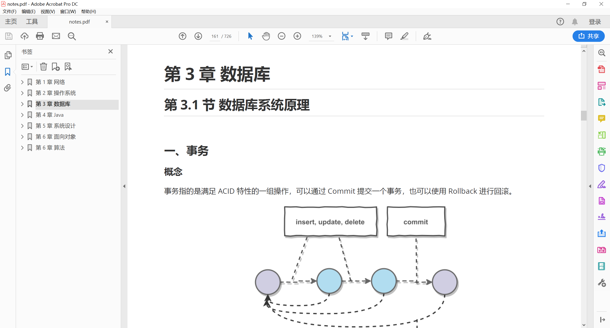
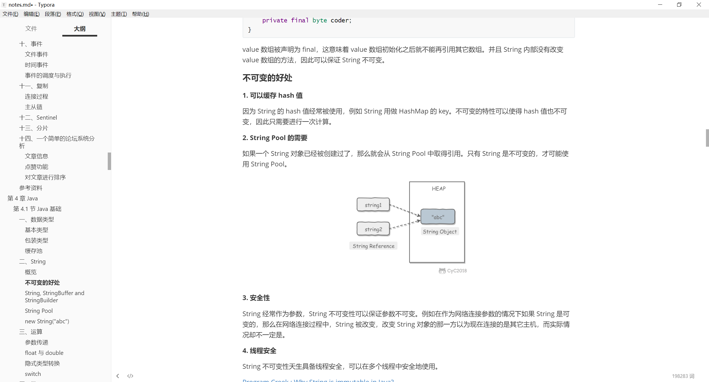
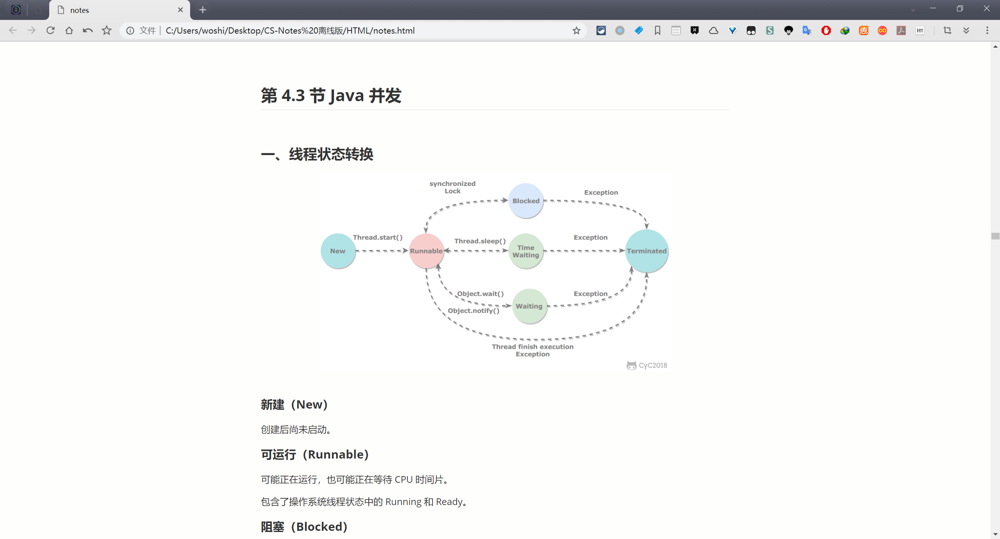

# 目的

考虑到有部分读者的网络环境较差，有时候在线访问速度很慢，导致阅读体验不佳。另外，PDF 等格式的离线版本相比于网页在线版本更方便做笔记。因此提供离线阅读版本给大家下载。

# 内容

有三种格式的离线版本：PDF、Markdown 和 HTML 。

## PDF

优点是方便做笔记；缺点是不能显示 GIF 图片（所以“剑指 Offer 题解”不建议使用 PDF 进行阅读），以及显示效果不佳。

## Markdown

优点是能很好地显示 GIF 图片，显示效果也很好；缺点是由于将所有内容整合在同一个文件中，导致实时渲染有点卡顿。

## HTML

优点是和 Markdown 的显示效果几乎一致，同时不需要 Markdown 的实时渲染，因此浏览速度更快；缺点是目录功能还不是很完善。

如果想在安卓手机端阅读，推荐使用这种格式，将 html 文件和图片文件都复制到手机上，用浏览器打开 html 文件并存成书签，以后就可以快速地离线阅读。

# 如何下载

离线版本由公众号 **CyC2018** 发布，最新版本也会在上面及时发布，在后台回复 **CyC** 即可获取下载链接。

</img>

