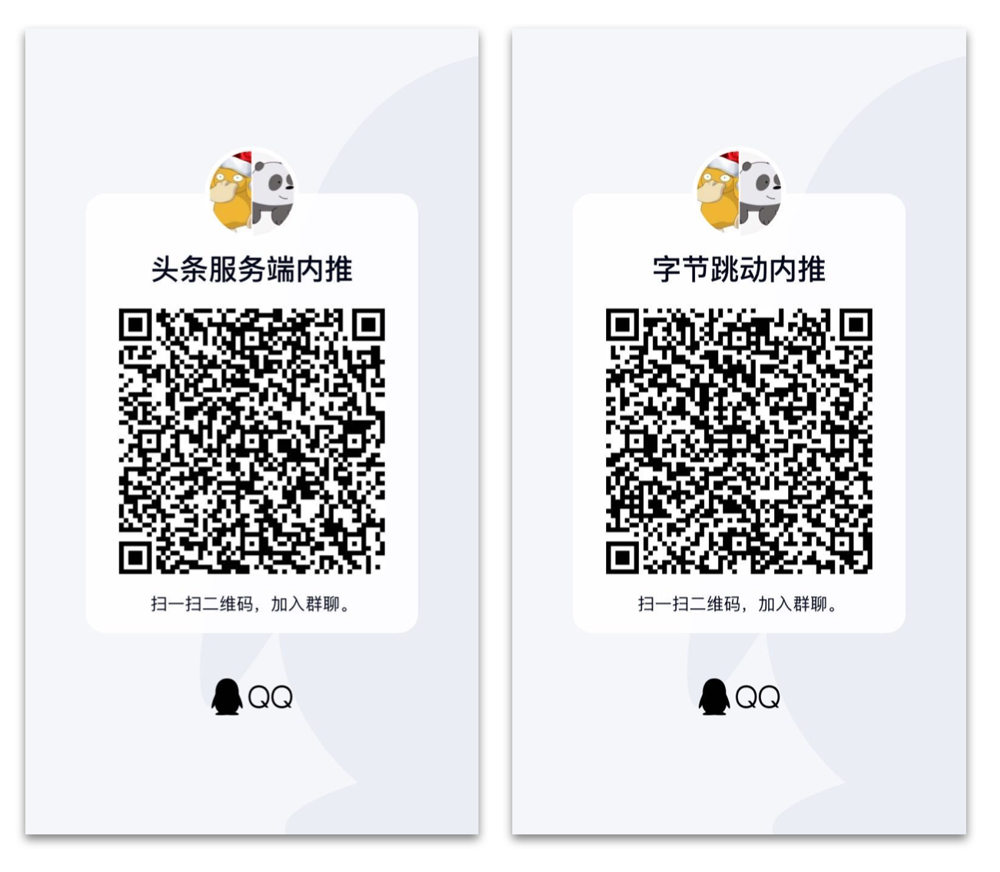
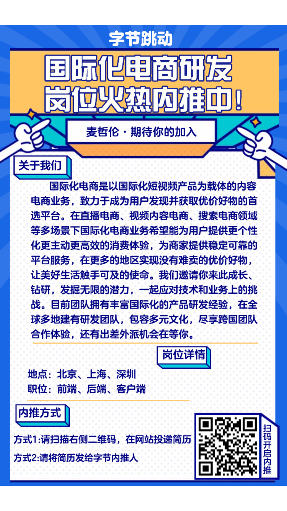
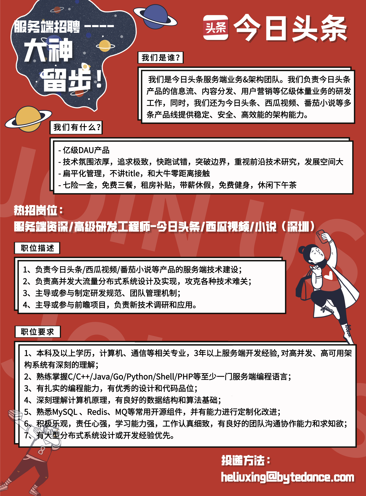

# 内推群

加群可帮查内推进度，简历修改建议。如果投递我所在的深圳头条服务端团队，可加第一个群，其它的加第二个群。

 

# 校招

[校招岗位信息](https://jobs.bytedance.com/campus/position?keywords=&category=6704215862557018372&location=&project=&type=2%2C3&job_hot_flag=&current=1&limit=10&referral_code=KHTRBTP)

直接进入上面的链接并投递，就算内推，然后加群即可查看内推进度。

# 国际化电商团队

 

# 社招

[社招岗位信息](https://jobs.bytedance.com/experienced/position?keywords=&category=&location=&project=&type=&job_hot_flag=&current=1&limit=10)

先看好要投递的岗位，加群后再私聊我。

# 内推到我的部门

## 校招

[校招链接内推链接](https://jobs.bytedance.com/referral/pc/position/detail/?token=MTsxNjE2MDA2MzM2NzU2OzY3MTMzMjUzMjEwMTk2MDY1MzY7NjkwODkxNzY0NTIxMjkxMTg3OQ)，备注“深圳头条服务端”。

## 社招

可直接把简历发送到 heliuxing@bytedance.com。

 
