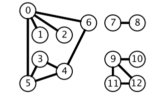
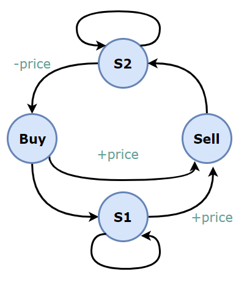

[🎉 面试进阶专栏已上线](https://xiaozhuanlan.com/CyC2018)
<!-- GFM-TOC -->
* [算法思想](#算法思想)
    * [双指针](#双指针)
    * [排序](#排序)
        * [快速选择](#快速选择)
        * [堆排序](#堆排序)
        * [桶排序](#桶排序)
        * [荷兰国旗问题](#荷兰国旗问题)
    * [贪心思想](#贪心思想)
    * [二分查找](#二分查找)
    * [分治](#分治)
    * [搜索](#搜索)
        * [BFS](#bfs)
        * [DFS](#dfs)
        * [Backtracking](#backtracking)
    * [动态规划](#动态规划)
        * [斐波那契数列](#斐波那契数列)
        * [矩阵路径](#矩阵路径)
        * [数组区间](#数组区间)
        * [分割整数](#分割整数)
        * [最长递增子序列](#最长递增子序列)
        * [最长公共子序列](#最长公共子序列)
        * [0-1 背包](#0-1-背包)
        * [股票交易](#股票交易)
        * [字符串编辑](#字符串编辑)
    * [数学](#数学)
        * [素数](#素数)
        * [最大公约数](#最大公约数)
        * [进制转换](#进制转换)
        * [阶乘](#阶乘)
        * [字符串加法减法](#字符串加法减法)
        * [相遇问题](#相遇问题)
        * [多数投票问题](#多数投票问题)
        * [其它](#其它)
* [数据结构相关](#数据结构相关)
    * [链表](#链表)
    * [树](#树)
        * [递归](#递归)
        * [层次遍历](#层次遍历)
        * [前中后序遍历](#前中后序遍历)
        * [BST](#bst)
        * [Trie](#trie)
    * [栈和队列](#栈和队列)
    * [哈希表](#哈希表)
    * [字符串](#字符串)
    * [数组与矩阵](#数组与矩阵)
    * [图](#图)
        * [二分图](#二分图)
        * [拓扑排序](#拓扑排序)
        * [并查集](#并查集)
    * [位运算](#位运算)
* [参考资料](#参考资料)
<!-- GFM-TOC -->


# 算法思想

## 双指针

双指针主要用于遍历数组，两个指针指向不同的元素，从而协同完成任务。

**有序数组的 Two Sum** 

[Leetcode ：167. Two Sum II - Input array is sorted (Easy)](https://leetcode.com/problems/two-sum-ii-input-array-is-sorted/description/)

```html
Input: numbers={2, 7, 11, 15}, target=9
Output: index1=1, index2=2
```

题目描述：在有序数组中找出两个数，使它们的和为 target。

使用双指针，一个指针指向值较小的元素，一个指针指向值较大的元素。指向较小元素的指针从头向尾遍历，指向较大元素的指针从尾向头遍历。

- 如果两个指针指向元素的和 sum == target，那么得到要求的结果；
- 如果 sum > target，移动较大的元素，使 sum 变小一些；
- 如果 sum < target，移动较小的元素，使 sum 变大一些。

```java
public int[] twoSum(int[] numbers, int target) {
    int i = 0, j = numbers.length - 1;
    while (i < j) {
        int sum = numbers[i] + numbers[j];
        if (sum == target) {
            return new int[]{i + 1, j + 1};
        } else if (sum < target) {
            i++;
        } else {
            j--;
        }
    }
    return null;
}
```

**两数平方和** 

[633. Sum of Square Numbers (Easy)](https://leetcode.com/problems/sum-of-square-numbers/description/)

```html
Input: 5
Output: True
Explanation: 1 * 1 + 2 * 2 = 5
```

题目描述：判断一个数是否为两个数的平方和。

```java
public boolean judgeSquareSum(int c) {
    int i = 0, j = (int) Math.sqrt(c);
    while (i <= j) {
        int powSum = i * i + j * j;
        if (powSum == c) {
            return true;
        } else if (powSum > c) {
            j--;
        } else {
            i++;
        }
    }
    return false;
}
```

**反转字符串中的元音字符** 

[345. Reverse Vowels of a String (Easy)](https://leetcode.com/problems/reverse-vowels-of-a-string/description/)

```html
Given s = "leetcode", return "leotcede".
```

使用双指针指向待反转的两个元音字符，一个指针从头向尾遍历，一个指针从尾到头遍历。

```java
private final static HashSet<Character> vowels = new HashSet<>(Arrays.asList('a', 'e', 'i', 'o', 'u', 'A', 'E', 'I', 'O', 'U'));

public String reverseVowels(String s) {
    int i = 0, j = s.length() - 1;
    char[] result = new char[s.length()];
    while (i <= j) {
        char ci = s.charAt(i);
        char cj = s.charAt(j);
        if (!vowels.contains(ci)) {
            result[i++] = ci;
        } else if (!vowels.contains(cj)) {
            result[j--] = cj;
        } else {
            result[i++] = cj;
            result[j--] = ci;
        }
    }
    return new String(result);
}
```

**回文字符串** 

[680. Valid Palindrome II (Easy)](https://leetcode.com/problems/valid-palindrome-ii/description/)

```html
Input: "abca"
Output: True
Explanation: You could delete the character 'c'.
```

题目描述：可以删除一个字符，判断是否能构成回文字符串。

```java
public boolean validPalindrome(String s) {
    int i = -1, j = s.length();
    while (++i < --j) {
        if (s.charAt(i) != s.charAt(j)) {
            return isPalindrome(s, i, j - 1) || isPalindrome(s, i + 1, j);
        }
    }
    return true;
}

private boolean isPalindrome(String s, int i, int j) {
    while (i < j) {
        if (s.charAt(i++) != s.charAt(j--)) {
            return false;
        }
    }
    return true;
}
```

**归并两个有序数组** 

[88. Merge Sorted Array (Easy)](https://leetcode.com/problems/merge-sorted-array/description/)

```html
Input:
nums1 = [1,2,3,0,0,0], m = 3
nums2 = [2,5,6],       n = 3

Output: [1,2,2,3,5,6]
```

题目描述：把归并结果存到第一个数组上。

需要从尾开始遍历，否则在 nums1 上归并得到的值会覆盖还未进行归并比较的值。

```java
public void merge(int[] nums1, int m, int[] nums2, int n) {
    int index1 = m - 1, index2 = n - 1;
    int indexMerge = m + n - 1;
    while (index1 >= 0 || index2 >= 0) {
        if (index1 < 0) {
            nums1[indexMerge--] = nums2[index2--];
        } else if (index2 < 0) {
            nums1[indexMerge--] = nums1[index1--];
        } else if (nums1[index1] > nums2[index2]) {
            nums1[indexMerge--] = nums1[index1--];
        } else {
            nums1[indexMerge--] = nums2[index2--];
        }
    }
}
```

**判断链表是否存在环** 

[141. Linked List Cycle (Easy)](https://leetcode.com/problems/linked-list-cycle/description/)

使用双指针，一个指针每次移动一个节点，一个指针每次移动两个节点，如果存在环，那么这两个指针一定会相遇。

```java
public boolean hasCycle(ListNode head) {
    if (head == null) {
        return false;
    }
    ListNode l1 = head, l2 = head.next;
    while (l1 != null && l2 != null && l2.next != null) {
        if (l1 == l2) {
            return true;
        }
        l1 = l1.next;
        l2 = l2.next.next;
    }
    return false;
}
```

**最长子序列** 

[524. Longest Word in Dictionary through Deleting (Medium)](https://leetcode.com/problems/longest-word-in-dictionary-through-deleting/description/)

```
Input:
s = "abpcplea", d = ["ale","apple","monkey","plea"]

Output:
"apple"
```

题目描述：删除 s 中的一些字符，使得它构成字符串列表 d 中的一个字符串，找出能构成的最长字符串。如果有多个相同长度的结果，返回字典序的最小字符串。

```java
public String findLongestWord(String s, List<String> d) {
    String longestWord = "";
    for (String target : d) {
        int l1 = longestWord.length(), l2 = target.length();
        if (l1 > l2 || (l1 == l2 && longestWord.compareTo(target) < 0)) {
            continue;
        }
        if (isValid(s, target)) {
            longestWord = target;
        }
    }
    return longestWord;
}

private boolean isValid(String s, String target) {
    int i = 0, j = 0;
    while (i < s.length() && j < target.length()) {
        if (s.charAt(i) == target.charAt(j)) {
            j++;
        }
        i++;
    }
    return j == target.length();
}
```

## 排序

### 快速选择

用于求解  **Kth Element**  问题，使用快速排序的 partition() 进行实现。

需要先打乱数组，否则最坏情况下时间复杂度为 O(N<sup>2</sup>)。

### 堆排序

用于求解  **TopK Elements**  问题，通过维护一个大小为 K 的堆，堆中的元素就是 TopK Elements。

堆排序也可以用于求解 Kth Element 问题，堆顶元素就是 Kth Element。

快速选择也可以求解 TopK Elements 问题，因为找到 Kth Element 之后，再遍历一次数组，所有小于等于 Kth Element 的元素都是 TopK Elements。

可以看到，快速选择和堆排序都可以求解 Kth Element 和 TopK Elements 问题。

**Kth Element** 

[215. Kth Largest Element in an Array (Medium)](https://leetcode.com/problems/kth-largest-element-in-an-array/description/)

题目描述：找到第 k 大的元素。

**排序** ：时间复杂度 O(NlogN)，空间复杂度 O(1)

```java
public int findKthLargest(int[] nums, int k) {
    Arrays.sort(nums);
    return nums[nums.length - k];
}
```

**堆排序** ：时间复杂度 O(NlogK)，空间复杂度 O(K)。

```java
public int findKthLargest(int[] nums, int k) {
    PriorityQueue<Integer> pq = new PriorityQueue<>(); // 小顶堆
    for (int val : nums) {
        pq.add(val);
        if (pq.size() > k)  // 维护堆的大小为 K
            pq.poll();
    }
    return pq.peek();
}
```

**快速选择** ：时间复杂度 O(N)，空间复杂度 O(1)

```java
public int findKthLargest(int[] nums, int k) {
    k = nums.length - k;
    int l = 0, h = nums.length - 1;
    while (l < h) {
        int j = partition(nums, l, h);
        if (j == k) {
            break;
        } else if (j < k) {
            l = j + 1;
        } else {
            h = j - 1;
        }
    }
    return nums[k];
}

private int partition(int[] a, int l, int h) {
    int i = l, j = h + 1;
    while (true) {
        while (a[++i] < a[l] && i < h) ;
        while (a[--j] > a[l] && j > l) ;
        if (i >= j) {
            break;
        }
        swap(a, i, j);
    }
    swap(a, l, j);
    return j;
}

private void swap(int[] a, int i, int j) {
    int t = a[i];
    a[i] = a[j];
    a[j] = t;
}
```

### 桶排序

**出现频率最多的 k 个数** 

[347. Top K Frequent Elements (Medium)](https://leetcode.com/problems/top-k-frequent-elements/description/)

```html
Given [1,1,1,2,2,3] and k = 2, return [1,2].
```

设置若干个桶，每个桶存储出现频率相同的数，并且桶的下标代表桶中数出现的频率，即第 i 个桶中存储的数出现的频率为 i。

把数都放到桶之后，从后向前遍历桶，最先得到的 k 个数就是出现频率最多的的 k 个数。

```java
public List<Integer> topKFrequent(int[] nums, int k) {
    Map<Integer, Integer> frequencyForNum = new HashMap<>();
    for (int num : nums) {
        frequencyForNum.put(num, frequencyForNum.getOrDefault(num, 0) + 1);
    }
    List<Integer>[] buckets = new ArrayList[nums.length + 1];
    for (int key : frequencyForNum.keySet()) {
        int frequency = frequencyForNum.get(key);
        if (buckets[frequency] == null) {
            buckets[frequency] = new ArrayList<>();
        }
        buckets[frequency].add(key);
    }
    List<Integer> topK = new ArrayList<>();
    for (int i = buckets.length - 1; i >= 0 && topK.size() < k; i--) {
        if (buckets[i] != null) {
            topK.addAll(buckets[i]);
        }
    }
    return topK;
}
```

**按照字符出现次数对字符串排序** 

[451. Sort Characters By Frequency (Medium)](https://leetcode.com/problems/sort-characters-by-frequency/description/)

```html
Input:
"tree"

Output:
"eert"

Explanation:
'e' appears twice while 'r' and 't' both appear once.
So 'e' must appear before both 'r' and 't'. Therefore "eetr" is also a valid answer.
```

```java
public String frequencySort(String s) {
    Map<Character, Integer> frequencyForNum = new HashMap<>();
    for (char c : s.toCharArray())
        frequencyForNum.put(c, frequencyForNum.getOrDefault(c, 0) + 1);

    List<Character>[] frequencyBucket = new ArrayList[s.length() + 1];
    for (char c : frequencyForNum.keySet()) {
        int f = frequencyForNum.get(c);
        if (frequencyBucket[f] == null) {
            frequencyBucket[f] = new ArrayList<>();
        }
        frequencyBucket[f].add(c);
    }
    StringBuilder str = new StringBuilder();
    for (int i = frequencyBucket.length - 1; i >= 0; i--) {
        if (frequencyBucket[i] == null) {
            continue;
        }
        for (char c : frequencyBucket[i]) {
            for (int j = 0; j < i; j++) {
                str.append(c);
            }
        }
    }
    return str.toString();
}
```

### 荷兰国旗问题

荷兰国旗包含三种颜色：红、白、蓝。

有三种颜色的球，算法的目标是将这三种球按颜色顺序正确地排列。

它其实是三向切分快速排序的一种变种，在三向切分快速排序中，每次切分都将数组分成三个区间：小于切分元素、等于切分元素、大于切分元素，而该算法是将数组分成三个区间：等于红色、等于白色、等于蓝色。

<div align="center">  </div><br>

**按颜色进行排序** 

[75. Sort Colors (Medium)](https://leetcode.com/problems/sort-colors/description/)

```html
Input: [2,0,2,1,1,0]
Output: [0,0,1,1,2,2]
```

题目描述：只有 0/1/2 三种颜色。

```java
public void sortColors(int[] nums) {
    int zero = -1, one = 0, two = nums.length;
    while (one < two) {
        if (nums[one] == 0) {
            swap(nums, ++zero, one++);
        } else if (nums[one] == 2) {
            swap(nums, --two, one);
        } else {
            ++one;
        }
    }
}

private void swap(int[] nums, int i, int j) {
    int t = nums[i];
    nums[i] = nums[j];
    nums[j] = t;
}
```

## 贪心思想

保证每次操作都是局部最优的，并且最后得到的结果是全局最优的。

**分配饼干** 

[455. Assign Cookies (Easy)](https://leetcode.com/problems/assign-cookies/description/)

```html
Input: [1,2], [1,2,3]
Output: 2

Explanation: You have 2 children and 3 cookies. The greed factors of 2 children are 1, 2.
You have 3 cookies and their sizes are big enough to gratify all of the children,
You need to output 2.
```

题目描述：每个孩子都有一个满足度，每个饼干都有一个大小，只有饼干的大小大于等于一个孩子的满足度，该孩子才会获得满足。求解最多可以获得满足的孩子数量。

给一个孩子的饼干应当尽量小又能满足该孩子，这样大饼干就能拿来给满足度比较大的孩子。因为最小的孩子最容易得到满足，所以先满足最小的孩子。

证明：假设在某次选择中，贪心策略选择给当前满足度最小的孩子分配第 m 个饼干，第 m 个饼干为可以满足该孩子的最小饼干。假设存在一种最优策略，给该孩子分配第 n 个饼干，并且 m < n。我们可以发现，经过这一轮分配，贪心策略分配后剩下的饼干一定有一个比最优策略来得大。因此在后续的分配中，贪心策略一定能满足更多的孩子。也就是说不存在比贪心策略更优的策略，即贪心策略就是最优策略。

```java
public int findContentChildren(int[] g, int[] s) {
    Arrays.sort(g);
    Arrays.sort(s);
    int gi = 0, si = 0;
    while (gi < g.length && si < s.length) {
        if (g[gi] <= s[si]) {
            gi++;
        }
        si++;
    }
    return gi;
}
```

**不重叠的区间个数** 

[435. Non-overlapping Intervals (Medium)](https://leetcode.com/problems/non-overlapping-intervals/description/)

```html
Input: [ [1,2], [1,2], [1,2] ]

Output: 2

Explanation: You need to remove two [1,2] to make the rest of intervals non-overlapping.
```

```html
Input: [ [1,2], [2,3] ]

Output: 0

Explanation: You don't need to remove any of the intervals since they're already non-overlapping.
```

题目描述：计算让一组区间不重叠所需要移除的区间个数。

先计算最多能组成的不重叠区间个数，然后用区间总个数减去不重叠区间的个数。

在每次选择中，区间的结尾最为重要，选择的区间结尾越小，留给后面的区间的空间越大，那么后面能够选择的区间个数也就越大。

按区间的结尾进行排序，每次选择结尾最小，并且和前一个区间不重叠的区间。

```java
public int eraseOverlapIntervals(Interval[] intervals) {
    if (intervals.length == 0) {
        return 0;
    }
    Arrays.sort(intervals, Comparator.comparingInt(o -> o.end));
    int cnt = 1;
    int end = intervals[0].end;
    for (int i = 1; i < intervals.length; i++) {
        if (intervals[i].start < end) {
            continue;
        }
        end = intervals[i].end;
        cnt++;
    }
    return intervals.length - cnt;
}
```

使用 lambda 表示式创建 Comparator 会导致算法运行时间过长，如果注重运行时间，可以修改为普通创建 Comparator 语句：

```java
Arrays.sort(intervals, new Comparator<Interval>() {
    @Override
    public int compare(Interval o1, Interval o2) {
        return o1.end - o2.end;
    }
});
```

**投飞镖刺破气球** 

[452. Minimum Number of Arrows to Burst Balloons (Medium)](https://leetcode.com/problems/minimum-number-of-arrows-to-burst-balloons/description/)

```
Input:
[[10,16], [2,8], [1,6], [7,12]]

Output:
2
```

题目描述：气球在一个水平数轴上摆放，可以重叠，飞镖垂直投向坐标轴，使得路径上的气球都会刺破。求解最小的投飞镖次数使所有气球都被刺破。

也是计算不重叠的区间个数，不过和 Non-overlapping Intervals 的区别在于，[1, 2] 和 [2, 3] 在本题中算是重叠区间。

```java
public int findMinArrowShots(int[][] points) {
    if (points.length == 0) {
        return 0;
    }
    Arrays.sort(points, Comparator.comparingInt(o -> o[1]));
    int cnt = 1, end = points[0][1];
    for (int i = 1; i < points.length; i++) {
        if (points[i][0] <= end) {
            continue;
        }
        cnt++;
        end = points[i][1];
    }
    return cnt;
}
```

**根据身高和序号重组队列** 

[406. Queue Reconstruction by Height(Medium)](https://leetcode.com/problems/queue-reconstruction-by-height/description/)

```html
Input:
[[7,0], [4,4], [7,1], [5,0], [6,1], [5,2]]

Output:
[[5,0], [7,0], [5,2], [6,1], [4,4], [7,1]]
```

题目描述：一个学生用两个分量 (h, k) 描述，h 表示身高，k 表示排在前面的有 k 个学生的身高比他高或者和他一样高。

为了使插入操作不影响后续的操作，身高较高的学生应该先做插入操作，否则身高较小的学生原先正确插入的第 k 个位置可能会变成第 k+1 个位置。

身高降序、k 值升序，然后按排好序的顺序插入队列的第 k 个位置中。

```java
public int[][] reconstructQueue(int[][] people) {
    if (people == null || people.length == 0 || people[0].length == 0) {
        return new int[0][0];
    }
    Arrays.sort(people, (a, b) -> (a[0] == b[0] ? a[1] - b[1] : b[0] - a[0]));
    List<int[]> queue = new ArrayList<>();
    for (int[] p : people) {
        queue.add(p[1], p);
    }
    return queue.toArray(new int[queue.size()][]);
}
```

**分隔字符串使同种字符出现在一起** 

[763. Partition Labels (Medium)](https://leetcode.com/problems/partition-labels/description/)

```html
Input: S = "ababcbacadefegdehijhklij"
Output: [9,7,8]
Explanation:
The partition is "ababcbaca", "defegde", "hijhklij".
This is a partition so that each letter appears in at most one part.
A partition like "ababcbacadefegde", "hijhklij" is incorrect, because it splits S into less parts.
```

```java
public List<Integer> partitionLabels(String S) {
    int[] lastIndexsOfChar = new int[26];
    for (int i = 0; i < S.length(); i++) {
        lastIndexsOfChar[char2Index(S.charAt(i))] = i;
    }
    List<Integer> partitions = new ArrayList<>();
    int firstIndex = 0;
    while (firstIndex < S.length()) {
        int lastIndex = firstIndex;
        for (int i = firstIndex; i < S.length() && i <= lastIndex; i++) {
            int index = lastIndexsOfChar[char2Index(S.charAt(i))];
            if (index > lastIndex) {
                lastIndex = index;
            }
        }
        partitions.add(lastIndex - firstIndex + 1);
        firstIndex = lastIndex + 1;
    }
    return partitions;
}

private int char2Index(char c) {
    return c - 'a';
}
```


**种植花朵** 

[605. Can Place Flowers (Easy)](https://leetcode.com/problems/can-place-flowers/description/)

```html
Input: flowerbed = [1,0,0,0,1], n = 1
Output: True
```

题目描述：花朵之间至少需要一个单位的间隔，求解是否能种下 n 朵花。

```java
public boolean canPlaceFlowers(int[] flowerbed, int n) {
    int len = flowerbed.length;
    int cnt = 0;
    for (int i = 0; i < len && cnt < n; i++) {
        if (flowerbed[i] == 1) {
            continue;
        }
        int pre = i == 0 ? 0 : flowerbed[i - 1];
        int next = i == len - 1 ? 0 : flowerbed[i + 1];
        if (pre == 0 && next == 0) {
            cnt++;
            flowerbed[i] = 1;
        }
    }
    return cnt >= n;
}
```

**判断是否为子序列** 

[392. Is Subsequence (Medium)](https://leetcode.com/problems/is-subsequence/description/)

```html
s = "abc", t = "ahbgdc"
Return true.
```

```java
public boolean isSubsequence(String s, String t) {
    int index = -1;
    for (char c : s.toCharArray()) {
        index = t.indexOf(c, index + 1);
        if (index == -1) {
            return false;
        }
    }
    return true;
}
```

**修改一个数成为非递减数组** 

[665. Non-decreasing Array (Easy)](https://leetcode.com/problems/non-decreasing-array/description/)

```html
Input: [4,2,3]
Output: True
Explanation: You could modify the first 4 to 1 to get a non-decreasing array.
```

题目描述：判断一个数组能不能只修改一个数就成为非递减数组。

在出现 nums[i] < nums[i - 1] 时，需要考虑的是应该修改数组的哪个数，使得本次修改能使 i 之前的数组成为非递减数组，并且  **不影响后续的操作** 。优先考虑令 nums[i - 1] = nums[i]，因为如果修改 nums[i] = nums[i - 1] 的话，那么 nums[i] 这个数会变大，就有可能比 nums[i + 1] 大，从而影响了后续操作。还有一个比较特别的情况就是 nums[i] < nums[i - 2]，只修改 nums[i - 1] = nums[i] 不能使数组成为非递减数组，只能修改 nums[i] = nums[i - 1]。

```java
public boolean checkPossibility(int[] nums) {
    int cnt = 0;
    for (int i = 1; i < nums.length && cnt < 2; i++) {
        if (nums[i] >= nums[i - 1]) {
            continue;
        }
        cnt++;
        if (i - 2 >= 0 && nums[i - 2] > nums[i]) {
            nums[i] = nums[i - 1];
        } else {
            nums[i - 1] = nums[i];
        }
    }
    return cnt <= 1;
}
```

**股票的最大收益** 

[122. Best Time to Buy and Sell Stock II (Easy)](https://leetcode.com/problems/best-time-to-buy-and-sell-stock-ii/description/)

题目描述：一次股票交易包含买入和卖出，多个交易之间不能交叉进行。

对于 [a, b, c, d]，如果有 a <= b <= c <= d ，那么最大收益为 d - a。而 d - a = (d - c) + (c - b) + (b - a) ，因此当访问到一个 prices[i] 且 prices[i] - prices[i-1] > 0，那么就把 prices[i] - prices[i-1] 添加到收益中，从而在局部最优的情况下也保证全局最优。

```java
public int maxProfit(int[] prices) {
    int profit = 0;
    for (int i = 1; i < prices.length; i++) {
        if (prices[i] > prices[i - 1]) {
            profit += (prices[i] - prices[i - 1]);
        }
    }
    return profit;
}
```

**子数组最大的和** 

[53. Maximum Subarray (Easy)](https://leetcode.com/problems/maximum-subarray/description/)

```html
For example, given the array [-2,1,-3,4,-1,2,1,-5,4],
the contiguous subarray [4,-1,2,1] has the largest sum = 6.
```

```java
public int maxSubArray(int[] nums) {
    if (nums == null || nums.length == 0) {
        return 0;
    }
    int preSum = nums[0];
    int maxSum = preSum;
    for (int i = 1; i < nums.length; i++) {
        preSum = preSum > 0 ? preSum + nums[i] : nums[i];
        maxSum = Math.max(maxSum, preSum);
    }
    return maxSum;
}
```

**买入和售出股票最大的收益** 

[121. Best Time to Buy and Sell Stock (Easy)](https://leetcode.com/problems/best-time-to-buy-and-sell-stock/description/)

题目描述：只进行一次交易。

只要记录前面的最小价格，将这个最小价格作为买入价格，然后将当前的价格作为售出价格，查看当前收益是不是最大收益。

```java
public int maxProfit(int[] prices) {
    int n = prices.length;
    if (n == 0) return 0;
    int soFarMin = prices[0];
    int max = 0;
    for (int i = 1; i < n; i++) {
        if (soFarMin > prices[i]) soFarMin = prices[i];
        else max = Math.max(max, prices[i] - soFarMin);
    }
    return max;
}
```

## 二分查找

**正常实现** 

```java
public int binarySearch(int[] nums, int key) {
    int l = 0, h = nums.length - 1;
    while (l <= h) {
        int m = l + (h - l) / 2;
        if (nums[m] == key) {
            return m;
        } else if (nums[m] > key) {
            h = m - 1;
        } else {
            l = m + 1;
        }
    }
    return -1;
}
```

**时间复杂度** 

二分查找也称为折半查找，每次都能将查找区间减半，这种折半特性的算法时间复杂度为 O(logN)。

**m 计算** 

有两种计算中值 m 的方式：

- m = (l + h) / 2
- m = l + (h - l) / 2

l + h 可能出现加法溢出，最好使用第二种方式。

**返回值** 

循环退出时如果仍然没有查找到 key，那么表示查找失败。可以有两种返回值：

- -1：以一个错误码表示没有查找到 key
- l：将 key 插入到 nums 中的正确位置

**变种** 

二分查找可以有很多变种，变种实现要注意边界值的判断。例如在一个有重复元素的数组中查找 key 的最左位置的实现如下：

```java
public int binarySearch(int[] nums, int key) {
    int l = 0, h = nums.length - 1;
    while (l < h) {
        int m = l + (h - l) / 2;
        if (nums[m] >= key) {
            h = m;
        } else {
            l = m + 1;
        }
    }
    return l;
}
```

该实现和正常实现有以下不同：

- 循环条件为 l < h
- h 的赋值表达式为 h = m
- 最后返回 l 而不是 -1

在 nums[m] >= key 的情况下，可以推导出最左 key 位于 [l, m] 区间中，这是一个闭区间。h 的赋值表达式为 h = m，因为 m 位置也可能是解。

在 h 的赋值表达式为 h = mid 的情况下，如果循环条件为 l <= h，那么会出现循环无法退出的情况，因此循环条件只能是 l < h。以下演示了循环条件为 l <= h 时循环无法退出的情况：

```text
nums = {0, 1, 2}, key = 1
l   m   h
0   1   2  nums[m] >= key
0   0   1  nums[m] < key
1   1   1  nums[m] >= key
1   1   1  nums[m] >= key
...
```

当循环体退出时，不表示没有查找到 key，因此最后返回的结果不应该为 -1。为了验证有没有查找到，需要在调用端判断一下返回位置上的值和 key 是否相等。

**求开方** 

[69. Sqrt(x) (Easy)](https://leetcode.com/problems/sqrtx/description/)

```html
Input: 4
Output: 2

Input: 8
Output: 2
Explanation: The square root of 8 is 2.82842..., and since we want to return an integer, the decimal part will be truncated.
```

一个数 x 的开方 sqrt 一定在 0 \~ x 之间，并且满足 sqrt == x / sqrt。可以利用二分查找在 0 \~ x 之间查找 sqrt。

对于 x = 8，它的开方是 2.82842...，最后应该返回 2 而不是 3。在循环条件为 l <= h 并且循环退出时，h 总是比 l 小 1，也就是说 h = 2，l = 3，因此最后的返回值应该为 h 而不是 l。

```java
public int mySqrt(int x) {
    if (x <= 1) {
        return x;
    }
    int l = 1, h = x;
    while (l <= h) {
        int mid = l + (h - l) / 2;
        int sqrt = x / mid;
        if (sqrt == mid) {
            return mid;
        } else if (mid > sqrt) {
            h = mid - 1;
        } else {
            l = mid + 1;
        }
    }
    return h;
}
```

**大于给定元素的最小元素** 

[744. Find Smallest Letter Greater Than Target (Easy)](https://leetcode.com/problems/find-smallest-letter-greater-than-target/description/)

```html
Input:
letters = ["c", "f", "j"]
target = "d"
Output: "f"

Input:
letters = ["c", "f", "j"]
target = "k"
Output: "c"
```

题目描述：给定一个有序的字符数组 letters 和一个字符 target，要求找出 letters 中大于 target 的最小字符，如果找不到就返回第 1 个字符。

```java
public char nextGreatestLetter(char[] letters, char target) {
    int n = letters.length;
    int l = 0, h = n - 1;
    while (l <= h) {
        int m = l + (h - l) / 2;
        if (letters[m] <= target) {
            l = m + 1;
        } else {
            h = m - 1;
        }
    }
    return l < n ? letters[l] : letters[0];
}
```

**有序数组的 Single Element** 

[540. Single Element in a Sorted Array (Medium)](https://leetcode.com/problems/single-element-in-a-sorted-array/description/)

```html
Input: [1, 1, 2, 3, 3, 4, 4, 8, 8]
Output: 2
```

题目描述：一个有序数组只有一个数不出现两次，找出这个数。要求以 O(logN) 时间复杂度进行求解。

令 index 为 Single Element 在数组中的位置。如果 m 为偶数，并且 m + 1 < index，那么 nums[m] == nums[m + 1]；m + 1 >= index，那么 nums[m] != nums[m + 1]。

从上面的规律可以知道，如果 nums[m] == nums[m + 1]，那么 index 所在的数组位置为 [m + 2, h]，此时令 l = m + 2；如果 nums[m] != nums[m + 1]，那么 index 所在的数组位置为 [l, m]，此时令 h = m。

因为 h 的赋值表达式为 h = m，那么循环条件也就只能使用 l < h 这种形式。

```java
public int singleNonDuplicate(int[] nums) {
    int l = 0, h = nums.length - 1;
    while (l < h) {
        int m = l + (h - l) / 2;
        if (m % 2 == 1) {
            m--;   // 保证 l/h/m 都在偶数位，使得查找区间大小一直都是奇数
        }
        if (nums[m] == nums[m + 1]) {
            l = m + 2;
        } else {
            h = m;
        }
    }
    return nums[l];
}
```

**第一个错误的版本** 

[278. First Bad Version (Easy)](https://leetcode.com/problems/first-bad-version/description/)

题目描述：给定一个元素 n 代表有 [1, 2, ..., n] 版本，可以调用 isBadVersion(int x) 知道某个版本是否错误，要求找到第一个错误的版本。

如果第 m 个版本出错，则表示第一个错误的版本在 [l, m] 之间，令 h = m；否则第一个错误的版本在 [m + 1, h] 之间，令 l = m + 1。

因为 h 的赋值表达式为 h = m，因此循环条件为 l < h。

```java
public int firstBadVersion(int n) {
    int l = 1, h = n;
    while (l < h) {
        int mid = l + (h - l) / 2;
        if (isBadVersion(mid)) {
            h = mid;
        } else {
            l = mid + 1;
        }
    }
    return l;
}
```

**旋转数组的最小数字** 

[153. Find Minimum in Rotated Sorted Array (Medium)](https://leetcode.com/problems/find-minimum-in-rotated-sorted-array/description/)

```html
Input: [3,4,5,1,2],
Output: 1
```

```java
public int findMin(int[] nums) {
    int l = 0, h = nums.length - 1;
    while (l < h) {
        int m = l + (h - l) / 2;
        if (nums[m] <= nums[h]) {
            h = m;
        } else {
            l = m + 1;
        }
    }
    return nums[l];
}
```

**查找区间** 

[34. Search for a Range (Medium)](https://leetcode.com/problems/search-for-a-range/description/)

```html
Input: nums = [5,7,7,8,8,10], target = 8
Output: [3,4]

Input: nums = [5,7,7,8,8,10], target = 6
Output: [-1,-1]
```

```java
public int[] searchRange(int[] nums, int target) {
    int first = binarySearch(nums, target);
    int last = binarySearch(nums, target + 1) - 1;
    if (first == nums.length || nums[first] != target) {
        return new int[]{-1, -1};
    } else {
        return new int[]{first, Math.max(first, last)};
    }
}

private int binarySearch(int[] nums, int target) {
    int l = 0, h = nums.length; // 注意 h 的初始值
    while (l < h) {
        int m = l + (h - l) / 2;
        if (nums[m] >= target) {
            h = m;
        } else {
            l = m + 1;
        }
    }
    return l;
}
```

## 分治

**给表达式加括号** 

[241. Different Ways to Add Parentheses (Medium)](https://leetcode.com/problems/different-ways-to-add-parentheses/description/)

```html
Input: "2-1-1".

((2-1)-1) = 0
(2-(1-1)) = 2

Output : [0, 2]
```

```java
public List<Integer> diffWaysToCompute(String input) {
    List<Integer> ways = new ArrayList<>();
    for (int i = 0; i < input.length(); i++) {
        char c = input.charAt(i);
        if (c == '+' || c == '-' || c == '*') {
            List<Integer> left = diffWaysToCompute(input.substring(0, i));
            List<Integer> right = diffWaysToCompute(input.substring(i + 1));
            for (int l : left) {
                for (int r : right) {
                    switch (c) {
                        case '+':
                            ways.add(l + r);
                            break;
                        case '-':
                            ways.add(l - r);
                            break;
                        case '*':
                            ways.add(l * r);
                            break;
                    }
                }
            }
        }
    }
    if (ways.size() == 0) {
        ways.add(Integer.valueOf(input));
    }
    return ways;
}
```

## 搜索

深度优先搜索和广度优先搜索广泛运用于树和图中，但是它们的应用远远不止如此。

### BFS

<div align="center">  </div><br>

广度优先搜索一层一层地进行遍历，每层遍历都以上一层遍历的结果作为起点，遍历一个距离能访问到的所有节点。需要注意的是，遍历过的节点不能再次被遍历。

第一层：

- 0 -> {6,2,1,5}

第二层：

- 6 -> {4}
- 2 -> {}
- 1 -> {}
- 5 -> {3}

第三层：

- 4 -> {}
- 3 -> {}

每一层遍历的节点都与根节点距离相同。设 d<sub>i</sub> 表示第 i 个节点与根节点的距离，推导出一个结论：对于先遍历的节点 i 与后遍历的节点 j，有 d<sub>i</sub> <= d<sub>j</sub>。利用这个结论，可以求解最短路径等  **最优解**  问题：第一次遍历到目的节点，其所经过的路径为最短路径。应该注意的是，使用 BFS 只能求解无权图的最短路径。

在程序实现 BFS 时需要考虑以下问题：

- 队列：用来存储每一轮遍历得到的节点；
- 标记：对于遍历过的节点，应该将它标记，防止重复遍历。

**计算在网格中从原点到特定点的最短路径长度** 

```html
[[1,1,0,1],
 [1,0,1,0],
 [1,1,1,1],
 [1,0,1,1]]
```

1 表示可以经过某个位置，求解从 (0, 0) 位置到 (tr, tc) 位置的最短路径长度。

```java
public int minPathLength(int[][] grids, int tr, int tc) {
    final int[][] direction = {{1, 0}, {-1, 0}, {0, 1}, {0, -1}};
    final int m = grids.length, n = grids[0].length;
    Queue<Pair<Integer, Integer>> queue = new LinkedList<>();
    queue.add(new Pair<>(0, 0));
    int pathLength = 0;
    while (!queue.isEmpty()) {
        int size = queue.size();
        pathLength++;
        while (size-- > 0) {
            Pair<Integer, Integer> cur = queue.poll();
            int cr = cur.getKey(), cc = cur.getValue();
            grids[cr][cc] = 0; // 标记
            for (int[] d : direction) {
                int nr = cr + d[0], nc = cc + d[1];
                if (nr < 0 || nr >= m || nc < 0 || nc >= n || grids[nr][nc] == 0) {
                    continue;
                }
                if (nr == tr && nc == tc) {
                    return pathLength;
                }
                queue.add(new Pair<>(nr, nc));
            }
        }
    }
    return -1;
}
```

**组成整数的最小平方数数量** 

[279. Perfect Squares (Medium)](https://leetcode.com/problems/perfect-squares/description/)

```html
For example, given n = 12, return 3 because 12 = 4 + 4 + 4; given n = 13, return 2 because 13 = 4 + 9.
```

可以将每个整数看成图中的一个节点，如果两个整数之差为一个平方数，那么这两个整数所在的节点就有一条边。

要求解最小的平方数数量，就是求解从节点 n 到节点 0 的最短路径。

本题也可以用动态规划求解，在之后动态规划部分中会再次出现。

```java
public int numSquares(int n) {
    List<Integer> squares = generateSquares(n);
    Queue<Integer> queue = new LinkedList<>();
    boolean[] marked = new boolean[n + 1];
    queue.add(n);
    marked[n] = true;
    int level = 0;
    while (!queue.isEmpty()) {
        int size = queue.size();
        level++;
        while (size-- > 0) {
            int cur = queue.poll();
            for (int s : squares) {
                int next = cur - s;
                if (next < 0) {
                    break;
                }
                if (next == 0) {
                    return level;
                }
                if (marked[next]) {
                    continue;
                }
                marked[next] = true;
                queue.add(next);
            }
        }
    }
    return n;
}

/**
 * 生成小于 n 的平方数序列
 * @return 1,4,9,...
 */
private List<Integer> generateSquares(int n) {
    List<Integer> squares = new ArrayList<>();
    int square = 1;
    int diff = 3;
    while (square <= n) {
        squares.add(square);
        square += diff;
        diff += 2;
    }
    return squares;
}
```

**最短单词路径** 

[127. Word Ladder (Medium)](https://leetcode.com/problems/word-ladder/description/)

```html
Input:
beginWord = "hit",
endWord = "cog",
wordList = ["hot","dot","dog","lot","log","cog"]

Output: 5

Explanation: As one shortest transformation is "hit" -> "hot" -> "dot" -> "dog" -> "cog",
return its length 5.
```

```html
Input:
beginWord = "hit"
endWord = "cog"
wordList = ["hot","dot","dog","lot","log"]

Output: 0

Explanation: The endWord "cog" is not in wordList, therefore no possible transformation.
```

题目描述：找出一条从 beginWord 到 endWord 的最短路径，每次移动规定为改变一个字符，并且改变之后的字符串必须在 wordList 中。

```java
public int ladderLength(String beginWord, String endWord, List<String> wordList) {
    wordList.add(beginWord);
    int N = wordList.size();
    int start = N - 1;
    int end = 0;
    while (end < N && !wordList.get(end).equals(endWord)) {
        end++;
    }
    if (end == N) {
        return 0;
    }
    List<Integer>[] graphic = buildGraphic(wordList);
    return getShortestPath(graphic, start, end);
}

private List<Integer>[] buildGraphic(List<String> wordList) {
    int N = wordList.size();
    List<Integer>[] graphic = new List[N];
    for (int i = 0; i < N; i++) {
        graphic[i] = new ArrayList<>();
        for (int j = 0; j < N; j++) {
            if (isConnect(wordList.get(i), wordList.get(j))) {
                graphic[i].add(j);
            }
        }
    }
    return graphic;
}

private boolean isConnect(String s1, String s2) {
    int diffCnt = 0;
    for (int i = 0; i < s1.length() && diffCnt <= 1; i++) {
        if (s1.charAt(i) != s2.charAt(i)) {
            diffCnt++;
        }
    }
    return diffCnt == 1;
}

private int getShortestPath(List<Integer>[] graphic, int start, int end) {
    Queue<Integer> queue = new LinkedList<>();
    boolean[] marked = new boolean[graphic.length];
    queue.add(start);
    marked[start] = true;
    int path = 1;
    while (!queue.isEmpty()) {
        int size = queue.size();
        path++;
        while (size-- > 0) {
            int cur = queue.poll();
            for (int next : graphic[cur]) {
                if (next == end) {
                    return path;
                }
                if (marked[next]) {
                    continue;
                }
                marked[next] = true;
                queue.add(next);
            }
        }
    }
    return 0;
}
```

### DFS

<div align="center">  </div><br>

广度优先搜索一层一层遍历，每一层得到的所有新节点，要用队列存储起来以备下一层遍历的时候再遍历。

而深度优先搜索在得到一个新节点时立即对新节点进行遍历：从节点 0 出发开始遍历，得到到新节点 6 时，立马对新节点 6 进行遍历，得到新节点 4；如此反复以这种方式遍历新节点，直到没有新节点了，此时返回。返回到根节点 0 的情况是，继续对根节点 0 进行遍历，得到新节点 2，然后继续以上步骤。

从一个节点出发，使用 DFS 对一个图进行遍历时，能够遍历到的节点都是从初始节点可达的，DFS 常用来求解这种  **可达性**  问题。

在程序实现 DFS 时需要考虑以下问题：

- 栈：用栈来保存当前节点信息，当遍历新节点返回时能够继续遍历当前节点。可以使用递归栈。
- 标记：和 BFS 一样同样需要对已经遍历过的节点进行标记。

**查找最大的连通面积** 

[695. Max Area of Island (Easy)](https://leetcode.com/problems/max-area-of-island/description/)

```html
[[0,0,1,0,0,0,0,1,0,0,0,0,0],
 [0,0,0,0,0,0,0,1,1,1,0,0,0],
 [0,1,1,0,1,0,0,0,0,0,0,0,0],
 [0,1,0,0,1,1,0,0,1,0,1,0,0],
 [0,1,0,0,1,1,0,0,1,1,1,0,0],
 [0,0,0,0,0,0,0,0,0,0,1,0,0],
 [0,0,0,0,0,0,0,1,1,1,0,0,0],
 [0,0,0,0,0,0,0,1,1,0,0,0,0]]
```

```java
private int m, n;
private int[][] direction = {{0, 1}, {0, -1}, {1, 0}, {-1, 0}};

public int maxAreaOfIsland(int[][] grid) {
    if (grid == null || grid.length == 0) {
        return 0;
    }
    m = grid.length;
    n = grid[0].length;
    int maxArea = 0;
    for (int i = 0; i < m; i++) {
        for (int j = 0; j < n; j++) {
            maxArea = Math.max(maxArea, dfs(grid, i, j));
        }
    }
    return maxArea;
}

private int dfs(int[][] grid, int r, int c) {
    if (r < 0 || r >= m || c < 0 || c >= n || grid[r][c] == 0) {
        return 0;
    }
    grid[r][c] = 0;
    int area = 1;
    for (int[] d : direction) {
        area += dfs(grid, r + d[0], c + d[1]);
    }
    return area;
}
```

**矩阵中的连通分量数目** 

[200. Number of Islands (Medium)](https://leetcode.com/problems/number-of-islands/description/)

```html
Input:
11000
11000
00100
00011

Output: 3
```

可以将矩阵表示看成一张有向图。

```java
private int m, n;
private int[][] direction = {{0, 1}, {0, -1}, {1, 0}, {-1, 0}};

public int numIslands(char[][] grid) {
    if (grid == null || grid.length == 0) {
        return 0;
    }
    m = grid.length;
    n = grid[0].length;
    int islandsNum = 0;
    for (int i = 0; i < m; i++) {
        for (int j = 0; j < n; j++) {
            if (grid[i][j] != '0') {
                dfs(grid, i, j);
                islandsNum++;
            }
        }
    }
    return islandsNum;
}

private void dfs(char[][] grid, int i, int j) {
    if (i < 0 || i >= m || j < 0 || j >= n || grid[i][j] == '0') {
        return;
    }
    grid[i][j] = '0';
    for (int[] d : direction) {
        dfs(grid, i + d[0], j + d[1]);
    }
}
```

**好友关系的连通分量数目** 

[547. Friend Circles (Medium)](https://leetcode.com/problems/friend-circles/description/)

```html
Input:
[[1,1,0],
 [1,1,0],
 [0,0,1]]

Output: 2

Explanation:The 0th and 1st students are direct friends, so they are in a friend circle.
The 2nd student himself is in a friend circle. So return 2.
```

题目描述：好友关系可以看成是一个无向图，例如第 0 个人与第 1 个人是好友，那么 M[0][1] 和 M[1][0] 的值都为 1。

```java
private int n;

public int findCircleNum(int[][] M) {
    n = M.length;
    int circleNum = 0;
    boolean[] hasVisited = new boolean[n];
    for (int i = 0; i < n; i++) {
        if (!hasVisited[i]) {
            dfs(M, i, hasVisited);
            circleNum++;
        }
    }
    return circleNum;
}

private void dfs(int[][] M, int i, boolean[] hasVisited) {
    hasVisited[i] = true;
    for (int k = 0; k < n; k++) {
        if (M[i][k] == 1 && !hasVisited[k]) {
            dfs(M, k, hasVisited);
        }
    }
}
```

**填充封闭区域** 

[130. Surrounded Regions (Medium)](https://leetcode.com/problems/surrounded-regions/description/)

```html
For example,
X X X X
X O O X
X X O X
X O X X

After running your function, the board should be:
X X X X
X X X X
X X X X
X O X X
```

题目描述：使被 'X' 包围的 'O' 转换为 'X'。

先填充最外侧，剩下的就是里侧了。

```java
private int[][] direction = {{0, 1}, {0, -1}, {1, 0}, {-1, 0}};
private int m, n;

public void solve(char[][] board) {
    if (board == null || board.length == 0) {
        return;
    }

    m = board.length;
    n = board[0].length;

    for (int i = 0; i < m; i++) {
        dfs(board, i, 0);
        dfs(board, i, n - 1);
    }
    for (int i = 0; i < n; i++) {
        dfs(board, 0, i);
        dfs(board, m - 1, i);
    }

    for (int i = 0; i < m; i++) {
        for (int j = 0; j < n; j++) {
            if (board[i][j] == 'T') {
                board[i][j] = 'O';
            } else if (board[i][j] == 'O') {
                board[i][j] = 'X';
            }
        }
    }
}

private void dfs(char[][] board, int r, int c) {
    if (r < 0 || r >= m || c < 0 || c >= n || board[r][c] != 'O') {
        return;
    }
    board[r][c] = 'T';
    for (int[] d : direction) {
        dfs(board, r + d[0], c + d[1]);
    }
}
```

**能到达的太平洋和大西洋的区域** 

[417. Pacific Atlantic Water Flow (Medium)](https://leetcode.com/problems/pacific-atlantic-water-flow/description/)

```html
Given the following 5x5 matrix:

  Pacific ~   ~   ~   ~   ~
       ~  1   2   2   3  (5) *
       ~  3   2   3  (4) (4) *
       ~  2   4  (5)  3   1  *
       ~ (6) (7)  1   4   5  *
       ~ (5)  1   1   2   4  *
          *   *   *   *   * Atlantic

Return:
[[0, 4], [1, 3], [1, 4], [2, 2], [3, 0], [3, 1], [4, 0]] (positions with parentheses in above matrix).
```

左边和上边是太平洋，右边和下边是大西洋，内部的数字代表海拔，海拔高的地方的水能够流到低的地方，求解水能够流到太平洋和大西洋的所有位置。

```java

private int m, n;
private int[][] matrix;
private int[][] direction = {{0, 1}, {0, -1}, {1, 0}, {-1, 0}};

public List<int[]> pacificAtlantic(int[][] matrix) {
    List<int[]> ret = new ArrayList<>();
    if (matrix == null || matrix.length == 0) {
        return ret;
    }

    m = matrix.length;
    n = matrix[0].length;
    this.matrix = matrix;
    boolean[][] canReachP = new boolean[m][n];
    boolean[][] canReachA = new boolean[m][n];

    for (int i = 0; i < m; i++) {
        dfs(i, 0, canReachP);
        dfs(i, n - 1, canReachA);
    }
    for (int i = 0; i < n; i++) {
        dfs(0, i, canReachP);
        dfs(m - 1, i, canReachA);
    }

    for (int i = 0; i < m; i++) {
        for (int j = 0; j < n; j++) {
            if (canReachP[i][j] && canReachA[i][j]) {
                ret.add(new int[]{i, j});
            }
        }
    }

    return ret;
}

private void dfs(int r, int c, boolean[][] canReach) {
    if (canReach[r][c]) {
        return;
    }
    canReach[r][c] = true;
    for (int[] d : direction) {
        int nextR = d[0] + r;
        int nextC = d[1] + c;
        if (nextR < 0 || nextR >= m || nextC < 0 || nextC >= n
                || matrix[r][c] > matrix[nextR][nextC]) {

            continue;
        }
        dfs(nextR, nextC, canReach);
    }
}
```

### Backtracking

Backtracking（回溯）属于 DFS。

- 普通 DFS 主要用在  **可达性问题** ，这种问题只需要执行到特点的位置然后返回即可。
- 而 Backtracking 主要用于求解  **排列组合**  问题，例如有 { 'a','b','c' } 三个字符，求解所有由这三个字符排列得到的字符串，这种问题在执行到特定的位置返回之后还会继续执行求解过程。

因为 Backtracking 不是立即就返回，而要继续求解，因此在程序实现时，需要注意对元素的标记问题：

- 在访问一个新元素进入新的递归调用时，需要将新元素标记为已经访问，这样才能在继续递归调用时不用重复访问该元素；
- 但是在递归返回时，需要将元素标记为未访问，因为只需要保证在一个递归链中不同时访问一个元素，可以访问已经访问过但是不在当前递归链中的元素。

**数字键盘组合** 

[17. Letter Combinations of a Phone Number (Medium)](https://leetcode.com/problems/letter-combinations-of-a-phone-number/description/)

<div align="center">  </div><br>

```html
Input:Digit string "23"
Output: ["ad", "ae", "af", "bd", "be", "bf", "cd", "ce", "cf"].
```

```java
private static final String[] KEYS = {"", "", "abc", "def", "ghi", "jkl", "mno", "pqrs", "tuv", "wxyz"};

public List<String> letterCombinations(String digits) {
    List<String> combinations = new ArrayList<>();
    if (digits == null || digits.length() == 0) {
        return combinations;
    }
    doCombination(new StringBuilder(), combinations, digits);
    return combinations;
}

private void doCombination(StringBuilder prefix, List<String> combinations, final String digits) {
    if (prefix.length() == digits.length()) {
        combinations.add(prefix.toString());
        return;
    }
    int curDigits = digits.charAt(prefix.length()) - '0';
    String letters = KEYS[curDigits];
    for (char c : letters.toCharArray()) {
        prefix.append(c);                         // 添加
        doCombination(prefix, combinations, digits);
        prefix.deleteCharAt(prefix.length() - 1); // 删除
    }
}
```

**IP 地址划分** 

[93. Restore IP Addresses(Medium)](https://leetcode.com/problems/restore-ip-addresses/description/)

```html
Given "25525511135",
return ["255.255.11.135", "255.255.111.35"].
```

```java
public List<String> restoreIpAddresses(String s) {
    List<String> addresses = new ArrayList<>();
    StringBuilder tempAddress = new StringBuilder();
    doRestore(0, tempAddress, addresses, s);
    return addresses;
}

private void doRestore(int k, StringBuilder tempAddress, List<String> addresses, String s) {
    if (k == 4 || s.length() == 0) {
        if (k == 4 && s.length() == 0) {
            addresses.add(tempAddress.toString());
        }
        return;
    }
    for (int i = 0; i < s.length() && i <= 2; i++) {
        if (i != 0 && s.charAt(0) == '0') {
            break;
        }
        String part = s.substring(0, i + 1);
        if (Integer.valueOf(part) <= 255) {
            if (tempAddress.length() != 0) {
                part = "." + part;
            }
            tempAddress.append(part);
            doRestore(k + 1, tempAddress, addresses, s.substring(i + 1));
            tempAddress.delete(tempAddress.length() - part.length(), tempAddress.length());
        }
    }
}
```

**在矩阵中寻找字符串** 

[79. Word Search (Medium)](https://leetcode.com/problems/word-search/description/)

```html
For example,
Given board =
[
  ['A','B','C','E'],
  ['S','F','C','S'],
  ['A','D','E','E']
]
word = "ABCCED", -> returns true,
word = "SEE", -> returns true,
word = "ABCB", -> returns false.
```

```java
private final static int[][] direction = {{1, 0}, {-1, 0}, {0, 1}, {0, -1}};
private int m;
private int n;

public boolean exist(char[][] board, String word) {
    if (word == null || word.length() == 0) {
        return true;
    }
    if (board == null || board.length == 0 || board[0].length == 0) {
        return false;
    }

    m = board.length;
    n = board[0].length;
    boolean[][] hasVisited = new boolean[m][n];

    for (int r = 0; r < m; r++) {
        for (int c = 0; c < n; c++) {
            if (backtracking(0, r, c, hasVisited, board, word)) {
                return true;
            }
        }
    }

    return false;
}

private boolean backtracking(int curLen, int r, int c, boolean[][] visited, final char[][] board, final String word) {
    if (curLen == word.length()) {
        return true;
    }
    if (r < 0 || r >= m || c < 0 || c >= n
            || board[r][c] != word.charAt(curLen) || visited[r][c]) {

        return false;
    }

    visited[r][c] = true;

    for (int[] d : direction) {
        if (backtracking(curLen + 1, r + d[0], c + d[1], visited, board, word)) {
            return true;
        }
    }

    visited[r][c] = false;

    return false;
}
```

**输出二叉树中所有从根到叶子的路径** 

[257. Binary Tree Paths (Easy)](https://leetcode.com/problems/binary-tree-paths/description/)

```html
  1
 /  \
2    3
 \
  5
```

```html
["1->2->5", "1->3"]
```

```java

public List<String> binaryTreePaths(TreeNode root) {
    List<String> paths = new ArrayList<>();
    if (root == null) {
        return paths;
    }
    List<Integer> values = new ArrayList<>();
    backtracking(root, values, paths);
    return paths;
}

private void backtracking(TreeNode node, List<Integer> values, List<String> paths) {
    if (node == null) {
        return;
    }
    values.add(node.val);
    if (isLeaf(node)) {
        paths.add(buildPath(values));
    } else {
        backtracking(node.left, values, paths);
        backtracking(node.right, values, paths);
    }
    values.remove(values.size() - 1);
}

private boolean isLeaf(TreeNode node) {
    return node.left == null && node.right == null;
}

private String buildPath(List<Integer> values) {
    StringBuilder str = new StringBuilder();
    for (int i = 0; i < values.size(); i++) {
        str.append(values.get(i));
        if (i != values.size() - 1) {
            str.append("->");
        }
    }
    return str.toString();
}
```

**排列** 

[46. Permutations (Medium)](https://leetcode.com/problems/permutations/description/)

```html
[1,2,3] have the following permutations:
[
  [1,2,3],
  [1,3,2],
  [2,1,3],
  [2,3,1],
  [3,1,2],
  [3,2,1]
]
```

```java
public List<List<Integer>> permute(int[] nums) {
    List<List<Integer>> permutes = new ArrayList<>();
    List<Integer> permuteList = new ArrayList<>();
    boolean[] hasVisited = new boolean[nums.length];
    backtracking(permuteList, permutes, hasVisited, nums);
    return permutes;
}

private void backtracking(List<Integer> permuteList, List<List<Integer>> permutes, boolean[] visited, final int[] nums) {
    if (permuteList.size() == nums.length) {
        permutes.add(new ArrayList<>(permuteList)); // 重新构造一个 List
        return;
    }
    for (int i = 0; i < visited.length; i++) {
        if (visited[i]) {
            continue;
        }
        visited[i] = true;
        permuteList.add(nums[i]);
        backtracking(permuteList, permutes, visited, nums);
        permuteList.remove(permuteList.size() - 1);
        visited[i] = false;
    }
}
```

**含有相同元素求排列** 

[47. Permutations II (Medium)](https://leetcode.com/problems/permutations-ii/description/)

```html
[1,1,2] have the following unique permutations:
[[1,1,2], [1,2,1], [2,1,1]]
```

数组元素可能含有相同的元素，进行排列时就有可能出现重复的排列，要求重复的排列只返回一个。

在实现上，和 Permutations 不同的是要先排序，然后在添加一个元素时，判断这个元素是否等于前一个元素，如果等于，并且前一个元素还未访问，那么就跳过这个元素。

```java
public List<List<Integer>> permuteUnique(int[] nums) {
    List<List<Integer>> permutes = new ArrayList<>();
    List<Integer> permuteList = new ArrayList<>();
    Arrays.sort(nums);  // 排序
    boolean[] hasVisited = new boolean[nums.length];
    backtracking(permuteList, permutes, hasVisited, nums);
    return permutes;
}

private void backtracking(List<Integer> permuteList, List<List<Integer>> permutes, boolean[] visited, final int[] nums) {
    if (permuteList.size() == nums.length) {
        permutes.add(new ArrayList<>(permuteList));
        return;
    }

    for (int i = 0; i < visited.length; i++) {
        if (i != 0 && nums[i] == nums[i - 1] && !visited[i - 1]) {
            continue;  // 防止重复
        }
        if (visited[i]){
            continue;
        }
        visited[i] = true;
        permuteList.add(nums[i]);
        backtracking(permuteList, permutes, visited, nums);
        permuteList.remove(permuteList.size() - 1);
        visited[i] = false;
    }
}
```

**组合** 

[77. Combinations (Medium)](https://leetcode.com/problems/combinations/description/)

```html
If n = 4 and k = 2, a solution is:
[
  [2,4],
  [3,4],
  [2,3],
  [1,2],
  [1,3],
  [1,4],
]
```

```java
public List<List<Integer>> combine(int n, int k) {
    List<List<Integer>> combinations = new ArrayList<>();
    List<Integer> combineList = new ArrayList<>();
    backtracking(combineList, combinations, 1, k, n);
    return combinations;
}

private void backtracking(List<Integer> combineList, List<List<Integer>> combinations, int start, int k, final int n) {
    if (k == 0) {
        combinations.add(new ArrayList<>(combineList));
        return;
    }
    for (int i = start; i <= n - k + 1; i++) {  // 剪枝
        combineList.add(i);
        backtracking(combineList, combinations, i + 1, k - 1, n);
        combineList.remove(combineList.size() - 1);
    }
}
```

**组合求和** 

[39. Combination Sum (Medium)](https://leetcode.com/problems/combination-sum/description/)

```html
given candidate set [2, 3, 6, 7] and target 7,
A solution set is:
[[7],[2, 2, 3]]
```

```java
public List<List<Integer>> combinationSum(int[] candidates, int target) {
    List<List<Integer>> combinations = new ArrayList<>();
    backtracking(new ArrayList<>(), combinations, 0, target, candidates);
    return combinations;
}

private void backtracking(List<Integer> tempCombination, List<List<Integer>> combinations,
                          int start, int target, final int[] candidates) {

    if (target == 0) {
        combinations.add(new ArrayList<>(tempCombination));
        return;
    }
    for (int i = start; i < candidates.length; i++) {
        if (candidates[i] <= target) {
            tempCombination.add(candidates[i]);
            backtracking(tempCombination, combinations, i, target - candidates[i], candidates);
            tempCombination.remove(tempCombination.size() - 1);
        }
    }
}
```

**含有相同元素的求组合求和** 

[40. Combination Sum II (Medium)](https://leetcode.com/problems/combination-sum-ii/description/)

```html
For example, given candidate set [10, 1, 2, 7, 6, 1, 5] and target 8,
A solution set is:
[
  [1, 7],
  [1, 2, 5],
  [2, 6],
  [1, 1, 6]
]
```

```java
public List<List<Integer>> combinationSum2(int[] candidates, int target) {
    List<List<Integer>> combinations = new ArrayList<>();
    Arrays.sort(candidates);
    backtracking(new ArrayList<>(), combinations, new boolean[candidates.length], 0, target, candidates);
    return combinations;
}

private void backtracking(List<Integer> tempCombination, List<List<Integer>> combinations,
                          boolean[] hasVisited, int start, int target, final int[] candidates) {

    if (target == 0) {
        combinations.add(new ArrayList<>(tempCombination));
        return;
    }
    for (int i = start; i < candidates.length; i++) {
        if (i != 0 && candidates[i] == candidates[i - 1] && !hasVisited[i - 1]) {
            continue;
        }
        if (candidates[i] <= target) {
            tempCombination.add(candidates[i]);
            hasVisited[i] = true;
            backtracking(tempCombination, combinations, hasVisited, i + 1, target - candidates[i], candidates);
            hasVisited[i] = false;
            tempCombination.remove(tempCombination.size() - 1);
        }
    }
}
```

**1-9 数字的组合求和** 

[216. Combination Sum III (Medium)](https://leetcode.com/problems/combination-sum-iii/description/)

```html
Input: k = 3, n = 9

Output:

[[1,2,6], [1,3,5], [2,3,4]]
```

从 1-9 数字中选出 k 个数不重复的数，使得它们的和为 n。

```java
public List<List<Integer>> combinationSum3(int k, int n) {
    List<List<Integer>> combinations = new ArrayList<>();
    List<Integer> path = new ArrayList<>();
    backtracking(k, n, 1, path, combinations);
    return combinations;
}

private void backtracking(int k, int n, int start,
                          List<Integer> tempCombination, List<List<Integer>> combinations) {

    if (k == 0 && n == 0) {
        combinations.add(new ArrayList<>(tempCombination));
        return;
    }
    if (k == 0 || n == 0) {
        return;
    }
    for (int i = start; i <= 9; i++) {
        tempCombination.add(i);
        backtracking(k - 1, n - i, i + 1, tempCombination, combinations);
        tempCombination.remove(tempCombination.size() - 1);
    }
}
```

**子集** 

[78. Subsets (Medium)](https://leetcode.com/problems/subsets/description/)

找出集合的所有子集，子集不能重复，[1, 2] 和 [2, 1] 这种子集算重复

```java
public List<List<Integer>> subsets(int[] nums) {
    List<List<Integer>> subsets = new ArrayList<>();
    List<Integer> tempSubset = new ArrayList<>();
    for (int size = 0; size <= nums.length; size++) {
        backtracking(0, tempSubset, subsets, size, nums); // 不同的子集大小
    }
    return subsets;
}

private void backtracking(int start, List<Integer> tempSubset, List<List<Integer>> subsets,
                          final int size, final int[] nums) {

    if (tempSubset.size() == size) {
        subsets.add(new ArrayList<>(tempSubset));
        return;
    }
    for (int i = start; i < nums.length; i++) {
        tempSubset.add(nums[i]);
        backtracking(i + 1, tempSubset, subsets, size, nums);
        tempSubset.remove(tempSubset.size() - 1);
    }
}
```

**含有相同元素求子集** 

[90. Subsets II (Medium)](https://leetcode.com/problems/subsets-ii/description/)

```html
For example,
If nums = [1,2,2], a solution is:

[
  [2],
  [1],
  [1,2,2],
  [2,2],
  [1,2],
  []
]
```

```java
public List<List<Integer>> subsetsWithDup(int[] nums) {
    Arrays.sort(nums);
    List<List<Integer>> subsets = new ArrayList<>();
    List<Integer> tempSubset = new ArrayList<>();
    boolean[] hasVisited = new boolean[nums.length];
    for (int size = 0; size <= nums.length; size++) {
        backtracking(0, tempSubset, subsets, hasVisited, size, nums); // 不同的子集大小
    }
    return subsets;
}

private void backtracking(int start, List<Integer> tempSubset, List<List<Integer>> subsets, boolean[] hasVisited,
                          final int size, final int[] nums) {

    if (tempSubset.size() == size) {
        subsets.add(new ArrayList<>(tempSubset));
        return;
    }
    for (int i = start; i < nums.length; i++) {
        if (i != 0 && nums[i] == nums[i - 1] && !hasVisited[i - 1]) {
            continue;
        }
        tempSubset.add(nums[i]);
        hasVisited[i] = true;
        backtracking(i + 1, tempSubset, subsets, hasVisited, size, nums);
        hasVisited[i] = false;
        tempSubset.remove(tempSubset.size() - 1);
    }
}
```

**分割字符串使得每个部分都是回文数** 

[131. Palindrome Partitioning (Medium)](https://leetcode.com/problems/palindrome-partitioning/description/)

```html
For example, given s = "aab",
Return

[
  ["aa","b"],
  ["a","a","b"]
]
```

```java
public List<List<String>> partition(String s) {
    List<List<String>> partitions = new ArrayList<>();
    List<String> tempPartition = new ArrayList<>();
    doPartition(s, partitions, tempPartition);
    return partitions;
}

private void doPartition(String s, List<List<String>> partitions, List<String> tempPartition) {
    if (s.length() == 0) {
        partitions.add(new ArrayList<>(tempPartition));
        return;
    }
    for (int i = 0; i < s.length(); i++) {
        if (isPalindrome(s, 0, i)) {
            tempPartition.add(s.substring(0, i + 1));
            doPartition(s.substring(i + 1), partitions, tempPartition);
            tempPartition.remove(tempPartition.size() - 1);
        }
    }
}

private boolean isPalindrome(String s, int begin, int end) {
    while (begin < end) {
        if (s.charAt(begin++) != s.charAt(end--)) {
            return false;
        }
    }
    return true;
}
```

**数独** 

[37. Sudoku Solver (Hard)](https://leetcode.com/problems/sudoku-solver/description/)

<div align="center">  </div><br>

```java
private boolean[][] rowsUsed = new boolean[9][10];
private boolean[][] colsUsed = new boolean[9][10];
private boolean[][] cubesUsed = new boolean[9][10];
private char[][] board;

public void solveSudoku(char[][] board) {
    this.board = board;
    for (int i = 0; i < 9; i++)
        for (int j = 0; j < 9; j++) {
            if (board[i][j] == '.') {
                continue;
            }
            int num = board[i][j] - '0';
            rowsUsed[i][num] = true;
            colsUsed[j][num] = true;
            cubesUsed[cubeNum(i, j)][num] = true;
        }
        backtracking(i, 0);
}

private boolean backtracking(int row, int col) {
    while (row < 9 && board[row][col] != '.') {
        row = col == 8 ? row + 1 : row;
        col = col == 8 ? 0 : col + 1;
    }
    if (row == 9) {
        return true;
    }
    for (int num = 1; num <= 9; num++) {
        if (rowsUsed[row][num] || colsUsed[col][num] || cubesUsed[cubeNum(row, col)][num]) {
            continue;
        }
        rowsUsed[row][num] = colsUsed[col][num] = cubesUsed[cubeNum(row, col)][num] = true;
        board[row][col] = (char) (num + '0');
        if (backtracking(row, col)) {
            return true;
        }
        board[row][col] = '.';
        rowsUsed[row][num] = colsUsed[col][num] = cubesUsed[cubeNum(row, col)][num] = false;
    }
    return false;
}

private int cubeNum(int i, int j) {
    int r = i / 3;
    int c = j / 3;
    return r * 3 + c;
}
```

**N 皇后** 

[51. N-Queens (Hard)](https://leetcode.com/problems/n-queens/description/)

<div align="center">  </div><br>

在 n\*n 的矩阵中摆放 n 个皇后，并且每个皇后不能在同一行，同一列，同一对角线上，求所有的 n 皇后的解。

一行一行地摆放，在确定一行中的那个皇后应该摆在哪一列时，需要用三个标记数组来确定某一列是否合法，这三个标记数组分别为：列标记数组、45 度对角线标记数组和 135 度对角线标记数组。

45 度对角线标记数组的长度为 2 \* n - 1，通过下图可以明确 (r, c) 的位置所在的数组下标为 r + c。

<div align="center">  </div><br>

135 度对角线标记数组的长度也是 2 \* n - 1，(r, c) 的位置所在的数组下标为 n - 1 - (r - c)。

<div align="center">  </div><br>

```java
private List<List<String>> solutions;
private char[][] nQueens;
private boolean[] colUsed;
private boolean[] diagonals45Used;
private boolean[] diagonals135Used;
private int n;

public List<List<String>> solveNQueens(int n) {
    solutions = new ArrayList<>();
    nQueens = new char[n][n];
    for (int i = 0; i < n; i++) {
        Arrays.fill(nQueens[i], '.');
    }
    colUsed = new boolean[n];
    diagonals45Used = new boolean[2 * n - 1];
    diagonals135Used = new boolean[2 * n - 1];
    this.n = n;
    backtracking(0);
    return solutions;
}

private void backtracking(int row) {
    if (row == n) {
        List<String> list = new ArrayList<>();
        for (char[] chars : nQueens) {
            list.add(new String(chars));
        }
        solutions.add(list);
        return;
    }

    for (int col = 0; col < n; col++) {
        int diagonals45Idx = row + col;
        int diagonals135Idx = n - 1 - (row - col);
        if (colUsed[col] || diagonals45Used[diagonals45Idx] || diagonals135Used[diagonals135Idx]) {
            continue;
        }
        nQueens[row][col] = 'Q';
        colUsed[col] = diagonals45Used[diagonals45Idx] = diagonals135Used[diagonals135Idx] = true;
        backtracking(row + 1);
        colUsed[col] = diagonals45Used[diagonals45Idx] = diagonals135Used[diagonals135Idx] = false;
        nQueens[row][col] = '.';
    }
}
```

## 动态规划

递归和动态规划都是将原问题拆成多个子问题然后求解，他们之间最本质的区别是，动态规划保存了子问题的解，避免重复计算。

### 斐波那契数列

**爬楼梯** 

[70. Climbing Stairs (Easy)](https://leetcode.com/problems/climbing-stairs/description/)

题目描述：有 N 阶楼梯，每次可以上一阶或者两阶，求有多少种上楼梯的方法。

定义一个数组 dp 存储上楼梯的方法数（为了方便讨论，数组下标从 1 开始），dp[i] 表示走到第 i 个楼梯的方法数目。

第 i 个楼梯可以从第 i-1 和 i-2 个楼梯再走一步到达，走到第 i 个楼梯的方法数为走到第 i-1 和第 i-2 个楼梯的方法数之和。

<div align="center"></div> <br>

考虑到 dp[i] 只与 dp[i - 1] 和 dp[i - 2] 有关，因此可以只用两个变量来存储 dp[i - 1] 和 dp[i - 2]，使得原来的 O(N) 空间复杂度优化为 O(1) 复杂度。

```java
public int climbStairs(int n) {
    if (n <= 2) {
        return n;
    }
    int pre2 = 1, pre1 = 2;
    for (int i = 2; i < n; i++) {
        int cur = pre1 + pre2;
        pre2 = pre1;
        pre1 = cur;
    }
    return pre1;
}
```

**强盗抢劫** 

[198. House Robber (Easy)](https://leetcode.com/problems/house-robber/description/)

题目描述：抢劫一排住户，但是不能抢邻近的住户，求最大抢劫量。

定义 dp 数组用来存储最大的抢劫量，其中 dp[i] 表示抢到第 i 个住户时的最大抢劫量。

由于不能抢劫邻近住户，如果抢劫了第 i -1 个住户，那么就不能再抢劫第 i 个住户，所以

<div align="center"></div> <br>

```java
public int rob(int[] nums) {
    int pre2 = 0, pre1 = 0;
    for (int i = 0; i < nums.length; i++) {
        int cur = Math.max(pre2 + nums[i], pre1);
        pre2 = pre1;
        pre1 = cur;
    }
    return pre1;
}
```

**强盗在环形街区抢劫** 

[213. House Robber II (Medium)](https://leetcode.com/problems/house-robber-ii/description/)

```java
public  int rob(int[] nums) {
    if (nums == null || nums.length == 0) {
        return 0;
    }
    int n = nums.length;
    if (n == 1) {
        return nums[0];
    }
    return Math.max(rob(nums, 0, n - 2), rob(nums, 1, n - 1));
}

private   int rob(int[] nums, int first, int last) {
    int pre2 = 0, pre1 = 0;
    for (int i = first; i <= last; i++) {
        int cur = Math.max(pre1, pre2 + nums[i]);
        pre2 = pre1;
        pre1 = cur;
    }
    return pre1;
}
```

**信件错排** 

题目描述：有 N 个 信 和 信封，它们被打乱，求错误装信方式的数量。

定义一个数组 dp 存储错误方式数量，dp[i] 表示前 i 个信和信封的错误方式数量。假设第 i 个信装到第 j 个信封里面，而第 j 个信装到第 k 个信封里面。根据 i 和 k 是否相等，有两种情况：

- i==k，交换 i 和 k 的信后，它们的信和信封在正确的位置，但是其余 i-2 封信有 dp[i-2] 种错误装信的方式。由于 j 有 i-1 种取值，因此共有 (i-1)\*dp[i-2] 种错误装信方式。
- i != k，交换 i 和 j 的信后，第 i 个信和信封在正确的位置，其余 i-1 封信有 dp[i-1] 种错误装信方式。由于 j 有 i-1 种取值，因此共有 (i-1)\*dp[i-1] 种错误装信方式。

综上所述，错误装信数量方式数量为：

<div align="center"></div> <br>

**母牛生产** 

[程序员代码面试指南-P181](#)

题目描述：假设农场中成熟的母牛每年都会生 1 头小母牛，并且永远不会死。第一年有 1 只小母牛，从第二年开始，母牛开始生小母牛。每只小母牛 3 年之后成熟又可以生小母牛。给定整数 N，求 N 年后牛的数量。

第 i 年成熟的牛的数量为：

<div align="center"></div> <br>

### 矩阵路径

**矩阵的最小路径和** 

[64. Minimum Path Sum (Medium)](https://leetcode.com/problems/minimum-path-sum/description/)

```html
[[1,3,1],
 [1,5,1],
 [4,2,1]]
Given the above grid map, return 7. Because the path 1→3→1→1→1 minimizes the sum.
```

题目描述：求从矩阵的左上角到右下角的最小路径和，每次只能向右和向下移动。

```java
public int minPathSum(int[][] grid) {
    if (grid.length == 0 || grid[0].length == 0) {
        return 0;
    }
    int m = grid.length, n = grid[0].length;
    int[] dp = new int[n];
    for (int i = 0; i < m; i++) {
        for (int j = 0; j < n; j++) {
            if (j == 0) {
                dp[j] = dp[j];        // 只能从上侧走到该位置
            } else if (i == 0) {
                dp[j] = dp[j - 1];    // 只能从左侧走到该位置
            } else {
                dp[j] = Math.min(dp[j - 1], dp[j]);
            }
            dp[j] += grid[i][j];
        }
    }
    return dp[n - 1];
}
```

**矩阵的总路径数** 

[62. Unique Paths (Medium)](https://leetcode.com/problems/unique-paths/description/)

题目描述：统计从矩阵左上角到右下角的路径总数，每次只能向右或者向下移动。

<div align="center">  </div><br>

```java
public int uniquePaths(int m, int n) {
    int[] dp = new int[n];
    Arrays.fill(dp, 1);
    for (int i = 1; i < m; i++) {
        for (int j = 1; j < n; j++) {
            dp[j] = dp[j] + dp[j - 1];
        }
    }
    return dp[n - 1];
}
```

也可以直接用数学公式求解，这是一个组合问题。机器人总共移动的次数 S=m+n-2，向下移动的次数 D=m-1，那么问题可以看成从 S 中取出 D 个位置的组合数量，这个问题的解为 C(S, D)。

```java
public int uniquePaths(int m, int n) {
    int S = m + n - 2;  // 总共的移动次数
    int D = m - 1;      // 向下的移动次数
    long ret = 1;
    for (int i = 1; i <= D; i++) {
        ret = ret * (S - D + i) / i;
    }
    return (int) ret;
}
```

### 数组区间

**数组区间和** 

[303. Range Sum Query - Immutable (Easy)](https://leetcode.com/problems/range-sum-query-immutable/description/)

```html
Given nums = [-2, 0, 3, -5, 2, -1]

sumRange(0, 2) -> 1
sumRange(2, 5) -> -1
sumRange(0, 5) -> -3
```

求区间 i \~ j 的和，可以转换为 sum[j + 1] - sum[i]，其中 sum[i] 为 0 \~ i - 1 的和。

```java
class NumArray {

    private int[] sums;

    public NumArray(int[] nums) {
        sums = new int[nums.length + 1];
        for (int i = 1; i <= nums.length; i++) {
            sums[i] = sums[i - 1] + nums[i - 1];
        }
    }

    public int sumRange(int i, int j) {
        return sums[j + 1] - sums[i];
    }
}
```

**数组中等差递增子区间的个数** 

[413. Arithmetic Slices (Medium)](https://leetcode.com/problems/arithmetic-slices/description/)

```html
A = [1, 2, 3, 4]
return: 3, for 3 arithmetic slices in A: [1, 2, 3], [2, 3, 4] and [1, 2, 3, 4] itself.
```

dp[i] 表示以 A[i] 为结尾的等差递增子区间的个数。

在 A[i] - A[i - 1] == A[i - 1] - A[i - 2] 的条件下，{A[i - 2], A[i - 1], A[i]} 是一个等差递增子区间。如果 {A[i - 3], A[i - 2], A[i - 1]} 是一个等差递增子区间，那么 {A[i - 3], A[i - 2], A[i - 1], A[i]} 也是等差递增子区间，dp[i] = dp[i-1] + 1。

```java
public int numberOfArithmeticSlices(int[] A) {
    if (A == null || A.length == 0) {
        return 0;
    }
    int n = A.length;
    int[] dp = new int[n];
    for (int i = 2; i < n; i++) {
        if (A[i] - A[i - 1] == A[i - 1] - A[i - 2]) {
            dp[i] = dp[i - 1] + 1;
        }
    }
    int total = 0;
    for (int cnt : dp) {
        total += cnt;
    }
    return total;
}
```

### 分割整数

**分割整数的最大乘积** 

[343. Integer Break (Medim)](https://leetcode.com/problems/integer-break/description/)

题目描述：For example, given n = 2, return 1 (2 = 1 + 1); given n = 10, return 36 (10 = 3 + 3 + 4).

```java
public int integerBreak(int n) {
    int[] dp = new int[n + 1];
    dp[1] = 1;
    for (int i = 2; i <= n; i++) {
        for (int j = 1; j <= i - 1; j++) {
            dp[i] = Math.max(dp[i], Math.max(j * dp[i - j], j * (i - j)));
        }
    }
    return dp[n];
}
```

**按平方数来分割整数** 

[279. Perfect Squares(Medium)](https://leetcode.com/problems/perfect-squares/description/)

题目描述：For example, given n = 12, return 3 because 12 = 4 + 4 + 4; given n = 13, return 2 because 13 = 4 + 9.

```java
public int numSquares(int n) {
    List<Integer> squareList = generateSquareList(n);
    int[] dp = new int[n + 1];
    for (int i = 1; i <= n; i++) {
        int min = Integer.MAX_VALUE;
        for (int square : squareList) {
            if (square > i) {
                break;
            }
            min = Math.min(min, dp[i - square] + 1);
        }
        dp[i] = min;
    }
    return dp[n];
}

private List<Integer> generateSquareList(int n) {
    List<Integer> squareList = new ArrayList<>();
    int diff = 3;
    int square = 1;
    while (square <= n) {
        squareList.add(square);
        square += diff;
        diff += 2;
    }
    return squareList;
}
```

**分割整数构成字母字符串** 

[91. Decode Ways (Medium)](https://leetcode.com/problems/decode-ways/description/)

题目描述：Given encoded message "12", it could be decoded as "AB" (1 2) or "L" (12).

```java
public int numDecodings(String s) {
    if (s == null || s.length() == 0) {
        return 0;
    }
    int n = s.length();
    int[] dp = new int[n + 1];
    dp[0] = 1;
    dp[1] = s.charAt(0) == '0' ? 0 : 1;
    for (int i = 2; i <= n; i++) {
        int one = Integer.valueOf(s.substring(i - 1, i));
        if (one != 0) {
            dp[i] += dp[i - 1];
        }
        if (s.charAt(i - 2) == '0') {
            continue;
        }
        int two = Integer.valueOf(s.substring(i - 2, i));
        if (two <= 26) {
            dp[i] += dp[i - 2];
        }
    }
    return dp[n];
}
```

### 最长递增子序列

已知一个序列 {S<sub>1</sub>, S<sub>2</sub>,...,S<sub>n</sub>}，取出若干数组成新的序列 {S<sub>i1</sub>, S<sub>i2</sub>,..., S<sub>im</sub>}，其中 i1、i2 ... im 保持递增，即新序列中各个数仍然保持原数列中的先后顺序，称新序列为原序列的一个 **子序列** 。

如果在子序列中，当下标 ix > iy 时，S<sub>ix</sub> > S<sub>iy</sub>，称子序列为原序列的一个 **递增子序列** 。

定义一个数组 dp 存储最长递增子序列的长度，dp[n] 表示以 S<sub>n</sub> 结尾的序列的最长递增子序列长度。对于一个递增子序列 {S<sub>i1</sub>, S<sub>i2</sub>,...,S<sub>im</sub>}，如果 im < n 并且 S<sub>im</sub> < S<sub>n</sub>，此时 {S<sub>i1</sub>, S<sub>i2</sub>,..., S<sub>im</sub>, S<sub>n</sub>} 为一个递增子序列，递增子序列的长度增加 1。满足上述条件的递增子序列中，长度最长的那个递增子序列就是要找的，在长度最长的递增子序列上加上 S<sub>n</sub> 就构成了以 S<sub>n</sub> 为结尾的最长递增子序列。因此 dp[n] = max{ dp[i]+1 | S<sub>i</sub> < S<sub>n</sub> && i < n} 。

因为在求 dp[n] 时可能无法找到一个满足条件的递增子序列，此时 {S<sub>n</sub>} 就构成了递增子序列，需要对前面的求解方程做修改，令 dp[n] 最小为 1，即：

<div align="center"></div> <br>

对于一个长度为 N 的序列，最长递增子序列并不一定会以 S<sub>N</sub> 为结尾，因此 dp[N] 不是序列的最长递增子序列的长度，需要遍历 dp 数组找出最大值才是所要的结果，max{ dp[i] | 1 <= i <= N} 即为所求。

**最长递增子序列** 

[300. Longest Increasing Subsequence (Medium)](https://leetcode.com/problems/longest-increasing-subsequence/description/)

```java
public int lengthOfLIS(int[] nums) {
    int n = nums.length;
    int[] dp = new int[n];
    for (int i = 0; i < n; i++) {
        int max = 1;
        for (int j = 0; j < i; j++) {
            if (nums[i] > nums[j]) {
                max = Math.max(max, dp[j] + 1);
            }
        }
        dp[i] = max;
    }
    return Arrays.stream(dp).max().orElse(0);
}
```

使用 Stream 求最大值会导致运行时间过长，可以改成以下形式：

```java
int ret = 0;
for (int i = 0; i < n; i++) {
    ret = Math.max(ret, dp[i]);
}
return ret;
```

以上解法的时间复杂度为 O(N<sup>2</sup>)，可以使用二分查找将时间复杂度降低为 O(NlogN)。

定义一个 tails 数组，其中 tails[i] 存储长度为 i + 1 的最长递增子序列的最后一个元素。对于一个元素 x，

- 如果它大于 tails 数组所有的值，那么把它添加到 tails 后面，表示最长递增子序列长度加 1；
- 如果 tails[i-1] < x <= tails[i]，那么更新 tails[i] = x。

例如对于数组 [4,3,6,5]，有：

```html
tails      len      num
[]         0        4
[4]        1        3
[3]        1        6
[3,6]      2        5
[3,5]      2        null
```

可以看出 tails 数组保持有序，因此在查找 S<sub>i</sub> 位于 tails 数组的位置时就可以使用二分查找。

```java
public int lengthOfLIS(int[] nums) {
    int n = nums.length;
    int[] tails = new int[n];
    int len = 0;
    for (int num : nums) {
        int index = binarySearch(tails, len, num);
        tails[index] = num;
        if (index == len) {
            len++;
        }
    }
    return len;
}

private int binarySearch(int[] tails, int len, int key) {
    int l = 0, h = len;
    while (l < h) {
        int mid = l + (h - l) / 2;
        if (tails[mid] == key) {
            return mid;
        } else if (tails[mid] > key) {
            h = mid;
        } else {
            l = mid + 1;
        }
    }
    return l;
}
```

**一组整数对能够构成的最长链** 

[646. Maximum Length of Pair Chain (Medium)](https://leetcode.com/problems/maximum-length-of-pair-chain/description/)

```html
Input: [[1,2], [2,3], [3,4]]
Output: 2
Explanation: The longest chain is [1,2] -> [3,4]
```

题目描述：对于 (a, b) 和 (c, d) ，如果 b < c，则它们可以构成一条链。

```java
public int findLongestChain(int[][] pairs) {
    if (pairs == null || pairs.length == 0) {
        return 0;
    }
    Arrays.sort(pairs, (a, b) -> (a[0] - b[0]));
    int n = pairs.length;
    int[] dp = new int[n];
    Arrays.fill(dp, 1);
    for (int i = 1; i < n; i++) {
        for (int j = 0; j < i; j++) {
            if (pairs[j][1] < pairs[i][0]) {
                dp[i] = Math.max(dp[i], dp[j] + 1);
            }
        }
    }
    return Arrays.stream(dp).max().orElse(0);
}
```

**最长摆动子序列** 

[376. Wiggle Subsequence (Medium)](https://leetcode.com/problems/wiggle-subsequence/description/)

```html
Input: [1,7,4,9,2,5]
Output: 6
The entire sequence is a wiggle sequence.

Input: [1,17,5,10,13,15,10,5,16,8]
Output: 7
There are several subsequences that achieve this length. One is [1,17,10,13,10,16,8].

Input: [1,2,3,4,5,6,7,8,9]
Output: 2
```

要求：使用 O(N) 时间复杂度求解。

```java
public int wiggleMaxLength(int[] nums) {
    if (nums == null || nums.length == 0) {
        return 0;
    }
    int up = 1, down = 1;
    for (int i = 1; i < nums.length; i++) {
        if (nums[i] > nums[i - 1]) {
            up = down + 1;
        } else if (nums[i] < nums[i - 1]) {
            down = up + 1;
        }
    }
    return Math.max(up, down);
}
```

### 最长公共子序列

对于两个子序列 S1 和 S2，找出它们最长的公共子序列。

定义一个二维数组 dp 用来存储最长公共子序列的长度，其中 dp[i][j] 表示 S1 的前 i 个字符与 S2 的前 j 个字符最长公共子序列的长度。考虑 S1<sub>i</sub> 与 S2<sub>j</sub> 值是否相等，分为两种情况：

- 当 S1<sub>i</sub>==S2<sub>j</sub> 时，那么就能在 S1 的前 i-1 个字符与 S2 的前 j-1 个字符最长公共子序列的基础上再加上 S1<sub>i</sub> 这个值，最长公共子序列长度加 1，即 dp[i][j] = dp[i-1][j-1] + 1。
- 当 S1<sub>i</sub> != S2<sub>j</sub> 时，此时最长公共子序列为 S1 的前 i-1 个字符和 S2 的前 j 个字符最长公共子序列，或者 S1 的前 i 个字符和 S2 的前 j-1 个字符最长公共子序列，取它们的最大者，即 dp[i][j] = max{ dp[i-1][j], dp[i][j-1] }。

综上，最长公共子序列的状态转移方程为：

<div align="center">S2_j}\end{array}\right."/></div> <br>

对于长度为 N 的序列 S<sub>1</sub> 和长度为 M 的序列 S<sub>2</sub>，dp[N][M] 就是序列 S<sub>1</sub> 和序列 S<sub>2</sub> 的最长公共子序列长度。

与最长递增子序列相比，最长公共子序列有以下不同点：

- 针对的是两个序列，求它们的最长公共子序列。
- 在最长递增子序列中，dp[i] 表示以 S<sub>i</sub> 为结尾的最长递增子序列长度，子序列必须包含 S<sub>i</sub> ；在最长公共子序列中，dp[i][j] 表示 S1 中前 i 个字符与 S2 中前 j 个字符的最长公共子序列长度，不一定包含 S1<sub>i</sub> 和 S2<sub>j</sub>。
- 在求最终解时，最长公共子序列中 dp[N][M] 就是最终解，而最长递增子序列中 dp[N] 不是最终解，因为以 S<sub>N</sub> 为结尾的最长递增子序列不一定是整个序列最长递增子序列，需要遍历一遍 dp 数组找到最大者。

```java
public int lengthOfLCS(int[] nums1, int[] nums2) {
    int n1 = nums1.length, n2 = nums2.length;
    int[][] dp = new int[n1 + 1][n2 + 1];
    for (int i = 1; i <= n1; i++) {
        for (int j = 1; j <= n2; j++) {
            if (nums1[i - 1] == nums2[j - 1]) {
                dp[i][j] = dp[i - 1][j - 1] + 1;
            } else {
                dp[i][j] = Math.max(dp[i - 1][j], dp[i][j - 1]);
            }
        }
    }
    return dp[n1][n2];
}
```

### 0-1 背包

有一个容量为 N 的背包，要用这个背包装下物品的价值最大，这些物品有两个属性：体积 w 和价值 v。

定义一个二维数组 dp 存储最大价值，其中 dp[i][j] 表示前 i 件物品体积不超过 j 的情况下能达到的最大价值。设第 i 件物品体积为 w，价值为 v，根据第 i 件物品是否添加到背包中，可以分两种情况讨论：

- 第 i 件物品没添加到背包，总体积不超过 j 的前 i 件物品的最大价值就是总体积不超过 j 的前 i-1 件物品的最大价值，dp[i][j] = dp[i-1][j]。
- 第 i 件物品添加到背包中，dp[i][j] = dp[i-1][j-w] + v。

第 i 件物品可添加也可以不添加，取决于哪种情况下最大价值更大。因此，0-1 背包的状态转移方程为：

<div align="center"></div> <br>

```java
public int knapsack(int W, int N, int[] weights, int[] values) {
    int[][] dp = new int[N + 1][W + 1];
    for (int i = 1; i <= N; i++) {
        int w = weights[i - 1], v = values[i - 1];
        for (int j = 1; j <= W; j++) {
            if (j >= w) {
                dp[i][j] = Math.max(dp[i - 1][j], dp[i - 1][j - w] + v);
            } else {
                dp[i][j] = dp[i - 1][j];
            }
        }
    }
    return dp[N][W];
}
```

**空间优化** 

在程序实现时可以对 0-1 背包做优化。观察状态转移方程可以知道，前 i 件物品的状态仅与前 i-1 件物品的状态有关，因此可以将 dp 定义为一维数组，其中 dp[j] 既可以表示 dp[i-1][j] 也可以表示 dp[i][j]。此时，

<div align="center"></div> <br>

因为 dp[j-w] 表示 dp[i-1][j-w]，因此不能先求 dp[i][j-w]，以防将 dp[i-1][j-w] 覆盖。也就是说要先计算 dp[i][j] 再计算 dp[i][j-w]，在程序实现时需要按倒序来循环求解。

```java
public int knapsack(int W, int N, int[] weights, int[] values) {
    int[] dp = new int[W + 1];
    for (int i = 1; i <= N; i++) {
        int w = weights[i - 1], v = values[i - 1];
        for (int j = W; j >= 1; j--) {
            if (j >= w) {
                dp[j] = Math.max(dp[j], dp[j - w] + v);
            }
        }
    }
    return dp[W];
}
```

**无法使用贪心算法的解释** 

0-1 背包问题无法使用贪心算法来求解，也就是说不能按照先添加性价比最高的物品来达到最优，这是因为这种方式可能造成背包空间的浪费，从而无法达到最优。考虑下面的物品和一个容量为 5 的背包，如果先添加物品 0 再添加物品 1，那么只能存放的价值为 16，浪费了大小为 2 的空间。最优的方式是存放物品 1 和物品 2，价值为 22.

| id | w | v | v/w |
| --- | --- | --- | --- |
| 0 | 1 | 6 | 6 |
| 1 | 2 | 10 | 5 |
| 2 | 3 | 12 | 4 |

**变种** 

- 完全背包：物品数量为无限个

- 多重背包：物品数量有限制

- 多维费用背包：物品不仅有重量，还有体积，同时考虑这两种限制

- 其它：物品之间相互约束或者依赖

**划分数组为和相等的两部分** 

[416. Partition Equal Subset Sum (Medium)](https://leetcode.com/problems/partition-equal-subset-sum/description/)

```html
Input: [1, 5, 11, 5]

Output: true

Explanation: The array can be partitioned as [1, 5, 5] and [11].
```

可以看成一个背包大小为 sum/2 的 0-1 背包问题。

```java
public boolean canPartition(int[] nums) {
    int sum = computeArraySum(nums);
    if (sum % 2 != 0) {
        return false;
    }
    int W = sum / 2;
    boolean[] dp = new boolean[W + 1];
    dp[0] = true;
    Arrays.sort(nums);
    for (int num : nums) {                 // 0-1 背包一个物品只能用一次
        for (int i = W; i >= num; i--) {   // 从后往前，先计算 dp[i] 再计算 dp[i-num]
            dp[i] = dp[i] || dp[i - num];
        }
    }
    return dp[W];
}

private int computeArraySum(int[] nums) {
    int sum = 0;
    for (int num : nums) {
        sum += num;
    }
    return sum;
}
```

**改变一组数的正负号使得它们的和为一给定数** 

[494. Target Sum (Medium)](https://leetcode.com/problems/target-sum/description/)

```html
Input: nums is [1, 1, 1, 1, 1], S is 3.
Output: 5
Explanation:

-1+1+1+1+1 = 3
+1-1+1+1+1 = 3
+1+1-1+1+1 = 3
+1+1+1-1+1 = 3
+1+1+1+1-1 = 3

There are 5 ways to assign symbols to make the sum of nums be target 3.
```

该问题可以转换为 Subset Sum 问题，从而使用 0-1 背包的方法来求解。

可以将这组数看成两部分，P 和 N，其中 P 使用正号，N 使用负号，有以下推导：

```html
                  sum(P) - sum(N) = target
sum(P) + sum(N) + sum(P) - sum(N) = target + sum(P) + sum(N)
                       2 * sum(P) = target + sum(nums)
```

因此只要找到一个子集，令它们都取正号，并且和等于 (target + sum(nums))/2，就证明存在解。

```java
public int findTargetSumWays(int[] nums, int S) {
    int sum = computeArraySum(nums);
    if (sum < S || (sum + S) % 2 == 1) {
        return 0;
    }
    int W = (sum + S) / 2;
    int[] dp = new int[W + 1];
    dp[0] = 1;
    for (int num : nums) {
        for (int i = W; i >= num; i--) {
            dp[i] = dp[i] + dp[i - num];
        }
    }
    return dp[W];
}

private int computeArraySum(int[] nums) {
    int sum = 0;
    for (int num : nums) {
        sum += num;
    }
    return sum;
}
```

DFS 解法：

```java
public int findTargetSumWays(int[] nums, int S) {
    return findTargetSumWays(nums, 0, S);
}

private int findTargetSumWays(int[] nums, int start, int S) {
    if (start == nums.length) {
        return S == 0 ? 1 : 0;
    }
    return findTargetSumWays(nums, start + 1, S + nums[start])
            + findTargetSumWays(nums, start + 1, S - nums[start]);
}
```

**字符串按单词列表分割** 

[139. Word Break (Medium)](https://leetcode.com/problems/word-break/description/)

```html
s = "leetcode",
dict = ["leet", "code"].
Return true because "leetcode" can be segmented as "leet code".
```

dict 中的单词没有使用次数的限制，因此这是一个完全背包问题。

0-1 背包和完全背包在实现上的不同之处是，0-1 背包对物品的迭代是在最外层，而完全背包对物品的迭代是在最里层。

```java
public boolean wordBreak(String s, List<String> wordDict) {
    int n = s.length();
    boolean[] dp = new boolean[n + 1];
    dp[0] = true;
    for (int i = 1; i <= n; i++) {
        for (String word : wordDict) {   // 完全一个物品可以使用多次
            int len = word.length();
            if (len <= i && word.equals(s.substring(i - len, i))) {
                dp[i] = dp[i] || dp[i - len];
            }
        }
    }
    return dp[n];
}
```

**01 字符构成最多的字符串** 

[474. Ones and Zeroes (Medium)](https://leetcode.com/problems/ones-and-zeroes/description/)

```html
Input: Array = {"10", "0001", "111001", "1", "0"}, m = 5, n = 3
Output: 4

Explanation: There are totally 4 strings can be formed by the using of 5 0s and 3 1s, which are "10","0001","1","0"
```

这是一个多维费用的 0-1 背包问题，有两个背包大小，0 的数量和 1 的数量。

```java
public int findMaxForm(String[] strs, int m, int n) {
    if (strs == null || strs.length == 0) {
        return 0;
    }
    int[][] dp = new int[m + 1][n + 1];
    for (String s : strs) {    // 每个字符串只能用一次
        int ones = 0, zeros = 0;
        for (char c : s.toCharArray()) {
            if (c == '0') {
                zeros++;
            } else {
                ones++;
            }
        }
        for (int i = m; i >= zeros; i--) {
            for (int j = n; j >= ones; j--) {
                dp[i][j] = Math.max(dp[i][j], dp[i - zeros][j - ones] + 1);
            }
        }
    }
    return dp[m][n];
}
```

**找零钱的最少硬币数** 

[322. Coin Change (Medium)](https://leetcode.com/problems/coin-change/description/)

```html
Example 1:
coins = [1, 2, 5], amount = 11
return 3 (11 = 5 + 5 + 1)

Example 2:
coins = [2], amount = 3
return -1.
```

题目描述：给一些面额的硬币，要求用这些硬币来组成给定面额的钱数，并且使得硬币数量最少。硬币可以重复使用。

- 物品：硬币
- 物品大小：面额
- 物品价值：数量

因为硬币可以重复使用，因此这是一个完全背包问题。

```java
public int coinChange(int[] coins, int amount) {
    if (coins == null || coins.length == 0) {
        return 0;
    }
    int[] minimum = new int[amount + 1];
    Arrays.fill(minimum, amount + 1);
    minimum[0] = 0;
    Arrays.sort(coins);
    for (int i = 1; i <= amount; i++) {
        for (int j = 0; j < coins.length && coins[j] <= i; j++) {
            minimum[i] = Math.min(minimum[i], minimum[i - coins[j]] + 1);
        }
    }
    return minimum[amount] > amount ? -1 : minimum[amount];
}
```

**组合总和** 

[377. Combination Sum IV (Medium)](https://leetcode.com/problems/combination-sum-iv/description/)

```html
nums = [1, 2, 3]
target = 4

The possible combination ways are:
(1, 1, 1, 1)
(1, 1, 2)
(1, 2, 1)
(1, 3)
(2, 1, 1)
(2, 2)
(3, 1)

Note that different sequences are counted as different combinations.

Therefore the output is 7.
```

完全背包。

```java
public int combinationSum4(int[] nums, int target) {
    if (nums == null || nums.length == 0) {
        return 0;
    }
    int[] maximum = new int[target + 1];
    maximum[0] = 1;
    Arrays.sort(nums);
    for (int i = 1; i <= target; i++) {
        for (int j = 0; j < nums.length && nums[j] <= i; j++) {
            maximum[i] += maximum[i - nums[j]];
        }
    }
    return maximum[target];
}
```

### 股票交易

**需要冷却期的股票交易** 

[309. Best Time to Buy and Sell Stock with Cooldown(Medium)](https://leetcode.com/problems/best-time-to-buy-and-sell-stock-with-cooldown/description/)

题目描述：交易之后需要有一天的冷却时间。

<div align="center">  </div><br>

```java
public int maxProfit(int[] prices) {
    if (prices == null || prices.length == 0) {
        return 0;
    }
    int N = prices.length;
    int[] buy = new int[N];
    int[] s1 = new int[N];
    int[] sell = new int[N];
    int[] s2 = new int[N];
    s1[0] = buy[0] = -prices[0];
    sell[0] = s2[0] = 0;
    for (int i = 1; i < N; i++) {
        buy[i] = s2[i - 1] - prices[i];
        s1[i] = Math.max(buy[i - 1], s1[i - 1]);
        sell[i] = Math.max(buy[i - 1], s1[i - 1]) + prices[i];
        s2[i] = Math.max(s2[i - 1], sell[i - 1]);
    }
    return Math.max(sell[N - 1], s2[N - 1]);
}
```

**需要交易费用的股票交易** 

[714. Best Time to Buy and Sell Stock with Transaction Fee (Medium)](https://leetcode.com/problems/best-time-to-buy-and-sell-stock-with-transaction-fee/description/)

```html
Input: prices = [1, 3, 2, 8, 4, 9], fee = 2
Output: 8
Explanation: The maximum profit can be achieved by:
Buying at prices[0] = 1
Selling at prices[3] = 8
Buying at prices[4] = 4
Selling at prices[5] = 9
The total profit is ((8 - 1) - 2) + ((9 - 4) - 2) = 8.
```

题目描述：每交易一次，都要支付一定的费用。

<div align="center">  </div><br>

```java
public int maxProfit(int[] prices, int fee) {
    int N = prices.length;
    int[] buy = new int[N];
    int[] s1 = new int[N];
    int[] sell = new int[N];
    int[] s2 = new int[N];
    s1[0] = buy[0] = -prices[0];
    sell[0] = s2[0] = 0;
    for (int i = 1; i < N; i++) {
        buy[i] = Math.max(sell[i - 1], s2[i - 1]) - prices[i];
        s1[i] = Math.max(buy[i - 1], s1[i - 1]);
        sell[i] = Math.max(buy[i - 1], s1[i - 1]) - fee + prices[i];
        s2[i] = Math.max(s2[i - 1], sell[i - 1]);
    }
    return Math.max(sell[N - 1], s2[N - 1]);
}
```


**只能进行两次的股票交易** 

[123. Best Time to Buy and Sell Stock III (Hard)](https://leetcode.com/problems/best-time-to-buy-and-sell-stock-iii/description/)

```java
public int maxProfit(int[] prices) {
    int firstBuy = Integer.MIN_VALUE, firstSell = 0;
    int secondBuy = Integer.MIN_VALUE, secondSell = 0;
    for (int curPrice : prices) {
        if (firstBuy < -curPrice) {
            firstBuy = -curPrice;
        }
        if (firstSell < firstBuy + curPrice) {
            firstSell = firstBuy + curPrice;
        }
        if (secondBuy < firstSell - curPrice) {
            secondBuy = firstSell - curPrice;
        }
        if (secondSell < secondBuy + curPrice) {
            secondSell = secondBuy + curPrice;
        }
    }
    return secondSell;
}
```

**只能进行 k 次的股票交易** 

[188. Best Time to Buy and Sell Stock IV (Hard)](https://leetcode.com/problems/best-time-to-buy-and-sell-stock-iv/description/)

```java
public int maxProfit(int k, int[] prices) {
    int n = prices.length;
    if (k >= n / 2) {   // 这种情况下该问题退化为普通的股票交易问题
        int maxProfit = 0;
        for (int i = 1; i < n; i++) {
            if (prices[i] > prices[i - 1]) {
                maxProfit += prices[i] - prices[i - 1];
            }
        }
        return maxProfit;
    }
    int[][] maxProfit = new int[k + 1][n];
    for (int i = 1; i <= k; i++) {
        int localMax = maxProfit[i - 1][0] - prices[0];
        for (int j = 1; j < n; j++) {
            maxProfit[i][j] = Math.max(maxProfit[i][j - 1], prices[j] + localMax);
            localMax = Math.max(localMax, maxProfit[i - 1][j] - prices[j]);
        }
    }
    return maxProfit[k][n - 1];
}
```

### 字符串编辑

**删除两个字符串的字符使它们相等** 

[583. Delete Operation for Two Strings (Medium)](https://leetcode.com/problems/delete-operation-for-two-strings/description/)

```html
Input: "sea", "eat"
Output: 2
Explanation: You need one step to make "sea" to "ea" and another step to make "eat" to "ea".
```

可以转换为求两个字符串的最长公共子序列问题。

```java
public int minDistance(String word1, String word2) {
    int m = word1.length(), n = word2.length();
    int[][] dp = new int[m + 1][n + 1];
    for (int i = 1; i <= m; i++) {
        for (int j = 1; j <= n; j++) {
            if (word1.charAt(i - 1) == word2.charAt(j - 1)) {
                dp[i][j] = dp[i - 1][j - 1] + 1;
            } else {
                dp[i][j] = Math.max(dp[i][j - 1], dp[i - 1][j]);
            }
        }
    }
    return m + n - 2 * dp[m][n];
}
```

**编辑距离** 

[72. Edit Distance (Hard)](https://leetcode.com/problems/edit-distance/description/)

```html
Example 1:

Input: word1 = "horse", word2 = "ros"
Output: 3
Explanation:
horse -> rorse (replace 'h' with 'r')
rorse -> rose (remove 'r')
rose -> ros (remove 'e')
Example 2:

Input: word1 = "intention", word2 = "execution"
Output: 5
Explanation:
intention -> inention (remove 't')
inention -> enention (replace 'i' with 'e')
enention -> exention (replace 'n' with 'x')
exention -> exection (replace 'n' with 'c')
exection -> execution (insert 'u')
```

题目描述：修改一个字符串成为另一个字符串，使得修改次数最少。一次修改操作包括：插入一个字符、删除一个字符、替换一个字符。

```java
public int minDistance(String word1, String word2) {
    if (word1 == null || word2 == null) {
        return 0;
    }
    int m = word1.length(), n = word2.length();
    int[][] dp = new int[m + 1][n + 1];
    for (int i = 1; i <= m; i++) {
        dp[i][0] = i;
    }
    for (int i = 1; i <= n; i++) {
        dp[0][i] = i;
    }
    for (int i = 1; i <= m; i++) {
        for (int j = 1; j <= n; j++) {
            if (word1.charAt(i - 1) == word2.charAt(j - 1)) {
                dp[i][j] = dp[i - 1][j - 1];
            } else {
                dp[i][j] = Math.min(dp[i - 1][j - 1], Math.min(dp[i][j - 1], dp[i - 1][j])) + 1;
            }
        }
    }
    return dp[m][n];
}
```

**复制粘贴字符** 

[650. 2 Keys Keyboard (Medium)](https://leetcode.com/problems/2-keys-keyboard/description/)

题目描述：最开始只有一个字符 A，问需要多少次操作能够得到 n 个字符 A，每次操作可以复制当前所有的字符，或者粘贴。

```
Input: 3
Output: 3
Explanation:
Intitally, we have one character 'A'.
In step 1, we use Copy All operation.
In step 2, we use Paste operation to get 'AA'.
In step 3, we use Paste operation to get 'AAA'.
```

```java
public int minSteps(int n) {
    if (n == 1) return 0;
    for (int i = 2; i <= Math.sqrt(n); i++) {
        if (n % i == 0) return i + minSteps(n / i);
    }
    return n;
}
```

```java
public int minSteps(int n) {
    int[] dp = new int[n + 1];
    int h = (int) Math.sqrt(n);
    for (int i = 2; i <= n; i++) {
        dp[i] = i;
        for (int j = 2; j <= h; j++) {
            if (i % j == 0) {
                dp[i] = dp[j] + dp[i / j];
                break;
            }
        }
    }
    return dp[n];
}
```

## 数学

### 素数

**素数分解** 

每一个数都可以分解成素数的乘积，例如 84 = 2<sup>2</sup> \* 3<sup>1</sup> \* 5<sup>0</sup> \* 7<sup>1</sup> \* 11<sup>0</sup> \* 13<sup>0</sup> \* 17<sup>0</sup> \* …

**整除** 

令 x = 2<sup>m0</sup> \* 3<sup>m1</sup> \* 5<sup>m2</sup> \* 7<sup>m3</sup> \* 11<sup>m4</sup> \* …

令 y = 2<sup>n0</sup> \* 3<sup>n1</sup> \* 5<sup>n2</sup> \* 7<sup>n3</sup> \* 11<sup>n4</sup> \* …

如果 x 整除 y（y mod x == 0），则对于所有 i，mi <= ni。

**最大公约数最小公倍数** 

x 和 y 的最大公约数为：gcd(x,y) =  2<sup>min(m0,n0)</sup> \* 3<sup>min(m1,n1)</sup> \* 5<sup>min(m2,n2)</sup> \* ...

x 和 y 的最小公倍数为：lcm(x,y) =  2<sup>max(m0,n0)</sup> \* 3<sup>max(m1,n1)</sup> \* 5<sup>max(m2,n2)</sup> \* ...

**生成素数序列** 

[204. Count Primes (Easy)](https://leetcode.com/problems/count-primes/description/)

埃拉托斯特尼筛法在每次找到一个素数时，将能被素数整除的数排除掉。

```java
public int countPrimes(int n) {
    boolean[] notPrimes = new boolean[n + 1];
    int count = 0;
    for (int i = 2; i < n; i++) {
        if (notPrimes[i]) {
            continue;
        }
        count++;
        // 从 i * i 开始，因为如果 k < i，那么 k * i 在之前就已经被去除过了
        for (long j = (long) (i) * i; j < n; j += i) {
            notPrimes[(int) j] = true;
        }
    }
    return count;
}
```

### 最大公约数

```java
int gcd(int a, int b) {
    return b == 0 ? a : gcd(b, a % b);
}
```

最小公倍数为两数的乘积除以最大公约数。

```java
int lcm(int a, int b) {
    return a * b / gcd(a, b);
}
```

**使用位操作和减法求解最大公约数** 

[编程之美：2.7](#)

对于 a 和 b 的最大公约数 f(a, b)，有：

- 如果 a 和 b 均为偶数，f(a, b) = 2\*f(a/2, b/2);
- 如果 a 是偶数 b 是奇数，f(a, b) = f(a/2, b);
- 如果 b 是偶数 a 是奇数，f(a, b) = f(a, b/2);
- 如果 a 和 b 均为奇数，f(a, b) = f(b, a-b);

乘 2 和除 2 都可以转换为移位操作。

```java
public int gcd(int a, int b) {
    if (a < b) {
        return gcd(b, a);
    }
    if (b == 0) {
        return a;
    }
    boolean isAEven = isEven(a), isBEven = isEven(b);
    if (isAEven && isBEven) {
        return 2 * gcd(a >> 1, b >> 1);
    } else if (isAEven && !isBEven) {
        return gcd(a >> 1, b);
    } else if (!isAEven && isBEven) {
        return gcd(a, b >> 1);
    } else {
        return gcd(b, a - b);
    }
}
```

### 进制转换

**7 进制** 

[504. Base 7 (Easy)](https://leetcode.com/problems/base-7/description/)

```java
public String convertToBase7(int num) {
    if (num == 0) {
        return "0";
    }
    StringBuilder sb = new StringBuilder();
    boolean isNegative = num < 0;
    if (isNegative) {
        num = -num;
    }
    while (num > 0) {
        sb.append(num % 7);
        num /= 7;
    }
    String ret = sb.reverse().toString();
    return isNegative ? "-" + ret : ret;
}
```

Java 中 static String toString(int num, int radix) 可以将一个整数转换为 radix 进制表示的字符串。

```java
public String convertToBase7(int num) {
    return Integer.toString(num, 7);
}
```

**16 进制** 

[405. Convert a Number to Hexadecimal (Easy)](https://leetcode.com/problems/convert-a-number-to-hexadecimal/description/)

```html
Input:
26

Output:
"1a"

Input:
-1

Output:
"ffffffff"
```

负数要用它的补码形式。

```java
public String toHex(int num) {
    char[] map = {'0', '1', '2', '3', '4', '5', '6', '7', '8', '9', 'a', 'b', 'c', 'd', 'e', 'f'};
    if (num == 0) return "0";
    StringBuilder sb = new StringBuilder();
    while (num != 0) {
        sb.append(map[num & 0b1111]);
        num >>>= 4; // 因为考虑的是补码形式，因此符号位就不能有特殊的意义，需要使用无符号右移，左边填 0
    }
    return sb.reverse().toString();
}
```

**26 进制** 

[168. Excel Sheet Column Title (Easy)](https://leetcode.com/problems/excel-sheet-column-title/description/)

```html
1 -> A
2 -> B
3 -> C
...
26 -> Z
27 -> AA
28 -> AB
```

因为是从 1 开始计算的，而不是从 0 开始，因此需要对 n 执行 -1 操作。

```java
public String convertToTitle(int n) {
    if (n == 0) {
        return "";
    }
    n--;
    return convertToTitle(n / 26) + (char) (n % 26 + 'A');
}
```

### 阶乘

**统计阶乘尾部有多少个 0** 

[172. Factorial Trailing Zeroes (Easy)](https://leetcode.com/problems/factorial-trailing-zeroes/description/)

尾部的 0 由 2 * 5 得来，2 的数量明显多于 5 的数量，因此只要统计有多少个 5 即可。

对于一个数 N，它所包含 5 的个数为：N/5 + N/5<sup>2</sup> + N/5<sup>3</sup> + ...，其中 N/5 表示不大于 N 的数中 5 的倍数贡献一个 5，N/5<sup>2</sup> 表示不大于 N 的数中 5<sup>2</sup> 的倍数再贡献一个 5 ...。

```java
public int trailingZeroes(int n) {
    return n == 0 ? 0 : n / 5 + trailingZeroes(n / 5);
}
```

如果统计的是 N! 的二进制表示中最低位 1 的位置，只要统计有多少个 2 即可，该题目出自 [编程之美：2.2](#) 。和求解有多少个 5 一样，2 的个数为 N/2 + N/2<sup>2</sup> + N/2<sup>3</sup> + ...

### 字符串加法减法

**二进制加法** 

[67. Add Binary (Easy)](https://leetcode.com/problems/add-binary/description/)

```html
a = "11"
b = "1"
Return "100".
```

```java
public String addBinary(String a, String b) {
    int i = a.length() - 1, j = b.length() - 1, carry = 0;
    StringBuilder str = new StringBuilder();
    while (carry == 1 || i >= 0 || j >= 0) {
        if (i >= 0 && a.charAt(i--) == '1') {
            carry++;
        }
        if (j >= 0 && b.charAt(j--) == '1') {
            carry++;
        }
        str.append(carry % 2);
        carry /= 2;
    }
    return str.reverse().toString();
}
```

**字符串加法** 

[415. Add Strings (Easy)](https://leetcode.com/problems/add-strings/description/)

字符串的值为非负整数。

```java
public String addStrings(String num1, String num2) {
    StringBuilder str = new StringBuilder();
    int carry = 0, i = num1.length() - 1, j = num2.length() - 1;
    while (carry == 1 || i >= 0 || j >= 0) {
        int x = i < 0 ? 0 : num1.charAt(i--) - '0';
        int y = j < 0 ? 0 : num2.charAt(j--) - '0';
        str.append((x + y + carry) % 10);
        carry = (x + y + carry) / 10;
    }
    return str.reverse().toString();
}
```

### 相遇问题

**改变数组元素使所有的数组元素都相等** 

[462. Minimum Moves to Equal Array Elements II (Medium)](https://leetcode.com/problems/minimum-moves-to-equal-array-elements-ii/description/)

```html
Input:
[1,2,3]

Output:
2

Explanation:
Only two moves are needed (remember each move increments or decrements one element):

[1,2,3]  =>  [2,2,3]  =>  [2,2,2]
```

每次可以对一个数组元素加一或者减一，求最小的改变次数。

这是个典型的相遇问题，移动距离最小的方式是所有元素都移动到中位数。理由如下：

设 m 为中位数。a 和 b 是 m 两边的两个元素，且 b > a。要使 a 和 b 相等，它们总共移动的次数为 b - a，这个值等于 (b - m) + (m - a)，也就是把这两个数移动到中位数的移动次数。

设数组长度为 N，则可以找到 N/2 对 a 和 b 的组合，使它们都移动到 m 的位置。

**解法 1** 

先排序，时间复杂度：O(NlogN)

```java
public int minMoves2(int[] nums) {
    Arrays.sort(nums);
    int move = 0;
    int l = 0, h = nums.length - 1;
    while (l <= h) {
        move += nums[h] - nums[l];
        l++;
        h--;
    }
    return move;
}
```

**解法 2** 

使用快速选择找到中位数，时间复杂度 O(N)

```java
public int minMoves2(int[] nums) {
    int move = 0;
    int median = findKthSmallest(nums, nums.length / 2);
    for (int num : nums) {
        move += Math.abs(num - median);
    }
    return move;
}

private int findKthSmallest(int[] nums, int k) {
    int l = 0, h = nums.length - 1;
    while (l < h) {
        int j = partition(nums, l, h);
        if (j == k) {
            break;
        }
        if (j < k) {
            l = j + 1;
        } else {
            h = j - 1;
        }
    }
    return nums[k];
}

private int partition(int[] nums, int l, int h) {
    int i = l, j = h + 1;
    while (true) {
        while (nums[++i] < nums[l] && i < h) ;
        while (nums[--j] > nums[l] && j > l) ;
        if (i >= j) {
            break;
        }
        swap(nums, i, j);
    }
    swap(nums, l, j);
    return j;
}

private void swap(int[] nums, int i, int j) {
    int tmp = nums[i];
    nums[i] = nums[j];
    nums[j] = tmp;
}
```

### 多数投票问题

**数组中出现次数多于 n / 2 的元素** 

[169. Majority Element (Easy)](https://leetcode.com/problems/majority-element/description/)

先对数组排序，最中间那个数出现次数一定多于 n / 2。

```java
public int majorityElement(int[] nums) {
    Arrays.sort(nums);
    return nums[nums.length / 2];
}
```

可以利用 Boyer-Moore Majority Vote Algorithm 来解决这个问题，使得时间复杂度为 O(N)。可以这么理解该算法：使用 cnt 来统计一个元素出现的次数，当遍历到的元素和统计元素不相等时，令 cnt--。如果前面查找了 i 个元素，且 cnt == 0，说明前 i 个元素没有 majority，或者有 majority，但是出现的次数少于 i / 2，因为如果多于 i / 2 的话 cnt 就一定不会为 0。此时剩下的 n - i 个元素中，majority 的数目依然多于 (n - i) / 2，因此继续查找就能找出 majority。

```java
public int majorityElement(int[] nums) {
    int cnt = 0, majority = nums[0];
    for (int num : nums) {
        majority = (cnt == 0) ? num : majority;
        cnt = (majority == num) ? cnt + 1 : cnt - 1;
    }
    return majority;
}
```

### 其它

**平方数** 

[367. Valid Perfect Square (Easy)](https://leetcode.com/problems/valid-perfect-square/description/)

```html
Input: 16
Returns: True
```

平方序列：1,4,9,16,..

间隔：3,5,7,...

间隔为等差数列，使用这个特性可以得到从 1 开始的平方序列。

```java
public boolean isPerfectSquare(int num) {
    int subNum = 1;
    while (num > 0) {
        num -= subNum;
        subNum += 2;
    }
    return num == 0;
}
```

**3 的 n 次方** 

[326. Power of Three (Easy)](https://leetcode.com/problems/power-of-three/description/)

```java
public boolean isPowerOfThree(int n) {
    return n > 0 && (1162261467 % n == 0);
}
```

**乘积数组** 

[238. Product of Array Except Self (Medium)](https://leetcode.com/problems/product-of-array-except-self/description/)

```html
For example, given [1,2,3,4], return [24,12,8,6].
```

给定一个数组，创建一个新数组，新数组的每个元素为原始数组中除了该位置上的元素之外所有元素的乘积。

要求时间复杂度为 O(N)，并且不能使用除法。

```java
public int[] productExceptSelf(int[] nums) {
    int n = nums.length;
    int[] products = new int[n];
    Arrays.fill(products, 1);
    int left = 1;
    for (int i = 1; i < n; i++) {
        left *= nums[i - 1];
        products[i] *= left;
    }
    int right = 1;
    for (int i = n - 2; i >= 0; i--) {
        right *= nums[i + 1];
        products[i] *= right;
    }
    return products;
}
```

**找出数组中的乘积最大的三个数** 

[628. Maximum Product of Three Numbers (Easy)](https://leetcode.com/problems/maximum-product-of-three-numbers/description/)

```html
Input: [1,2,3,4]
Output: 24
```

```java
public int maximumProduct(int[] nums) {
    int max1 = Integer.MIN_VALUE, max2 = Integer.MIN_VALUE, max3 = Integer.MIN_VALUE, min1 = Integer.MAX_VALUE, min2 = Integer.MAX_VALUE;
    for (int n : nums) {
        if (n > max1) {
            max3 = max2;
            max2 = max1;
            max1 = n;
        } else if (n > max2) {
            max3 = max2;
            max2 = n;
        } else if (n > max3) {
            max3 = n;
        }

        if (n < min1) {
            min2 = min1;
            min1 = n;
        } else if (n < min2) {
            min2 = n;
        }
    }
    return Math.max(max1*max2*max3, max1*min1*min2);
}
```

# 数据结构相关

## 链表

链表是空节点，或者有一个值和一个指向下一个链表的指针，因此很多链表问题可以用递归来处理。

**找出两个链表的交点** 

[160. Intersection of Two Linked Lists (Easy)](https://leetcode.com/problems/intersection-of-two-linked-lists/description/)

```html
A:          a1 → a2
                    ↘
                      c1 → c2 → c3
                    ↗
B:    b1 → b2 → b3
```

要求：时间复杂度为 O(N)，空间复杂度为 O(1)

设 A 的长度为 a + c，B 的长度为 b + c，其中 c 为尾部公共部分长度，可知 a + c + b = b + c + a。

当访问 A 链表的指针访问到链表尾部时，令它从链表 B 的头部开始访问链表 B；同样地，当访问 B 链表的指针访问到链表尾部时，令它从链表 A 的头部开始访问链表 A。这样就能控制访问 A 和 B 两个链表的指针能同时访问到交点。

```java
public ListNode getIntersectionNode(ListNode headA, ListNode headB) {
    ListNode l1 = headA, l2 = headB;
    while (l1 != l2) {
        l1 = (l1 == null) ? headB : l1.next;
        l2 = (l2 == null) ? headA : l2.next;
    }
    return l1;
}
```

如果只是判断是否存在交点，那么就是另一个问题，即 [编程之美 3.6]() 的问题。有两种解法：

- 把第一个链表的结尾连接到第二个链表的开头，看第二个链表是否存在环；
- 或者直接比较两个链表的最后一个节点是否相同。

**链表反转** 

[206. Reverse Linked List (Easy)](https://leetcode.com/problems/reverse-linked-list/description/)

递归

```java
public ListNode reverseList(ListNode head) {
    if (head == null || head.next == null) {
        return head;
    }
    ListNode next = head.next;
    ListNode newHead = reverseList(next);
    next.next = head;
    head.next = null;
    return newHead;
}
```

头插法

```java
public ListNode reverseList(ListNode head) {
    ListNode newHead = new ListNode(-1);
    while (head != null) {
        ListNode next = head.next;
        head.next = newHead.next;
        newHead.next = head;
        head = next;
    }
    return newHead.next;
}
```

**归并两个有序的链表** 

[21. Merge Two Sorted Lists (Easy)](https://leetcode.com/problems/merge-two-sorted-lists/description/)

```java
public ListNode mergeTwoLists(ListNode l1, ListNode l2) {
    if (l1 == null) return l2;
    if (l2 == null) return l1;
    if (l1.val < l2.val) {
        l1.next = mergeTwoLists(l1.next, l2);
        return l1;
    } else {
        l2.next = mergeTwoLists(l1, l2.next);
        return l2;
    }
}
```

**从有序链表中删除重复节点** 

[83. Remove Duplicates from Sorted List (Easy)](https://leetcode.com/problems/remove-duplicates-from-sorted-list/description/)

```html
Given 1->1->2, return 1->2.
Given 1->1->2->3->3, return 1->2->3.
```

```java
public ListNode deleteDuplicates(ListNode head) {
    if (head == null || head.next == null) return head;
    head.next = deleteDuplicates(head.next);
    return head.val == head.next.val ? head.next : head;
}
```

**删除链表的倒数第 n 个节点** 

[19. Remove Nth Node From End of List (Medium)](https://leetcode.com/problems/remove-nth-node-from-end-of-list/description/)

```html
Given linked list: 1->2->3->4->5, and n = 2.
After removing the second node from the end, the linked list becomes 1->2->3->5.
```

```java
public ListNode removeNthFromEnd(ListNode head, int n) {
    ListNode fast = head;
    while (n-- > 0) {
        fast = fast.next;
    }
    if (fast == null) return head.next;
    ListNode slow = head;
    while (fast.next != null) {
        fast = fast.next;
        slow = slow.next;
    }
    slow.next = slow.next.next;
    return head;
}
```

**交换链表中的相邻结点** 

[24. Swap Nodes in Pairs (Medium)](https://leetcode.com/problems/swap-nodes-in-pairs/description/)

```html
Given 1->2->3->4, you should return the list as 2->1->4->3.
```

题目要求：不能修改结点的 val 值，O(1) 空间复杂度。

```java
public ListNode swapPairs(ListNode head) {
    ListNode node = new ListNode(-1);
    node.next = head;
    ListNode pre = node;
    while (pre.next != null && pre.next.next != null) {
        ListNode l1 = pre.next, l2 = pre.next.next;
        ListNode next = l2.next;
        l1.next = next;
        l2.next = l1;
        pre.next = l2;

        pre = l1;
    }
    return node.next;
}
```

**链表求和** 

[445. Add Two Numbers II (Medium)](https://leetcode.com/problems/add-two-numbers-ii/description/)

```html
Input: (7 -> 2 -> 4 -> 3) + (5 -> 6 -> 4)
Output: 7 -> 8 -> 0 -> 7
```

题目要求：不能修改原始链表。

```java
public ListNode addTwoNumbers(ListNode l1, ListNode l2) {
    Stack<Integer> l1Stack = buildStack(l1);
    Stack<Integer> l2Stack = buildStack(l2);
    ListNode head = new ListNode(-1);
    int carry = 0;
    while (!l1Stack.isEmpty() || !l2Stack.isEmpty() || carry != 0) {
        int x = l1Stack.isEmpty() ? 0 : l1Stack.pop();
        int y = l2Stack.isEmpty() ? 0 : l2Stack.pop();
        int sum = x + y + carry;
        ListNode node = new ListNode(sum % 10);
        node.next = head.next;
        head.next = node;
        carry = sum / 10;
    }
    return head.next;
}

private Stack<Integer> buildStack(ListNode l) {
    Stack<Integer> stack = new Stack<>();
    while (l != null) {
        stack.push(l.val);
        l = l.next;
    }
    return stack;
}
```

**回文链表** 

[234. Palindrome Linked List (Easy)](https://leetcode.com/problems/palindrome-linked-list/description/)

题目要求：以 O(1) 的空间复杂度来求解。

切成两半，把后半段反转，然后比较两半是否相等。

```java
public boolean isPalindrome(ListNode head) {
    if (head == null || head.next == null) return true;
    ListNode slow = head, fast = head.next;
    while (fast != null && fast.next != null) {
        slow = slow.next;
        fast = fast.next.next;
    }
    if (fast != null) slow = slow.next;  // 偶数节点，让 slow 指向下一个节点
    cut(head, slow);                     // 切成两个链表
    return isEqual(head, reverse(slow));
}

private void cut(ListNode head, ListNode cutNode) {
    while (head.next != cutNode) {
        head = head.next;
    }
    head.next = null;
}

private ListNode reverse(ListNode head) {
    ListNode newHead = null;
    while (head != null) {
        ListNode nextNode = head.next;
        head.next = newHead;
        newHead = head;
        head = nextNode;
    }
    return newHead;
}

private boolean isEqual(ListNode l1, ListNode l2) {
    while (l1 != null && l2 != null) {
        if (l1.val != l2.val) return false;
        l1 = l1.next;
        l2 = l2.next;
    }
    return true;
}
```

**分隔链表** 

[725. Split Linked List in Parts(Medium)](https://leetcode.com/problems/split-linked-list-in-parts/description/)

```html
Input:
root = [1, 2, 3, 4, 5, 6, 7, 8, 9, 10], k = 3
Output: [[1, 2, 3, 4], [5, 6, 7], [8, 9, 10]]
Explanation:
The input has been split into consecutive parts with size difference at most 1, and earlier parts are a larger size than the later parts.
```

题目描述：把链表分隔成 k 部分，每部分的长度都应该尽可能相同，排在前面的长度应该大于等于后面的。

```java
public ListNode[] splitListToParts(ListNode root, int k) {
    int N = 0;
    ListNode cur = root;
    while (cur != null) {
        N++;
        cur = cur.next;
    }
    int mod = N % k;
    int size = N / k;
    ListNode[] ret = new ListNode[k];
    cur = root;
    for (int i = 0; cur != null && i < k; i++) {
        ret[i] = cur;
        int curSize = size + (mod-- > 0 ? 1 : 0);
        for (int j = 0; j < curSize - 1; j++) {
            cur = cur.next;
        }
        ListNode next = cur.next;
        cur.next = null;
        cur = next;
    }
    return ret;
}
```

**链表元素按奇偶聚集** 

[328. Odd Even Linked List (Medium)](https://leetcode.com/problems/odd-even-linked-list/description/)

```html
Example:
Given 1->2->3->4->5->NULL,
return 1->3->5->2->4->NULL.
```

```java
public ListNode oddEvenList(ListNode head) {
    if (head == null) {
        return head;
    }
    ListNode odd = head, even = head.next, evenHead = even;
    while (even != null && even.next != null) {
        odd.next = odd.next.next;
        odd = odd.next;
        even.next = even.next.next;
        even = even.next;
    }
    odd.next = evenHead;
    return head;
}
```

## 树

### 递归

一棵树要么是空树，要么有两个指针，每个指针指向一棵树。树是一种递归结构，很多树的问题可以使用递归来处理。

**树的高度** 

[104. Maximum Depth of Binary Tree (Easy)](https://leetcode.com/problems/maximum-depth-of-binary-tree/description/)

```java
public int maxDepth(TreeNode root) {
    if (root == null) return 0;
    return Math.max(maxDepth(root.left), maxDepth(root.right)) + 1;
}
```

**平衡树** 

[110. Balanced Binary Tree (Easy)](https://leetcode.com/problems/balanced-binary-tree/description/)

```html
    3
   / \
  9  20
    /  \
   15   7
```

平衡树左右子树高度差都小于等于 1

```java
private boolean result = true;

public boolean isBalanced(TreeNode root) {
    maxDepth(root);
    return result;
}

public int maxDepth(TreeNode root) {
    if (root == null) return 0;
    int l = maxDepth(root.left);
    int r = maxDepth(root.right);
    if (Math.abs(l - r) > 1) result = false;
    return 1 + Math.max(l, r);
}
```

**两节点的最长路径** 

[543. Diameter of Binary Tree (Easy)](https://leetcode.com/problems/diameter-of-binary-tree/description/)

```html
Input:

         1
        / \
       2  3
      / \
     4   5

Return 3, which is the length of the path [4,2,1,3] or [5,2,1,3].
```

```java
private int max = 0;

public int diameterOfBinaryTree(TreeNode root) {
    depth(root);
    return max;
}

private int depth(TreeNode root) {
    if (root == null) return 0;
    int leftDepth = depth(root.left);
    int rightDepth = depth(root.right);
    max = Math.max(max, leftDepth + rightDepth);
    return Math.max(leftDepth, rightDepth) + 1;
}
```

**翻转树** 

[226. Invert Binary Tree (Easy)](https://leetcode.com/problems/invert-binary-tree/description/)

```java
public TreeNode invertTree(TreeNode root) {
    if (root == null) return null;
    TreeNode left = root.left;  // 后面的操作会改变 left 指针，因此先保存下来
    root.left = invertTree(root.right);
    root.right = invertTree(left);
    return root;
}
```

**归并两棵树** 

[617. Merge Two Binary Trees (Easy)](https://leetcode.com/problems/merge-two-binary-trees/description/)

```html
Input:
       Tree 1                     Tree 2
          1                         2
         / \                       / \
        3   2                     1   3
       /                           \   \
      5                             4   7

Output:
         3
        / \
       4   5
      / \   \
     5   4   7
```

```java
public TreeNode mergeTrees(TreeNode t1, TreeNode t2) {
    if (t1 == null && t2 == null) return null;
    if (t1 == null) return t2;
    if (t2 == null) return t1;
    TreeNode root = new TreeNode(t1.val + t2.val);
    root.left = mergeTrees(t1.left, t2.left);
    root.right = mergeTrees(t1.right, t2.right);
    return root;
}
```

**判断路径和是否等于一个数** 

[Leetcdoe : 112. Path Sum (Easy)](https://leetcode.com/problems/path-sum/description/)

```html
Given the below binary tree and sum = 22,

              5
             / \
            4   8
           /   / \
          11  13  4
         /  \      \
        7    2      1

return true, as there exist a root-to-leaf path 5->4->11->2 which sum is 22.
```

路径和定义为从 root 到 leaf 的所有节点的和。

```java
public boolean hasPathSum(TreeNode root, int sum) {
    if (root == null) return false;
    if (root.left == null && root.right == null && root.val == sum) return true;
    return hasPathSum(root.left, sum - root.val) || hasPathSum(root.right, sum - root.val);
}
```

**统计路径和等于一个数的路径数量** 

[437. Path Sum III (Easy)](https://leetcode.com/problems/path-sum-iii/description/)

```html
root = [10,5,-3,3,2,null,11,3,-2,null,1], sum = 8

      10
     /  \
    5   -3
   / \    \
  3   2   11
 / \   \
3  -2   1

Return 3. The paths that sum to 8 are:

1.  5 -> 3
2.  5 -> 2 -> 1
3. -3 -> 11
```

路径不一定以 root 开头，也不一定以 leaf 结尾，但是必须连续。

```java
public int pathSum(TreeNode root, int sum) {
    if (root == null) return 0;
    int ret = pathSumStartWithRoot(root, sum) + pathSum(root.left, sum) + pathSum(root.right, sum);
    return ret;
}

private int pathSumStartWithRoot(TreeNode root, int sum) {
    if (root == null) return 0;
    int ret = 0;
    if (root.val == sum) ret++;
    ret += pathSumStartWithRoot(root.left, sum - root.val) + pathSumStartWithRoot(root.right, sum - root.val);
    return ret;
}
```

**子树** 

[572. Subtree of Another Tree (Easy)](https://leetcode.com/problems/subtree-of-another-tree/description/)

```html
Given tree s:
     3
    / \
   4   5
  / \
 1   2

Given tree t:
   4
  / \
 1   2

Return true, because t has the same structure and node values with a subtree of s.

Given tree s:

     3
    / \
   4   5
  / \
 1   2
    /
   0

Given tree t:
   4
  / \
 1   2

Return false.
```

```java
public boolean isSubtree(TreeNode s, TreeNode t) {
    if (s == null) return false;
    return isSubtreeWithRoot(s, t) || isSubtree(s.left, t) || isSubtree(s.right, t);
}

private boolean isSubtreeWithRoot(TreeNode s, TreeNode t) {
    if (t == null && s == null) return true;
    if (t == null || s == null) return false;
    if (t.val != s.val) return false;
    return isSubtreeWithRoot(s.left, t.left) && isSubtreeWithRoot(s.right, t.right);
}
```

**树的对称** 

[101. Symmetric Tree (Easy)](https://leetcode.com/problems/symmetric-tree/description/)

```html
    1
   / \
  2   2
 / \ / \
3  4 4  3
```

```java
public boolean isSymmetric(TreeNode root) {
    if (root == null) return true;
    return isSymmetric(root.left, root.right);
}

private boolean isSymmetric(TreeNode t1, TreeNode t2) {
    if (t1 == null && t2 == null) return true;
    if (t1 == null || t2 == null) return false;
    if (t1.val != t2.val) return false;
    return isSymmetric(t1.left, t2.right) && isSymmetric(t1.right, t2.left);
}
```

**最小路径** 

[111. Minimum Depth of Binary Tree (Easy)](https://leetcode.com/problems/minimum-depth-of-binary-tree/description/)

树的根节点到叶子节点的最小路径长度

```java
public int minDepth(TreeNode root) {
    if (root == null) return 0;
    int left = minDepth(root.left);
    int right = minDepth(root.right);
    if (left == 0 || right == 0) return left + right + 1;
    return Math.min(left, right) + 1;
}
```

**统计左叶子节点的和** 

[404. Sum of Left Leaves (Easy)](https://leetcode.com/problems/sum-of-left-leaves/description/)

```html
    3
   / \
  9  20
    /  \
   15   7

There are two left leaves in the binary tree, with values 9 and 15 respectively. Return 24.
```

```java
public int sumOfLeftLeaves(TreeNode root) {
    if (root == null) return 0;
    if (isLeaf(root.left)) return root.left.val + sumOfLeftLeaves(root.right);
    return sumOfLeftLeaves(root.left) + sumOfLeftLeaves(root.right);
}

private boolean isLeaf(TreeNode node){
    if (node == null) return false;
    return node.left == null && node.right == null;
}
```

**相同节点值的最大路径长度** 

[687. Longest Univalue Path (Easy)](https://leetcode.com/problems/longest-univalue-path/)

```html
             1
            / \
           4   5
          / \   \
         4   4   5

Output : 2
```

```java
private int path = 0;

public int longestUnivaluePath(TreeNode root) {
    dfs(root);
    return path;
}

private int dfs(TreeNode root){
    if (root == null) return 0;
    int left = dfs(root.left);
    int right = dfs(root.right);
    int leftPath = root.left != null && root.left.val == root.val ? left + 1 : 0;
    int rightPath = root.right != null && root.right.val == root.val ? right + 1 : 0;
    path = Math.max(path, leftPath + rightPath);
    return Math.max(leftPath, rightPath);
}
```

**间隔遍历** 

[337. House Robber III (Medium)](https://leetcode.com/problems/house-robber-iii/description/)

```html
     3
    / \
   2   3
    \   \
     3   1
Maximum amount of money the thief can rob = 3 + 3 + 1 = 7.
```

```java
public int rob(TreeNode root) {
    if (root == null) return 0;
    int val1 = root.val;
    if (root.left != null) val1 += rob(root.left.left) + rob(root.left.right);
    if (root.right != null) val1 += rob(root.right.left) + rob(root.right.right);
    int val2 = rob(root.left) + rob(root.right);
    return Math.max(val1, val2);
}
```

**找出二叉树中第二小的节点** 

[671. Second Minimum Node In a Binary Tree (Easy)](https://leetcode.com/problems/second-minimum-node-in-a-binary-tree/description/)

```html
Input:
   2
  / \
 2   5
    / \
    5  7

Output: 5
```

一个节点要么具有 0 个或 2 个子节点，如果有子节点，那么根节点是最小的节点。

```java
public int findSecondMinimumValue(TreeNode root) {
    if (root == null) return -1;
    if (root.left == null && root.right == null) return -1;
    int leftVal = root.left.val;
    int rightVal = root.right.val;
    if (leftVal == root.val) leftVal = findSecondMinimumValue(root.left);
    if (rightVal == root.val) rightVal = findSecondMinimumValue(root.right);
    if (leftVal != -1 && rightVal != -1) return Math.min(leftVal, rightVal);
    if (leftVal != -1) return leftVal;
    return rightVal;
}
```

### 层次遍历

使用 BFS 进行层次遍历。不需要使用两个队列来分别存储当前层的节点和下一层的节点，因为在开始遍历一层的节点时，当前队列中的节点数就是当前层的节点数，只要控制遍历这么多节点数，就能保证这次遍历的都是当前层的节点。

**一棵树每层节点的平均数** 

[637. Average of Levels in Binary Tree (Easy)](https://leetcode.com/problems/average-of-levels-in-binary-tree/description/)

```java
public List<Double> averageOfLevels(TreeNode root) {
    List<Double> ret = new ArrayList<>();
    if (root == null) return ret;
    Queue<TreeNode> queue = new LinkedList<>();
    queue.add(root);
    while (!queue.isEmpty()) {
        int cnt = queue.size();
        double sum = 0;
        for (int i = 0; i < cnt; i++) {
            TreeNode node = queue.poll();
            sum += node.val;
            if (node.left != null) queue.add(node.left);
            if (node.right != null) queue.add(node.right);
        }
        ret.add(sum / cnt);
    }
    return ret;
}
```

**得到左下角的节点** 

[513. Find Bottom Left Tree Value (Easy)](https://leetcode.com/problems/find-bottom-left-tree-value/description/)

```html
Input:

        1
       / \
      2   3
     /   / \
    4   5   6
       /
      7

Output:
7
```

```java
public int findBottomLeftValue(TreeNode root) {
    Queue<TreeNode> queue = new LinkedList<>();
    queue.add(root);
    while (!queue.isEmpty()) {
        root = queue.poll();
        if (root.right != null) queue.add(root.right);
        if (root.left != null) queue.add(root.left);
    }
    return root.val;
}
```

### 前中后序遍历

```html
    1
   / \
  2   3
 / \   \
4   5   6
```

- 层次遍历顺序：[1 2 3 4 5 6]
- 前序遍历顺序：[1 2 4 5 3 6]
- 中序遍历顺序：[4 2 5 1 3 6]
- 后序遍历顺序：[4 5 2 6 3 1]

层次遍历使用 BFS 实现，利用的就是 BFS 一层一层遍历的特性；而前序、中序、后序遍历利用了 DFS 实现。

前序、中序、后序遍只是在对节点访问的顺序有一点不同，其它都相同。

① 前序

```java
void dfs(TreeNode root) {
    visit(root);
    dfs(root.left);
    dfs(root.right);
}
```

② 中序

```java
void dfs(TreeNode root) {
    dfs(root.left);
    visit(root);
    dfs(root.right);
}
```

③ 后序

```java
void dfs(TreeNode root) {
    dfs(root.left);
    dfs(root.right);
    visit(root);
}
```

**非递归实现二叉树的前序遍历** 

[144. Binary Tree Preorder Traversal (Medium)](https://leetcode.com/problems/binary-tree-preorder-traversal/description/)

```java
public List<Integer> preorderTraversal(TreeNode root) {
    List<Integer> ret = new ArrayList<>();
    Stack<TreeNode> stack = new Stack<>();
    stack.push(root);
    while (!stack.isEmpty()) {
        TreeNode node = stack.pop();
        if (node == null) continue;
        ret.add(node.val);
        stack.push(node.right);  // 先右后左，保证左子树先遍历
        stack.push(node.left);
    }
    return ret;
}
```

**非递归实现二叉树的后序遍历** 

[145. Binary Tree Postorder Traversal (Medium)](https://leetcode.com/problems/binary-tree-postorder-traversal/description/)

前序遍历为 root -> left -> right，后序遍历为 left -> right -> root。可以修改前序遍历成为 root -> right -> left，那么这个顺序就和后序遍历正好相反。

```java
public List<Integer> postorderTraversal(TreeNode root) {
    List<Integer> ret = new ArrayList<>();
    Stack<TreeNode> stack = new Stack<>();
    stack.push(root);
    while (!stack.isEmpty()) {
        TreeNode node = stack.pop();
        if (node == null) continue;
        ret.add(node.val);
        stack.push(node.left);
        stack.push(node.right);
    }
    Collections.reverse(ret);
    return ret;
}
```

**非递归实现二叉树的中序遍历** 

[94. Binary Tree Inorder Traversal (Medium)](https://leetcode.com/problems/binary-tree-inorder-traversal/description/)

```java
public List<Integer> inorderTraversal(TreeNode root) {
    List<Integer> ret = new ArrayList<>();
    if (root == null) return ret;
    Stack<TreeNode> stack = new Stack<>();
    TreeNode cur = root;
    while (cur != null || !stack.isEmpty()) {
        while (cur != null) {
            stack.push(cur);
            cur = cur.left;
        }
        TreeNode node = stack.pop();
        ret.add(node.val);
        cur = node.right;
    }
    return ret;
}
```

### BST

二叉查找树（BST）：根节点大于等于左子树所有节点，小于等于右子树所有节点。

二叉查找树中序遍历有序。

**修剪二叉查找树** 

[669. Trim a Binary Search Tree (Easy)](https://leetcode.com/problems/trim-a-binary-search-tree/description/)

```html
Input:

    3
   / \
  0   4
   \
    2
   /
  1

  L = 1
  R = 3

Output:

      3
     /
   2
  /
 1
```

题目描述：只保留值在 L \~ R 之间的节点

```java
public TreeNode trimBST(TreeNode root, int L, int R) {
    if (root == null) return null;
    if (root.val > R) return trimBST(root.left, L, R);
    if (root.val < L) return trimBST(root.right, L, R);
    root.left = trimBST(root.left, L, R);
    root.right = trimBST(root.right, L, R);
    return root;
}
```

**寻找二叉查找树的第 k 个元素** 

[230. Kth Smallest Element in a BST (Medium)](https://leetcode.com/problems/kth-smallest-element-in-a-bst/description/)


中序遍历解法：

```java
private int cnt = 0;
private int val;

public int kthSmallest(TreeNode root, int k) {
    inOrder(root, k);
    return val;
}

private void inOrder(TreeNode node, int k) {
    if (node == null) return;
    inOrder(node.left, k);
    cnt++;
    if (cnt == k) {
        val = node.val;
        return;
    }
    inOrder(node.right, k);
}
```

递归解法：

```java
public int kthSmallest(TreeNode root, int k) {
    int leftCnt = count(root.left);
    if (leftCnt == k - 1) return root.val;
    if (leftCnt > k - 1) return kthSmallest(root.left, k);
    return kthSmallest(root.right, k - leftCnt - 1);
}

private int count(TreeNode node) {
    if (node == null) return 0;
    return 1 + count(node.left) + count(node.right);
}
```

**把二叉查找树每个节点的值都加上比它大的节点的值** 

[Convert BST to Greater Tree (Easy)](https://leetcode.com/problems/convert-bst-to-greater-tree/description/)

```html
Input: The root of a Binary Search Tree like this:

              5
            /   \
           2     13

Output: The root of a Greater Tree like this:

             18
            /   \
          20     13
```

先遍历右子树。

```java
private int sum = 0;

public TreeNode convertBST(TreeNode root) {
    traver(root);
    return root;
}

private void traver(TreeNode node) {
    if (node == null) return;
    traver(node.right);
    sum += node.val;
    node.val = sum;
    traver(node.left);
}
```

**二叉查找树的最近公共祖先** 

[235. Lowest Common Ancestor of a Binary Search Tree (Easy)](https://leetcode.com/problems/lowest-common-ancestor-of-a-binary-search-tree/description/)

```html
        _______6______
      /                \
  ___2__             ___8__
 /      \           /      \
0        4         7        9
        /  \
       3   5

For example, the lowest common ancestor (LCA) of nodes 2 and 8 is 6. Another example is LCA of nodes 2 and 4 is 2, since a node can be a descendant of itself according to the LCA definition.
```

```java
public TreeNode lowestCommonAncestor(TreeNode root, TreeNode p, TreeNode q) {
    if (root.val > p.val && root.val > q.val) return lowestCommonAncestor(root.left, p, q);
    if (root.val < p.val && root.val < q.val) return lowestCommonAncestor(root.right, p, q);
    return root;
}
```

**二叉树的最近公共祖先** 

[236. Lowest Common Ancestor of a Binary Tree (Medium) ](https://leetcode.com/problems/lowest-common-ancestor-of-a-binary-tree/description/)

```html
       _______3______
      /              \
  ___5__           ___1__
 /      \         /      \
6        2       0        8
        /  \
       7    4

For example, the lowest common ancestor (LCA) of nodes 5 and 1 is 3. Another example is LCA of nodes 5 and 4 is 5, since a node can be a descendant of itself according to the LCA definition.
```

```java
public TreeNode lowestCommonAncestor(TreeNode root, TreeNode p, TreeNode q) {
    if (root == null || root == p || root == q) return root;
    TreeNode left = lowestCommonAncestor(root.left, p, q);
    TreeNode right = lowestCommonAncestor(root.right, p, q);
    return left == null ? right : right == null ? left : root;
}
```

**从有序数组中构造二叉查找树** 

[108. Convert Sorted Array to Binary Search Tree (Easy)](https://leetcode.com/problems/convert-sorted-array-to-binary-search-tree/description/)

```java
public TreeNode sortedArrayToBST(int[] nums) {
    return toBST(nums, 0, nums.length - 1);
}

private TreeNode toBST(int[] nums, int sIdx, int eIdx){
    if (sIdx > eIdx) return null;
    int mIdx = (sIdx + eIdx) / 2;
    TreeNode root = new TreeNode(nums[mIdx]);
    root.left =  toBST(nums, sIdx, mIdx - 1);
    root.right = toBST(nums, mIdx + 1, eIdx);
    return root;
}
```

**根据有序链表构造平衡的二叉查找树** 

[109. Convert Sorted List to Binary Search Tree (Medium)](https://leetcode.com/problems/convert-sorted-list-to-binary-search-tree/description/)

```html
Given the sorted linked list: [-10,-3,0,5,9],

One possible answer is: [0,-3,9,-10,null,5], which represents the following height balanced BST:

      0
     / \
   -3   9
   /   /
 -10  5
```

```java
public TreeNode sortedListToBST(ListNode head) {
    if (head == null) return null;
    if (head.next == null) return new TreeNode(head.val);
    ListNode preMid = preMid(head);
    ListNode mid = preMid.next;
    preMid.next = null;  // 断开链表
    TreeNode t = new TreeNode(mid.val);
    t.left = sortedListToBST(head);
    t.right = sortedListToBST(mid.next);
    return t;
}

private ListNode preMid(ListNode head) {
    ListNode slow = head, fast = head.next;
    ListNode pre = head;
    while (fast != null && fast.next != null) {
        pre = slow;
        slow = slow.next;
        fast = fast.next.next;
    }
    return pre;
}
```

**在二叉查找树中寻找两个节点，使它们的和为一个给定值** 

[653. Two Sum IV - Input is a BST (Easy)](https://leetcode.com/problems/two-sum-iv-input-is-a-bst/description/)

```html
Input:

    5
   / \
  3   6
 / \   \
2   4   7

Target = 9

Output: True
```

使用中序遍历得到有序数组之后，再利用双指针对数组进行查找。

应该注意到，这一题不能用分别在左右子树两部分来处理这种思想，因为两个待求的节点可能分别在左右子树中。

```java
public boolean findTarget(TreeNode root, int k) {
    List<Integer> nums = new ArrayList<>();
    inOrder(root, nums);
    int i = 0, j = nums.size() - 1;
    while (i < j) {
        int sum = nums.get(i) + nums.get(j);
        if (sum == k) return true;
        if (sum < k) i++;
        else j--;
    }
    return false;
}

private void inOrder(TreeNode root, List<Integer> nums) {
    if (root == null) return;
    inOrder(root.left, nums);
    nums.add(root.val);
    inOrder(root.right, nums);
}
```

**在二叉查找树中查找两个节点之差的最小绝对值** 

[530. Minimum Absolute Difference in BST (Easy)](https://leetcode.com/problems/minimum-absolute-difference-in-bst/description/)

```html
Input:

   1
    \
     3
    /
   2

Output:

1
```

利用二叉查找树的中序遍历为有序的性质，计算中序遍历中临近的两个节点之差的绝对值，取最小值。

```java
private int minDiff = Integer.MAX_VALUE;
private TreeNode preNode = null;

public int getMinimumDifference(TreeNode root) {
    inOrder(root);
    return minDiff;
}

private void inOrder(TreeNode node) {
    if (node == null) return;
    inOrder(node.left);
    if (preNode != null) minDiff = Math.min(minDiff, node.val - preNode.val);
    preNode = node;
    inOrder(node.right);
}
```

**寻找二叉查找树中出现次数最多的值** 

[501. Find Mode in Binary Search Tree (Easy)](https://leetcode.com/problems/find-mode-in-binary-search-tree/description/)

```html
   1
    \
     2
    /
   2

return [2].
```

答案可能不止一个，也就是有多个值出现的次数一样多。

```java
private int curCnt = 1;
private int maxCnt = 1;
private TreeNode preNode = null;

public int[] findMode(TreeNode root) {
    List<Integer> maxCntNums = new ArrayList<>();
    inOrder(root, maxCntNums);
    int[] ret = new int[maxCntNums.size()];
    int idx = 0;
    for (int num : maxCntNums) {
        ret[idx++] = num;
    }
    return ret;
}

private void inOrder(TreeNode node, List<Integer> nums) {
    if (node == null) return;
    inOrder(node.left, nums);
    if (preNode != null) {
        if (preNode.val == node.val) curCnt++;
        else curCnt = 1;
    }
    if (curCnt > maxCnt) {
        maxCnt = curCnt;
        nums.clear();
        nums.add(node.val);
    } else if (curCnt == maxCnt) {
        nums.add(node.val);
    }
    preNode = node;
    inOrder(node.right, nums);
}
```

### Trie

<div align="center">  </div><br>

Trie，又称前缀树或字典树，用于判断字符串是否存在或者是否具有某种字符串前缀。

**实现一个 Trie** 

[208. Implement Trie (Prefix Tree) (Medium)](https://leetcode.com/problems/implement-trie-prefix-tree/description/)

```java
class Trie {

    private class Node {
        Node[] childs = new Node[26];
        boolean isLeaf;
    }

    private Node root = new Node();

    public Trie() {
    }

    public void insert(String word) {
        insert(word, root);
    }

    private void insert(String word, Node node) {
        if (node == null) return;
        if (word.length() == 0) {
            node.isLeaf = true;
            return;
        }
        int index = indexForChar(word.charAt(0));
        if (node.childs[index] == null) {
            node.childs[index] = new Node();
        }
        insert(word.substring(1), node.childs[index]);
    }

    public boolean search(String word) {
        return search(word, root);
    }

    private boolean search(String word, Node node) {
        if (node == null) return false;
        if (word.length() == 0) return node.isLeaf;
        int index = indexForChar(word.charAt(0));
        return search(word.substring(1), node.childs[index]);
    }

    public boolean startsWith(String prefix) {
        return startWith(prefix, root);
    }

    private boolean startWith(String prefix, Node node) {
        if (node == null) return false;
        if (prefix.length() == 0) return true;
        int index = indexForChar(prefix.charAt(0));
        return startWith(prefix.substring(1), node.childs[index]);
    }

    private int indexForChar(char c) {
        return c - 'a';
    }
}
```

**实现一个 Trie，用来求前缀和** 

[677. Map Sum Pairs (Medium)](https://leetcode.com/problems/map-sum-pairs/description/)

```html
Input: insert("apple", 3), Output: Null
Input: sum("ap"), Output: 3
Input: insert("app", 2), Output: Null
Input: sum("ap"), Output: 5
```

```java
class MapSum {

    private class Node {
        Node[] child = new Node[26];
        int value;
    }

    private Node root = new Node();

    public MapSum() {

    }

    public void insert(String key, int val) {
        insert(key, root, val);
    }

    private void insert(String key, Node node, int val) {
        if (node == null) return;
        if (key.length() == 0) {
            node.value = val;
            return;
        }
        int index = indexForChar(key.charAt(0));
        if (node.child[index] == null) {
            node.child[index] = new Node();
        }
        insert(key.substring(1), node.child[index], val);
    }

    public int sum(String prefix) {
        return sum(prefix, root);
    }

    private int sum(String prefix, Node node) {
        if (node == null) return 0;
        if (prefix.length() != 0) {
            int index = indexForChar(prefix.charAt(0));
            return sum(prefix.substring(1), node.child[index]);
        }
        int sum = node.value;
        for (Node child : node.child) {
            sum += sum(prefix, child);
        }
        return sum;
    }

    private int indexForChar(char c) {
        return c - 'a';
    }
}
```


## 栈和队列

**用栈实现队列** 

[232. Implement Queue using Stacks (Easy)](https://leetcode.com/problems/implement-queue-using-stacks/description/)

栈的顺序为后进先出，而队列的顺序为先进先出。使用两个栈实现队列，一个元素需要经过两个栈才能出队列，在经过第一个栈时元素顺序被反转，经过第二个栈时再次被反转，此时就是先进先出顺序。

```java
class MyQueue {

    private Stack<Integer> in = new Stack<>();
    private Stack<Integer> out = new Stack<>();

    public void push(int x) {
        in.push(x);
    }

    public int pop() {
        in2out();
        return out.pop();
    }

    public int peek() {
        in2out();
        return out.peek();
    }

    private void in2out() {
        if (out.isEmpty()) {
            while (!in.isEmpty()) {
                out.push(in.pop());
            }
        }
    }

    public boolean empty() {
        return in.isEmpty() && out.isEmpty();
    }
}
```

**用队列实现栈** 

[225. Implement Stack using Queues (Easy)](https://leetcode.com/problems/implement-stack-using-queues/description/)

在将一个元素 x 插入队列时，为了维护原来的后进先出顺序，需要让 x 插入队列首部。而队列的默认插入顺序是队列尾部，因此在将 x 插入队列尾部之后，需要让除了 x 之外的所有元素出队列，再入队列。

```java
class MyStack {

    private Queue<Integer> queue;

    public MyStack() {
        queue = new LinkedList<>();
    }

    public void push(int x) {
        queue.add(x);
        int cnt = queue.size();
        while (cnt-- > 1) {
            queue.add(queue.poll());
        }
    }

    public int pop() {
        return queue.remove();
    }

    public int top() {
        return queue.peek();
    }

    public boolean empty() {
        return queue.isEmpty();
    }
}
```

**最小值栈** 

[155. Min Stack (Easy)](https://leetcode.com/problems/min-stack/description/)

```java
class MinStack {

    private Stack<Integer> dataStack;
    private Stack<Integer> minStack;
    private int min;

    public MinStack() {
        dataStack = new Stack<>();
        minStack = new Stack<>();
        min = Integer.MAX_VALUE;
    }

    public void push(int x) {
        dataStack.add(x);
        min = Math.min(min, x);
        minStack.add(min);
    }

    public void pop() {
        dataStack.pop();
        minStack.pop();
        min = minStack.isEmpty() ? Integer.MAX_VALUE : minStack.peek();
    }

    public int top() {
        return dataStack.peek();
    }

    public int getMin() {
        return minStack.peek();
    }
}
```

对于实现最小值队列问题，可以先将队列使用栈来实现，然后就将问题转换为最小值栈，这个问题出现在 编程之美：3.7。

**用栈实现括号匹配** 

[20. Valid Parentheses (Easy)](https://leetcode.com/problems/valid-parentheses/description/)

```html
"()[]{}"

Output : true
```

```java
public boolean isValid(String s) {
    Stack<Character> stack = new Stack<>();
    for (char c : s.toCharArray()) {
        if (c == '(' || c == '{' || c == '[') {
            stack.push(c);
        } else {
            if (stack.isEmpty()) {
                return false;
            }
            char cStack = stack.pop();
            boolean b1 = c == ')' && cStack != '(';
            boolean b2 = c == ']' && cStack != '[';
            boolean b3 = c == '}' && cStack != '{';
            if (b1 || b2 || b3) {
                return false;
            }
        }
    }
    return stack.isEmpty();
}
```

**数组中元素与下一个比它大的元素之间的距离** 

[739. Daily Temperatures (Medium)](https://leetcode.com/problems/daily-temperatures/description/)

```html
Input: [73, 74, 75, 71, 69, 72, 76, 73]
Output: [1, 1, 4, 2, 1, 1, 0, 0]
```

在遍历数组时用栈把数组中的数存起来，如果当前遍历的数比栈顶元素来的大，说明栈顶元素的下一个比它大的数就是当前元素。

```java
public int[] dailyTemperatures(int[] temperatures) {
    int n = temperatures.length;
    int[] dist = new int[n];
    Stack<Integer> indexs = new Stack<>();
    for (int curIndex = 0; curIndex < n; curIndex++) {
        while (!indexs.isEmpty() && temperatures[curIndex] > temperatures[indexs.peek()]) {
            int preIndex = indexs.pop();
            dist[preIndex] = curIndex - preIndex;
        }
        indexs.add(curIndex);
    }
    return dist;
}
```

**循环数组中比当前元素大的下一个元素** 

[503. Next Greater Element II (Medium)](https://leetcode.com/problems/next-greater-element-ii/description/)

```text
Input: [1,2,1]
Output: [2,-1,2]
Explanation: The first 1's next greater number is 2;
The number 2 can't find next greater number;
The second 1's next greater number needs to search circularly, which is also 2.
```

与 739. Daily Temperatures (Medium) 不同的是，数组是循环数组，并且最后要求的不是距离而是下一个元素。

```java
public int[] nextGreaterElements(int[] nums) {
    int n = nums.length;
    int[] next = new int[n];
    Arrays.fill(next, -1);
    Stack<Integer> pre = new Stack<>();
    for (int i = 0; i < n * 2; i++) {
        int num = nums[i % n];
        while (!pre.isEmpty() && nums[pre.peek()] < num) {
            next[pre.pop()] = num;
        }
        if (i < n){
            pre.push(i);
        }
    }
    return next;
}
```

## 哈希表

哈希表使用 O(N) 空间复杂度存储数据，并且以 O(1) 时间复杂度求解问题。

- Java 中的  **HashSet**  用于存储一个集合，可以查找元素是否在集合中。如果元素有穷，并且范围不大，那么可以用一个布尔数组来存储一个元素是否存在。例如对于只有小写字符的元素，就可以用一个长度为 26 的布尔数组来存储一个字符集合，使得空间复杂度降低为 O(1)。

- Java 中的  **HashMap**  主要用于映射关系，从而把两个元素联系起来。HashMap 也可以用来对元素进行计数统计，此时键为元素，值为计数。和 HashSet 类似，如果元素有穷并且范围不大，可以用整型数组来进行统计。在对一个内容进行压缩或者其它转换时，利用 HashMap 可以把原始内容和转换后的内容联系起来。例如在一个简化 url 的系统中 [Leetcdoe : 535. Encode and Decode TinyURL (Medium)](https://leetcode.com/problems/encode-and-decode-tinyurl/description/)，利用 HashMap 就可以存储精简后的 url 到原始 url 的映射，使得不仅可以显示简化的 url，也可以根据简化的 url 得到原始 url 从而定位到正确的资源。


**数组中两个数的和为给定值** 

[1. Two Sum (Easy)](https://leetcode.com/problems/two-sum/description/)

可以先对数组进行排序，然后使用双指针方法或者二分查找方法。这样做的时间复杂度为 O(NlogN)，空间复杂度为 O(1)。

用 HashMap 存储数组元素和索引的映射，在访问到 nums[i] 时，判断 HashMap 中是否存在 target - nums[i]，如果存在说明 target - nums[i] 所在的索引和 i 就是要找的两个数。该方法的时间复杂度为 O(N)，空间复杂度为 O(N)，使用空间来换取时间。

```java
public int[] twoSum(int[] nums, int target) {
    HashMap<Integer, Integer> indexForNum = new HashMap<>();
    for (int i = 0; i < nums.length; i++) {
        if (indexForNum.containsKey(target - nums[i])) {
            return new int[]{indexForNum.get(target - nums[i]), i};
        } else {
            indexForNum.put(nums[i], i);
        }
    }
    return null;
}
```

**判断数组是否含有重复元素** 

[217. Contains Duplicate (Easy)](https://leetcode.com/problems/contains-duplicate/description/)

```java
public boolean containsDuplicate(int[] nums) {
    Set<Integer> set = new HashSet<>();
    for (int num : nums) {
        set.add(num);
    }
    return set.size() < nums.length;
}
```

**最长和谐序列** 

[594. Longest Harmonious Subsequence (Easy)](https://leetcode.com/problems/longest-harmonious-subsequence/description/)

```html
Input: [1,3,2,2,5,2,3,7]
Output: 5
Explanation: The longest harmonious subsequence is [3,2,2,2,3].
```

和谐序列中最大数和最小数只差正好为 1，应该注意的是序列的元素不一定是数组的连续元素。

```java
public int findLHS(int[] nums) {
    Map<Integer, Integer> countForNum = new HashMap<>();
    for (int num : nums) {
        countForNum.put(num, countForNum.getOrDefault(num, 0) + 1);
    }
    int longest = 0;
    for (int num : countForNum.keySet()) {
        if (countForNum.containsKey(num + 1)) {
            longest = Math.max(longest, countForNum.get(num + 1) + countForNum.get(num));
        }
    }
    return longest;
}
```

**最长连续序列** 

[128. Longest Consecutive Sequence (Hard)](https://leetcode.com/problems/longest-consecutive-sequence/description/)

```html
Given [100, 4, 200, 1, 3, 2],
The longest consecutive elements sequence is [1, 2, 3, 4]. Return its length: 4.
```

要求以 O(N) 的时间复杂度求解。

```java
public int longestConsecutive(int[] nums) {
    Map<Integer, Integer> countForNum = new HashMap<>();
    for (int num : nums) {
        countForNum.put(num, 1);
    }
    for (int num : nums) {
        forward(countForNum, num);
    }
    return maxCount(countForNum);
}

private int forward(Map<Integer, Integer> countForNum, int num) {
    if (!countForNum.containsKey(num)) {
        return 0;
    }
    int cnt = countForNum.get(num);
    if (cnt > 1) {
        return cnt;
    }
    cnt = forward(countForNum, num + 1) + 1;
    countForNum.put(num, cnt);
    return cnt;
}

private int maxCount(Map<Integer, Integer> countForNum) {
    int max = 0;
    for (int num : countForNum.keySet()) {
        max = Math.max(max, countForNum.get(num));
    }
    return max;
}
```

## 字符串

**字符串循环移位包含** 

[编程之美 3.1](#)

```html
s1 = AABCD, s2 = CDAA
Return : true
```

给定两个字符串 s1 和 s2，要求判定 s2 是否能够被 s1 做循环移位得到的字符串包含。

s1 进行循环移位的结果是 s1s1 的子字符串，因此只要判断 s2 是否是 s1s1 的子字符串即可。

**字符串循环移位** 

[编程之美 2.17](#)

```html
s = "abcd123" k = 3
Return "123abcd"
```

将字符串向右循环移动 k 位。

将 abcd123 中的 abcd 和 123 单独翻转，得到 dcba321，然后对整个字符串进行翻转，得到 123abcd。

**字符串中单词的翻转** 

[程序员代码面试指南](#)

```html
s = "I am a student"
Return "student a am I"
```

将每个单词翻转，然后将整个字符串翻转。

**两个字符串包含的字符是否完全相同** 

[242. Valid Anagram (Easy)](https://leetcode.com/problems/valid-anagram/description/)

```html
s = "anagram", t = "nagaram", return true.
s = "rat", t = "car", return false.
```

可以用 HashMap 来映射字符与出现次数，然后比较两个字符串出现的字符数量是否相同。

由于本题的字符串只包含 26 个小写字符，因此可以使用长度为 26 的整型数组对字符串出现的字符进行统计，不再使用 HashMap。

```java
public boolean isAnagram(String s, String t) {
    int[] cnts = new int[26];
    for (char c : s.toCharArray()) {
        cnts[c - 'a']++;
    }
    for (char c : t.toCharArray()) {
        cnts[c - 'a']--;
    }
    for (int cnt : cnts) {
        if (cnt != 0) {
            return false;
        }
    }
    return true;
}
```

**计算一组字符集合可以组成的回文字符串的最大长度** 

[409. Longest Palindrome (Easy)](https://leetcode.com/problems/longest-palindrome/description/)

```html
Input : "abccccdd"
Output : 7
Explanation : One longest palindrome that can be built is "dccaccd", whose length is 7.
```

使用长度为 256 的整型数组来统计每个字符出现的个数，每个字符有偶数个可以用来构成回文字符串。

因为回文字符串最中间的那个字符可以单独出现，所以如果有单独的字符就把它放到最中间。

```java
public int longestPalindrome(String s) {
    int[] cnts = new int[256];
    for (char c : s.toCharArray()) {
        cnts[c]++;
    }
    int palindrome = 0;
    for (int cnt : cnts) {
        palindrome += (cnt / 2) * 2;
    }
    if (palindrome < s.length()) {
        palindrome++;   // 这个条件下 s 中一定有单个未使用的字符存在，可以把这个字符放到回文的最中间
    }
    return palindrome;
}
```

**字符串同构** 

[205. Isomorphic Strings (Easy)](https://leetcode.com/problems/isomorphic-strings/description/)

```html
Given "egg", "add", return true.
Given "foo", "bar", return false.
Given "paper", "title", return true.
```

记录一个字符上次出现的位置，如果两个字符串中的字符上次出现的位置一样，那么就属于同构。

```java
public boolean isIsomorphic(String s, String t) {
    int[] preIndexOfS = new int[256];
    int[] preIndexOfT = new int[256];
    for (int i = 0; i < s.length(); i++) {
        char sc = s.charAt(i), tc = t.charAt(i);
        if (preIndexOfS[sc] != preIndexOfT[tc]) {
            return false;
        }
        preIndexOfS[sc] = i + 1;
        preIndexOfT[tc] = i + 1;
    }
    return true;
}
```

**回文子字符串个数** 

[647. Palindromic Substrings (Medium)](https://leetcode.com/problems/palindromic-substrings/description/)

```html
Input: "aaa"
Output: 6
Explanation: Six palindromic strings: "a", "a", "a", "aa", "aa", "aaa".
```

从字符串的某一位开始，尝试着去扩展子字符串。

```java
private int cnt = 0;

public int countSubstrings(String s) {
    for (int i = 0; i < s.length(); i++) {
        extendSubstrings(s, i, i);     // 奇数长度
        extendSubstrings(s, i, i + 1); // 偶数长度
    }
    return cnt;
}

private void extendSubstrings(String s, int start, int end) {
    while (start >= 0 && end < s.length() && s.charAt(start) == s.charAt(end)) {
        start--;
        end++;
        cnt++;
    }
}
```

**判断一个整数是否是回文数** 

[9. Palindrome Number (Easy)](https://leetcode.com/problems/palindrome-number/description/)

要求不能使用额外空间，也就不能将整数转换为字符串进行判断。

将整数分成左右两部分，右边那部分需要转置，然后判断这两部分是否相等。

```java
public boolean isPalindrome(int x) {
    if (x == 0) {
        return true;
    }
    if (x < 0 || x % 10 == 0) {
        return false;
    }
    int right = 0;
    while (x > right) {
        right = right * 10 + x % 10;
        x /= 10;
    }
    return x == right || x == right / 10;
}
```

**统计二进制字符串中连续 1 和连续 0 数量相同的子字符串个数** 

[696. Count Binary Substrings (Easy)](https://leetcode.com/problems/count-binary-substrings/description/)

```html
Input: "00110011"
Output: 6
Explanation: There are 6 substrings that have equal number of consecutive 1's and 0's: "0011", "01", "1100", "10", "0011", and "01".
```

```java
public int countBinarySubstrings(String s) {
    int preLen = 0, curLen = 1, count = 0;
    for (int i = 1; i < s.length(); i++) {
        if (s.charAt(i) == s.charAt(i - 1)) {
            curLen++;
        } else {
            preLen = curLen;
            curLen = 1;
        }

        if (preLen >= curLen) {
            count++;
        }
    }
    return count;
}
```

## 数组与矩阵

**把数组中的 0 移到末尾** 

[283. Move Zeroes (Easy)](https://leetcode.com/problems/move-zeroes/description/)

```html
For example, given nums = [0, 1, 0, 3, 12], after calling your function, nums should be [1, 3, 12, 0, 0].
```

```java
public void moveZeroes(int[] nums) {
    int idx = 0;
    for (int num : nums) {
        if (num != 0) {
            nums[idx++] = num;
        }
    }
    while (idx < nums.length) {
        nums[idx++] = 0;
    }
}
```

**改变矩阵维度** 

[566. Reshape the Matrix (Easy)](https://leetcode.com/problems/reshape-the-matrix/description/)

```html
Input:
nums =
[[1,2],
 [3,4]]
r = 1, c = 4

Output:
[[1,2,3,4]]

Explanation:
The row-traversing of nums is [1,2,3,4]. The new reshaped matrix is a 1 * 4 matrix, fill it row by row by using the previous list.
```

```java
public int[][] matrixReshape(int[][] nums, int r, int c) {
    int m = nums.length, n = nums[0].length;
    if (m * n != r * c) {
        return nums;
    }
    int[][] reshapedNums = new int[r][c];
    int index = 0;
    for (int i = 0; i < r; i++) {
        for (int j = 0; j < c; j++) {
            reshapedNums[i][j] = nums[index / n][index % n];
            index++;
        }
    }
    return reshapedNums;
}
```

**找出数组中最长的连续 1** 

[485. Max Consecutive Ones (Easy)](https://leetcode.com/problems/max-consecutive-ones/description/)

```java
public int findMaxConsecutiveOnes(int[] nums) {
    int max = 0, cur = 0;
    for (int x : nums) {
        cur = x == 0 ? 0 : cur + 1;
        max = Math.max(max, cur);
    }
    return max;
}
```

**有序矩阵查找** 

[240. Search a 2D Matrix II (Medium)](https://leetcode.com/problems/search-a-2d-matrix-ii/description/)

```html
[
   [ 1,  5,  9],
   [10, 11, 13],
   [12, 13, 15]
]
```

```java
public boolean searchMatrix(int[][] matrix, int target) {
    if (matrix == null || matrix.length == 0 || matrix[0].length == 0) return false;
    int m = matrix.length, n = matrix[0].length;
    int row = 0, col = n - 1;
    while (row < m && col >= 0) {
        if (target == matrix[row][col]) return true;
        else if (target < matrix[row][col]) col--;
        else row++;
    }
    return false;
}
```

**有序矩阵的 Kth Element** 

[378. Kth Smallest Element in a Sorted Matrix ((Medium))](https://leetcode.com/problems/kth-smallest-element-in-a-sorted-matrix/description/)

```html
matrix = [
  [ 1,  5,  9],
  [10, 11, 13],
  [12, 13, 15]
],
k = 8,

return 13.
```

解题参考：[Share my thoughts and Clean Java Code](https://leetcode.com/problems/kth-smallest-element-in-a-sorted-matrix/discuss/85173)

二分查找解法：

```java
public int kthSmallest(int[][] matrix, int k) {
    int m = matrix.length, n = matrix[0].length;
    int lo = matrix[0][0], hi = matrix[m - 1][n - 1];
    while (lo <= hi) {
        int mid = lo + (hi - lo) / 2;
        int cnt = 0;
        for (int i = 0; i < m; i++) {
            for (int j = 0; j < n && matrix[i][j] <= mid; j++) {
                cnt++;
            }
        }
        if (cnt < k) lo = mid + 1;
        else hi = mid - 1;
    }
    return lo;
}
```

堆解法：

```java
public int kthSmallest(int[][] matrix, int k) {
    int m = matrix.length, n = matrix[0].length;
    PriorityQueue<Tuple> pq = new PriorityQueue<Tuple>();
    for(int j = 0; j < n; j++) pq.offer(new Tuple(0, j, matrix[0][j]));
    for(int i = 0; i < k - 1; i++) { // 小根堆，去掉 k - 1 个堆顶元素，此时堆顶元素就是第 k 的数
        Tuple t = pq.poll();
        if(t.x == m - 1) continue;
        pq.offer(new Tuple(t.x + 1, t.y, matrix[t.x + 1][t.y]));
    }
    return pq.poll().val;
}

class Tuple implements Comparable<Tuple> {
    int x, y, val;
    public Tuple(int x, int y, int val) {
        this.x = x; this.y = y; this.val = val;
    }

    @Override
    public int compareTo(Tuple that) {
        return this.val - that.val;
    }
}
```

**一个数组元素在 [1, n] 之间，其中一个数被替换为另一个数，找出重复的数和丢失的数** 

[645. Set Mismatch (Easy)](https://leetcode.com/problems/set-mismatch/description/)

```html
Input: nums = [1,2,2,4]
Output: [2,3]
```

```html
Input: nums = [1,2,2,4]
Output: [2,3]
```

最直接的方法是先对数组进行排序，这种方法时间复杂度为 O(NlogN)。本题可以以 O(N) 的时间复杂度、O(1) 空间复杂度来求解。

主要思想是通过交换数组元素，使得数组上的元素在正确的位置上。

```java
public int[] findErrorNums(int[] nums) {
    for (int i = 0; i < nums.length; i++) {
        while (nums[i] != i + 1 && nums[nums[i] - 1] != nums[i]) {
            swap(nums, i, nums[i] - 1);
        }
    }
    for (int i = 0; i < nums.length; i++) {
        if (nums[i] != i + 1) {
            return new int[]{nums[i], i + 1};
        }
    }
    return null;
}

private void swap(int[] nums, int i, int j) {
    int tmp = nums[i];
    nums[i] = nums[j];
    nums[j] = tmp;
}
```

类似题目：

- [448. Find All Numbers Disappeared in an Array (Easy)](https://leetcode.com/problems/find-all-numbers-disappeared-in-an-array/description/)，寻找所有丢失的元素
- [442. Find All Duplicates in an Array (Medium)](https://leetcode.com/problems/find-all-duplicates-in-an-array/description/)，寻找所有重复的元素。

**找出数组中重复的数，数组值在 [1, n] 之间** 

[287. Find the Duplicate Number (Medium)](https://leetcode.com/problems/find-the-duplicate-number/description/)

要求不能修改数组，也不能使用额外的空间。

二分查找解法：

```java
public int findDuplicate(int[] nums) {
     int l = 1, h = nums.length - 1;
     while (l <= h) {
         int mid = l + (h - l) / 2;
         int cnt = 0;
         for (int i = 0; i < nums.length; i++) {
             if (nums[i] <= mid) cnt++;
         }
         if (cnt > mid) h = mid - 1;
         else l = mid + 1;
     }
     return l;
}
```

双指针解法，类似于有环链表中找出环的入口：

```java
public int findDuplicate(int[] nums) {
    int slow = nums[0], fast = nums[nums[0]];
    while (slow != fast) {
        slow = nums[slow];
        fast = nums[nums[fast]];
    }
    fast = 0;
    while (slow != fast) {
        slow = nums[slow];
        fast = nums[fast];
    }
    return slow;
}
```

**数组相邻差值的个数** 

[667. Beautiful Arrangement II (Medium)](https://leetcode.com/problems/beautiful-arrangement-ii/description/)

```html
Input: n = 3, k = 2
Output: [1, 3, 2]
Explanation: The [1, 3, 2] has three different positive integers ranging from 1 to 3, and the [2, 1] has exactly 2 distinct integers: 1 and 2.
```

题目描述：数组元素为 1\~n 的整数，要求构建数组，使得相邻元素的差值不相同的个数为 k。

让前 k+1 个元素构建出 k 个不相同的差值，序列为：1 k+1 2 k 3 k-1 ... k/2 k/2+1.

```java
public int[] constructArray(int n, int k) {
    int[] ret = new int[n];
    ret[0] = 1;
    for (int i = 1, interval = k; i <= k; i++, interval--) {
        ret[i] = i % 2 == 1 ? ret[i - 1] + interval : ret[i - 1] - interval;
    }
    for (int i = k + 1; i < n; i++) {
        ret[i] = i + 1;
    }
    return ret;
}
```

**数组的度** 

[697. Degree of an Array (Easy)](https://leetcode.com/problems/degree-of-an-array/description/)

```html
Input: [1,2,2,3,1,4,2]
Output: 6
```

题目描述：数组的度定义为元素出现的最高频率，例如上面的数组度为 3。要求找到一个最小的子数组，这个子数组的度和原数组一样。

```java
public int findShortestSubArray(int[] nums) {
    Map<Integer, Integer> numsCnt = new HashMap<>();
    Map<Integer, Integer> numsLastIndex = new HashMap<>();
    Map<Integer, Integer> numsFirstIndex = new HashMap<>();
    for (int i = 0; i < nums.length; i++) {
        int num = nums[i];
        numsCnt.put(num, numsCnt.getOrDefault(num, 0) + 1);
        numsLastIndex.put(num, i);
        if (!numsFirstIndex.containsKey(num)) {
            numsFirstIndex.put(num, i);
        }
    }
    int maxCnt = 0;
    for (int num : nums) {
        maxCnt = Math.max(maxCnt, numsCnt.get(num));
    }
    int ret = nums.length;
    for (int i = 0; i < nums.length; i++) {
        int num = nums[i];
        int cnt = numsCnt.get(num);
        if (cnt != maxCnt) continue;
        ret = Math.min(ret, numsLastIndex.get(num) - numsFirstIndex.get(num) + 1);
    }
    return ret;
}
```

**对角元素相等的矩阵** 

[766. Toeplitz Matrix (Easy)](https://leetcode.com/problems/toeplitz-matrix/description/)

```html
1234
5123
9512

In the above grid, the diagonals are "[9]", "[5, 5]", "[1, 1, 1]", "[2, 2, 2]", "[3, 3]", "[4]", and in each diagonal all elements are the same, so the answer is True.
```

```java
public boolean isToeplitzMatrix(int[][] matrix) {
    for (int i = 0; i < matrix[0].length; i++) {
        if (!check(matrix, matrix[0][i], 0, i)) {
            return false;
        }
    }
    for (int i = 0; i < matrix.length; i++) {
        if (!check(matrix, matrix[i][0], i, 0)) {
            return false;
        }
    }
    return true;
}

private boolean check(int[][] matrix, int expectValue, int row, int col) {
    if (row >= matrix.length || col >= matrix[0].length) {
        return true;
    }
    if (matrix[row][col] != expectValue) {
        return false;
    }
    return check(matrix, expectValue, row + 1, col + 1);
}
```

**嵌套数组** 

[565. Array Nesting (Medium)](https://leetcode.com/problems/array-nesting/description/)

```html
Input: A = [5,4,0,3,1,6,2]
Output: 4
Explanation:
A[0] = 5, A[1] = 4, A[2] = 0, A[3] = 3, A[4] = 1, A[5] = 6, A[6] = 2.

One of the longest S[K]:
S[0] = {A[0], A[5], A[6], A[2]} = {5, 6, 2, 0}
```

题目描述：S[i] 表示一个集合，集合的第一个元素是 A[i]，第二个元素是 A[A[i]]，如此嵌套下去。求最大的 S[i]。

```java
public int arrayNesting(int[] nums) {
    int max = 0;
    for (int i = 0; i < nums.length; i++) {
        int cnt = 0;
        for (int j = i; nums[j] != -1; ) {
            cnt++;
            int t = nums[j];
            nums[j] = -1; // 标记该位置已经被访问
            j = t;

        }
        max = Math.max(max, cnt);
    }
    return max;
}
```

**分隔数组** 

[769. Max Chunks To Make Sorted (Medium)](https://leetcode.com/problems/max-chunks-to-make-sorted/description/)

```html
Input: arr = [1,0,2,3,4]
Output: 4
Explanation:
We can split into two chunks, such as [1, 0], [2, 3, 4].
However, splitting into [1, 0], [2], [3], [4] is the highest number of chunks possible.
```

题目描述：分隔数组，使得对每部分排序后数组就为有序。

```java
public int maxChunksToSorted(int[] arr) {
    if (arr == null) return 0;
    int ret = 0;
    int right = arr[0];
    for (int i = 0; i < arr.length; i++) {
        right = Math.max(right, arr[i]);
        if (right == i) ret++;
    }
    return ret;
}
```

## 图

### 二分图

如果可以用两种颜色对图中的节点进行着色，并且保证相邻的节点颜色不同，那么这个图就是二分图。

**判断是否为二分图** 

[785. Is Graph Bipartite? (Medium)](https://leetcode.com/problems/is-graph-bipartite/description/)

```html
Input: [[1,3], [0,2], [1,3], [0,2]]
Output: true
Explanation:
The graph looks like this:
0----1
|    |
|    |
3----2
We can divide the vertices into two groups: {0, 2} and {1, 3}.
```

```html
Example 2:
Input: [[1,2,3], [0,2], [0,1,3], [0,2]]
Output: false
Explanation:
The graph looks like this:
0----1
| \  |
|  \ |
3----2
We cannot find a way to divide the set of nodes into two independent subsets.
```

```java
public boolean isBipartite(int[][] graph) {
    int[] colors = new int[graph.length];
    Arrays.fill(colors, -1);
    for (int i = 0; i < graph.length; i++) {  // 处理图不是连通的情况
        if (colors[i] == -1 && !isBipartite(i, 0, colors, graph)) {
            return false;
        }
    }
    return true;
}

private boolean isBipartite(int curNode, int curColor, int[] colors, int[][] graph) {
    if (colors[curNode] != -1) {
        return colors[curNode] == curColor;
    }
    colors[curNode] = curColor;
    for (int nextNode : graph[curNode]) {
        if (!isBipartite(nextNode, 1 - curColor, colors, graph)) {
            return false;
        }
    }
    return true;
}
```

### 拓扑排序

常用于在具有先序关系的任务规划中。

**课程安排的合法性** 

[207. Course Schedule (Medium)](https://leetcode.com/problems/course-schedule/description/)

```html
2, [[1,0]]
return true
```

```html
2, [[1,0],[0,1]]
return false
```

题目描述：一个课程可能会先修课程，判断给定的先修课程规定是否合法。

本题不需要使用拓扑排序，只需要检测有向图是否存在环即可。

```java
public boolean canFinish(int numCourses, int[][] prerequisites) {
    List<Integer>[] graphic = new List[numCourses];
    for (int i = 0; i < numCourses; i++) {
        graphic[i] = new ArrayList<>();
    }
    for (int[] pre : prerequisites) {
        graphic[pre[0]].add(pre[1]);
    }
    boolean[] globalMarked = new boolean[numCourses];
    boolean[] localMarked = new boolean[numCourses];
    for (int i = 0; i < numCourses; i++) {
        if (hasCycle(globalMarked, localMarked, graphic, i)) {
            return false;
        }
    }
    return true;
}

private boolean hasCycle(boolean[] globalMarked, boolean[] localMarked,
                         List<Integer>[] graphic, int curNode) {

    if (localMarked[curNode]) {
        return true;
    }
    if (globalMarked[curNode]) {
        return false;
    }
    globalMarked[curNode] = true;
    localMarked[curNode] = true;
    for (int nextNode : graphic[curNode]) {
        if (hasCycle(globalMarked, localMarked, graphic, nextNode)) {
            return true;
        }
    }
    localMarked[curNode] = false;
    return false;
}
```

**课程安排的顺序** 

[210. Course Schedule II (Medium)](https://leetcode.com/problems/course-schedule-ii/description/)

```html
4, [[1,0],[2,0],[3,1],[3,2]]
There are a total of 4 courses to take. To take course 3 you should have finished both courses 1 and 2. Both courses 1 and 2 should be taken after you finished course 0. So one correct course order is [0,1,2,3]. Another correct ordering is[0,2,1,3].
```

使用 DFS 来实现拓扑排序，使用一个栈存储后序遍历结果，这个栈的逆序结果就是拓扑排序结果。

证明：对于任何先序关系：v->w，后序遍历结果可以保证 w 先进入栈中，因此栈的逆序结果中 v 会在 w 之前。

```java
public int[] findOrder(int numCourses, int[][] prerequisites) {
    List<Integer>[] graphic = new List[numCourses];
    for (int i = 0; i < numCourses; i++) {
        graphic[i] = new ArrayList<>();
    }
    for (int[] pre : prerequisites) {
        graphic[pre[0]].add(pre[1]);
    }
    Stack<Integer> postOrder = new Stack<>();
    boolean[] globalMarked = new boolean[numCourses];
    boolean[] localMarked = new boolean[numCourses];
    for (int i = 0; i < numCourses; i++) {
        if (hasCycle(globalMarked, localMarked, graphic, i, postOrder)) {
            return new int[0];
        }
    }
    int[] orders = new int[numCourses];
    for (int i = numCourses - 1; i >= 0; i--) {
        orders[i] = postOrder.pop();
    }
    return orders;
}

private boolean hasCycle(boolean[] globalMarked, boolean[] localMarked, List<Integer>[] graphic,
                         int curNode, Stack<Integer> postOrder) {

    if (localMarked[curNode]) {
        return true;
    }
    if (globalMarked[curNode]) {
        return false;
    }
    globalMarked[curNode] = true;
    localMarked[curNode] = true;
    for (int nextNode : graphic[curNode]) {
        if (hasCycle(globalMarked, localMarked, graphic, nextNode, postOrder)) {
            return true;
        }
    }
    localMarked[curNode] = false;
    postOrder.push(curNode);
    return false;
}
```

### 并查集

并查集可以动态地连通两个点，并且可以非常快速地判断两个点是否连通。

**冗余连接** 

[684. Redundant Connection (Medium)](https://leetcode.com/problems/redundant-connection/description/)

```html
Input: [[1,2], [1,3], [2,3]]
Output: [2,3]
Explanation: The given undirected graph will be like this:
  1
 / \
2 - 3
```

题目描述：有一系列的边连成的图，找出一条边，移除它之后该图能够成为一棵树。

```java
public int[] findRedundantConnection(int[][] edges) {
    int N = edges.length;
    UF uf = new UF(N);
    for (int[] e : edges) {
        int u = e[0], v = e[1];
        if (uf.connect(u, v)) {
            return e;
        }
        uf.union(u, v);
    }
    return new int[]{-1, -1};
}

private class UF {

    private int[] id;

    UF(int N) {
        id = new int[N + 1];
        for (int i = 0; i < id.length; i++) {
            id[i] = i;
        }
    }

    void union(int u, int v) {
        int uID = find(u);
        int vID = find(v);
        if (uID == vID) {
            return;
        }
        for (int i = 0; i < id.length; i++) {
            if (id[i] == uID) {
                id[i] = vID;
            }
        }
    }

    int find(int p) {
        return id[p];
    }

    boolean connect(int u, int v) {
        return find(u) == find(v);
    }
}
```

## 位运算

**1. 基本原理** 

0s 表示一串 0，1s 表示一串 1。

```
x ^ 0s = x      x & 0s = 0      x | 0s = x
x ^ 1s = ~x     x & 1s = x      x | 1s = 1s
x ^ x = 0       x & x = x       x | x = x
```

- 利用 x ^ 1s = \~x 的特点，可以将位级表示翻转；利用 x ^ x = 0 的特点，可以将三个数中重复的两个数去除，只留下另一个数。
- 利用 x & 0s = 0 和 x & 1s = x 的特点，可以实现掩码操作。一个数 num 与 mask：00111100 进行位与操作，只保留 num 中与 mask 的 1 部分相对应的位。
- 利用 x | 0s = x 和 x | 1s = 1s 的特点，可以实现设值操作。一个数 num 与 mask：00111100 进行位或操作，将 num 中与 mask 的 1 部分相对应的位都设置为 1。

位与运算技巧：

- n&(n-1) 去除 n 的位级表示中最低的那一位。例如对于二进制表示 10110 **100** ，减去 1 得到 10110**011**，这两个数相与得到 10110**000**。
- n&(-n) 得到 n 的位级表示中最低的那一位。-n 得到 n 的反码加 1，对于二进制表示 10110 **100** ，-n 得到 01001**100**，相与得到 00000**100**。
- n-n&(\~n+1) 去除 n 的位级表示中最高的那一位。

移位运算：

- \>\> n 为算术右移，相当于除以 2<sup>n</sup>；
- \>\>\> n 为无符号右移，左边会补上 0。
- &lt;&lt; n 为算术左移，相当于乘以 2<sup>n</sup>。

**2. mask 计算** 

要获取 111111111，将 0 取反即可，\~0。

要得到只有第 i 位为 1 的 mask，将 1 向左移动 i-1 位即可，1&lt;&lt;(i-1) 。例如 1&lt;&lt;4 得到只有第 5 位为 1 的 mask ：00010000。

要得到 1 到 i 位为 1 的 mask，1&lt;&lt;(i+1)-1 即可，例如将 1&lt;&lt;(4+1)-1 = 00010000-1 = 00001111。

要得到 1 到 i 位为 0 的 mask，只需将 1 到 i 位为 1 的 mask 取反，即 \~(1&lt;&lt;(i+1)-1)。

**3. Java 中的位操作** 

```html
static int Integer.bitCount();           // 统计 1 的数量
static int Integer.highestOneBit();      // 获得最高位
static String toBinaryString(int i);     // 转换为二进制表示的字符串
```

**统计两个数的二进制表示有多少位不同** 

[461. Hamming Distance (Easy)](https://leetcode.com/problems/hamming-distance/)

```html
Input: x = 1, y = 4

Output: 2

Explanation:
1   (0 0 0 1)
4   (0 1 0 0)
       ↑   ↑

The above arrows point to positions where the corresponding bits are different.
```

对两个数进行异或操作，位级表示不同的那一位为 1，统计有多少个 1 即可。

```java
public int hammingDistance(int x, int y) {
    int z = x ^ y;
    int cnt = 0;
    while(z != 0) {
        if ((z & 1) == 1) cnt++;
        z = z >> 1;
    }
    return cnt;
}
```

使用 z&(z-1) 去除 z 位级表示最低的那一位。

```java
public int hammingDistance(int x, int y) {
    int z = x ^ y;
    int cnt = 0;
    while (z != 0) {
        z &= (z - 1);
        cnt++;
    }
    return cnt;
}
```

可以使用 Integer.bitcount() 来统计 1 个的个数。

```java
public int hammingDistance(int x, int y) {
    return Integer.bitCount(x ^ y);
}
```

**数组中唯一一个不重复的元素** 

[136. Single Number (Easy)](https://leetcode.com/problems/single-number/description/)

```html
Input: [4,1,2,1,2]
Output: 4
```

两个相同的数异或的结果为 0，对所有数进行异或操作，最后的结果就是单独出现的那个数。

```java
public int singleNumber(int[] nums) {
    int ret = 0;
    for (int n : nums) ret = ret ^ n;
    return ret;
}
```

**找出数组中缺失的那个数** 

[268. Missing Number (Easy)](https://leetcode.com/problems/missing-number/description/)

```html
Input: [3,0,1]
Output: 2
```

题目描述：数组元素在 0-n 之间，但是有一个数是缺失的，要求找到这个缺失的数。

```java
public int missingNumber(int[] nums) {
    int ret = 0;
    for (int i = 0; i < nums.length; i++) {
        ret = ret ^ i ^ nums[i];
    }
    return ret ^ nums.length;
}
```

**数组中不重复的两个元素** 

[260. Single Number III (Medium)](https://leetcode.com/problems/single-number-iii/description/)

两个不相等的元素在位级表示上必定会有一位存在不同。

将数组的所有元素异或得到的结果为不存在重复的两个元素异或的结果。

diff &= -diff 得到出 diff 最右侧不为 0 的位，也就是不存在重复的两个元素在位级表示上最右侧不同的那一位，利用这一位就可以将两个元素区分开来。

```java
public int[] singleNumber(int[] nums) {
    int diff = 0;
    for (int num : nums) diff ^= num;
    diff &= -diff;  // 得到最右一位
    int[] ret = new int[2];
    for (int num : nums) {
        if ((num & diff) == 0) ret[0] ^= num;
        else ret[1] ^= num;
    }
    return ret;
}
```

**翻转一个数的比特位** 

[190. Reverse Bits (Easy)](https://leetcode.com/problems/reverse-bits/description/)

```java
public int reverseBits(int n) {
    int ret = 0;
    for (int i = 0; i < 32; i++) {
        ret <<= 1;
        ret |= (n & 1);
        n >>>= 1;
    }
    return ret;
}
```

如果该函数需要被调用很多次，可以将 int 拆成 4 个 byte，然后缓存 byte 对应的比特位翻转，最后再拼接起来。

```java
private static Map<Byte, Integer> cache = new HashMap<>();

public int reverseBits(int n) {
    int ret = 0;
    for (int i = 0; i < 4; i++) {
        ret <<= 8;
        ret |= reverseByte((byte) (n & 0b11111111));
        n >>= 8;
    }
    return ret;
}

private int reverseByte(byte b) {
    if (cache.containsKey(b)) return cache.get(b);
    int ret = 0;
    byte t = b;
    for (int i = 0; i < 8; i++) {
        ret <<= 1;
        ret |= t & 1;
        t >>= 1;
    }
    cache.put(b, ret);
    return ret;
}
```

**不用额外变量交换两个整数** 

[程序员代码面试指南 ：P317](#)

```java
a = a ^ b;
b = a ^ b;
a = a ^ b;
```

**判断一个数是不是 2 的 n 次方** 

[231. Power of Two (Easy)](https://leetcode.com/problems/power-of-two/description/)

二进制表示只有一个 1 存在。

```java
public boolean isPowerOfTwo(int n) {
    return n > 0 && Integer.bitCount(n) == 1;
}
```

利用 1000 & 0111 == 0 这种性质，得到以下解法：

```java
public boolean isPowerOfTwo(int n) {
    return n > 0 && (n & (n - 1)) == 0;
}
```

**判断一个数是不是 4 的 n 次方** 

[342. Power of Four (Easy)](https://leetcode.com/problems/power-of-four/)

这种数在二进制表示中有且只有一个奇数位为 1，例如 16（10000）。

```java
public boolean isPowerOfFour(int num) {
    return num > 0 && (num & (num - 1)) == 0 && (num & 0b01010101010101010101010101010101) != 0;
}
```

也可以使用正则表达式进行匹配。

```java
public boolean isPowerOfFour(int num) {
    return Integer.toString(num, 4).matches("10*");
}
```

**判断一个数的位级表示是否不会出现连续的 0 和 1** 

[693. Binary Number with Alternating Bits (Easy)](https://leetcode.com/problems/binary-number-with-alternating-bits/description/)

```html
Input: 10
Output: True
Explanation:
The binary representation of 10 is: 1010.

Input: 11
Output: False
Explanation:
The binary representation of 11 is: 1011.
```

对于 1010 这种位级表示的数，把它向右移动 1 位得到 101，这两个数每个位都不同，因此异或得到的结果为 1111。

```java
public boolean hasAlternatingBits(int n) {
    int a = (n ^ (n >> 1));
    return (a & (a + 1)) == 0;
}
```

**求一个数的补码** 

[476. Number Complement (Easy)](https://leetcode.com/problems/number-complement/description/)

```html
Input: 5
Output: 2
Explanation: The binary representation of 5 is 101 (no leading zero bits), and its complement is 010. So you need to output 2.
```

题目描述：不考虑二进制表示中的首 0 部分。

对于 00000101，要求补码可以将它与 00000111 进行异或操作。那么问题就转换为求掩码 00000111。

```java
public int findComplement(int num) {
    if (num == 0) return 1;
    int mask = 1 << 30;
    while ((num & mask) == 0) mask >>= 1;
    mask = (mask << 1) - 1;
    return num ^ mask;
}
```

可以利用 Java 的 Integer.highestOneBit() 方法来获得含有首 1 的数。

```java
public int findComplement(int num) {
    if (num == 0) return 1;
    int mask = Integer.highestOneBit(num);
    mask = (mask << 1) - 1;
    return num ^ mask;
}
```

对于 10000000 这样的数要扩展成 11111111，可以利用以下方法：

```html
mask |= mask >> 1    11000000
mask |= mask >> 2    11110000
mask |= mask >> 4    11111111
```

```java
public int findComplement(int num) {
    int mask = num;
    mask |= mask >> 1;
    mask |= mask >> 2;
    mask |= mask >> 4;
    mask |= mask >> 8;
    mask |= mask >> 16;
    return (mask ^ num);
}
```

**实现整数的加法** 

[371. Sum of Two Integers (Easy)](https://leetcode.com/problems/sum-of-two-integers/description/)

a ^ b 表示没有考虑进位的情况下两数的和，(a & b) << 1 就是进位。

递归会终止的原因是 (a & b) << 1 最右边会多一个 0，那么继续递归，进位最右边的 0 会慢慢增多，最后进位会变为 0，递归终止。

```java
public int getSum(int a, int b) {
    return b == 0 ? a : getSum((a ^ b), (a & b) << 1);
}
```

**字符串数组最大乘积** 

[318. Maximum Product of Word Lengths (Medium)](https://leetcode.com/problems/maximum-product-of-word-lengths/description/)

```html
Given ["abcw", "baz", "foo", "bar", "xtfn", "abcdef"]
Return 16
The two words can be "abcw", "xtfn".
```

题目描述：字符串数组的字符串只含有小写字符。求解字符串数组中两个字符串长度的最大乘积，要求这两个字符串不能含有相同字符。

本题主要问题是判断两个字符串是否含相同字符，由于字符串只含有小写字符，总共 26 位，因此可以用一个 32 位的整数来存储每个字符是否出现过。

```java
public int maxProduct(String[] words) {
    int n = words.length;
    int[] val = new int[n];
    for (int i = 0; i < n; i++) {
        for (char c : words[i].toCharArray()) {
            val[i] |= 1 << (c - 'a');
        }
    }
    int ret = 0;
    for (int i = 0; i < n; i++) {
        for (int j = i + 1; j < n; j++) {
            if ((val[i] & val[j]) == 0) {
                ret = Math.max(ret, words[i].length() * words[j].length());
            }
        }
    }
    return ret;
}
```

**统计从 0 \~ n 每个数的二进制表示中 1 的个数** 

[338. Counting Bits (Medium)](https://leetcode.com/problems/counting-bits/description/)

对于数字 6(110)，它可以看成是 4(100) 再加一个 2(10)，因此 dp[i] = dp[i&(i-1)] + 1;

```java
public int[] countBits(int num) {
    int[] ret = new int[num + 1];
    for(int i = 1; i <= num; i++){
        ret[i] = ret[i&(i-1)] + 1;
    }
    return ret;
}
```

# 参考资料

- [Leetcode](https://leetcode.com/problemset/algorithms/?status=Todo)
- Weiss M A, 冯舜玺. 数据结构与算法分析——C 语言描述[J]. 2004.
- Sedgewick R. Algorithms[M]. Pearson Education India, 1988.
- 何海涛, 软件工程师. 剑指 Offer: 名企面试官精讲典型编程题[M]. 电子工业出版社, 2014.
- 《编程之美》小组. 编程之美[M]. 电子工业出版社, 2008.
- 左程云. 程序员代码面试指南[M]. 电子工业出版社, 2015.
