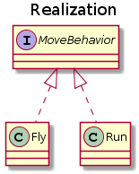
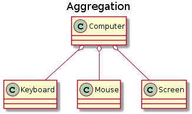
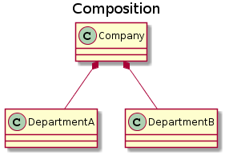
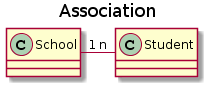

<!-- GFM-TOC -->
* [一、三大特性](#一三大特性)
    * [封装](#封装)
    * [继承](#继承)
    * [多态](#多态)
* [二、类图](#二类图)
    * [泛化关系 (Generalization)](#泛化关系-generalization)
    * [实现关系 (Realization)](#实现关系-realization)
    * [聚合关系 (Aggregation)](#聚合关系-aggregation)
    * [组合关系 (Composition)](#组合关系-composition)
    * [关联关系 (Association)](#关联关系-association)
    * [依赖关系 (Dependency)](#依赖关系-dependency)
* [三、设计原则](#三设计原则)
    * [S.O.L.I.D](#solid)
    * [其他常见原则](#其他常见原则)
* [参考资料](#参考资料)
<!-- GFM-TOC -->


# 一、三大特性

## 封装

利用抽象数据类型将数据和基于数据的操作封装在一起，使其构成一个不可分割的独立实体。数据被保护在抽象数据类型的内部，尽可能地隐藏内部的细节，只保留一些对外接口使之与外部发生联系。用户无需知道对象内部的细节，但可以通过对象对外提供的接口来访问该对象。

优点：

- 减少耦合：可以独立地开发、测试、优化、使用、理解和修改
- 减轻维护的负担：可以更容易被程序员理解，并且在调试的时候可以不影响其他模块
- 有效地调节性能：可以通过剖析确定哪些模块影响了系统的性能
- 提高软件的可重用性
- 降低了构建大型系统的风险：即使整个系统不可用，但是这些独立的模块却有可能是可用的

以下 Person 类封装 name、gender、age 等属性，外界只能通过 get() 方法获取一个 Person 对象的 name 属性和 gender 属性，而无法获取 age 属性，但是 age 属性可以供 work() 方法使用。

注意到 gender 属性使用 int 数据类型进行存储，封装使得用户注意不到这种实现细节。并且在需要修改 gender 属性使用的数据类型时，也可以在不影响客户端代码的情况下进行。

```java
public class Person {

    private String name;
    private int gender;
    private int age;

    public String getName() {
        return name;
    }

    public String getGender() {
        return gender == 0 ? "man" : "woman";
    }

    public void work() {
        if (18 <= age && age <= 50) {
            System.out.println(name + " is working very hard!");
        } else {
            System.out.println(name + " can't work any more!");
        }
    }
}
```

## 继承

继承实现了  **IS-A**  关系，例如 Cat 和 Animal 就是一种 IS-A 关系，因此 Cat 可以继承自 Animal，从而获得 Animal 非 private 的属性和方法。

继承应该遵循里氏替换原则，子类对象必须能够替换掉所有父类对象。

Cat 可以当做 Animal 来使用，也就是说可以使用 Animal 引用 Cat 对象。父类引用指向子类对象称为  **向上转型** 。

```java
Animal animal = new Cat();
```

## 多态

多态分为编译时多态和运行时多态：

- 编译时多态主要指方法的重载
- 运行时多态指程序中定义的对象引用所指向的具体类型在运行期间才确定

运行时多态有三个条件：

- 继承
- 覆盖（重写）
- 向上转型

下面的代码中，乐器类（Instrument）有两个子类：Wind 和 Percussion，它们都覆盖了父类的 play() 方法，并且在 main() 方法中使用父类 Instrument 来引用 Wind 和 Percussion 对象。在 Instrument 引用调用 play() 方法时，会执行实际引用对象所在类的 play() 方法，而不是 Instrument 类的方法。

```java
public class Instrument {

    public void play() {
        System.out.println("Instument is playing...");
    }
}

public class Wind extends Instrument {

    public void play() {
        System.out.println("Wind is playing...");
    }
}

public class Percussion extends Instrument {

    public void play() {
        System.out.println("Percussion is playing...");
    }
}

public class Music {

    public static void main(String[] args) {
        List<Instrument> instruments = new ArrayList<>();
        instruments.add(new Wind());
        instruments.add(new Percussion());
        for(Instrument instrument : instruments) {
            instrument.play();
        }
    }
}
```

# 二、类图

以下类图使用 [PlantUML](https://www.planttext.com/) 绘制，更多语法及使用请参考：http://plantuml.com/ 。

## 泛化关系 (Generalization)

用来描述继承关系，在 Java 中使用 extends 关键字。

<div align="center">  </div><br>

```text
@startuml

title Generalization

class Vihical
class Car
class Trunck

Vihical <|-- Car
Vihical <|-- Trunck

@enduml
```

## 实现关系 (Realization)

用来实现一个接口，在 Java 中使用 implements 关键字。

<div align="center">  </div><br>

```text
@startuml

title Realization

interface MoveBehavior
class Fly
class Run

MoveBehavior <|.. Fly
MoveBehavior <|.. Run

@enduml
```

## 聚合关系 (Aggregation)

表示整体由部分组成，但是整体和部分不是强依赖的，整体不存在了部分还是会存在。

<div align="center">  </div><br>

```text
@startuml

title Aggregation

class Computer
class Keyboard
class Mouse
class Screen

Computer o-- Keyboard
Computer o-- Mouse
Computer o-- Screen

@enduml
```

## 组合关系 (Composition)

和聚合不同，组合中整体和部分是强依赖的，整体不存在了部分也不存在了。比如公司和部门，公司没了部门就不存在了。但是公司和员工就属于聚合关系了，因为公司没了员工还在。

<div align="center">  </div><br>

```text
@startuml

title Composition

class Company
class DepartmentA
class DepartmentB

Company *-- DepartmentA
Company *-- DepartmentB

@enduml
```

## 关联关系 (Association)

表示不同类对象之间有关联，这是一种静态关系，与运行过程的状态无关，在最开始就可以确定。因此也可以用 1 对 1、多对 1、多对多这种关联关系来表示。比如学生和学校就是一种关联关系，一个学校可以有很多学生，但是一个学生只属于一个学校，因此这是一种多对一的关系，在运行开始之前就可以确定。

<div align="center">  </div><br>

```text
@startuml

title Association

class School
class Student

School "1" - "n" Student

@enduml
```

## 依赖关系 (Dependency)

和关联关系不同的是，依赖关系是在运行过程中起作用的。A 类和 B 类是依赖关系主要有三种形式：

- A 类是 B 类方法的局部变量；
- A 类是 B 类方法当中的一个参数；
- A 类向 B 类发送消息，从而影响 B 类发生变化。

<div align="center">  </div><br>

```text
@startuml

title Dependency

class Vihicle {
    move(MoveBehavior)
}

interface MoveBehavior {
    move()
}

note "MoveBehavior.move()" as N

Vihicle ..> MoveBehavior

Vihicle .. N

@enduml
```

# 三、设计原则

## S.O.L.I.D

| 简写 | 全拼 | 中文翻译 |
| :--: | :--: | :--: |
| SRP | The Single Responsibility Principle    | 单一责任原则 |
| OCP | The Open Closed Principle              | 开放封闭原则 |
| LSP | The Liskov Substitution Principle      | 里氏替换原则 |
| ISP | The Interface Segregation Principle    | 接口分离原则 |
| DIP | The Dependency Inversion Principle     | 依赖倒置原则 |

### 1. 单一责任原则

> 修改一个类的原因应该只有一个。

换句话说就是让一个类只负责一件事，当这个类需要做过多事情的时候，就需要分解这个类。

如果一个类承担的职责过多，就等于把这些职责耦合在了一起，一个职责的变化可能会削弱这个类完成其它职责的能力。

### 2. 开放封闭原则

> 类应该对扩展开放，对修改关闭。

扩展就是添加新功能的意思，因此该原则要求在添加新功能时不需要修改代码。

符合开闭原则最典型的设计模式是装饰者模式，它可以动态地将责任附加到对象上，而不用去修改类的代码。

### 3. 里氏替换原则

> 子类对象必须能够替换掉所有父类对象。

继承是一种 IS-A 关系，子类需要能够当成父类来使用，并且需要比父类更特殊。

如果不满足这个原则，那么各个子类的行为上就会有很大差异，增加继承体系的复杂度。

### 4. 接口分离原则

> 不应该强迫客户依赖于它们不用的方法。

因此使用多个专门的接口比使用单一的总接口要好。

### 5. 依赖倒置原则

> 高层模块不应该依赖于低层模块，二者都应该依赖于抽象；</br>抽象不应该依赖于细节，细节应该依赖于抽象。

高层模块包含一个应用程序中重要的策略选择和业务模块，如果高层模块依赖于低层模块，那么低层模块的改动就会直接影响到高层模块，从而迫使高层模块也需要改动。

依赖于抽象意味着：

- 任何变量都不应该持有一个指向具体类的指针或者引用；
- 任何类都不应该从具体类派生；
- 任何方法都不应该覆写它的任何基类中的已经实现的方法。

## 其他常见原则

除了上述的经典原则，在实际开发中还有下面这些常见的设计原则。

| 简写    | 全拼    | 中文翻译 |
| :--: | :--: | :--: |
|LOD|    The Law of Demeter                   | 迪米特法则   |
|CRP|    The Composite Reuse Principle        | 合成复用原则 |
|CCP|    The Common Closure Principle         | 共同封闭原则 |
|SAP|    The Stable Abstractions Principle    | 稳定抽象原则 |
|SDP|    The Stable Dependencies Principle    | 稳定依赖原则 |

### 1. 迪米特法则

迪米特法则又叫作最少知识原则（Least Knowledge Principle，简写 LKP），就是说一个对象应当对其他对象有尽可能少的了解，不和陌生人说话。

### 2. 合成复用原则

尽量使用对象组合，而不是通过继承来达到复用的目的。

### 3. 共同封闭原则

一起修改的类，应该组合在一起（同一个包里）。如果必须修改应用程序里的代码，我们希望所有的修改都发生在一个包里（修改关闭），而不是遍布在很多包里。

### 4. 稳定抽象原则

最稳定的包应该是最抽象的包，不稳定的包应该是具体的包，即包的抽象程度跟它的稳定性成正比。

### 5. 稳定依赖原则

包之间的依赖关系都应该是稳定方向依赖的，包要依赖的包要比自己更具有稳定性。

# 参考资料

- Java 编程思想
- 敏捷软件开发：原则、模式与实践
- [面向对象设计的 SOLID 原则](http://www.cnblogs.com/shanyou/archive/2009/09/21/1570716.html)
- [看懂 UML 类图和时序图](http://design-patterns.readthedocs.io/zh_CN/latest/read_uml.html#generalization)
- [UML 系列——时序图（顺序图）sequence diagram](http://www.cnblogs.com/wolf-sun/p/UML-Sequence-diagram.html)
- [面向对象编程三大特性 ------ 封装、继承、多态](http://blog.csdn.net/jianyuerensheng/article/details/51602015)


</br><div align="center">欢迎关注公众号，获取最新文章！</div></br></br>
<div align="center"></img></div>
