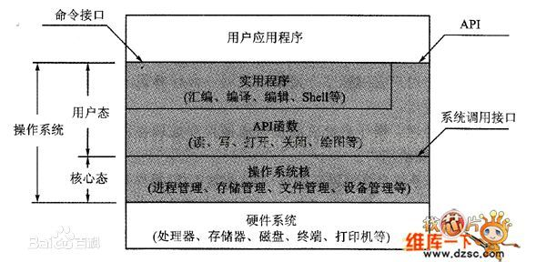

<!-- TOC -->

- [java基础](#java基础)
    - [java 语言基础](#java-语言基础)
        - [java自动拆装箱：](#java自动拆装箱)
        - [java 四种引用及其应用场景](#java-四种引用及其应用场景)
        - [foreach与正常for循环效率对比](#foreach与正常for循环效率对比)
        - [java反射的作用于原理](#java反射的作用于原理)
        - [java 动态代理](#java-动态代理)
- [数据库](#数据库)
    - [truncate与 delete区别](#truncate与-delete区别)
    - [B+树索引和哈希索引的区别](#b树索引和哈希索引的区别)
    - [mysql 分库分表](#mysql-分库分表)
- [Linux](#linux)
    - [Top 查看系统信息](#top-查看系统信息)
    - [Linux 内核空间和用户空间](#linux-内核空间和用户空间)
- [分布式](#分布式)
    - [paxos 算法](#paxos-算法)
- [Linux](#linux-1)
    - [Buffer和Cache的区别](#buffer和cache的区别)
        - [个人理解](#个人理解)
- [计算机网络](#计算机网络)
    - [UDP为什么不可靠](#udp为什么不可靠)

<!-- /TOC -->

# java基础

## java 语言基础

### java自动拆装箱：

自动装箱是将一个java定义的基本数据类型赋值给相应封装类的变量。 拆箱与装箱是相反的操作，自动拆箱则是将一个封装类的变量赋值给相应基本数据类型的变量。

### java 四种引用及其应用场景

1、强引用
最普遍的一种引用方式，如String s = "abc"，变量s就是字符串“abc”的强引用，只要强引用存在，则垃圾回收器就不会回收这个对象。

2、软引用（SoftReference）
用于描述还有用但非必须的对象，如果内存足够，不回收，如果内存不足，则回收。一般用于实现内存敏感的高速缓存，软引用可以和引用队列ReferenceQueue联合使用，如果软引用的对象被垃圾回收，JVM就会把这个软引用加入到与之关联的引用队列中。

3、弱引用（WeakReference）
弱引用和软引用大致相同，弱引用与软引用的区别在于：只具有弱引用的对象拥有更短暂的生命周期。在垃圾回收器线程扫描它所管辖的内存区域的过程中，一旦发现了只具有弱引用的对象，不管当前内存空间足够与否，都会回收它的内存。

4、虚引用（PhantomReference）
就是形同虚设，与其他几种引用都不同，虚引用并不会决定对象的生命周期。如果一个对象仅持有虚引用，那么它就和没有任何引用一样，在任何时候都可能被垃圾回收器回收。 虚引用主要用来跟踪对象被垃圾回收器回收的活动。

虚引用与软引用和弱引用的一个区别在于：
虚引用必须和引用队列 （ReferenceQueue）联合使用。当垃圾回收器准备回收一个对象时，如果发现它还有虚引，就会在回收对象的内存之前，把这个虚引用加入到与之关联的引用队列中。

### foreach与正常for循环效率对比

用for循环arrayList 10万次花费时间：5毫秒。
用foreach循环arrayList 10万次花费时间：7毫秒。
用for循环linkList 10万次花费时间：4481毫秒。
用foreach循环linkList 10万次花费时间：5毫秒。
循环ArrayList时，普通for循环比foreach循环花费的时间要少一点。
循环LinkList时，普通for循环比foreach循环花费的时间要多很多。
当我将循环次数提升到一百万次的时候，循环ArrayList，普通for循环还是比foreach要快一点；但是普通for循环在循环LinkList时，程序直接卡死。
ArrayList：ArrayList是采用数组的形式保存对象的，这种方式将对象放在连续的内存块中，所以插入和删除时比较麻烦，查询比较方便。
LinkList：LinkList是将对象放在独立的空间中，而且每个空间中还保存下一个空间的索引，也就是数据结构中的链表结构，插入和删除比较方便，但是查找很麻烦，要从第一个开始遍历。

结论：
**需要循环数组结构的数据时，建议使用普通for循环，因为for循环采用下标访问，对于数组结构的数据来说，采用下标访问比较好。
需要循环链表结构的数据时，一定不要使用普通for循环，这种做法很糟糕，数据量大的时候有可能会导致系统崩溃。**

链表：使用foreach
数组：使用for循环

### java反射的作用于原理

Java 反射是可以让我们在运行时，通过一个类的Class对象来获取它获取类的方法、属性、父类、接口等类的内部信息的机制。

这种动态获取信息以及动态调用对象的方法的功能称为JAVA的反射。

### java 动态代理

# 数据库

##  truncate与 delete区别

TRUNCATE TABLE 在功能上与不带 WHERE 子句的 DELETE 语句相同：二者均删除表中的全部行。但 TRUNCATE TABLE 比 DELETE 速度快，且使用的系统和事务日志资源少。 

DELETE 语句每次删除一行，并在事务日志中为所删除的每行记录一项。

TRUNCATE TABLE 通过释放存储表数据所用的数据页来删除数据，并且只在事务日志中记录页的释放。

TRUNCATE,DELETE,DROP 放在一起比较：

TRUNCATE TABLE ：删除内容、释放空间但不删除定义。
DELETE TABLE: 删除内容不删除定义，不释放空间。
DROP TABLE ：删除内容和定义，释放空间

## B+树索引和哈希索引的区别

B+树是一个平衡的多叉树，从根节点到每个叶子节点的高度差值不超过1，而且同层级的节点间有指针相互链接，是有序的

哈希索引就是采用一定的哈希算法，把键值换算成新的哈希值，检索时不需要类似B+树那样从根节点到叶子节点逐级查找，只需一次哈希算法即可立刻定位到相应的位置，速度非常快。是无序的

**优势对比：**

- 如果是等值查询，那么哈希索引明显有绝对优势，因为只需要经过一次算法即可找到相应的键值；当然了，这个前提是，键值都是唯一的。如果键值不是唯一的，就需要先找到该键所在位置，然后再根据链表往后扫描，直到找到相应的数据；

- 从示意图中也能看到，如果是范围查询检索，这时候哈希索引就毫无用武之地了，因为原先是有序的键值，经过哈希算法后，有可能变成不连续的了，就没办法再利用索引完成范围查询检索；

- 同理，哈希索引也没办法利用索引完成排序，以及like ‘xxx%’ 这样的部分模糊查询（这种部分模糊查询，其实本质上也是范围查询）；

- 哈希索引也不支持多列联合索引的最左匹配规则；

- B+树索引的关键字检索效率比较平均，不像B树那样波动幅度大，在有大量重复键值情况下，哈希索引的效率也是极低的，因为存在所谓的哈希碰撞问题。

说白了，等值查询的时候，Hash索引才有用武之地。

## mysql 分库分表

**分表：**
分表策略可以划分为垂直拆分和水平拆分。

垂直拆分：把表的字段进行拆分。一方面，减少客户端和数据库之间的网络传输。一方面，单个数据块存放的数据更多，查询的时候就可以减少I/O次数。

垂直拆分建议：
1. 将不常用的字段单独拆分到林外一张扩展表。
2. 将大文本的字段单独拆分到另外一张扩展表。
3. 将不经常修改的字段放在同一张表中,经常改变的字段放在另一张表中。
4. 对于需要经常关联查询的字段，建议放在同一张表中。不然联合查询的时候，会给数据库带来额外压力。

水平拆分：拆分表的行。

水平拆分策略：取模分表，时间维度分表，自定义hash分表等。

取模分表和自定义hash分表属于随机分表。时间维度分表属于连续分布表。随机分表可以避免热点问题，读写相对均匀，连续分表有热点问题，但是避免了跨表查询的复杂问题。

**分库：**
垂直拆分：按照业务和功能划分数据库

水平拆分：两个数据库的表结构一样，划分方法同水平拆分表。

# Linux

## Top 查看系统信息

参考文档：
- [Linux top命令的用法详细详解](https://www.cnblogs.com/zhoug2020/p/6336453.html)

## Linux 内核空间和用户空间

通常32位Linux内核地址空间划分0\~3G为用户空间，3\~4G为内核空间。注意这里是32位内核地址空间划分，64位内核地址空间划分是不同的。

当内核模块代码或线程访问内存时，代码中的内存地址都为逻辑地址，而对应到真正的物理内存地址，需要地址一对一的映射，如逻辑地址0xc0000003对应的物理地址为0×3，0xc0000004对应的物理地址为0×4，… …，逻辑地址与物理地址对应的关系为

物理地址 = 逻辑地址 – 0xC0000000

处于用户态的程序只能访问用户空间，而处于内核态的程序可以访问用户空间和内核空间。那么用户态和内核态有什么区别呢？

当一个任务（进程）执行系统调用而陷入内核代码中执行时，我们就称进程处于内核运行态（或简称为内核态）。此时处理器处于特权级最高的（0级）内核代码中执行。当进程处于内核态时，执行的内核代码会使用当前进程的内核栈。每个进程都有自己的内核栈。当进程在执行用户自己的代码时，则称其处于用户运行态（用户态）。即此时处理器在特权级最低的（3级）用户代码中运行。

内核态与用户态是操作系统的两种运行级别,Intel x86架构提供Ring0-Ring3四种级别的运行模式，Ring0级别最高，Ring3最低。Linux使用了Ring3级别运行用户态，Ring0作为 内核态，没有使用Ring1和Ring2。Ring3状态不能访问Ring0的地址空间，包括代码和数据。程序特权级别的不同，其所拥有的权力也不同。如下图所示。

用户态切换到内核态的3种方式:

a. 系统调用

这是用户态进程主动要求切换到内核态的一种方式，用户态进程通过系统调用申请使用操作系统提供的服务程序完成工作，比如fork()实际上就是执行了一个创建新进程的系统调用。而系统调用的机制其核心还是使用了操作系统为用户特别开放的一个中断来实现，例如Linux的int 80h中断。

b. 异常

当CPU在执行运行在用户态下的程序时，发生了某些事先不可知的异常，这时会触发由当前运行进程切换到处理此异常的内核相关程序中，也就转到了内核态，比如缺页异常。

c. 外围设备的中断

当外围设备完成用户请求的操作后，会向CPU发出相应的中断信号，这时CPU会暂停执行下一条即将要执行的指令转而去执行与中断信号对应的处理程序，如果先前执行的指令是用户态下的程序，那么这个转换的过程自然也就发生了由用户态到内核态的切换。比如硬盘读写操作完成，系统会切换到硬盘读写的中断处理程序中执行后续操作等。

这3种方式是系统在运行时由用户态转到内核态的最主要方式，其中系统调用可以认为是用户进程主动发起的，异常和外围设备中断则是被动的。

参考链接：
- [linux 用户空间与内核空间——高端内存详解](https://www.cnblogs.com/wuchanming/p/4360277.html)
- [内核态(内核空间)和用户态(用户空间)的区别和联系](https://blog.csdn.net/qq_34228570/article/details/72995997)

# 分布式

## paxos 算法

[通俗易懂](https://www.cnblogs.com/endsock/p/3480093.html)

# Linux

## Buffer和Cache的区别

Buffer(缓冲区)：
buffer就是写入到磁盘。buffer是为了提高内存和硬盘（或其他I/O设备）之间的数据交换的速度而设计的。buffer将数据缓冲下来，解决速度慢和快的交接问题；速度快的需要通过缓冲区将数据一点一点传给速度慢的区域。例如：从内存中将数据往硬盘中写入，并不是直接写入，而是缓冲到一定大小之后刷入硬盘中。

Cache(缓存区)：
cache就是从磁盘读取数据然后存起来方便以后使用。cache实现数据的重复使用，速度慢的设备需要通过缓存将经常要用到的数据缓存起来，缓存下来的数据可以提供高速的传输速度给速度快的设备。例如：将硬盘中的数据读取出来放在内存的缓存区中，这样以后再次访问同一个资源，速度会快很多。

buffer和cache的特点：

共性：
都属于内存，数据都是临时的，一旦关机数据都会丢失。

差异：(先理解前两点，后两点有兴趣可以了解)
A.buffer是要写入数据；cache是已读取数据。
B.buffer数据丢失会影响数据完整性，源数据不受影响；cache数据丢失不会影响数据完整性，但会影响性能。
C.一般来说cache越大，性能越好，超过一定程度，导致命中率太低之后才会越大性能越低。buffer来说，空间越大性能影响不大，够用就行。cache过小，或者没有cache，不影响程序逻辑（高并发cache过小或者丢失导致系统忙死除外）。buffer过小有时候会影响程序逻辑，如导致网络丢包。
D.cache可以做到应用透明，编写应用的可以不用管是否有cache，可以在应用做好之后再上cache。当然开发者显式使用cache也行。buffer需要编写应用的人设计，是程序的一部分。

### 个人理解

Buffer就是写磁盘的时候先缓冲到内存，然后一次性写入。
Cache就是加快读取的速度，分为磁盘缓存和CPU缓存。

1、Cache是高速存储区域，而Buffer是RAM的临时存储的正常存储区域。

2、Cache是由静态RAM构成的，它比Buffer较慢的动态RAM更快。

3、Buffer主要用于输入/输出过程，而Cache则用于从磁盘读取和写入进程。

4、Cache也可以是磁盘的一部分，而Buffer只是RAM的一部分。

5、在Cache不能使用的情况下，可以在键盘中使用Buffer来编辑打字错误。

动态RAM： 计算机内存。
静态RAM： CPU高速缓存。

# 计算机网络

## UDP为什么不可靠

1. socket 缓冲区

应用程序通过调用send, read方法向网络上发送应用数据，该过程中由于应用程序调用send/write的速度同网络介质发送数据的速度存在差异，所以，应用通过socket发往网络上的的数据会先被缓存，即socket发送缓冲区，等待网络空闲时再发送出去。同样，socket从网络上接受到的数据，也会被缓存，即socket接受缓冲区，等待应用程序把数据从中读出。其中，应用程序调用send发送数据，是将数据拷贝到socket的内核发送缓冲区中，然后send便会返回，即send返回后，数据并不一定发送到目的地去了，send仅仅是把数据拷贝到socket的内核发送缓冲区。

2. TCP可靠数据传输原理

每个Tcp socket在内核中都有一个发送缓冲区和一个接受缓冲区。tcp协议要求对端在接受到tcp数据报之后，要对其序号进行ACK，只有当接受到一个tcp数据报的ACK之后，才

可以把这个tcp数据报从socket的发送缓冲区清除，另外tcp还有一个流量控制功能，tcp的socket接受缓冲区接受到网络上来的数据缓存起来后，如果应用程序一直没有读取，socket接受缓冲区满了之后，发生的动作是：通知对端TCP协议中的窗口关闭，这便是滑动窗口的实现，保证TCP socket接受缓冲区不会溢出，因为对方不允许发送超过所通知窗口大小的数据， 这就是TCP的流量控制，如果对方无视窗口大小而发出了超过窗口大小的数据，则接收方TCP将丢弃它。这两点保证了tcp是可靠传输的。

3. UDP不可靠数据传输原理

UDP只有一个socket接受缓冲区，没有socket发送缓冲区，即只要有数据就发，不管对方是否可以正确接受。而在对方的socket接受缓冲区满了之后，新来的数据报无法进入到socket接受缓冲区，此数据报就会被丢弃，udp是没有流量控制的，故UDP的数据传输是不可靠的。