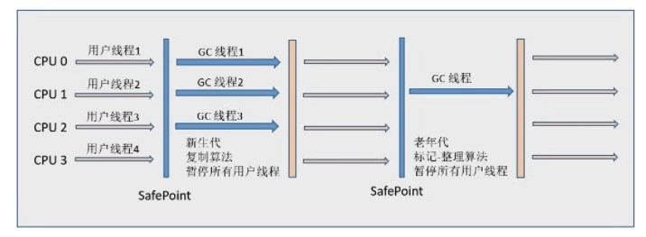
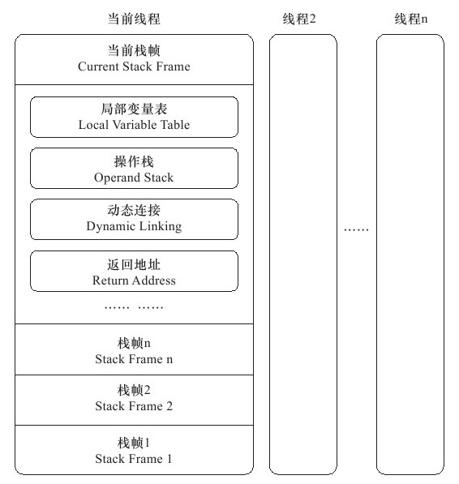
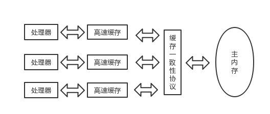

<!-- TOC -->

- [1 Java 技术体系](#1-java-技术体系)
    - [JVM](#jvm)
- [2 Java 自动内存管理机制](#2-java-自动内存管理机制)
- [3 jvm 垃圾收集](#3-jvm-垃圾收集)
    - [判断对象是否可回收](#判断对象是否可回收)
        - [1. 引用计数法](#1-引用计数法)
        - [2. 可达性分析算法](#2-可达性分析算法)
        - [3. 引用类型](#3-引用类型)
        - [4. 回收方法区](#4-回收方法区)
        - [5. finalize](#5-finalize)
    - [垃圾收集算法](#垃圾收集算法)
        - [1. 标记-清除](#1-标记-清除)
        - [2. 标记-整理](#2-标记-整理)
        - [3. 复制](#3-复制)
        - [4. 分代收集](#4-分代收集)
    - [垃圾收集器](#垃圾收集器)
        - [1. Serial 收集器](#1-serial-收集器)
        - [2. ParNew 收集器](#2-parnew-收集器)
        - [3. Parallel Scavenge 收集器](#3-parallel-scavenge-收集器)
        - [4. Serial Old 收集器](#4-serial-old-收集器)
        - [5. Parallel Old 收集器](#5-parallel-old-收集器)
        - [6. CMS 收集器](#6-cms-收集器)
        - [7. G1 收集器](#7-g1-收集器)
        - [8. 收集器比较](#8-收集器比较)
    - [内存分配与回收策略](#内存分配与回收策略)
        - [1. Minor GC 和 Full GC](#1-minor-gc-和-full-gc)
        - [2. 内存分配策略](#2-内存分配策略)
        - [3. Full GC 的触发条件](#3-full-gc-的触发条件)
- [虚拟机性能监控工具](#虚拟机性能监控工具)
    - [可视化工具](#可视化工具)
- [类文件结构](#类文件结构)
- [虚拟机类加载机制](#虚拟机类加载机制)
    - [步骤](#步骤)
- [虚拟机字节码执行引擎](#虚拟机字节码执行引擎)
    - [运行时栈帧](#运行时栈帧)
    - [方法调用](#方法调用)
        - [解析](#解析)
    - [分派](#分派)
        - [静态分派](#静态分派)
        - [动态分派](#动态分派)
        - [虚拟机动态分派的实现](#虚拟机动态分派的实现)
- [内存模型](#内存模型)
    - [处理器、高速缓存、主内存](#处理器高速缓存主内存)
    - [java 内存模型](#java-内存模型)
        - [主内存和工作内存](#主内存和工作内存)
        - [内存间的交互操作](#内存间的交互操作)
        - [内存模型的三大特性](#内存模型的三大特性)
        - [先行发生原则](#先行发生原则)
    - [java 与线程](#java-与线程)
        - [线程的实现](#线程的实现)
        - [java线程调度](#java线程调度)
        - [状态转换](#状态转换)
- [java 线程安全和锁优化](#java-线程安全和锁优化)
- [java的符号引用和直接引用](#java的符号引用和直接引用)
    - [符号引用](#符号引用)
    - [直接引用](#直接引用)

<!-- /TOC -->


# 1 Java 技术体系

组成部分：java程序设计语言、java virtual machine(JVM)、class文件的格式、java api 类库、第三方类库

其中java语言、JVM、JAVA API类库称为JDK，JDK是支持java程序的最小开发环境。JAVA API类库中的JAVA SE API子集和JVM统称为JRE（java runtime environment)，JRE是支持java程序运行的标准环境

JAVA ME: 移动库  
JAVA SE: 标准库  
JAVA EE：企业库  

## JVM

jvm版本众多，使用范围较广的有SUN JDK(Oracle JDK)和 OpenJDK。也有其他的如，Apache Harmony VM、Microsoft JVM 

# 2 Java 自动内存管理机制

java 虚拟机运行时的数据分区如下：

<div align="center">  </div><br>

**线程私有：**

- 虚拟机栈(jvm stack)： 

jvm stack 的生命周期和线程相同，虚拟机栈描述的是java方法执行的内存模型：每个方法执行的同时都会创建一个栈帧,用于存储 **局部变量表**，**操作数栈**，**动态链接**， **方法出口** 等信息，每一个方法从调用到完成的过程就对应着一个栈帧在虚拟机栈中入栈到出栈的过程。

通常所说的`栈内存`指的是虚拟机栈中的**局部变量表**部分，存放了编译期间可知的各种基本数据类型、对象引用。其中long和double类型的数据会占用2个局部变量空间，其他只占1个。

局部变量表的空间大小在编译期间就已经完成分配，运行期间不会改变局部变量表的大小。

在jvm规范中，对这个区域规定了两种异常情况：  

1. 如果线程请求的栈深度大于虚拟机所允许的深度，则抛出StackOverflowError异常
2. 如果jvm设置了动态扩展虚拟机栈的话，则会抛出OutOfMemoryError异常

例如在函数递归调用深度过深的话可能导致栈溢出异常。

- 本地方法栈(native method statck):

和虚拟机栈非常相似，区别在于虚拟机栈为虚拟机执行Java方法，而本地方法栈执行的是Java Native 方法服务。

- 程序计数器(program counter register):

当前线程所执行的字节码的行号指示器，记录正在执行的虚拟机字节码指令的地址（如果正在执行的是本地方法则为空）

**线程共享：**

- 堆(Heap)

Java 堆是被所有`线程共享`的一块内存区域，唯一目的是存放对象实例，是jvm中内存最大的一块。也是java GC的主要区域。

java堆也称为"GC"堆，现在的垃圾收集器大多采用分代收集算法。

该算法的思想是针对不同的对象采用不同的垃圾回收算法，java堆分为3块：

- 新生代（Young Generation）
- 老生代（Old Generation）
- 永久代（Permanent Generation）

当一个对象被创建时，它首先进入新生代，之后有可能被转移到老年代中。新生代存放着大量的生命很短的对象，因此新生代在三个区域中垃圾回收的频率最高。

- 方法区(Method Area):

  方法区和java堆一样，是各个`线程共享`的内存区域，用来存储被虚拟机加载的类信息、常量、静态变量、即时编译后的代码数据，方法区也叫“非堆区”。在Hot-spot循迹上面，方法区也可以成为“永久代”。  

  - 运行时常量池
    运行时常量池属于方法区的一部分，用于存放编译期生成（即Class文件中）的各种`字面量`和`符号引用`。

    除了在编译期生成的常量，还允许动态生成，例如 String 类的 intern()。这部分常量也会被放入运行时常量池。

直接内存(Direct Memory)：

在 JDK 1.4 中新加入了 NIO 类，引入了一种基于通道 (channel) 和缓冲区 (Buffer) 的 I/O 方式它可以使用 Native 函数库直接分配堆外内存，然后通过一个存储在 Java 堆里的 DirectByteBuffer 对象作为这块内存的引用进行操作。这样能在一些场景中显著提高性能，因为避免了在 Java 堆和 Native 堆中来回复制数据。

直接内存不受java堆大小的限制，但是受物理机的总内存和swap的限制，因此扩展的时候可能出现OutOfMemoryError异常

# 3 jvm 垃圾收集

程序计数器、虚拟机栈和本地方法栈这三个区域属于线程私有的，只存在于线程的生命周期内，线程结束之后也会消失，因此不需要对这三个区域进行垃圾回收。垃圾回收主要是针对 Java 堆和方法区进行。

## 判断对象是否可回收
### 1. 引用计数法

给对象添加一个引用计数器，没当一个地方引用它的时候，计数器加1，引用失效时，计数器减1，计数器为0的时候表示对象不可能被使用了。

但是该方法不能解决**相互循环引用**的问题。
``` java
public class ReferenceCountingGC {
    public Object instance = null;

    public static void main(String[] args) {
        ReferenceCountingGC objectA = new ReferenceCountingGC();
        ReferenceCountingGC objectB = new ReferenceCountingGC();
        objectA.instance = objectB;
        objectB.instance = objectA;
    }
}
```

因此java虚拟机不采用这种方法。

### 2. 可达性分析算法

通过一系列的成为 "GC Roots" 的对象作为起始点，从这些节点开始向下搜索，索索走过的路径称为引用链，对一个对象到 GC Roots 没有任何引用链时，对象不可达，判定为可回收对象。

<div align="center">  </div><br>

Java 虚拟机使用该算法来判断对象是否可被回收，在 Java 中 GC Roots 一般包含以下内容：

- 虚拟机栈中引用的对象
- 本地方法栈中引用的对象
- 方法区中类静态属性引用的对象
- 方法区中的常量引用的对象

### 3. 引用类型

- 强引用

new 关键字创建的对象，垃圾收集器永远不会回收掉被引用的对象

``` java
Object obj = new Object();
```

- 软引用
描述有用但并非必须的对象，只有内存不够的情况才会被回收

``` java

Object obj = new Object();
SoftReference<Object> sf = new SoftReference<Object>(obj);
obj = null; // 使对象只被软引用关联

```

- 弱引用

被弱引用关联的对象一定会被垃圾收集器回收，也就是说它只能存活到下一次垃圾收集发生之前

``` java
Object obj = new Object();
WeakReference<Object> wf = new WeakReference<Object>(obj);
obj = null;
```

- 虚引用

又称为幽灵引用或者幻影引用。一个对象是否有虚引用的存在，完全不会对其生存时间构成影响，也无法通过虚引用取得一个对象实例。

为一个对象设置虚引用关联的唯一目的就是能在这个对象被收集器回收时收到一个系统通知。

使用 PhantomReference 来实现虚引用。

``` java
Object obj = new Object();
PhantomReference<Object> pf = new PhantomReference<Object>(obj);
obj = null;
```

### 4. 回收方法区

因为方法区主要存放永久代对象，而永久代对象的回收率比新生代差很多，因此在方法区上进行回收性价比不高。

主要是对常量池的回收和对类的卸载。

类的卸载条件很多，需要满足以下三个条件，并且满足了也不一定会被卸载：

- 该类所有的实例都已经被回收，也就是 Java 堆中不存在该类的任何实例。
- 加载该类的 ClassLoader 已经被回收。
- 该类对应的 java.lang.Class 对象没有在任何地方被引用，也就无法在任何地方通过反射访问该类方法。

可以通过 -Xnoclassgc 参数来控制是否对类进行卸载。

在大量使用反射、动态代理、CGLib 等 ByteCode 框架、动态生成 JSP 以及 OSGi 这类频繁自定义 ClassLoader 的场景都需要虚拟机具备类卸载功能，以保证不会出现内存溢出。

### 5. finalize
finalize() 类似 C++ 的析构函数，用来做关闭外部资源等工作。但是 try-finally 等方式可以做的更好，并且该方法运行代价高昂，不确定性大，无法保证各个对象的调用顺序，因此最好不要使用。

当一个对象可被回收时，如果需要执行该对象的 finalize() 方法，那么就有可能通过在该方法中让对象重新被引用，从而实现自救。但是这种自救的机会只有一次，因为一个对象的 finalize() 方法最多被系统自动调用一次。

## 垃圾收集算法

### 1. 标记-清除

两个阶段：

1. 标记阶段：标记所有需要回收的对象
2. 清除阶段：标记完成后统一回收所有被标记的对象

<div align="center">  </div><br>

缺点：

- 标记和清除过程效率都不高；
- 会产生大量不连续的内存碎片，导致无法给大对象分配内存。

### 2. 标记-整理

和标记-清除很类似，但是标记完成后是让所有存活的对象都向一端移动，然后清理掉边界以外的内存。

<div align="center">  </div><br>

通常老年代采用这个方法来进行垃圾回收。
### 3. 复制

将内存划分为大小相等的两块，每次只使用其中一块，当这一块内存用完了就将还存活的对象复制到另一块上面，然后再把使用过的内存空间进行一次清理。

<div align="center">  </div><br>

主要不足是只使用了内存的一半。

现在的商业虚拟机都采用这种收集算法来回收新生代，但是并不是将内存划分为大小相等的两块，而是分为一块较大的 Eden 空间和两块较小的 Survior 空间，每次使用 Eden 空间和其中一块 Survivor。在回收时，将 Eden 和 Survivor 中还存活着的对象一次性复制到另一块 Survivor 空间上，最后清理 Eden 和使用过的那一块 Survivor。HotSpot 虚拟机的 Eden 和 Survivor 的大小比例默认为 8:1，保证了内存的利用率达到 90 %。如果每次回收有多于 10% 的对象存活，那么一块 Survivor 空间就不够用了，此时需要依赖于老年代进行分配担保，也就是借用老年代的空间存储放不下的对象。

### 4. 分代收集

现在的商业虚拟机采用分代收集算法，它根据对象存活周期将内存划分为几块，不同块采用适当的收集算法。

一般将 Java 堆分为新生代和老年代。

新生代使用：复制算法
老年代使用：标记 - 清理 或者 标记 - 整理 算法

## 垃圾收集器

<div align="center">  </div><br>

以上是 HotSpot 虚拟机中的 7 个垃圾收集器，连线表示垃圾收集器可以配合使用。

### 1. Serial 收集器

<div align="center">  </div><br>

Serial 翻译为串行，垃圾收集和用户程序不能同时执行，这意味着在执行垃圾收集的时候需要停顿用户程序。除了 CMS 和 G1 之外，其它收集器都是以串行的方式执行。CMS 和 G1 可以使得垃圾收集和用户程序同时执行，被称为并发执行。

它是单线程的收集器，只会使用一个线程进行垃圾收集工作。

它的优点是简单高效，对于单个 CPU 环境来说，由于没有线程交互的开销，因此拥有最高的单线程收集效率。

它是 Client 模式下的默认新生代收集器，因为在用户的桌面应用场景下，分配给虚拟机管理的内存一般来说不会很大。Serial 收集器收集几十兆甚至一两百兆的新生代停顿时间可以控制在一百多毫秒以内，只要不是太频繁，这点停顿是可以接受的。

### 2. ParNew 收集器

<div align="center">  </div><br>

它是 Serial 收集器的多线程版本。

是 Server 模式下的虚拟机首选新生代收集器，除了性能原因外，主要是因为除了 Serial 收集器，只有它能与 CMS 收集器配合工作。

默认开始的线程数量与 CPU 数量相同，可以使用 -XX:ParallelGCThreads 参数来设置线程数。

### 3. Parallel Scavenge 收集器

与 ParNew 一样是并行的多线程收集器。

其它收集器关注点是尽可能缩短垃圾收集时用户线程的停顿时间，而它的目标是达到一个可控制的吞吐量，它被称为“吞吐量优先”收集器。这里的吞吐量指 CPU 用于运行用户代码的时间占总时间的比值。

停顿时间越短就越适合需要与用户交互的程序，良好的响应速度能提升用户体验。而高吞吐量则可以高效率地利用 CPU 时间，尽快完成程序的运算任务，主要适合在后台运算而不需要太多交互的任务。

提供了两个参数用于精确控制吞吐量，分别是控制最大垃圾收集停顿时间 -XX:MaxGCPauseMillis 参数以及直接设置吞吐量大小的 -XX:GCTimeRatio 参数（值为大于 0 且小于 100 的整数）。缩短停顿时间是以牺牲吞吐量和新生代空间来换取的：新生代空间变小，垃圾回收变得频繁，导致吞吐量下降。

还提供了一个参数 -XX:+UseAdaptiveSizePolicy，这是一个开关参数，打开参数后，就不需要手工指定新生代的大小（-Xmn）、Eden 和 Survivor 区的比例（-XX:SurvivorRatio）、晋升老年代对象年龄（-XX:PretenureSizeThreshold）等细节参数了，虚拟机会根据当前系统的运行情况收集性能监控信息，动态调整这些参数以提供最合适的停顿时间或者最大的吞吐量，这种方式称为 GC 自适应的调节策略（GC Ergonomics）。

### 4. Serial Old 收集器

<div align="center">  </div><br>

是 Serial 收集器的老年代版本，也是给 Client 模式下的虚拟机使用。如果用在 Server 模式下，它有两大用途：

- 在 JDK 1.5 以及之前版本（Parallel Old 诞生以前）中与 Parallel Scavenge 收集器搭配使用。
- 作为 CMS 收集器的后备预案，在并发收集发生 Concurrent Mode Failure 时使用。

### 5. Parallel Old 收集器

<div align="center">  </div><br>

是 Parallel Scavenge 收集器的老年代版本。

在注重吞吐量以及 CPU 资源敏感的场合，都可以优先考虑 Parallel Scavenge 加 Parallel Old 收集器。

### 6. CMS 收集器

<div align="center">  </div><br>

CMS（Concurrent Mark Sweep），Mark Sweep 指的是标记 - 清除算法。

特点：并发收集、低停顿。并发指的是用户线程和 GC 线程同时运行。

分为以下四个流程：

- 初始标记：仅仅只是标记一下 GC Roots 能直接关联到的对象，速度很快，需要停顿。
- 并发标记：进行 GC Roots Tracing 的过程，它在整个回收过程中耗时最长，不需要停顿。
- 重新标记：为了修正并发标记期间因用户程序继续运作而导致标记产生变动的那一部分对象的标记记录，需要停顿。
- 并发清除：不需要停顿。

在整个过程中耗时最长的并发标记和并发清除过程中，收集器线程都可以与用户线程一起工作，不需要进行停顿。

具有以下缺点：

- 吞吐量低：低停顿时间是以牺牲吞吐量为代价的，导致 CPU 利用率不够高。
- 无法处理浮动垃圾，可能出现 Concurrent Mode Failure。浮动垃圾是指并发清除阶段由于用户线程继续运行而产生的垃圾，这部分垃圾只能到下一次 GC 时才能进行回收。由于浮动垃圾的存在，因此需要预留出一部分内存，意味着 CMS 收集不能像其它收集器那样等待老年代快满的时候再回收。可以使用 -XX:CMSInitiatingOccupancyFraction 来改变触发 CMS 收集器工作的内存占用百分，如果这个值设置的太大，导致预留的内存不够存放浮动垃圾，就会出现 Concurrent Mode Failure，这时虚拟机将临时启用 Serial Old 来替代 CMS。
- 标记 - 清除算法导致的空间碎片，往往出现老年代空间剩余，但无法找到足够大连续空间来分配当前对象，不得不提前触发一次 Full GC。

### 7. G1 收集器

G1（Garbage-First），它是一款面向服务端应用的垃圾收集器，在多 CPU 和大内存的场景下有很好的性能。HotSpot 开发团队赋予它的使命是未来可以替换掉 CMS 收集器。

Java 堆被分为新生代、老年代和永久代，其它收集器进行收集的范围都是整个新生代或者老生代，而 G1 可以直接对新生代和永久代一起回收。

<div align="center">  </div><br>

G1 把新生代和老年代划分成多个大小相等的独立区域（Region），新生代和永久代不再物理隔离。

<div align="center">  </div><br>

通过引入 Region 的概念，从而将原来的一整块内存空间划分成多个的小空间，使得每个小空间可以单独进行垃圾回收。这种划分方法带来了很大的灵活性，使得可预测的停顿时间模型成为可能。通过记录每个 Region 垃圾回收时间以及回收所获得的空间（这两个值是通过过去回收的经验获得），并维护一个优先列表，每次根据允许的收集时间，优先回收价值最大的 Region。

每个 Region 都有一个 Remembered Set，用来记录该 Region 对象的引用对象所在的 Region。通过使用 Remembered Set，在做可达性分析的时候就可以避免全堆扫描。

<div align="center">  </div><br>

如果不计算维护 Remembered Set 的操作，G1 收集器的运作大致可划分为以下几个步骤：

- 初始标记
- 并发标记
- 最终标记：为了修正在并发标记期间因用户程序继续运作而导致标记产生变动的那一部分标记记录，虚拟机将这段时间对象变化记录在线程的 Remembered Set Logs 里面，最终标记阶段需要把 Remembered Set Logs 的数据合并到 Remembered Set 中。这阶段需要停顿线程，但是可并行执行。
- 筛选回收：首先对各个 Region 中的回收价值和成本进行排序，根据用户所期望的 GC 停顿是时间来制定回收计划。此阶段其实也可以做到与用户程序一起并发执行，但是因为只回收一部分 Region，时间是用户可控制的，而且停顿用户线程将大幅度提高收集效率。

具备如下特点：

- 空间整合：整体来看是基于“标记 - 整理”算法实现的收集器，从局部（两个 Region 之间）上来看是基于“复制”算法实现的，这意味着运行期间不会产生内存空间碎片。
- 可预测的停顿：能让使用者明确指定在一个长度为 M 毫秒的时间片段内，消耗在 GC 上的时间不得超过 N 毫秒。

更详细内容请参考：[Getting Started with the G1 Garbage Collector](http://www.oracle.com/webfolder/technetwork/tutorials/obe/java/G1GettingStarted/index.html)

### 8. 收集器比较

| 收集器 | 串行/并行/并发 | 新生代/老年代 | 收集算法 | 目标 | 适用场景 |
| :---: | :---: | :---: | :---: | :---: | :---: |
|  **Serial**  | 串行 | 新生代 | 复制 | 响应速度优先 | 单 CPU 环境下的 Client 模式 |
|  **Serial Old**  | 串行 | 老年代 | 标记-整理 | 响应速度优先 | 单 CPU 环境下的 Client 模式、CMS 的后备预案 |
|  **ParNew**  | 串行 + 并行 | 新生代 | 复制算法 | 响应速度优先 | 多 CPU 环境时在 Server 模式下与 CMS 配合 |
|  **Parallel Scavenge**  | 串行 + 并行 | 新生代 | 复制算法 | 吞吐量优先 | 在后台运算而不需要太多交互的任务 |
|  **Parallel Old**  | 串行 + 并行 | 老年代 | 标记-整理 | 吞吐量优先 | 在后台运算而不需要太多交互的任务 |
|  **CMS**  | 并行 + 并发 | 老年代 | 标记-清除 | 响应速度优先 | 集中在互联网站或 B/S 系统服务端上的 Java 应用 |
|  **G1**  | 并行 + 并发 | 新生代 + 老年代 | 标记-整理 + 复制算法 | 响应速度优先 | 面向服务端应用，将来替换 CMS |

## 内存分配与回收策略

对象的内存分配，也就是在堆上分配。主要分配在新生代的 Eden 区上，少数情况下也可能直接分配在老年代中。

### 1. Minor GC 和 Full GC

- Minor GC：发生在新生代上，因为新生代对象存活时间很短，因此 Minor GC 会频繁执行，执行的速度一般也会比较快。
- Full GC：发生在老年代上，老年代对象和新生代的相反，其存活时间长，因此 Full GC 很少执行，而且执行速度会比 Minor GC 慢很多。

### 2. 内存分配策略

**（一）对象优先在 Eden 分配** 

大多数情况下，对象在新生代 Eden 区分配，当 Eden 区空间不够时，发起 Minor GC。

**（二）大对象直接进入老年代** 

大对象是指需要连续内存空间的对象，最典型的大对象是那种很长的字符串以及数组。

经常出现大对象会提前触发垃圾收集以获取足够的连续空间分配给大对象。

-XX:PretenureSizeThreshold，大于此值的对象直接在老年代分配，避免在 Eden 区和 Survivor 区之间的大量内存复制。

**（三）长期存活的对象进入老年代** 

为对象定义年龄计数器，对象在 Eden 出生并经过 Minor GC 依然存活，将移动到 Survivor 中，年龄就增加 1 岁，增加到一定年龄则移动到老年代中。

-XX:MaxTenuringThreshold 用来定义年龄的阈值。

**（四）动态对象年龄判定** 

虚拟机并不是永远地要求对象的年龄必须达到 MaxTenuringThreshold 才能晋升老年代，如果在 Survivor 区中相同年龄所有对象大小的总和大于 Survivor 空间的一半，则年龄大于或等于该年龄的对象可以直接进入老年代，无需等到 MaxTenuringThreshold 中要求的年龄。

**（五）空间分配担保** 

在发生 Minor GC 之前，虚拟机先检查老年代最大可用的连续空间是否大于新生代所有对象总空间，如果条件成立的话，那么 Minor GC 可以确认是安全的；如果不成立的话虚拟机会查看 HandlePromotionFailure 设置值是否允许担保失败，如果允许那么就会继续检查老年代最大可用的连续空间是否大于历次晋升到老年代对象的平均大小，如果大于，将尝试着进行一次 Minor GC，尽管这次 Minor GC 是有风险的；如果小于，或者 HandlePromotionFailure 设置不允许冒险，那这时也要改为进行一次 Full GC。

### 3. Full GC 的触发条件

对于 Minor GC，其触发条件非常简单，当 Eden 区空间满时，就将触发一次 Minor GC。而 Full GC 则相对复杂，有以下条件：

**（一）调用 System.gc()** 

此方法的调用是建议虚拟机进行 Full GC，虽然只是建议而非一定，但很多情况下它会触发 Full GC，从而增加 Full GC 的频率，也即增加了间歇性停顿的次数。因此强烈建议能不使用此方法就不要使用，让虚拟机自己去管理它的内存。可通过 -XX:DisableExplicitGC 来禁止 RMI 调用 System.gc()。

**（二）老年代空间不足** 

老年代空间不足的常见场景为前文所讲的大对象直接进入老年代、长期存活的对象进入老年代等，当执行 Full GC 后空间仍然不足，则抛出 Java.lang.OutOfMemoryError。为避免以上原因引起的 Full GC，调优时应尽量做到让对象在 Minor GC 阶段被回收、让对象在新生代多存活一段时间以及不要创建过大的对象及数组。

**（三）空间分配担保失败** 

使用复制算法的 Minor GC 需要老年代的内存空间作担保，如果出现了 HandlePromotionFailure 担保失败，则会触发 Full GC。

**（四）JDK 1.7 及以前的永久代空间不足** 

在 JDK 1.7 及以前，HotSpot 虚拟机中的方法区是用永久代实现的，永久代中存放的为一些 Class 的信息、常量、静态变量等数据，当系统中要加载的类、反射的类和调用的方法较多时，永久代可能会被占满，在未配置为采用 CMS GC 的情况下也会执行 Full GC。如果经过 Full GC 仍然回收不了，那么虚拟机会抛出 java.lang.OutOfMemoryError，为避免以上原因引起的 Full GC，可采用的方法为增大永久代空间或转为使用 CMS GC。

**（五）Concurrent Mode Failure** 

执行 CMS GC 的过程中同时有对象要放入老年代，而此时老年代空间不足（有时候“空间不足”是 CMS GC 时当前的浮动垃圾过多导致暂时性的空间不足触发 Full GC），便会报 Concurrent Mode Failure 错误，并触发 Full GC。

# 虚拟机性能监控工具

SUN JDK 监控和故障处理工具， 部分虚拟机可能需要开启JMX管理功能， 启动添加参数 "-Dcom.sun.management.jmxremote"

名称 | 主要作用
---|---
jps | JVM Process Status Tool, 显示系统内所有的HotSpot虚拟机进程
jstat | JVM Statistics Monitoring Tool, 用于收集HotSpot 虚拟机各方面的运行数据
jinfo | 显示虚拟机配置信息
jmap | Memory Map for Java, 生成虚拟机的内存转储快照（heapdump）文件
jhat | JVM Heap Dump Browser, 用于分析heapdump 文件，它会建立一个HTTP/HTML服务器，在浏览器上面可以看到分析结果
jstack | Stack Trace for Java, 显示虚拟机的线程快照

## 可视化工具 
- JConsole
- VisualVM

参考文档：
- [java命令--jmap命令使用](https://www.cnblogs.com/kongzhongqijing/articles/3621163.html)
- [java命令--jstat命令使用](https://www.cnblogs.com/lizhonghua34/p/7307139.html)

# 类文件结构

[class 文件结构](https://www.cnblogs.com/wade-luffy/p/5929325.html)

# 虚拟机类加载机制

虚拟机把描述类的数据从Class文件加载到内存，并对数据进行校验、转换解析和初始化，最终形成可以被虚拟机直接使用的Java类型，这就是虚拟机的类加载机制。

[类加载机制](https://github.com/CyC2018/Interview-Notebook/blob/master/notes/Java%20%E8%99%9A%E6%8B%9F%E6%9C%BA.md#%E4%B8%89%E7%B1%BB%E5%8A%A0%E8%BD%BD%E6%9C%BA%E5%88%B6)

## 步骤

1 加载：通过类名来获取定义该类的二进制字节流，将字节流的静态存储结构转化为方法区的运行时数据结构，生成一个Class对象，作为方法区这个类的各种数据的访问入口

2 验证：验证Class文件的格式是否正确，是否危害jvm的安全，符号引用验证

3 准备：正式为类变量分配内存并设置类变量初始值的阶段。

4 解析：将常量池内的符号引用替换为直接引用的过程。类或接口的解析，字段解析，类方法解析，接口方法解析

5 初始化：执行构造器的\<clinit\>()方法的过程，该方法是编译器自动收集类的所有类变量的赋值动作和静态语句块中语句合并产生的，编译器收集的顺序由语句在 源文件中出现的顺序所决定。

```java
public class Test{
    static{
        System.out.println(i);// 这里编译不通过，报非法前项引用错误，因为在地方，无法访问到i变量，因为clinit按顺序访问。解决方法：将i的定义放到static块前面
    }
    static int i = 1;
}
```

# 虚拟机字节码执行引擎

执行引擎是Java逊尼基最核心的组成部分之一，在java虚拟机规范中定义了虚拟机字节码执行引擎的概念模型。

## 运行时栈帧

栈帧(Stack Frame)是用于支持虚拟机进行方法调用和方法执行的数据结构，是虚拟机运行时数据区中的虚拟机栈的栈元素。栈帧存储了方法的`局部变量表`、`操作数栈`、`动态连接`、`方法返回地址`等信息，**每个方法从调用开始到执行完成的过程，都是栈帧在虚拟机栈入栈到出栈的过程。**



- 局部变量表：

一组变量值存储空间，用于存放方法参数和方法内部定义的局部变量。在Java程序编译为Class文件时，就在方法的Code属性的max_locals数据项中确定了该方法所需要分配的局部变量表的最大容量。

局部变量表以变量槽(slot)为最小单位，每个slot都能存放java的基本类型和引用类型，通常使用32位或者更小的物理内存来存放，如果使用64位的物理内存空间去实现slot，则虚拟机仍然需要利用对齐和补白的手段让slot在外观上看起来和32位一致。

对于64位的数据（只有long 和 double），虚拟机会以**高位对齐**的方法来为其分配两个连续的slot空间，分为两次读写操作。由于局部变量表建立在线程的堆栈上，线程私有，不论读写两个连续的slot是否原子操作，都不会引起数据安全问题。

虚拟机通过索引定位的方法使用局部变量表，索引值的范围是从0开始至局部变量表最大的Slot数量。如果访问的是32位数据类型的变量，索引n就代表了使用第n个Slot，如果是64位数据类型的变量，则说明会同时使用n和n+1两个Slot。对于两个相邻的共同存放一个64位数据的两个Slot，不允许采用任何方式单独访问其中的某一个，Java虚拟机规范中明确要求了如果遇到进行这种操作的字节码序列，虚拟机应该在类加载的校验阶段抛出异常。

在方法执行的时候，虚拟机使用局部变量表完成参数值到参数变量列表的传递过程，对于实力方法，局部变量表第0位索引的slot默认是用于传递所属对象实例的引用（this）, 其余参数按照参数列表顺序排列（从1开始），参数列表分配完毕后，根据方法体内部定义的变量顺序和作用域分配其他的slot。

- 操作数栈：

[运行时栈帧结构](https://www.cnblogs.com/wade-luffy/p/6058067.html)

## 方法调用

方法调用不同于方法执行，方法调用阶段的任务是确定被调用方法的版本。Class文件的编译不包含传统编译中的链接步骤一切方法调用在Class文件里面存储的都只是符号引用，不是方法实际的运行内存中的入口地址，增加了Java的动态扩展能力。

对于静态方法和私有方法，在类加载的时候就已经确定了，对于公有、保护的实例方法，在运行期间才能确定方法的调用

### 解析

class文件中，所有的目标方法的都是一个常量池的符号引用，在类加载的解析阶段，会将其中的一部分符号引用转化成直接引用。

java中符合“**编译期可知，运行期不可变**”的要求的方法，包括静态方法和私有方法两大类，两个方法都不能通过继承或者别的方式重写其他版本，因此它们适合在类加载阶段进行解析。

java虚拟机提供了5条方法调用字节码指令：

- invokestatic：调用静态方法
- invokespecial: 调用实例构造器<init>方法、私有方法和父类方法
- invokevirtual: 调用所有虚方法
- invokeinterface: 调用接口方法，会在运行时确定一个实现此接口的对象
- invokedynamic: 先在运行时动态解析出调用点限定符所引用的方法，然后在执行该方法，在此之前4条调用指令，分派逻辑是固化在Java虚拟机内部的，而invokedynamic指令的分派逻辑是由用户所设定的引导方法决定的。

invokestatic 和 invokespecial指令调用的方法，直接在解析阶段就可以确定唯一的调用版本，符合条件的有静态方法、私有方法、实例构造器、父类方法4类，他们在类加载的时候就会把符号引用解析为该方法的直接引用，这些方法称为`非虚方法`,其他方法（出final方法）称为`虚方法`。

final 方法是使用invokespecial指令调用的，因为它无法被覆盖，所有没有其他版本，不需要进行多态选择，java语言规范说明了final是一种非虚方法。

解析调用是一个静态的过程，在编译期间就可以完全确定，在类装载的解析接单就会把设计的符号引用全部变为可确定的直接引用，不会延迟到运行期完成。

## 分派

`解析`是一个静态的过程，在编译期间就已经完成，而`分派`有可能是静态的，也有可能是动态的。分派是**多态性**的体现，java虚拟机底层提供了我们开发过程中“重载”和“重写”的底层实现，其中重载（overload）属于静态分派，而重写（override）属于动态分派的过程。

### 静态分派

静态分派典型应用是**方法重载（overload）**，静态分派发生在编译阶段，因此确定静态分派的动作实际上不是有虚拟机来执行的。静态分派的最直接的解释是在重载的时候通过参数的`静态类型`而不是`实际类型`来作为判断依据的。因此，在编译阶段，javac编译器就会根据参数的静态类型来决定使用函数的那个版本。

``` java
public class StaticDispatch {

    public static void main(String[] args) {
        Human man = new Man();
        Human woman = new Woman();
        StaticDispatch sr = new StaticDispatch();
        sr.sayHello(man);
        sr.sayHello(woman);
    }

    static abstract class Human { }

    static class Man extends Human { }

    static class Woman extends Human { }

    public void sayHello(Human guy) {
        System.out.println("hello, guy");
    }

    public void sayHello(Man guy) {
        System.out.println("hello, man");
    }

    public void sayHello(Woman guy) {
        System.out.println("hello, woman");
    }
}

```

输出结果：

hello, guy
hello, guy

首先弄清楚什么是静态类型和实际类型，在语句Human man = new Man();中，Human称为变量的静态类型（Static Type）或者外观类型（Apparent Type），Man称为变量的实际类型（Actual Type）。静态类型和实际类型在程序中都可以发生变化，但是静态类型的变化仅仅发生在使用时，变量本身的静态类型不会改变，最终的静态类型在编译期是可知的；而实际类型变化的结果在运行期才可以确定，编译时并不知道一个对象的实际类型是什么。例如：

``` java
// 实际类型变化
Human man = new Man();
man = new Woman();
// 静态类型变化
sr.sayHello((Man) man);
sr.sayHello((Woman) man);
```

在该实例代码中，main()方法的两次调用sayHello()，在方法接收者已经确定是对象sr的前提下，使用哪个重载版本就完全取决于传入参数的数量和数据类型。代码中使用了两个静态类型相同而实际类型不同的变量，但是Javac编译期在重载时是**通过参数的静态类型而不是实际类型**作为判定依据的，man和woman的静态类型都是Human。静态类型在编译期可知，因此在编译阶段，编译期根据man和woman的静态类型为Human的事实，选择sayHello(Human)作为调用目标，这就是**方法重载**的本质。

所有依赖静态类型来定位方法执行版本的分派动作称为**静态分派**。静态分派是还没有涉及到虚拟机，由编译期执行。虽然编译器能够在编译阶段确定方法的版本，但是很多情况下重载的版本不是唯一的，在这种模糊的情况下，编译器会选择一个更合适的版本。

### 动态分派

动态分派一个最直接的例子就是**重写（Override）**。java如何在程序运行期间确定方法的执行版本的呢？

java虚拟机使用invokevirtual指令实现运行时解析，过程如下：

1. 找到操作数栈栈顶的第一个元素所指向的对象的实际类型，记为C

2. 如果在类型C中找到与常量中描述符和简单名称都相符的方法，则进行访问权限的校验，如果通过则返回这个方法的直接引用，查找结束；如果不通过，则返回非法访问异常

3. 如果在类型C中没有找到，则按照继承关系从下到上依次对C的各个父类进行第2步的搜索和验证过程

4. 如果始终没有找到合适的方法，则抛出抽象方法错误的异常

从这个过程可以发现，在第一步的时候就在运行期确定接收对象（执行方法的所有者称为接受者）的实际类型，所以当调用invokevirtual指令就会把运行时常量池中符号引用解析为不同的直接引用，这就是方法重写的本质。

动态分派的实例代码如下：

``` java
public class DynamicDispatch {

    public static void main(String[] args) {
        Human man = new Man();
        Human woman = new Woman();
        man.sayHello();
        woman.sayHello();
        man = new Woman();
        man.sayHello();
    }

    static abstract class Human { 
        protected abstract void sayHello();
    }

    static class Man extends Human {
        @Override
        protected void sayHello() {
            System.out.println("man say hello");
        } 
    }

    static class Woman extends Human {
        @Override
        protected void sayHello() {
            System.out.println("woman say hello");
        } 
    }
}
```

输出：

man say hello
woman say hello
woman say hello

### 虚拟机动态分派的实现

由于动态分派是非常频繁的操作，实际实现中不可能真正如此实现。Java虚拟机是通过“稳定优化”的手段——在方法区中建立一个虚方法表（Virtual Method Table），通过使用方法表的索引来代替元数据查找以提高性能。虚方法表中存放着各个方法的实际入口地址（由于Java虚拟机自己建立并维护的方法表，所以没有必要使用符号引用，那不是跟自己过不去嘛），如果子类没有覆盖父类的方法，那么子类的虚方法表里面的地址入口与父类是一致的；如果重写父类的方法，那么子类的方法表的地址将会替换为子类实现版本的地址。

方法表是在类加载的连接阶段（验证、准备、解析）进行初始化，准备了子类的初始化值后，虚拟机会把该类的虚方法表也进行初始化。

# 内存模型

## 处理器、高速缓存、主内存

内存模型可以理解为在特定的操作协议下，对特定的内存或高速缓存进行读写访问的过程抽象。



由于计算机的存储设备和计算能力相差太多，因此采用高速缓存作为处理器和内存之间的缓冲，每个处理器都有自己的高速缓存，但是又共享同一主内存，因此引入了缓存一致性的问题。通常采用MSI、MESI等协议实现缓存一致性。

除了增加高速缓存，为了保证处理器的资源被充分利用，还有可能对输入代码进行乱序执行优化，处理器保证该结果和顺序执行结果是一致的， java虚拟机的即时编译器也有类似的指令重排序的优化。

## java 内存模型

java 虚拟机规范中试图定义一种Java内存模型来屏蔽掉各种硬件和操作系统的内存访问差异，实现让java 程序在各种平台下都能达到一致的内存访问效果。

### 主内存和工作内存

java内存模型的目标：  

定义程序中各个变量（实例字段，静态字段和构成数组对象的元素，不包括线程私有的局部变量和方法参数，因为线程私有不会被共享，本身不存在竞争问题）的访问规则。

java内存模型的规则：  

所有的变量都存储在主内存中，每个线程还有自己的工作内存，工作内存存储在高速缓存或者寄存器中，保存了该线程使用的变量的主内存副本拷贝。

线程只能直接操作工作内存中的变量，不同线程之间的变量值传递需要通过主内存来完成。


### 内存间的交互操作

Java 内存模型定义了8个操作来完成主内存和工作内存的交互操作。


- read：作用于主内存，把一个变量的值从主内存传输到工作内存中
- load：作用于工作内存，在 read 之后执行，把 read 得到的值放入工作内存的变量副本中
- use：作用于工作内存，把工作内存中一个变量的值传递给执行引擎
- assign：作用于工作内存，把一个从执行引擎接收到的值赋给工作内存的变量
- store：把工作内存的一个变量的值传送到主内存中
- write：在 store 之后执行，把 store 得到的值放入主内存的变量中
- lock：作用于主内存的变量，把一个变量标识为一条线程独占的状态
- unlock：作用于主内存的变量，把一个处于锁定状态的变量释放出来，释放后的变量才能被其他线程锁定

如果想把变量从主内存复制到工作内存，那就要顺序的执行read和load操作，如果是从工作内存同步到主内存，那就要顺序的执行store和write操作。并且这两对操作是**原子性**的。

对于volatile类型的变量，java内存模型定义了如下规则：

当一个变量定义为volatile之后，具备两种特性:

第一是保证此变量对所有线程的**可见性**，即线程A修改了这个变量的值，线程B立即能够得到新的值。而普通变量则需要经过主内存的同步来完成多线程之间的可见性。

注意volatile只能保证变量的可见性，不能保证变量操作的原子性。在不符合以下两种场景中，我们需要通过枷锁来保证原子性（synchronized或java.util.concurrent类）

> 1. 运算结果并不依赖变量的当前值，或者能够确保只有单一的线程修改变量的值
> 2. 变量不需要与其他的状态变量共同参与不变约束。

第二个语义是禁止指令重排序优化，普通的变量仅仅会保证该方法的执行过程中所有依赖复制结果的地方都能获取到正确的结果，而不能保证变量赋值操作的顺序与程序代码中的执行顺序一致。

### 内存模型的三大特性

1. 原子性

Java 内存模型保证了 read、load、use、assign、store、write、lock 和 unlock 操作具有原子性，例如对一个 int 类型的变量执行 assign 赋值操作，这个操作就是原子性的。但是 Java 内存模型允许虚拟机将没有被 volatile 修饰的 64 位数据（long，double）的读写操作划分为两次 32 位的操作来进行，即 load、store、read 和 write 操作可以不具备原子性。

AtomicInteger这种原子类可以实现原子性

``` java
public class AtomicExample {
    private AtomicInteger cnt = new AtomicInteger();

    public void add() {
        cnt.incrementAndGet();
    }

    public int get() {
        return cnt.get();
    }
}
```

除了使用原子类之外，也可以使用 synchronized 互斥锁来保证操作的完整性，它对应的内存间交互操作为：lock 和 unlock，在虚拟机实现上对应的字节码指令为 monitorenter 和 monitorexit。

2. 可见性

可见性指当一个线程修改了共享变量的值，其它线程能够立即得知这个修改。Java 内存模型是通过在变量修改后将新值同步回主内存，在变量读取前从主内存刷新变量值来实现可见性的。

volatile 可保证可见性。synchronized 也能够保证可见性，对一个变量执行 unlock 操作之前，必须把变量值同步回主内存。final 关键字也能保证可见性：被 final 关键字修饰的字段在构造器中一旦初始化完成，并且没有发生 this 逃逸（其它线程可以通过 this 引用访问到初始化了一半的对象），那么其它线程就能看见 final 字段的值。

对前面的线程不安全示例中的 cnt 变量用 volatile 修饰，不能解决线程不安全问题，因为 volatile 并不能保证操作的原子性。

[java volatile 和 synchronized 作用和区别](http://xraorao.top/2016/10/24/%E8%BD%AC-Java%E7%BA%BF%E7%A8%8B%E5%90%8C%E6%AD%A5%EF%BC%8Csynchronized%E9%94%81%E4%BD%8F%E7%9A%84%E6%98%AF%E4%BB%A3%E7%A0%81%E8%BF%98%E6%98%AF%E5%AF%B9%E8%B1%A1/)

3. 有序性

有序性是指：在本线程内观察，所有操作都是有序的。在一个线程观察另一个线程，所有操作都是无序的，无序是因为发生了指令重排序。

在 Java 内存模型中，允许编译器和处理器对指令进行重排序，重排序过程不会影响到单线程程序的执行，却会影响到多线程并发执行的正确性。

volatile 关键字通过添加内存屏障的方式来禁止指令重排，即重排序时不能把后面的指令放到内存屏障之前。

也可以通过 synchronized 来保证有序性，它保证每个时刻只有一个线程执行同步代码，相当于是让线程顺序执行同步代码。

### 先行发生原则

上面提到了可以用 volatile 和 synchronized 来保证有序性。除此之外，JVM 还规定了先行发生原则，让一个操作无需控制就能先于另一个操作完成。

主要有以下这些原则：

1. 程序次序规则：

在一个线程内，在程序前面的操作先行发生于后面的操作。准确的说应该是代码的控制流顺序而不是程序代码顺序


2. 管程锁定规则：

一个 unlock 操作先行发生于后面对同一个锁的 lock 操作。


3. volatile变量规则：

对一个 volatile 变量的写操作先行发生于后面对这个变量的读操作


4. 线程启动规则：

Thread 对象的 start() 方法调用先行发生于此线程的每一个动作


5. 线程加入规则:

join() 方法返回先行发生于 Thread 对象的结束。


6. 线程终端规则：

对线程 interrupt() 方法的调用先行发生于被中断线程的代码检测到中断事件的发生，可以通过 Thread.interrupted() 方法检测到是否有中断发生。

7. 对象终结规则:

一个对象的初始化完成（构造函数执行结束）先行发生于它的 finalize() 方法的开始。

8. 传递性：

如果操作 A 先行发生于操作 B，操作 B 先行发生于操作 C，那么操作 A 先行发生于操作 C。

## java 与线程

### 线程的实现

实现线程主要有3种方式：

- 1. 内核线程实现；使用内核线程的一种高级接口--轻量级进程（light weight process),轻量级进程和内核线程1:1的关系称为一对一模型

- 2. 用户线程实现；广义上讲，一个线程只要不是内核线程，就是用户线程。进程和用户线程之间是1：N的关系

- 3. 和使用用户线程加轻量级进程混合实现。N:M的关系

Sun JDK中，windows 和 linux版本都是使用一对一的线程实现模型。

### java线程调度

线程的主要调度方式有两种：`协同式调度`和`抢占式调度`

协同式调度的多线程系统，实现简单，线程把自己的工作执行完成之后，主动通知系统切换到另外一个线程，但是容易导致阻塞。

抢占式调度的多线程系统，每个线程有系统来分配执行时间，线程的切换不由线程本身决定，在该种实现线程调度的方式下，线程的执行时间是系统可控的，不会导致阻塞。

### 状态转换


java定义了5中线程状态，在任意一个时间点，一个线程只能有且只有其中的一种状态。

1. 新建(New)：

创建后尚未启动

2. 可运行(Runable)

可能正在运行，也可能正在等待 CPU 时间片。

包含了操作系统线程状态中的 Running 和 Ready。

3. 阻塞(Blocking)

等待获取一个排它锁，如果其线程释放了锁就会结束此状态。

4. 无限期等待（Waiting）

等待其它线程显式地唤醒，否则不会被分配 CPU 时间片。

| 进入方法 | 退出方法 |
| --- | --- |
| 没有设置 Timeout 参数的 Object.wait() 方法 | Object.notify() / Object.notifyAll() |
| 没有设置 Timeout 参数的 Thread.join() 方法 | 被调用的线程执行完毕 |
| LockSupport.park() 方法 | - |

5. 限期等待（Timed Waiting）

无需等待其它线程显式地唤醒，在一定时间之后会被系统自动唤醒。

调用 Thread.sleep() 方法使线程进入限期等待状态时，常常用“使一个线程睡眠”进行描述。

调用 Object.wait() 方法使线程进入限期等待或者无限期等待时，常常用“挂起一个线程”进行描述。

睡眠和挂起是用来描述行为，而阻塞和等待用来描述状态。

阻塞和等待的区别在于，阻塞是被动的，它是在等待获取一个排它锁。而等待是主动的，通过调用 Thread.sleep() 和 Object.wait() 等方法进入。

| 进入方法 | 退出方法 |
| --- | --- |
| Thread.sleep() 方法 | 时间结束 |
| 设置了 Timeout 参数的 Object.wait() 方法 | 时间结束 / Object.notify() / Object.notifyAll()  |
| 设置了 Timeout 参数的 Thread.join() 方法 | 时间结束 / 被调用的线程执行完毕 |
| LockSupport.parkNanos() 方法 | - |
| LockSupport.parkUntil() 方法 | - |

6. 死亡（Terminated）

可以是线程结束任务之后自己结束，或者产生了异常而结束。


# java 线程安全和锁优化

- [线程安全](https://github.com/xiongraorao/Interview-Notebook/blob/master/notes/Java%20%E5%B9%B6%E5%8F%91.md#%E5%8D%81%E4%B8%80%E7%BA%BF%E7%A8%8B%E5%AE%89%E5%85%A8)
- [锁优化](https://github.com/xiongraorao/Interview-Notebook/blob/master/notes/Java%20%E5%B9%B6%E5%8F%91.md#%E5%8D%81%E4%BA%8C%E9%94%81%E4%BC%98%E5%8C%96)

# java的符号引用和直接引用

## 符号引用

符号引用以一组符号来描述所引用的目标，符号可以是任何形式的字面量，只要使用时能够无歧义的定位到目标即可。例如，在Class文件中它以CONSTANT_Class_info、CONSTANT_Fieldref_info、CONSTANT_Methodref_info等类型的常量出现。

## 直接引用

 直接引用可以是
（1）直接指向目标的指针（比如，指向“类型”【Class对象】、类变量、类方法的直接引用可能是指向方法区的指针）
（2）相对偏移量（比如，指向实例变量、实例方法的直接引用都是偏移量）
（3）一个能间接定位到目标的句柄
直接引用是和虚拟机的布局相关的，同一个符号引用在不同的虚拟机实例上翻译出来的直接引用一般不会相同。如果有了直接引用，那引用的目标必定已经被加载入内存中了。