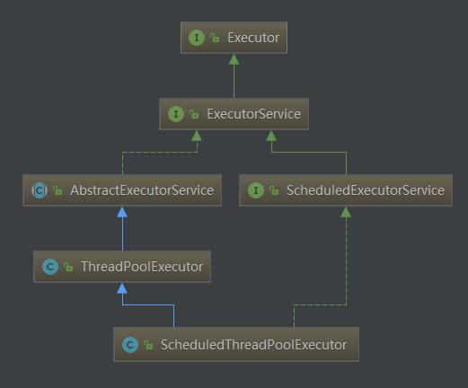
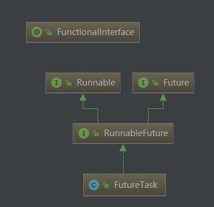

<!-- TOC -->

- [CountDownLatch的用法](#countdownlatch的用法)
- [线程创建](#线程创建)
- [线程间协作](#线程间协作)
    - [join](#join)
    - [wait](#wait)
    - [interrupt](#interrupt)
    - [Condition](#condition)
- [Executor 框架](#executor-框架)
    - [Executor 主要的类和接口](#executor-主要的类和接口)
        - [ThreadPoolExecutor](#threadpoolexecutor)
        - [newFixedThreadPool](#newfixedthreadpool)
        - [newSingleThreadExecutor](#newsinglethreadexecutor)
        - [newScheduledThreadPool](#newscheduledthreadpool)
        - [newCachedThreadPool](#newcachedthreadpool)
        - [Future 接口](#future-接口)
        - [ScheduledThreadPoolExecutor](#scheduledthreadpoolexecutor)
- [ThreadLocal](#threadlocal)
- [Lock](#lock)
    - [Synchronized](#synchronized)
    - [ReentrantLock](#reentrantlock)
        - [ReentranceLock 几个特殊的方法](#reentrancelock-几个特殊的方法)
    - [ReentranceReadWriteLock](#reentrancereadwritelock)
    - [condition](#condition)
    - [公平锁和非公平锁](#公平锁和非公平锁)
- [Timer](#timer)
    - [shedule(TimerTask task, Date date)](#sheduletimertask-task-date-date)
    - [shedule 周期性执行](#shedule-周期性执行)
    - [sheduleAtFixedRate](#sheduleatfixedrate)
- [参考文档](#参考文档)

<!-- /TOC -->

# CountDownLatch的用法

CountDownLatch 是一个同步工具类，用来协调多个线程之间的同步，或者说起到线程之间的通信。

如果想当前线程在别的线程执行完毕后执行，可以使用CountDownLatch。

``` java
/**<p><b>Sample usage:</b> Here is a pair of classes in which a group
 * of worker threads use two countdown latches:
 * <ul>
 * <li>The first is a start signal that prevents any worker from proceeding
 * until the driver is ready for them to proceed;
 * <li>The second is a completion signal that allows the driver to wait
 * until all workers have completed.
 * </ul>
 *
 *  <pre> {@code
 * class Driver { // ...
 *   void main() throws InterruptedException {
 *     CountDownLatch startSignal = new CountDownLatch(1);
 *     CountDownLatch doneSignal = new CountDownLatch(N);
 *
 *     for (int i = 0; i < N; ++i) // create and start threads
 *       new Thread(new Worker(startSignal, doneSignal)).start();
 *
 *     doSomethingElse();            // don't let run yet
 *     startSignal.countDown();      // let all threads proceed
 *     doSomethingElse();
 *     doneSignal.await();           // wait for all to finish
 *   }
 * }
 *
 * class Worker implements Runnable {
 *   private final CountDownLatch startSignal;
 *   private final CountDownLatch doneSignal;
 *   Worker(CountDownLatch startSignal, CountDownLatch doneSignal) {
 *     this.startSignal = startSignal;
 *     this.doneSignal = doneSignal;
 *   }
 *   public void run() {
 *     try {
 *       startSignal.await();
 *       doWork();
 *       doneSignal.countDown();
 *     } catch (InterruptedException ex) {} // return;
 *   }
 *
 *   void doWork() { ... }
 * }}</pre>

```

# 线程创建

线程创建通常有3中方法：
- 继承 Thread 类
- 实现 Runnable 接口
- 实现 Callable 接口

实现 Runnable 接口来创建一个线程：

``` java
public class MyThread extends Thread {

  public static void main(String[] args) {
    Thread t1 = new MyThread();
    t1.start();
    Thread t2 = new Thread(new MyThread2());
    t2.start();
    Callable call = new MyCallable();
    FutureTask<String> task = new FutureTask<String>(call);
    Thread t3 =  new Thread(task);
    t3.start();
  }

  @Override
  public void run() {
    System.out.println("线程运行中---------extends");
  }

  static class MyThread2 implements Runnable{

    @Override
    public void run() {
      System.out.println("线程运行中------runnable");
    }
  }

  static class MyCallable implements Callable{

    @Override
    public String call() throws Exception {
      System.out.println("线程运行中------callable");
      return "call over!";
    }
  }
}
```

# 线程间协作

## join

在线程中调用另一个线程的 join() 方法，会将当前线程挂起，而不是忙等待，直到目标线程结束。

对于以下代码，虽然 b 线程先启动，但是因为在 b 线程中调用了 a 线程的 join() 方法，b 线程会等待 a 线程结束才继续执行，因此最后能够保证 a 线程的输出先于 b 线程的输出。

``` java
public class JoinExample {

    public static void main(String[] args) {
        JoinExample example = new JoinExample();
        example.test();
    }
    private class A extends Thread {
        @Override
        public void run() {
            System.out.println("A");
        }
    }

    private class B extends Thread {

        private A a;

        B(A a) {
            this.a = a;
        }

        @Override
        public void run() {
            try {
                a.join();
            } catch (InterruptedException e) {
                e.printStackTrace();
            }
            System.out.println("B");
        }
    }

    public void test() {
        A a = new A();
        B b = new B(a);
        b.start();
        a.start();
    }
}
```

## wait

wait 方法会使得当前线程进入等待状态，使用 wait() 挂起期间，线程会释放锁。这是因为，如果没有释放锁，那么其它线程就无法进入对象的同步方法或者同步控制块中，那么就无法执行 notify() 或者 notifyAll() 来唤醒挂起的线程，造成死锁。

wait() 和 sleep() 的区别

- wait() 是 Object 的方法，而 sleep() 是 Thread 的静态方法；
- wait() 会释放锁，sleep() 不会。

## interrupt

线程中断的方法有两种：

1. 使用 interrupted()来作为线程循环执行的判断条件

``` java
public class InterruptExample {

    private static class MyThread2 extends Thread {
        @Override
        public void run() {
            while (!interrupted()) {
                // ..
            }
            System.out.println("Thread end");
        }
    }
}
```

2. 使用InterruptedException

通过调用一个线程的 interrupt() 来中断该线程，如果该线程处于阻塞、限期等待或者无限期等待状态，那么就会抛出 InterruptedException，从而提前结束该线程。但是不能中断 I/O 阻塞和 synchronized 锁阻塞

对于以下代码，在 main() 中启动一个线程之后再中断它，由于线程中调用了 Thread.sleep() 方法，因此会抛出一个 InterruptedException，从而提前结束线程，不执行之后的语句。

``` java
public class InterruptExample {

    private static class MyThread1 extends Thread {
        @Override
        public void run() {
            try {
                Thread.sleep(2000);
                System.out.println("Thread run");
            } catch (InterruptedException e) {
                e.printStackTrace();
            }
        }
    }
}
public static void main(String[] args) throws InterruptedException {
    Thread thread1 = new MyThread1();
    thread1.start();
    thread1.interrupt();
    System.out.println("Main run");
}
```

## Condition

java.util.concurrent 类库中提供了 Condition 类来实现线程之间的协调，可以在 Condition 上调用 await() 方法使线程等待，其它线程调用 signal() 或 signalAll() 方法唤醒等待的线程。相比于 wait() 这种等待方式，await() 可以指定等待的条件，因此更加灵活。

``` java
public class AwaitSignalExample {
    private Lock lock = new ReentrantLock();
    private Condition condition = lock.newCondition();

    public void before() {
        lock.lock();
        try {
            System.out.println("before");
            condition.signalAll();
        } finally {
            lock.unlock();
        }
    }

    public void after() {
        lock.lock();
        try {
            condition.await();
            System.out.println("after");
        } catch (InterruptedException e) {
            e.printStackTrace();
        } finally {
            lock.unlock();
        }
    }
}
```

# Executor 框架

Executor 框架主要由3大部分组成，如下：



- 任务

被执行的任务需要实现 Runnable 或者 Callable接口

- 任务的执行

任务执行的核心接口 Executor, 以及继承自 Executor 的 ExecutorService 接口。 Executor 框架有两个关键类实现了 ExecutorService 接口(ThreadPoolExecutor 和 ScheduledThreadPoolExecutor)

- 异步计算的结果



Future 接口和 FutureTask 类

## Executor 主要的类和接口

类和接口 | 说明 
--- | ---
Executor | 一个接口，其定义了一个接收Runnable对象的方法executor，其方法签名为executor(Runnable command), Executor 框架的基础，它将任务的提交和任务的执行分离开来
ExecutorService | 是一个比Executor使用更广泛的子类接口，其提供了生命周期管理的方法，以及可跟踪一个或多个异步任务执行状况返回Future的方法
AbstractExecutorService | ExecutorService执行方法的默认实现
ThreadPoolExecutor | 线程池的核心实现类，用来执行被提交的任务。通过调用Executors以下静态工厂方法来创建线程池并返回一个ExecutorService对象
ScheduledExecutorService | 一个可定时调度任务的接口
ScheduledThreadPoolExecutor | ScheduledExecutorService 的实现类， 可以在给定的延迟后运行命令，或者定期执行命令， 比 Timer更加灵活，功能更加强大。

### ThreadPoolExecutor

ThreadPoolExecutor 使用 Executors来创建，提供了4种类型的ThreadPoolExectuor, 分别是 newFixedThreadPool 、 newSingleThreadExecutor 、newScheduledThreadPool、 newCachedThreadPool.

- 构造函数

``` java
/**
 * Creates a new {@code ThreadPoolExecutor} with the given initial
 * parameters.
 *
 * @param corePoolSize the number of threads to keep in the pool, even
 *        if they are idle, unless {@code allowCoreThreadTimeOut} is set
 * @param maximumPoolSize the maximum number of threads to allow in the
 *        pool
 * @param keepAliveTime when the number of threads is greater than
 *        the core, this is the maximum time that excess idle threads
 *        will wait for new tasks before terminating.
 * @param unit the time unit for the {@code keepAliveTime} argument
 * @param workQueue the queue to use for holding tasks before they are
 *        executed.  This queue will hold only the {@code Runnable}
 *        tasks submitted by the {@code execute} method.
 * @param threadFactory the factory to use when the executor
 *        creates a new thread
 * @param handler the handler to use when execution is blocked
 *        because the thread bounds and queue capacities are reached
 * @throws IllegalArgumentException if one of the following holds:<br>
 *         {@code corePoolSize < 0}<br>
 *         {@code keepAliveTime < 0}<br>
 *         {@code maximumPoolSize <= 0}<br>
 *         {@code maximumPoolSize < corePoolSize}
 * @throws NullPointerException if {@code workQueue}
 *         or {@code threadFactory} or {@code handler} is null
 */
public ThreadPoolExecutor(int corePoolSize,
                          int maximumPoolSize,
                          long keepAliveTime,
                          TimeUnit unit,
                          BlockingQueue<Runnable> workQueue,
                          ThreadFactory threadFactory,
                          RejectedExecutionHandler handler)
```

**参数说明：**

corePoolSize：核心线程数，如果运行的线程少于corePoolSize，则创建新线程来执行新任务，即使线程池中的其他线程是空闲的
 
maximumPoolSize:最大线程数，可允许创建的线程数，corePoolSize和maximumPoolSize设置的边界自动调整池大小：
corePoolSize <运行的线程数< maximumPoolSize:仅当队列满时才创建新线程
corePoolSize=运行的线程数= maximumPoolSize：创建固定大小的线程池
 
keepAliveTime:如果线程数多于corePoolSize,则这些多余的线程的空闲时间超过keepAliveTime时将被终止
 
unit:keepAliveTime参数的时间单位
 
workQueue:保存任务的阻塞队列，与线程池的大小有关：
  当运行的线程数少于corePoolSize时，在有新任务时直接创建新线程来执行任务而无需再进队列
  当运行的线程数等于或多于corePoolSize，在有新任务添加时则选加入队列，不直接创建线程
  当队列满时，在有新任务时就创建新线程
 
threadFactory:使用ThreadFactory创建新线程，默认使用defaultThreadFactory创建线程
 
handle:定义处理被拒绝任务的策略，默认使用ThreadPoolExecutor.AbortPolicy,任务被拒绝时将抛出RejectExecutorException

### newFixedThreadPool

创建可重用且固定线程数的线程池，如果线程池中的所有线程都处于活动状态，此时再提交任务就在队列中等待，直到有可用线程；如果线程池中的某个线程由于异常而结束时，线程池就会再补充一条新线程。

``` java
public static ExecutorService newFixedThreadPool(int nThreads) {
    return new ThreadPoolExecutor(nThreads, nThreads,
                                  0L, TimeUnit.MILLISECONDS,
                                  //使用一个基于FIFO排序的阻塞队列，在所有corePoolSize线程都忙时新任务将在队列中等待
                                  new LinkedBlockingQueue<Runnable>());
}
```

### newSingleThreadExecutor

创建一个单线程的Executor，如果该线程因为异常而结束就新建一条线程来继续执行后续的任务

``` java
public static ExecutorService newSingleThreadExecutor() {
   return new FinalizableDelegatedExecutorService
                     //corePoolSize和maximumPoolSize都等于，表示固定线程池大小为1
                        (new ThreadPoolExecutor(1, 1,
                                                0L, TimeUnit.MILLISECONDS,
                                                new LinkedBlockingQueue<Runnable>()));
}
```

### newScheduledThreadPool

创建一个可延迟执行或定期执行的线程池

``` java
/**
 * Creates a new {@code ScheduledThreadPoolExecutor} with the
 * given core pool size.
 *
 * @param corePoolSize the number of threads to keep in the pool, even
 *        if they are idle, unless {@code allowCoreThreadTimeOut} is set
 * @throws IllegalArgumentException if {@code corePoolSize < 0}
 */
public ScheduledThreadPoolExecutor(int corePoolSize) {
    super(corePoolSize, Integer.MAX_VALUE,
          DEFAULT_KEEPALIVE_MILLIS, MILLISECONDS,
          new DelayedWorkQueue());
}
```

使用 scheduledThread 来模拟心跳：

``` java
public class HeartBeat {
    public static void main(String[] args) {
        ScheduledExecutorService executor = Executors.newScheduledThreadPool(5);
        Runnable task = new Runnable() {
            public void run() {
                System.out.println("HeartBeat.........................");
            }
        };
        executor.scheduleAtFixedRate(task,5,3, TimeUnit.SECONDS);   //5秒后第一次执行，之后每隔3秒执行一次
    }
}
```

### newCachedThreadPool

创建可缓存的线程池，如果线程池中的线程在60秒未被使用就将被移除，在执行新的任务时，当线程池中有之前创建的可用线程就重用可用线程，否则就新建一条线程

``` java
public static ExecutorService newCachedThreadPool() {
    return new ThreadPoolExecutor(0, Integer.MAX_VALUE,
                                  60L, TimeUnit.SECONDS,
                                  //使用同步队列，将任务直接提交给线程
                                  new SynchronousQueue<Runnable>());
}
```

例子：

``` java
public class ThreadPoolTest {
    public static void main(String[] args) throws InterruptedException {
     ExecutorService threadPool = Executors.newCachedThreadPool();//线程池里面的线程数会动态变化，并可在线程线被移除前重用
        for (int i = 1; i <= 3; i ++) {
            final  int task = i;   //10个任务
            TimeUnit.SECONDS.sleep(1);
            threadPool.execute(new Runnable() {    //接受一个Runnable实例
                public void run() {
                        System.out.println("线程名字： " + Thread.currentThread().getName() +  "  任务名为： "+task);
                }
            });
        }
    }
}

```

输出：（为每个任务新建一条线程，共创建了3条线程）
线程名字： pool-1-thread-1 任务名为： 1
线程名字： pool-1-thread-2 任务名为： 2
线程名字： pool-1-thread-3 任务名为： 3
去掉第6行的注释其输出如下：（始终重复利用一条线程，因为newCachedThreadPool能重用可用线程）
线程名字： pool-1-thread-1 任务名为： 1
线程名字： pool-1-thread-1 任务名为： 2
线程名字： pool-1-thread-1 任务名为： 3

### Future 接口

Future 接口和实现了Future接口的FutureTask类用来表示异步计算的结果。当我们把Runnable 或者 Callable 接口的实现类提交给ThreadPoolExecutor时，Exector会返回给FutureTask对象

### ScheduledThreadPoolExecutor

ScheduledThreadPoolExecutor 继承自 ThreadPoolExecutor, 主要用来在给定的延迟后运行任务。 主要包含3个成员变量：

- long: time ; 表示这个任务将要被执行的具体时间
- long: sequenceNumber; 表示这个任务被添加到SheduledThreadPoolExecutor 中的序号
- long：period; 表示任务执行的间隔周期

该类采用了DelyQueue，封装了一个优先队列，该队列会对队列中的SheduledFutureTask 进行排序。time小的会排在前面，如果time相同，则会比较sequenceNumber, 就是说如果两个任务的执行时间相同，谁先提交就谁先执行

# ThreadLocal

变量值的共享可以采用public static 的类变量，但是在多线程情况下，static 类变量显然不能满足多线程的读写，因此采用ThreadLocal 变量来存储多线程下的变量的副本。

``` java
/*
 * Copyright (c) 2018.  Xiong Raorao. All rights reserved.
 * Project Name: book-notes
 * File Name: Test.java
 * Date: 18-7-25 下午5:32
 * Author: Xiong Raorao
 */

package com.raorao.java.thread;

/**
 * .
 *
 * @author Xiong Raorao
 * @since 2018-07-25-17:32
 */
public class ThreadLocalTest {
  private static ThreadLocal<Integer> local = new ThreadLocal<>();
  public static void main(String[] args) throws InterruptedException {
    Thread t1 = new Thread(() -> {
      System.out.println(" I am t1");
      local.set(1);
      try {
        Thread.sleep(2000);
        System.out.println("t1 value: "  + local.get());
      } catch (InterruptedException e) {
        e.printStackTrace();
      }
    });
    Thread.sleep(2000);
    Thread t2 = new Thread(() -> {
      System.out.println("I am t2");
      System.out.println("before set , I get " + local.get());
      try {
        Thread.sleep(2000);
        local.set(2);
        System.out.println("set after 2 s, I get " + local.get());
      } catch (InterruptedException e) {
        e.printStackTrace();
      }
    });
    t2.start();
    t1.start();// 无论怎么更换两个线程的启动顺序，得到的值是不一样的
  }
}

```

# Lock

除了使用synchronized 关键字加锁同步之外，也可以实现Lock 来自定义同步过程。

## Synchronized

jvm提供的一种互斥同步锁的方式

synchronized 可以作用于代码块，方法，类方法，类等，锁加载的

## ReentrantLock

``` java
public class LockExample {

    private Lock lock = new ReentrantLock();

    public void func() {
        lock.lock();
        try {
            for (int i = 0; i < 10; i++) {
                System.out.print(i + " ");
            }
        } finally {
            lock.unlock(); // 确保释放锁，从而避免发生死锁。
        }
    }

    public static void main(String[] args) {
    LockExample lockExample = new LockExample();
    ExecutorService executorService = Executors.newCachedThreadPool();
    executorService.execute(() -> lockExample.func());
    executorService.execute(() -> lockExample.func());
    }
}

```

输出：

0 1 2 3 4 5 6 7 8 9 0 1 2 3 4 5 6 7 8 9

**synchronized 和 ReentrantLock的比较：**

1. 锁的实现

synchronized 是 JVM 实现的，而 ReentrantLock 是 JDK 实现的。

2. 性能

新版本 Java 对 synchronized 进行了很多优化，例如自旋锁等，synchronized 与 ReentrantLock 大致相同。

3. 等待可中断

当持有锁的线程长期不释放锁的时候，正在等待的线程可以选择放弃等待，改为处理其他事情。

ReentrantLock 可中断，而 synchronized 不行。

4. 公平锁

公平锁是指多个线程在等待同一个锁时，必须按照申请锁的时间顺序来依次获得锁。

synchronized 中的锁是非公平的，ReentrantLock 默认情况下也是非公平的，但是也可以是公平的。

5. 锁绑定多个条件

一个 ReentrantLock 可以同时绑定多个 Condition 对象。

### ReentranceLock 几个特殊的方法

getHoldCount(): 查询当前线程保持此锁的个数
getQueueLength(): 返回正在等待获取次锁定的估计线程数。比如有5个线程，其中1个线程执行await()方法,调用该方法就返回4
getWaitQueueLength(): 返回等待与此锁定相关的给定条件Condition的线程估计数。

hasQueuedThread(Thread t): 查询指定线程是否正在等待获取此锁定
hasQueuedThreads(): 查询是否有线程正在等待获取此锁定
hasWaiters(Condition condition): 查询是否有线程正在等待与次锁定有关的condition条件

## ReentranceReadWriteLock

ReentranceLock 是完全互斥锁，同一时间，只有同一个线程在执行ReentrantLock.lock()后面的任务，虽然安全，但是效率低下。

ReentranceReadWriteLock（读写锁），读锁是共享锁，多个读锁之间不互斥，读锁和写锁之间互斥，写锁和写锁之间互斥。

``` java
package com.raorao.java.thread;

import java.util.concurrent.locks.ReentrantReadWriteLock;

/**
 * 读写锁测试.
 *
 * @author Xiong Raorao
 * @since 2018-08-06-11:48
 */
public class ReentrantReadWriteLockTest {

  private ReentrantReadWriteLock lock = new ReentrantReadWriteLock();

  public void read(){
    lock.readLock().lock(); // 读锁
    System.out.println("获得读锁 " + Thread.currentThread().getName() + " " + System.currentTimeMillis());
    try {
      Thread.sleep(2000);
    } catch (InterruptedException e) {
      e.printStackTrace();
    }finally {
      lock.readLock().unlock();
    }
  }

  public void write(){
    lock.writeLock().lock(); // 写锁
    System.out.println("获得写锁 " + Thread.currentThread().getName() + " " + System.currentTimeMillis());
    try {
      Thread.sleep(2000);
    } catch (InterruptedException e) {
      e.printStackTrace();
    }finally {
      lock.writeLock().unlock();
    }
  }

  public static void main(String[] args) {
    // 1. 读读共享, A 和 B 同时获得锁
    ReentrantReadWriteLockTest test = new ReentrantReadWriteLockTest();
    Thread t1 = new Thread(()-> {
      Thread.currentThread().setName("A");
      test.read();
    });
    Thread t2 = new Thread(()-> {
      Thread.currentThread().setName("B");
      test.read();
    });
    t1.start();
    t2.start();

    // 2. 写写互斥, D线程比C线程落后两秒执行
    t1 = new Thread(()->{
      Thread.currentThread().setName("C");
      test.write();
    });
    t2 = new Thread(()->{
      Thread.currentThread().setName("D");
      test.write();
    });
    t1.start();
    t2.start();

  }
}

```

读写和写读两个锁也是互斥的，这里就不测试了。

## condition

condition 可以用于实现线程wait 和 notify，主要的方法有await()、signal() 和 signalAll() 方法，对应Object 类的 wait(), notify() 和notifyAll()方法，区别是，**前者只会通知持有锁的在等待的对象，后者则是对所有等待的线程通知，效率低下**

``` java
package com.raorao.java.thread;

import java.util.concurrent.locks.Condition;
import java.util.concurrent.locks.Lock;
import java.util.concurrent.locks.ReentrantLock;

/**
 * 可重入锁测试.
 *
 * @author Xiong Raorao
 * @since 2018-08-06-10:27
 */
public class ReentrantLockTest {

  private Lock lock = new ReentrantLock();
  private Condition conditionA = lock.newCondition();
  private Condition conditionB = lock.newCondition();

  public static void main(String[] args) throws InterruptedException {
    ReentrantLockTest test = new ReentrantLockTest();
    new Thread(() -> test.testLock()).start();
    new Thread(() -> test.testLock()).start();

    Thread t = new Thread(() -> test.awaitA());
    t.start();
    Thread.sleep(2000);
    test.signalA();

  }

  public void awaitA() {
    lock.lock();
    try {
      System.out.println("before awaitA at " + System.currentTimeMillis());
      conditionA.await(); // 在此之前必须获得锁，不然报错illegalMonitorStateException 错误
      System.out.println("after awaitA at " + System.currentTimeMillis());
    } catch (InterruptedException e) {
      e.printStackTrace();
    } finally {
      lock.unlock();
      System.out.println(" 释放锁 awaitA ");
    }
  }

  public void signalA() {
    lock.lock();
    try {
      System.out.println("signalA at " + System.currentTimeMillis());
      conditionA.signal(); // 在此之前必须获得锁，不然报错illegalMonitorStateException 错误
      System.out.println("signalA over at " + System.currentTimeMillis());
    } finally {
      lock.unlock();
      System.out.println(" 释放锁 signalA ");
    }
  }

  public void testLock() {
    lock.lock();
    for (int i = 0; i < 5; i++) {
      System.out.print(i + " ");
    }
    System.out.println();
    lock.unlock();
  }
}

```

上面的程序对应的是利用Condition的进行等待和通知。

## 公平锁和非公平锁

公平锁：线程获取锁的顺序使按照线程加锁的顺序来分配的，满足FIFO
非公平锁：等待线程抢占获取锁，也有可能造成某个线程一直获取不到锁

ReentrantLock 构造函数输入可以设置是否是公平锁，默认非公平锁。


# Timer

Timer 定时器，主要负责计划任务的功能，也就是在指定的时间开始执行某一个任务。

## shedule(TimerTask task, Date date)

``` java
package com.raorao.java.thread;

import java.text.ParseException;
import java.text.SimpleDateFormat;
import java.util.Date;
import java.util.Timer;
import java.util.TimerTask;

/**
 * 定时器.
 *
 * @author Xiong Raorao
 * @since 2018-08-06-13:07
 */
public class TimerTest {
  private static Timer timer = new Timer();

  static class MyTask extends TimerTask{

    @Override
    public void run() {
      System.out.println("运行时间： " + new Date());
    }
  }

  public static void main(String[] args) {
    MyTask task1 = new MyTask();
    try {
      Date taskDate = new SimpleDateFormat("yyyy-MM-dd HH:mm:ss").parse("2018-08-06 13:15:00");
      System.out.println("执行时间： " + taskDate.toLocaleString() + "，当前时间" + new Date().toLocaleString());
      timer.schedule(task1, taskDate);
    } catch (ParseException e) {
      e.printStackTrace();
    }
  }
}

```

输出：

执行时间： 2018-8-6 13:15:00，当前时间2018-8-6 13:14:27
运行时间： Mon Aug 06 13:15:00 CST 2018

如果任务执行时间比当前时间晚，则到了计划时间执行，否则立即执行。

## shedule 周期性执行

函数： shedule(TimeTask task, Date firstTime, long period)
表示在指定的日期之后，按照指定的时间间隔(period)周期性的无休止的执行某一任务。

**同样满足如果是未来的任务，到计划时间执行，否则立即执行**

## sheduleAtFixedRate

该方法和shedule方法的区别在于任务不延迟的情况。

shedule: 如果执行任务的时间没有被延迟，那么下一次任务的执行时间参考的是上一次任务的“开始”时间计算。

sheduleAtFixedRate: 如果执行任务的时间没有被延迟，那么下一次任务的执行时间参考的是上一次任务的“结束”时间计算。

# 参考文档

- [java并发编程--Executor框架](https://www.cnblogs.com/MOBIN/p/5436482.html)