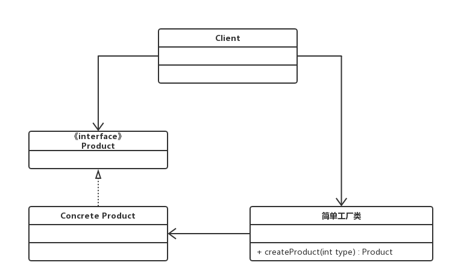
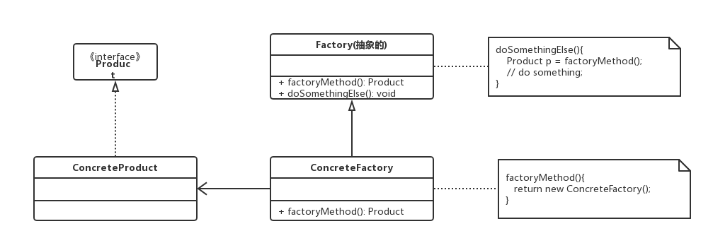

<!-- TOC -->

- [快速理解设计模式](#快速理解设计模式)
- [创建型模式](#创建型模式)
    - [单例模式](#单例模式)
    - [简单工厂模式](#简单工厂模式)
    - [工厂方法](#工厂方法)
    - [抽象工厂模式](#抽象工厂模式)
    - [建造者（生成器）模式](#建造者生成器模式)

<!-- /TOC -->

# 快速理解设计模式

设计模式主要分为3大类，分别是创建型模式、行为型模式和结构型模式。

# 创建型模式

创建型模式主要是和创建对象相关的一些设计模式

## 单例模式

目的：确保某个类在jvm中只有一个实例，提供该实例的全局访问点。

类图：使用一个私有构造函数、私有静态变量，和一个共有的静态函数来实现

懒汉式（线程不安全）、饿汉式、懒汉式（线程安全）

双重校验锁（注意volatile): 

``` java
public class Singleton {

    private volatile static Singleton uniqueInstance;

    private Singleton() {
    }

    public static Singleton getUniqueInstance() {
        if (uniqueInstance == null) {
            synchronized (Singleton.class) {
                if (uniqueInstance == null) {
                    uniqueInstance = new Singleton();
                }
            }
        }
        return uniqueInstance;
    }
}
```

为什么要使用volatile？
uniqueInstance = new Singleton(); 这段代码其实是分三步执行：

1. 分配内存空间
2. 初始化对象
3. 将 uniqueInstance 指向分配的内存地址

JVM的指令重排序可能导致执行顺序编程1-3-2, 在多线程情况下，可能获取一个没有初始化的实例，导致程序出错。

使用volatile 可以禁止JVM的指令重排序，保证多线程的环境下程序的正常运行。

静态内部类：

实现延迟加载，也能实现一次加载，线程安全、相当于同步的懒汉式

枚举类型：单例模式的最佳实践，实现简单，并且能在面对复杂的序列化或者反射攻击的时候，能够防止实例化多次。

## 简单工厂模式

目的：创建对象的时候隐藏内部细节，提供一个创建对象的通用接口。

类图：在简单工厂模式中，根据传入type类型来决定到底生产哪种具体的产品类



## 工厂方法

目的：工厂方法把类的实例化操作放到子类来执行，本身抽象化。

类图：在简单工厂中，创建对象的是另一个类，而在工厂方法中，是由子类来创建对象。



## 抽象工厂模式

目的： 抽象工厂模式使用抽象工厂类来产生多个具体的工厂，由具体的工厂来生产各自的产品，最终关联到抽象产品类中，client通过抽象工厂来生产具体的产品。


## 建造者（生成器）模式

