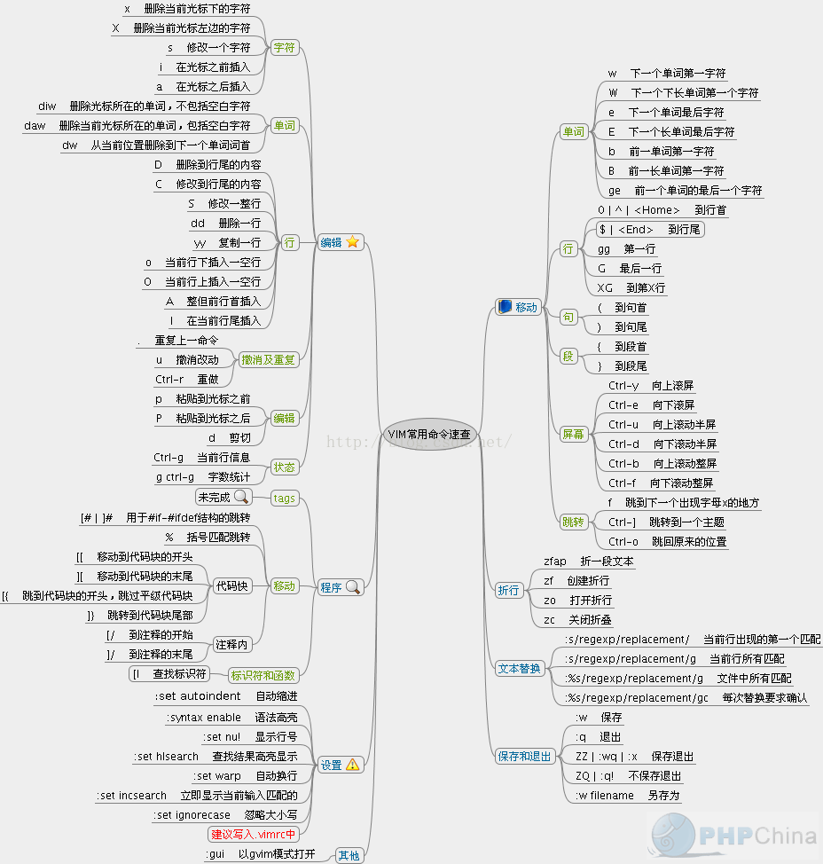

<!-- TOC -->

- [文件管理](#文件管理)
    - [磁盘容量](#磁盘容量)
    - [实体链接和符号链接](#实体链接和符号链接)
        - [inode](#inode)
        - [目录文件和档案文件](#目录文件和档案文件)
        - [实体链接](#实体链接)
        - [软连接](#软连接)
    - [目录](#目录)
        - [Linux目录配置的依据--FHS](#linux目录配置的依据--fhs)
        - [相对路径和绝对路径](#相对路径和绝对路径)
        - [目录操作](#目录操作)
    - [查看文件](#查看文件)
        - [直接查看](#直接查看)
        - [可翻页检视](#可翻页检视)
        - [数据撷取](#数据撷取)
        - [查看二进制文档](#查看二进制文档)
        - [新建文档和修改文档时间](#新建文档和修改文档时间)
    - [属性](#属性)
        - [文件隐藏属性](#文件隐藏属性)
        - [查看文件类型](#查看文件类型)
        - [文件种类](#文件种类)
        - [文件限制](#文件限制)
    - [权限](#权限)
        - [文件权限](#文件权限)
        - [目录权限](#目录权限)
        - [改变属性和权限](#改变属性和权限)
        - [默认权限](#默认权限)
        - [文件特殊权限](#文件特殊权限)
    - [文件查找](#文件查找)
        - [命令查找](#命令查找)
        - [文件查找](#文件查找-1)
    - [磁盘](#磁盘)
        - [磁盘分区](#磁盘分区)
        - [磁盘格式化](#磁盘格式化)
        - [磁盘校验](#磁盘校验)
        - [磁盘挂载和卸载](#磁盘挂载和卸载)
        - [磁盘参数修订](#磁盘参数修订)
        - [压缩和打包](#压缩和打包)
- [shell](#shell)
    - [vi/vim 编辑器](#vivim-编辑器)
    - [bash](#bash)
        - [常见bash命令](#常见bash命令)
        - [变量](#变量)
        - [进站与欢迎信息](#进站与欢迎信息)
        - [读入环境变量](#读入环境变量)
    - [数据流](#数据流)
        - [命令运行时的判断](#命令运行时的判断)
    - [管道命令](#管道命令)
        - [撷取命令](#撷取命令)
        - [排序命令](#排序命令)
        - [双向重导向 tee](#双向重导向-tee)
        - [字符转换命令](#字符转换命令)
        - [分割命令](#分割命令)
        - [参数代换](#参数代换)
        - [减号-的作用](#减号-的作用)
- [Linux 共享内存](#linux-共享内存)
- [Linux 进程通信（IPC）的方式](#linux-进程通信ipc的方式)

<!-- /TOC -->
# 文件管理

## 磁盘容量

磁盘容量使用du 和 df 命令查看。

du: 评估文件系统的磁盘使用量(常用在推估目录所占容量)

``` bash
du [-ahskm] 文件或目录名称
选项与参数：
-a  ：列出所有的文件与目录容量，因为默认仅统计目录底下的文件量而已。
-h  ：以人们较易读的容量格式 (G/M) 显示；
-s  ：列出总量而已，而不列出每个各别的目录占用容量；
-S  ：不包括子目录下的总计，与 -s 有点差别。
-k  ：以 KBytes 列出容量显示；
-m  ：以 MBytes 列出容量显示；
```

df: 列出文件系统的整体磁盘使用量；

``` bash
df [-ahikHTm] [目录或文件名]
选项与参数：
-a  ：列出所有的文件系统，包括系统特有的 /proc 等文件系统；
-k  ：以 KBytes 的容量显示各文件系统；
-m  ：以 MBytes 的容量显示各文件系统；
-h  ：以人们较易阅读的 GBytes, MBytes, KBytes 等格式自行显示；
-H  ：以 M=1000K 取代 M=1024K 的进位方式；
-T  ：连同该 partition 的 filesystem 名称 (例如 ext3) 也列出；
-i  ：不用硬盘容量，而以 inode 的数量来显示
```

## 实体链接和符号链接

ln 命令用来创建实体链接和符号链接。软链接可以看作是Windows中的快捷方式，可以让你快速链接到目标档案或目录。硬链接则透过文件系统的inode来产生新档名，而不是产生新档案。

创建方法：

软链接（符号链接） ln -s   source  target 
硬链接 （实体链接）ln       source  target

``` bash
 ln [-sf] 来源文件 目标文件
选项与参数：
-s  ：如果不加任何参数就进行连结，那就是hard link，至于 -s 就是symbolic link
-f  ：如果 目标文件 存在时，就主动的将目标文件直接移除后再创建！
```

### inode

linux 创建分区并格式化的时候，整个分区会被划分为两个部分，即inode区和data block(实际数据放置在数据区域中）这个inode即是（目录、档案）文件在一个文件系统中的唯一标识，需要访问这个文件的时候必须先找到并读取这个 文件的 inode。 Inode 里面存储了文件的很多重要参数，其中唯一标识称作 Inumber, 其他信息还有创建时间（ctime）、修改时间(mtime) 、文件大小、属主、归属的用户组、读写权限、数据所在block号等信息。


### 目录文件和档案文件

目录文件：记录该目录下的文件名
档案文件：记录实际文件数据

inode本身并不记录文件名，文件名记录在目录文件的block当中，所以新增、删除、更改文件名与目录的W权限有关。因此当我们要读某个档案时，就务必经过其目录的inode和block，然后才能够找到待读取档案的inode号，最终才会读到正确的档案block内的数据。系统是通过索引节点(而不是文件名)来定位每一个文件。

### 实体链接

实体链接也叫硬链接。如下图所示，对于任何一个文件，均能修改数据,删除其中一个，其他的依然能够使用。


多个档名对应同一个inode，硬链接只是在某个目录下新增一笔档名链 接到某个inode号码的关联记录而已。如果将上图中任何一个档名删除，档案的inode与block都还存在，依然还可以通过另一个档名来读取正确的档 案数据。此外，不论用哪一个档名来编辑，最终的结果都会写入相同的inode和block中，因此均能进行数据的修改。

**注意：**

- 不能跨 Filesystem;
- 不能 link 目录。

### 软连接


软连接就是建立一个独立的文件，而这个文件会让数据的读取指向它link的那个档案的档名，由于只是作为指向的动作，所以当来源档案被删除之后，软连接的档案无法开启，因为找不到原始档名。连结档的内容只有档名，根据档名链接到正确的目录进一步取得目标档案的inode，最终就能够读取到正确的数据。如果目标档案的原始档名被删除了那么整个环节就进行不下去了。

## 目录


### Linux目录配置的依据--FHS

FHS---Filesystem Hierarchy Standard ,linux 程序文件目录配置标准

| |可分享的(shareable)	| 不可分享的(unshareable)
--- | ---| ---
不变的(static) |	/usr (软件放置处)	| /etc (配置文件)
||/opt (第三方协力软件)	| /boot (开机与核心档)
可变动的(variable)	| /var/mail (使用者邮件信箱)| /var/run (程序相关)
||/var/spool/news (新闻组)|	/var/lock (程序相关)|

- [参考文档](http://cn.linux.vbird.org/linux_basic/0210filepermission_3.php)

### 相对路径和绝对路径
相对路径：相对于当前路径的路径

``` bash
.         代表此层目录
..        代表上一层目录
-         代表前一个工作目录
~         代表『目前使用者身份』所在的家目录
~account  代表 account 这个使用者的家目录(account是个帐号名称)
```

绝对路径：/开头的路径

### 目录操作

cd：变换目录
pwd：显示目前的目录
mkdir：创建一个新的目录
rmdir：删除一个空的目录
ls: 查看目录或者文件
cp: 复制
rm: 删除文件或者目录
mv: 移动文件或者目录，也可以重命名文件或者目录

``` bash
ls [--full-time] 目录名称
选项与参数：
-a  ：全部的文件，连同隐藏档( 开头为 . 的文件) 一起列出来(常用)
-A  ：全部的文件，连同隐藏档，但不包括 . 与 .. 这两个目录
-d  ：仅列出目录本身，而不是列出目录内的文件数据(常用)
-f  ：直接列出结果，而不进行排序 (ls 默认会以档名排序！)
-F  ：根据文件、目录等资讯，给予附加数据结构，例如：
      *:代表可运行档； /:代表目录； =:代表 socket 文件； |:代表 FIFO 文件；
-h  ：将文件容量以人类较易读的方式(例如 GB, KB 等等)列出来；
-i  ：列出 inode 号码，inode 的意义下一章将会介绍；
-l  ：长数据串列出，包含文件的属性与权限等等数据；(常用)
-n  ：列出 UID 与 GID 而非使用者与群组的名称 (UID与GID会在帐号管理提到！)
-r  ：将排序结果反向输出，例如：原本档名由小到大，反向则为由大到小；
-R  ：连同子目录内容一起列出来，等於该目录下的所有文件都会显示出来；
-S  ：以文件容量大小排序，而不是用档名排序；
-t  ：依时间排序，而不是用档名。
--color=never  ：不要依据文件特性给予颜色显示；
--color=always ：显示颜色
--color=auto   ：让系统自行依据配置来判断是否给予颜色
--full-time    ：以完整时间模式 (包含年、月、日、时、分) 输出
--time={atime,ctime} ：输出 access 时间或改变权限属性时间 (ctime) 
                       而非内容变更时间 (modification time)

cp [options] source1 source2 source3 .... directory
选项与参数：
-a  ：相当於 -pdr 的意思，至於 pdr 请参考下列说明；(常用)
-d  ：若来源档为连结档的属性(link file)，则复制连结档属性而非文件本身；
-f  ：为强制(force)的意思，若目标文件已经存在且无法开启，则移除后再尝试一次；
-i  ：若目标档(destination)已经存在时，在覆盖时会先询问动作的进行(常用)
-l  ：进行硬式连结(hard link)的连结档创建，而非复制文件本身；
-p  ：连同文件的属性一起复制过去，而非使用默认属性(备份常用)；
-r  ：递回持续复制，用於目录的复制行为；(常用)
-s  ：复制成为符号连结档 (symbolic link)，亦即『捷径』文件；
-u  ：若 destination 比 source 旧才升级 destination ！
最后需要注意的，如果来源档有两个以上，则最后一个目的档一定要是『目录』才行！

rm [-fir] 文件或目录
选项与参数：
-f  ：就是 force 的意思，忽略不存在的文件，不会出现警告信息；
-i  ：互动模式，在删除前会询问使用者是否动作
-r  ：递回删除啊！最常用在目录的删除了！这是非常危险的选项！！！

mv [options] source1 source2 source3 .... directory
选项与参数：
-f  ：force 强制的意思，如果目标文件已经存在，不会询问而直接覆盖；
-i  ：若目标文件 (destination) 已经存在时，就会询问是否覆盖！
-u  ：若目标文件已经存在，且 source 比较新，才会升级 (update)


[root@www ~]# basename /etc/sysconfig/network
network         <== 很简单！就取得最后的档名～
[root@www ~]# dirname /etc/sysconfig/network
/etc/sysconfig  <== 取得的变成目录名了！

```

## 查看文件

### 直接查看

cat  由第一行开始显示文件内容
tac  从最后一行开始显示，可以看出 tac 是 cat 的倒著写！
nl   显示的时候，顺道输出行号！

``` bash
cat [-AbEnTv]
选项与参数：
-A  ：相当於 -vET 的整合选项，可列出一些特殊字符而不是空白而已；
-b  ：列出行号，仅针对非空白行做行号显示，空白行不标行号！
-E  ：将结尾的断行字节 $ 显示出来；
-n  ：列印出行号，连同空白行也会有行号，与 -b 的选项不同；
-T  ：将 [tab] 按键以 ^I 显示出来；
-v  ：列出一些看不出来的特殊字符

tac /etc/issue

Kernel \r on an \m
CentOS release 5.3 (Final)
# 嘿嘿！与刚刚上面的范例一比较，是由最后一行先显示喔！

nl [-bnw] 文件
选项与参数：
-b  ：指定行号指定的方式，主要有两种：
      -b a ：表示不论是否为空行，也同样列出行号(类似 cat -n)；
      -b t ：如果有空行，空的那一行不要列出行号(默认值)；
-n  ：列出行号表示的方法，主要有三种：
      -n ln ：行号在萤幕的最左方显示；
      -n rn ：行号在自己栏位的最右方显示，且不加 0 ；
      -n rz ：行号在自己栏位的最右方显示，且加 0 ；
-w  ：行号栏位的占用的位数。

```

### 可翻页检视
more 一页一页的显示文件内容
less 与 more 类似，但是比 more 更好的是，他可以往前翻页！

``` bash
more /etc/man.config
#
# Generated automatically from man.conf.in by the
# configure script.
#
# man.conf from man-1.6d
....(中间省略)....
--More--(28%)  <== 重点在这一行喔！你的光标也会在这里等待你的命令

```

空白键 (space)：代表向下翻一页；
Enter         ：代表向下翻『一行』；
/字串         ：代表在这个显示的内容当中，向下搜寻『字串』这个关键字；
:f            ：立刻显示出档名以及目前显示的行数；
q             ：代表立刻离开 more ，不再显示该文件内容。
b 或 [ctrl]-b ：代表往回翻页，不过这动作只对文件有用，对管线无用。

``` bash
less /etc/man.config
#
# Generated automatically from man.conf.in by the
# configure script.
#
# man.conf from man-1.6d
....(中间省略)....
:   <== 这里可以等待你输入命令！
```

空白键    ：向下翻动一页；
[pagedown]：向下翻动一页；
[pageup]  ：向上翻动一页；
/字串     ：向下搜寻『字串』的功能；
?字串     ：向上搜寻『字串』的功能；
n         ：重复前一个搜寻 (与 / 或 ? 有关！)
N         ：反向的重复前一个搜寻 (与 / 或 ? 有关！)
q         ：离开 less 这个程序；

### 数据撷取

head 只看头几行
tail 只看尾巴几行

``` bash
head [-n number] 文件 
选项与参数：
-n  ：后面接数字，代表显示几行的意思

tail [-n number] 文件 
选项与参数：
-n  ：后面接数字，代表显示几行的意思
-f  ：表示持续侦测后面所接的档名，要等到按下[ctrl]-c才会结束tail的侦测
```

### 查看二进制文档

od   以二进位的方式读取文件内容！

``` bash
od [-t TYPE] 文件
选项或参数：
-t  ：后面可以接各种『类型 (TYPE)』的输出，例如：
      a       ：利用默认的字节来输出；
      c       ：使用 ASCII 字节来输出
      d[size] ：利用十进位(decimal)来输出数据，每个整数占用 size bytes ；
      f[size] ：利用浮点数值(floating)来输出数据，每个数占用 size bytes ；
      o[size] ：利用八进位(octal)来输出数据，每个整数占用 size bytes ；
      x[size] ：利用十六进位(hexadecimal)来输出数据，每个整数占用 size bytes ；
```

### 新建文档和修改文档时间

touch 修改文件时间或者新建文件

``` bash
touch [-acdmt] 文件
选项与参数：
-a  ：仅修订 access time；
-c  ：仅修改文件的时间，若该文件不存在则不创建新文件；
-d  ：后面可以接欲修订的日期而不用目前的日期，也可以使用 --date="日期或时间"
-m  ：仅修改 mtime ；
-t  ：后面可以接欲修订的时间而不用目前的时间，格式为[YYMMDDhhmm]
```

## 属性

``` bash

[root@www ~]# ls -al
total 156
drwxr-x---   4    root   root     4096   Sep  8 14:06 .
drwxr-xr-x  23    root   root     4096   Sep  8 14:21 ..
-rw-------   1    root   root     1474   Sep  4 18:27 anaconda-ks.cfg
-rw-------   1    root   root      199   Sep  8 17:14 .bash_history
-rw-r--r--   1    root   root       24   Jan  6  2007 .bash_logout
-rw-r--r--   1    root   root      191   Jan  6  2007 .bash_profile
-rw-r--r--   1    root   root      176   Jan  6  2007 .bashrc
-rw-r--r--   1    root   root      100   Jan  6  2007 .cshrc
drwx------   3    root   root     4096   Sep  5 10:37 .gconf      <=范例说明处
drwx------   2    root   root     4096   Sep  5 14:09 .gconfd
-rw-r--r--   1    root   root    42304   Sep  4 18:26 install.log <=范例说明处
-rw-r--r--   1    root   root     5661   Sep  4 18:25 install.log.syslog
[    1   ][  2 ][   3  ][  4 ][    5   ][     6     ][       7          ]
[  权限  ][连结][拥有者][群组][文件容量][  修改日期 ][      檔名        ]

```

### 文件隐藏属性

配置文件隐藏属性：

``` bash
[root@www ~]# chattr [+-=][ASacdistu] 文件或目录名称
选项与参数：
+   ：添加某一个特殊参数，其他原本存在参数则不动。
-   ：移除某一个特殊参数，其他原本存在参数则不动。
=   ：配置一定，且仅有后面接的参数

A  ：当配置了 A 这个属性时，若你有存取此文件(或目录)时，他的存取时间 atime
     将不会被修改，可避免I/O较慢的机器过度的存取磁碟。这对速度较慢的计算机有帮助
S  ：一般文件是非同步写入磁碟的(原理请参考第五章sync的说明)，如果加上 S 这个
     属性时，当你进行任何文件的修改，该更动会『同步』写入磁碟中。
a  ：当配置 a 之后，这个文件将只能添加数据，而不能删除也不能修改数据，只有root 
     才能配置这个属性。 
c  ：这个属性配置之后，将会自动的将此文件『压缩』，在读取的时候将会自动解压缩，
     但是在储存的时候，将会先进行压缩后再储存(看来对於大文件似乎蛮有用的！)
d  ：当 dump 程序被运行的时候，配置 d 属性将可使该文件(或目录)不会被 dump 备份
i  ：这个 i 可就很厉害了！他可以让一个文件『不能被删除、改名、配置连结也无法
     写入或新增数据！』对於系统安全性有相当大的助益！只有 root 能配置此属性
s  ：当文件配置了 s 属性时，如果这个文件被删除，他将会被完全的移除出这个硬盘
     空间，所以如果误删了，完全无法救回来了喔！
u  ：与 s 相反的，当使用 u 来配置文件时，如果该文件被删除了，则数据内容其实还
     存在磁碟中，可以使用来救援该文件喔！
注意：属性配置常见的是 a 与 i 的配置值，而且很多配置值必须要身为 root 才能配置

范例：请尝试到/tmp底下创建文件，并加入 i 的参数，尝试删除看看。
[root@www ~]# cd /tmp
[root@www tmp]# touch attrtest     <==创建一个空文件
[root@www tmp]# chattr +i attrtest <==给予 i 的属性
[root@www tmp]# rm attrtest        <==尝试删除看看
rm: remove write-protected regular empty file `attrtest'? y
rm: cannot remove `attrtest': Operation not permitted  <==操作不许可
# 看到了吗？呼呼！连 root 也没有办法将这个文件删除呢！赶紧解除配置！

范例：请将该文件的 i 属性取消！
[root@www tmp]# chattr -i attrtest
```
显示文件隐藏属性：
``` bash
[root@www ~]# lsattr [-adR] 文件或目录
选项与参数：
-a ：将隐藏档的属性也秀出来；
-d ：如果接的是目录，仅列出目录本身的属性而非目录内的档名；
-R ：连同子目录的数据也一并列出来！ 

[root@www tmp]# chattr +aij attrtest
[root@www tmp]# lsattr attrtest
----ia---j--- attrtest
```

### 查看文件类型

file 指令：

``` bash
[root@www ~]# file ~/.bashrc
/root/.bashrc: ASCII text  <==告诉我们是 ASCII 的纯文字档啊！
[root@www ~]# file /usr/bin/passwd
/usr/bin/passwd: setuid ELF 32-bit LSB executable, Intel 80386, version 1 
(SYSV), for GNU/Linux 2.6.9, dynamically linked (uses shared libs), for 
GNU/Linux 2.6.9, stripped
# 运行档的数据可就多的不得了！包括这个文件的 suid 权限、兼容於 Intel 386
# 等级的硬件平台、使用的是 Linux 核心 2.6.9 的动态函式库连结等等。
[root@www ~]# file /var/lib/mlocate/mlocate.db
/var/lib/mlocate/mlocate.db: data  <== 这是 data 文件！
```

### 文件种类

- 正规文件(regular file )：

纯文本档(ASCII): 可以直接打开编辑的文本文件

二进制文件(binary): 通常是编译得到的可执行文件

数据文件(data): 通常是应用程序的需要读取的特定格式的文件（其实也是二进制文件）

- 目录

就是目录啰～第一个属性为 [ d ]，例如 [drwxrwxrwx]。

- 连结档(link)：

就是类似Windows系统底下的快捷方式啦！ 第一个属性为 [ l ](英文L的小写)，例如 [lrwxrwxrwx] ；

- 设备与装置文件(device)：

与系统周边及储存等相关的一些文件， 通常都集中在/dev这个目录之下！通常又分为两种：

区块(block)设备档 ：就是一些储存数据， 以提供系统随机存取的接口设备，举例来说，硬盘与软盘等就是啦！ 你可以随机的在硬盘的不同区块读写，这种装置就是成组设备啰！你可以自行查一下/dev/sda看看， 会发现第一个属性为[ b ]喔！

字符(character)设备文件：亦即是一些串行端口的接口设备， 例如键盘、鼠标等等！这些设备的特色就是『一次性读取』的，不能够截断输出。 举例来说，你不可能让鼠标『跳到』另一个画面，而是『滑动』到另一个地方啊！第一个属性为 [ c ]。

- 数据接口文件(sockets)：

既然被称为数据接口文件， 想当然尔，这种类型的文件通常被用在网络上的数据承接了。我们可以启动一个程序来监听客户端的要求， 而客户端就可以透过这个socket来进行数据的沟通了。第一个属性为 [ s ]， 最常在/var/run这个目录中看到这种文件类型了。

- 数据传送文件(FIFO，Pipe):

FIFO也是一种特殊的文件类型，他主要的目的在解决多个程序同时存取一个文件所造成的错误问题。 FIFO是first-in-first-out的缩写。第一个属性为[p] 。

### 文件限制

- 长度限制：

单一文件或目录的最大容许文件名为 255 个字符；
包含完整路径名称及目录 (/) 之完整档名为 4096 个字符。

- 文件名限制：

由于Linux在文字接口下的一些指令操作关系，一般来说，你在设定Linux底下的文件名时， 最好可以避免一些特殊字符比较好！例如底下这些：

* ? > < ; & ! [ ] | \ ' " ` ( ) { }
因为这些符号在文字接口下，是有特殊意义的！另外，文件名的开头为小数点『.』时， 代表这个文件为『隐藏档』喔！同时，由于指令下达当中，常常会使用到 -option 之类的选项， 所以你最好也避免将文件档名的开头以 - 或 + 来命名啊！

## 权限

linux 权限分三种，读(r)、写(w)、执行(x)。

数字表示方式：r(4) w(2) x(1) 
例如 rwxrwxrw-x 的权限就是775

### 文件权限

r (read)：可读取此一文件的实际内容，如读取文本文件的文字内容等；
w (write)：可以编辑、新增或者是修改该文件的内容(但不含删除该文件)；
x (execute)：该文件具有可以被系统执行的权限。

### 目录权限

r (read contents in directory)：

表示具有读取目录结构列表的权限，所以当你具有读取(r)一个目录的权限时，表示你可以查询该目录下的文件名数据。 所以你就可以利用 ls 这个指令将该目录的内容列表显示出来！

w (modify contents of directory)：

这个可写入的权限对目录来说，是很了不起的！ 因为他表示你具有异动该目录结构列表的权限，也就是底下这些权限：

建立新的文件与目录；
删除已经存在的文件与目录(不论该文件的权限为何！)
将已存在的文件或目录进行更名；
搬移该目录内的文件、目录位置。

总之，目录的w权限就与该目录底下的文件名异动有关就对了啦！

x (access directory)：

咦！目录的执行权限有啥用途啊？目录只是记录文件名而已，总不能拿来执行吧？没错！目录不可以被执行，目录的x代表的是用户能否进入该目录成为工作目录的用途！ 所谓的工作目录(work directory)就是你目前所在的目录啦！举例来说，当你登入Linux时， 你所在的家目录就是你当下的工作目录。而变换目录的指令是『cd』(change directory)啰！

### 改变属性和权限

chgrp ：改变文件所属群组
chown ：改变文件拥有者
chmod ：改变文件的权限, SUID, SGID, SBIT等等的特性

``` bash
chgrp [-R] dirname/filename ...
选项与参数：
-R : 进行递归(recursive)的持续变更，亦即连同次目录下的所有文件、目录
     都更新成为这个群组之意。常常用在变更某一目录内所有的文件之情况。

chown [-R] 账号名称:组名 文件或目录
选项与参数：
-R : 进行递归(recursive)的持续变更，亦即连同次目录下的所有文件都变更

chmod [-R] xyz 文件或目录
选项与参数：
xyz : 就是刚刚提到的数字类型的权限属性，为 rwx 属性数值的相加。
-R : 进行递归(recursive)的持续变更，亦即连同次目录下的所有文件都会变更

chmod  u=rwx,go=rx  .bashrc
# 注意喔！那个 u=rwx,go=rx 是连在一起的，中间并没有任何空格！

```

### 默认权限

umask 命令查看目前使用者在创建文件或目录时候的权限默认值。

``` bash
[root@www ~]# umask
0022             <==与一般权限有关的是后面三个数字！
[root@www ~]# umask -S
u=rwx,g=rx,o=rx
```

文件默认没有执行权限(x), 因此最大为666，目录默认最大为777。**umask的分数是文件或者目录默认的权限需要减去的值，得到的最终结果才是创建的默认值**

``` bash
[root@www ~]# umask
0022
[root@www ~]# touch test1
[root@www ~]# mkdir test2
[root@www ~]# ll 
-rw-r--r-- 1 root root     0 Sep 27 00:25 test1
drwxr-xr-x 2 root root  4096 Sep 27 00:25 test2
```
### 文件特殊权限

SUID, SGID, SBIT

- SUID:

SUID 权限仅对二进位程序(binary program)有效；
运行者对於该程序需要具有 x 的可运行权限；
本权限仅在运行该程序的过程中有效 (run-time)；
运行者将具有该程序拥有者 (owner) 的权限。

- SGID:

SGID 对二进位程序有用；
程序运行者对於该程序来说，需具备 x 的权限；
运行者在运行的过程中将会获得该程序群组的支持！


- SBIT:

当使用者对於此目录具有 w, x 权限，亦即具有写入的权限时；
当使用者在该目录下创建文件或目录时，仅有自己与 root 才有权力删除该文件

- SUID/SGID/SBIT 权限配置

前面介绍过 SUID 与 SGID 的功能，那么如何配置文件使成为具有 SUID 与 SGID 的权限呢？ 这就需要第六章的数字更改权限的方法了！ 现在你应该已经知道数字型态更改权限的方式为『三个数字』的组合， 那么如果在这三个数字之前再加上一个数字的话，最前面的那个数字就代表这几个权限了！

4 为 SUID
2 为 SGID
1 为 SBIT

## 文件查找

### 命令查找

which:

``` bash

[root@www ~]# which [-a] command
选项或参数：
-a ：将所有由 PATH 目录中可以找到的命令均列出，而不止第一个被找到的命令名称

范例一：分别用root与一般帐号搜寻 ifconfig 这个命令的完整档名
[root@www ~]# which ifconfig
/sbin/ifconfig            <==用 root 可以找到正确的运行档名喔！
[root@www ~]# su - vbird <==切换身份成为 vbird 去！
[vbird@www ~]$ which ifconfig
/usr/bin/which: no ifconfig in (/usr/kerberos/bin:/usr/local/bin:/bin:/usr/bin
:/home/vbird/bin)         <==见鬼了！竟然一般身份帐号找不到！
# 因为 which 是根据使用者所配置的 PATH 变量内的目录去搜寻可运行档的！所以，
# 不同的 PATH 配置内容所找到的命令当然不一样啦！因为 /sbin 不在 vbird 的 
# PATH 中，找不到也是理所当然的啊！了乎？
[vbird@www ~]$ exit      <==记得将身份切换回原本的 root

范例二：用 which 去找出 which 的档名为何？
[root@www ~]# which which
alias which='alias | /usr/bin/which --tty-only --read-alias --show-dot '
        /usr/bin/which
# 竟然会有两个 which ，其中一个是 alias 这玩意儿呢！那是啥？
# 那就是所谓的『命令别名』，意思是输入 which 会等於后面接的那串命令啦！
# 更多的数据我们会在 bash 章节中再来谈的！

范例三：请找出 cd 这个命令的完整档名
[root@www ~]# which cd
/usr/bin/which: no cd in (/usr/kerberos/sbin:/usr/kerberos/bin:/usr/local/sbin
:/usr/local/bin:/sbin:/bin:/usr/sbin:/usr/bin:/root/bin)
# 瞎密？怎么可能没有 cd ，我明明就能够用 root 运行 cd 的啊！

```

### 文件查找

whereis, locate, find

whereis 和 locate 直接在系统数据库文件中查找，速度快。find是直接扫描硬盘,比较慢。通常用whereis来找二进制文件

locate 直接在/var/lib/mlocate/路劲下面的数据搜寻到，速度很快。

``` bash
[root@www ~]# whereis [-bmsu] 文件或目录名
选项与参数：
-b    :只找 binary 格式的文件
-m    :只找在说明档 manual 路径下的文件
-s    :只找 source 来源文件
-u    :搜寻不在上述三个项目当中的其他特殊文件

范例一：请用不同的身份找出 ifconfig 这个档名
[root@www ~]# whereis ifconfig 
ifconfig: /sbin/ifconfig /usr/share/man/man8/ifconfig.8.gz
[root@www ~]# su - vbird        <==切换身份成为 vbird
[vbird@www ~]$ whereis ifconfig <==找到同样的结果喔！
ifconfig: /sbin/ifconfig /usr/share/man/man8/ifconfig.8.gz
[vbird@www ~]$ exit              <==回归身份成为 root 去！
# 注意看，明明 which 一般使用者找不到的 ifconfig 却可以让 whereis 找到！
# 这是因为系统真的有 ifconfig 这个『文件』，但是使用者的 PATH 并没有加入 /sbin
# 所以，未来你找不到某些命令时，先用文件搜寻命令找找看再说！

范例二：只找出跟 passwd 有关的『说明文件』档名(man page)
[root@www ~]# whereis -m passwd
passwd: /usr/share/man/man1/passwd.1.gz /usr/share/man/man5/passwd.5.gz


[root@www ~]# locate [-ir] keyword
选项与参数：
-i  ：忽略大小写的差异；
-r  ：后面可接正规表示法的显示方式

范例一：找出系统中所有与 passwd 相关的档名
[root@www ~]# locate passwd
/etc/passwd
/etc/passwd-
/etc/news/passwd.nntp
/etc/pam.d/passwd
....(底下省略)....

```

find 用法：

``` bash

[root@www ~]# find [PATH] [option] [action]
选项与参数：
1. 与时间有关的选项：共有 -atime, -ctime 与 -mtime ，以 -mtime 说明
   -mtime  n ：n 为数字，意义为在 n 天之前的『一天之内』被更动过内容的文件；
   -mtime +n ：列出在 n 天之前(不含 n 天本身)被更动过内容的文件档名；
   -mtime -n ：列出在 n 天之内(含 n 天本身)被更动过内容的文件档名。
   -newer file ：file 为一个存在的文件，列出比 file 还要新的文件档名

范例一：将过去系统上面 24 小时内有更动过内容 (mtime) 的文件列出
[root@www ~]# find / -mtime 0
# 那个 0 是重点！0 代表目前的时间，所以，从现在开始到 24 小时前，
# 有变动过内容的文件都会被列出来！那如果是三天前的 24 小时内？
# find / -mtime 3 有变动过的文件都被列出的意思！

范例二：寻找 /etc 底下的文件，如果文件日期比 /etc/passwd 新就列出
[root@www ~]# find /etc -newer /etc/passwd
# -newer 用在分辨两个文件之间的新旧关系是很有用的！

选项与参数：
2. 与使用者或群组名称有关的参数：
   -uid n ：n 为数字，这个数字是使用者的帐号 ID，亦即 UID ，这个 UID 是记录在
            /etc/passwd 里面与帐号名称对应的数字。这方面我们会在第四篇介绍。
   -gid n ：n 为数字，这个数字是群组名称的 ID，亦即 GID，这个 GID 记录在
            /etc/group，相关的介绍我们会第四篇说明～
   -user name ：name 为使用者帐号名称喔！例如 dmtsai 
   -group name：name 为群组名称喔，例如 users ；
   -nouser    ：寻找文件的拥有者不存在 /etc/passwd 的人！
   -nogroup   ：寻找文件的拥有群组不存在於 /etc/group 的文件！
                当你自行安装软件时，很可能该软件的属性当中并没有文件拥有者，
                这是可能的！在这个时候，就可以使用 -nouser 与 -nogroup 搜寻。

范例三：搜寻 /home 底下属於 vbird 的文件
[root@www ~]# find /home -user vbird
# 这个东西也很有用的～当我们要找出任何一个使用者在系统当中的所有文件时，
# 就可以利用这个命令将属於某个使用者的所有文件都找出来喔！

范例四：搜寻系统中不属於任何人的文件
[root@www ~]# find / -nouser
# 透过这个命令，可以轻易的就找出那些不太正常的文件。
# 如果有找到不属於系统任何人的文件时，不要太紧张，
# 那有时候是正常的～尤其是你曾经以原始码自行编译软件时。


选项与参数：
3. 与文件权限及名称有关的参数：
   -name filename：搜寻文件名称为 filename 的文件；
   -size [+-]SIZE：搜寻比 SIZE 还要大(+)或小(-)的文件。这个 SIZE 的规格有：
                   c: 代表 byte， k: 代表 1024bytes。所以，要找比 50KB
                   还要大的文件，就是『 -size +50k 』
   -type TYPE    ：搜寻文件的类型为 TYPE 的，类型主要有：一般正规文件 (f),
                   装置文件 (b, c), 目录 (d), 连结档 (l), socket (s), 
                   及 FIFO (p) 等属性。
   -perm mode  ：搜寻文件权限『刚好等於』 mode 的文件，这个 mode 为类似 chmod
                 的属性值，举例来说， -rwsr-xr-x 的属性为 4755 ！
   -perm -mode ：搜寻文件权限『必须要全部囊括 mode 的权限』的文件，举例来说，
                 我们要搜寻 -rwxr--r-- ，亦即 0744 的文件，使用 -perm -0744，
                 当一个文件的权限为 -rwsr-xr-x ，亦即 4755 时，也会被列出来，
                 因为 -rwsr-xr-x 的属性已经囊括了 -rwxr--r-- 的属性了。
   -perm +mode ：搜寻文件权限『包含任一 mode 的权限』的文件，举例来说，我们搜寻
                 -rwxr-xr-x ，亦即 -perm +755 时，但一个文件属性为 -rw-------
                 也会被列出来，因为他有 -rw.... 的属性存在！

范例五：找出档名为 passwd 这个文件
[root@www ~]# find / -name passwd
# 利用这个 -name 可以搜寻档名啊！

范例六：找出 /var 目录下，文件类型为 Socket 的档名有哪些？
[root@www ~]# find /var -type s
# 这个 -type 的属性也很有帮助喔！尤其是要找出那些怪异的文件，
# 例如 socket 与 FIFO 文件，可以用 find /var -type p 或 -type s 来找！

范例七：搜寻文件当中含有 SGID 或 SUID 或 SBIT 的属性
[root@www ~]# find / -perm +7000 
# 所谓的 7000 就是 ---s--s--t ，那么只要含有 s 或 t 的就列出，
# 所以当然要使用 +7000 ，使用 -7000 表示要含有 ---s--s--t 的所有三个权限，
# 因此，就是 +7000 ～了乎？


选项与参数：
4. 额外可进行的动作：
   -exec command ：command 为其他命令，-exec 后面可再接额外的命令来处理搜寻到
                   的结果。
   -print        ：将结果列印到萤幕上，这个动作是默认动作！

范例八：将上个范例找到的文件使用 ls -l 列出来～
[root@www ~]# find / -perm +7000 -exec ls -l {} \;
# 注意到，那个 -exec 后面的 ls -l 就是额外的命令，命令不支持命令别名，
# 所以仅能使用 ls -l 不可以使用 ll 喔！注意注意！

范例九：找出系统中，大於 1MB 的文件
[root@www ~]# find / -size +1000k
# 虽然在 man page 提到可以使用 M 与 G 分别代表 MB 与 GB，
# 不过，俺却试不出来这个功能～所以，目前应该是仅支持到 c 与 k 吧！
```

## 磁盘

### 磁盘分区

fdisk -- 对磁盘进行分区，格式化操作

``` bash
fdisk [-l] 装置名称
选项与参数：
-l  ：输出后面接的装置所有的 partition 内容。若仅有 fdisk -l 时，
      则系统将会把整个系统内能够搜寻到的装置的 partition 均列出来。

范例：找出你系统中的根目录所在磁盘，并查阅该硬盘内的相关信息
[root@www ~]# df /            <==注意：重点在找出磁盘文件名而已
Filesystem           1K-blocks      Used Available Use% Mounted on
/dev/hdc2              9920624   3823168   5585388  41% /

[root@www ~]# fdisk /dev/hdc  <==仔细看，不要加上数字喔！
The number of cylinders for this disk is set to 5005.
There is nothing wrong with that, but this is larger than 1024,
and could in certain setups cause problems with:
1) software that runs at boot time (e.g., old versions of LILO)
2) booting and partitioning software from other OSs
   (e.g., DOS FDISK, OS/2 FDISK)

Command (m for help):

Command (m for help): m   <== 输入 m 后，就会看到底下这些命令介绍
Command action
   a   toggle a bootable flag
   b   edit bsd disklabel
   c   toggle the dos compatibility flag
   d   delete a partition            <==删除一个partition
   l   list known partition types
   m   print this menu
   n   add a new partition           <==新增一个partition
   o   create a new empty DOS partition table
   p   print the partition table     <==在屏幕上显示分割表
   q   quit without saving changes   <==不储存离开fdisk程序
   s   create a new empty Sun disklabel
   t   change a partition's system id
   u   change display/entry units
   v   verify the partition table
   w   write table to disk and exit  <==将刚刚的动作写入分割表
   x   extra functionality (experts only)

```

partprobe  <==强制让核心重新捉一次 partition table

### 磁盘格式化

mkfs:

``` bash
mkfs [-t 文件系统格式] 装置文件名
选项与参数：
-t  ：可以接文件系统格式，例如 ext3, ext2, vfat 等(系统有支持才会生效)

范例一：请将上个小节当中所制作出来的 /dev/hdc6 格式化为 ext3 文件系统
[root@www ~]# mkfs -t ext3 /dev/hdc6
mke2fs 1.39 (29-May-2006)
Filesystem label=                <==这里指的是分割槽的名称(label)
OS type: Linux
Block size=4096 (log=2)          <==block 的大小配置为 4K 
Fragment size=4096 (log=2)
251392 inodes, 502023 blocks     <==由此配置决定的inode/block数量
25101 blocks (5.00%) reserved for the super user
First data block=0
Maximum filesystem blocks=515899392
16 block groups
32768 blocks per group, 32768 fragments per group
15712 inodes per group
Superblock backups stored on blocks:
        32768, 98304, 163840, 229376, 294912

Writing inode tables: done
Creating journal (8192 blocks): done <==有日志记录
Writing superblocks and filesystem accounting information: done

This filesystem will be automatically checked every 34 mounts or
180 days, whichever comes first.  Use tune2fs -c or -i to override.
# 这样就创建起来我们所需要的 Ext3 文件系统了！简单明了！

[root@www ~]# mkfs[tab][tab]
mkfs         mkfs.cramfs  mkfs.ext2    mkfs.ext3    mkfs.msdos   mkfs.vfat
# 按下两个[tab]，会发现 mkfs 支持的文件格式如上所示！可以格式化 vfat 喔！
```

mke2fs:

``` bash
mke2fs [-b block大小] [-i block大小] [-L 标头] [-cj] 装置
选项与参数：
-b  ：可以配置每个 block 的大小，目前支持 1024, 2048, 4096 bytes 三种；
-i  ：多少容量给予一个 inode 呢？
-c  ：检查磁盘错误，仅下达一次 -c 时，会进行快速读取测试；
      如果下达两次 -c -c 的话，会测试读写(read-write)，会很慢～
-L  ：后面可以接标头名称 (Label)，这个 label 是有用的喔！e2label命令介绍会谈到～
-j  ：本来 mke2fs 是 EXT2 ，加上 -j 后，会主动加入 journal 而成为 EXT3。
```

### 磁盘校验

fsck: 

这是用来检查与修正文件系统错误的命令。注意：通常只有身为 root 且你的文件系统有问题的时候才使用这个命令，否则在正常状况下使用此一命令， 可能会造成对系统的危害！通常使用这个命令的场合都是在系统出现极大的问题，导致你在 Linux 启动的时候得进入单人单机模式下进行维护的行为时，才必须使用此一命令！

``` bash
[root@www ~]# fsck [-t 文件系统] [-ACay] 装置名称
选项与参数：
-t  ：如同 mkfs 一样，fsck 也是个综合软件而已！因此我们同样需要指定文件系统。
      不过由于现今的 Linux 太聪明了，他会自动的透过 superblock 去分辨文件系统，
      因此通常可以不需要这个选项的啰！请看后续的范例说明。
-A  ：依据 /etc/fstab 的内容，将需要的装置扫瞄一次。/etc/fstab 于下一小节说明，
      通常启动过程中就会运行此一命令了。
-a  ：自动修复检查到的有问题的扇区，所以你不用一直按 y 啰！
-y  ：与 -a 类似，但是某些 filesystem 仅支持 -y 这个参数！
-C  ：可以在检验的过程当中，使用一个直方图来显示目前的进度！

EXT2/EXT3 的额外选项功能：(e2fsck 这支命令所提供)
-f  ：强制检查！一般来说，如果 fsck 没有发现任何 unclean 的旗标，不会主动进入
      细部检查的，如果您想要强制 fsck 进入细部检查，就得加上 -f 旗标啰！
-D  ：针对文件系统下的目录进行优化配置。

范例一：强制的将前面我们创建的 /dev/hdc6 这个装置给他检验一下！
[root@www ~]# fsck -C -f -t ext3 /dev/hdc6 
fsck 1.39 (29-May-2006)
e2fsck 1.39 (29-May-2006)
Pass 1: Checking inodes, blocks, and sizes
Pass 2: Checking directory structure
Pass 3: Checking directory connectivity
Pass 4: Checking reference counts
Pass 5: Checking group summary information
vbird_logical: 11/251968 files (9.1% non-contiguous), 36926/1004046 blocks
# 如果没有加上 -f 的选项，则由于这个文件系统不曾出现问题，
# 检查的经过非常快速！若加上 -f 强制检查，才会一项一项的显示过程。

范例二：系统有多少文件系统支持的 fsck 软件？
[root@www ~]# fsck[tab][tab]
fsck         fsck.cramfs  fsck.ext2    fsck.ext3    fsck.msdos   fsck.vfat
```

badblocks: 用来检查硬盘或软盘扇区有没有坏轨

``` bash
[root@www ~]# badblocks -[svw] 装置名称
选项与参数：
-s  ：在屏幕上列出进度
-v  ：可以在屏幕上看到进度
-w  ：使用写入的方式来测试，建议不要使用此一参数，尤其是待检查的装置已有文件时！

[root@www ~]# badblocks -sv /dev/hdc6
Checking blocks 0 to 2008093
Checking for bad blocks (read-only test): done
Pass completed, 0 bad blocks found.
```

### 磁盘挂载和卸载

挂载：

``` bash
mount [-t 文件系统] [-L Label名] [-o 额外选项] \
 [-n]  装置文件名  挂载点
选项与参数：
-a  ：依照配置文件 /etc/fstab 的数据将所有未挂载的磁盘都挂载上来
-l  ：单纯的输入 mount 会显示目前挂载的信息。加上 -l 可增列 Label 名称！
-t  ：与 mkfs 的选项非常类似的，可以加上文件系统种类来指定欲挂载的类型。
      常见的 Linux 支持类型有：ext2, ext3, vfat, reiserfs, iso9660(光盘格式),
      nfs, cifs, smbfs(此三种为网络文件系统类型)
-n  ：在默认的情况下，系统会将实际挂载的情况实时写入 /etc/mtab 中，以利其他程序
      的运行。但在某些情况下(例如单人维护模式)为了避免问题，会刻意不写入。
      此时就得要使用这个 -n 的选项了。
-L  ：系统除了利用装置文件名 (例如 /dev/hdc6) 之外，还可以利用文件系统的标头名称
      (Label)来进行挂载。最好为你的文件系统取一个独一无二的名称吧！
-o  ：后面可以接一些挂载时额外加上的参数！比方说账号、密码、读写权限等：
      ro, rw:       挂载文件系统成为只读(ro) 或可擦写(rw)
      async, sync:  此文件系统是否使用同步写入 (sync) 或异步 (async) 的
                    内存机制，请参考文件系统运行方式。默认为 async。
      auto, noauto: 允许此 partition 被以 mount -a 自动挂载(auto)
      dev, nodev:   是否允许此 partition 上，可创建装置文件？ dev 为可允许
      suid, nosuid: 是否允许此 partition 含有 suid/sgid 的文件格式？
      exec, noexec: 是否允许此 partition 上拥有可运行 binary 文件？
      user, nouser: 是否允许此 partition 让任何使用者运行 mount ？一般来说，
                    mount 仅有 root 可以进行，但下达 user 参数，则可让
                    一般 user 也能够对此 partition 进行 mount 。
      defaults:     默认值为：rw, suid, dev, exec, auto, nouser, and async
      remount:      重新挂载，这在系统出错，或重新升级参数时，很有用！
```

卸载：

``` bash
umount [-fn] 装置文件名或挂载点
选项与参数：
-f ：强制卸除！可用在类似网络文件系统 (NFS) 无法读取到的情况下；
-n ：不升级 /etc/mtab 情况下卸除。
```

### 磁盘参数修订

mknod: 

``` bash
mknod 装置文件名 [bcp] [Major] [Minor]
选项与参数：
装置种类：
   b  ：配置装置名称成为一个周边储存设备文件，例如硬盘等；
   c  ：配置装置名称成为一个周边输入设备文件，例如鼠标/键盘等；
   p  ：配置装置名称成为一个 FIFO 文件；
Major ：主要装置代码；
Minor ：次要装置代码；

范例一：由上述的介绍我们知道 /dev/hdc10 装置代码 22, 10，请创建并查阅此装置
[root@www ~]# mknod /dev/hdc10 b 22 10
[root@www ~]# ll /dev/hdc10
brw-r--r-- 1 root root 22, 10 Oct 26 23:57 /dev/hdc10
# 上面那个 22 与 10 是有意义的，不要随意配置啊！

范例二：创建一个 FIFO 文件，档名为 /tmp/testpipe
[root@www ~]# mknod /tmp/testpipe p
[root@www ~]# ll /tmp/testpipe
prw-r--r-- 1 root root 0 Oct 27 00:00 /tmp/testpipe
# 注意啊！这个文件可不是一般文件，不可以随便就放在这里！
# 测试完毕之后请删除这个文件吧！看一下这个文件的类型！是 p 喔！^_^
```

e2label: 

``` bash

[root@www ~]# e2label 装置名称  新的Label名称

范例一：将 /dev/hdc6 的标头改成 my_test 并观察是否修改成功？
[root@www ~]# dumpe2fs -h /dev/hdc6
Filesystem volume name:   vbird_logical  <==原本的标头名称
.....底下省略.....

[root@www ~]# e2label /dev/hdc6 "my_test"
[root@www ~]# dumpe2fs -h /dev/hdc6
Filesystem volume name:   my_test        <==改过来啦！
.....底下省略.....
```

tune2fs
``` bash
[root@www ~]# tune2fs [-jlL] 装置代号
选项与参数：
-l  ：类似 dumpe2fs -h 的功能～将 superblock 内的数据读出来～
-j  ：将 ext2 的 filesystem 转换为 ext3 的文件系统；
-L  ：类似 e2label 的功能，可以修改 filesystem 的 Label 喔！

范例一：列出 /dev/hdc6 的 superblock 内容
[root@www ~]# tune2fs -l /dev/hdc6
```

hdparm
``` bash
[root@www ~]# hdparm [-icdmXTt] 装置名称
选项与参数：
-i  ：将核心侦测到的硬盘参数显示出来！
-c  ：配置 32-bit (32位)存取模式。这个 32 位存取模式指的是在硬盘在与 
      PCI 接口之间传输的模式，而硬盘本身是依旧以 16 位模式在跑的！
      默认的情况下，这个配置值都会被打开，建议直接使用 c1 即可！
-d  ：配置是否激活 dma 模式， -d1 为启动， -d0 为取消；
-m  ：配置同步读取多个 sector 的模式。一般来说，配置此模式，可降低系统因为
      读取磁盘而损耗的效能～不过， WD 的硬盘则不怎么建议配置此值～
      一般来说，配置为 16/32 是优化，不过，WD 硬盘建议值则是 4/8 。
      这个值的最大值，可以利用 hdparm -i /dev/hda 输出的 MaxMultSect
      来配置喔！一般如果不晓得，配置 16 是合理的！
-X  ：配置 UtraDMA 的模式，一般来说， UDMA 的模式值加 64 即为配置值。
      并且，硬盘与主板芯片必须要同步，所以，取最小的那个。一般来说：
      33 MHz DMA mode 0~2 (X64~X66)
      66 MHz DMA mode 3~4 (X67~X68)
      100MHz DMA mode 5   (X69)
      如果您的硬盘上面显示的是 UATA 100 以上的，那么配置 X69 也不错！
-T  ：测试缓存区 cache 的存取效能
-t  ：测试硬盘的实际存取效能 （较正确！）

范例一：取得我硬盘的最大同步存取 sector 值与目前的 UDMA 模式
[root@www ~]# hdparm -i /dev/hdc
 Model=IC35L040AVER07-0, FwRev=ER4OA41A, SerialNo=SX0SXL98406 <==硬盘的厂牌型号
 Config={ HardSect NotMFM HdSw>15uSec Fixed DTR>10Mbs }
 RawCHS=16383/16/63, TrkSize=0, SectSize=0, ECCbytes=40
 BuffType=DualPortCache, BuffSize=1916kB, MaxMultSect=16, MultSect=16
 CurCHS=16383/16/63, CurSects=16514064, LBA=yes, LBAsects=80418240
 IORDY=on/off, tPIO={min:240,w/IORDY:120}, tDMA={min:120,rec:120}
 PIO modes:  pio0 pio1 pio2 pio3 pio4
 DMA modes:  mdma0 mdma1 mdma2
 UDMA modes: udma0 udma1 udma2 udma3 udma4 *udma5 <==有 * 为目前的值
 AdvancedPM=yes: disabled (255) WriteCache=enabled
 Drive conforms to: ATA/ATAPI-5 T13 1321D revision 1:  
    ATA/ATAPI-2 ATA/ATAPI-3 ATA/ATAPI-4 ATA/ATAPI-5
# 这颗硬盘缓冲存储器只有 2MB(BuffSize)，但使用的是 udma5 ！还可以。

范例二：由上个范例知道最大 16 位/UDMA 为 mode 5，所以可以配置为：
[root@www ~]# hdparm -d1 -c1 -X69 /dev/hdc

范例三：测试这颗硬盘的读取效能
[root@www ~]# hdparm -Tt /dev/hdc
/dev/hdc:
 Timing cached reads:   428 MB in  2.00 seconds = 213.50 MB/sec
 Timing buffered disk reads:  114 MB in  3.00 seconds =  38.00 MB/sec
# 鸟哥的这部测试机没有很好啦～这样的速度.....差强人意～
```

### 压缩和打包

常见压缩命令：
compress gzip zcat bzip2  bzcat

*.Z         compress 程序压缩的文件；
*.gz        gzip 程序压缩的文件；
*.bz2       bzip2 程序压缩的文件；
*.tar       tar 程序打包的数据，并没有压缩过；
*.tar.gz    tar 程序打包的文件，其中并且经过 gzip 的压缩
*.tar.bz2   tar 程序打包的文件，其中并且经过 bzip2 的压缩

打包：

``` bash
[root@www ~]# tar [-j|-z] [cv] [-f 创建的档名] filename... <==打包与压缩
[root@www ~]# tar [-j|-z] [tv] [-f 创建的档名]             <==察看档名
[root@www ~]# tar [-j|-z] [xv] [-f 创建的档名] [-C 目录]   <==解压缩
选项与参数：
-c  ：创建打包文件，可搭配 -v 来察看过程中被打包的档名(filename)
-t  ：察看打包文件的内容含有哪些档名，重点在察看『档名』就是了；
-x  ：解打包或解压缩的功能，可以搭配 -C (大写) 在特定目录解开
      特别留意的是， -c, -t, -x 不可同时出现在一串命令列中。
-j  ：透过 bzip2 的支持进行压缩/解压缩：此时档名最好为 *.tar.bz2
-z  ：透过 gzip  的支持进行压缩/解压缩：此时档名最好为 *.tar.gz
-v  ：在压缩/解压缩的过程中，将正在处理的档名显示出来！
-f filename：-f 后面要立刻接要被处理的档名！建议 -f 单独写一个选项罗！
-C 目录    ：这个选项用在解压缩，若要在特定目录解压缩，可以使用这个选项。

其他后续练习会使用到的选项介绍：
-p  ：保留备份数据的原本权限与属性，常用於备份(-c)重要的配置档
-P  ：保留绝对路径，亦即允许备份数据中含有根目录存在之意；
--exclude=FILE：在压缩的过程中，不要将 FILE 打包！
```

备份 dump:

``` bash
[root@www ~]# dump [-Suvj] [-level] [-f 备份档] 待备份数据
[root@www ~]# dump -W
选项与参数：
-S    ：仅列出后面的待备份数据需要多少磁碟空间才能够备份完毕；
-u    ：将这次 dump 的时间记录到 /etc/dumpdates 文件中；
-v    ：将 dump 的文件过程显示出来；
-j    ：加入 bzip2 的支持！将数据进行压缩，默认 bzip2 压缩等级为 2
-level：就是我们谈到的等级，从 -0 ~ -9 共十个等级；
-f    ：有点类似 tar 啦！后面接产生的文件，亦可接例如 /dev/st0 装置档名等
-W    ：列出在 /etc/fstab 里面的具有 dump 配置的 partition 是否有备份过？
```

恢复 restore:

``` bash

[root@www ~]# restore -t -f /root/boot.dump 
Dump   date: Tue Dec  2 02:53:45 2008              <==说明备份的日期
Dumped from: the epoch
Level 0 dump of /boot on www.vbird.tsai:/dev/hdc1  <==说明 level 状态
Label: /boot                                       <==说明该 filesystem 的表头！
         2      .
        11      ./lost+found
      2009      ./grub
      2011      ./grub/grub.conf
....底下省略....

[root@www ~]# restore -t -f /root/etc.dump
Dump tape is compressed.                          <==加注说明数据有压缩
Dump   date: Tue Dec  2 12:08:22 2008
Dumped from: the epoch
Level 0 dump of / (dir etc) on www.vbird.tsai:/dev/hdc2 <==是目录！
Label: /1
         2      .
   1912545      ./etc
   1912549      ./etc/rpm
   1912550      ./etc/rpm/platform
....底下省略....
```

# shell

shell 是用户和linux系统内核的沟通桥梁。

## vi/vim 编辑器

基本上 vi 共分为三种模式，分别是『一般模式』、『编辑模式』与『指令列命令模式』。 这三种模式的作用分别是：

一般模式：
以 vi 打开一个档案就直接进入一般模式了(这是默认的模式)。在这个模式中， 你可以使用『上下左右』按键来移动光标，你可以使用『删除字符』或『删除整行』来处理档案内容， 也可以使用『复制、贴上』来处理你的文件数据。

编辑模式：
在一般模式中可以进行删除、复制、贴上等等的动作，但是却无法编辑文件内容的！ 要等到你按下『i, I, o, O, a, A, r, R』等任何一个字母之后才会进入编辑模式。注意了！通常在 Linux 中，按下这些按键时，在画面的左下方会出现『 INSERT 或 REPLACE 』的字样，此时才可以进行编辑。而如果要回到一般模式时， 则必须要按下『Esc』这个按键即可退出编辑模式。

指令列命令模式：
在一般模式当中，输入『 : / ? 』三个中的任何一个按钮，就可以将光标移动到最底下那一行。在这个模式当中， 可以提供你『搜寻资料』的动作，而读取、存盘、大量取代字符、离开 vi 、显示行号等等的动作则是在此模式中达成的！


vim 快捷键：


vim 常用命令：



## bash

bash是linux系统默认的shell, 查看用户的使用的shell如下：

``` java
[root@www ~]# cat /etc/passwd
root:x:0:0:root:/root:/bin/bash
bin:x:1:1:bin:/bin:/sbin/nologin
daemon:x:2:2:daemon:/sbin:/sbin/nologin
.....(底下省略).....
```
### 常见bash命令

- alias: 命令别名配置
- tab: 命令与文件补全
- history: 历史命令，记录在文件~/.bash_history中
- type: 查看命令是内建的bash还是外部命令

### 变量

1. 变量的配置：
    VAR=Value
    变量名只能是英文字母、下划线或者数字，不能数字开头

2. 变量的取用
    $VAR
    ``` bash
    echo "this is $VAR" ==> this is Value
    echo 'this is $VAR' ==> this is $VAR
    ```
    双引号内部的特殊字符可以保有原本的特性，单引号内的特殊字符则仅为一般字符 (纯文本)

3. 嵌套命令

使用反单引号或者$() 的方式来获取子命令的结果

``` bash
ls `echo $HOME` // 查看当前用户的home目录下的所有文件
ls $(echo $HOME) // 同上
```

4. 环境变量

设置环境变量：export 
取消设置环境变量： unset
查看常见环境变量：env
查看环境变量和自定义变量：set

5. 默认变量

- $:

表示本shell的PID，例如:

``` bash
echo $$ # 显示当前shell的PID
```

- ?:

表示上个命令的回传值，通常用在shell脚本中

``` bash
[root@www ~]# 12name=VBird
-bash: 12name=VBird: command not found     <==发生错误了！bash回报有问题
[root@www ~]# echo $?
127                                        <==因为有问题，回传错误代码(非为0)
# 错误代码回传值依据软件而有不同，我们可以利用这个代码来搜寻错误的原因喔！
[root@www ~]# echo $?
0
# 咦！怎么又变成正确了？这是因为 "?" 只与『上一个运行命令』有关，
# 所以，我们上一个命令是运行『 echo $? 』，当然没有错误，所以是 0 没错！
```

- export:

自定义变量转成环境变量

6. 语言设置

locale

``` bash

[root@www ~]# locale -a
....(前面省略)....
zh_TW
zh_TW.big5     <==大五码的中文编码
zh_TW.euctw
zh_TW.utf8     <==万国码的中文编码
zu_ZA
zu_ZA.iso88591
zu_ZA.utf8
```

7. 变量键盘输入

- read: 读取来自键盘的输入变量

``` bash
read [-pt] variable
选项与参数：
-p  ：后面可以接提示字符！
-t  ：后面可以接等待的『秒数！』这个比较有趣～不会一直等待使用者啦！

范例一：让用户由键盘输入一内容，将该内容变成名为 atest 的变量
[root@www ~]# read atest
This is a test        <==此时光标会等待你输入！请输入左侧文字看看
[root@www ~]# echo $atest
This is a test          <==你刚刚输入的数据已经变成一个变量内容！

范例二：提示使用者 30 秒内输入自己的大名，将该输入字符串作为名为 named 的变量内容
[root@www ~]# read -p "Please keyin your name: " -t 30 named
Please keyin your name: VBird Tsai   <==注意看，会有提示字符喔！
[root@www ~]# echo $named
VBird Tsai        <==输入的数据又变成一个变量的内容了！
```

- declare / typeset: 显示指定变量类型（默认都是字符串）

``` bash

[root@www ~]# declare [-aixr] variable
选项与参数：
-a  ：将后面名为 variable 的变量定义成为数组 (array) 类型
-i  ：将后面名为 variable 的变量定义成为整数数字 (integer) 类型
-x  ：用法与 export 一样，就是将后面的 variable 变成环境变量；
-r  ：将变量配置成为 readonly 类型，该变量不可被更改内容，也不能 unset

范例一：让变量 sum 进行 100+300+50 的加总结果
[root@www ~]# sum=100+300+50
[root@www ~]# echo $sum
100+300+50  <==咦！怎么没有帮我计算加总？因为这是文字型态的变量属性啊！
[root@www ~]# declare -i sum=100+300+50
[root@www ~]# echo $sum
450         <==瞭乎？？
```

由于在默认的情况底下， bash 对于变量有几个基本的定义：

（1）变量类型默认为『字符串』，所以若不指定变量类型，则 1+2 为一个『字符串』而不是『计算式』。 所以上述第一个运行的结果才会出现那个情况的；
（2）bash 环境中的数值运算，默认最多仅能到达整数形态，所以 1/3 结果是 0；

- 数组(array)变量类型：

设置： var[index]=content
读取： ${var[index]}

8. 资源限制

ulimit: 限制程序可打开的文件数量，内存，cpu时间等参数

``` bash
[root@www ~]# ulimit [-SHacdfltu] [配额]
选项与参数：
-H  ：hard limit ，严格的配置，必定不能超过这个配置的数值；
-S  ：soft limit ，警告的配置，可以超过这个配置值，但是若超过则有警告信息。
      在配置上，通常 soft 会比 hard 小，举例来说，soft 可配置为 80 而 hard 
      配置为 100，那么你可以使用到 90 (因为没有超过 100)，但介于 80~100 之间时，
      系统会有警告信息通知你！
-a  ：后面不接任何选项与参数，可列出所有的限制额度；
-c  ：当某些程序发生错误时，系统可能会将该程序在内存中的信息写成文件(除错用)，
      这种文件就被称为核心文件(core file)。此为限制每个核心文件的最大容量。
-f  ：此 shell 可以创建的最大文件容量(一般可能配置为 2GB)单位为 Kbytes
-d  ：程序可使用的最大断裂内存(segment)容量；
-l  ：可用于锁定 (lock) 的内存量
-t  ：可使用的最大 CPU 时间 (单位为秒)
-u  ：单一用户可以使用的最大程序(process)数量。

范例一：列出你目前身份(假设为root)的所有限制数据数值
[root@www ~]# ulimit -a
core file size          (blocks, -c) 0          <==只要是 0 就代表没限制
data seg size           (kbytes, -d) unlimited
scheduling priority             (-e) 0
file size               (blocks, -f) unlimited  <==可创建的单一文件的大小
pending signals                 (-i) 11774
max locked memory       (kbytes, -l) 32
max memory size         (kbytes, -m) unlimited
open files                      (-n) 1024       <==同时可开启的文件数量
pipe size            (512 bytes, -p) 8
POSIX message queues     (bytes, -q) 819200
real-time priority              (-r) 0
stack size              (kbytes, -s) 10240
cpu time               (seconds, -t) unlimited
max user processes              (-u) 11774
virtual memory          (kbytes, -v) unlimited
file locks                      (-x) unlimited

范例二：限制用户仅能创建 10MBytes 以下的容量的文件
[root@www ~]# ulimit -f 10240
[root@www ~]# ulimit -a
file size               (blocks, -f) 10240 <==最大量为10240Kbyes，相当10Mbytes
[root@www ~]# dd if=/dev/zero of=123 bs=1M count=20
File size limit exceeded <==尝试创建 20MB 的文件，结果失败了！
```

9. 变量内容的删除、取代和替换

举例：
``` bash

范例一：先让小写的 path 自定义变量配置的与 PATH 内容相同
[root@www ~]# path=${PATH}
[root@www ~]# echo $path
/usr/kerberos/sbin:/usr/kerberos/bin:/usr/local/sbin:/usr/local/bin:/sbin:/bin:
/usr/sbin:/usr/bin:/root/bin  <==这两行其实是同一行啦！

范例二：假设我不喜欢 kerberos，所以要将前两个目录删除掉，如何显示？
[root@www ~]# echo ${path#/*kerberos/bin:}
/usr/local/sbin:/usr/local/bin:/sbin:/bin:/usr/sbin:/usr/bin:/root/bin
```

变量配置方式	| 说明
--- | ---
\${变量#关键词} \${变量##关键词}	| 若变量内容从头开始的数据符合『关键词』，则将符合的最短数据删除 若变量内容从头开始的数据符合『关键词』，则将符合的最长数据删除
\${变量%关键词} \${变量%%关键词}	| 若变量内容从尾向前的数据符合『关键词』，则将符合的最短数据删除 若变量内容从尾向前的数据符合『关键词』，则将符合的最长数据删除
\${变量/旧字符串/新字符串} \${变量//旧字符串/新字符串}	| 若变量内容符合『旧字符串』则『第一个旧字符串会被新字符串取代』 若变量内容符合『旧字符串』则『全部的旧字符串会被新字符串取代』

### 进站与欢迎信息

/etc/issue, /etc/motd

文件内各代码的意义：

issue 内的各代码意义
\d 本地端时间的日期；
\l 显示第几个终端机接口；
\m 显示硬件的等级 (i386/i486/i586/i686...)；
\n 显示主机的网络名称；
\o 显示 domain name；
\r 操作系统的版本 (相当于 uname -r)
\t 显示本地端时间的时间；
\s 操作系统的名称；
\v 操作系统的版本。

### 读入环境变量

source 命令可以加载环境变量

``` bash
source ~/.bashrc
. ~/.bashrc
```

## 数据流

数据流重导向，简单来说就是把一个命令的输出不直接显示到命令行中，重定向到某个文件或者其他地方。


标准输出指的是『命令运行所回传的正确的信息』.标准错误输出可理解为『 命令运行失败后，所回传的错误信息』

标准输入　　(stdin) ：代码为 0 ，使用 < 或 << ；
标准输出　　(stdout)：代码为 1 ，使用 > 或 >> ；
标准错误输出(stderr)：代码为 2 ，使用 2> 或 2>> ；

>> : 表示累加
> : 表示覆盖

1> ：以覆盖的方法将『正确的数据』输出到指定的文件或装置上；
1>>：以累加的方法将『正确的数据』输出到指定的文件或装置上；
2> ：以覆盖的方法将『错误的数据』输出到指定的文件或装置上；
2>>：以累加的方法将『错误的数据』输出到指定的文件或装置上；

``` bash

范例一：观察你的系统根目录 (/) 下各目录的文件名、权限与属性，并记录下来
[root@www ~]# ll /  <==此时屏幕会显示出文件名信息

[root@www ~]# ll / > ~/rootfile <==屏幕并无任何信息
[root@www ~]# ll  ~/rootfile <==有个新档被创建了！
-rw-r--r-- 1 root root 1089 Feb  6 17:00 /root/rootfile

范例二：利用一般身份账号搜寻 /home 底下是否有名为 .bashrc 的文件存在
[root@www ~]# su - dmtsai  <==假设我的系统有名为 dmtsai 的账号
[dmtsai@www ~]$ find /home -name .bashrc <==身份是 dmtsai 喔！
find: /home/lost+found: Permission denied  <== Standard error
find: /home/alex: Permission denied        <== Standard error
find: /home/arod: Permission denied        <== Standard error
/home/dmtsai/.bashrc                       <== Standard output


范例三：承范例二，将 stdout 与 stderr 分存到不同的文件去
[dmtsai@www ~]$ find /home -name .bashrc > list_right 2> list_error


范例四：承范例三，将错误的数据丢弃，屏幕上显示正确的数据
[dmtsai@www ~]$ find /home -name .bashrc 2> /dev/null
/home/dmtsai/.bashrc  <==只有 stdout 会显示到屏幕上， stderr 被丢弃了

范例五：将命令的数据全部写入名为 list 的文件中
[dmtsai@www ~]$ find /home -name .bashrc > list 2> list  <==错误
[dmtsai@www ~]$ find /home -name .bashrc > list 2>&1     <==正确
[dmtsai@www ~]$ find /home -name .bashrc &> list         <==正确

范例六：利用 cat 命令来创建一个文件的简单流程
[root@www ~]# cat > catfile
testing
cat file test
<==这里按下 [ctrl]+d 来离开


范例七：用 stdin 取代键盘的输入以创建新文件的简单流程
[root@www ~]# cat > catfile < ~/.bashrc
[root@www ~]# ll catfile ~/.bashrc
-rw-r--r-- 1 root root 194 Sep 26 13:36 /root/.bashrc
-rw-r--r-- 1 root root 194 Feb  6 18:29 catfile
# 注意看，这两个文件的大小会一模一样！几乎像是使用 cp 来复制一般！

```

### 命令运行时的判断

- ；

一行运行多个命令，使用分号进行分隔

- &&

命令下达情况	| 说明
--- | ---
cmd1 && cmd2 |	1. 若 cmd1 运行完毕且正确运行(\$?=0)，则开始运行 cmd2。 2. 若 cmd1 运行完毕且为错误 (\$?≠0)，则 cmd2 不运行。
cmd1 \|\| cmd2	| 1. 若 cmd1 运行完毕且正确运行(\$?=0)，则 cmd2 不运行。 2. 若 cmd1 运行完毕且为错误 (\$?≠0)，则开始运行 cmd2。

## 管道命令

管道（pipe）命令能够将前面的命令输出作为下一个命令的输入，如图所示：


### 撷取命令

cut grep 通常用于在上一段命令的输出中，执行基本的分析指令。其中cut可以将每行的信息split出来，grep则是分析一行信息，若当中有我们所需要的信息，就将该行拿出来

- cut:

``` bash
[root@www ~]# cut -d'分隔字符' -f fields <==用于有特定分隔字符
[root@www ~]# cut -c 字符区间            <==用于排列整齐的信息
选项与参数：
-d  ：后面接分隔字符。与 -f 一起使用；
-f  ：依据 -d 的分隔字符将一段信息分割成为数段，用 -f 取出第几段的意思；
-c  ：以字符 (characters) 的单位取出固定字符区间；

范例一：将 PATH 变量取出，我要找出第五个路径。
[root@www ~]# echo $PATH
/bin:/usr/bin:/sbin:/usr/sbin:/usr/local/bin:/usr/X11R6/bin:/usr/games:
# 1 |    2   |  3  |    4    |       5      |     6        |    7

[root@www ~]# echo $PATH | cut -d ':' -f 5
# 如同上面的数字显示，我们是以『 : 』作为分隔，因此会出现 /usr/local/bin 
# 那么如果想要列出第 3 与第 5 呢？，就是这样：
[root@www ~]# echo $PATH | cut -d ':' -f 3,5

范例二：将 export 输出的信息，取得第 12 字符以后的所有字符串
[root@www ~]# export
declare -x HISTSIZE="1000"
declare -x INPUTRC="/etc/inputrc"
declare -x KDEDIR="/usr"
declare -x LANG="zh_TW.big5"
.....(其他省略).....
# 注意看，每个数据都是排列整齐的输出！如果我们不想要『 declare -x 』时，
# 就得这么做：

[root@www ~]# export | cut -c 12-
HISTSIZE="1000"
INPUTRC="/etc/inputrc"
KDEDIR="/usr"
LANG="zh_TW.big5"
.....(其他省略).....
# 知道怎么回事了吧？用 -c 可以处理比较具有格式的输出数据！
# 我们还可以指定某个范围的值，例如第 12-20 的字符，就是 cut -c 12-20 等等！

范例三：用 last 将显示的登陆者的信息中，仅留下用户大名
[root@www ~]# last
root   pts/1    192.168.201.101  Sat Feb  7 12:35   still logged in
root   pts/1    192.168.201.101  Fri Feb  6 12:13 - 18:46  (06:33)
root   pts/1    192.168.201.254  Thu Feb  5 22:37 - 23:53  (01:16)
# last 可以输出『账号/终端机/来源/日期时间』的数据，并且是排列整齐的

[root@www ~]# last | cut -d ' ' -f 1
# 由输出的结果我们可以发现第一个空白分隔的字段代表账号，所以使用如上命令：
# 但是因为 root   pts/1 之间空格有好几个，并非仅有一个，所以，如果要找出 
# pts/1 其实不能以 cut -d ' ' -f 1,2 喔！输出的结果会不是我们想要的。
```

- grep:

``` bash

[root@www ~]# grep [-acinv] [--color=auto] '搜寻字符串' filename
选项与参数：
-a ：将 binary 文件以 text 文件的方式搜寻数据
-c ：计算找到 '搜寻字符串' 的次数
-i ：忽略大小写的不同，所以大小写视为相同
-n ：顺便输出行号
-v ：反向选择，亦即显示出没有 '搜寻字符串' 内容的那一行！
--color=auto ：可以将找到的关键词部分加上颜色的显示喔！

范例一：将 last 当中，有出现 root 的那一行就取出来；
[root@www ~]# last | grep 'root'

范例二：与范例一相反，只要没有 root 的就取出！
[root@www ~]# last | grep -v 'root'

范例三：在 last 的输出信息中，只要有 root 就取出，并且仅取第一栏
[root@www ~]# last | grep 'root' |cut -d ' ' -f1
# 在取出 root 之后，利用上个命令 cut 的处理，就能够仅取得第一栏啰！

范例四：取出 /etc/man.config 内含 MANPATH 的那几行
[root@www ~]# grep --color=auto 'MANPATH' /etc/man.config
....(前面省略)....
MANPATH_MAP     /usr/X11R6/bin          /usr/X11R6/man
MANPATH_MAP     /usr/bin/X11            /usr/X11R6/man
MANPATH_MAP     /usr/bin/mh             /usr/share/man
# 神奇的是，如果加上 --color=auto 的选项，找到的关键词部分会用特殊颜色显示喔！
```

### 排序命令

sort wc uniq

- sort:

``` bash

[root@www ~]# sort [-fbMnrtuk] [file or stdin]
选项与参数：
-f  ：忽略大小写的差异，例如 A 与 a 视为编码相同；
-b  ：忽略最前面的空格符部分；
-M  ：以月份的名字来排序，例如 JAN, DEC 等等的排序方法；
-n  ：使用『纯数字』进行排序(默认是以文字型态来排序的)；
-r  ：反向排序；
-u  ：就是 uniq ，相同的数据中，仅出现一行代表；
-t  ：分隔符，默认是用 [tab] 键来分隔；
-k  ：以那个区间 (field) 来进行排序的意思

范例一：个人账号都记录在 /etc/passwd 下，请将账号进行排序。
[root@www ~]# cat /etc/passwd | sort
adm:x:3:4:adm:/var/adm:/sbin/nologin
apache:x:48:48:Apache:/var/www:/sbin/nologin
bin:x:1:1:bin:/bin:/sbin/nologin
daemon:x:2:2:daemon:/sbin:/sbin/nologin
# 鸟哥省略很多的输出～由上面的数据看起来， sort 是默认『以第一个』数据来排序，
# 而且默认是以『文字』型态来排序的喔！所以由 a 开始排到最后啰！

范例二：/etc/passwd 内容是以 : 来分隔的，我想以第三栏来排序，该如何？
[root@www ~]# cat /etc/passwd | sort -t ':' -k 3
root:x:0:0:root:/root:/bin/bash
uucp:x:10:14:uucp:/var/spool/uucp:/sbin/nologin
operator:x:11:0:operator:/root:/sbin/nologin
bin:x:1:1:bin:/bin:/sbin/nologin
games:x:12:100:games:/usr/games:/sbin/nologin
# 看到特殊字体的输出部分了吧？怎么会这样排列啊？呵呵！没错啦～
# 如果是以文字型态来排序的话，原本就会是这样，想要使用数字排序：
# cat /etc/passwd | sort -t ':' -k 3 -n
# 这样才行啊！用那个 -n 来告知 sort 以数字来排序啊！

```

- uniq: 重复数据值只显示一个

``` bash

[root@www ~]# uniq [-ic]
选项与参数：
-i  ：忽略大小写字符的不同；
-c  ：进行计数

范例一：使用 last 将账号列出，仅取出账号栏，进行排序后仅取出一位；
[root@www ~]# last | cut -d ' ' -f1 | sort | uniq

范例二：承上题，如果我还想要知道每个人的登陆总次数呢？
[root@www ~]# last | cut -d ' ' -f1 | sort | uniq -c
      1
     12 reboot
     41 root
      1 wtmp
# 从上面的结果可以发现 reboot 有 12 次， root 登陆则有 41 次！
# wtmp 与第一行的空白都是 last 的默认字符，那两个可以忽略的！
```

- wc: 统计行数

``` bash

[root@www ~]# wc [-lwm]
选项与参数：
-l  ：仅列出行；
-w  ：仅列出多少字(英文单字)；
-m  ：多少字符；

范例一：那个 /etc/man.config 里面到底有多少相关字、行、字符数？
[root@www ~]# cat /etc/man.config | wc 
    141     722    4617
# 输出的三个数字中，分别代表： 『行、字数、字符数』

范例二：我知道使用 last 可以输出登陆者，但是 last 最后两行并非账号内容，
        那么请问，我该如何以一行命令串取得这个月份登陆系统的总人次？
[root@www ~]# last | grep [a-zA-Z] | grep -v 'wtmp' | wc -l 
# 由于 last 会输出空白行与 wtmp 字样在最底下两行，因此，我利用
# grep 取出非空白行，以及去除 wtmp 那一行，在计算行数，就能够了解啰！
```

### 双向重导向 tee


tee 会同时将数据流分送到文件去与屏幕 (screen)；而输出到屏幕的，其实就是 stdout ，可以让下个命令继续处理

``` bash

[root@www ~]# tee [-a] file
选项与参数：
-a  ：以累加 (append) 的方式，将数据加入 file 当中！

[root@www ~]# last | tee last.list | cut -d " " -f1
# 这个范例可以让我们将 last 的输出存一份到 last.list 文件中；

[root@www ~]# ls -l /home | tee ~/homefile | more
# 这个范例则是将 ls 的数据存一份到 ~/homefile ，同时屏幕也有输出信息！

[root@www ~]# ls -l / | tee -a ~/homefile | more
# 要注意！ tee 后接的文件会被覆盖，若加上 -a 这个选项则能将信息累加。
```

### 字符转换命令

- tr： 用来删除一段信息当中的文字，或者是进行文字信息的替换
- col: 用来简单的处理将 [tab] 按键取代成为空格键！
- join: 主要是在处理『两个文件当中，有 "相同数据" 的那一行，才将他加在一起』的意思。
- paste: 这个 paste 就要比 join 简单多了！相对于 join 必须要比对两个文件的数据相关性， paste 就直接『将两行贴在一起，且中间以 [tab] 键隔开』而已！
- expand: 这玩意儿就是在将 [tab] 按键转成空格键啦

### 分割命令

如果你有文件太大，导致一些携带式装置无法复制的问题，嘿嘿！找 split 就对了！ 他可以帮你将一个大文件，依据文件大小或行数来分割，就可以将大文件分割成为小文件了！ 快速又有效啊！

``` bash
[root@www ~]# split [-bl] file PREFIX
选项与参数：
-b  ：后面可接欲分割成的文件大小，可加单位，例如 b, k, m 等；
-l  ：以行数来进行分割。
PREFIX ：代表前导符的意思，可作为分割文件的前导文字。

范例一：我的 /etc/termcap 有七百多K，若想要分成 300K 一个文件时？
[root@www ~]# cd /tmp; split -b 300k /etc/termcap termcap
[root@www tmp]# ll -k termcap*
-rw-r--r-- 1 root root 300 Feb  7 16:39 termcapaa
-rw-r--r-- 1 root root 300 Feb  7 16:39 termcapab
-rw-r--r-- 1 root root 189 Feb  7 16:39 termcapac
# 那个档名可以随意取的啦！我们只要写上前导文字，小文件就会以
# xxxaa, xxxab, xxxac 等方式来创建小文件的！

范例二：如何将上面的三个小文件合成一个文件，档名为 termcapback
[root@www tmp]# cat termcap* >> termcapback
# 很简单吧？就用数据流重导向就好啦！简单！

范例三：使用 ls -al / 输出的信息中，每十行记录成一个文件
[root@www tmp]# ls -al / | split -l 10 - lsroot
[root@www tmp]# wc -l lsroot*
  10 lsrootaa
  10 lsrootab
   6 lsrootac
  26 total
# 重点在那个 - 啦！一般来说，如果需要 stdout/stdin 时，但偏偏又没有文件，
# 有的只是 - 时，那么那个 - 就会被当成 stdin 或 stdout ～
```

### 参数代换

xargs: 产生某个命令的参数

``` bash
[root@www ~]# xargs [-0epn] command
选项与参数：
-0  ：如果输入的 stdin 含有特殊字符，例如 `, \, 空格键等等字符时，这个 -0 参数
      可以将他还原成一般字符。这个参数可以用于特殊状态喔！
-e  ：这个是 EOF (end of file) 的意思。后面可以接一个字符串，当 xargs 分析到
      这个字符串时，就会停止继续工作！
-p  ：在运行每个命令的 argument 时，都会询问使用者的意思；
-n  ：后面接次数，每次 command 命令运行时，要使用几个参数的意思。看范例三。
当 xargs 后面没有接任何的命令时，默认是以 echo 来进行输出喔！

范例一：将 /etc/passwd 内的第一栏取出，仅取三行，使用 finger 这个命令将每个
        账号内容秀出来
[root@www ~]# cut -d':' -f1 /etc/passwd |head -n 3| xargs finger
Login: root                             Name: root
Directory: /root                        Shell: /bin/bash
Never logged in.
No mail.
No Plan.
......底下省略.....
# 由 finger account 可以取得该账号的相关说明内容，例如上面的输出就是 finger root
# 后的结果。在这个例子当中，我们利用 cut 取出账号名称，用 head 取出三个账号，
# 最后则是由 xargs 将三个账号的名称变成 finger 后面需要的参数！

范例二：同上，但是每次运行 finger 时，都要询问使用者是否动作？
[root@www ~]# cut -d':' -f1 /etc/passwd |head -n 3| xargs -p finger
finger root bin daemon ?...y
.....(底下省略)....
# 呵呵！这个 -p 的选项可以让用户的使用过程中，被询问到每个命令是否运行！

范例三：将所有的 /etc/passwd 内的账号都以 finger 查阅，但一次仅查阅五个账号
[root@www ~]# cut -d':' -f1 /etc/passwd | xargs -p -n 5 finger
finger root bin daemon adm lp ?...y
.....(中间省略)....
finger uucp operator games gopher ftp ?...y
.....(底下省略)....
# 在这里鸟哥使用了 -p 这个参数来让您对于 -n 更有概念。一般来说，某些命令后面
# 可以接的 arguments 是有限制的，不能无限制的累加，此时，我们可以利用 -n
# 来帮助我们将参数分成数个部分，每个部分分别再以命令来运行！这样就 OK 啦！^_^

范例四：同上，但是当分析到 lp 就结束这串命令？
[root@www ~]# cut -d':' -f1 /etc/passwd | xargs -p -e'lp' finger
finger root bin daemon adm ?...
# 仔细与上面的案例做比较。也同时注意，那个 -e'lp' 是连在一起的，中间没有空格键。
# 上个例子当中，第五个参数是 lp 啊，那么我们下达 -e'lp' 后，则分析到 lp
# 这个字符串时，后面的其他 stdin 的内容就会被 xargs 舍弃掉了！

```

### 减号-的作用

某些命令需要用到文件名 (例如 tar) 来进行处理时，该 stdin 与 stdout 可以利用减号 "-" 来替代， 举例来说：

``` bash
[root@www ~]# tar -cvf - /home | tar -xvf -

```

上面这个例子是说：『我将 /home 里面的文件给他打包，但打包的数据不是纪录到文件，而是传送到 stdout； 经过管线后，将 tar -cvf - /home 传送给后面的 tar -xvf - 』。后面的这个 - 则是取用前一个命令的 stdout， 因此，我们就不需要使用 file 了！这是很常见的例子喔！注意注意！

# Linux 共享内存

共享内存是最快的IPC，但是需要编程者自己实现共享内存的互斥访问。

内存共享： 两个不同进程A、B共享内存的意思是，同一块物理内存被映射到进程A、B各自的进程地址空间。进程A可以即时看到进程B对共享内存中数据的更新，反之亦然。由于多个进程共享同一块内存区域，必然需要某种同步机制，互斥锁和信号量都可以。


# Linux 进程通信（IPC）的方式

管道（PIPE）、命名管道（FIFO）、消息队列、共享内存、信号（Signal）、信号量（Semaphore）、套接字、内存映射

管道和命名管道的区别：

对于命名管道FIFO来说，IO操作和普通管道IO操作基本一样，但是两者有一个主要的区别，在命名管道中，管道可以是事先已经创建好的，比如我们在命令行下执行
mkfifo myfifo
就是创建一个命名通道，我们必须用open函数来显示地建立连接到管道的通道，而在管道中，管道已经在主进程里创建好了，然后在fork时直接复制相关数据或者是用exec创建的新进程时把管道的文件描述符当参数传递进去。
一般来说FIFO和PIPE一样总是处于阻塞状态。也就是说如果命名管道FIFO打开时设置了读权限，则读进程将一直阻塞，一直到其他进程打开该FIFO并向管道写入数据。这个阻塞动作反过来也是成立的。如果不希望命名管道操作的时候发生阻塞，可以在open的时候使用O_NONBLOCK标志，以关闭默认的阻塞操作。


参考文档：
- [linux基础——linux进程间通信（IPC）机制总结](https://blog.csdn.net/a987073381/article/details/52006729)