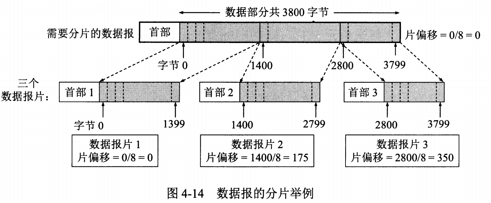

<!-- TOC -->

- [计算机网络基础](#计算机网络基础)
- [1 网络层次划分](#1-网络层次划分)
    - [OSI七层模型](#osi七层模型)
    - [各层的数据报格式](#各层的数据报格式)
        - [1. 数据链路层](#1-数据链路层)
        - [2. 网络层](#2-网络层)
        - [3. 运输层格式](#3-运输层格式)
- [2 IP地址的分类](#2-ip地址的分类)
    - [特殊的IP地址](#特殊的ip地址)
- [3 各种网络协议](#3-各种网络协议)
- [ARP/RARP协议](#arprarp协议)
    - [路由选择协议](#路由选择协议)
    - [DNS](#dns)
    - [NAT协议](#nat协议)
    - [DHCP协议](#dhcp协议)
- [4 TCP三次握手和四次挥手](#4-tcp三次握手和四次挥手)
    - [TCP 报文格式](#tcp-报文格式)
    - [TCP三次握手](#tcp三次握手)
    - [SYN洪泛攻击](#syn洪泛攻击)
    - [SYN 超时](#syn-超时)
    - [TCP四次挥手](#tcp四次挥手)
- [5 TCP流量控制和拥塞控制](#5-tcp流量控制和拥塞控制)
    - [流量控制](#流量控制)
    - [拥塞控制](#拥塞控制)
    - [流量控制和拥塞控制的区别](#流量控制和拥塞控制的区别)
- [5 浏览器请求的过程](#5-浏览器请求的过程)
- [6 TCP 和 UDP的区别](#6-tcp-和-udp的区别)
- [参考文献](#参考文献)

<!-- /TOC -->
# 计算机网络基础

# 1 网络层次划分

常见的网络层次划分有3种: OSI七层模型、TCP/IP四层协议、TCP/IP五层协议，如下图。

## OSI七层模型

层次 | 功能 | 设备 | 协议
--- | --- | --- | ---
物理层 | 提供一个数据传输的可靠的物理媒体，尽可能屏蔽传输媒体和通信手段的差异，确保比特流可以在各种物理媒体上传输，使数据链路层感觉不到这些差异。| 中继器（Repeater,也叫放大器）、集线器 | - 
数据链路层 | 把网络层传来的分组封装成帧，可靠的传输到相邻节点的目标机网络层 | 网桥、交换机 | 以太网协议 
网络层 | 实现两个端系统的数据透明传送、路由选择、逻辑寻址 | 路由器 | IP、ICMP、ARP、RARP
传输层 | 进程间通用的数据传输服务、端到端的差错控制和流量控制问题 | 网关 | TCP、UDP
会话层 | 管理主机之间的会话，负责建立、管理、终止进程之间的会话。利用数据中插入校验点来实现数据的同步 | - | -
表示层 | 数据压缩、加密以及数据描述，这使得应用程序不必担心在各台主机中数据内部格式不同的问题。| - | -
应用层 | 为操作系统或网络应用程序提供访问网络服务的接口 |  | FTP、Telnet、DNS、SMTP、POP3、HTTP

TCP/IP协议簇：

TCP/IP 协议族是一种沙漏形状，中间小两边大，IP 协议在其中占用举足轻重的地位。

数据在各层之间的传递

在向下的过程中，需要添加下层协议所需要的首部或者尾部，而在向上的过程中不断拆开首部和尾部。

路由器只有下面三层协议，因为路由器位于网络核心中，不需要为进程或者应用程序提供服务，因此也就不需要运输层和应用层。

## 各层的数据报格式

### 1. 数据链路层

**如果帧的数据部分含有和首部相同的内容**，那么帧的开始和结束的位置就会被错误的判定。需要在数据部分出现首部尾部相同的内容前面插入转义字符。如果数据部分出现转义字符，那么就在转义字符前面再加个转义字符。在接收端进行处理之后可以还原出原始数据。这个过程透明传输的内容是转义字符，用户察觉不到转义字符的存在。

- PPP 协议

互联网用户通常需要连接到某个 ISP 之后才能接入到互联网，PPP 协议是用户计算机和 ISP 进行通信时所使用的数据链路层协议。

PPP 的帧格式：

F 字段为帧的定界符
A 和 C 字段暂时没有意义
FCS 字段是使用 CRC 的检验序列
信息部分的长度不超过 1500

### 2. 网络层

网际协议IP及其配套协议：

**IP数据报格式：**

-  **版本**  : 有 4（IPv4）和 6（IPv6）两个值；

-  **首部长度**  : 占 4 位，因此最大值为 15。值为 1 表示的是 1 个 32 位字的长度，也就是 4 字节。因为首部固定长度为 20 字节，因此该值最小为 5。如果可选字段的长度不是 4 字节的整数倍，就用尾部的填充部分来填充。

-  **区分服务**  : 用来获得更好的服务，一般情况下不使用。

-  **总长度**  : 包括首部长度和数据部分长度。

-  **生存时间**  ：TTL，它的存在是为了防止无法交付的数据报在互联网中不断兜圈子。以路由器跳数为单位，当 TTL 为 0 时就丢弃数据报。

-  **协议** ：指出携带的数据应该上交给哪个协议进行处理，例如 ICMP、TCP、UDP 等。

-  **首部检验和** ：因为数据报每经过一个路由器，都要重新计算检验和，因此检验和不包含数据部分可以减少计算的工作量。

-  **标识**  : 在数据报长度过长从而发生分片的情况下，相同数据报的不同分片具有相同的标识符。

-  **片偏移**  : 和标识符一起，用于发生分片的情况。片偏移的单位为 8 字节。

  
 

**ICMP报文格式**

ICMP 是为了更有效地转发 IP 数据报和提高交付成功的机会。它封装在 IP 数据报中，但是不属于高层协议。

ICMP 报文分为差错报告报文和询问报文。

- Ping

Ping 是 ICMP 的一个重要应用，主要用来测试两台主机之间的连通性。

Ping 发送的 IP 数据报封装的是无法交付的 UDP 用户数据报。

- Traceroute

Traceroute 是 ICMP 的另一个应用，用来跟踪一个分组从源点到终点的路径。

源主机向目的主机发送一连串的 IP 数据报。第一个数据报 P1 的生存时间 TTL 设置为 1，当 P1 到达路径上的第一个路由器 R1 时，R1 收下它并把 TTL 减 1，此时 TTL 等于 0，R1 就把 P1 丢弃，并向源主机发送一个 ICMP 时间超过差错报告报文；
源主机接着发送第二个数据报 P2，并把 TTL 设置为 2。P2 先到达 R1，R1 收下后把 TTL 减 1 再转发给 R2，R2 收下后也把 TTL 减 1，由于此时 TTL 等于 0，R2 就丢弃 P2，并向源主机发送一个 ICMP 时间超过差错报文。
不断执行这样的步骤，直到最后一个数据报刚刚到达目的主机，主机不转发数据报，也不把 TTL 值减 1。但是因为数据报封装的是无法交付的 UDP，因此目的主机要向源主机发送 ICMP 终点不可达差错报告报文。
之后源主机知道了到达目的主机所经过的路由器 IP 地址以及到达每个路由器的往返时间。

### 3. 运输层格式

-  **序号**  ：用于对字节流进行编号，例如序号为 301，表示第一个字节的编号为 301，如果携带的数据长度为 100 字节，那么下一个报文段的序号应为 401。

-  **确认号**  ：期望收到的下一个报文段的序号。例如 B 正确收到 A 发送来的一个报文段，序号为 501，携带的数据长度为 200 字节，因此 B 期望下一个报文段的序号为 701，B 发送给 A 的确认报文段中确认号就为 701。

-  **数据偏移**  ：指的是数据部分距离报文段起始处的偏移量，实际上指的是首部的长度。

-  **确认 ACK**  ：当 ACK=1 时确认号字段有效，否则无效。TCP 规定，在连接建立后所有传送的报文段都必须把 ACK 置 1。

-  **同步 SYN**  ：在连接建立时用来同步序号。当 SYN=1，ACK=0 时表示这是一个连接请求报文段。若对方同意建立连接，则响应报文中 SYN=1，ACK=1。

-  **终止 FIN**  ：用来释放一个连接，当 FIN=1 时，表示此报文段的发送方的数据已发送完毕，并要求释放连接。

-  **窗口**  ：窗口值作为接收方让发送方设置其发送窗口的依据。之所以要有这个限制，是因为接收方的数据缓存空间是有限的。

# 2 IP地址的分类

IP地址由网络号（包括子网号）和主机号组成，网络地址的主机号为全0，网络地址代表着整个网络。

五类IP地址：

1． A类IP地址 一个A类IP地址由1字节的网络地址和3字节主机地址组成，网络地址的最高位必须是“0”， 地址范围从1.0.0.0 到126.0.0.0。可用的A类网络有126个，每个网络能容纳1亿多个主机。**其中段0和127不可用**

2． B类IP地址 一个B类IP地址由2个字节的网络地址和2个字节的主机地址组成，网络地址的最高位必须是“10”，地址范围从128.0.0.0到191.255.255.255。可用的B类网络有16382个，每个网络能容纳6万多个主机 。 

3． C类IP地址 一个C类IP地址由3字节的网络地址和1字节的主机地址组成，网络地址的最高位必须是“110”。范围从192.0.0.0到223.255.255.255。C类网络可达209万余个，每个网络能容纳254个主机。 

4． D类地址用于多点广播（Multicast）。 D类IP地址第一个字节以“lll0”开始，它是一个专门保留的地址。它并不指向特定的网络，目前这一类地址被用在多点广播（Multicast）中。多点广播地址用来一次寻址一组计算机，它标识共享同一协议的一组计算机。224.0.0.0到239.255.255.255用于多点广播 。

5． E类IP地址 以“llll0”开始，为将来使用保留。240.0.0.0到255.255.255.254，255.255.255.255用于广播地址

## 特殊的IP地址

IP | 描述
---| ---
0.0.0.0 | 地址对应于当前主机
255.255.255.255 | 当前子网的广播地址
127.0.0.0/8 | 本机回环地址
10.0.0.0/8 | A类私有地址（私有地址不会再全球使用，只有本地意义）
172.16.0.0/12 | B类私有地址
192.168.0.0/16 | C类私有地址

# 3 各种网络协议

基于TCP/UDP的协议

类型|协议 | 端口 | 功能
--- | ---| ---| ---
TCP | FTP| 20（数据） 21（会话） | 定义了文件传输协议, 下载文件，上传主页，都要用到FTP服务。
TCP | Telnet | 23 | 远程登录（不安全）
TCP | SSH | 22 | 安全登录、文件传送(SCP)和端口重定向
TCP | SMTP | 25 | 定义了简单邮件传送协议
TCP | POP3 | 110 | Post Office Protocol 3的简称,即邮局协议的第3个版本
TCP | IMAP3 | 220 | 
TCP | HTTP | 80 | 超文本传输协议，WEB服务用
UDP | DNS | 53 | 域名解析服务
UDP | RIP | - | 工作再网络层，路由选择信息协议（RIP）是一种在网关与主机之间交换路由选择信息的标准
UDP | SNMP | 161 | 简单网络管理协议，是用来管理网络设备的。由于网络设备很多，无连接的服务就体现出其优势。
UDP | NFS |  | 网络文件系统
UDP | TFTP | 69 | 通用文件传输协议

# ARP/RARP协议

地址解析协议，即ARP（Address Resolution Protocol），是根据IP地址获取物理地址的一个TCP/IP协议。

ARP工作流程举例：

主机A的IP地址为192.168.1.1，MAC地址为0A-11-22-33-44-01；
主机B的IP地址为192.168.1.2，MAC地址为0A-11-22-33-44-02；
当主机A要与主机B通信时，地址解析协议可以将主机B的IP地址（192.168.1.2）解析成主机B的MAC地址，以下为工作流程：
（1）根据主机A上的路由表内容，IP确定用于访问主机B的转发IP地址是192.168.1.2。然后A主机在自己的本地ARP缓存中检查主机B的匹配MAC地址。
（2）如果主机A在ARP缓存中没有找到映射，它将询问192.168.1.2的硬件地址，从而将ARP请求帧广播到本地网络上的所有主机。源主机A的IP地址和MAC地址都包括在ARP请求中。本地网络上的每台主机都接收到ARP请求并且检查是否与自己的IP地址匹配。如果主机发现请求的IP地址与自己的IP地址不匹配，它将丢弃ARP请求。
（3）主机B确定ARP请求中的IP地址与自己的IP地址匹配，则将主机A的IP地址和MAC地址映射添加到本地ARP缓存中。
（4）主机B将包含其MAC地址的ARP回复消息直接发送回主机A。
（5）当主机A收到从主机B发来的ARP回复消息时，会用主机B的IP和MAC地址映射更新ARP缓存。本机缓存是有生存期的，生存期结束后，将再次重复上面的过程。主机B的MAC地址一旦确定，主机A就能向主机B发送IP通信了。

逆地址解析协议，即RARP，功能和ARP协议相对，其将局域网中某个主机的物理地址转换为IP地址

RARP协议工作流程：

　　（1）给主机发送一个本地的RARP广播，在此广播包中，声明自己的MAC地址并且请求任何收到此请求的RARP服务器分配一个IP地址；

　　（2）本地网段上的RARP服务器收到此请求后，检查其RARP列表，查找该MAC地址对应的IP地址；

　　（3）如果存在，RARP服务器就给源主机发送一个响应数据包并将此IP地址提供给对方主机使用；
　　（4）如果不存在，RARP服务器对此不做任何的响应；
　　（5）源主机收到从RARP服务器的响应信息，就利用得到的IP地址进行通讯；如果一直没有收到RARP服务器的响应信息，表示初始化失败。

## 路由选择协议

- RIP协议：底层是贝尔曼福特算法，它选择路由的度量标准（metric)是跳数，最大跳数是15跳，如果大于15跳，它就会丢弃数据包。

- OSPF协议：Open Shortest Path First开放式最短路径优先，底层是Dijkstra 算法，是链路状态路由选择协议，它选择路由的度量标准是带宽，延迟。

- BGP协议：AS之间的路由选择协议，前面两种是AS内内部的路由选择协议，BGP 只能寻找一条比较好的路由，而不是最佳路由。

## DNS

DNS是域名系统(DomainNameSystem)的缩写，该系统用于命名组织到域层次结构中的计算机和网络服务，可以简单地理解为将URL转换为IP地址。域名是由圆点分开一串单词或缩写组成的，每一个域名都对应一个惟一的IP地址，在Internet上域名与IP地址之间是一一对应的，DNS就是进行域名解析的服务器。DNS命名用于Internet等TCP/IP网络中，通过用户友好的名称查找计算机和服务。

##  NAT协议

NAT网络地址转换(Network Address Translation)属接入广域网(WAN)技术，是一种将私有（保留）地址转化为合法IP地址的转换技术，它被广泛应用于各种类型Internet接入方式和各种类型的网络中。原因很简单，NAT不仅完美地解决了lP地址不足的问题，而且还能够有效地避免来自网络外部的攻击，隐藏并保护网络内部的计算机。

## DHCP协议

DHCP动态主机设置协议（Dynamic Host Configuration Protocol）是一个局域网的网络协议，使用**UDP**协议工作，主要有两个用途：给内部网络或网络服务供应商自动分配IP地址，给用户或者内部网络管理员作为对所有计算机作中央管理的手段。

# 4 TCP三次握手和四次挥手

## TCP 报文格式

重要字段:

字段 | 位数 | 说明
--- | ---| ---
源端口 | 16 | 源计算机的端口，0-65535
目的端口| 16 | 目的计算机的端口，0-65535
序号(Seq) | 32 | 用来标识从TCP源端向目的端发送的字节流，发起方发送数据时对此进行标记。
确认号(Ack) | 32 | 只有ACK标志位为1时，确认序号字段才有效，Ack=Seq+1。
数据偏移/头部长度 | 4 | 由于首部可能含有可选项内容，因此TCP报头的长度是不确定的，报头不包含任何任选字段则长度为20字节，4位首部长度字段所能表示的最大值为1111，转化为10进制为15，15*32/8 = 60，故报头最大长度为60字节。首部长度也叫数据偏移，是因为首部长度实际上指示了数据区在报文段中的起始偏移值。
保留位 | 6 | 保留使用，一般置位0
URG | 1 | 紧急指针标志，为1时表示紧急指针有效，为0则忽略紧急指针。
ACK | 1 | 确认序号标志，为1时表示确认号有效，为0表示报文中不含确认信息，忽略确认号字段。
PSH | 1 | push标志，为1表示是带有push标志的数据，指示接收方在接收到该报文段以后，应尽快将这个报文段交给应用程序，而不是在缓冲区排队。
RST | 1 | 重置连接标志，用于重置由于主机崩溃或其他原因而出现错误的连接。或者用于拒绝非法的报文段和拒绝连接请求。
SYN | 1 | 同步序号，用于建立连接过程，在连接请求中，SYN=1和ACK=0表示该数据段没有使用捎带的确认域，而连接应答捎带一个确认，即SYN=1和ACK=1。
FIN | 1 |   finish标志，用于释放连接，为1时表示发送方已经没有数据发送了，即关闭本方数据流。
窗口大小 | 16 | 滑动窗口大小，用来告知发送端接受端的缓存大小，以此控制发送端发送数据的速率，从而达到流量控制。窗口大小最大为65535。
校验和 | 16 | 奇偶校验，此校验和是对整个的 TCP 报文段，包括 TCP 头部和 TCP 数据，以 16 位字进行计算所得。由发送端计算和存储，并由接收端进行验证。
紧急指针| 16 | 只有当 URG 标志置 1 时紧急指针才有效。紧急指针是一个正的偏移量，和顺序号字段中的值相加表示紧急数据最后一个字节的序号。 TCP 的紧急方式是发送端向另一端发送紧急数据的一种方式。
可选项 | 0-40 | 最常见的可选字段是最长报文大小，又称为MSS（Maximum Segment Size），每个连接方通常都在通信的第一个报文段（为建立连接而设置SYN标志为1的那个段）中指明这个选项，它表示本端所能接受的最大报文段的长度。选项长度不一定是32位的整数倍，所以要加填充位，即在这个字段中加入额外的零，以保证TCP头是32的整数倍。
数据部分 | - | TCP 报文段中的数据部分是可选的。在一个连接建立和一个连接终止时，双方交换的报文段仅有 TCP 首部。如果一方没有数据要发送，也使用没有任何数据的首部来确认收到的数据。在处理超时的许多情况中，也会发送不带任何数据的报文段。

## TCP三次握手

> **第一次握手**

客户端发送一个TCP的SYN标志位置1的包指明客户打算连接的服务器的端口，以及初始序号X,保存在包头的序列号(Sequence Number)字段里。

> **第二次握手**

服务器发回确认包(ACK)应答。即SYN标志位和ACK标志位均为1同时，将确认序号(Acknowledgement Number)设置为客户的I S N加1以.即X+1。

> **第三次握手**

客户端再次发送确认包(ACK)SYN标志位为0,ACK标志位为1.并且把服务器发来ACK的序号字段+1,放在确定字段中发送给对方.并且在数据段放写ISN的+1

**为什么需要三次握手？**

- 第一次握手 client发送一个包给server，client无法确认server是否存在或者提供服务。
- 第二次握手 client发送一个包给server，可能由于网络原因server很久才收到这个包，收到包之后立即返回ACK确认包给client，但是client由于超时将该包丢弃了，此时，server会一直等待client发送包，但是client因为超时而没有继续发包，会浪费server资源。
- 第三次握手 client收到server的确认包后，在给server发送一个确认包，server验证数据正确后则确定连接成功。如果server超时没收到包，则发送RST报文段，进入CLOSED状态。这样做的目的是为了防止SYN洪泛攻击

## SYN洪泛攻击

服务器第二次握手结束到客户端再次ACK之前的TCP连接称为半连接。此时服务器处于Syn_RECV状态，收到ACK后，才转为ESTABLISHED状态

SYN攻击：攻击客户端短时间内伪造大量不存在的IP地址，向服务器不断发送syn包，服务器恢复确认包，等待客户端的确认，由于源地址是不存在的，服务器需要不断的重发直 至超时，这些伪造的SYN包将长时间占用未连接队列，正常的SYN请求被丢弃，目标系统运行缓慢，严重者引起网络堵塞甚至系统瘫痪。

Syn攻击是一个典型的DDOS攻击。检测SYN攻击非常的方便，当你在服务器上看到大量的半连接状态时，特别是源IP地址是随机的，基本上可以断定这是一次SYN攻击.在Linux下可以如下命令检测是否被Syn攻击netstat -n -p TCP | grep SYN_RECV一般较新的TCP/IP协议栈都对这一过程进行修正来防范Syn攻击，修改tcp协议实现。主要方法有SynAttackProtect保护机制、SYN cookies技术、增加最大半连接和缩短超时时间等.但是不能完全防范syn攻击。

## SYN 超时

server收到client发的SYN并回复Ack(SYN)（此处称为Ack1）后，如果client掉线了（或网络超时），那么server将无法收到client回复的Ack(Ack(SYN))（此处称为Ack2），连接处于一个中间状态（非成功非失败）。

为了解决中间状态的问题，server如果在一定时间内没有收到Ack2，会重发Ack1（不同于数据传输过程中的重传机制）。Linux下，默认重试5次，加上第一次最多共发送6次；重试间隔从1s开始翻倍增长（一种指数回退策略，Exponential Backoff），5次的重试时间分别为1s, 2s, 4s, 8s, 16s，第5次发出后还要等待32s才能判断第5次也超时。所以，至多共发送6次，经过1s + 2s + 4s+ 8s+ 16s + 32s = 2^6 -1 = 63s，TCP才会认为SYN超时断开这个连接。

## TCP四次挥手

数据传输完毕后，双方都可释放连接。最开始的时候，客户端和服务器都是处于ESTABLISHED状态，然后客户端主动关闭，服务器被动关闭。

> **第一次挥手**

客户端发送释放连接的报文，停止发送数据，释放数据报文首部，FIN=1，其序列号为seq=u（等于前面已经传送过来的数据的最后一个字节的序号加1），此时，客户端进入FIN-WAIT-1（终止等待1）状态。 TCP规定，FIN报文段即使不携带数据，也要消耗一个序号。

> **第二次挥手**

服务器收到连接释放报文，发出确认报文，ACK=1，ack=u+1，并且带上自己的序列号seq=v，此时，服务端就进入了CLOSE-WAIT（关闭等待）状态。TCP服务器通知高层的应用进程，客户端向服务器的方向就释放了，这时候处于半关闭状态，即客户端已经没有数据要发送了，但是服务器若发送数据，客户端依然要接受。这个状态还要持续一段时间，也就是整个CLOSE-WAIT状态持续的时间。

客户端收到服务器的确认请求后，此时，客户端就进入FIN-WAIT-2（终止等待2）状态，等待服务器发送连接释放报文（在这之前还需要接受服务器发送的最后的数据，该状态持续到第三次挥手）。

> **第三次挥手**

服务器将最后的数据发送完毕后，就向客户端发送连接释放报文，FIN=1，ack=u+1，由于在半关闭状态，服务器很可能又发送了一些数据，假定此时的序列号为seq=w，此时，服务器就进入了LAST-ACK（最后确认）状态，等待客户端的确认。

> **第四次挥手**

客户端收到服务器的连接释放报文后，必须发出确认，ACK=1，ack=w+1，而自己的序列号是seq=u+1，此时，客户端就进入了TIME-WAIT（时间等待）状态。注意此时TCP连接还没有释放，必须经过2∗MSL（最长报文段寿命）的时间后，当客户端撤销相应的TCB后，才进入CLOSED状态。

**为什么建立连接是三次握手，而关闭链接是四次挥手？**

这是因为服务端在LISTEN状态下，收到建立连接请求的SYN报文后，把ACK和SYN放在一个报文里发送给客户端。而关闭连接时，当收到对方的FIN报文时，仅仅表示对方不再发送数据了但是还能接收数据，己方也未必全部数据都发送给对方了，所以己方可以立即close，也可以发送一些数据给对方后，再发送FIN报文给对方来表示同意现在关闭连接，因此，己方ACK和FIN一般都会分开发送。

简单来说就是，TCP第二次握手的时候，SYN和ACK同时发送，而TCP第二次挥手的时候，可能还需要继续给请求挥手方发送数据，不能同时发送ACK。

四次挥手也并不总是四次挥手，中间的两个动作有时候是可以合并一起进行的，这个时候就成了三次挥手，主动关闭方就会从fin_wait_1状态直接进入到time_wait状态，跳过了fin_wait_2状态。

**为什么四次挥手最后客户端还需要等待2\*MSL?**

第一，保证客户端发送的最后一个ACK报文能够到达服务器，因为这个ACK报文可能丢失，站在服务器的角度看来，我已经发送了FIN+ACK报文请求断开了，客户端还没有给我回应，应该是我发送的请求断开报文它没有收到，于是服务器又会重新发送一次，而客户端就能在这个2MSL时间段内收到这个重传的报文，接着给出回应报文，并且会重启2MSL计时器。

第二，防止类似与“三次握手”中提到了的“已经失效的连接请求报文段”出现在本连接中。客户端发送完最后一个确认报文后，在这个2MSL时间中，就可以使本连接持续的时间内所产生的所有报文段都从网络中消失。这样新的连接中不会出现旧连接的请求报文。

TIME_WAIT时期：它就好比主动分手方要承担的责任，是你提出的要分手，你得付出代价。这个后果就是持续4分钟的time_wait状态，不能释放套接字资源(端口)，就好比守寡期，这段时间内套接字资源(端口)不得回收利用。

# 5 TCP流量控制和拥塞控制

计算机网络中的带宽、交换结点中的缓存和处理机等，都是网络的资源。在某段时间，若对网络中某一资源的需求超过了该资源所能提供的可用部分，网络的性能就会变坏。这种情况就叫做拥塞。

拥塞控制就是防止过多的数据注入网络中，这样可以使网络中的路由器或链路不致过载。拥塞控制是一个全局性的过程，和流量控制不同，流量控制指点对点通信量的控制。

## 流量控制

如果发送者发送数据过快，接收者来不及接收，那么就会有分组丢失。为了避免分组丢失，控制发送者的发送速度，使得接收者来得及接收，这就是流量控制。流量控制根本目的是防止分组丢失，它是构成TCP可靠性的一方面。

TCP头部有一个窗口字段，用于接收方通知发送方自己还有多少缓冲区可以接收数据，发送方根据接收方的处理能力来发送数据，不会导致接收方处理不过来，是谓流量控制。

**滑动窗口协议（连续ARQ协议）** 实现流量控制。滑动窗口协议既保证了分组无差错、有序接收，也实现了流量控制。主要的方式就是接收方返回的 ACK 中会包含自己的接收窗口的大小，并且利用大小来控制发送方的数据发送。

窗口是缓存的一部分，用来暂时存放字节流。发送方和接收方各有一个窗口，接收方通过 TCP 报文段中的窗口字段告诉发送方自己的窗口大小，发送方根据这个值和其它信息设置自己的窗口大小。

发送窗口内的字节都允许被发送，接收窗口内的字节都允许被接收。如果发送窗口左部的字节已经发送并且收到了确认，那么就将发送窗口向右滑动一定距离，直到左部第一个字节不是已发送并且已确认的状态；接收窗口的滑动类似，接收窗口左部字节已经发送确认并交付主机，就向右滑动接收窗口。

接收窗口只会对窗口内最后一个按序到达的字节进行确认，例如接收窗口已经收到的字节为 {31, 34, 35}，其中 {31} 按序到达，而 {34, 35} 就不是，因此只对字节 31 进行确认。发送方得到一个字节的确认之后，就知道这个字节之前的所有字节都已经被接收。

[滑动窗口详解](https://blog.csdn.net/wdscq1234/article/details/52444277)
## 拥塞控制

1. 慢开始与拥塞避免

慢开始算法的思路就是，不要一开始就发送大量的数据，先探测一下网络的拥塞程度，也就是说由小到大逐渐增加拥塞窗口的大小。

发送方维持一个叫做拥塞窗口cwnd（congestion window）的状态变量。拥塞窗口的大小取决于网络的拥塞程度，并且动态地在变化。发送方让自己的发送窗口等于拥塞窗口，另外考虑到接受方的接收能力，发送窗口可能小于拥塞窗口。

发送的最初执行慢开始，令 cwnd=1，发送方只能发送 1 个报文段；当收到确认后，将 cwnd 加倍，因此之后发送方能够发送的报文段数量为：2、4、8 ...

注意到慢开始每个轮次都将 cwnd 加倍，这样会让 cwnd 增长速度非常快，从而使得发送方发送的速度增长速度过快，网络拥塞的可能也就更高。设置一个慢开始门限 ssthresh，当 cwnd >= ssthresh 时，进入拥塞避免，每个轮次只将 cwnd 加 1。

如果出现了超时，则令 ssthresh = cwnd/2，然后重新执行慢开始。

2. 快重传和快恢复

在接收方，要求每次接收到报文段都应该对最后一个已收到的有序报文段进行确认。例如已经接收到 M1 和 M2，此时收到 M4，应当发送对 M2 的确认。

在发送方，如果收到三个重复确认，那么可以知道下一个报文段丢失，此时执行快重传，立即重传下一个报文段。例如收到三个 M2，则 M3 丢失，立即重传 M3。

在这种情况下，只是丢失个别报文段，而不是网络拥塞。因此执行快恢复，令 ssthresh = cwnd/2 ，cwnd = ssthresh，注意到此时直接进入拥塞避免。慢开始和快恢复的快慢指的是 cwnd 的设定值，而不是 cwnd 的增长速率。慢开始 cwnd 设定为 1，而快恢复 cwnd 设定为 ssthresh。

## 流量控制和拥塞控制的区别

拥塞控制：拥塞控制是作用于网络的，它是防止过多的数据注入到网络中，避免出现网络负载过大的情况；常用的方法就是：（ 1 ）慢开始、拥塞避免（ 2 ）快重传、快恢复。

流量控制：流量控制是作用于接收者的，它是控制发送者的发送速度从而使接收者来得及接收，防止分组丢失的。

# 5 浏览器请求的过程

1. 浏览器输入百度首页的全部执行过程

- 事件顺序
  
(1) 浏览器获取输入的域名www.baidu.com

(2) 浏览器向DNS请求解析www.baidu.com的IP地址

(3) 域名系统DNS解析出百度服务器的IP地址

(4) 浏览器与该服务器建立TCP连接(默认端口号80)

(5) 浏览器发出HTTP请求，请求百度首页

(6) 服务器通过HTTP响应把首页文件发送给浏览器

(7) TCP连接释放

(8) 浏览器将首页文件进行解析，并将Web页显示给用户。

- 涉及到的协议

(1) 应用层：HTTP(WWW访问协议)，DNS(域名解析服务)

(2) 传输层：TCP(为HTTP提供可靠的数据传输)，UDP(DNS使用UDP传输)

(3) 网络层：IP(IP数据数据包传输和路由选择)，ICMP(提供网络传输过程中的差错检测)，ARP(将本机的默认网关IP地址映射成物理MAC地址)

# 6 TCP 和 UDP的区别

TCP提供面向连接的、可靠的数据流传输，而UDP提供的是非面向连接的、不可靠的数据流传输。
TCP传输单位称为TCP报文段，UDP传输单位称为用户数据报。
TCP注重数据安全性，UDP数据传输快，因为不需要连接等待，少了许多操作，但是其安全性却一般。
TCP对应的协议和UDP对应的协议
TCP对应的协议：
（1） FTP：定义了文件传输协议，使用21端口。
（2） Telnet：一种用于远程登陆的端口，使用23端口，用户可以以自己的身份远程连接到计算机上，可提供基于DOS模式下的通信服务。
（3） SMTP：邮件传送协议，用于发送邮件。服务器开放的是25号端口。
（4） POP3：它是和SMTP对应，POP3用于接收邮件。POP3协议所用的是110端口。
（5）HTTP：是从Web服务器传输超文本到本地浏览器的传送协议。
UDP对应的协议：
（1） DNS：用于域名解析服务，将域名地址转换为IP地址。DNS用的是53号端口。
（2） SNMP：简单网络管理协议，使用161号端口，是用来管理网络设备的。由于网络设备很多，无连接的服务就体现出其优势。
（3） TFTP(Trival File Transfer Protocal)，简单文件传输协议，该协议在熟知端口69上使用UDP服务。

# 参考文献

- [计算机网络基础知识总结](http://www.cnblogs.com/maybe2030/p/4781555.html#_label0)
- [TCP的三次握手四次挥手](https://juejin.im/post/5a0444d45188255ea95b66bc)
- [TCP的三次握手与四次挥手（详解+动图）](https://blog.csdn.net/qzcsu/article/details/72861891)
- [TCP流量控制、拥塞控制](https://juejin.im/post/5b0b7496f265da0dd013a79b)
- [TCP的拥塞控制](https://www.cnblogs.com/wuchanming/p/4422779.html)
