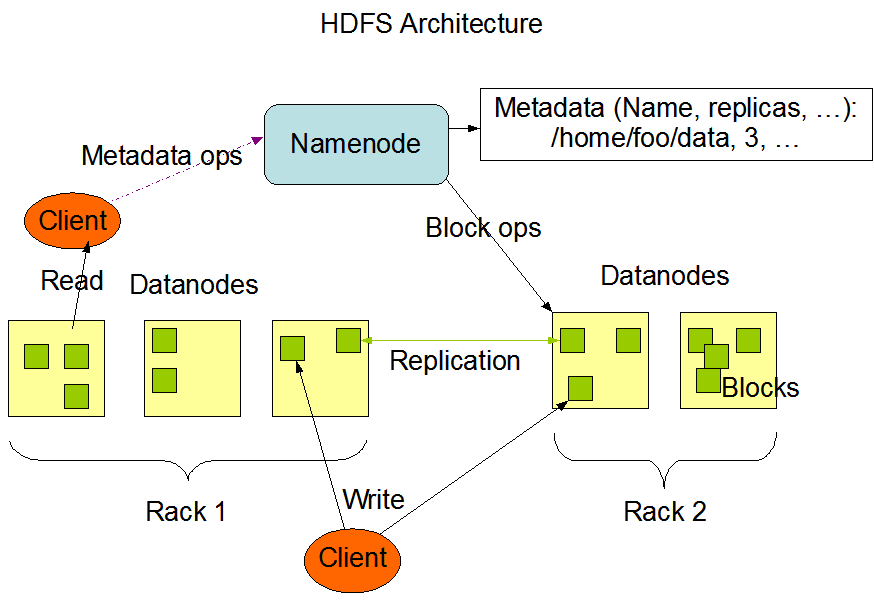
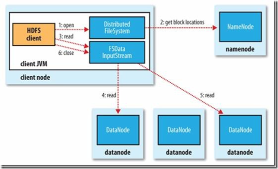
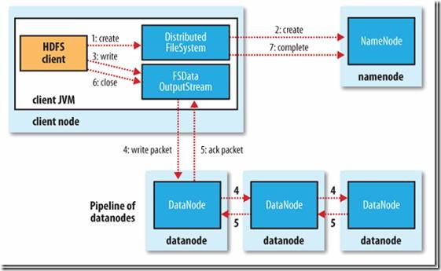
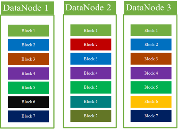
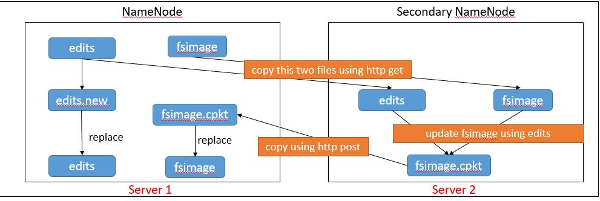
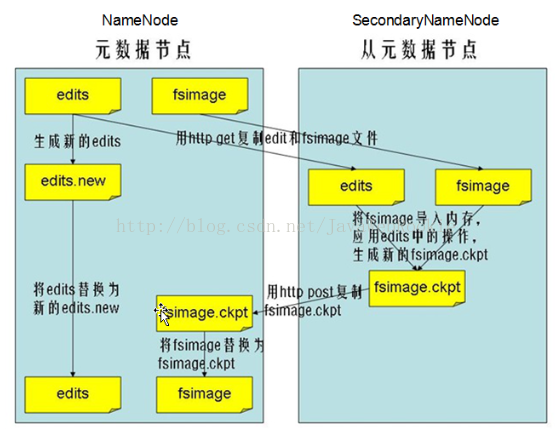
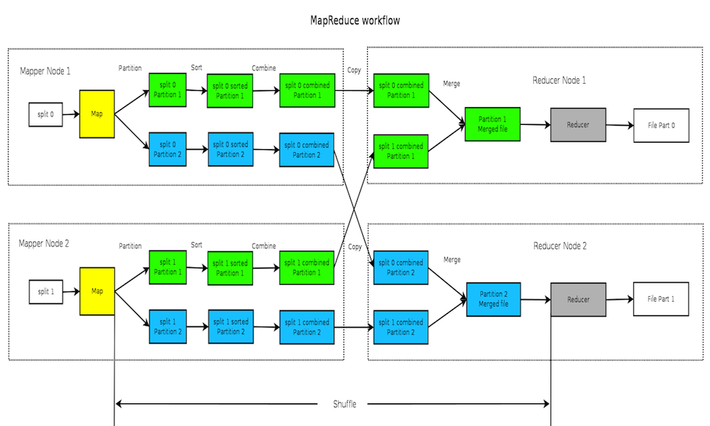
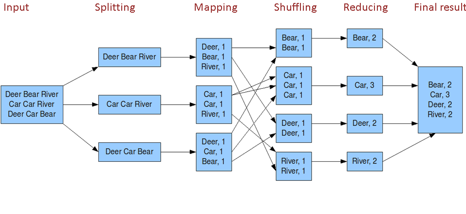

<!--TOC -->

* [Hadoop](#hadoop)
* [HDFS](#hdfs)
    * [HDFS 文件读写](#hdfs-文件读写)
    * [HDFS 数据存储](#hdfs-数据存储)
    * [HDFS 可靠性保障](#hdfs-可靠性保障)
    * [HDFS 优缺点](#hdfs-优缺点)
* [MapReduce](#mapreduce)

<!--TOC -->
# Hadoop

Hadoop 是一个开源的分布式计算基础架构，核心内容包含HDFS、MapReduce, hadoop2.0以后引入yarn.

HDFS 负责分布式文件存储，MapReduce 提供了一个计算框架，yarn 则是负责系统资源调度。

# HDFS

HDFS是Hadoop分布式文件系统（Hadoop Distributed File System）的缩写，为分布式计算存储提供了底层支持。采用Java语言开发，可以部署在多种普通的廉价机器上，以集群处理数量积达到大型主机处理性能。

HDFS采用master/slave架构。一个HDFS集群包含一个单独的NameNode和多个DataNode。

NameNode作为master服务，它负责管理文件系统的命名空间和客户端对文件的访问。NameNode会保存文件系统的具体信息，包括文件信息、文件被分割成具体block块的信息、以及每一个block块归属的DataNode的信息。对于整个集群来说，HDFS通过NameNode对用户提供了一个单一的命名空间。

DataNode作为slave服务，在集群中可以存在多个。通常每一个DataNode都对应于一个物理节点。DataNode负责管理节点上它们拥有的存储，它将存储划分为多个block块，管理block块信息，同时周期性的将其所有的block块信息发送给NameNode。

下图为HDFS系统架构图，主要有三个角色，Client、NameNode、DataNode



- Client: 它是Hadoop中的另一个组件，DFSclient。 任何读写请求都要经过DFSClient发起，过程基本是这样，先和namenode建立连接，得到读/写数据的datanode信息。然后再与具体的datanode建立连接，进行读写操作，中间会有一些同步的操作。文件写入时：Client向NameNode发起文件写入的请求。NameNode根据文件大小和文件块配置情况，返回给Client它所管理部分DataNode的信息。Client将文件划分为多个block块，并根据DataNode的地址信息，按顺序写入到每一个DataNode块中。
  
- NameNode: 负责管理文件系统的名字空间操作（如打开，关闭文件），文件和block的对应关系，block和DataNode的对应关系，副本数，监督DataNodes的健康，协调数据存取

- Secondary NameNode:对文件系统名字空间执行周期性的检查点，将NameNode上HDFS改动日志文件的大小控制在某个限度下

- DataNode:负责存储具体的block数据（默认每块64MB），数据的读写和复制操作，定期与NameNode通信，报告数据的修改信息，与其他的DataNode进行通信，复制数据块，保证数据的冗余性

## HDFS 文件读写

1. HDFS 读文件



``` java
    Configuration conf = new Configuration();
    FileSystem fs = FileSystem.get(conf);
    Path file = new Path("demo.txt");
    FSDataInputStream inStream = fs.open(file);
    String data = inStream.readUTF();
    System.out.println(data);
    inStream.close();
```

读文件过程：
- 1.初始化FileSystem，然后客户端(client)用FileSystem的open()函数打开文件
- 2.FileSystem用RPC调用元数据节点，得到文件的数据块信息，对于每一个数据块，元数据节点返回保存数据块的数据节点的地址。
- 3.FileSystem返回FSDataInputStream给客户端，用来读取数据，客户端调用stream的read()函数开始读取数据。
- 4.DFSInputStream连接保存此文件第一个数据块的最近的数据节点，data从数据节点读到客户端(client)
- 5.当此数据块读取完毕时，DFSInputStream关闭和此数据节点的连接，然后连接此文件下一个数据块的最近的数据节点。
- 6.当客户端读取完毕数据的时候，调用FSDataInputStream的close函数。
- 7.在读取数据的过程中，如果客户端在与数据节点通信出现错误，则尝试连接包含此数据块的下一个数据节点。
- 8.失败的数据节点将被记录，以后不再连接。【注意：这里的序号不是一一对应的关系】

2. HDFS 写文件



``` java
    Configuration conf = new Configuration();
    FileSystem fs = FileSystem.get(conf);
    Path file = new Path("demo.txt");
    FSDataOutputStream outStream = fs.create(file);
    outStream.writeUTF("Welcome to HDFS Java API!!!");
    outStream.close();
```

写文件过程：
- 1.初始化FileSystem，客户端调用create()来创建文件。
- 2.FileSystem用RPC调用元数据节点，在文件系统的命名空间中创建一个新的文件，元数据节点首先确定文件原来不存在，并且客户端有创建文件的权限，然后创建新文件。
- 3.FileSystem返回DFSOutputStream，客户端用于写数据，客户端开始写入数据。
- 4.DFSOutputStream将数据分成块，写入data queue。data queue由Data Streamer读取，并通知元数据节点分配数据节点，用来存储数据块(每块默认复制3块)。分配的数据节点放在一个pipeline里。Data Streamer将数据块写入pipeline中的第一个数据节点。第一个数据节点将数据块发送给第二个数据节点。第二个数据节点将数据发送给第三个数据节点。
- 5.DFSOutputStream为发出去的数据块保存了ack queue，等待pipeline中的数据节点告知数据已经写入成功。
- 6.当客户端结束写入数据，则调用stream的close函数。此操作将所有的数据块写入pipeline中的数据节点，并等待ack queue返回成功。最后通知元数据节点写入完毕。
- 7.如果数据节点在写入的过程中失败，关闭pipeline，将ack queue中的数据块放入data queue的开始，当前的数据块在已经写入的数据节点中被元数据节点赋予新的标示，则错误节点重启后能够察觉其数据块是过时的，会被删除。失败的数据节点从pipeline中移除，另外的数据块则写入pipeline中的另外两个数据节点。元数据节点则被通知此数据块是复制块数不足，将来会再创建第三份备份。
- 8.如果在写的过程中某个datanode发生错误，会采取以下几步：
  1)pipeline被关闭掉；

  2)为了防止防止丢包ack quene里的packet会同步到data quene里；

  3)把产生错误的datanode上当前在写但未完成的block删掉；

  4)block剩下的部分被写到剩下的两个正常的datanode中；

  5)namenode找到另外的datanode去创建这个块的复制。当然，这些操作对客户端来说是无感知的。

## HDFS 数据存储

文件被切分成固定大小的文件块(block)，默认数据大小为64MB，可配置。若文件大小不到64MB，则单独存储为一个 block, 存储在不同的节点上，默认情况下每个 block 都有三个副本。

注意 Block大小和副本数通过client端上传文件时设置、文件上传成功后副本数可以变更，Block Size不可变更
Block大小一旦设置不能再变更了，但是Block存储的副本数可以不断改变。

## HDFS 可靠性保障

(1) 冗余备份

将数据写入到多个DataNode节点上，当其中某些节点宕机后，还可以从其他节点获取数据并复制到其他节点，使备份数达到设置值。dfs.replication设置备份数。

(2) 副本存放

HDFS采用机架感知(Rack-aware)的策略来改进数据的可靠性、可用性和网络宽带的利用率。当复制因子为3时，HDFS的副本存放策略是：第一个副本放到同一机架的另一个节点(执行在集群中)/随机一个节点(执行在集群外)。第二个副本放到本地机架的其他任意节点。第三个副本放在其他机架的任意节点。这种策略可以防止整个机架失效时的数据丢失，也可以充分利用到机架内的高宽带特效。



(3) 心跳检测

NameNode会周期性的从集群中的每一个DataNode上接收心跳包和块报告，NameNode根据这些报告验证映射和其他文件系统元数据。当NameNode没法接收到DataNode节点的心跳报告后，NameNode会将该DataNode标记为宕机，NameNode不会再给该DataNode节点发送任何IO操作。同时DataNode的宕机也可能导致数据的复制。一般引发重新复制副本有多重原因：DataNode不可用、数据副本损坏、DataNode上的磁盘错误或者复制因子增大。

(4) 安全模式

在HDFS系统的时候，会先经过一个完全模式，在这个模式中，是不允许数据块的写操作。NameNode会检测DataNode上的数据块副本数没有达到最小副本数，那么就会进入完全模式，并开始副本的复制，只有当副本数大于最小副本数的时候，那么会自动的离开安全模式。DataNode节点有效比例:dfs.safemode.threshold.pct(默认0.999f)，所以说当DataNode节点丢失达到1-0.999f后，会进入安全模式。

(5) 数据完整性检测

HDFS实现了对HDFS文件内容的校验和检测(CRC循环校验码)，在写入数据文件的时候，也会将数据块的校验和写入到一个隐藏文件中()。当客户端获取文件后，它会检查从DataNode节点获取的数据库对应的校验和是否和隐藏文件中的校验和一致，如果不一致，那么客户端就会认为该数据库有损坏，将从其他DataNode节点上获取数据块，并报告NameNode节点该DataNode节点的数据块信息。

(6) 回收站

HDFS中删除的文件先会保存到一个文件夹中(/trash)，方便数据的恢复。当删除的时间超过设置的时间阀后(默认6小时)，HDFS会将数据块彻底删除。

(7) 冷备份机制

HDFS中Secondary NameNode对NameNode中元数据提供了冷备方案 Secondary NameNode将Na—meNode的fsimage与edit log从Namenode复制到临时目录，将fsitnage同edit log合并，并产生新的Fsimage并把产生的新的Isirnage上传给NameNode ,最后清除NameNode中的edit log

(8) 租约机制

NameNode在打开或创建一个文件，准备追加写之前，会与此客户端签订一份租约。客户端会定时轮询续签租约。NameNode始终在轮询检查所有租约，查看是否有到期未续的租约。如果一切正常，该客户端完成写操作，会关闭文件，停止租约，一旦有所意外，比如文件被删除了，客户端宕机了，当超过租约期限时，NameNode就会剥夺此租约，将这个文件的享用权，分配给他人。如此，来避免由于客户端停机带来的资源被长期霸占的问题。

## Second NameNode



1. NameNode

NameNode是主节点，主要负责接收客户端的读写服务、NameNode会保存元数据（metadate）信息。元数据信息包括：文件包含的块（Block）、Block保存在DataNode的信息（在哪一个DataNode）、文件的权限信息、生成的时间、副本数、文件目录结构等。NameNode还管理数据的复制，它周期性的检查DataNode接收的心跳和块数据报告。如果接收到心跳报告说明DataNode是存活的，心跳报告上存放着DataNode的所有块数据信息。

NameNode的存储位置是在内存和本地磁盘。元数据信息在启动后会加载到内存，而本地磁盘有两个重要文件：fsimage（镜像文件）和edites（编辑日志），元数据信息和Block（块数据）的位置存储到（fsimage镜像文件）、日志记录存储到edites。

2. Secondary NameNode

Secondary NameNode(SNN) 主要工作是帮助NN(NameNode)合并edits log（定时周期性,默认一小时），辅助NameNode工作，减少NN启动时间。

**SNN 执行文件合并时机**

1、根据配置文件设置的时间间隔进行合并 fs.checkpoint.period默认是3600秒
2、根据配置文件设置edits log大小 fs.checkpoint.size规定edits文件的默认值默认是64MB**

如果达到以上两个条件，就进行合并。

合并的时候会有大量的IO操作，把edits中删除的在fsimage中删除， 把edits中新增的在fsimage中增加，NameNode不做这个事情，NameNode把主要精力放在用户的读写服务上，Secondary NameNode才会去做这个事情。合并会消耗大量的IO。



如上图，再SNN往NN拷贝的时候，NN会首先创建一个edits.new文件，这是内存中正在合并的时间内，用户的合并日志。
然后SNN进行合并，合并完成以后，就会把fsimage.ckpt推送给NN，默认的edits.new每隔3600秒产生一次，因为每次合并就要产生一个edits.new文件，等到下次合并的时候，只合并edits.new这个文件。合并完成以后edits.new变为edits，下次合并继续拿这个edits在SNN上进行合并。

这些文件都在磁盘上记性存储。

当NN挂掉以后，上次合并的fsimage.ckpt还在SNN上，但是NN上的edits相当于这段时间内新增的操作，无法找回了，只能找到上次edits合并之前的。所以SNN还是有一定备份作用的。如上说的NN挂掉以后只磁盘不可恢复。


## HDFS 优缺点

**1. 优点**

(1) 高容错性

1) 数据自动保存多个副本。它通过增加副本的形式，提高容错性。

2) 某一个副本丢失以后，它可以自动恢复，这是由 HDFS 内部机制实现的，我们不必关

心。

(2) 适合批处理

1) 它是通过移动计算而不是移动数据。

2) 它会把数据位置暴露给计算框架。

(3) 适合大数据处理

1) 数据规模：能够处理数据规模达到 GB、TB、甚至PB级别的数据。

2) 文件规模：能够处理百万规模以上的文件数量，数量相当之大。

3) 节点规模：能够处理10K节点的规模。

(4) 流式数据访问

1) 一次写入，多次读取，不能修改，只能追加。

2) 它能保证数据的一致性。

(5) 可构建在廉价机器上

1) 它通过多副本机制，提高可靠性。

2) 它提供了容错和恢复机制。比如某一个副本丢失，可以通过其它副本来恢复。


**2. 缺点**

(1) 不适合低延时数据访问

1) 比如毫秒级的来存储数据，这是不行的，它做不到。

2) 它适合高吞吐率的场景，就是在某一时间内写入大量的数据。但是它在低延时的情况  下是不行的，比如毫秒级以内读取数据，这样它是很难做到的。

改进策略

(2) 无法高效的对大量小文件进行存储

1) 存储大量小文件的话，它会占用  NameNode大量的内存来存储文件、目录和块信息。这样是不可取的，因为NameNode的内存总是有限的。

2) 小文件存储的寻道时间会超过读取时间，它违反了HDFS的设计目标。 改进策略

(3) 并发写入、文件随机修改

1) 一个文件只能有一个写，不允许多个线程同时写。

2) 仅支持数据 append（追加），不支持文件的随机修改。

# MapReduce

mapreduce 流程图：






# 参考文档

- [阿里工程师hadoop面试题](https://zhuanlan.zhihu.com/p/34433432)
- [hadoop 面试题整理](https://blog.csdn.net/zdp072/article/details/42489297)
- [hadoop 原理总结](https://www.jianshu.com/p/398d0d8c9d87)
- [分布式计算框架Hadoop原理及架构全解](http://dataunion.org/8798.html)
- [Hadoop 之 HDFS 读写](http://blog.51cto.com/jaydenwang/1842812)
- [hadoop文件系统HDFS](https://www.jianshu.com/p/5f00ec80a13c)
- [hadoop 学习笔记：mapreduce框架详解](http://www.cnblogs.com/sharpxiajun/p/3151395.html)
- [MapReduce 过程详解](https://www.cnblogs.com/npumenglei/p/3631244.html)