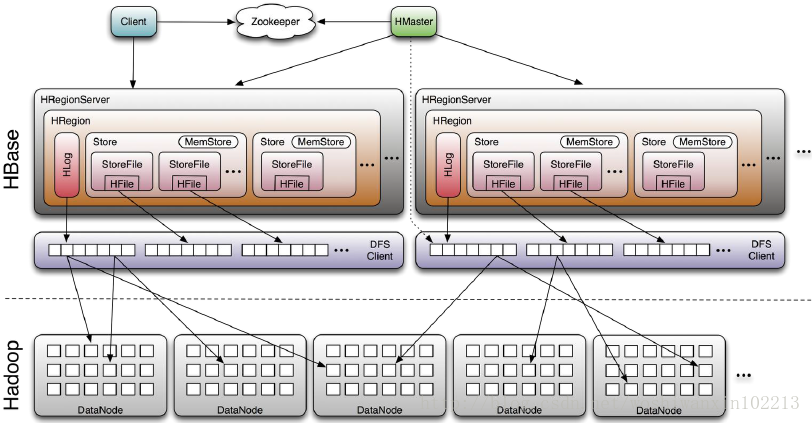
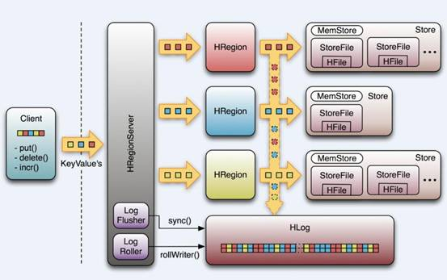

<!--TOC -->

* [HBase 简介](#简介)
* [HBase 架构](#架构)

<!--TOC -->

# 简介

HBase是Apache Hadoop的数据库，能够对大型数据提供 **随机** 、**实时**的读写访问。HBase的目标是存储并处理大型的数据。HBase是一个开源的，分布式的，多版本的，面向列的存储模型。它存储的是松散型数据。

HBase 特性：

- 高可靠性
- 高效性
- 面向列
- 可伸缩
- 可在廉价PC Server搭建大规模结构化存储集群

# 架构

HBase 底层使用HDFS来存储，Zookeeper作为分布式环境下的数据一致性，Master是主节点，负责协调ReginaServer的工作。

- Client:

1. 包含访问HBase的接口，并维护cache来加快对HBase的访问，比如region的位置信息
2. HBase Client通过RPC方式和HMaster、HRegionServer通信

- zookeeper:

(1) 通过选举，保证任何时候，集群中只有一个master，Master与RegionServers 启动时会向ZooKeeper注册
(2) 存贮所有Region的寻址入口
(3) 实时监控Region server的上线和下线信息。并实时通知给Master
(4) 存储HBase的schema和table元数据
(5) 默认情况下，HBase 管理ZooKeeper 实例，比如， 启动或者停止ZooKeeper
(6) Zookeeper的引入使得Master不再是单点故障

- HMaster

(1) 为Region server分配region
(2) 负责Region server的负载均衡
(3) 发现失效的Region server并重新分配其上的region
(4) 管理用户对table的增删改查操作

- HRegionServer

(1) Regionserver维护region，处理对这些region的IO请求
 
(2) Regionserver负责切分在运行过程中变得过大的region

HRegionServer管理一些列HRegion对象；
每个HRegion对应Table中一个Region，HRegion由多个HStore组成；
每个HStore对应Table中一个Column Family的存储；
Column Family就是一个集中的存储单元，故将具有相同IO特性的Column放在一个Column Family会更高效

- Store

(1) 每一个region由一个或多个store组成，至少是一个store；
 
(2) hbase会把一起访问的数据放在一个store里面，即为每个 ColumnFamily建一个store，
如果有几个ColumnFamily，也就有几个Store；
 
(3) 一个Store由一个memStore和0或者多个StoreFile组成，HBase以store的大小来判断是否需要切分region。

- MemStore

(1) memStore 是放在内存里的，其保存修改的数据即keyValues；
 
(2) 当memStore的大小达到一个阀值（默认64MB）时，memStore会被flush到文 件，即生成一个快照。

- StoreFile

(1) memStore内存中的数据写到文件后就是StoreFile;
 
(2) StoreFile底层是以HFile的格式保存,即数据保存在hdfs上。

- HLog

(1) HLog(WAL log)：WAL意为write ahead log，用来做灾难恢复使用，HLog记录数据的所有变更，
一旦region server 宕机，就可以从log中进行恢复；
 
(2) HLog文件就是一个普通的Hadoop Sequence File，Sequence File的value是key时HLogKey对象，
其中记录了写入数据的归属信息，除了table和region名字外，还同时包括sequence number和timestamp，
timestamp是写入时间，sequence number的起始值为0，或者是最近一次存入文件系统中的sequence number。
Sequence File的value是HBase的KeyValue对象，即对应HFile中的KeyValue。

# HBase 容错性

- Master容错：Zookeeper重新选择一个新的Master
无Master过程中，数据读取仍照常进行；
无master过程中，region切分、负载均衡等无法进行；
- RegionServer容错：定时向Zookeeper汇报心跳，如果一旦时间内未出现心跳，Master将该RegionServer上的Region重新分配到其他RegionServer上，失效服务器上“预写”日志由主服务器进行分割并派送给新的RegionServer
- Zookeeper容错：Zookeeper是一个可靠地服务，一般配置3或5个Zookeeper实例

# 逻辑存储

## Row Key

与nosql数据库们一样,row key是用来检索记录的主键。访问hbase table中的行，只有三种方式： 

1 通过单个row key访问 
2 通过row key的range 
3 全表扫描 

Row key行键 (Row key)可以是任意字符串(最大长度是 64KB，实际应用中长度一般为 10-100bytes)，在hbase内部，row key保存为字节数组。 

存储时，数据按照Row key的字典序(byte order)排序存储。设计key时，要充分排序存储这个特性，将经常一起读取的行存储放到一起。(位置相关性) 

注意： 
字典序对int排序的结果是1,10,100,11,12,13,14,15,16,17,18,19,2,20,21,…,9,91,92,93,94,95,96,97,98,99。要保持整形的自然序，行键必须用0作左填充。 
行的一次读写是原子操作 (不论一次读写多少列)。这个设计决策能够使用户很容易的理解程序在对同一个行进行并发更新操作时的行为。 

## 列簇

hbase表中的每个列，都归属与某个列族。列族是表的schema的一部分(而列不是)，必须在使用表之前定义。列名都以列族作为前缀。例如courses:history，courses:math都属于courses这个列族。 
访问控制、磁盘和内存的使用统计都是在列族层面进行的。实际应用中，列族上的控制权限能帮助我们管理不同类型的应用：我们允许一些应用可以添加新的基本数据、一些应用可以读取基本数据并创建继承的列族、一些应用则只允许浏览数据（甚至可能因 为隐私的原因不能浏览所有数据）。 

## 时间戳

HBase中通过row和columns确定的为一个存贮单元称为cell。每个cell都保存着同一份数据的多个版本。版本通过时间戳来索引。时间戳的类型是64位整型。时间戳可以由hbase(在数据写入时自动 )赋值，此时时间戳是精确到毫秒的当前系统时间。时间戳也可以由客户显式赋值。如果应用程序要避免数据版本冲突，就必须自己生成具有唯一性的时间戳。每个cell中，不同版本的数据按照时间倒序排序，即最新的数据排在最前面。 
为了避免数据存在过多版本造成的的管理 (包括存贮和索引)负担，hbase提供了两种数据版本回收方式。 
一是保存数据的最后n个版本 
二是保存最近一段时间内的版本（比如最近七天）。 
用户可以针对每个列族进行设置。 

## Cell 
由{row key, column(=<family> + <label>), version}唯一确定的单元。cell中的数据是没有类型的，全部是字节码形式存贮。

# 物理存储

1. table

table 中所有的行都按照row key 的字典序排列。
table 在行的方向上分割为多个region

region按大小分割的，每个表一开始只有一个region，随着数据不断插入表，region不断增大，当增大到一个阀值的时候，Hregion就会等分会两个新的Hregion。当table中的行不断增多，就会有越来越多的Hregion。 

Hregion是Hbase中分布式存储和负载均衡的最小单元。最小单元就表示不同的Hregion可以分布在不同的HRegion server上。但一个Hregion是不会拆分到多个server上的。

HRegion虽然是分布式存储的最小单元，但并不是存储的最小单元。 
事实上，HRegion由一个或者多个Store组成，每个store保存一个columns family。 
每个Strore又由一个memStore和0至多个StoreFile组成。如图：StoreFile以HFile格式保存在HDFS上。 

HFile的格式：

Trailer部分的格式： 

HFile分为六个部分： 
Data Block 段–保存表中的数据，这部分可以被压缩 
Meta Block 段 (可选的)–保存用户自定义的kv对，可以被压缩。 
File Info 段–Hfile的元信息，不被压缩，用户也可以在这一部分添加自己的元信息。 
Data Block Index 段–Data Block的索引。每条索引的key是被索引的block的第一条记录的key。 
Meta Block Index段 (可选的)–Meta Block的索引。 
Trailer–这一段是定长的。保存了每一段的偏移量，读取一个HFile时，会首先 读取Trailer，Trailer保存了每个段的起始位置(段的Magic Number用来做安全check)，然后，DataBlock Index会被读取到内存中，这样，当检索某个key时，不需要扫描整个HFile，而只需从内存中找到key所在的block，通过一次磁盘io将整个block读取到内存中，再找到需要的key。DataBlock Index采用LRU机制淘汰。 
HFile的Data Block，Meta Block通常采用压缩方式存储，压缩之后可以大大减少网络IO和磁盘IO，随之而来的开销当然是需要花费cpu进行压缩和解压缩。 
目标Hfile的压缩支持两种方式：Gzip，Lzo。 

HLog(WAL log) 
WAL 意为Write ahead log(http://en.wikipedia.org/wiki/Write-ahead_logging)，类似mysql中的binlog,用来 做灾难恢复只用，Hlog记录数据的所有变更,一旦数据修改，就可以从log中进行恢复。 
每个Region Server维护一个Hlog,而不是每个Region一个。这样不同region(来自不同table)的日志会混在一起，这样做的目的是不断追加单个文件相对于同时写多个文件而言，可以减少磁盘寻址次数，因此可以提高对table的写性能。带来的麻烦是，如果一台region server下线，为了恢复其上的region，需要将region server上的log进行拆分，然后分发到其它region server上进行恢复。 
HLog文件就是一个普通的Hadoop Sequence File，Sequence File 的Key是HLogKey对象，HLogKey中记录了写入数据的归属信息，除了table和region名字外，同时还包括 sequence number和timestamp，timestamp是”写入时间”，sequence number的起始值为0，或者是最近一次存入文件系统中sequence number。HLog Sequece File的Value是HBase的KeyValue对象，即对应HFile中的KeyValue，可参见上文描述。 

# HBase Rowkey 设计

# HBase 读写过程

hbase使用MemStore和StoreFile存储对表的更新。 
数据在更新时首先写入Log(WAL log)和内存(MemStore)中，MemStore中的数据是排序的，当MemStore累计到一定阈值时，就会创建一个新的MemStore，并且将老的MemStore添加到flush队列，由单独的线程flush到磁盘上，成为一个StoreFile。于此同时，系统会在zookeeper中记录一个redo point，表示这个时刻之前的变更已经持久化了。(minor compact) 
当系统出现意外时，可能导致内存(MemStore)中的数据丢失，此时使用Log(WAL log)来恢复checkpoint之后的数据。 
前面提到过StoreFile是只读的，一旦创建后就不可以再修改。因此Hbase的更 新其实是不断追加的操作。当一个Store中的StoreFile达到一定的阈值后，就会进行一次合并(major compact),将对同一个key的修改合并到一起，形成一个大的StoreFile，当StoreFile的大小达到一定阈值后，又会对StoreFile进行split，等分为两个StoreFile。 
由于对表的更新是不断追加的，处理读请求时，需要访问Store中全部的StoreFile和MemStore，将他们的按照row key进行合并，由于StoreFile和MemStore都是经过排序的，并且StoreFile带有内存中索引，合并的过程还是比较快。 
写请求处理过程 

1 client向region server提交写请求 
2 region server找到目标region 
3 region检查数据是否与schema一致 
4 如果客户端没有指定版本，则获取当前系统时间作为数据版本 
5 将更新写入WAL log 
6 将更新写入Memstore 
7 判断Memstore的是否需要flush为Store文件。

# HBase 优化

1. 预先分区

默认情况下，在创建 HBase 表的时候会自动创建一个 Region 分区，当导入数据的时候，所有的 HBase 客户端都向这一个 Region 写数据，直到这个 Region 足够大了才进行切分。一种可以加快批量写入速度的方法是通过预先创建一些空的 Regions，这样当数据写入 HBase 时，会按照 Region 分区情况，在集群内做数据的负载均衡。

2. Rowkey优化

HBase 中 Rowkey 是按照字典序存储，因此，设计 Rowkey 时，要充分利用排序特点，将经常一起读取的数据存储到一块，将最近可能会被访问的数据放在一块。

此外，Rowkey 若是递增的生成，建议不要使用正序直接写入 Rowkey，而是采用 reverse 的方式反转Rowkey，使得 Rowkey 大致均衡分布，这样设计有个好处是能将 RegionServer 的负载均衡，否则容易产生所有新数据都在一个 RegionServer 上堆积的现象，这一点还可以结合 table 的预切分一起设计。

3. 减少列族数量

不要在一张表里定义太多的 ColumnFamily。目前 Hbase 并不能很好的处理超过 2~3 个 ColumnFamily 的表。因为某个 ColumnFamily 在 flush 的时候，它邻近的 ColumnFamily 也会因关联效应被触发 flush，最终导致系统产生更多的 I/O。

4. 缓存策略

创建表的时候，可以通过 HColumnDescriptor.setInMemory(true) 将表放到 RegionServer 的缓存中，保证在读取的时候被 cache 命中。

5. 设置存储生命期

创建表的时候，可以通过 HColumnDescriptor.setTimeToLive(int timeToLive) 设置表中数据的存储生命期，过期数据将自动被删除。

6. 硬盘配置

每台 RegionServer 管理 10~1000 个 Regions，每个 Region 在 1~2G，则每台 Server 最少要 10G，最大要1000*2G=2TB，考虑 3 备份，则要 6TB。方案一是用 3 块 2TB 硬盘，二是用 12 块 500G 硬盘，带宽足够时，后者能提供更大的吞吐率，更细粒度的冗余备份，更快速的单盘故障恢复。

7. 分配合适的内存给RegionServer服务

在不影响其他服务的情况下，越大越好。例如在 HBase 的 conf 目录下的 hbase-env.sh 的最后添加 export HBASE_REGIONSERVER_OPTS="-Xmx16000m$HBASE_REGIONSERVER_OPTS”

其中 16000m 为分配给 RegionServer 的内存大小。

8. 写数据的备份数

备份数与读性能成正比，与写性能成反比，且备份数影响高可用性。有两种配置方式，一种是将 hdfs-site.xml拷贝到 hbase 的 conf 目录下，然后在其中添加或修改配置项 dfs.replication 的值为要设置的备份数，这种修改对所有的 HBase 用户表都生效，另外一种方式，是改写 HBase 代码，让 HBase 支持针对列族设置备份数，在创建表时，设置列族备份数，默认为 3，此种备份数只对设置的列族生效。

9. WAL（预写日志）

可设置开关，表示 HBase 在写数据前用不用先写日志，默认是打开，关掉会提高性能，但是如果系统出现故障(负责插入的 RegionServer 挂掉)，数据可能会丢失。配置 WAL 在调用 JavaAPI 写入时，设置 Put 实例的WAL，调用 Put.setWriteToWAL(boolean)。

10. 批量写

HBase 的 Put 支持单条插入，也支持批量插入，一般来说批量写更快，节省来回的网络开销。在客户端调用JavaAPI 时，先将批量的 Put 放入一个 Put 列表，然后调用 HTable 的 Put(Put 列表) 函数来批量写。

11. 客户端一次从服务器拉取的数量

通过配置一次拉去的较大的数据量可以减少客户端获取数据的时间，但是它会占用客户端内存。有三个地方可进行配置：

1）在 HBase 的 conf 配置文件中进行配置 hbase.client.scanner.caching；

2）通过调用HTable.setScannerCaching(intscannerCaching) 进行配置；

3）通过调用Scan.setCaching(intcaching) 进行配置。三者的优先级越来越高。

12. RegionServer的请求处理I/O线程数

较少的 IO 线程适用于处理单次请求内存消耗较高的 Big Put 场景 (大容量单次 Put 或设置了较大 cache 的Scan，均属于 Big Put) 或 ReigonServer 的内存比较紧张的场景。

较多的 IO 线程，适用于单次请求内存消耗低，TPS 要求 (每秒事务处理量 (TransactionPerSecond)) 非常高的场景。设置该值的时候，以监控内存为主要参考。

在 hbase-site.xml 配置文件中配置项为 hbase.regionserver.handler.count。

13. Region的大小设置

配置项为 hbase.hregion.max.filesize，所属配置文件为 hbase-site.xml.，默认大小 256M。

在当前 ReigonServer 上单个 Reigon 的最大存储空间，单个 Region 超过该值时，这个 Region 会被自动 split成更小的 Region。小 Region 对 split 和 compaction 友好，因为拆分 Region 或 compact 小 Region 里的StoreFile 速度很快，内存占用低。缺点是 split 和 compaction 会很频繁，特别是数量较多的小 Region 不停地split, compaction，会导致集群响应时间波动很大，Region 数量太多不仅给管理上带来麻烦，甚至会引发一些Hbase 的 bug。一般 512M 以下的都算小 Region。大 Region 则不太适合经常 split 和 compaction，因为做一次 compact 和 split 会产生较长时间的停顿，对应用的读写性能冲击非常大。

此外，大 Region 意味着较大的 StoreFile，compaction 时对内存也是一个挑战。如果你的应用场景中，某个时间点的访问量较低，那么在此时做 compact 和 split，既能顺利完成 split 和 compaction，又能保证绝大多数时间平稳的读写性能。compaction 是无法避免的，split 可以从自动调整为手动。只要通过将这个参数值调大到某个很难达到的值，比如 100G，就可以间接禁用自动 split(RegionServer 不会对未到达 100G 的 Region 做split)。再配合 RegionSplitter 这个工具，在需要 split 时，手动 split。手动 split 在灵活性和稳定性上比起自动split 要高很多，而且管理成本增加不多，比较推荐 online 实时系统使用。内存方面，小 Region 在设置memstore 的大小值上比较灵活，大 Region 则过大过小都不行，过大会导致 flush 时 app 的 IO wait 增高，过小则因 StoreFile 过多影响读性能。

14.操作系统参数

Linux系统最大可打开文件数一般默认的参数值是1024,如果你不进行修改并发量上来的时候会出现“Too Many Open Files”的错误，导致整个HBase不可运行，你可以用ulimit -n 命令进行修改，或者修改/etc/security/limits.conf和/proc/sys/fs/file-max 的参数，具体如何修改可以去Google 关键字 “linux limits.conf ”

15.Jvm配置

修改 hbase-env.sh 文件中的配置参数，根据你的机器硬件和当前操作系统的JVM(32/64位)配置适当的参数

HBASE_HEAPSIZE 4000 HBase使用的 JVM 堆的大小

HBASE_OPTS "‐server ‐XX:+UseConcMarkSweepGC"JVM GC 选项

HBASE_MANAGES_ZKfalse 是否使用Zookeeper进行分布式管理

16. 持久化

重启操作系统后HBase中数据全无，你可以不做任何修改的情况下，创建一张表，写一条数据进行，然后将机器重启，重启后你再进入HBase的shell中使用 list 命令查看当前所存在的表，一个都没有了。是不是很杯具？没有关系你可以在hbase/conf/hbase-default.xml中设置hbase.rootdir的值，来设置文件的保存位置指定一个文件夹，例如：file:///you/hbase-data/path，你建立的HBase中的表和数据就直接写到了你的磁盘上，同样你也可以指定你的分布式文件系统HDFS的路径例如:hdfs://NAMENODE_SERVER:PORT/HBASE_ROOTDIR，这样就写到了你的分布式文件系统上了。

17. 缓冲区大小

hbase.client.write.buffer

这个参数可以设置写入数据缓冲区的大小，当客户端和服务器端传输数据，服务器为了提高系统运行性能开辟一个写的缓冲区来处理它，这个参数设置如果设置的大了，将会对系统的内存有一定的要求，直接影响系统的性能。

18. 扫描目录表

hbase.master.meta.thread.rescanfrequency

定义多长时间HMaster对系统表 root 和 meta 扫描一次，这个参数可以设置的长一些，降低系统的能耗。

19. split/compaction时间间隔

hbase.regionserver.thread.splitcompactcheckfrequency

这个参数是表示多久去RegionServer服务器运行一次split/compaction的时间间隔，当然split之前会先进行一个compact操作.这个compact操作可能是minorcompact也可能是major compact.compact后,会从所有的Store下的所有StoreFile文件最大的那个取midkey.这个midkey可能并不处于全部数据的mid中.一个row-key的下面的数据可能会跨不同的HRegion。

20. 缓存在JVM堆中分配的百分比

hfile.block.cache.size

指定HFile/StoreFile 缓存在JVM堆中分配的百分比，默认值是0.2，意思就是20%，而如果你设置成0，就表示对该选项屏蔽。

21. ZooKeeper客户端同时访问的并发连接数

hbase.zookeeper.property.maxClientCnxns

这项配置的选项就是从zookeeper中来的，表示ZooKeeper客户端同时访问的并发连接数，ZooKeeper对于HBase来说就是一个入口这个参数的值可以适当放大些。

22. memstores占用堆的大小参数配置

hbase.regionserver.global.memstore.upperLimit

在RegionServer中所有memstores占用堆的大小参数配置，默认值是0.4，表示40%，如果设置为0，就是对选项进行屏蔽。

23. Memstore中缓存写入大小

hbase.hregion.memstore.flush.size

Memstore中缓存的内容超过配置的范围后将会写到磁盘上，例如：删除操作是先写入MemStore里做个标记，指示那个value, column 或 family等下是要删除的，HBase会定期对存储文件做一个major compaction，在那时HBase会把MemStore刷入一个新的HFile存储文件中。如果在一定时间范围内没有做major compaction，而Memstore中超出的范围就写入磁盘上了。

# 面试问题

# 参考文档

- [Hbase架构与原理](https://zhuanlan.zhihu.com/p/29674705)
- [HBase原理、基本概念、基本架构-3](https://www.cnblogs.com/200911/p/4968968.html)
- [Hbase相关面试题](https://blog.csdn.net/HaixWang/article/details/79514886)
- [【面试】HBase面试题](https://www.jianshu.com/p/e405ed781cab)
- [Hadoop HBase存储原理结构学习](http://forlan.iteye.com/blog/2364661)