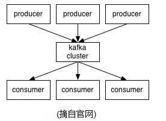
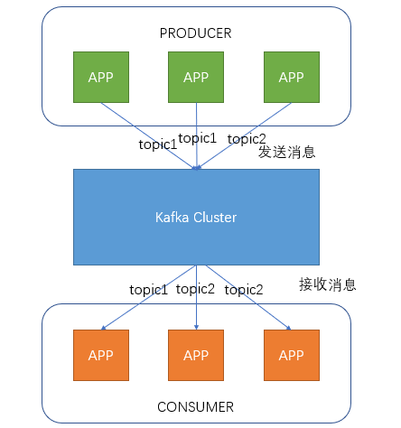
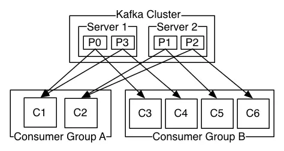
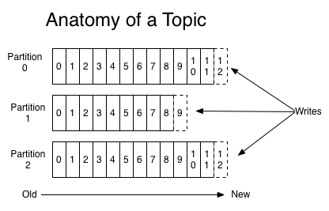
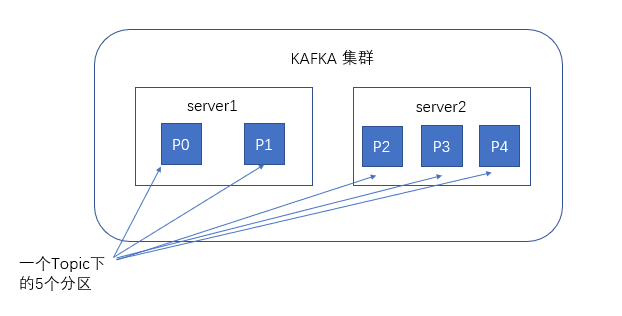
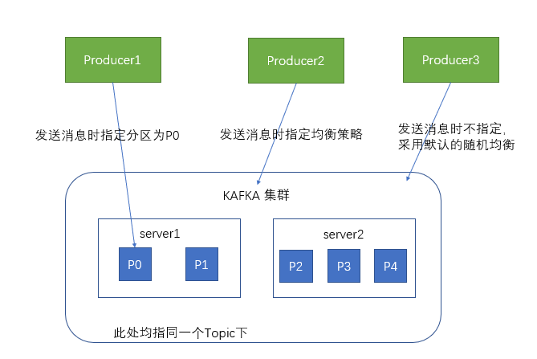
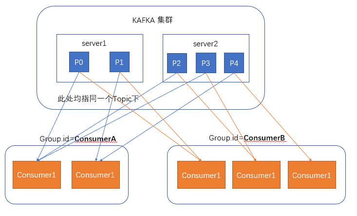
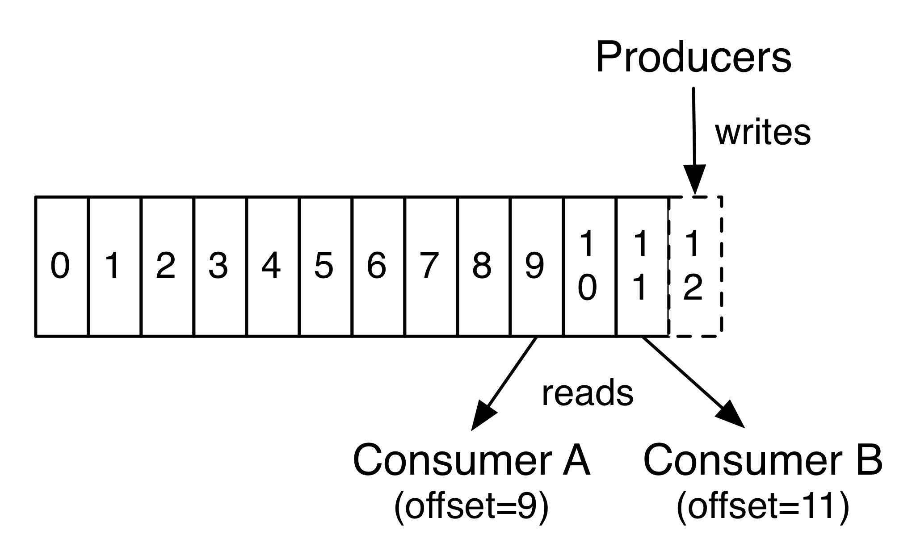

# Kafka

Apacha [Kafka](http://kafka.apache.org/intro)是一个分布式流媒体平台，主要功能有3个：

- 发布/订阅 消息流，类似与消息队列
- 以容错的方式记录消息流，kafka以文件的方式来存储消息流
- 可以再消息发布的时候进行处理

# 简介

## 使用场景

- 在系统或应用程序之间构建可靠的用于传输实时数据的管道，消息队列功能
- 构建实时的流数据处理程序来变换或处理数据流，数据处理功能
- 日志收集：一个公司可以用Kafka可以收集各种服务的log，通过kafka以统一接口服务的方式开放给各种consumer，例如hadoop、Hbase、Solr等。
- 用户活动跟踪：Kafka经常被用来记录web用户或者app用户的各种活动，如浏览网页、搜索、点击等活动，这些活动信息被各个服务器发布到kafka的topic中，然后订阅者通过订阅这些topic来做实时的监控分析，或者装载到hadoop、数据仓库中做离线分析和挖掘。

## 特性

- 高吞吐量、低延迟：kafka每秒可以处理几十万条消息，它的延迟最低只有几毫秒，每个topic可以分多个partition, consumer group 对partition进行consume操作。
- 可扩展性：kafka集群支持热扩展
- 持久性、可靠性：消息被持久化到本地磁盘，并且支持数据备份防止数据丢失
- 容错性：允许集群中节点失败（若副本数量为n,则允许n-1个节点失败）
- 高并发：支持数千个客户端同时读写

## 重要概念

Kafka 每个节点称为broker，producer负责发送消息，consumer负责消费消息。

- 1.Broker:

- 2.topics and logs

Topic即主题，通过对消息指定主题可以将消息分类，消费者可以只关注自己需要的Topic中的消息

创建一个topic时，同时可以指定分区数目，分区数越多，其吞吐量也越大，但是需要的资源也越多，同时也会导致更高的不可用性，kafka在接收到生产者发送的消息之后，会根据均衡策略将消息存储到不同的分区中。

- 3.Producer

生产者，向Kafka集群发送消息，在发送消息之前，会对消息进行分类，即Topic，上图展示了两个producer发送了分类为topic1的消息，另外一个发送了topic2的消息。

Producer将消息发布到指定的Topic中,同时Producer也能决定将此消息归属于哪个partition;比如基于"round-robin"方式或者通过其他的一些算法等.

- 4.Consumer

消费者通过与kafka集群建立长连接的方式，不断地从集群中拉取消息，然后可以对这些消息进行处理。

本质上kafka只支持Topic.每个consumer属于一个consumer group;反过来说,每个group中可以有多个consumer.发送到Topic的消息,只会被订阅此Topic的每个group中的一个consumer消费。

Consumer的两条原则：

- 假如所有消费者都在同一个消费者组中，那么它们将协同消费订阅Topic的部分消息（根据分区与消费者的数量分配），保存负载平衡；
- 假如所有消费者都在不同的消费者组中，并且订阅了同个Topic，那么它们将可以消费Topic的所有消息； 下面是一个简单的例子，帮助大家理解：

上图中有两个Server节点，有一个Topic被分为四个分区（P0-P4)分别被分配在两个节点上，另外还有两个消费者组（GA，GB），其中GA有两个消费者实例，GB有四个消费者实例。 从图中我们可以看出，首先订阅Topic的单位是消费者组，另外我们发现Topic中的消息根据一定规则将消息推送给具体消费者，主要原则如下：

- 若消费者数小于partition数，且消费者数为一个，那么它就消费所有消息；
- 若消费者数小于partition数，假设消费者数为N，partition数为M，那么每个消费者能消费的分区数为M/N或M/N+1；
- 若消费者数等于partition数，那么每个消费者都会均等分配到一个分区的消息；
- 若消费者数大于partition数，则将会出现部分消费者得不到消息分区，出现空闲的情况；

## 消息存储

谈到kafka的存储，就不得不提到分区，即partitions，创建一个topic时，同时可以指定分区数目，分区数越多，其吞吐量也越大，但是需要的资源也越多，同时也会导致更高的不可用性，kafka在接收到生产者发送的消息之后，会根据均衡策略将消息存储到不同的分区中。

生产者在向kafka集群发送消息的时候，可以通过指定分区来发送到指定的分区中也可以通过指定均衡策略来将消息发送到不同的分区中如果不指定，就会采用默认的随机均衡策略，将消息随机的存储到不同的分区中。

在消费者消费消息时，kafka使用offset来记录当前消费的位置在kafka的设计中，可以有多个不同的group来同时消费同一个topic下的消息，如图，我们有两个不同的group同时消费，他们的的消费的记录位置offset各不项目，不互相干扰。

对于一个group而言，消费者的数量不应该多余分区的数量，因为在一个group中，每个分区至多只能绑定到一个消费者上，即一个消费者可以消费多个分区，一个分区只能给一个消费者消费。因此，若一个group中的消费者数量大于分区数量的话，多余的消费者将不会收到任何消息。

## 消息顺序

每个partition中的消息都是有序的，但是partition之间顺序就不能保证了,若topics有多个partition，生产者的消息可以指定或者由系统根据算法分配到指定分区，若你需要所有消息都是有序的，那么你最好只用一个分区。另外partition支持消息位移读取，消息位移有消费者自身管理，比如下图：

由上图可以看出，不同消费者对同一分区的消息读取互不干扰，消费者可以通过设置消息位移（offset）来控制自己想要获取的数据，比如可以从头读取，最新数据读取，重读读取等功能。

## Guaranteens

kafka作为一个高水准的系统，提供了以下的保证：

- 消息的添加是有序的，生产者越早向订阅的Topic发送的消息，会更早的被添加到Topic中，当然它们可能被分配到不同的分区；
- 消费者在消费Topic分区中的消息时是有序的；
- 对于有N个复制节点的Topic，系统可以最多容忍N-1个节点发生故障，而不丢失任何提交给该Topic的消息；

## Kafka as a Messaging System
说了这么多，前面也讲了消息系统的演变过程，那么Kafka相比其他的消息系统优势具体在哪里？ 传统的消息系统模型主要有两种：消息队列和发布/订阅。
### 消息队列
特性 | 描述
-- | -- 
表现形式 | 一组消费者从消息队列中获取消息，一条消息会被推送给组中的某一个消费者 |
优势 | 水平扩展，可以将消息数据分开处理 |
劣势 | 消息队列不是多用户的，当一条消息记录被一个进程读取后，消息便会丢失 |

### 发布/订阅
特性 | 描述
-- | -- 
表现形式 | 消息会广播发送给所有订阅者 |
优势 | 可以多进程共享消息 |
劣势 | 每个消费者都会获得所有消息，无法通过添加消费进程提高处理效率 |

从上面两个表中可以看出两种传统的消息系统模型的优缺点，所以Kafka在前人的肩膀上进行了优化，吸收他们的优点，主要体现在以下两方面：
* 通过Topic方式来达到消息队列的功能
* 通过消费者组这种方式来达到发布/订阅的功能

## Kafka as a Storage System
存储消息也是消息系统的一大功能，Kafka相对普通的消息队列存储来说，它的表现实在好的太多，首先Kafka支持写入确认，保证消息写入的正确性和连续性，同时Kafka还会对写入磁盘的数据进行复制备份，来实现容错，另外Kafka对磁盘的使用结构是一致的，就说说不管你的服务器目前磁盘存储的消息数据有多少，它添加消息数据的效率是相同的。
Kafka的存储机制很好的支持消费者可以随意控制自身所需要读取的数据，在很多时候你也可以将Kafka作为一个高性能，低延迟的分布式文件系统。

## Kafka for Stream Processing
Kafka作为一个完美主义代表者，光有普通的读写，存储等功能是不够的，它还提供了实时处理消息流的接口。
很多时候原始的数据并不是我们想要的，我们想要的是经过处理后的数据结果，比如通过一天的搜索数据得出当天的搜索热点等，你可以利用Streams API来实现自己想要的功能，比如从输入Topic中获取数据，然后再发布到具体的输出Topic中。
Kafka的流处理可以解决诸如处理无序数据、数据的复杂转换等问题。

# 参考资料

- [官方文档](http://kafka.apache.org/documentation/#gettingStarted)
- [kafka介绍](https://www.cnblogs.com/hei12138/p/7805475.html)

