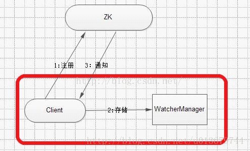
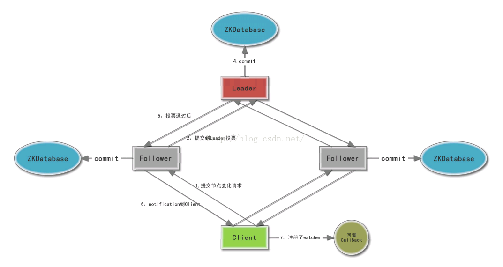
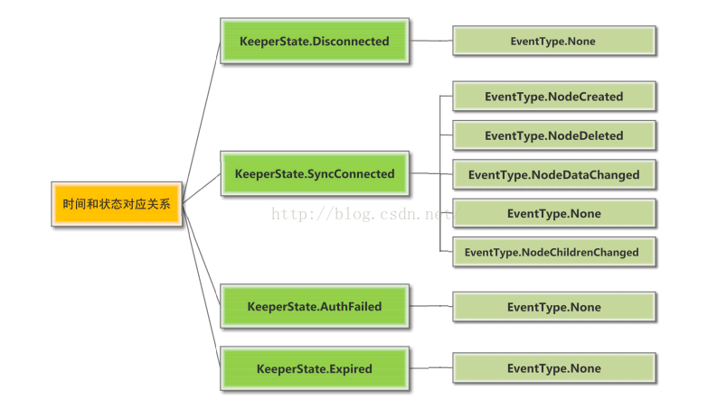

<!-- TOC -->

- [简介](#简介)
    - [设计目标](#设计目标)
    - [分布式一致性](#分布式一致性)
- [核心概念](#核心概念)
    - [角色](#角色)
- [数据模型](#数据模型)
    - [Znode 属性](#znode-属性)
    - [Znode 类型](#znode-类型)
    - [Watch 机制](#watch-机制)
    - [zookeeper 事件](#zookeeper-事件)
    - [ACL](#acl)
    - [ZAB](#zab)
        - [安全属性](#安全属性)
        - [安全保证](#安全保证)
        - [工作阶段](#工作阶段)
        - [ZAB 特性](#zab-特性)
    - [zookeeper leader 选举](#zookeeper-leader-选举)
        - [选举时机](#选举时机)
        - [选举过程](#选举过程)
        - [选举算法](#选举算法)
- [数据存储、同步和恢复](#数据存储同步和恢复)
- [应用场景](#应用场景)
    - [分布式共享锁](#分布式共享锁)
    - [数据发布与订阅](#数据发布与订阅)
    - [命名服务](#命名服务)
    - [分布式系统通知/协调](#分布式系统通知协调)
    - [集群管理](#集群管理)
    - [分布式队列](#分布式队列)
- [参考文档](#参考文档)

<!-- /TOC -->

# 简介

ZooKeeper是一个开源的分布式协调服务，由雅虎创建，是Google Chubby的开源实现。ZooKeeper的设计目标是将那些复杂且容易出错的分布式一致性服务封装起来，构成一个高效可靠的原语集，并以一系列简单易用的接口提供给用户使用。

ZooKeeper是一个典型的分布式数据一致性的解决方案。分布式应用程序可以基于它实现诸如数据发布/订阅、负载均衡、命名服务、分布式协调/通知、集群管理、Master选举、分布式锁和分布式队列等功能。ZooKeeper可以保证如下分布式一致性特性。

## 设计目标

- 简单

ZooKeeper允许分布式进程通过共享的层级命名空间相互协调，该命名空间与标准文件系统类似地组织。名称空间由数据寄存器组成 - 在ZooKeeper用语中称为znodes - 这些与文件和目录类似。与专为存储而设计的典型文件系统不同，ZooKeeper数据保存在内存中，这意味着ZooKeeper可以实现高吞吐量和低延迟数量。

- 复制

与它协调的分布式进程一样，ZooKeeper本身也可以在称为集合的一组主机上进行复制。

组成ZooKeeper服务的服务器必须彼此了解。它们维护内存中的状态图像，以及持久性存储中的事务日志和快照。只要大多数服务器可用，ZooKeeper服务就可用。

- 有序

ZooKeeper使用反映所有ZooKeeper事务顺序的数字标记每个更新。后续操作可以使用该顺序来实现更高级别的抽象，例如同步原语。

- 快速

它在“读取主导”工作负载中特别快。ZooKeeper应用程序在数千台计算机上运行，​​并且在取比写入更常见的情况下表现最佳，比率大约为10：1。

## 分布式一致性
- 顺序一致性
从同一个客户端发起的事务请求，最终将会严格按照其发起顺序被应用到ZooKeeper中。

- 原子性
所有事务请求的结果在集群中所有机器上的应用情况是一致的，也就是说要么整个集群所有集群都成功应用了某一个事务，要么都没有应用，一定不会出现集群中部分机器应用了该事务，而另外一部分没有应用的情况。

- 单一视图（最终一致性）
无论客户端连接的是哪个ZooKeeper服务器，其看到的服务端数据模型都是一致的。

- 可靠性
一旦服务端成功地应用了一个事务，并完成对客户端的响应，那么该事务所引起的服务端状态变更将会被一直保留下来，除非有另一个事务又对其进行了变更。

- 实时性
通常人们看到实时性的第一反应是，一旦一个事务被成功应用，那么客户端能够立即从服务端上读取到这个事务变更后的最新数据状态。这里需要注意的是，ZooKeeper仅仅保证在一定的时间段内，客户端最终一定能够从服务端上读取到最新的数据状态。

- 等待无关（wait-free）

慢的或者失效的client不得干预快速的client的请求，使得每个client都能有效的等待。

# 核心概念

## 角色

Zookeeper的角色主要有3种，Leader，Follower，Observer三种，如下图所示：

一个ZooKeeper集群同一时刻只会有一个Leader，其他都是Follower或Observer。

ZooKeeper默认只有Leader和Follower两种角色，没有Observer角色。

为了使用Observer模式，在任何想变成Observer的节点的配置文件中加入：             
`peerType=observer`
并在所有server的配置文件中，配置成observer模式的server的那行配置追加:observer，例如：
`server.1:localhost:2888:3888:observer`

ZooKeeper集群的所有机器通过一个Leader选举过程来选定一台被称为『Leader』的机器，Leader服务器为客户端提供读和写服务。

Follower和Observer都能提供读服务，不能提供写服务。两者唯一的区别在于，Observer机器不参与Leader选举过程，也不参与写操作的『过半写成功』策略，因此Observer可以在不影响写性能的情况下提升集群的读性能。

# 数据模型

Zookeeper的结构类似标准的文件系统，但这个文件系统中没有文件和目录，而是统一使用节点(node)的概念，称为znode。Znode作为保存数据的容器(限制在1mb以内)，也构成了一个层次化的命名空间。

zookeeper目录中的每一个节点对应着一个znode，每个znode维护着一个属性结构，它包含数据的版本号、时间戳、等信息。Zookeeper就是通过这些属性来实现它特定的功能。每当znode的数据改变时，相应的版本号会增加，每当客户端查询、更新和删除数据时，也必须提供要被操作的znode版本号，如果所提供的数据版本号与实际的不匹配，那么将会操作失败。

## Znode 属性

属性 | 描述
--- | ---
czxid |节点被创建的zxid值
mzxid | 节点被修改时zxid值
ctime | 节点创建的时间
mtime | 节点最后一次的修改时间
vesion | 节点的版本号
cversion | 节点所拥有的子节点被修改的版本号
aversion | 节点的ACL被修改的版本号
dataLength | 节点数据的长度
numChildren | 节点拥有子节点的个数
ephemeralOwner | 如果节点为临时节点，那么它的值为这个节点拥有者的session ID；负责它的值为0

## Znode 类型

- 持久节点(PERSISTENT)

所谓持久节点，是指在节点创建后，就一直存在，直到有删除操作来主动清除这个节点——不会因为创建该节点的客户端会话失效而消失。

- 持久顺序节点(PERSISTENT_SEQUENTIAL)

在ZK中，每个父节点会为他的第一级子节点维护一份时序，会记录每个子节点创建的先后顺序。基于这个特性，在创建子节点的时候（注意：在此节点下的子节点是有顺序的），可以设置这个属性，那么在创建节点过程中，ZK会自动为给定节点名加上一个数字后缀，作为新的节点名。这个数字后缀的上限是整型的最大值。

- 临时节点（EPHEMERAL）

和持久节点不同的是，临时节点的生命周期和客户端会话绑定。也就是说，如果客户端会话失效，那么这个节点就会自动被清除掉。注意，这里提到的是会话失效，而非连接断开。另外，在临时节点下面不能创建子节点，注意是更具Session会话的失效时间来设定的。

- 临时顺序节点（EPHEMERAL_SEQUENTIAL）

临时顺序节点的特性和临时节点一致，同时是在临时节点的基础上，添加了顺序的特性。

## Watch 机制

zookeeper 的 watch 机制目的是为ZK客户端操作提供一种类似于异步获得数据的操作。zk提供了分布式数据的发布订阅功能，一个典型的发布订阅系统定义了一种一对多的订阅关系，能够让多个订阅者同时监听某一个主题对象，当这个主题对象自身状态变化时，会通知所有订阅者，使它们能够做出相应的处理。zk，引入了watcher机制来实现这种分布式的通知功能。

watch 机制的特点：

- 一次性触发

客户端在Znode设置了Watch时，如果Znode内容发生改变，那么客户端就会获得Watch事件。例如：客户端设置getData("/znode1", true)后，如果/znode1发生改变或者删除，那么客户端就会得到一个/znode1的Watch事件，但是/znode1再次发生变化，那客户端是无法收到Watch事件的，除非客户端设置了新的Watch。

- 异步发送

Watch事件是异步发送到Client。Zookeeper可以保证客户端发送过去的更新顺序是有序的。例如：某个Znode没有设置watcher，那么客户端对这个Znode设置Watcher发送到集群之前，该客户端是感知不到该Znode任何的改变情况的。换个角度来解释：由于Watch有一次性触发的特点，所以在服务器端没有Watcher的情况下，Znode的任何变更就不会通知到客户端。不过，即使某个Znode设置了Watcher，且在Znode有变化的情况下通知到了客户端，但是在客户端接收到这个变化事件，但是还没有再次设置Watcher之前，如果其他客户端对该Znode做了修改，这种情况下，Znode第二次的变化客户端是无法收到通知的。这可能是由于网络延迟或者是其他因素导致，所以我们使用Zookeeper不能期望能够监控到节点每次的变化。Zookeeper只能保证最终的一致性，而无法保证强一致性。

- 数据监视

Zookeeper有数据监视和子数据监视。例如：节点创建，节点删除，节点改变，子节点改变等等。Zookeeper维护了两个Watch列表，一个节点数据Watch列表，另一个是子节点Watch列表。getData()和exists()设置数据Watch，getChildren()设置子节点Watch。两者选其一，可以让我们根据不同的返回结果选择不同的Watch方式，getData()和exists()返回节点的内容，getChildren()返回子节点列表。因此，setData()触发内容Watch，create()触发当前节点的内容Watch或者是其父节点的子节点Watch。delete()同时触发父节点的子节点Watch和内容Watch，以及子节点的内容Watch。

Watch 的运行机制：

1，Watch是轻量级的，其实就是本地JVM的Callback，服务器端只是存了是否有设置了Watcher的布尔类型。（源码见：org.apache.zookeeper.server.FinalRequestProcessor）
2，在服务端，在FinalRequestProcessor处理对应的Znode操作时，会根据客户端传递的watcher变量，添加到对应的ZKDatabase（org.apache.zookeeper.server.ZKDatabase）中进行持久化存储，同时将自己NIOServerCnxn做为一个Watcher callback，监听服务端事件变化
3，Leader通过投票通过了某次Znode变化的请求后，然后通知对应的Follower，Follower根据自己内存中的zkDataBase信息，发送notification信息给zookeeper客户端。
4，Zookeeper客户端接收到notification信息后，找到对应变化path的watcher列表，挨个进行触发回调。

## zookeeper 事件

Zookeeper状态/事件对应关系图：

watch 事件:

事件 | 说明
--- | ---
None | 在客户端与Zookeeper集群中的服务器断开连接的时候，客户端会收到这个事件。
NodeCreated  |  Znode创建事件
NodeDeleted  | Znode删除事件
NodeDataChanged  |  Znode数据内容更新事件。其实本质上该事件只关注dataVersion版本号，但是只要调用了更新接口dataVersion就会有变更。
NodeChildrenChanged | Znode子节点改变事件，只关注子节点的个数变更，子节点内容有变更是不会通知的。

事件发生时，zookeeper的状态：

状态 | 说明
--- | ---
Disconnected(0) |客户端处于断开连接的状态，并且没有和Zookeeper集群中任何服务器连接。
SyncConnected(3) | 客户端处于连接的状态，也就是说客户端连接到了一台server
AuthFailed(4) | 验证失败的状态
ConnectedReadOnly(5) |客户端连接到一个只读Server的状态。
SaslAuthenticated(6) |用于通知客户端他们是SASL认证，以至于他们能够SASL认证的权限通过操作Zookeeper。
Expired(-112) | 会话超时状态

## ACL

ZooKeeper采用ACL（Access Control Lists）策略来进行权限控制。ZooKeeper定义了如下5种权限。

CREATE: 创建子节点的权限。
READ: 获取节点数据和子节点列表的权限。
WRITE：更新节点数据的权限。
DELETE: 删除子节点的权限。
ADMIN: 设置节点ACL的权限。
注意：CREATE 和 DELETE 都是针对子节点的权限控制。

## ZAB 

Zookeeper使用了一种称为Zab（Zookeeper Atomic Broadcast）的协议作为其一致性复制的核心。ZooKeeper是Chubby的开源实现，而Chubby是Paxos的工程实现，所以很多人以为ZooKeeper也是Paxos算法的工程实现。事实上，ZooKeeper并没有完全采用Paxos算法，而是使用了一种称为ZooKeeper Atomic Broadcast（ZAB，ZooKeeper原子广播协议）的协议作为其数据一致性的核心算法。

ZAB协议并不像Paxos算法和Raft协议一样，是通用的分布式一致性算法，它是一种特别为ZooKeeper设计的崩溃可恢复的原子广播算法。

基于ZAB协议，ZooKeeper实现了一种主备模式（Leader、Follower）的系统架构来保持集群中各副本之间数据的一致性。

ZAB 协议有两个工作模式：**broadcast模式**、**recovery 模式**

在整个ZooKeeper集群启动过程中，或是当Leader服务器出现网络中断、崩溃退出与重启等异常情况时，ZAB协议就会进入恢复模式并选举产生新的Leader服务器。当选举产生了新的Leader服务器，同时集群中有过半的机器与该Leader服务器完成了状态同步之后，ZAB协议就会退出恢复模式。其中，状态同步是指数据同步，用来保证集群中存在过半的机器能够和Leader服务器的数据状态保持一致。

崩溃恢复模式包括两个阶段：Leader选举和数据同步。

当集群中有过半的Follower服务器完成了和Leader服务器的状态同步，那么整个集群就可以进入消息广播模式了。

### 安全属性

考虑到Zookeeper主要操作数据的状态，为了保证状态的一致性，Zookeeper提出了两个安全属性（Safety Property）

- 全序（Total order）：如果消息a在消息b之前发送，则所有Server应该看到相同的结果
- 因果顺序（Causal order）：如果消息a在消息b之前发生（a导致了b），并被一起发送，则a始终在b之前被执行

### 安全保证

为了保证上述两个安全属性，Zookeeper使用了TCP协议和Leader。
- 通过使用TCP协议保证了消息的全序特性（先发先到）
- 通过Leader解决了因果顺序问题：先到Leader的先执行。

因为有了Leader，Zookeeper的架构就变为：Master-Slave模式，但在该模式中Master（Leader）会Crash，因此，Zookeeper引入了Leader选举算法，以保证系统的健壮性。

### 工作阶段
- Atomic Broadcast

同一时刻存在一个Leader节点，其他节点称为“Follower”，如果是更新请求，如果客户端连接到Leader节点，则由Leader节点执行其请求；如果连接到Follower节点，则需转发请求到Leader节点执行。但对读请求，Client可以直接从Follower上读取数据，如果需要读到最新数据，则需要从Leader节点进行，Zookeeper设计的读写比例是2：1。

Leader通过一个简化版的二段提交模式向其他Follower发送请求，但与二段提交有两个明显的不同之处：
因为只有一个Leader，Leader提交到Follower的请求一定会被接受（没有其他Leader干扰）
不需要所有的Follower都响应成功，只要一个多数派即可
通俗地说，如果有2f+1个节点，允许f个节点失败。因为任何两个多数派必有一个交集，当Leader切换时，通过这些交集节点可以获得当前系统的最新状态。如果没有一个多数派存在（存活节点数小于f+1）则，算法过程结束。但有一个特例：
如果有A、B、C三个节点，A是Leader，如果B Crash，则A、C能正常工作，因为A是Leader，A、C还构成多数派；如果A Crash则无法继续工作，因为Leader选举的多数派无法构成。

- Leader选举

Leader选举主要是依赖Paxos算法，具体算法过程请参考其他博文，这里仅考虑Leader选举带来的一些问题。Leader选举遇到的最大问题是，”新老交互“的问题，新Leader是否要继续老Leader的状态。这里要按老Leader Crash的时机点分几种情况：
老Leader在COMMIT前Crash（已经提交到本地）
老Leader在COMMIT后Crash，但有部分Follower接收到了Commit请求
第一种情况，这些数据只有老Leader自己知道，当老Leader重启后，需要与新Leader同步并把这些数据从本地删除，以维持状态一致。
第二种情况，新Leader应该能通过一个多数派获得老Leader提交的最新数据
老Leader重启后，可能还会认为自己是Leader，可能会继续发送未完成的请求，从而因为两个Leader同时存在导致算法过程失败，解决办法是把Leader信息加入每条消息的id中，Zookeeper中称为zxid，zxid为一64位数字，高32位为leader信息又称为epoch，每次leader转换时递增；低32位为消息编号，Leader转换时应该从0重新开始编号。通过zxid，Follower能很容易发现请求是否来自老Leader，从而拒绝老Leader的请求。

因为在老Leader中存在着数据删除（情况1），因此Zookeeper的数据存储要支持补偿操作，这也就需要像数据库一样记录log。

### ZAB 特性

ZooKeeper中提交事务的协议并不是Paxos，而是由二阶段提交协议改编的ZAB协议。Zab可以满足以下特性：

- 可靠提交 Reliable delivery：如果消息m被一个server递交了，那么m也将最终被所有server递交。
- 全局有序 Total order：如果server在递交b之前递交了a，那么所有递交了a、b的server也会在递交b之前递交a。
- 因果有序 Casual order：对于两个递交了的消息a、b，如果a因果关系优先于(causally precedes)b，那么a将在b之前递交。　

第三条的因果优先指的是同一个发送者发送的两个消息a先于b发送，或者上一个leader发送的消息a先于当前leader发送的消息。

## zookeeper leader 选举

### 选举时机

1、服务器初始化启动
2、服务器运行期间无法和Leader保持连接

### 选举过程

1、初始化启动时候的选举

若进行Leader选举，则至少需要两台机器，这里选取3台机器组成的服务器集群为例。在集群初始化阶段，当有一台服务器Server1启动时，其单独无法进行和完成Leader选举，当第二台服务器Server2启动时，此时两台机器可以相互通信，每台机器都试图找到Leader，于是进入Leader选举过程。选举过程如下

　　(1) 每个Server发出一个投票。由于是初始情况，Server1和Server2都会将自己作为Leader服务器来进行投票，每次投票会包含所推举的服务器的myid和ZXID，使用(myid, ZXID)来表示，此时Server1的投票为(1, 0)，Server2的投票为(2, 0)，然后各自将这个投票发给集群中其他机器。

　　(2) 接受来自各个服务器的投票。集群的每个服务器收到投票后，首先判断该投票的有效性，如检查是否是本轮投票、是否来自LOOKING状态的服务器。

　　(3) 处理投票。针对每一个投票，服务器都需要将别人的投票和自己的投票进行PK，PK规则如下

　　　　· 优先检查ZXID。ZXID比较大的服务器优先作为Leader。

　　　　· 如果ZXID相同，那么就比较myid。myid较大的服务器作为Leader服务器。

　　对于Server1而言，它的投票是(1, 0)，接收Server2的投票为(2, 0)，首先会比较两者的ZXID，均为0，再比较myid，此时Server2的myid最大，于是更新自己的投票为(2, 0)，然后重新投票，对于Server2而言，其无须更新自己的投票，只是再次向集群中所有机器发出上一次投票信息即可。

　　(4) 统计投票。每次投票后，服务器都会统计投票信息，判断是否已经有过半机器接受到相同的投票信息，对于Server1、Server2而言，都统计出集群中已经有两台机器接受了(2, 0)的投票信息，此时便认为已经选出了Leader。

　　(5) 改变服务器状态。一旦确定了Leader，每个服务器就会更新自己的状态，如果是Follower，那么就变更为FOLLOWING，如果是Leader，就变更为LEADING。

2、 服务器运行时期的Leader选举

在Zookeeper运行期间，Leader与非Leader服务器各司其职，即便当有非Leader服务器宕机或新加入，此时也不会影响Leader，但是一旦Leader服务器挂了，那么整个集群将暂停对外服务，进入新一轮Leader选举，其过程和启动时期的Leader选举过程基本一致。假设正在运行的有Server1、Server2、Server3三台服务器，当前Leader是Server2，若某一时刻Leader挂了，此时便开始Leader选举。选举过程如下

　　(1) 变更状态。Leader挂后，余下的非Observer服务器都会讲自己的服务器状态变更为LOOKING，然后开始进入Leader选举过程。

　　(2) 每个Server会发出一个投票。在运行期间，每个服务器上的ZXID可能不同，此时假定Server1的ZXID为123，Server3的ZXID为122；在第一轮投票中，Server1和Server3都会投自己，产生投票(1, 123)，(3, 122)，然后各自将投票发送给集群中所有机器。

　　(3) 接收来自各个服务器的投票。与启动时过程相同。

　　(4) 处理投票。与启动时过程相同，此时，Server1将会成为Leader。

　　(5) 统计投票。与启动时过程相同。

　　(6) 改变服务器的状态。与启动时过程相同。

### 选举算法

一种是基于basic paxos实现的，另外一种是基于fast paxos算法实现的。系统默认的选举算法为fast paxos。

1. basic paxos

选举线程由当前Server发起选举的线程担任，其主要功能是对投票结果进行统计，并选出推荐的Server；
选举线程首先向所有Server发起一次询问(包括自己)；
选举线程收到回复后，验证是否是自己发起的询问(验证zxid是否一致)，然后获取对方的id(myid)，并存储到当前询问对象列表中，最后获取对方提议的leader相关信息(id,zxid)，并将这些信息存储到当次选举的投票记录表中；
收到所有Server回复以后，就计算出zxid最大的那个Server，并将这个Server相关信息设置成下一次要投票的Server；
线程将当前zxid最大的Server设置为当前Server要推荐的Leader，如果此时获胜的Server获得n/2 + 1的Server票数， 设置当前推荐的leader为获胜的Server，将根据获胜的Server相关信息设置自己的状态，否则，继续这个过程，直到leader被选举出来。通 过流程分析我们可以得出：要使Leader获得多数Server的支持，则Server总数必须是奇数2n+1，且存活的Server的数目不得少于 n+1.每个Server启动后都会重复以上流程。在恢复模式下，如果是刚从崩溃状态恢复的或者刚启动的server还会从磁盘快照中恢复数据和会话信 息，zk会记录事务日志并定期进行快照，方便在恢复时进行状态恢复。

2. fast paxos

在选举过程中，某Server首先向所有Server提议自己要成为leader，当其它Server收到提议以后，解决epoch和 zxid的冲突，并接受对方的提议，然后向对方发送接受提议完成的消息，重复这个流程，最后一定能选举出Leader。
选举的具体流程图如下所示：

# 数据存储、同步和恢复

[【分布式】Zookeeper数据与存储](http://www.cnblogs.com/leesf456/p/6179118.html)

# 应用场景

## 分布式共享锁

在Zookeeper上创建一个锁结点，然后每个服务器如果需要访问共享资源那么就在锁结点下创建一个锁结点的孩子结点，这里需要注意的是，孩子结点需要创建成为临时序列结点，这样一来如果某个服务器在拥有锁的时候挂了，其拥有的锁会自动释放。序列结点会使所有的锁都可以有序。在获取锁的时候创建监听该锁上一个锁的删除事件，这样可以避免“羊群效应”，在一个锁结点被释放（删除）时不会唤醒所有在等待的锁结点，可以节约网络和服务资源。

这只是一个基本的实现思路，具体的规则就是序列最小的获取锁，优先级是按照时间来算的，但是基本思路都是一样的，可以基于此上修改成为优先级可调节的，或者改成分布式读写锁提高访问性能。

　分布式共享锁的实现请参考：https://github.com/wxisme/zoopack/blob/master/zoopack/src/main/java/org/zoopack/lock/

## 数据发布与订阅

发布与订阅即所谓的配置管理，顾名思义就是将数据发布到zk节点上，供订阅者动态获取数据，实现配置信息的集中式管理和动态更新。例如：全局的配置信息、地址列表等。

具体用法：
- 索引信息和集群中机器节点状态放在zk的一些指定节点，供各个客户端订阅使用。
- 系统日志（经处理后）存储，这些日志通常2-3天后清除。
- 应用中用到的一些配置信息集中管理，在应用启动的时候主动来获取一次，并在节点上注册一个Watcher，以后每次配置有更新，实时通知到应用，获取最新的配置信息。
- 业务逻辑中需要用到的一些全局变量，比如一些消息中间件的消息队列通常有个offset，这个offset存放在zk上，这样集群中每个发送者都能知道当前的发送进度。
- 系统中有些信息需要动态获取，并且还会存在人工手动去修改这个信息。以前通常是暴露出接口，例如JMX接口，有了zk后，只要将这些信息存放到zk节点上即可。

## 命名服务

这个主要是作为分布式命名服务，通过调用zk的create node api，能够很容易创建一个全局唯一的path，可以将这个path作为一个名称。

## 分布式系统通知/协调

ZooKeeper中特有的watcher注册于异步通知机制，能够很好的实现分布式环境下不同系统之间的通知与协调，实现对数据变更的实时处理。使用方法通常是不同系统都对zk上同一个znode进行注册，监听znode的变化（包括znode本身内容及子节点内容），其中一个系统update了znode，那么另一个系统能够收到通知，并做出相应处理。

使用ZooKeeper来进行分布式通知和协调能够大大降低系统之间的耦合。

具体用法：

- 心跳检测机制：检测系统和被测系统之间并不直接关联起来，而是通过zk上某个节点关联，大大减少系统耦合。
- 系统调度模式：某系统有控制台和推送系统两部分组成，控制台的职责是控制推送系统进行相应的推送工作。管理人员在控制台做的一些操作，实际上是修改了zk上某些节点的状态，而zk就把这些变化通知给它们注册watcher的客户端，即推送系统，于是，做出相应的推送任务。
- 工作汇报模式：一些类似于任务分发系统，子任务启动后，到zk来注册一个临时节点，并定时将自己的进度进行汇报（将进度写回这个临时节点），这样任务管理者就能够实时指导任务进度。

## 集群管理

- 集群机器监控：

这通常用于那种对集群中机器状态、机器在线率有较高要求的场景，能够快速对集群中机器变化做出响应。这样的场景中，往往有一个监控系统，实时监测集群机器是否存活。过去的做法通常是：监控系统通过某种手段（比如ping）定时检测每个机器、或每个机器定时向监控系统发送心跳信息。这种做法存在两个弊端：1.集群中机器有变动的时候，牵连修改的东西比较多。2.有一定的延迟。利用ZooKeeper，可以实现另一种集群机器存活性监控系统：a.客户端在节点x上注册watcher，如果x的子节点发生变化，会通知该客户端。b.创建EPHEMERAL类型的节点，一旦客户端和服务器的会话结束或过期，该节点就会消失。例如：监控系统在/clusterServers节点上注册一个watcher，以后每动态加机器，就往/culsterServer下创建一个EPHEMERAL类型的节点：/clusterServer/{hostname}。这样，监控系统就能实时知道机器的增减情况，至于后续处理就是监控系统的业务了。

- Master选举：

在分布式环境中，相同的业务应用分布在不同的机器上，有些业务逻辑（例如一些耗时的计算、网络I/O处理），往往需要让整个集群中的某一台机器进行执行，其余机器可以共享这个结果，这样可以减少重复劳动、提高性能。利用ZooKeeper的强一致性，能够保证在分布式高并发情况下节点创建的全局唯一性，即：同时有多个客户端请求创建/currentMaster节点，最终一定只有一个客户端请求能够创建成功。利用这个特性，就能很轻易的在分布式环境中进行集群选取了。另外，这种场景演化一下，就是动态Master选举。这就要用到 EPHEMERAL_SEQUENTIAL类型节点的特性了。上文中提到，所有客户端创建请求，最终只有一个能够创建成功。在这里稍微变化下，就是允许所有请求都能够创建成功，但是得有个创建顺序，于是所有的请求最终在zk上创建结果的一种可能情况是这样： /currentMaster/{sessionId}-1、/currentMaster/{sessionId}-2、/currentMaster/{sessionId}-3……。每次选取序列号最小的那个机器作为Master，如果这个机器挂了，由于他创建的节点会马上消失，那么之后最小的那个机器就是Master了。

## 分布式队列

队列方面，有两种方式：一种是常规的先进先出队列，另一种是要等到队列成员聚齐之后的才统一按序执行。

对于先进先出队列，和分布式锁服务中的控制时序场景基本原理一致，这里不再赘述。

第二种队列其实是在FIFO队列的基础上作了一个增强。通常可以在/queue这个znode下预先建立一个/queue/num节点，并且赋值为n（或者直接给/queue赋值n），表示队列大小，之后每次有队列成员加入后，就判断下是否已经到达队列大小，决定是否可以开始执行了。这种用法的典型场景是，分布式环境中，一个大任务Task A，需要在很多子任务完成（或条件就绪）情况下才能进行。这个时候，凡是其中一个子任务完成（就绪），那么就去/taskList下建立自己的临时时序节点（CreateMode.EPHEMERAL_SEQUENTIAL），当/taskList发现自己下面的子节点满足指定个数，就可以进行下一步按序进行处理了。

# 参考文档

- [zookeeper 官方文档](https://zookeeper.apache.org/doc/current/zookeeperOver.html)
- [Zookeeper Watch机制](https://blog.csdn.net/qianshangding0708/article/details/50084155)
- [ZooKeeper介绍及典型使用场景](https://blog.csdn.net/liuxinghao/article/details/42747625)
- [ZooKeeper原理与应用](https://www.jianshu.com/p/84ad63127cd1)
- [【分布式】Zookeeper的Leader选举](http://www.cnblogs.com/leesf456/p/6107600.html)
- [Zab协议](https://www.cnblogs.com/sunddenly/articles/4073157.html)