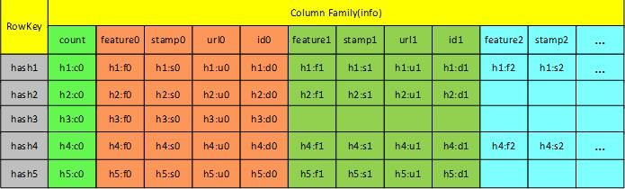
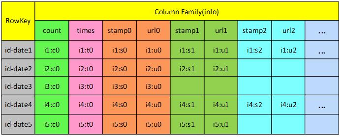
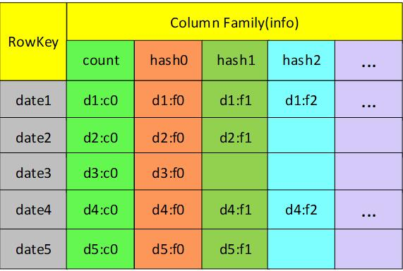

<!-- TOC -->

- [个人简历项目介绍](#个人简历项目介绍)
- [大规模人脸检索和人证合一系统](#大规模人脸检索和人证合一系统)
    - [项目简介](#项目简介)
    - [应用背景](#应用背景)
    - [技术关键](#技术关键)
        - [大数据框架](#大数据框架)
        - [存储实现](#存储实现)
        - [计算逻辑](#计算逻辑)
    - [索引方法](#索引方法)
        - [CPU索引](#cpu索引)
        - [GPU索引](#gpu索引)
- [融合深度学习技术的智能云应用平台](#融合深度学习技术的智能云应用平台)
    - [项目简介](#项目简介-1)
    - [项目背景](#项目背景)

<!-- /TOC -->

# 个人简历项目介绍

# 大规模人脸检索和人证合一系统

## 项目简介

实现一个基于深度神经网络的大规模人脸识别和检索的系统，统计在规定时间内，经过所有摄像头的人脸的次数。

## 应用背景

本项目的大规模人脸识别系统是基于某海关鉴定“水客”的应用场景来设计。在实际的应用场景中，每天通过海关的人员大约有40万人，每个游客进入摄像头的人脸图像大约提取10张，要求计算该游客在过去15天内一共出现的次数。根据统计的次数来判断游客是否为“水客”。

## 技术关键

按照应用背景的要求，15天内大约有6000万张图片，面对如此庞大的数据集，需要采用分布式处理的方案来计算。

### 大数据框架

采用Storm分布式实时处理的框架来对每个摄像头的视频帧进行预处理，通过**人脸检测**、**特征提取**、**特征比对**等步骤来实现大规模人脸检索的功能。

HDFS实现分布式文件存储，HBase来实现分布式列存储，Storm实现实时流计算并接入人脸识别算法，Kafka实现分布式消息转发

### 存储实现

需要存储的数据有人脸图像的非结构化数据，中间产生的人脸特征、哈希特征等结构化的数据，将非结构化的数据存储在HDFS上，通过URL获取，结构化数据存储在HBase表里面，分别有3张表，HashTable，TimesTable，IndexTable

**HashTable**: 建立hash特征和人脸实值特征、人脸图片URL和时间戳，人脸ID字段的联系。行健为hash特征

**注意：一个feature 可能对应多个hash**

count：表示hash对应的feature的个数
feature: 人脸实值特征（512）

**TimesTable**: 记录每天出现的次数和每次出现对应的时间戳和人脸图片对应的URL。行键为游客的ID和当天日期的结合。

count: 表示游客被识别成功的次数，每识别一次，count字段就加1，然后新增（stamp和url）两个字段。

times: 表示该游客出现的次数，**和count不同，times在游客连续10秒内出现只计算一次，count则是识别一次就加一次**

这里的游客的ID是通过检索得到的，后面有检索算法

**IndexTable**: 记录15天内，每天插入到索引的哈希值，主要用于更新索引和数据恢复。行健为当天的日期。

count: 记录当天插入索引的hash的个数，hash为当天的哈希索引值。如果需要增加新的索引，count字段加一，后面添加新的列。

hash: 当天抓取的人的hash值

### 计算逻辑

每天抓到的人脸都会存储到IndexTable中，用于初始化索引。对于抓取到的人脸去以前的特征库里面检索特征（中间需要用到HashTable来对人脸进行精细计算），然后统计次数，存入到TimesTable中。

## 索引方法

### CPU索引

首先，将待查的特征变成Hash，利用C++ 的 popcnt 指令优化，计算待查Hash和特征库里面的Hash的汉明距离（异或），然后利用桶排序思想，得到汉明距离最低的几个hash值，然后返回粗略索引结果，得到粗略结果后，查询 HashTable 里面的实值特征，然后利用余弦计算距离，得到最近的余弦值，即最终的查询结果。

Topk 排序问题，因为汉明距离的值有大小范围，所以采用桶排序的思想。

考虑到角度原因，所以采用余弦值来代替。

性能：100万，9ms

### GPU索引

性能：6000万，平均512ms， 100万，3ms

GPU索引利用了归并排序和双调排序的思想。

首先将所有的汉明距离按K划分，K个相邻的数据为一组，将所有⌈N/K⌉组的汉明距离排序为组内有序；

找出数组下标[0,K)和[K,2K)中汉明距离中最小的K个数据，并将它移动到[0,K)的位置，找出数组下标[2K,3K)和[3K,4K)中汉明距离中最小的K个数据，并将它移动到[2K,3K)的位置，依此类推。经过这一步之后，以2K个数据为分组，可以找出每组中的前K个数据；

重复前面两步，分别排序[0,K)、[2K,3K)、[4K,5K)…，然后将[0,K)和[2K,3K)这2K个数组为一组，找出前K个最小的汉明距离，并将它移动到[0,K)，依此类推，所有数据的前K个汉明距离即存储在[0,K)位置上。

# 融合深度学习技术的智能云应用平台

## 项目简介

结合深度学习技术，开发融合了人脸识别，人脸布控，活体检测，智能门禁等多种应用的分布式智能云应用平台。

## 项目背景

利用深度学习算法，实现摄像头视频流的实时人脸检测，人脸布控，活体检测，智能门禁的多种应用的平台级产品。

人脸布控：先将人脸黑名单库存放到系统中，提取人脸的特征，拿到待查询的人脸，跟特征库进行比对，超过某个阈值则示警。

智能门禁：其实差不多，也是拿人脸进行匹配，通过了就开门。

Docker和kubernetes 部署： 遇到的挑战，集群间的通信、分布式文件系统的选择（GlusterFS、ceph Fs、NFS）、docker 的问题。

