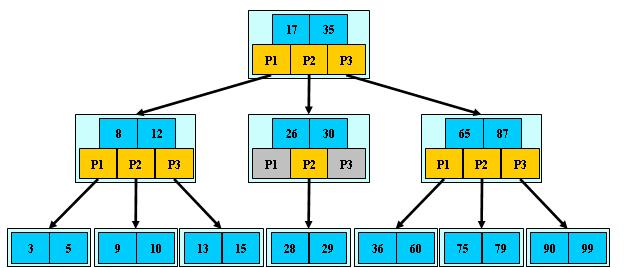
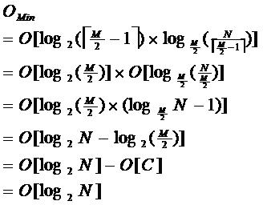
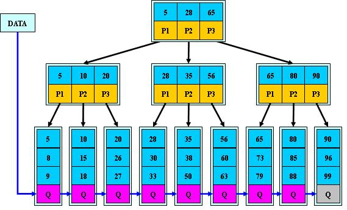
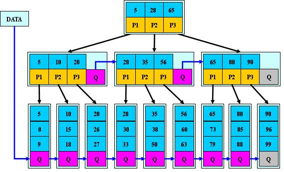

<!-- TOC -->

- [树](#树)
    - [二叉树](#二叉树)
        - [二叉树定义](#二叉树定义)
        - [二叉树性质](#二叉树性质)
        - [满二叉树](#满二叉树)
        - [完全二叉树](#完全二叉树)
        - [二叉查找树](#二叉查找树)
    - [AVL树](#avl树)
    - [RBT 红黑树](#rbt-红黑树)
    - [B-树](#b-树)
    - [B+树](#b树)
    - [B*树](#b树)
    - [B B- B+ B* 树总结](#b-b--b-b-树总结)
    - [B+/B*Tree应用](#bbtree应用)
- [参考链接](#参考链接)

<!-- /TOC -->

# 树

1. 树的定义

树是一种数据结构，它是由n（n>=1）个有限节点组成一个具有层次关系的集合。

2. 基本术语

若一个结点有子树，那么该结点称为子树根的"双亲"，子树的根是该结点的"孩子"。有相同双亲的结点互为"兄弟"。一个结点的所有子树上的任何结点都是该结点的后裔。从根结点到某个结点的路径上的所有结点都是该结点的祖先。

结点的度：结点拥有的子树的数目。
叶子：度为零的结点。
分支结点：度不为零的结点。
树的度：树中结点的最大的度。

层次：根结点的层次为1，其余结点的层次等于该结点的双亲结点的层次加1。
树的高度：树中结点的最大层次。
无序树：如果树中结点的各子树之间的次序是不重要的，可以交换位置。
有序树：如果树中结点的各子树之间的次序是重要的, 不可以交换位置。
森林：0个或多个不相交的树组成。对森林加上一个根，森林即成为树；删去根，树即成为森林。

## 二叉树

### 二叉树定义

二叉树是每个节点最多有两个子树的树结构。它有五种基本形态：二叉树可以是空集；根可以有空的左子树或右子树；或者左、右子树皆为空。

### 二叉树性质

性质1：二叉树第i层上的结点数目最多为 2^(k-1) (i≥1)。
性质2：深度为k的二叉树至多有2^k - 1个结点(k≥1)。
性质3：包含n个结点的二叉树的高度至少为log2 (n+1)。
性质4：在任意一棵二叉树中，若终端结点的个数为n0，度为2的结点数为n2，则n0=n2+1。

### 满二叉树

定义：高度为h，并且由2{h} –1个结点的二叉树，被称为满二叉树。

### 完全二叉树

定义：一棵二叉树中，只有最下面两层结点的度可以小于2，并且最下一层的叶结点集中在靠左的若干位置上。这样的二叉树称为完全二叉树。
特点：叶子结点只能出现在最下层和次下层，且最下层的叶子结点集中在树的左部。显然，一棵满二叉树必定是一棵完全二叉树，而完全二叉树未必是满二叉树。

### 二叉查找树

定义：二叉查找树(Binary Search Tree)，又被称为**二叉搜索树**。设x为二叉查找树中的一个结点，x节点包含关键字key，节点x的key值记为key[x]。如果y是x的左子树中的一个结点，则key[y] <= key[x]；如果y是x的右子树的一个结点，则key[y] >= key[x]。

在二叉查找树中：
(01) 若任意节点的左子树不空，则左子树上所有结点的值均小于它的根结点的值；
(02) 任意节点的右子树不空，则右子树上所有结点的值均大于它的根结点的值；
(03) 任意节点的左、右子树也分别为二叉查找树。
(04) **没有键值相等的节点（no duplicate nodes）。**

## AVL树

定义：自平衡二叉查找树,平衡二叉树或为空树,或为如下性质的二叉排序树:

（1）左右子树深度之差的绝对值不超过1;
（2）左右子树仍然为平衡二叉树.
平衡因子BF=左子树深度－右子树深度.

平衡二叉树每个结点的平衡因子只能是1，0，-1。若其绝对值超过1，则该二叉排序树就是不平衡的。

## RBT 红黑树

AVL是严格平衡树，因此在增加或者删除节点的时候，根据不同情况，旋转的次数比红黑树要多；
红黑是**弱平衡**的，用非严格的平衡来换取增删节点时候旋转次数的降低；

所以简单说，**搜索的次数远远大于插入和删除，那么选择AVL树，如果搜索，插入删除次数几乎差不多，应该选择RB树。**

红黑树上每个结点内含五个域，color，key，left，right，p。如果相应的指针域没有，则设为NIL。
一般的，红黑树，满足以下性质，即只有满足以下全部性质的树，我们才称之为红黑树：
1）每个结点要么是红的，要么是黑的。
2）根结点是黑的。
3）每个叶结点，即空结点（NIL）是黑的。
4）如果一个结点是红的，那么它的俩个儿子都是黑的。
5）对每个结点，从该结点到其子孙结点的所有路径上包含相同数目的黑结点。
下图所示，即是一颗红黑树：

## B-树

定义：B树是一种平衡多路搜索树（并不是二叉的），满足如下性质：

1.定义任意非叶子结点最多只有M个儿子；且M>2；

2.根结点的儿子数为[2, M]；

3.除根结点以外的非叶子结点的儿子数为[M/2, M]；

4.每个结点存放至少M/2-1（取上整）和至多M-1个关键字；（至少2个关键字）

5.非叶子结点的关键字个数=指向儿子的指针个数-1；

6.非叶子结点的关键字：K[1], K[2], …, K[M-1]；且K[i] < K[i+1]；

7.非叶子结点的指针：P[1], P[2], …, P[M]；其中P[1]指向关键字小于K[1]的

子树，P[M]指向关键字大于K[M-1]的子树，其它P[i]指向关键字属于(K[i-1], K[i])的子树；

8.所有叶子结点位于同一层；

如M=3:

B-树的搜索，从根结点开始，对结点内的关键字（有序）序列进行二分查找，如果

命中则结束，否则进入查询关键字所属范围的儿子结点；重复，直到所对应的儿子指针为

空，或已经是叶子结点；

B-树的特性：

1.关键字集合分布在整颗树中；

2.任何一个关键字出现且只出现在一个结点中；

3.搜索有可能在非叶子结点结束；

4.其搜索性能等价于在关键字全集内做一次二分查找；

5.自动层次控制；

由于限制了除根结点以外的非叶子结点，至少含有M/2个儿子，确保了结点的至少

利用率，其最底搜索性能为：

其中，M为设定的非叶子结点最多子树个数，N为关键字总数；

所以B-树的性能总是等价于二分查找（与M值无关），也就没有B树平衡的问题；

由于M/2的限制，在插入结点时，如果结点已满，需要将结点分裂为两个各占

M/2的结点；删除结点时，需将两个不足M/2的兄弟结点合并；

## B+树

定义：B+树是B-树的变体，也是一种多路搜索树：

1.其定义基本与B-树同，除了：

2.非叶子结点的子树指针与关键字个数相同；

3.非叶子结点的子树指针P[i]，指向关键字值属于[K[i], K[i+1])的子树

（B-树是开区间）；

5.为所有叶子结点增加一个链指针；

6.所有关键字都在叶子结点出现；

如：（M=3）

B+的搜索与B-树也基本相同，区别是B+树只有达到叶子结点才命中（B-树可以在
非叶子结点命中），其性能也等价于在关键字全集做一次二分查找；

B+的特性：

1.所有关键字都出现在叶子结点的链表中（稠密索引），且链表中的关键字恰好是有序的；

2.不可能在非叶子结点命中；

3.非叶子结点相当于是叶子结点的索引（稀疏索引），叶子结点相当于是存储（关键字）数据的数据层；

4.更适合文件索引系统；比如对已经建立索引的数据库记录，查找10<=id<=20，那么只要通过根节点搜索到id=10的叶节点，之后只要根据叶节点的链表找到第一个大于20的就行了，比B-树在查找10到20内的每一个时每次都从根节点出发查找提高了不少效率。

## B*树

定义：B*树是B+树的变体，在B+树的非根和非叶子结点再增加指向兄弟的指针；

B\*树定义了非叶子结点关键字个数至少为(2/3)\*M，即块的最低使用率为2/3（代替B+树的1/2）；

B+树的分裂：当一个结点满时，分配一个新的结点，并将原结点中1/2的数据复制到新结点，最后在父结点中增加新结点的指针；B+树的分裂只影响原结点和父结点，而不会影响兄弟结点，所以它不需要指向兄弟的指针；

B*树的分裂：当一个结点满时，如果它的下一个兄弟结点未满，那么将一部分数据移到兄弟结点中，再在原结点插入关键字，最后修改父结点中兄弟结点的关键字（因为兄弟结点的关键字范围改变了）；如果兄弟也满了，则在原结点与兄弟结点之间增加新结点，并各复制1/3的数据到新结点，最后在父结点增加新结点的指针；

**所以，B*树分配新结点的概率比B+树要低，空间使用率更高；**

## B B- B+ B* 树总结

B树：二叉树，每个结点只存储一个关键字，等于则命中，小于走左结点，大于走右结点；

B-树：多路搜索树，每个结点存储M/2到M个关键字，非叶子结点存储指向关键字范围的子结点；所有关键字在整颗树中出现，且只出现一次，非叶子结点可以命中；

B+树：在B-树基础上，为叶子结点增加链表指针，所有关键字都在叶子结点中出现，非叶子结点作为叶子结点的索引；B+树总是到叶子结点才命中；

B*树：在B+树基础上，为非叶子结点也增加链表指针，将结点的最低利用率从1/2提高到2/3；

## B+/B*Tree应用

数据库索引--索引文件和数据文件是分离的，索引文件仅保存数据记录的地址。

数据库索引--表数据文件本身就是按B+Tree组织的一个索引结构，这棵树的叶节点data域保存了完整的数据记录。这个索引的key是数据表的主键。

倒排索引--也可以由B树及其变种实现但不一定非要B树及其变种实现，如lucene没有使用B树结构，因此lucene可以用二分搜索算法快速定位关键词。实现时，lucene将下面三列分别作为词典文件（Term Dictionary）、频率文件(frequencies)、位置文件 (positions)保存。其中词典文件不仅保存有每个关键词，还保留了指向频率文件和位置文件的指针，通过指针可以找到该关键字的频率信息和位置信息。 　　

参考链接：[B-树和B+树的应用：数据搜索和数据库索引](http://blog.csdn.net/hguisu/article/details/7786014)

# 参考链接

- [数据结构](https://blog.csdn.net/qq_31196849/article/details/78529724)
- [数据结构全](https://blog.csdn.net/heyuchang666/article/details/49891635)