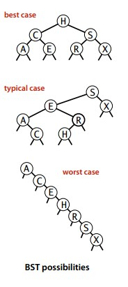

<!-- GFM-TOC -->
* [I. Algorithm Analysis] (Analyzing Algorithm #)
    * [Function conversion] (# function conversion)
    * [Mathematical Model] (#Mathematical Model)
    * [ThreeSum](#threesum)
    * [Magnification Experiment] (#Magnification Experiment)
    * [Note] (#Notes)
* [2. Stack and Queue] (#2 stack and queue)
    * [Stack] (#stack)
    * [Queue] (#Queue)
* [three, union-find] (# three union-find)
    * [quick-find] (#quick-find)
    * [quick-union](#quick-union)
    * [weighted quick-union] (#weighted-quick-union)
    * [Weight quick-union for path compression] (weight-quick-union for # path compression)
    * [comparison of various union-find algorithms] (comparison of various -union-find-algorithms)
* [4, Sort] (#4 Sort)
    * [Select sort] (#Select sort)
    * [insert sort] (#insert sort)
    * [Hill Sort] (#Hill Sort)
    * [Merge sort] (# merge sort)
    * [Quick Sort] (#Quick Sort)
    * [priority queue] (# priority queue)
    * [Application] (#Application)
* [5. Find] (#5 search)
    * [symbol table] (# symbol table)
    * [Binary Search Tree] (# Binary Search Tree)
    * [2-3 Search Tree] (#2-3 - Search Tree)
    * [Red and Black Binary Search Tree] (# Red and Black Binary Search Tree)
    * [Hash table] (# hash table)
    * [Application] (#Application)
<!-- GFM-TOC -->


# I. Algorithm Analysis

## function conversion

The exponential function can be converted to a linear function so that it is more intuitive to display on the function image. E.g

<div align="center"></div> <br>

You can take the logarithms at both ends to get:

<div align="center"></div> <br>

<div align="center">  </div><br>

## mathematical model

### 1. Approximate

Use \~f(N) to denote all functions that tend to approach 1 as the result of increasing N by f(N), for example N<sup>3</sup>/6-N<sup>2< /sup>/2+N/3 \~ N<sup>3</sup>/6.

<div align="center">  </div><br>

### 2. Magnitude of growth

The order of magnitude of growth isolates the algorithm from its implementation. An algorithm has a growth order of N<sup>3</sup> and it is implemented in Java and is independent of whether it runs on a specific computer.

<div align="center">  </div><br>

### 3. The inner loop

The most frequently executed instructions determine the total time the program is executed. These instructions are called the inner loop of the program.

### 4. Cost Model

Using a cost model to evaluate an algorithm, such as the number of visits to an array is a cost model.

## ThreeSum

ThreeSum is used to count the sum of the triples in an array.

```java
Public class ThreeSum {
    Public static int count(int[] a) {
        Int N = a.length;
        Int cnt = 0;
        For (int i = 0; i < N; i++) {
            For (int j = i + 1; j < N; j++) {
                For (int k = j + 1; k < N; k++) {
                    If (a[i] + a[j] + a[k] == 0) {
                        Cnt++;
                    }
                }
            }
        }
        Return cnt;
    }
}
```

The inner loop of the algorithm is an `if (a[i] + a[j] + a[k] == 0)` statement. The total number of executions is N(N-1)(N-2) = N<sup >3</sup>/6 - N<sup>2</sup>/2 + N/3, so its approximate number of executions is \~N<sup>3</sup>/6, and the growth order is N <sup>3</sup>.

<font size=4> **Improvement** </font></br>

By sorting the array first, the two elements are summed and the binary search method is used to find if there is an inverse of the sum. If so, it means that the sum of the triples is 0.

This method can reduce the ThreeSum algorithm's growth order to N<sup>2</sup>logN.

```java
Public class ThreeSumFast {
    Public static int count(int[] a) {
        Arrays.sort(a);
        Int N = a.length;
        Int cnt = 0;
        For (int i = 0; i < N; i++) {
            For (int j = i + 1; j < N; j++) {
                // The rank() method returns the index of the element in the array. If the element does not exist, this returns -1.
                // It should be noted that the index here must be greater than j, otherwise the statistics will be repeated.
                If (BinarySearch.rank(-a[i] - a[j], a) > j) {
                    Cnt++;
            }
            }
        }
        Return cnt;
    }
}
```

## magnification experiment

If T(N) \~ aN<sup>b</sup>logN, then T(2N)/T(N) \~ 2<sup>b</sup>.

For example, for the ThreeSum algorithm of the violent method, the approximate time is \~N<sup>3</sup>/6. Perform the following experiment: Run the algorithm several times, each time you take the N value twice the previous one, count the time of each execution, and count the ratio between the current run time and the previous run time, and get the following results:

<div align="center">  </div><br>

We can see that T(2N)/T(N)\~2<sup>3</sup>, so we can determine T(N) \~ aN<sup>2</sup>logN.

## Precautions

### 1. Large constant

In the approximation, if the constant coefficient of the low-order term is large, the approximate result is erroneous.

### 2. Cache

Computer systems use caching techniques to organize memory. Accessing an array of adjacent elements is much faster than accessing non-adjacent elements.

### 3. Guarantee for worst-case performance

Software in nuclear reactors, pacemakers, or brake controllers, the worst-case performance is very important.

### 4. Randomization algorithm

By disorganizing the input, the algorithm's dependence on the input is removed.

### 5. Evening analysis

Divide the total cost of all operations by the total number of operations to spread costs equally. For example, an N consecutive push() call to an empty stack needs to access the elements of the array as N+4+8+16+...+2N=5N-4 (N is to write the elements to the array, the rest are When the array size is adjusted, the number of accesses to the array required for each operation is constant.

#2. Stacks and Queues

## stack

First-in-last-out(FILO)

<div align="center">  </div><br>

<font size=4> **1. Array implementation** </font></br>

```java
Public class ResizeArrayStack<Item> implements Iterable<Item> {
    Private Item[] a = (Item[]) new Object[1];
    Private int N = 0;

    Public void push(Item item) {
        If (N >= a.length) {
            Resize(2 * a.length);
        }
        a[N++] = item;
    }

    Public Item pop() {
        Item item = a[--N];
        If (N <= a.length / 4) {
            Resize(a.length / 2);
        }
        Return item;
    }

    // Resize the array to make the stack scalable
    Private void resize(int size) {
        Item[] tmp = (Item[]) new Object[size];
        For (int i = 0; i < N; i++) {
            Tmp[i] = a[i];
        }
        a = tmp;
    }

    Public boolean isEmpty() {
        Return N == 0;
    }

    Public int size() {
        Return N;
    }

    @Override
    Public Iterator<Item> iterator() {
        // An iterator that needs to return a reversed traversal
        Return new ReverseArrayIterator();
    }

    Private class ReverseArrayIterator implements Iterator<Item> {
        Private int i = N;

        @Override
        Public boolean hasNext() {
            Return i > 0;
        }

        @Override
        Public Item next() {
            Return a[--i];
        }
    }
}
```

The above implementation uses generics. Java cannot directly create generic arrays. It can only be created using transformations.

```java
Item[] arr = (Item[]) new Object[N];
```

<font size=4> **2. List Implementation** </font></br>

Need to use the head of the linked list to achieve, because the last element of the head inserted into the stack at the beginning of the list, its next pointer points to the previous push into the stack of elements, in the pop-up element so that you can press the previous one The elements of the stack are called stack top elements.

```java
Public class Stack<Item> {

    Private Node top = null;
    Private int N = 0;

    Private class Node {
        Item item;
        Node next;
    }

    Public boolean isEmpty() {
        Return N == 0;
    }

    Public int size() {
        Return N;
    }

    Public void push(Item item) {
        Node newTop = new Node();
        newTop.item = item;
        newTop.next = top;
        Top = newTop;
        N++;
    }

    Public Item pop() {
        Item item = top.item;
        Top = top.next;
        N--;
        Return item;
    }
}
```
## Queue

First-in-first-out(FIFO)

<div align="center">  </div><br>

The following is a list of the queue implementation, need to maintain the first and last node pointers, respectively, pointing to the head and tail.

Here we need to consider which pointer to the list node and which pointer to the tail node of the list. Because the dequeue operation needs to make the next element of the first element of the team to be the head of the team, it needs to easily obtain the next element, and the next pointer of the head node of the linked list points to the next element, so let the head pointer be the first pointer to the beginning of the linked list.

```java
Public class Queue<Item> {
    Private Node first;
    Private Node last;
    Int N = 0;
    Private class Node{
        Item item;
        Node next;
    }

    Public boolean isEmpty(){
        Return N == 0;
    }

    Public int size(){
        Return N;
    }

    // Into the queue
    Public void enqueue(Item item){
        Node newNode = new Node();
        newNode.item = item;
        newNode.next = null;
        If(isEmpty()){
            Last = newNode;
            First = newNode;
        } else{
            Last.next = newNode;
            Last = newNode;
        }
        N++;
    }

    // Out of the queue
    Public Item dequeue(){
        Node node = first;
        First = first.next;
        N--;
        Return node.item;
    }
}
```

# three, union-find

<font size=4> **Overview** </font> <br>

To solve dynamic connectivity problems, two points can be dynamically connected and whether two points are connected.

<div align="center">  </div><br>

<font size=4> **API** </font> <br>

<div align="center">  </div><br>

<font size=4> **Basic Data Structure** </font> <br>

```java
Public class UF {
    // Use id array to save point connectivity information
    Private int[] id;

    Public UF(int N) {
        Id = new int[N];
        For (int i = 0; i < N; i++) {
            Id[i] = i;
        }
    }

    Public boolean connected(int p, int q) {
        Return find(p) == find(q);
    }
}
```

## quick-find

Ensure that the id values ​​of all contacts in the same connected component are equal.

This method can quickly obtain the id value of a contact, and determine whether the two contacts are connected, but the operating cost of union is very high. It is necessary to modify the value of all nodes in one connected component to the value of another node. Id value.

```java
    Public int find(int p) {
        Return id[p];
    }
    Public void union(int p, int q) {
        Int pID = find(p);
        Int qID = find(q);

        If (pID == qID) return;
        For (int i = 0; i < id.length; i++) {
            If (id[i] == pID) id[i] = qID;
        }
    }
```

## quick-union

In union, only the id value of the contact point to another contact id value, do not use id directly to store the connected component. This forms an inverted tree structure with the root node pointing to itself. When searching for a connected component to which a node belongs, it is always up until the root node and the id value of the root node is used as the id value of the connected component.

<div align="center">  </div><br>

```java
    Public int find(int p) {
        While (p != id[p]) p = id[p];
        Return p;
    }

    Public void union(int p, int q) {
        Int pRoot = find(p);
        Int qRoot = find(q);
        If (pRoot == qRoot) return;
        Id[pRoot] = qRoot;
    }
```

This method can perform union operations quickly, but the find operation is proportional to the height of the tree. In the worst case, the height of the tree is the number of contacts.

<div align="center">  </div><br>

## Weighted quick-union

In order to solve the problem that the quick-union tree is usually very high, the weighted quick-union will make the smaller tree join the larger tree when the union operation.

Theoretical studies have shown that the tree depth constructed by the weighted quick-union algorithm does not exceed logN at most.

<div align="center">  </div><br>

```java
Public class WeightedQuickUnionUF {
    Private int[] id;
    // Save node number information
    Private int[] sz;

    Public WeightedQuickUnionUF(int N) {
        Id = new int[N];
        Sz = new int[N];
        For (int i = 0; i < N; i++) {
            Id[i] = i;
            Sz[i] = 1;
        }
    }

    Public boolean connected(int p, int q) {
        Return find(p) == find(q);
    }

    Public int find(int p) {
        While (p != id[p]) p = id[p];
        Return p;
    }

    Public void union(int p, int q) {
        Int i = find(p);
        Int j = find(q);
        If (i == j) return;
        If (sz[i] < sz[j]) {
            Id[i] = j;
            Sz[j] += sz[i];
        } Else {
            Id[j] = i;
            Sz[i] += sz[j];
        }
    }
}
```

## Weighted quick-union of path compression

While checking the nodes and linking them directly to the root node, you only need to add a loop to find.

## Comparison of various union-find algorithms

<div align="center">  </div><br>

#4. Sorting

<font size=4> **Convention** </font><br>

The elements to be sorted need to implement Java's Comparable interface, which has a compareTo() method.

When studying the cost model of the sorting algorithm, the number of comparisons and exchanges is calculated.

Use the helper functions less() and exch() for comparisons and exchanges to make the code more readable and portable.

```java
Private boolean less(Comparable v, Comparable w){
    Return v.compareTo(w) < 0;
}

Private void exch(Comparable[] a, int i, int j){
    Comparable t = a[i];
    a[i] = a[j];
    a[j] = t;
}
```

## Select sort

Find the smallest element in the array and swap it with the first element of the array. Find the smallest element from the remaining elements and swap it with the second element of the array. Keep doing this until you sort the entire array.

<div align="center">  </div><br>

```java
Public class Selection {
    Public static void sort(Comparable[] a) {
        Int N = a.length;
        For (int i = 0; i < N; i++) {
            Int min = i;
            For (int j = i + 1; j < N; j++) {
                If (less(a[j], a[min])) min = j;
            }
            Exch(a, i, min);
        }
    }
}
```

Select sorting requires \~N<sup>2</sup>/2 comparisons and \~N swaps. Its running time is independent of input. This feature makes it require so many comparisons to an already sorted array. Exchange operation.

## Insert sort

The sorting is done from left to right, each time the current element is inserted into the left already sorted array, so that the left array is still ordered after insertion.

<div align="center">  </div><br>

```java
Public class Insertion {
    Public static void sort(Comparable[] a) {
        Int N = a.length;
        For (int i = 1; i < N; i++) {
            f
Or (int j = i; j > 0 && less(a[j], a[j - 1]); j--) {
                Exch(a, j, j - 1);
            }
        }
    }
}
```

The complexity of insert sorting depends on the initial order of the array. If the array is already partially ordered, the insert sort will be very fast. Insertion sorting on average requires \~N<sup>2</sup>/4 comparisons and \~N<sup>2</sup>/4 swaps. In the worst case, it requires \~N<sup>2. </sup>/2 comparisons and \~N<sup>2</sup>/2 swaps. The worst case is that the arrays are reversed; in the best case, N-1 comparisons and 0 swaps are required. The best situation is that the array is already in order.

Insert sorting is particularly efficient for partially ordered arrays and small-scale arrays.

<font size=3> **Select sort and insert sort comparison </font> </br>

For an array of randomly ordered non-repeating primary keys, the runtime for insert sorting and select sorting is squared, and the ratio between the two is a smaller constant.

## Hill Sort

For large-scale arrays, insert sorting is slow because it can only swap adjacent elements. If you want to move elements from one end to the other, many operations are required.

The Hill sorting is intended to improve this limitation of insert sorting, which makes the elements move to the correct position faster by swapping non-adjacent elements.

The Hill sort uses an insertion order to sort the sequence of intervals h. If h is large, the elements can be moved very far. By reducing h continuously and finally making h=1, the entire array can be ordered.

<div align="center">  </div><br>

```java
Public class Shell {
    Public static void sort(Comparable[] a) {
        Int N = a.length;
        Int h = 1;
        While (h < N / 3) {
            h = 3 * h + 1; // 1, 4, 13, 40, ...
        }
        While (h >= 1) {
            For (int i = h; i < N; i++) {
                For (int j = i; j >= h && less(a[j], a[j - h]); j -= h) {
                    Exch(a, j, j - h);
                }
            }
            h = h / 3;
        }
    }
}
```

The running time of the Hill sort does not reach the square level, and the number of comparisons required by the Hill sequence using the ascending sequence 1, 4, 13, 40, ... will not exceed several times the N times the length of the ascending sequence. The advanced sorting algorithm described later will only be about three times faster than the Hill sorting.

## merge sort

The idea of ​​merging and sorting is to divide the array into two parts, sort them separately, and merge them together.

<div align="center">  </div><br>

### 1. How to merge

The merge method merges the two sorted parts of the array into one.

```java
Public class MergeSort {
    Private static Comparable[] aux;

    Private static void merge(Comparable[] a, int lo, int mid, int hi) {
        Int i = lo, j = mid + 1;

        For (int k = lo; k <= hi; k++) {
            Aux[k] = a[k]; // copy data to auxiliary array
        }

        For (int k = lo; k <= hi; k++) {
            If (i > mid) a[k] = aux[j++];
            Else if (j > hi) a[k] = aux[i++];
            Else if (aux[i].compareTo(a[j]) < 0) a[k] = aux[i++]; // First perform this step to ensure stability
            Else a[k] = aux[j++];
        }
    }
}
```

### 2. Top-down merge sort

```java
Public static void sort(Comparable[] a) {
    Aux = new Comparable[a.length];
    Sort(a, 0, a.length - 1);
}

Private static void sort(Comparable[] a, int lo, int hi) {
    If (hi <= lo) return;
    Int mid = lo + (hi - lo) / 2;
    Sort(a, lo, mid);
    Sort(a, mid + 1, hi);
    Merge(a, lo, mid, hi);
}
```

<div align="center">  </div><br>

<div align="center">  </div><br>

Because each time the problem is divided into two sub-problems, and the half-division algorithm is generally O(Nlog<sub>N</sub>), the time complexity of the merge sort method is also O ( Nlog<sub>N</sub>).

Because the recursive operation of small arrays is too frequent, using insert sorting to handle small arrays will result in higher performance.

### 3. Bottom up merge sort

We first merge those mini-arrays and then merge the resulting sub-arrays.

<div align="center">  </div><br>

```java
Public static void busort(Comparable[] a) {
    Int N = a.length;
    Aux = new Comparable[N];
    For (int sz = 1; sz < N; sz += sz) {
        For (int lo = 0; lo < N - sz; lo += sz + sz) {
            Merge(a, lo, lo + sz - 1, Math.min(lo + sz + sz - 1, N - 1));
        }
    }
}
```

## quick sort

### 1. Basic algorithm

Merge sorting divides the array into two sub-arrays and sorts them, and sorts the ordered sub-arrays to make the entire array sort. Quick sorting divides the array into two sub-arrays by a splitting element, and the left sub-array is less than or equal to the splitting element. The subarray is greater than or equal to the split element. Sorting the two subarrays also sorts the entire array.

<div align="center">  </div><br>

```java
Public class QuickSort {
    Public static void sort(Comparable[] a) {
        Shuffle(a);
        Sort(a, 0, a.length - 1);
    }

    Private static void sort(Comparable[] a, int lo, int hi) {
        If (hi <= lo) return;
        Int j = partition(a, lo, hi);
        Sort(a, lo, j - 1);
        Sort(a, j + 1, hi);
    }
}
```

### 2. Slicing

Take a[lo] as the slice element, then scan from the left end of the array to the right until the first element is found to be greater than or equal to it, then scan from the right end of the array to the left to find the first element that is less than or equal to it, swap the two Elements, and continue to continue this process, you can ensure that the left hand of the left side of the element is not greater than the splitting element, the right side of the right hand pointer j is not smaller than the splitting element. When the two pointers meet, the split element a[lo] is swapped with the rightmost element a[j] of the left subarray and returns j.

<div align="center">  </div><br>

```java
Private static int partition(Comparable[] a, int lo, int hi) {
    Int i = lo, j = hi + 1;
    Comparable v = a[lo];
    While (true) {
        While (less(a[++i], v)) if (i == hi) break;
        While (less(v, a[--j])) if (j == lo) break;
        If (i >= j) break;
        Exch(a, i, j);
    }
    Exch(a, lo, j);
    Return j;
}
```

### 3. Performance Analysis

Quick sorts are in-place sorts and do not require an auxiliary array, but recursive calls require a secondary stack.

The best case for quick sorting is to just split the array half each time, so that the number of recursive calls is the least. The number of comparisons in this case is C<sub>N</sub>=2C<N>N/2</sub>+N, ie, the complexity is O(Nlog<N>N).

In the worst case, the first time it is divided from the smallest element, and the second time is divided from the second smallest element, and so on. So in the worst case you need to compare N<sup>2</sup>/2. In order to prevent the array from being initially ordered, random arrays need to be randomly shuffled during quick sorting.

### 4. Algorithm Improvements

#### 4.1 Switch to Insert Sort

Because quick sorting also calls itself in small arrays, insert sorts perform better than quick sorts for small arrays, so you can switch to insert sorting in small arrays.

#### Three samples

The best case is to use the median of the array as the segmentation element each time, but the cost of calculating the median is high. People find it best to take 3 elements and use the centered element as a split element.

#### 4.3 Three-way segmentation

For an array with a large number of repeating elements, the array can be divided into three parts, corresponding to less than, equal to, and greater than the segmentation element.

Three-way splitting quick sorting A random array with only a few different primary keys can be ordered in linear time.

<div align="center">  </div><br>

```java
Public class Quick3Way {
    Public static void sort(Comparable[] a, int lo, int hi) {
        If (hi <= lo) return;
        Int lt = lo, i = lo + 1, gt = hi;
        Comparable v = a[lo];
        While (i <= gt) {
            Int cmp = a[i].compareTo(v);
            If (cmp < 0) exch(a, lt++, i++);
            Else if (cmp > 0) exch(a, i, gt--);
            Else i++;
        }
        Sort(a, lo, lt - 1);
        Sort(a, gt + 1, hi);
    }
}
```

## priority queue

The priority queue is mainly used to handle the largest element.

### 1. Stack

Definition: Each node of a binary tree is greater than or equal to its two child nodes.

The heap can be represented by an array because the heap is a complete binary tree, and a complete binary tree is easily stored in an array. The position of the parent node of position k is k/2, and the positions of its two child nodes are 2k and 2k+1, respectively. Here we do not use the position where the array index is 0, in order to understand the relationship of the nodes more clearly.

<div align="center">  </div><br>

```java
Public class MaxPQ<Key extends Comparable<Key> {
    Private Key[] pq;
    Private int N = 0;

    Public MaxPQ(int maxN) {
        Pq = (Key[]) new Comparable[maxN + 1];
    }

    Public boolean isEmpty() {
        Return N == 0;
    }

    Public int size() {
        Return N;
    }

    Private boolean less(int i, int j) {
        Return pq[i].compareTo(pq[j]) < 0;
    }

    Private void exch(int i, int j) {
        Key t = pq[i];
        Pq[i] = pq[j];
        Pq[j] = t;
    }
}
```

### 2. Floating and sinking

In a heap, when a node is larger than a parent node, the two nodes need to be exchanged. The exchange may also be larger than its new parent, so it requires constant comparisons and exchanges. Call this operation floating.

```java
Private void swim(int k) {
    While (k > 1 && less(k / 2, k)) {
        Exch(k / 2, k);
        k = k / 2;
    }
}
```

Similarly, when a node is smaller than a child node, it also needs constant downward comparison and exchange operations, and this operation is called sinking. A node has two child nodes and should exchange with the largest of the two child nodes.

```java
Private void sink(int k) {
    While (2 * k <= N) {
        Int j = 2 * k;
        If (j < N && less(j, j + 1)) j++;
        If (!less(k, j)) break;
        Exch(k, j);
        k = j;
    }
}
```

### 3. Insert elements

Place the new element at the end of the array and then float it to the right position.

```java
Public void insert(Key v) {
    Pq[++N] = v;
    Swim(N);
}
```

### 4. Remove the largest element

Remove the largest element from the top of the array, and put the last element of the array to the top, and let this element sink to the right place.

```java
Public Key delMax() {
    Key max = pq[1];
    Exch(1, N--);
    Pq[N + 1] = null;
    Sink(1);
    Return max;
}
```

### 5. Heap sort

Since the heap can easily get the largest element and delete it, doing this operation continuously can get a descending sequence. If you swap the position of the largest element with the last element of the array in the current heap, and do not delete it, you can get a descending sequence from tail to head, which is an ascending sequence in the forward direction. So it's easy to use the heap for sorting, and the heap sort is sort-in-place without taking up extra space.

Heap sorting is divided into two phases. The first phase is to create a heap of unordered arrays; the second phase is to swap the largest element and the last element of the array of the current heap, and to perform sinking operations to maintain the ordered state of the heap.

Unordered arrays The most straightforward way to build a heap is to iterate through the array from left to right and then go up. A more efficient method is to perform the sinking operation from right to left. If two nodes of a node are already in an orderly heap, the sinking operation can make this node an orderly heap of the root node. The leaf node does not need to sink, so the elements of the leaf node can be ignored, so only half of the elements need to be traversed.

<div align="center">  </div><br>

```java
Public static void sort(Comparable[] a){
    Int N = a.length;
    For(int k = N/2; k >= 1; k--){
        Sink(a, k, N);
    }
    While(N > 1){
        Exch(a, 1, N--);
        Sink(a, 1, N);
    }
}
```

### 6. Analysis

The height of a heap is logN, so the complexity of inserting elements in the heap and removing the largest element is logN.

For heap sorting, the complexity is NlogN due to the sinking of N nodes.

An in-place sort of heap sorting does not utilize additional space.

Modern operating systems rarely use heap sorting because it cannot use caches, which means that array elements are rarely compared to adjacent elements.

## Application

### 1. Comparison of sorting algorithms

<div align="center">  </div><br>

The quickest sorting algorithm is the fastest universal sorting algorithm. It has very few internal loops, and it can use caches because it always accesses data sequentially. Its run time is in the order of \~cNlogN, where c is smaller than other linear logarithm-level sorting algorithms. After using three-way slicing, the input of some distributions that may occur in real-world applications can reach a linear level, while other sorting algorithms still require a linear logarithmic time.

### 2. Java Sorting Algorithm Implementation

The main sorting method in the Java System Library is java.util.Arrays.sort() , using three-way sharding for the original data type and merge sorting for the reference type.

### 3. Segmentation-based quick selection algorithm

The fast-ordering partition() method returns an integer j such that a[lo..j-1] is less than or equal to a[j], and a[j+1..hi] is greater than or equal to a[j]. [j] is the jth element of the array.

You can use this feature to find the kth element of an array.

```java
Public static Comparable select(Comparable[] a, int k) {
    Int lo = 0, hi = a.length - 1;
    While (hi > lo) {
        Int j = partion(a, lo, hi);
        If (j == k) return a[k];
        Else if (j > k) hi = j - 1;
        Else lo = j + 1;
    }
    Return a[k];
}
```

The algorithm is linear, because the array is bisected exactly once, then the total number of comparisons is (N+N/2+N/4+..) until the kth element is found, and the sum is obviously less than 2N.

# V. Finding

This chapter uses three classical data structures to implement efficient symbol tables: binary search trees, red-black trees, and hash tables.

## Symbol table

<font size=4> **1. Disordered symbol table ** </font></br>

<div align="center">  </div><br>

<font size=4> **2. Ordered symbol table ** </font></br>

<div align="center">  </div><br>

The keys of an ordered symbol table need to implement the Comparable interface.

Finding cost model: The number of times the key was compared, using the number of visits to the array when no comparison was made.

<font size=4> **3. Binary Finding Implements Ordered Symbol Table ** </font></br>

Use a pair of parallel arrays, one store key and one store value.

You need to create an array of Comparable objects of type Key and an array of Object objects of type Value.

The rank() method is crucial. When a key is in a table, it knows where the key is; when the key is not in the table, it can also know where to insert the new key.

Complexity: The binary search requires at most logN + 1 comparisons, and the time required for the search operation using the binary search to achieve the symbol table is at most logarithmic. But the insert operation needs to move the array elements, which is a linear level.

```java
Public class BinarySearchST<Key extends Comparable<Key>, Value> {
    Private Key[] keys;
    Private
Value[] values;
    Private int N;

    Public BinarySearchST(int capacity) {
        Keys = (Key[]) new Comparable[capacity];
        Values ​​= (Value[]) new Object[capacity];
    }

    Public int size() {
        Return N;
    }

    Public Value get(Key key) {
        Int i = rank(key);
        If (i < N && keys[i].compareTo(key) == 0) {
            Return values[i];
        }
        Return null;
    }

    Public int rank(Key key) {
        Int lo = 0, hi = N - 1;
        While (lo <= hi) {
            Int mid = lo + (hi - lo) / 2;
            Int cmp = key.compareTo(keys[mid]);
            If (cmp == 0) return mid;
            Else if (cmp < 0) hi = mid - 1;
            Else lo = mid + 1;
        }
        Return lo;
    }

    Public void put(Key key, Value value) {
        Int i = rank(key);
        If (i < N && keys[i].compareTo(key) == 0) {
            Values[i] = value;
            Return;
        }
        For (int j = N; j > i; j--) {
            Keys[j] = keys[j - 1];
            Values[j] = values[j - 1];
        }
        Keys[i] = key;
        Values[i] = value;
        N++;
    }

    Public Key ceiling(Key key){
        Int i = rank(key);
        Return keys[i];
    }
}
```

## Binary Search Tree

**Binary tree** is defined as an empty link, or a node with two left and right links, each pointing to a sub-binary tree.

**The binary search tree ** (BST) is a binary tree, and each node's key is greater than the key of any node in its left subtree but less than that of any node in the right subtree.

<div align="center">  </div><br>

The lookup operation of a binary search tree will reduce the interval by half each iteration, similar to a binary search.

```java
Public class BST<Key extends Comparable<Key>, Value> {
    Private Node root;

    Private class Node {
        Private Key key;
        Private Value val;
        Private Node left, right;
        // The total number of nodes in the subtree rooted at this node
        Private int N;

        Public Node(Key key, Value val, int N) {
            This.key = key;
            This.val = val;
            this.N = N;
        }
    }

    Public int size() {
        Return size(root);
    }

    Private int size(Node x) {
        If (x == null) return 0;
        Return x.N;
    }
}
```

### 1. get()

If the tree is empty, then the search misses; if the key being searched for is equal to the root node's key, a hit is found, otherwise it is recursively searched in the subtree: if the searched key is smaller, it is looked up in the left subtree. The larger is found in the right subtree.

```java
Public Value get(Key key) {
    Return get(root, key);
}
Private Value get(Node x, Key key) {
    If (x == null) return null;
    Int cmp = key.compareTo(x.key);
    If (cmp == 0) return x.val;
    Else if (cmp < 0) return get(x.left, key);
    Else return get(x.right, key);
}
```

### 2. put()

When the inserted key does not exist in the tree, a new node needs to be created, and the link of the upper node is updated so that the node is correctly linked to the tree.

```java
Public void put(Key key, Value val) {
    Root = put(root, key, val);
}
Private Node put(Node x, Key key, Value val) {
    If (x == null) return new Node(key, val, 1);
    Int cmp = key.compareTo(x.key);
    If (cmp == 0) x.val = val;
    Else if (cmp < 0) x.left = put(x.left, key, val);
    Else x.right = put(x.right, key, val);
    x.N = size(x.left) + size(x.right) + 1;
    Return x;
}
```

### 3. Analysis

The algorithm runtime of the binary search tree depends on the shape of the tree, which in turn depends on the order in which the keys were inserted. In the best case, the tree is completely balanced, and each empty link and the root node are logN. In the worst case, the height of the tree is N.

<div align="center">  </div><br>

Complexity: Both find and insert operations are logarithmic.

### 4. floor()

If the key is less than the key of the root node, then the largest key node less than or equal to the key must be in the left subtree; if the key is greater than the key of the root node, only if the node in the right subtree of the root node is less than or equal to the key, less than or equal to the key The largest key node is in the right subtree, otherwise the root node is the largest key node less than or equal to key.

```java
Public Key floor(Key key) {
    Node x = floor(root, key);
    If (x == null) return null;
    Return x.key;
}
Private Node floor(Node x, Key key) {
    If (x == null) return null;
    Int cmp = key.compareTo(x.key);
    If (cmp == 0) return x;
    If (cmp < 0) return floor(x.left, key);
    Node t = floor(x.right, key);
    If (t != null) {
        Return t;
    } Else {
        Return x;
    }
}
```

### 5. rank()

```java
Public int rank(Key key) {
    Return rank(key, root);
}
Private int rank(Key key, Node x) {
    If (x == null) return 0;
    Int cmp = key.compareTo(x.key);
    If (cmp == 0) return size(x.left);
    Else if (cmp < 0) return rank(key, x.left);
    Else return 1 + size(x.left) + rank(key, x.right);
}
```

### 6. min()

```java
Private Node min(Node x) {
    If (x.left == null) return x;
    Return min(x.left);
}
```

### 7. deleteMin()

Let the link to the smallest node point to the right subtree of the smallest node.

<div align="center">  </div><br>

```java
Public void deleteMin() {
    Root = deleteMin(root);
}
Public Node deleteMin(Node x) {
    If (x.left == null) return x.right;
    X.left = deleteMin(x.left);
    x.N = size(x.left) + size(x.right) + 1;
    Return x;
}
```

### 8. delete()

If the node to be deleted has only one subtree, then only the link that points to the node to be deleted needs to point to the only subtree; otherwise, let the smallest node of the right subtree replace the node.

<div align="center">  </div><br>

```java
Public void delete(Key key) {
    Root = delete(root, key);
}
Private Node delete(Node x, Key key) {
    If (x == null) return null;
    Int cmp = key.compareTo(x.key);
    If (cmp < 0) x.left = delete(x.left, key);
    Else if (cmp > 0) x.right = delete(x.right, key);
    Else {
        If (x.right == null) return x.left;
        If (x.left == null) return x.right;
        Node t = x;
        x = min(t.right);
        X.right = deleteMin(t.right);
        X.left = t.left;
    }
    x.N = size(x.left) + size(x.right) + 1;
    Return x;
}
```

### 9. keys()

The result of ordered traversal in the binary search tree is the characteristic of the ordered sequence.

```java
Public Iterable<Key> keys(Key lo, Key hi) {
    Queue<Key> queue = new LinkedList<>();
    Keys(root, queue, lo, hi);
    Return queue;
}
Private void keys(Node x, Queue<Key> queue, Key lo, Key hi) {
    If (x == null) return;
    Int cmpLo = lo.compareTo(x.key);
    Int cmpHi = hi.compareTo(x.key);
    If (cmpLo < 0) keys(x.left, queue, lo, hi);
    If (cmpLo <= 0 && cmpHi >= 0) queue.add(x.key);
    If (cmpHi > 0) keys(x.right, queue, lo, hi);
}
```

### 10. Performance Analysis

Complexity: Binary Search Tree The time required for all operations in the worst case is proportional to the height of the tree.

## 2-3 Find Tree

<div align="center">  </div><br>

A perfectly balanced 2-3 lookup tree should have the same distance from all empty links to the root node.

### 1. Insert operation

When a temporary 4-node is generated after insertion, the 4-node needs to be split into 3 2-nodes, and the 2-nodes in the middle are moved to the upper-level nodes. If the move-up operation continues to generate a temporary 4-node, the split-up move is continued until there is no temporary 4-node.

<div align="center">  </div><br>

### 2. Nature

The transformations of the 2-3 lookup tree insertion operations are local, and there is no need to modify or check other parts of the tree except the related nodes and links. These local transformations do not affect the global ordering and balance of the tree.

2-3 Finding Tree's Finding and Inserting Operations Complexity and Inserting Order Are Independent** In the worst case, the search and insert operations must have no more than logN nodes and a 2-3 lookup with 1 billion nodes. The tree can only perform up to 30 nodes to perform arbitrary search and insert operations.

## Red and Black Binary Search Tree

The 2-3 search tree requires 2- and 3-nodes, and the red-black tree uses red links to implement 3-nodes. If the color of the link to a node is red, then this node and the upper node represent a 3-node, while black is the normal link.

<div align="center">  </div><br>

The red-black tree has the following properties:

1. Red links are left links;
2. The perfect black balance, that is, the same number of black links on any path that is free to link to the root node.

Red and black trees can draw red links.

<div align="center">  </div><br>

```java
Public class RedBlackBST<Key extends Comparable<Key>, Value> {
    Private Node root;
    Private static final boolean RED = true;
    Private static final boolean BLACK = false;

    Private class Node {
        Key key;
        Value val;
        Node left, right;
        Int N;
        Boolean color;

        Node(Key key, Value val, int n, boolean color) {
            This.key = key;
            This.val = val;
            N = n;
            This.color = color;
        }
    }

    Private boolean isRed(Node x) {
        If (x == null) return false;
        Return x.color == RED;
    }
}
```

### 1. Rotate left

Because the legal red links are left links, if the right links are red links, then the left rotation operation is needed.

<div align="center">  </div><br>

<div align="center">  </div><br>

```java
Public Node rotateLeft(Node h) {
    Node x = h.right;
    H.right = x.left;
    X.left = h;
    X.color = h.color;
    H.color = RED;
    x.N = h.N;
    h.N = 1 + size(h.left) + size(h.right);
    Return x;
}
```

### 2. Rotate Right

The right rotation is to convert two consecutive left red links, which will be discussed later in the insert process.

<div align="center">  </div><br>

<div align="center">  </div><br>

```java
Public Node rotateRight(Node h) {
    Node x = h.left;
    H.left = x.right;
    X.color = h.color;
    H.color = RED;
    x.N = h.N;
    h.N = 1 + size(h.left) + size(h.right);
    Return x;
}
```

### 3. Color Conversion

A 4-node node appears as a node in the red-black tree. The left and right children are all red. The split 4-node needs to change the color of the parent node from black to red, and from the perspective of the 2-3 tree, it needs to move the middle node to the upper node.

<div align="center">  </div><br>

<div align="center">  </div><br>

```java
Void flipColors(Node h){
    H.color = RED;
    H.left.color = BLACK;
    H.right.color = BLACK;
}
```

### 4. Insert

First insert a node into the correct location as a binary search tree, and then perform the following color operations:

- If the right child is red and the left child is black, rotate left;
- If the left child is red and its left child is also red, rotate right;
- If the left and right child nodes are all red, perform color conversion.

<div align="center">  </div><br>

```java
Public void put(Key key, Value val) {
    Root = put(root, key, val);
    Root.color = BLACK;
}

Private Node put(Node x, Key key, Value val) {
    If (x == null) return new Node(key, val, 1, RED);
    Int cmp = key.compareTo(x.key);
    If (cmp == 0) x.val = val;
    Else if (cmp < 0) x.left = put(x.left, key, val);
    Else x.right = put(x.right, key, val);

    If (isRed(x.right) && !isRed(x.left)) x = rotateLeft(x);
    If (isRed(x.left) && isRed(x.left.left)) x = rotateRight(x);
    If (isRed(x.left) && isRed(x.right)) flipColors(x);

    x.N = size(x.left) + size(x.right) + 1;
    Return x;
}
```

You can see that the insert operation is similar to the insert operation of the binary search tree, except that the rotation and color conversion operations are added at the end.

The root node must be black, because the root node does not have an upper node, and there is no left link of the upper node to the root node. flipColors() may change the color of the root node to red, and the height of the tree's black link increases whenever the root node changes from red to black.

### 5. Delete the minimum key

If the minimum key is in a 2-node, deleting the key will leave an empty link, breaking the balance, so make sure that the minimum key is not in the 2-node. There are two ways to convert 2-nodes into 3-nodes or 4-nodes. One is to get a key from the upper node, and the other is to get a key to the sibling node. If the upper node is a 2-node, there is no way to get the key from the upper node, so make sure that all nodes on the deleted path are not 2-nodes. In the process of deleting downwards, ensure that one of the following occurs:

1. If the current node's left child is not a 2-node, complete;
2. If the current node's left child is a 2-node and its sibling is not a 2-node, take a key from the sibling node.
3. If the left child of the current node and its siblings are both 2-nodes, merge the left child, the smallest key in the parent, and the nearest sibling node into a 4-node.

<div align="center">  </div><br>

Finally get a 3-node or 4-node with the smallest key and remove it directly from it. Then reassemble all temporary 4-nodes from scratch.

<div align="center">  </div><br>

### 6. Analysis

A red-black tree of size N will not exceed 2 logN in height. In the worst case scenario, the left-most path node in the corresponding 2-3 tree is all 3-nodes and the rest are 2-nodes.

Most red-black trees require logarithmic steps for most operations.

## hash table

A hash table is similar to an array. You can think of the hash value of a hash table as the index value of an array. Accessing a hash table is as fast as accessing an array element. It can find and insert symbol tables within a constant time.

Since the size relationship of the keys cannot be known by the hash value, the hash table cannot achieve an orderly operation.

### 1. Hash function

For a hash table of size M, the hash function can convert any key to a positive integer in [0, M-1], which is the hash value.

There is a conflict in the hash table, that is, two different keys may have the same hash value.

The hash function should satisfy the following three conditions:

1. Consistency: equal keys should have equal hash values, and equality of two keys means that the value returned by calling equals() is equal.
2. Efficient: The calculation should be simple, if necessary, the hash value can be cached and returned directly when the hash function is called.
3. Uniformity: The hash value of all keys should be evenly distributed between [0, M-1]. This condition is critical and directly affects the performance of the hash table.

The dive leftover method can hash integers to between [0, M-1],
For a positive integer k, calculating k%M can result in a hash value between [0, M-1]. Note M must be a prime number, otherwise all the information contained by the key cannot be utilized. For example, if M is 10<sup>k</sup>, only the last k bits of the key can be used.

For other numbers, you can convert it to an integer and then use the remainder remainder method. For example, floating point numbers can be represented in binary form and then use the binary form of integer values ​​to perform the remainder remainder method.

For a multi-part combination of keys, each part needs to calculate the hash value, and at the end of the merge it needs to make each part of the hash value equally important. You can think of this key as an R-ary integer. Each part of the key has a different weight.

For example, a string hash function is implemented as follows

```java
Int hash = 0;
For(int i = 0; i < s.length(); i++)
    Hash = (R * hash + s.charAt(i)) % M;
```

For another example, the hash function of a custom class that has multiple members is as follows

```java
Int hash = (((day * R + month) % M) * R + year) % M;
```

The value of R is not very important, usually taken as 31.

The hashCode() in Java implements the hash function, but by default uses the memory address value of the object. When using the hashCode() function, it should be used in conjunction with the remainder remainder method. Because the memory address is a 32-bit integer, we only need a 31-bit non-negative integer, so the sign-off bit should be masked before using the remainder remainder method.

```java
Int hash = (x.hashCode() & 0x7fffffff) % M;
```

When you use the built-in hash table such as Java's own HashMap, you only need to implement the hashCode() function of the Key type. Java stipulates that hashCode() can evenly distribute keys over all 32-bit integers. Java's hashCode() of objects such as String, Integer, etc. can do this. The following shows how custom types implement hashCode().

```java
Public class Transaction{
    Private final String who;
    Private final Date when;
    Private final double amount;

    Public int hashCode(){
        Int hash = 17;
        Hash = 31 * hash + who.hashCode();
        Hash = 31 * hash + when.hashCode();
        Hash = 31 * hash + ((Double) amount).hashCode();
        Return hash;
    }
}
```

### 2. Hash table based hash table

The zipper method uses a linked list to store keys with the same hash value to resolve conflicts. At this point, the search needs to be divided into two steps. First, look up the linked list of the Key, and then search sequentially in the linked list.

<div align="center">  </div><br>

For N keys, M lists (N > M), if the hash function satisfies the condition of homogeneity, the size of each list tends to N/M, so the number of comparisons required for missed find and insert operations is \~N/M.

### 3. A hash table based on linear detection

Linear detection uses gaps to resolve conflicts. When a collision occurs, a gap is detected forward to store the conflicting key. Using thread detection, the size of the array M should be greater than the number of keys N (M>N).

<div align="center">  </div><br>

```java
Public class LinearProbingHashST<Key, Value> {
    Private int N;
    Private int M = 16;
    Private Key[] keys;
    Private Value[] vals;

    Public LinearProbingHashST() {
        Init();
    }

    Public LinearProbingHashST(int M) {
        this.M = M;
        Init();
    }

    Private void init() {
        Keys = (Key[]) new Object[M];
        Vals = (Value[]) new Object[M];
    }

    Private int hash(Key key) {
        Return (key.hashCode() & 0x7fffffff) % M;
    }
}
```

#### 3.1 Find

```java
Public Value get(Key key) {
    For (int i = hash(key); keys[i] != null; i = (i + 1) % M) {
        If (keys[i].equals(key)) {
            Return vals[i];
        }
    }
    Return null;
}
```

#### 3.2 Insert

```java
Public void put(Key key, Value val) {
    Int i;
    For (i = hash(key); keys[i] != null; i = (i + 1) % M) {
        If (keys[i].equals(key)) {
            Vals[i] = val;
            Return;
        }
    }
    Keys[i] = key;
    Vals[i] = val;
    N++;
    Resize();
}
```

#### 3.3 Delete

The delete operation should reinsert all adjacent key values ​​to the hash table.

```java
Public void delete(Key key) {
    If (!contains(key)) return;
    Int i = hash(key);
    While (!key.equals(keys[i])) {
        i = (i + 1) % M;
    }
    Keys[i] = null;
    Vals[i] = null;
    i = (i + 1) % M;
    While (keys[i] != null) {
        Key keyToRedo = keys[i];
        Value valToRedo = vals[i];
        Keys[i] = null;
        Vals[i] = null;
        N--;
        Put(keyToRedo, valToRedo);
        i = (i + 1) % M;
    }
    N--;
    Resize();
}
```

#### 3.4 Adjusting the Array Size

The cost of linear detection depends on the length of consecutive entries. Consecutive entries are also called clusters. When clusters are long, many probes are also needed to find and insert.

α = N/M, and α is called utilization. Theory has proved that when α is less than 1/2, the expected number of detections is only between 1.5 and 2.5.

<div align="center">  </div><br>

In order to guarantee the performance of the hash table, the size of the array should be adjusted so that α is between [1/4, 1/2].

```java
Private void resize() {
    If (N >= M / 2) resize(2 * M);
    Else if (N <= M / 8) resize (M / 2);
}

Private void resize(int cap) {
    LinearProbingHashST<Key, Value> t = new LinearProbingHashST<>(cap);
    For (int i = 0; i < M; i++) {
        If (keys[i] != null) {
            T.put(keys[i], vals[i]);
        }
    }
    Keys = t.keys;
    Vals = t.vals;
    M = t.M;
}
```

Although every time the array is re-adjusted, each key-value pair needs to be re-inserted into the hash table. However, from the point of view of amortization analysis, the cost required is very small. As can be seen from the figure below, each time the array length doubles, the cumulative average increases by 1 because each key in the table needs to recalculate the hash value, but then the average value decreases.

<div align="center">  </div><br>

## Application

### 1. Comparison of various symbol tables

<div align="center">  </div><br>

Priority should be given to hash tables, and red-black trees are used when ordered operations are required.

### 2. Java Symbol Table Implementation

Java's java.util.TreeMap and java.util.HashMap are symbol table implementations based on the red-black tree and zipper hash tables, respectively.

### 3. Collection Type

In addition to the symbol table, the collection type is often used. It only has no value for the key. You can use the collection type to store a series of keys and then determine if a key is in the collection.

### 4. Sparse vector multiplication

When the vector is a sparse vector, you can use the symbol table to store non-zero indices and values ​​in the vector, so that the multiplication operation only needs to be performed on those non-zero elements.

```java
Import java.util.HashMap;

Public class SparseVector {
    Private HashMap<Integer, Double> hashMap;

    Public SparseVector(double[] vector) {
        hashMap = new HashMap<>();
        For (int i = 0; i < vector.length; i++) {
            If (vector[i] != 0) {
                hashMap.put(i, vector[i]);
            }
        }
    }

    Public double get(int i) {
        Return hashMap.getOrDefault(i, 0.0);
    }

    Public double dot(SparseVector other) {
        Double sum = 0;
        For (int i : hashMap.keySet()) {
            Sum += this.get(i) * other.get(i);
        }
        Return sum;
    }
}
```

