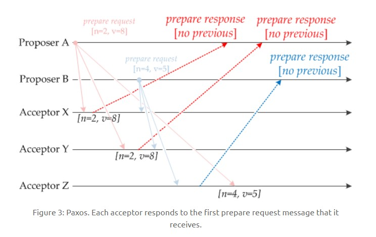
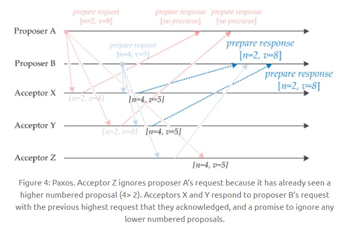
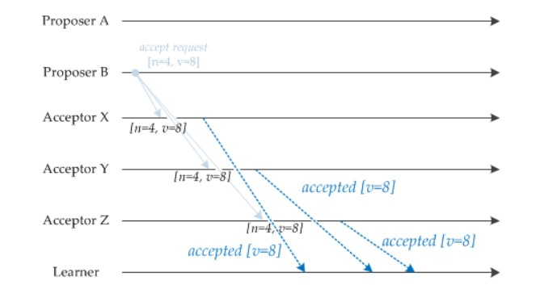
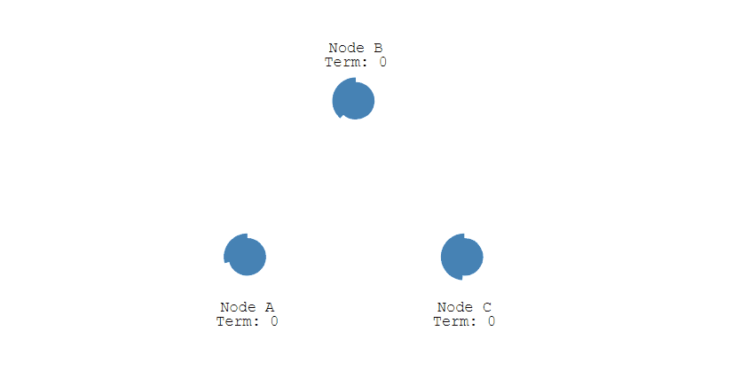
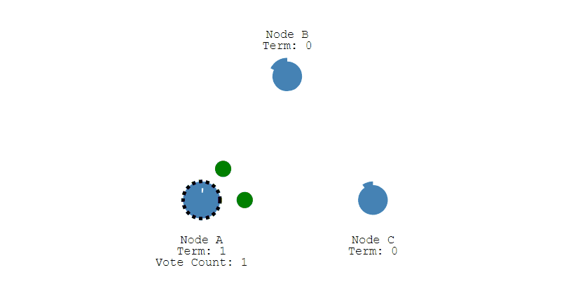
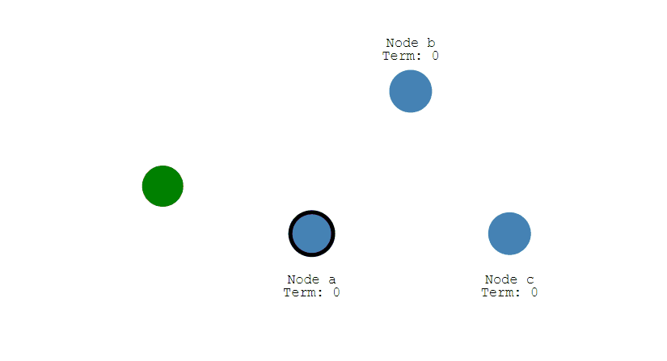

<!-- GFM-TOC -->
* [One-and two-phase submission agreement] (#1 two-phase submission agreement)
* [II. Paxos agreement] (#2 paxos-protocol)
* [three, Raft protocol] (#three raft-protocols)
* [Fourth, Byzantine General] (#Four Byzantine General Issues)
* [V. References] (#5 reference material)
<!-- GFM-TOC -->

# I. Two-phase commit protocol

Two-phase Commit (2PC).

It is guaranteed that a transaction will maintain ACID characteristics across multiple nodes.

There are two types of nodes: Coordinator and Participants. There is only one coordinator and there can be multiple participants.

## working process

1. Preparation stage: The coordinator asks whether the participant's affairs were executed successfully;

2. Submit phase: If the transaction is successful on each participant, the coordinator sends a notification to the participant to commit the transaction; otherwise, the coordinator sends a notification to let the participant roll back the transaction.

  
 

It should be noted that during the preparation phase, the participants performed the transaction but have not yet submitted it. Only after the submission phase receives the notification from the coordinator, it is submitted or rolled back.

## Problems

- The participant failed. Solution: You can set a timeout for the transaction. If a participant is not responding, the transaction is considered to have failed.

- The coordinator has failed. Solution: Synchronize the operation log to the backup coordinator and let the backup coordinator take over the follow-up work.

#2. Paxos Agreement

To achieve a consensus problem, that is, the value generated for multiple nodes, the algorithm guarantees that only a single value is selected.

There are three main types of nodes:

1. Proposer: propose a value;
2. Acceptor: Vote for each proposal;
3. Learner: The result of being notified of the vote and not participating in the voting process.

  
 

## Implementation process

It is specified that a proposal contains two fields: [n, v], where n is the sequence number (unique) and v is the offer value.

The following figure shows the initial process of running the algorithm in the system of two Proposers and three Acceptors. Each Proposer will send an offer request to each Acceptor.

  
 

When the Acceptor receives a proposal request containing the proposal [n1, v1] and has not received the proposal request before, it sends a proposal response, sets the currently received proposal as [n1, v1], and guarantees that it will not be Then accept proposals with a value less than n1.

As shown in the following figure, when Acceptor X receives the [n=2, v=8] proposal request, because it has not received the proposal before, it sends a [no previous] proposal response and sets the currently received proposal as [n =2, v=8], and it is guaranteed that proposals with a value less than 2 will no longer be accepted in the future. Similar to other Acceptors.

  
 

If Acceptor accepts a proposal request, the proposed proposal contains [n2, v2] and has already received the proposal [n1, v1]. If n1 > n2, the proposal request is discarded; otherwise, an offer response is sent, the proposal response contains the previously received proposal [n1, v1], the currently received proposal is set to [n2, v2], and it is guaranteed not to be later It will accept proposals with a value less than n2.

As shown in the figure below, Acceptor Z receives a proposal request from [Professor A] [n=2, v=8]. Since it has already received the [n=4, v=5] proposal and n > 2, it discards it. The proposal request; Acceptor X receives a proposal request of [n=4, v=5] from Proposer B because the previously received proposal is [n=2, v=8], and 2 <= 4, so Send a proposal response of [n=2, v=8], set the currently received proposal as [n=4, v=5], and ensure that the proposal with a value less than 4 is no longer accepted in the future. Similar to Acceptor Y.

  
 

When a Proposer receives more than half of the Acceptor's offer response, it can send an acceptance request.

As shown in the figure below, Proposer A accepts two proposal responses and sends [n=2, v=8] to accept the request. This acceptance request will be discarded by all Acceptors, because all Acceptors hereby promise not to accept offers with a value less than four. Proposer B also received two proposal responses afterwards, so it also began to send acceptance requests. It should be noted that the v that accepts the request needs to get the maximum v value it received, which is 8. So it sends an acceptance request of [n=4, v=8].

  
 

When the Acceptor receives the acceptance request, if the proposal number is greater than or equal to the minimum proposal number promised by the Acceptor, a notification is sent to all learners. When Learner finds that most of the Acceptors receive a proposal, the proposed value of the proposal is selected by Paxos.

  
 

## Restrictions

### 1. Correctness

Only one proposed value will take effect.

Because the Paxos protocol requires that every valid offer is received by a majority of Acceptors, and Acceptor will not accept two different offers, correctness can be guaranteed.

### 2. Termination

Finally, there will always be a proposal that will take effect.

The Paxos protocol allows Proposers to send proposals that can be accepted by most Acceptors, thus guaranteeing termination.

# 3. The Raft protocol

Raft and Poxas are similar but easier to understand and easier to implement.

Raft is mainly used to run for the main node.

## Single Candidate Campaign

There are three types of nodes: Follower, Candidate, and Leader. Leader periodically sends heartbeat packets to Follower. Each Follower has a random election timeout period, typically 150ms\~300ms. If no leader's heartbeat packet is received within this time, it will become Candidate and enter the campaign phase.

1 The following figure shows the initial stage of a distributed system. At this time, there is only Follower and no Leader. After Follower A waited for a random campaign timeout, he did not receive a heartbeat from Leader, so he entered the campaign phase.

  
 

2 At this point A sends a poll request to all other nodes.

  
 

3 Other nodes will reply to the request. If more than half of the nodes reply, the Candidate will become Leader.

  
 

After 4 Leader will periodically send heartbeat packets to Follower. Follower will receive heartbeat packets and will start timing again.

  
 

## Multiple Candidate Campaigns

1 If there are multiple Followers becoming Candidate and the number of votes obtained is the same, you need to restart the voting. For example, Candidate B and Candidate D both get two votes in the figure below, so you need to restart the voting.

  
 

2 When voting is resumed, since each node sets a different time-out for random elections, the probability of the next occurrence of multiple Candidates and the same number of votes is low.

  
 

## log copy

1 Changes from the client will be passed to Leader. Note that this modification has not yet been submitted and is only written in the log.

  
 

2 Leader will copy the changes to all Followers.

  
 

3 Leader will wait for most of the followers to be modified before committing them.

  
 

4 At this point, all followers notified by Leader will also submit their changes, and the values ​​of all the nodes will agree.

  
 

#4. Byzantine General

> [Inquiry about General Byzantine issue] (http://www.8btc.com/baizhantingjiangjun)

# V. References

- Yang Chuanhui. Large-scale distributed storage system: Principle analysis and architecture combat [M]. Machinery Industry Press, 2013.
- [Blockchain Technology Guide] (https://www.gitbook.com/book/yeasy/blockchain_guide/details)
- [NEAT ALGORITHMS - PAXOS] (http://harry.me/blog/2014/12/27/neat-algorithms-paxos/)
- [Raft: Understandable Distributed Consensus] (http://thesecretlivesofdata.com/raft)
- [Paxos By Example](https://angus.nyc/2012/paxos-by-example/)
