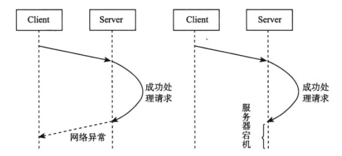
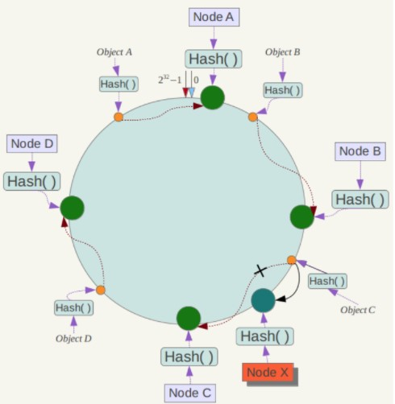
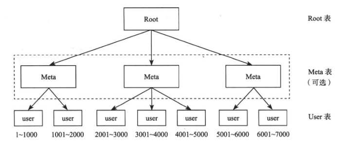
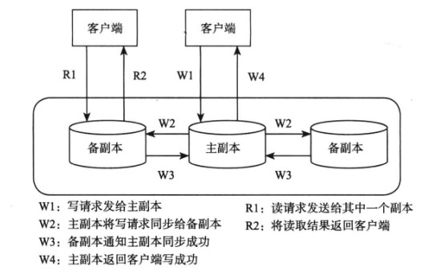
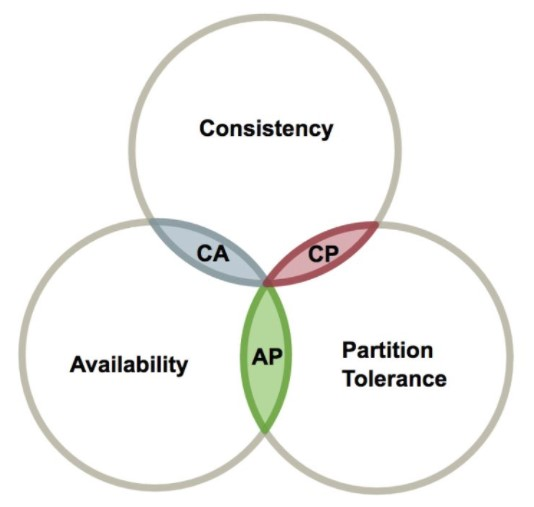

<!-- GFM-TOC -->
* [a basic concept] (#a basic concept)
    * [Abnormal] (# abnormal)
    * [Timeout] (#Timeout)
    * [Metrics] (#metrics)
* [II. Data Distribution] (#2 Data Distribution)
    * [Hash Distribution] (#Hash Distribution)
    * [Sequential Distribution] (#Sequential Distribution)
* [3, load balancing] (#3 load balancing)
* [4, Copy] (#4 copy)
    * [Strong Synchronous Replication Protocol] (#strong synchronous replication protocol)
    * [Asynchronous Replication Protocol] (#Asynchronous Replication Protocol)
* [5, CAP] (# 5 caps)
* [six, BASE] (# six base)
    * [Basic available] (#basic available)
    * [Soft State] (#Soft State)
    * [Final consistency] (#end consistency)
* [VII. Fault Tolerance] (#7 Fault Tolerance)
    * [Fault Detection] (#Fault Detection)
    * [Failure Recovery] (#Fault Recovery)
* [VIII. CDN Architecture] (#8 cdn-architecture)
* [Reference materials] (#reference materials)
<!-- GFM-TOC -->

# I. Basic Concepts

## exception

### 1. Server crashes

Memory errors, server outages, etc. will cause the server to go down. At this time, the node cannot work normally and is called unavailable.

Server opportunities cause the node to lose all memory information, so it is necessary to save the memory information to the persistent media.

### 2. Abnormal network

A special kind of network anomaly is called **network partition**, that is, all the nodes of a cluster are divided into multiple areas, and each area can communicate internally, but the areas cannot communicate with each other.

### 3. Disk failure

Disk failure is an abnormality with a high probability of occurrence.

Uses redundancy to store data to multiple servers.

## time out

In a distributed system, there is a timeout state in addition to the success and failure of a request.

  
 

The server's operation can be designed to have ** idempotency**, which means that executing the result multiple times is the same as executing the result once. If you use this method, when a timeout occurs, you can continuously re-request until it succeeds.

## Metrics

### 1. Performance

Common performance indicators are: throughput, response time.

Among them, the throughput refers to the total number of requests that the system can process in a certain period of time, which is usually the number of read operations or write operations per second. The response time refers to the time consumed from the time a certain request is issued until the returned result is received.

These two indicators are often contradictory. In pursuit of high-throughput systems, it is often difficult to achieve low response times. The explanation is as follows:

- In a non-concurrent system, the throughput is the reciprocal of the response time. For example, if the response time is 10 ms, the throughput is 100 req/s, so high throughput means low response time.

- In concurrent systems, however, a request requires a wait while I/O resources are being invoked. The server side generally uses the asynchronous wait mode, which means that there is no need to always occupy CPU resources after the waiting request is blocked. This method can greatly improve the utilization of CPU resources. For example, in the above example, the response time of a single request is 10 ms in a non-concurrent system, and if it is in a concurrent system, the throughput is greater than 100 req/s. Therefore, in order to pursue high throughput, the degree of concurrency is usually increased. However, the increase in the degree of concurrency will lead to an increase in the average response time of the request. Because the request cannot be processed immediately, it needs to be processed concurrently with other requests, and the response time will naturally increase.

### 2. Availability

Availability refers to the ability of the system to provide normal services in the face of various anomalies. Measured as the ratio of system availability to total time, the availability of four 9s means that 99.99% of the system's time is available.

### 3. Consistency

The consistency can be understood from two perspectives: from the client's point of view, whether the read and write operations satisfy certain characteristics; from the server's perspective, whether multiple copies of data are consistent.

There are three consistency models:

1. Strong consistency: After new data is written, the latest value can be read on any data copy;
2. Weak consistency: After the new data is written, it cannot guarantee that the latest value can be read on the data copy;
3. Final consistency: after the new data is written, it can only guarantee that a new window can be read after a certain time window.

### 4. Extensibility

Refers to the system's ability to increase performance by extending the cluster server size. The ideal distributed system needs to achieve "linear scalability", that is, as the cluster size increases, the overall performance of the system will also increase the thread.

#2. Data Distribution

Distributed system data is distributed among multiple nodes. The commonly used data distribution methods are hash distribution and sequence distribution.

## hash distribution

Hash distribution is to calculate the hash value, according to the hash value assigned to different nodes. For example, if there are N nodes and the primary key of the data is key, the node number assigned to the data is: hash(key)%N.

The traditional hash distribution algorithm has a problem: When the number of nodes changes, that is, the value of N changes, then almost all data needs to be redistributed, which will result in a large amount of data migration.

#### Consistent Hash

Distributed Hash Table (DHT): For hash space 0\~2n, treat this hash space as a hash ring and configure each node to a hash ring. After each data object is hashed and hashed, it is stored in the first clockwise node in the hash ring that is greater than or equal to the hash value.

  
 

The advantage of consistent hashing is that only the neighboring nodes in the hash ring are affected when joining or deleting nodes. For example, the new node X in the following figure is only required to relocate the data object C to node X. There is no effect on nodes A, B, and D.

  
 

## Order distribution

Hash distributed destroys the orderliness of data, and sequential distribution does not.

The sequentially distributed data is divided into multiple consecutive parts and distributed to different nodes according to certain strategies. For example, in the following figure, the primary key range of the User table is 1 \~ 7000, which can be divided into multiple child tables using the order distribution. The corresponding primary key range is 1 \~ 1000, 1001 \~ 2000, ..., 6001 \~ 7000.

The Meta table is to support a larger cluster size. It divides the original layer index into two layers and uses the Meta table to maintain the node where the User sub-table is located, thus alleviating the burden on the root node.

  
 

# Third, load balancing

There are many factors to measure the load, such as CPU, memory, disk and other resource usage, the number of read and write requests. Distributed systems should be capable of automatic load balancing. When the load of a node is high, some of its data is migrated to other nodes.

Each cluster has a master control node, and other nodes are working nodes. The master control node performs overall scheduling according to the global load information. The work node periodically sends a heartbeat (Heartbeat) to send the node load related information to the master control node.

A new working node, due to its low load, if not controlled, the total control node will migrate a large amount of data to the node at the same time, causing the node to work for a period of time. Therefore, the load balancing operation needs to be performed smoothly, and the newly added nodes need a longer period of time to reach a more balanced state.

#4. Copy

Replication is the basis for guaranteeing high availability of distributed systems. It allows multiple copies of a data store. When a node on which a replica is located fails, it can automatically switch to other replicas to achieve fault recovery.

Multiple copies usually have one primary copy and others are backup copies. The main copy is used to process write requests. The standby copy is mainly used to process read requests and achieve read-write separation. The master copy sends the synchronization operation log to the backup copy, and the backup copy obtains the latest modification through the playback operation log.

  
 

There are two replication protocols between active and standby replicas. One is a strong synchronous replication protocol and the other is an asynchronous replication protocol.

## Strong Synchronous Replication Protocol

The master copy is required to wait for the synchronization operation log to be sent to the backup copy. After at least one backup copy is returned successfully, the master copy is modified. After the modification is completed, the client is notified that the operation is successful.

Advantages: At least one backup copy has complete data and can safely switch to this backup copy in the event of a failure, so consistency is good.

Disadvantages: poor usability, because the main copy needs to wait, then the entire distributed system's available time will be reduced.

## Asynchronous Replication Protocol

After the primary replica sends the synchronization operation log to the backup copy, it does not need to wait, directly modify the master copy, and notify the client that the operation is successful.

Advantages: Usability is good.

Disadvantages: poor consistency.

# V. CAP

It is not possible for a distributed system to meet Consistency (C), Availability (A), and Partition tolerance (P) at the same time. At most two of them can be satisfied at the same time. These three concepts have already been mentioned above.

When designing distributed systems, it is necessary to weaken certain requirements based on actual requirements. So there are three designs in the figure below: CA, CP, and AP.

  
 

It should be noted that partition tolerance is indispensable because it is always assumed that the network is unreliable. Therefore, actually designing a distributed system requires a tradeoff between consistency and availability.

# Six, BASE

BASE stands for Basically Available, Soft state, and Eventually consistent. The BASE theory is the result of the trade-off between consistency and availability in the CAP and is based on the gradual evolution of the CAP theorem. The core idea of ​​BASE theory is that even if strong consistency cannot be achieved, each application can use appropriate methods to achieve the final consistency of the system according to its own business characteristics.

## basic available

Refers to the distributed system in the event of failure, to ensure that the core is available, allowing the loss of part of the availability.

For example, when e-commerce is doing promotions, the service layer may only provide downgrade services, and some users may be directed to the downgrade page.

## soft status

Indicates that the system is allowed to have an intermediate state that does not affect the overall availability of the system, that is, that there is a delay in the process of synchronizing data copies between different nodes.

## Eventually consistent

Refers to all copies of data. After a period of synchronization, it can eventually reach a consistent state.

The strong consistency needs to ensure that the data copy is consistent in real time, and the final consistency only needs to be consistent over a period of time.

ACID is a commonly used design theory of traditional database systems and pursues a strong consistency model. BASE is often used in large distributed systems and only needs to guarantee eventual consistency. In the actual distributed scenario, different business units and components have different requirements for consistency, so ACID and BASE are often used together.

#7. Fault tolerance

Distributed system failures have a high probability of occurrence. In order to achieve high availability and reduce manual operation and maintenance costs, automatic fault tolerance is required.

## Fault detection

Faults are detected through the **lease mechanism**. Assume that node A is the master node, node A sends a lease to node B, and node B can provide services within the time limit specified in the lease. When the deadline expires, Node B needs to reapply for a lease to A.

If it expires, then B no longer provides services, and A can also know that B may have failed at this time and has stopped service. It can be seen that through this mechanism, both A and B can agree on the fact that B has failed.

## Recovery

When a node fails, the service above it is migrated to other nodes.

# Eight, CDN architecture

CND enables users in different geographical areas to access the same web page at the same time by publishing the content to the edge nodes close to the user. Not only can reduce the burden on the server, but also can improve the user's access speed.

As can be seen from the figure below, when DNS resolves a domain name, it will not return the IP address of the source server to the user. Instead, it will return the IP address of the edge node. Therefore, the user will eventually access the edge node. The edge node first obtains the data needed by the user from the source server. If the request is successful, the edge node caches the page and can directly read it when the user accesses it next time.

  
 

# References

- Yang Chuanhui. Large-scale distributed storage system: Principle analysis and architecture combat [M]. Machinery Industry Press, 2013.
