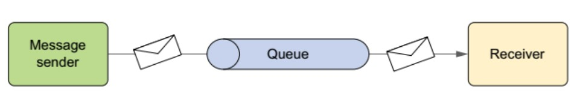
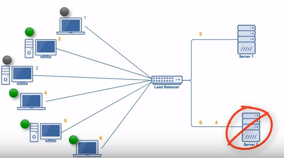

<!-- GFM-TOC -->
* [I. Talk about the use of distributed scenarios in business] (#A talk about using distributed scenarios in business)
* [Second, distributed transaction] (#2 distributed transaction)
    * [Cause of Cause] (#Cause)
    * [Application Scenario] (#Application Scenario)
    * [Solution] (#solution)
* [3. Load Balancing Algorithm and Implementation] (#3 Load Balancing Algorithm and Implementation)
    * [Algorithm] (#Algorithm)
    * [Implementation] (#Implementation)
* [4, distributed lock] (#4 distributed lock)
    * [Usage Scenario] (#Usage Scenario)
    * [Implementation] (#Implementation method)
* [5. Distributed Session] (#5 distributed-session)
    * [1. Sticky session] (#1-sticky-session)
    * [2. Server Session Replication] (#2-server-session-copy)
    * [3. Session sharing mechanism] (#3-session-share mechanism)
    * [4. Session persists to database] (#4-session-persistent to database)
    * [5. Terracotta implements Session replication] (#5-terracotta-implementation-session-copy)
* [6, distributed dilemmas and countermeasures brought by sub-divisions and sub-tables] (Distribution dilemma and countermeasures brought by #6 sub-library and sub-table)
    * [Transaction Problems] (#Transaction Problems)
    * [Query Question] (#query question)
    * [ID Uniqueness] (#id-uniqueness)
* [Reference materials] (#reference materials)
<!-- GFM-TOC -->

# I. Talk about the use of distributed scenarios in business

Distributed is mainly to provide scalability and high availability. Distributed scenarios in the business include distributed storage and distributed computing.

In distributed storage, data can be fragmented onto multiple nodes, which not only improves performance (scalability), but also allows multiple nodes to back up the same data.

As far as distributed computing is concerned, a large task is divided into small tasks and assigned to multiple nodes. Then, the results of each small task are summarized and the final result is obtained. MapReduce is the best example of distributed computing.

#2. Distributed Transactions

The operation of the transaction is located on a different node and the AICD feature of the transaction needs to be guaranteed.

## cause

- Database sub-division table;
- The SOA architecture, such as an e-commerce site, separates the order and inventory operations from different nodes.

## Application Scenario

- Orders: Reduce inventory and update order status. Inventory and order are not in different databases, so it involves distributed transactions.
- Payment: Buyer's account deductions, account entries for sellers. The buyer and seller account information is not in the same database and therefore involves distributed transactions.

## solution

### 1. Two-phase commit protocol

[Two-phase commit] (https://github.com/CyC2018/Interview-Notebook/blob/master/notes/%E4%B8%80%E8%87%B4%E6%80%A7%E5%8D%8F %E8%AE%AE.md#%E4%B8%A4%E9%98%B6%E6%AE%B5%E6%8F%90%E4%BA%A4%E5%8D%8F%E8%AE% AE)

The two-phase commit protocol can solve the distributed transaction problem very well. It can be implemented using XA. XA consists of two parts: transaction manager and local resource manager. The local resource manager is often implemented by a database. For example, the commercial databases such as Oracle and DB2 all implement the XA interface. The transaction manager serves as the global coordinator and is responsible for the submission and rollback of various local resources.

### 2. Message middleware

Message middleware can also be referred to as a message system (MQ), which is essentially a middleware that temporarily forwards messages. In a distributed application, we can convert a business operation into a message. For example, Alipay's balance is transferred to the balance treasure operation. Alipay system sends a message to the messaging system after performing a balance reduction operation. The balance treasure system subscribes to this message and then proceeds to Increase balance treasure operation.

#### 2.1 Message Handling Model

 **Peer to Point **  

  
 

 **Publish/Subscribe**  

  
 

#### 2.2 Reliability of Messages

Reliability of the sender of the message: The sender must successfully send the message to the message system after completing the operation.

The reliability of the receiving end of the message: The receiving end only and can successfully consume the message once from the message middleware.

 **Sender reliability**  

A message table is built in the local data, and the message data and the service data are stored in the same database instance, so that the transaction mechanism of the local database can be utilized. After the transaction is successfully submitted, the message in the message table is transferred to the message middleware. If the transfer message is successful, the data in the message table is deleted; otherwise, the retransmission continues.

 **Receiver reliability**  

The business logic that guarantees that the receiving end processes messages is idempotent: as long as it has idempotency, then how many messages are consumed and the final processing result is the same.

The guarantee message has a unique number and a log table is used to record the message number that has been consumed.

#3. Load Balancing Algorithm and Implementation

## algorithm

### 1. Round Robin

The polling algorithm sends each request to each server in turn. In the following figure, a total of 6 clients generated 6 requests and these 6 requests were sent in the order of (1, 2, 3, 4, 5, 6). Finally, (1, 3, 5) requests are sent to server 1, and (2, 4, 6) requests are sent to server 2 .

  
 

This algorithm is more suitable for the scenario where the performance of each server is similar. If there is a difference in performance, the server with poor performance may not be able to bear much load. In the following figure, Server 2 has worse performance than Server 1, so Server 2 may not be able to bear much load.

  
 

### 2. Weighted Round Robbin

Weighted polling is based on polling and assigns certain weights to the server based on server performance differences. For example, in the figure below, server 1 is given a weight of 5 and server 2 is given a weight of 1. Then (1, 2, 3, 4, 5) requests are sent to server 1, (6) the request will be It is sent to server 2.

  
 

### 3. Least Connections

Since the connection time for each request is different, using a polling or weighted polling algorithm may cause a server to have a large number of connections, and how small a connection is to another server, causing an unbalanced load. For example, in the following figure, (1, 3, 5) requests will be sent to server 1, but (1, 3) will soon be disconnected, only (5) requests to connect to server 1; (2, 4, 6 ) The request was sent to server 2, only (2) was disconnected. How much load Server 2 will bear when the system continues to run.

  
 

The least connection algorithm is to send a request to the server with the current minimum number of connections. For example, in the following figure, the server 1 has the lowest number of connections, and the newly arrived request 6 will be sent to the server 1.

  
 

### 4. Weighted Least Connection

Based on the minimum connection, each server is assigned a weight according to the server's performance, and the number of connections that each server can handle is calculated based on the weight.

  
 

### 5. Random Algorithm

Randomly send the request to the server. Similar to the polling algorithm, this algorithm is more suitable for scenarios with similar server performance.

  
 

## implementation

### 1. DNS Resolution

Use DNS as a load balancer to return IP addresses for different servers based on load conditions. Large-scale websites basically use this method as the first-level load balancing method, and then use other methods internally to do the second-level load balancing.

  
 

### 2. Modify the MAC Address

Use a link-layer load balancer such as Linux Virtual Server (LVS) to modify the requested MAC address based on load conditions.

  
 

### 3. Modify the IP address

Modify the destination IP address of the request at the network layer.

  
 

### 4. HTTP Redirection

The HTTP redirect load balancing server will return the server's address after receiving the HTTP request, and will write this address into the HTTP redirect response and return it to the browser. After receiving the request, the browser needs to send the request again.

  
 

### 5. Reverse Proxy

Forward proxy: Occurs on the client and is initiated by the user. For example, over the wall, the client actively accesses the proxy server, so that the proxy server obtains the required external network data and then forwards it back to the client.

Reverse Proxy: Occurs on the server side and the user does not know the existence of the proxy.

  
 

#4. Distributed lock

Java provides two built-in lock implementations, one provided by the JVM and one provided by the JDK. When your application is a stand-alone or single-process application, you can use synchronized or Lock to implement the lock. When the application involves multiple machines and processes are completed together, then a global lock is needed to achieve synchronization between multiple processes.

## scenes to be used

For example, if an application has a mobile APP and a web end, if two clients perform an operation at the same time, the operation will be repeated.

## Method to realize

### 1. Database Distributed Lock

#### 1.1 Based on MySQL Lock Tables

This implementation completely depends on the unique database index. When you want to acquire a lock, insert a record into the database and delete the record when you release the lock. If the record has a unique index, the same record will not be inserted at the same time. This method has the following problems:

1. The lock has no invalidation time. Failure to unlock will cause a deadlock, and other threads can no longer obtain the lock.
2. It can only be a non-blocking lock. If the insert fails, an error is reported directly and it cannot be retried.
3. Not reentrant, the same thread can no longer obtain a lock until it releases the lock.

#### 1.2 Using optimistic locking to increase the version number

According to the version number to determine whether there is any other thread before the update, if it is updated, the acquisition of the lock fails.

### 2. Redis Distributed Lock

#### 2.1 Based on SETNX, EXPIRE

When inserting a key-value pair using the SET NX (set if not exist) command, it returns False if the Key already exists, otherwise the insert succeeds and returns True. Therefore, when the client tries to acquire a lock, first use SETNX to insert a record into Redis. If it returns True to obtain the lock, return False to indicate that the client already has the lock.

EXPIRE can set an expiration time for a key-value pair to avoid deadlocks.

#### 2.2 RedLock Algorithm

The ReadLock algorithm uses multiple Redis instances to implement distributed locking, which is to ensure that it is also available in the event of a single point of failure.

1. Attempts to acquire locks from N mutually independent Redis instances. If an instance is not available, the next one should be tried as soon as possible.
2. Calculate the time taken to acquire the lock. Only if this time is less than the lock's expiration time, and the lock is acquired from most (N/2+1) instances, the lock acquisition is considered successful.
3. If the lock acquisition fails, the lock is released on each instance.

### 3. Distributed Zookeeper Locks

ZooKeeper is a software that provides consistent services for distributed applications, such as configuration management, distributed collaboration, and naming centralization. These are very basic and essential basic functions in a distributed system, but if you do These functions, but also to achieve high throughput, low latency while maintaining consistency and availability, are actually very difficult.

#### 3.1 Abstract Model

Zookeeper provides a tree-level namespace, and the /app1/p_1 node indicates that its parent node is /app1.

  
 

#### 3.2 Node Types

- Permanent node: Will not disappear due to the end of session or timeout;
- Temporary node: disappears if the session ends or times out;
- Ordered node: A numeric suffix is ​​added after the node name, and it is ordered, for example, the generated ordered node is /lock/node-0000000000, and its next ordered node is /lock/node- 0000000001, and so on.

#### 3.3 Listeners

Register a listener for a node and send a message to the client when the node status changes.

#### 3.4 Distributed Lock Implementation

1. Create a lock directory /lock.
1. Create a temporary and ordered child node under /lock. The first child node is /lock/lock-0000000000, the second is /lock/lock-0000000001, and so on.
2. The client obtains the list of child nodes under /lock, and determines whether the child node created by itself is the child node with the lowest sequence number in the current child node list. If it is, it considers that the child node is locked; otherwise, it listens on its own child node and obtains the child. This step is repeated after the change notification of the node until the lock is obtained;
3. Execute the business code. After it is completed, delete the corresponding child node.

#### 3.5 Session Timeout

If a session that has acquired a lock times out, because the temporary node is created, the temporary node corresponding to the session is deleted, and other sessions can acquire the lock. As you can see, Zookeeper distributed locks do not suffer from deadlocks on the database distributed locks.

#### 3.6 Herding

In step two, a node does not acquire a lock and needs to listen and listen to its previous child node. This is because if all child nodes are monitored, then any one of the child nodes will change state and all other child nodes will receive a notification, and we only have Hope that its next child node is notified.

#5. Distributed Session

If you do not do any processing, users will have frequent login phenomenon. For example, there are two servers A and B in the cluster. When the user accesses the website for the first time, Nginx forwards the user request to the A server through its load balancing mechanism. A server will create a Session for the user. When the user sends the request for the second time, Nginx will load balance it to the B server. At this time, the B server does not exist Session, so the user will be kicked to the login page. This will greatly reduce the user experience, resulting in the loss of users, this situation is that the project should never appear.

## 1. Sticky Session

### principle

A sticky session refers to locking a user to a server. For example, when the user requests for the first time, the load balancer forwards the user's request to the A server. If the load balancer sets a sticky session, then Each subsequent request of the user is forwarded to the A server, which is equivalent to sticking the user and the A server together. This is the sticky Session mechanism.

### Advantages

Simple, no need to do any processing on the Session.

### Disadvantages

Without fault tolerance, if the currently visited server fails and the user is transferred to the second server, his Session information will be invalid.

### Applicable scene

- The impact of failure on the customer is small;
- A server failure is a low probability event.

## 2. Server Session Replication

### principle

If any session on the server changes, the node will serialize all the contents of this Session and then broadcast it to all other nodes. This ensures that Session does not need to be used by other servers.
Synchronize.

### Advantages

Can be fault-tolerant, Sessions between servers can respond in real time.

### Disadvantages

It will cause some pressure on the network load. If Session is heavy, it may cause network congestion and slow server performance.

### Method to realize

1. Set Tomcat's server.xml to enable tomcat clustering.
2. Add information to the application: notify the application that it is currently in a clustered environment and support distributed, ie add the &lt;distributable/> option in web.xml.

## 3. Session Sharing Mechanism

Use a distributed caching scheme such as Memcached, Redis, but require that Memcached or Redis must be a cluster.

Sharing using Session is also divided into two mechanisms, two cases are as follows:

### 3.1 Sticky Session Sharing Mechanism

Like sticky sessions, a user's Session is bound to a Tomcat. Memcached just plays a backup role.

  
 

### 3.2 Non-sticky Session Sharing Mechanism

#### Principle

Tomcat itself does not store the Session, but it is stored in Memcached. The Memcached cluster builds a master-slave replication architecture.

  
 

#### Advantages

Fault tolerant, Session real-time response.

#### Method to realize

Solve Session Sharing Between Tomcat with the Open Source msm Plugin: Memcached_Session_Manager(MSM)

## 4. Session persists to the database

### principle

Take out a database specifically for storing Session information. Ensure Session persistence.

### Advantages

Server problem, Session is not lost

### Disadvantages

If the site has a large number of visits, storing the Session in the database will put a great deal of pressure on the database. It also requires additional overhead to maintain the database.

## 5. Terracotta implements Session replication

### principle

The basic principle of Terracotta is that for data shared between clusters, when a node changes, Terracotta sends only the changed part to the Terracotta server, which then forwards it to the node that really needs it. It is an optimization of server session replication.

  
 

### Advantages

In this way, the pressure on the network is very small, and each node does not need to waste CPU time and memory to perform a large number of serialization operations. The mechanism of data sharing between clusters is applied to Session synchronization, which not only avoids the dependence on the database, but also achieves the effects of load balancing and disaster recovery.

#6. The distributed dilemma and countermeasures brought by sub-divisions and sub-tables

  
 

## transaction issues

Use distributed transactions.

## query question

Use a summary table.

## ID Uniqueness

- Use globally unique ID: GUID;
- Specify an ID range for each shard.

# References

- [Comparing Load Balancing Algorithms] (http://www.jscape.com/blog/load-balancing-algorithms)
- [Load Balancing Algorithms and Means] (https://segmentfault.com/a/1190000004492447)
- [Five Session Processing Strategies in a Cluster/Distributed Environment] (http://blog.csdn.net/u010028869/article/details/50773174?ref=myread)
- [Discuss about distributed locks] (http://www.linkedkeeper.com/detail/blog.action?bid=1023)
- [In-depth understanding of distributed transactions] (https://juejin.im/entry/577c6f220a2b5800573492be)
- [Distributed System Transactions] (https://coolshell.cn/articles/10910.html)
- [About Distributed Transactions] (http://blog.csdn.net/suifeng3051/article/details/52691210)
- [Distributed lock based on Zookeeper] (http://www.dengshenyu.com/java/%E5%88%86%E5%B8%83%E5%BC%8F%E7%B3%BB%E7%BB %9F/2017/10/23/zookeeper-distributed-lock.html)
- [How Sharding Works] (https://medium.com/@jeeyoungk/how-sharding-works-b4dec46b3f6)
- [Server Guide Data Storage | MySQL(09) Distributed Predicaments and Solutions to Sub-Libraries and Tables] (http://blog.720ui.com/2017/mysql_core_09_multi_db_table2/ "Server-side guide data storage" MySQL(09) Distributed Predicaments and Solutions to Sub-Libraries and Tables"
- [How to create unique row ID in sharded databases?](https://stackoverflow.com/questions/788829/how-to-create-unique-row-id-in-sharded-databases)
