<!-- GFM-TOC -->
* [I. Basic Concepts] (#1 - Basic Concepts)
    * [Web infrastructure] (#web-based)
    * [URL] (#url)
    * [Request and Response Message] (#Request and Response Message)
* [2. HTTP method] (#2 http-method)
    * [GET] (#get)
    * [POST](#post)
    * [HEAD](#head)
    * [PUT](#put)
    * [PATCH](#patch)
    * [DELETE] (#delete)
    * [OPTIONS] (#options)
    * [CONNECT](#connect)
    * [TRACE](#trace)
* [3. HTTP status code] (#3 http-status code)
    * [2XX Success] (#2xx-Success)
    * [3XX Redirect] (#3xx-Redirect)
    * [4XX Client Error] (#4xx - Client Error)
    * [5XX Server Error] (#5xx-Server Error)
* [4. HTTP Header] (#4 http-header)
    * [Universal Header Fields] (#Common Header Field)
    * [Request header field] (#Request header field)
    * [Response header field] (# response header field)
    * [Entity Header Field] (#Entity Header Field)
* [5. Specific application] (#5 specific application)
    * [Cookie] (#cookie)
    * [Cache] (#Cache)
    * [Permanent connection] (# persistent connection)
    * [Code] (#Code)
    * [Block Transfer] (#Block Transfer)
    * [Multipart Object Collection] (#Multipart Object Collection)
    * [Scope Request] (#Scope Request)
    * [Content negotiation] (# content negotiation)
    * [virtual host] (# virtual host)
    * [communication data forwarding] (# communication data forwarding)
* [six, https] (#six https)
    * [encryption] (#encryption)
    * [authentication] (#certification)
    * [Integrity] (#Integrity)
* [seventh, Web attack technology] (#7 web-attack technology)
    * [Attack Mode] (# Attack Mode)
    * [Cross-site scripting attack] (# cross-site scripting attack)
    * [SQL Injection Attack] (#sql-injection attack)
    * [Cross Site Request Forgery] (# Cross Site Request Forgery)
    * [Denial of Service Attack] (# Denial of Service Attack)
* [eight, each version comparison] (# eight versions compared)
    * [The difference between HTTP/1.0 and HTTP/1.1] (The difference between #http10- and -http11-)
    * The difference between HTTP/1.1 and HTTP/2.0 (the difference between #http11- and -http20-)
* [Reference materials] (#reference materials)
<!-- GFM-TOC -->


# I. Basic concepts

## Web Fundamentals

- HTTP (HyperText Transfer Protocol).
- Three technologies of the WWW (World Wide Web): HTML, HTTP, URL.
- RFC (Request for Comments, Request for Comments), Internet Design Document.

## URL

- Uniform Resource Indentifier (URI)
- URL (Uniform Resource Locator)
- URN (Uniform Resource Name), for example urn:isbn:0-486-27557-4.

URIs contain URLs and URNs. Currently, WEBs only have URLs that are popular, so basically all URLs are seen.

<div align="center"> 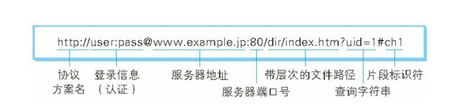 </div><br>

## Request and Response Messages

### 1. Request message

<div align="center"> 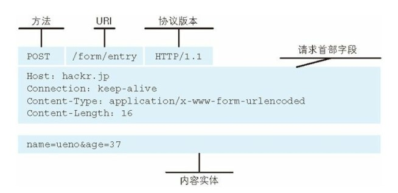 </div><br>

### 2. Response message

<div align="center"> 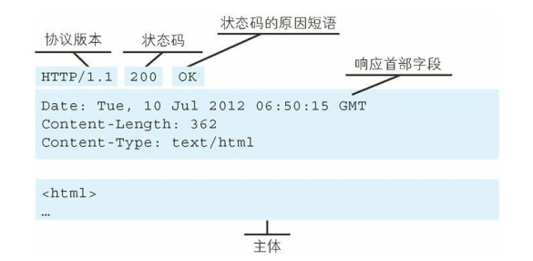 </div><br>

# Second, the HTTP method

The **Request message sent by the client** The first line of the request contains the method field.

## GET

> Get resources

Most of the current web requests use the GET method.

## POST

> Transmission entity body

The main purpose of POST is not to obtain resources but to transfer data stored in content entities.

Both GET and POST requests can use extra parameters, but GET's parameters appear in the URL as query strings, and POST's parameters are stored in content entities.

```
GET /test/demo_form.asp?name1=value1&name2=value2 HTTP/1.1
```

```
POST /test/demo_form.asp HTTP/1.1
Host: w3schools.com
Name1=value1&name2=value2
```

GET's pass arguments are less secure than POST because GET passed parameters are visible in the URL and may reveal private information. And GET only supports ASCII characters. If the parameter is Chinese, it may be garbled, and POST supports the standard character set.

Another difference between GET and POST is that with the GET method, the browser sends the HTTP Header and Data together, and the server responds with 200 (OK) and returns the data. Using the POST method, the browser first sends a header. After the server responds to 100 (Continue), the browser sends the data again. Finally, the server responds with 200 (OK) and returns the data.

## HEAD

> Get message header

Same as the GET method but does not return the body of the message entity.

It is mainly used to confirm the validity of the URL and the date and time of the resource update.

## PUT

> Upload file

Since no authentication mechanism is available, anyone can upload a file, so there is a security problem and this method is generally not used.

```html
PUT /new.html HTTP/1.1
Host: example.com
Content-type: text/html
Content-length: 16

<p>New File</p>
```

## PATCH

> Partially modify the resource

PUT can also be used to modify resources, but can only completely replace the original resources, PATCH allows partial modification.

```html
PATCH /file.txt HTTP/1.1
Host: www.example.com
Content-Type: application/example
If-Match: "e0023aa4e"
Content-Length: 100

[description of changes]
```

## DELETE

> Delete file

Contrary to the PUT function, it also does not have an authentication mechanism.

```html
DELETE /file.html HTTP/1.1
```

## OPTIONS

> Query Support Methods

Query the method that the specified URL can support.

Will return something like Allow: GET, POST, HEAD, OPTIONS.

## CONNECT

> Requires tunneling protocol to connect proxy

The requirement is to set up a tunnel when the proxy server communicates, encrypt the communication content using the SSL (Secure Sockets Layer, Secure Sockets) and TLS (Transport Layer Security) protocols, and then tunnel over the network.

```html
CONNECT www.example.com:443 HTTP/1.1
```

<div align="center"> 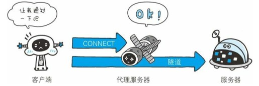 </div><br>

## TRACE

> Tracking path

The server will return the communication path to the client.

When sending a request, enter the value in the Max-Forwards header field, decrement each time a server passes, and stop transmission when the value is zero.

TRACE is not usually used, and it is vulnerable to XST attacks (Cross-Site Tracing), so it will not be used.

<div align="center"> 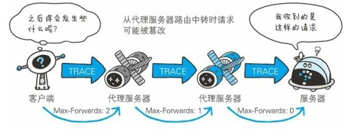 </div><br>

#3. HTTP status code

The first line of status in the **response message** returned by the server contains the status code and the reason phrase used to inform the client of the requested result.

| Status Code | Categories | Reason Phrases |
| :---: | :---: | :---: |
| 1XX | Informational (Informational Status Code) | Receiving requests are being processed |
| 2XX | Success (Success Status Code) | Request Normal Processing Complete |
| 3XX | Redirection | Additional actions required to complete the request |
| 4XX | Client Error (Client Error Status Code) | Server Cannot Process Request |
| 5XX | Server Error (Server Error Status Code) | Server Processing Request Error |

## 2XX Success

- **200 OK**

- **204 No Content** : The request has been successfully processed, but the returned response does not contain the main part of the entity. It is generally used when sending information from the client to the server only, without returning data.

- **206 Partial Content** : Indicates that the client has made a scope request. The response message contains the content of the entity specified by Content-Range.

## 3XX Redirects

- **301 Moved Permanently** : Permanent Redirect

- **302 Found** : Temporary Redirection

- **303 See Other** : Same function as 302, but 303 explicitly requires that the client should use the GET method to get the resource.

- Note: Although the HTTP protocol specifies that the POST method should not be changed to the GET method when redirecting in the 301 or 302 state, most browsers redirect the POST method to the GET method in the 301, 302, and 303 state redirection.

- ** 304 Not Modified** : If the request packet header contains some conditions, such as: If-Match, If-ModifiedSince, If-None-Match, If-Range, If-Unmodified-Since, but does not meet the conditions, then The server returns a 304 status code.

- **307 Temporary Redirect** : Temporary redirect, similar to the meaning of 302, but 307 requires that the browser does not change the POST method of the redirect request to the GET method.

## 4XX Client Error

- **400 Bad Request** : There is a syntax error in the request message.

- **401 Unauthorized** : This status code indicates that the sent request requires authentication information (BASIC authentication, DIGEST authentication). If a request has been made before, the user authentication has failed.

<div align="center"> 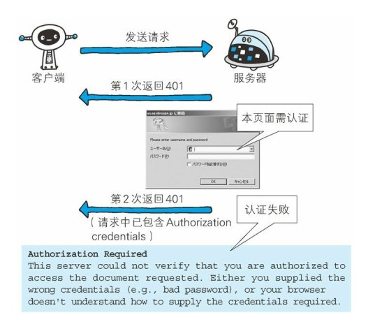 </div><br>

- **403 Forbidden**: The request was rejected. The server did not need to give the detailed reason for the rejection.

- **404 Not Found**

## 5XX server error

- **500 Internal Server Error** : An error occurred while the server was executing the request.

- **503 Service Unavilable** : The server is temporarily overloaded or maintenance is taking place. It is now unable to process the request.

#4. HTTP Header

There are 4 types of header fields: the generic header field, the request header field, the response header field, and the entity header field.

The various header fields and their meanings are as follows (do not need to be recorded in all for review):

## Common Header Fields

| First field name | Description |
| :--: | :--: |
| Cache-Control | Controlling Cache Behavior |
| Connection | Control header fields that are no longer forwarded to the agent, manage persistent connections |
Date | Date the message was created |
| Pragma | Message instructions |
Trailer | List of Heads of Message Ends |
| Transfer-Encoding | Specifies the transmission encoding of the message body |
Upgrade | Upgrade to Other Agreements |
| Via | Proxy Server Information |
| Warning | Error Notification |

## request header fields

| First field name | Description |
| :--: | :--: |
| Accept | User-agent-processable media types |
| Accept-Charset | Priority character set |
| Accept-Encoding | Priority Content Encoding |
| Accept-Language | Preferred Language (Natural Language) |
| Authorization | Web Authentication Information |
| Expect | Expected Server Specific Behavior |
| From | User's email address |
| Host | Requested Resource Server |
| If-Match | Compare Entity Tag (ETag) |
| If-Modified-Since | Compare Resources Updated |
| If-None-Match | Compare Entity Tag (as opposed to If-Match) |
| If-Range | Scope Request for Send Entity Byte When Resource is Not Updated |
| If-Unmodified-Since | Compare resource update time (opposite If-Modified-Since) |
Max-Forwards | Maximum number of hops per transmission |
Proxy-Authorization | Proxy Server Requirements Client Authentication Information |
Range | Entity byte range request |
Referer | The original source of the URI in the request |
| TE | Transmission Coding Priority |
User-Agent | HTTP Client Program Information |

## Response header field

| First field name | Description |
| :--: | :--: |
Accept-Ranges | Accepts byte range requests |
| Age | Estimated resource creation elapsed time |
| ETag | Resource Matching Information |
| Location | Redirect the client to the specified URI |
Proxy-Authenticate | Proxy server-to-client authentication |
| Retry-After | Opportunity to Re-initiate Request |
Server | HTTP Server Installation Information |
Vary | Proxy Server Cache Management Information |
WWW-Authenticate | Server-to-Client Authentication |

## Entity header fields

| First field name | Description |
| :--: | :--: |
Allow | Resources Supported HTTP Methods |
| Content-Encoding | Encoding of the entity body |
Content-Language | Natural Language for Entity Subjects |
| Content-Length | Size of entity body |
| Content-Location | URI to Replace Corresponding Resource |
| Content-MD5 | Entity Body Message Summary |
| Content-Range | Entity Body Location Range |
| Content-Type | Entity Body Media Type |
| Expires | Date and time when the entity expired |
| Last-Modified | Last Modified Date |

#5. Application

## Cookie

The HTTP protocol is stateless, mainly to make the HTTP protocol as simple as possible, so that it can handle a large number of transactions. HTTP/1.1 introduces cookies to save state information.

A cookie is data that the server sends to the client. The data is stored in the browser and is included in the next request. Cookies allow the server to know if two requests are from the same client, enabling the ability to stay logged in.

### 1. Creating Process

The response packet sent by the server contains the Set-Cookie field. After the client obtains the response packet, the cookie content is saved to the browser.

```html
HTTP/1.0 200 OK
Content-type: text/html
Set-Cookie: yummy_cookie=choco
Set-Cookie: tasty_cookie=strawberry

[page content]
```

When the client sends a request later, it reads the cookie value from the browser and includes the cookie field in the request message.

```html
GET /sample_page.html HTTP/1.1
Host: www.example.org
Cookie: yummy_cookie=choco; tasty_cookie=strawberry
```

### 2. Set-Cookie

| Properties | Description |
| :--: | -- |
NAME=VALUE | Name and Value Assigned to Cookies (Required) |
Expires=DATE | The expiration date of the cookie (if not explicitly specified, the default is until the browser is closed) |
Path=PATH | Use the file directory on the server as the cookie's applicable object (If not specified, the default is the file directory where the document is located) |
|domain=domain name | Domain name that is the target of the cookie (If not specified, it defaults to the domain name of the server that created the cookie) |
| Secure | Sending Cookies Only When Securely Communicating Over HTTPS |
HttpOnly | restricts cookies from access by JavaScript scripts |

### 3. Differences between Session and Cookie

Session is a means by which the server tracks users. Each Session has a unique identifier: Session ID. When the server creates a Session, the response packet sent to the client contains the Set-Cookie field. There is a key-value pair called sid. This key-value pair is the Session ID. After receiving the cookie, the client saves the cookie in the browser, and the request packet sent later contains the Session ID. HTTP is used to implement tracking of user status through Session and Cookie. Session is used on the server and Cookie is used on the client.

### 4. The browser disables cookies

URL rewriting technology is used, with sid=xxx appended to the URL.

### 5. Use cookies to automatically fill in user names and passwords

The website script automatically reads the username and password from the cookies stored in the browser for automatic filling.

## Cache

### 1. Advantages

1. Reduce the burden on the server;
2. Increase the speed of response (cache resources are closer to the client than resources on the server).

### 2. How to achieve it

1. Let the proxy server cache;
2. Have the client browser cache it.

### 3. Cache-Control field

HTTP controls the cache through the Cache-Control header field.

```html
Cache-Control: private, max-age=0, no-cache
```

### 4. no-cache directive

The command appears in the Cache-Control field of the request packet, indicating that the cache server needs to verify with the original server whether the cache resource expires.

The command appears in the Cache-Control field of the response message, indicating that the cache server needs to verify the validity of the cache resource before caching.

### 5. no-store directive

This instruction indicates that the cache server cannot cache any part of the request or response.

No-cache does not mean not to cache, but it needs to be verified before caching, and no-store is not cached.

### 6. The max-age directive

This instruction appears in the Cache-Control field of the request message. If the cache time of the cache resource is less than the time specified by the instruction, the cache can be accepted.

This command appears in the Cache-Control field of the response message and indicates the time when the cached resource is stored in the cache server.

The Expires field can also be used to tell the cache server when the resource will expire. In HTTP/1.1 ä
Cache-Control: max-age directives are handled first; in Http-1.0, the Cache-Control: max-age directives are ignored.

## persistent connection

When a browser accesses an HTML page containing multiple pictures, in addition to requesting access to HTML page resources, the picture resource is also requested. If a TCP connection is disconnected for every HTTP communication, the overhead of connection establishment and disconnection will be very high. Big. A persistent connection requires only one TCP connection to make multiple HTTP communications.

<div align="center"> 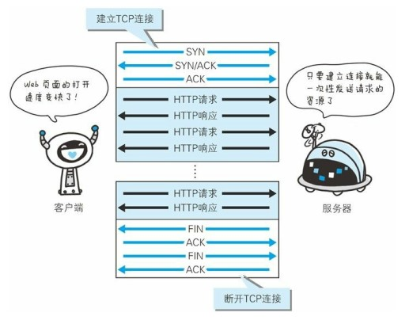 </div><br>

Persistent connections need to be managed using the Connection header field. HTTP/1.1 Start HTTP is a persistent connection by default. If you want to disconnect the TCP connection, you need to disconnect it from the client or the server. Use Connection: close; and before HTTP/1.1, the default is non-persistent connection. To maintain a continuous connection, use Connection : Keep-Alive.

** Pipelining ** Multiple requests and responses can be sent at the same time without sending a single request and waiting for the response before sending the next request.

<div align="center"> 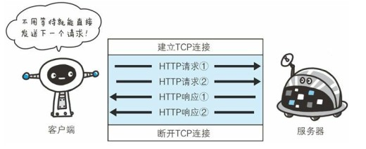 </div><br>

## code

Encoding is mainly for compressing entities. The commonly used encodings are: gzip, compress, deflate, and identity, where identity represents the encoding format in which compression is not performed.

## Block transmission

Chunked Transfer Coding can split the data into multiple chunks, allowing the browser to display pages gradually.

## Multi-part object collection

A message body can contain multiple types of entities that are sent at the same time. Each part is separated by a delimiter defined by the boundary field. Each part can have a header field.

For example, when uploading multiple forms, you can use the following method:

```html
Content-Type: multipart/form-data; boundary=AaB03x

--AaB03x
Content-Disposition: form-data; name="submit-name"

Larry
--AaB03x
Content-Disposition: form-data; name="files"; filename="file1.txt"
Content-Type: text/plain

... contents of file1.txt ...
--AaB03x--
```

## range request

If the network is interrupted, the server sends only a portion of the data. The scope request allows the client to request only the portion of data that was not sent, thereby preventing the server from resending all the data.

Add the Range field to the request message header and specify the scope of the request, for example Range:bytes=5001-10000. The server sends 206 Partial Content status if the request is successful.

```html
GET /z4d4kWk.jpg HTTP/1.1
Host: i.imgur.com
Range: bytes=0-1023
```

```html
HTTP/1.1 206 Partial Content
Content-Range: bytes 0-1023/146515
Content-Length: 1024
...
(binary content)
```

## Content negotiation

The most appropriate content is returned through content negotiation, for example, whether to return a Chinese interface or an English interface according to the default language of the browser.

The following header fields are involved: Accept, Accept-Charset, Accept-Encoding, Accept-Language, Content-Language.

## Web Hosting

Using virtual host technology, a server has multiple domain names and can be logically viewed as multiple servers.

## Communication Data Forwarding

### 1. Agency

The proxy server accepts the client's request and forwards it to other servers.

The proxy server is generally transparent and does not change the URL.

The main purpose of using a proxy is: caching, network access control, and access logging.

<div align="center"> 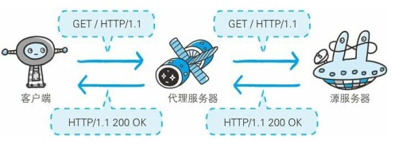 </div><br>

### 2. Gateway

Unlike proxy servers, gateway servers translate HTTP to other protocols for communication, requesting services from other non-HTTP servers.

<div align="center"> 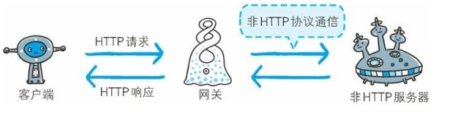 </div><br>

### 3. Tunnel

Use encryption methods such as SSL to establish a secure communication line between the client and the server.

<div align="center"> 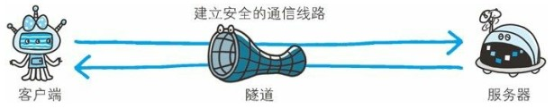 </div><br>

#6. HTTPs

HTTP has the following security issues:

1. Use clear text to communicate and content may be eavesdropped;
2. Without verifying the identity of the communicating party, the identity of the communicating party may be subject to camouflage;
3. The integrity of the message cannot be proved and the message may be tampered with.

HTTPs are not new protocols, but HTTP communicates with SSL (Secure Socket Layer) and SSL and TCP. By using SSL, HTTPs provide encryption, authentication, and integrity protection.

## encryption

There are two types of encryption: symmetric key encryption and public key encryption. The encryption and decryption of symmetric key encryption use the same key, while public key encryption uses a pair of keys for encryption and decryption, which are the public key and the private key, respectively. The public key owner is available. After the communication sender obtains the public key of the receiver, it can use the public key for encryption, and the recipient receives the communication content and decrypts it with the private key.

Disadvantages of symmetric key encryption: The key cannot be transmitted securely; the disadvantages of public key encryption are relatively time-consuming.

HTTPs employ a **hybrid encryption mechanism** that uses public-key encryption for transmitting symmetric keys and then uses symmetric-key encryption for communication. (In the figure below, the shared key is the symmetric key)

<div align="center"> 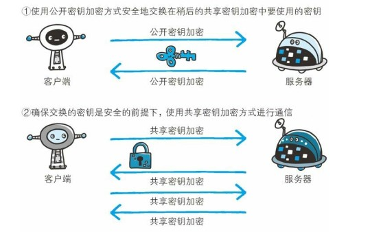 </div><br>

## Certification

Use the **certificate** to authenticate the communicating party.

A digital certificate authority (CA) is a third party trusted by both the client and the server. The operator of the server submits a request for a public key to the CA. After determining the identity of the applicant, the CA digitally signs the applied public key, and then assigns the signed public key and closes the public key. The keys are bound together after they are put into a public key certificate.

When performing HTTPs communication, the server sends the certificate to the client. After the client obtains the public key, the client first verifies it. If the verification is successful, the server can start communication.

In addition to the server-side certificates mentioned in the appeal, there are client certificates. The purpose of the client certificate is to have the server authenticate the client. The client certificate needs to be installed by the user. The client certificate is used only when the business requires very high security, such as online banking.

Using the OpenSSL open-source program, everyone can build a set of their own certification bodies and issue their own server certificates. When the browser accesses the server, a warning message such as "Unable to confirm connection security" or "There is a problem with the site's security certificate" is displayed.

## Integrity

SSL provides digest functionality to verify integrity.

#7. Web Attack Technology

The main goal of Web attacks is Web applications that use the HTTP protocol.

## attack mode

### 1. Actively attack

Directly attacking the server, there are typical SQL injection and OS command injection.

### 2. Passive attack

Set up a trap to allow users to send HTTP requests with attack code. After the user sends the HTTP request, it reveals personal information such as cookies. Representative cross-site scripting attacks and cross-site request forgery are typical.

## Cross-Site Scripting Attacks

### 1. Concept

(Cross-Site Scripting, XSS), which injects code into the web pages the user is browsing. This code contains HTML and JavaScript. By exploiting vulnerabilities left in the development of web pages, malicious instructions are injected into web pages through clever methods to allow users to load and execute malicious web pages created by attackers. After the attack is successful, the attacker may be given higher rights (such as performing some operations), private web content, conversations, and cookies.

### 2. Harmful

- Forging false input forms to cheat personal information
- Stealing user's cookie value
- Display forged articles or pictures

### 3. Preventive measures

**(1) Filter special characters**

Many languages ​​provide filtering of HTML:

- PHP's htmlentities() or htmlspecialchars().
- Python's cgi.escape().
- Java's xssprotect (Open Source Library).
- The node-validator of Node.js.

** (b) Specifying HTTP Content-Type**

In this way, you can prevent content from being parsed as HTML. For example, the PHP language can use the following code:

```php
<?php
   Header('Content-Type: text/javascript; charset=utf-8');
?>
```

## SQL Injection Attack

### 1. Concept

The database on the server runs an illegal SQL statement.

### 2. Attack Principle

For example, a website login verification SQL query code is:

```sql
strSQL = "SELECT * FROM users WHERE (name = '" + userName + "') and (pw = '"+ passWord +"');"
```

If you fill in the following:

```sql
userName = "1' OR '1'='1";
passWord = "1' OR '1'='1";
```

Then the SQL query string is:

```sql
strSQL = "SELECT * FROM users WHERE (name = '1' OR '1' = '1') and (pw = '1' OR '1' = '1');"
```

You can execute the following query without verifying the pass:

```sql
strSQL = "SELECT * FROM users;"
```

### 3. Hazards

- The data in the data sheet is leaked, such as personal confidential data, account data, passwords, etc.
- The data structure was hacked to make further attacks (eg SELECT * FROM sys.tables).
- The database server was attacked and the system administrator account was tampered with (eg ALTER LOGIN sa WITH PASSWORD='xxxxxx').
- After gaining access to the system, malicious links, malicious code, and XSS may be added to the web page.
- Operating system support provided by the database server allows hackers to modify or control the operating system (for example, xp_cmdshell "net stop iisadmin" can stop the server's IIS service).
- Destroys the hard disk data and saves the entire system (for example, xp_cmdshell "FORMAT C:").

### 4. Preventive measures

- When designing an application, use a fully parameterized query to design data access capabilities.
- When combining SQL strings, use character substitution for the passed in parameters (single quote characters are replaced by two consecutive single quote characters).
- If you use PHP to develop web applications, you can also turn on the PHP Magic quote feature (automatically pass all web pages parameters, replace single quote characters with two consecutive single quote characters).
- Others, use other more secure ways to connect to SQL databases. For example, database connectivity components that have fixed SQL injection issues, such as ASP.NET's SqlDataSource object or LINQ to SQL.
- Use SQL anti-injection system.

## Cross Site Request Forgery

### 1. Concept

(Cross-site request forgery, XSRF) is an attacker who deceives a user's browser through a number of technical means to access a self-certified website and perform some operations (such as sending e-mail, sending messages, or even property operations such as transfer and purchase). commodity). Since the browser has been authenticated, the visited website will be considered as a real user operation. This exploits a vulnerability in user authentication on the Web: Simple authentication only guarantees that the request was sent from a user's browser, but there is no guarantee that the request itself was made voluntarily by the user.

XSS utilizes the user's trust in the specified website, and CSRF uses the website's trust in the user's web browser.

If the address of a URL used by a bank to perform a transfer operation is: `http://www.examplebank.com/withdraw?account=AccoutName&amount=1000&for=PayeeName`.

<div align="center"> Then, a malicious attacker can place the following code on another website: ``. </div><br>

If a user with an account named Alice visits a malicious site and she has just visited the bank shortly before and the login information has not expired, she will lose 1000 funds.

This malicious URL can take many forms and hide in many places on the page. In addition, attackers do not need to control websites that have malicious URLs. For example, he can hide such addresses in forums, blogs, and other user-generated content sites. This means that if the server does not have appropriate defenses, users will be at risk of attack even if they visit familiar trusted websites.

By way of example, it can be seen that an attacker cannot directly gain control of the user's account through the CSRF attack, nor can he directly steal any information from the user. What they can do is deceive the user's browser and let it perform operations on behalf of the user.

### 2. Preventive measures

**(a) Check the Referer field**

There is a Referer field in the HTTP header that indicates which address the request came from. When processing sensitive data requests, the Referer field should normally be in the same domain as the requested address.

This approach is simple, low-effort, and requires only one step of verification at key access points. However, this approach also has its limitations because it completely relies on the browser to send the correct Referer field. Although the HTTP protocol specifies the content of this field, it does not guarantee the specific implementation of the browser you are visiting, nor does it guarantee that the browser has no security flaws affecting this field. There is also the possibility that an attacker attacks some browsers and falsifies their Referer fields.

** (b) Add verification Token**

Because the essence of CSRF is that an attacker tricks a user to access an address set by himself, if he requests the user's browser to provide data that is not stored in a cookie and the attacker cannot forge it as a check when accessing a request for sensitive data, then the attack The person can no longer perform CSRF attacks. This data is usually a data item in the form. The server generates it and attaches it to the form. Its content is a fake number. When the client submits the request through the form, the pseudo-random number is also submitted for verification. During normal access, the client browser can correctly obtain and return this pseudo-random number. In the deceptive attack from the CSRF, the attacker does not first learn the value of the pseudo-random number, and the server will check the token because of the verification token. The value is null or false, rejecting this suspicious request.

## Denial of Service Attack

### 1. Concept

Denial-of-service attack (DoS), also known as flood attack, is designed to exhaust the network or system resources of the target computer and temporarily interrupt or stop the service, causing its normal users to lose access.

(distributed denial-of-service attack, DDoS), where an attacker uses two or more compromised computers on the network as a "zombie" to launch a "denial of service" attack on a specific target.

> [Wikipedia: Denial of Service Attack] (https://en.wikipedia.org/wiki/%E9%98%BB%E6%96%B7%E6%9C%8D%E5%8B%99%E6%94 %BB%E6%93%8A)

#8. Comparison of versions

Difference between ## HTTP/1.0 and HTTP/1.1

HTTP/1.1 added the following:

- The default is long connection;
- Provides scope request function;
- Provides the functionality of a virtual host;
- More cache processing fields;
- More status codes.

## Differences Between HTTP/1.1 and HTTP/2.0

### 1. Multiplexing

HTTP/2.0 uses multiplexing to use the same TCP connection to handle multiple requests.

### 2. Header compression

The header of HTTP/1.1 carries a lot of information and is repeated every time. HTTP/2.0 requires that both parties to the communication buffer their own header table, thereby avoiding duplicate transmissions.

### 3. Server push

When the client requests a resource, the relevant resources are sent to the client together, and the client does not need to initiate the request again. For example, the client requests the index.html page and the server sends the index.js to the client.

### 4. Binary format

HTTP/1.1 resolution is text-based, and HTTP/2.0 is in binary format.

# References

- [Illustrated HTTP] (https://pan.baidu.com/s/1M0AHXqG9sP9Bxne6u0JK8A)
- [MDN: HTTP] (https://developer.mozilla.org/en-US/docs/Web/HTTP)
- [Wikipedia: Cross-site scripting] (https://zh.wikipedia.org/wiki/%E8%B7%A8%E7%B6%B2%E7%AB%99%E6%8C%87%E4%BB %A4%E7%A2%BC)
- [Wikipedia: SQL Injection Attack] (https://zh.wikipedia.org/wiki/SQL%E8%B3%87%E6%96%99%E9%9A%B1%E7%A2%BC%E6% 94%BB%E6%
93%8A)
- [Wikipedia: Cross Site Request Forgery] (https://zh.wikipedia.org/wiki/%E8%B7%A8%E7%AB%99%E8%AF%B7%E6%B1%82%E4% BC%AA%E9%80%A0)
- [Wikipedia: Denial of Service Attack] (https://zh.wikipedia.org/wiki/%E9%98%BB%E6%96%B7%E6%9C%8D%E5%8B%99%E6%94 %BB%E6%93%8A)

