<!-- GFM-TOC -->
* [Preface] (#preface)
* [2. Implement Singleton] (#2-implementation-singleton)
* [3. Repeated Numbers in Array] (#3 - Duplicate Numbers in Array)
* [4. Find in 2D Array] (#4-Find in 2D Array)
* [5. Replace Spaces] (#5 - Replace Spaces)
* [6. Print the linked list from end to end] (#6 - Print linked list from end to end)
* [7. Rebuild binary tree] (#7 - Rebuild binary tree)
* [8. The next node of the binary tree] (#8 - The next node of the binary tree)
* [9. Implementing Queues with Two Stacks] (#9 - Implementing Queues with Two Stacks)
* [10.1 Fibonacci sequence] (#101-Fibonacci sequence)
* [10.2 Steps] (#102-Hop Steps)
* [10.3 Pervert Jump Level] (#103-Perverted Steps)
* [10.4 Rectangle Overlay] (#104-Rectangle Overlay)
* [11. Rotate the smallest number of arrays] (#11 - the smallest number of rotation arrays)
* [12. Path in matrix] (#12-path in matrix)
* [13. Robot's range of motion] (#13 - Robot's range of motion)
* [14. Cut the rope] (#14 - cut rope)
* [15. Number of 1s in binary] (#15-number of -1- in binary)
* [16. Integer power of value] (#16-integer power of value)
* [17. Print n digits from 1 to maximum] (#17-print from 1- to -n-digit)
* [18.1 Delete list node during O(1) time] (#181-Delete list node during -o1-time)
* [18.2 Delete Duplicate Nodes in List] (#182-Delete Duplicate Nodes in List)
* [19. Regular expression matching] (#19-regular expression matching)
* [20. String indicating numeric value] (#20-character string)
* [21. Adjust the array order so that the odd number is in front of the even number] (#21 - Adjust the array order so that the odd number is in front of the even number)
* [22. The last K-node in the list] (#22 - the last-k-node in the list)
* [23. Inlet node of the ring in the linked list] (#23 - Inlet node of the ring in the linked list)
* [24. Inverse List] (#24 - Reverse List)
* [25. Merge Two Sorted Lists] (#25-Merge Two Sorted Lists)
* [26. Substructure of tree] (#26 - Substructure of tree)
* [27. Binary Tree Mirroring] (#27 - Image of Binary Tree)
* [28.1 Symmetrical Binary Tree] (#281 - Symmetrical Binary Tree)
* [28.2 Balanced Binary Tree] (#282 - Balanced Binary Tree)
* [29. Clockwise Print Matrix] (#29 - Clockwise Print Matrix)
* [30. Stack with min function] (#30 - stack containing -min-function)
* [31. Stack push-in, pop-up sequence] (#31 - stack push-pop sequence)
* [32.1 Printing binary tree from top] (#321 - Printing binary tree from top to bottom)
* [32.2 Print binary tree in multiple lines] (#322 - Print binary tree in multiple lines)
* [32.3 Print binary tree in zigzag order] (#323 - Print binary tree in zigzag order)
* [33. Post-order traversal sequence of binary search tree] (#33 - Post-order traversal sequence of binary search tree)
* [34. Binary tree and the path to a certain value] (#34-binary tree and the path to a certain value)
* [35. Copy of complex linked list] (#35 - Copy of complex linked list)
* [36. Binary Search Tree and Doubly Linked List] (#36 - Binary Search Tree and Doubly Linked List)
* [37. Serialized Binary Tree] (#37 - Serialized Binary Tree)
* [38. Arrangement of strings] (#38 - Arrangement of strings)
* [39. Number of occurrences in the array more than half] (#39-Number of occurrences in the array more than half)
* [40. Minimum K number] (#40-minimum -k-number)
* [41.1 median in data stream] (#411 - Median in data stream)
* [41.2 The first non-repeating character in the character stream] (#412 - The first non-repeating character in the character stream)
* [42. Maximum sum of consecutive subarrays] (#42 - Maximum sum of consecutive subarrays)
* [43. Number of occurrences of 1 in integers from 1 to n] (#43-From -1 to -n-number of occurrences of 1-integer)
* [44. One digit in the digit sequence] (#44 - One digit in the digit sequence)
* [45. Put the array into the smallest number] (#45 - Arrange the array into the smallest number)
* [46. Translate numbers into strings] (#46 - Translate numbers into strings)
* [47. The greatest value of the gift] (#47 - The greatest value of the gift)
* [48. Substrings without longest repeated characters] (#48 - Substrings with no longest repeated characters)
* [49. Ugly] (#49 - Ugly)
* [50. First character position only once] (#50 - First character position only once)
* [52. First public node of both lists] (#52 - First public node of both lists)
* [Number of occurrences of 53 numbers in the sorted array] (#53 - Number of times the number appears in the sorted array)
* [54. k-th node of the binary search tree] (#54 - the k-th node of the binary search tree)
* [55 binary tree depth] (#55 - depth of binary tree)
* [56. Numbers that appear only once in the array] (#56-Numbers that appear only once in the array)
* [57.1 and two digits for S] (#571- and two digits for-s-)
* [57.2 and S is a continuous positive sequence] (#572-sum is a sequence of consecutive positive numbers for -s-)
* [58.1 Flip word order column] (#581-flip word order column)
* [58.2 Left Rotate String] (#582 - Left Rotate String)
* [59. Maximum value of sliding window] (#59 - maximum value of sliding window)
* [60. Points for n dice] (#60-n-dot points)
* [61. Poker Straight] (#61 - Poker Straight)
* [62. The last remaining number in the circle] (#62 - The last remaining number in the circle)
* [63. Maximum Profit of Stocks] (#63 - Maximum Profit of Stocks)
* [64. Find 1+2+3+...+n](#64-find-1+2+3++n)
* [65. Do not add, subtract, multiply, or add] (#65-do not add, subtract, multiply, or add)
* [66. Build product array] (#66 - Build product array)
* [67. Convert string to integer] (#67 - Convert string to integer)
* [68. Lowest common ancestor of two nodes in the tree] (#68 - lowest common ancestor of two nodes in the tree)
<!-- GFM-TOC -->


# Preface

## variable naming convention

- nums represents an array, and matrix represents a matrix;
- n indicates the length of the array, the length of the string, the number of tree nodes, and the number of elements in the data structure that have one-dimensional properties;
- m, n represents the number of rows and columns of the matrix;
- first, last means closed interval: [first, last];
- begin, end indicates the left closed right open interval: [begin, end);
- l, h indicates the closed interval of the binary search: [l, h];
- ret indicates the result-related variables;
- dp represents an array of dynamic programming preservation subproblems;

## complexity brief description

O(nlog<n>) + O(n<sup>2</sup>), the first refers to time complexity, and the second refers to spatial complexity.

# 2. Implement Singleton

[Single Case Pattern](https://github.com/CyC2018/Interview-Notebook/blob/master/notes/%E8%AE%BE%E8%AE%A1%E6%A8%A1%E5%BC%8F .md#%E5%85%AB%E5%8D%95%E4%BE%8B%E6%A8%A1%E5%BC%8F)

# 3. Repeated Numbers in Array

## Title Description

All the numbers in an array of length n are in the range 0 to n-1. Some of the numbers in the array are duplicated, but it is not known that several numbers are duplicates. Nor does it know that each number repeats several times. Please find any duplicate number in the array. For example, if you enter an array of lengths 7 {2, 3, 1, 0, 2, 5, 3}, then the corresponding output is the first repeated number 2.

## problem-solving ideas

This problem with array elements within the range [0, n-1] places the element with the value i in the i-th position.

Take (2, 3, 1, 0, 2, 5) as an example, the following code runs as follows:

```html
Position-0 : (2,3,1,0,2,5) // 2 <-> 1
             (1,3,2,0,2,5) // 1 <-> 2
             (3,1,1,0,2,5) // 3 <-> 0
             (0,1,1,3,2,5) // already in position
Position-1 : (0,1,1,3,2,5) // already in position
Position-2 : (0,1,1,3,2,5) // nums[i] == nums[nums[i]], exit
```

When traversing to position 2, the number in this position is 1, but there is already a value of 1 in the first position, so we can know that 1 repeats.

Complexity: O(n) + O(1)

```java
Public boolean duplicate(int[] nums, int length, int[] duplication) {
    If (nums == null || length <= 0) return false;
    For (int i = 0; i < length; i++) {
        While (nums[i] != i && nums[i] != nums[nums[i]]) {
            Swap(nums, i, nums[i]);
        }
        If (nums[i] != i && nums[i] == nums[nums[i]]) {
            Duplication[0] = nums[i];
            Return true;
        }
    }
    Return false;
}

Private void swap(int[] nums, int i, int j) {
    Int t = nums[i]; nums[i] = nums[j]; nums[j] = t;
}
```

# 4. Finding in a two-dimensional array

## Title Description

In a two-dimensional array, each row is sorted in ascending order from left to right, with each column sorted in ascending order from top to bottom. Please complete a function, enter such a two-dimensional array and an integer, to determine whether the array contains the integer.

```html
Consider the following matrix:
[
  [1, 4, 7, 11, 15],
  [2, 5, 8, 12, 19],
  [3, 6, 9, 16, 22],
  [10, 13, 14, 17, 24],
  [18, 21, 23, 26, 30]
]

Given target = 5, return true.
Given target = 20, return false.
```

## problem-solving ideas

Find it from the top right corner. Because of the number in the matrix, the number to the left is smaller than it is, and the number below it is larger than it. Therefore, starting from the upper right corner, you can narrow the search interval based on the size of the target and the current element.

Complexity: O(m + n) + O(1)

```java
Public boolean Find(int target, int[][] matrix) {
    If (matrix == null || matrix.length == 0 || matrix[0].length == 0) return false;
    Int m = matrix.length, n = matrix[0].length;
    Int r = 0, c = n - 1; // starts from the upper right corner
    While (r <= m - 1 && c >= 0) {
        If (target == matrix[r][c]) return true;
        Else if (target > matrix[r][c]) r++;
        Else c--;
    }
    Return false;
}
```

# 5. Replace spaces

## Title Description

Please implement a function that replaces a space in a string with "%20". For example, when the string is We Are Happy, the string after replacement is We%20Are%20Happy.

## problem-solving ideas

Fill any character at the end of the string so that the length of the string is equal to the length after the string is replaced. Because a space is replaced with three characters (%20), when traversing to a space, you need to fill two arbitrary characters at the end.

Let P1 point to the original end of the string and P2 point to the end of the string now. P1 traverses from back to front. When traversing to a space, you need to fill the position pointed by P2 with 02% (note the reverse order), otherwise fill in the value of P1 pointing to the character.

From the back to the front in order to change the content pointed to by P2, will not affect P1 traverse the contents of the original string.

Complexity: O(n) + O(1)

<div align="center"> 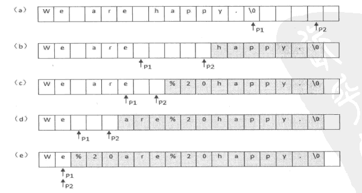 </div><br>

```java
Public String replaceSpace(StringBuffer str) {
    Int oldLen = str.length();
    For (int i = 0; i < oldLen; i++) {
        If (str.charAt(i) == '') {
            Str.append(" ");
        }
    }
    Int idxOfOld = oldLen - 1;
    Int idxOfNew = str.length() - 1;
    While (idxOfOld >= 0 && idxOfNew > idxOfOld) {
        Char c = str.charAt(idxOfOld--);
        If (c == '') {
            str.setCharAt(idxOfNew--, '0');
            str.setCharAt(idxOfNew--, '2');
            str.setCharAt(idxOfNew--, '%');
        } Else {
            str.setCharAt(idxOfNew--, c);
        }
    }
    Return str.toString();
}
```

# 6. Print the linked list from end to end

## Title Description

The first node of the input list, which prints the value of each node from end to end.

## problem-solving ideas

### Using stacks

```java
Public ArrayList<Integer> printListFromTailToHead(ListNode listNode) {
    Stack<Integer> stack = new Stack<>();
    While (listNode != null) {
        Stack.add(listNode.val);
        listNode = listNode.next;
    }
    ArrayList<Integer> ret = new ArrayList<>();
    While (!stack.isEmpty()) {
        Ret.add(stack.pop());
    }
    Return ret;
}
```

### Using recursion

```java
Public ArrayList<Integer> printListFromTailToHead(ListNode listNode) {
    ArrayList<Integer> ret = new ArrayList<>();
    If(listNode != null) {
        ret.addAll(printListFromTailToHead(listNode.next));
        Ret.add(listNode.val);
    }
    Return ret;
}
```

### Using Collections.reverse()

```java
Public ArrayList<Integer> printListFromTailToHead(ListNode listNode) {
    ArrayList<Integer> ret = new ArrayList<>();
    While (listNode != null) {
        Ret.add(listNode.val);
        listNode = listNode.next;
    }
    Collections.reverse(ret);
    Return ret;
}
```

### Using Header Insertion

The use of linked list headers is a feature of reverse order.

The difference between the head node and the first node: The head node is an extra node that is used in the head insertion method. This node does not store the value; the first node is the first node that actually stores the value of the linked list.

```java
Public ArrayList<Integer> printListFromTailToHead(ListNode listNode) {
    // Head insertion method to build a reversed list
    ListNode head = new ListNode(-1);
    While (listNode != null) {
        ListNode memo = listNode.next;
        listNode.next = head.next;
        Head.next = listNode;
        listNode = memo;
    }
    // Build an ArrayList
    ArrayList<Integer> ret = new ArrayList<>();
    Head = head.next;
    While (head != null) {
        Ret.add(head.val);
        Head = head.next;
    }
    Return ret;
}
```

# 7. Rebuild binary tree

## Title Description

The binary tree is reconstructed according to the pre-order traversal and the mid-order traversal of the binary tree.

```html
For example, given

Preorder = [3,9,20,15,7]
Inorder = [9,3,15,20,7]

Return the following binary tree:

    3
   / \
  9 20
    / \
   15 7
```

## problem-solving ideas

The first traversal of the preorder is the value of the root node. Use this value to divide the traversal result into two parts. The left part is the traversal result of the left subtree of the tree, and the right part is the traversal of the right subtree of the tree. the result of.

```java
Private Map<Integer, Integer> inOrderNumsIdx = new HashMap<>(); // The index of each value in the cached array

Public TreeNode reConstructBinaryTree(int[] pre, int[] in) {
    For (int i = 0; i < in.length; i++) {
        inOrderNumsIdx.put(in[i], i);
    }
    Return reConstructBinaryTree(pre, 0, pre.length - 1, in, 0, in.length - 1);
}

Private TreeNode reConstructBinaryTree(int[] pre, int preL, int preR, int[] in, int inL, int inR) {
    If (preL == preR) return new TreeNode(pre[preL]);
    If (preL > preR || inL > inR) return null;
    TreeNode root = new TreeNode(pre[preL]);
    Int inIdx = inOrderNumsIdx.get(root.val);
    Int leftTreeSize = inIdx - inL;
    Root.left = reConstructBinaryTree(pre, preL + 1, preL + leftTreeSize, in, inL, inL + leftTreeSize - 1);
    Root.right = reConstructBinaryTree(pre, preL + leftTreeSize + 1, preR, in, inL + leftTreeSize + 1, inR);
    Return root;
}
```

# 8. The next node of the binary tree

## Title Description

Given a binary tree and one of its nodes, find the next node in the order of traversal and return. Note that the nodes in the tree contain not only the left and right child nodes, but also pointers to the parent nodes.

## problem-solving ideas

1 If a node has a right subtree that is not empty, then the next node of that node is the leftmost node of the right subtree;

<div align="center"> 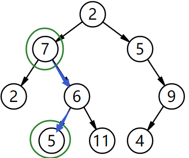 </div><br>

2 Otherwise, look up the tree that the first left link points to contains the node's ancestor node.

<div align="center"> 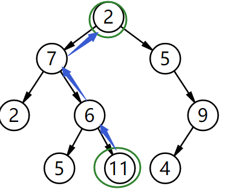 </div><br>

```java
Public class TreeLinkNode {
    Int val;
    TreeLinkNode left = null;
    TreeLinkNode right = null;
    TreeLinkNode next = null;

    TreeLinkNode(int val) {
        This.val = val;
    }
}
```

```java
Public TreeLinkNode GetNext(TreeLinkNode pNode) {
    If (pNode.right != null) {
        TreeLinkNode node = pNode.right;
        While (node.left != null) node = node.left;
        Return node;
    } Else {
        While (pNode.next != null) {
            TreeLinkNode parent = pNode.next;
            If (parent.left == pNode) return parent;
            pNode = pNode.next;
        }
    }
    Return null;
}
```

# 9. Implement Queues with Two Stacks

## problem-solving ideas

The in stack is used to handle push operations and the out stack is used to handle pop operations. After an element enters the in stack, it's out of the stack.
The order is reversed. When an element needs to be popped, it needs to enter the out stack first. At this point, the order in which the elements are ejected is reversed again. Therefore, the stacking order is the same as the first stacking order. At this time, the first element entered first exits. Is the order of the queues.

```java
Stack<Integer> in = new Stack<Integer>();
Stack<Integer> out = new Stack<Integer>();

Public void push(int node) {
    In.push(node);
}

Public int pop() {
    If (out.isEmpty()) {
        While (!in.isEmpty()) {
            Out.push(in.pop());
        }
    }
    Return out.pop();
}
```

# 10.1 Fibonacci sequence

## Title Description

Find the Fibonacci sequence with the time complexity of O(1).

<div align="center">1}\end{array}\right."/></div> <br>

## problem-solving ideas

If you use a recursive solution, some sub-problems are calculated repeatedly. For example, f(10) needs to calculate f(9) and f(8), and f(9) needs to calculate f(8) and f(7). We can see that f(8) is calculated repeatedly.

<div align="center"> 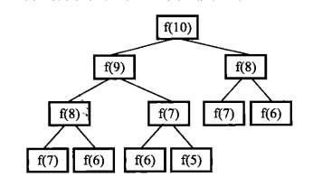 </div><br>

The recursive method is to divide a problem into multiple sub-problems, and dynamic programming is also the case. However, dynamic programming will cache the solutions of sub-problems and avoid solving sub-problems repeatedly.

```java
Public class Solution {
    Private int[] fib = new int[40];
    Public Solution() {
        Fib[1] = 1;
        Fib[2] = 2;
        For(int i = 2; i < fib.length; i++) {
            Fib[i] = fib[i - 1] + fib[i - 2];
        }
    }
    Public int Fibonacci(int n) {
        Return fib[n];
    }
}
```

# 10.2 Jumping stairs

## Title Description

A frog can jump to a level 1 step at a time, and it can also jump to level 2. Ask the frog to jump on a n-level stairway in total.

## problem-solving ideas

```java
Public int JumpFloor(int n) {
    If (n == 1) return 1;
    Int[] dp = new int[n];
    Dp[0] = 1;
    Dp[1] = 2;
    For (int i = 2; i < n; i++) {
        Dp[i] = dp[i - 1] + dp[i - 2];
    }
    Return dp[n - 1];
}
```

# 10.3 Metamorphosis jumps

## Title Description

A frog can jump to level 1 at a time, or jump to level 2...it can also jump to level n. Ask the frog to jump on a n-level stairway in total.

## problem-solving ideas

```java
Public int JumpFloorII(int n) {
    Int[] dp = new int[n];
    Arrays.fill(dp, 1);
    For(int i = 1; i < n; i++) {
        For(int j = 0; j < i; j++) {
            Dp[i] += dp[j];
        }
    }
    Return dp[n - 1];
}
```

# 10.4 Rectangular overlay

## Title Description

We can use a small rectangle of 2\*1 horizontally or vertically to cover a larger rectangle. Will there be n 2\*1 small rectangles covering a large rectangle of 2\*n without overlapping, how many methods are there in total?

## problem-solving ideas

```java
Public int RectCover(int n) {
    If (n < 2) return n;
    Int[] dp = new int[n];
    Dp[0] = 1;
    Dp[1] = 2;
    For (int i = 2; i < n; i++) {
        Dp[i] = dp[i - 1] + dp[i - 2];
    }
    Return dp[n - 1];
}
```

# 11. Rotate the minimum number of arrays

## Title Description

The first element of an array is moved to the end of the array, which we call the rotation of the array. Enter a rotation of an array of non-decreasing sorts to output the smallest element of the rotated array. For example, the array {3, 4, 5, 1, 2} is a rotation of {1, 2, 3, 4, 5}, and the minimum value of this array is 1. NOTE: All elements given are greater than 0. If the array size is 0, return 0.

## problem-solving ideas

### divided governance

Complexity: O(log<sub>n</sub>) + O(1), the space complexity is actually more than O(1), because the partitioning uses the recursive stack and uses extra space if space is required. You cannot use this method.

```java
Public int minNumberInRotateArray(int[] nums) {
    Return minNumberInRotateArray(nums, 0, nums.length - 1);
}

Private int minNumberInRotateArray(int[] nums, int first, int last) {
    If (nums[first] < nums[last]) return nums[first];
    If (first == last) return nums[first];
    Int mid = first + (last - first) / 2;
    Return Math.min(minNumberInRotateArray(nums, first, mid), minNumberInRotateArray(nums, mid + 1, last));
}
```

### double pointer

Complexity: O(log<sub>n</sub>) + O(1)

```java
Public int minNumberInRotateArray(int[] array) {
    If (array.length == 0) return 0;
    Int l = 0, r = array.length - 1;
    Int mid = -1;
    While (array[l] >= array[r]) {
        If (r - l == 1) return array[r];
        Mid = l + (r - l) / 2;
        If (array[mid] >= array[l]) l = mid;
        Else if (array[mid] <= array[r]) r = mid;
    }
    Return array[mid];
}
```

# 12. The path in the matrix

## Title Description

Please design a function to determine if there is a path containing all the characters of a string in a matrix. The path can start from any one of the grids in the matrix. Each step can move left, right, up, and down one grid in the matrix. If a path traverses a certain cell in the matrix, the path can no longer enter the cell. For example, the abcesfcsadee matrix contains a path of the string "bcced", but the matrix does not contain the "abcb" path, because the first character b of the string occupies the second row in the first row of the matrix. Enter this grid.

## problem-solving ideas

```java
Private int[][] next = {{0, -1}, {0, 1}, {-1, 0}, {1, 0}};
Private int rows;
Private int cols;

Public boolean hasPath(char[] matrix, int rows, int cols, char[] str) {
    If (rows == 0 || cols == 0) return false;
    This.rows = rows;
    This.cols = cols;
    // One-dimensional array reconstruction of two-dimensional matrix
    Char[][] newMatrix = new char[rows][cols];
    For (int i = 0, idx = 0; i < rows; i++) {
        For (int j = 0; j < cols; j++) {
            newMatrix[i][j] = matrix[idx++];
        }
    }
    For (int i = 0; i < rows; i++) {
        For (int j = 0; j < cols; j++) {
            If (backtracking(newMatrix, str, new boolean[rows][cols], 0, i, j)) return true;
        }
    }
    Return false;
}

Private boolean backtracking(char[][] matrix, char[] str, boolean[][] used, int pathLen, int curR, int curC) {
    If (pathLen == str.length) return true;
    If (curR < 0 || curR >= rows || curC < 0 || curC >= cols) return false;
    If (matrix[curR][curC] != str[pathLen]) return false;
    If (used[curR][curC]) return false;
    Used[curR][curC] = true;
    For (int i = 0; i < next.length; i++) {
        If (backtracking(matrix, str, used, pathLen + 1, curR + next[i][0], curC + next[i][1]))
            Return true;
    }
    Used[curR][curC] = false;
    Return false;
}
```

# 13. Robot's range of motion

## Title Description

There is a grid of m rows and n columns on the ground. A robot moves from the grid of coordinates (0, 0), and can only move one grid to the left, right, and up and down four directions at a time, but it cannot enter the grid where the sum of the coordinates of the row and column coordinates is larger than k. For example, when k is 18, the robot can enter the square (35, 37) because 3+5+3+7=18. However, it cannot enter the square (35, 38) because 3+5+3+8=19. How many lattices can the robot reach?

## problem-solving ideas

```java
Private int cnt = 0;
Private int[][] next = {{0, -1}, {0, 1}, {-1, 0}, {1, 0}};
Private int[][] digitSum;

Public int movingCount(int threshold, int rows, int cols) {
    initDigitSum(rows, cols);
    Dfs(new boolean[rows][cols], threshold, rows, cols, 0, 0);
    Return cnt;
}

Private void dfs(boolean[][] visited, int threshold, int rows, int cols, int r, int c) {
    If (r < 0 || r >= rows || c < 0 || c >= cols) return;
    If (visited[r][c]) return;
    Visited[r][c] = true;
    If (this.digitSum[r][c] > threshold) return;
    This.cnt++;
    For (int i = 0; i < this.next.length; i++) {
        Dfs(visited, threshold, rows, cols, r + next[i][0], c + next[i][1]);
    }
}

Private void initDigitSum(int rows, int cols) {
    Int[] digitSumOne = new int[Math.max(rows, cols)];
    For (int i = 0; i < digitSumOne.length; i++) {
        Int n = i;
        While (n > 0) {
            digitSumOne[i] += n % 10;
            n /= 10;
        }
    }
    this.digitSum = new int[rows][cols];
    For (int i = 0; i < rows; i++) {
        For (int j = 0; j < cols; j++) {
            this.digitSum[i][j] = digitSumOne[i] + digitSumOne[j];
        }
    }
}
```

# 14. Cut the rope

## Title Description

Cut a rope into multiple segments and maximize the length of each segment.

## problem-solving ideas

### Dynamic Programming Solution

[Segmented Integers] (https://github.com/CyC2018/Interview-Notebook/blob/master/notes/Leetcode%20%E9%A2%98%E8%A7%A3.md#%E5%88%86% E5%89%B2%E6%95%B4%E6%95%B0)

### Greedy Solution

Cut as many ropes of length as possible, and no rope of length 1 is allowed to appear. If it does, take a rope of length 1 from the already cut rope of length 3 and reassemble it. They are cut into two lengths of rope.

```java
Int maxProductAfterCuttin(int length) {
    If (length < 2) return 0;
    If (length == 2) return 1;
    If (length == 3) return 2;
    Int timesOf3 = length / 3;
    If (length - timesOf3 * 3 == 1) timesOf3--;
    Int timesOf2 = (length - timesOf3 * 3) / 2;
    Return (int) (Math.pow(3, timesOf3)) * (int) (Math.pow(2, timesOf2));
}
```

# 15. Number of 1s in binary

## Title Description

Enter an integer and output the number of 1s in the binary representation of the number. The negative number is represented by a complement

### Integer.bitCount()

```java
Public int NumberOf1(int n) {
    Return Integer.bitCount(n);
}
```

### n&(n-1)

O(logM) Time complexity solution, where M is the number of 1s.

This bit operation is the one that removes the lowest bit representation of n. For example, for the binary representation 10110100, subtract 1 to get 10110011, and the two numbers get AND 10110000.

```java
Public int NumberOf1(int n) {
    Int cnt = 0;
    While (n != 0) {
        Cnt++;
        n &= (n - 1);
    }
    Return cnt;
}
```

# 16. The integer power of the value

## Title Description

Given an integer of type float and base exponent of type int. Find the exponent power of base.

## problem-solving ideas

In the following discussion, x represents base and N represents exponent.

- When x is even, x<sup>N</sup> = (x \* x)<sup>N / 2</sup>;
- When x is odd, x<sup>N</sup> = x \* (x \* x)<sup>N / 2</sup>;

Since (x \* x)<sup>N/2</sup> can be solved through recursion, and every recursion, N is reduced by half, so the time complexity of the entire algorithm is logN.

```java
Public double Power(double base, int exponent) {
    If (exponent == 0) return 1;
    If (exponent == 1) return base;
    Boolean isNegative = false;
    If (exponent < 0) {
        Exponent = -exponent;
        isNegative = true;
    }
    Double pow = Power(base * base, exponent / 2);
    If (exponent % 2 != 0) pow = pow * base;
    Return isNegative ? 1 / pow : pow;
}
```

# 17. Print from 1 to maximum n digits

## Title Description

Enter the number n to print out the largest n decimal digits in order. For example, if you enter 3, you print 1, 2, 3 up to the maximum 3 digits, ie 999.

## problem-solving ideas

Since n can be very large, you can't use int to store numbers directly, but instead use char arrays for storage.

Use the backtracking method to get all the numbers.

```java
Public void print1ToMaxOfNDigits(int n) {
    If (n < 0) return;
    Char[] number = new char[n];
    print1ToMaxOfNDigits(number, -1);
}

Private void print1ToMaxOfNDigits(char[] number, int idx) {
    If (idx == number.length - 1) {
        printNumber(number);
        Return;
    }
    For (int i = 0; i < 10; i++) {
        Number[idx + 1] = (char) (i + '0');
        print1ToMaxOfNDigits(number, idx + 1);
    }
}

Private void printNumber(char[] number) {
    Boolean isBeginWith0 = true;
    For (char c : number) {
        If (isBeginWith0 && c != '0') isBeginWith0 = false;
        If(!isBeginWith0) System.out.print(c);
    }
    System.out.println();
}
```

# 18.1 Deleting linked list nodes within O(1) time

## problem-solving ideas

1 If the list is not a tail node, you can assign the value of the next node directly to the node, point the node to the next node, and then delete the next node. The time complexity is O(1).

<div align="center"> 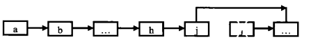 </div><br>


2 Otherwise, you need to first traverse the linked list, find the node before the node, and then let the previous node point to the next node of the node, the time complexity is O (N).

<div align="center"> 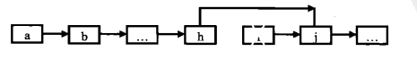 </div><br>

3 In summary, if N operations are performed, then the number of times the mobile node needs to be moved is N-1+N=2N-1, where N-1 is not the number of moves in the case of the tail node of the list, and N is the case of the tail node. The number of moves. (2N-1)/N \~ 2, so the time complexity of this algorithm is O(1).

```java
Public ListNode deleteNode(ListNode head, ListNode tobeDelete) {
    If (head == null || head.next == null || tobeDelete == null) return null;
    If (tobeDelete.next != null) {
        // The node to delete is not the tail node
        ListNode next = tobeDelete.next;
        tobeDelete.val = next.val;
        tobeDelete.next = next.next;
    } Else {
        ListNode cur = head;
        While (cur.next != tobeDelete) cur = cur.next;
        Cur.next = null;
    }
    Return head;
}
```

# 18.2 Deleting Duplicate Nodes in a List

## Title Description

```html
Input : 1->2->3->3->4->4->5
Output : 1->2->5
```

## Problem Description


```java
Public ListNode deleteDuplication(ListNode pHead) {
    If (pHead == null) return null;
    If (pHead.next == null) return pHead;
    If (pHead.val == pHead.next.val) {
        ListNode next = pHead.next;
        While (next != null && pHead.val == next.val) {
            Next = next.next;
        }
        Return deleteDuplication(next);
    } Else {
        pHead.next = deleteDuplication(pHead.next);
        Return pHead;
    }
}
```

# 19. Regular Expression Matching

## Title Description

Please implement a function to match regular expressions including '.' and '\*'. The character '.' in the pattern represents any one character, and '\*' means that the character preceding it can occur any number of times (including 0). In this question, matching means that all the characters of the string match the entire pattern. For example, the string "aaa" matches the patterns "a.a" and "ab\*ac\*a" but does not match "aa.a" and "ab\*a".

## problem-solving ideas

```java
Public boolean match(char[] s, char[] p) {
    Int n = s.length, m = p.length;
    Boolean[][] dp = new boolean[n + 1][m + 1];
    Dp[0][0] = true;
    For (int i = 1; i <= m; i++) {
        If (p[i - 1] == '*') {
            Dp[0][i] = dp[0][i - 2];
        }
    }
    For (int i = 1; i <= n; i++) {
        For (int j = 1; j <= m; j++) {
            If (s[i - 1] == p[j - 1] || p[j - 1] == '.') {
                Dp[i][j] = dp[i - 1][j - 1];
            } Else if (p[j - 1] == '*') {
                If (p[j - 2] == s[i - 1] || p[j - 2] == '.') {
                    Dp[i][j] = dp[i][j - 1] || dp[i][j - 2] || dp[i - 1][j];
                } Else {
                    Dp[i][j] = dp[i][j - 2];
                }
            }
        }
    }
    Return dp[n][m];
}
```

# 20. Strings that represent numeric values

## Title Description

Please implement a function to determine if the string represents a numeric value (including integers and decimals). For example, the strings "+100", "5e2", "-123", "3.1416", and "-1E-16" all represent numeric values. But "12e", "1a3.14", "1
Both .2.3", "+-5", and "12e+4.3" are not.

## problem-solving ideas

```java
Public boolean isNumeric(char[] str) {
    String string = String.valueOf(str);
    Return string.matches("[\\+-]?[0-9]*(\\.[0-9]*)?([eE][\\+-]?[0-9]+)? ");
}
```

# 21. Adjust the array order so that odd numbers are in front of even numbers

## Title Description

Ensure that the relative positions between odd and odd numbers, even and even, are constant, which is not the same as the book.

## problem-solving ideas

Complexity: O(n<sup>2</sup>) + O(1)

```java
Public void reOrderArray(int[] array) {
    Int n = array.length;
    For (int i = 0; i < n; i++) {
        If (array[i] % 2 == 0) {
            Int nextOddIdx = i + 1;
            While (nextOddIdx < n && array[nextOddIdx] % 2 == 0) nextOddIdx++;
            If (nextOddIdx == n) break;
            Int nextOddVal = array[nextOddIdx];
            For (int j = nextOddIdx; j > i; j--) {
                Array[j] = array[j - 1];
            }
            Array[i] = nextOddVal;
        }
    }
}
```

Complexity: O(n) + O(n)

```java
Public void reOrderArray(int[] array) {
    Int oddCnt = 0;
    For (int num : array) if (num % 2 == 1) oddCnt++;
    Int[] copy = array.clone();
    Int i = 0, j = oddCnt;
    For (int num : copy) {
        If (num % 2 == 1) array[i++] = num;
        Else array[j++] = num;
    }
}
```

# 22. The last K node in the list

## problem-solving ideas

Set the length of the list to N. With two pointers P1 and P2, let P1 move K nodes first, and then there are N-K nodes that can move. At this time, let P1 and P2 move at the same time. It can be known that when P1 moves to the end of the list, P2 moves to N-K nodes. This position is the Kth node from the bottom.

## problem-solving ideas

<div align="center"> 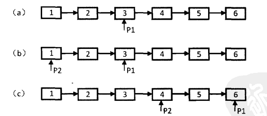 </div><br>

```java
Public ListNode FindKthToTail(ListNode head, int k) {
    If (head == null) return null;
    ListNode P1, P2;
    P1 = P2 = head;
    While (P1 != null && k-- > 0) P1 = P1.next;
    If (k > 0) return null;
    While (P1 != null) {
        P1 = P1.next;
        P2 = P2.next;
    }
    Return P2;
}
```

# 23. Inlet node of the ring in the linked list

## problem-solving ideas

With two pointers, one pointer fast moves two nodes at a time, and one pointer slow moves one node at a time. Because there are rings, the two pointers must meet on some node in the ring. At this point, the number of nodes that fast moves is x+2y+z, and slow is x+y. Because fast is twice as fast as slow, x+2y+z=2(x+y), which gives x=z.

At the encounter point, slow to move to the ring's entry point also needs to move z nodes. If you let fast restart from the beginning and the speed becomes one node at a time, then it needs to move x nodes to the ring entry point. In the above it has been deduced that x=z, so fast and slow will meet at the ring entry point.

<div align="center"> 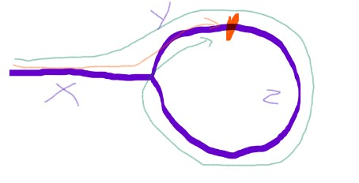 </div><br>

```java
Public ListNode EntryNodeOfLoop(ListNode pHead) {
    If (pHead == null) return null;
    ListNode slow = pHead, fast = pHead;
    While (fast != null && fast.next != null) {
        Fast = fast.next.next;
        Slow = slow.next;
        If (slow == fast) {
            Fast = pHead;
            While (slow != fast) {
                Slow = slow.next;
                Fast = fast.next;
            }
            Return slow;
        }
    }
    Return null;
}
```

# 24. Reverse the list

## problem-solving ideas

```java
Public ListNode ReverseList(ListNode head) {
    ListNode newList = new ListNode(-1);
    While (head != null) {
        ListNode next = head.next;
        Head.next = newList.next;
        newList.next = head;
        Head = next;
    }
    Return newList.next;
}
```

# 25. Merge two sorted linked lists

## Title Description

<div align="center"> 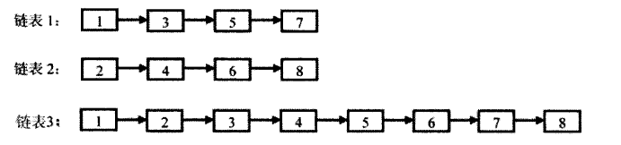 </div><br>

## problem-solving ideas

```java
Public ListNode Merge(ListNode list1, ListNode list2) {
    ListNode head = new ListNode(-1);
    ListNode cur = head;
    While (list1 != null && list2 != null) {
        If (list1.val < list2.val) {
            Cur.next = list1;
            List1 = list1.next;
        } Else {
            Cur.next = list2;
            List2 = list2.next;
        }
        Cur = cur.next;
    }
    If (list1 != null) cur.next = list1;
    If (list2 != null) cur.next = list2;
    Return head.next;
}
```

# 26. Substructure of the Tree

## Title Description

<div align="center"> 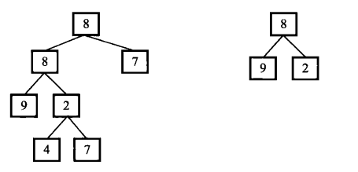 </div><br>

## problem-solving ideas

```java
Public boolean HasSubtree(TreeNode root1, TreeNode root2) {
    If (root1 == null || root2 == null) return false;
    Return isSubtree(root1, root2) || HasSubtree(root1.left, root2) || HasSubtree(root1.right, root2);
}

Private boolean isSubtree(TreeNode root1, TreeNode root2) {
    If (root1 == null && root2 == null) return true;
    If (root1 == null) return false;
    If (root2 == null) return true;
    If (root1.val != root2.val) return false;
    Return isSubtree(root1.left, root2.left) && isSubtree(root1.right, root2.right);
}
```

# 27. Binary Tree Mirroring

## Title Description

<div align="center"> 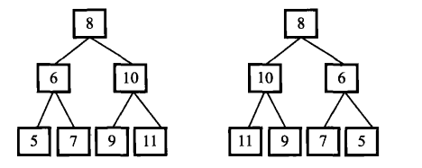 </div><br>

## problem-solving ideas

```java
Public void Mirror(TreeNode root) {
    If (root == null) return;
    TreeNode t = root.left;
    Root.left = root.right;
    Root.right = t;
    Mirror(root.left);
    Mirror(root.right);
}
```

# 28.1 Symmetrical Binary Tree

## Title Description

```html
    1
   / \
  twenty two
 / \ / \
3 4 4 3
```

## problem-solving ideas

```java
Boolean isSymmetrical(TreeNode pRoot) {
    If (pRoot == null) return true;
    Return isSymmetrical(pRoot.left, pRoot.right);
}

Boolean isSymmetrical(TreeNode t1, TreeNode t2) {
    If (t1 == null && t2 == null) return true;
    If (t1 == null || t2 == null) return false;
    If (t1.val != t2.val) return false;
    Return isSymmetrical(t1.left, t2.right) && isSymmetrical(t1.right, t2.left);
}
```

# 28.2 Balanced Binary Tree

## Title Description

```html
    3
   / \
  9 20
    / \
   15 7
```

The height difference between the left and right subtrees of the balanced binary tree does not exceed one.

## problem-solving ideas

```java
Private boolean isBalanced = true;

Public boolean IsBalanced_Solution(TreeNode root) {
    Height(root);
    Return isBalanced;
}

Private int height(TreeNode root) {
    If (root == null) return 0;
    Int left = height(root.left);
    Int right = height(root.right);
    If (Math.abs(left - right) > 1) isBalanced = false;
    Return 1 + Math.max(left, right);
}
```

# 29. Print the matrix clockwise

## Title Description

The following matrix clockwise prints: 1, 2, 3, 4, 8, 12, 16, 15, 14, 13, 9, 5, 6, 7, 11, 10

<div align="center"> 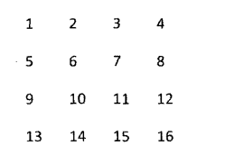 </div><br>

## problem-solving ideas

```java
Public ArrayList<Integer> printMatrix(int[][] matrix) {
    ArrayList<Integer> ret = new ArrayList<>();
    Int r1 = 0, r2 = matrix.length - 1, c1 = 0, c2 = matrix[0].length - 1;
    While (r1 <= r2 && c1 <= c2) {
        For (int i = c1; i <= c2; i++) ret.add(matrix[r1][i]);
        For (int i = r1 + 1; i <= r2; i++) ret.add(matrix[i][c2]);
        If (r1 != r2) for (int i = c2 - 1; i >= c1; i--) ret.add(matrix[r2][i]);
        If (c1 != c2) for (int i = r2 - 1; i > r1; i--) ret.add(matrix[i][c1]);
        R1++; r2--; c1++; c2--;
    }
    Return ret;
}
```

# 30. Stack with min function

## Title Description

To define the data structure of the stack, implement a min function that can get the smallest element of the stack in this type.

## problem-solving ideas

```java
Private Stack<Integer> stack = new Stack<>();
Private Stack<Integer> minStack = new Stack<>();
Private int min = Integer.MAX_VALUE;

Public void push(int node) {
    Stack.push(node);
    If (min > node) min = node;
    minStack.push(min);
}

Public void pop() {
    Stack.pop();
    minStack.pop();
    Min = minStack.peek();
}

Public int top() {
    Return stack.peek();
}

Public int min() {
    Return minStack.peek();
}
```

# 31. Stack push and pop sequence

## Title Description

Enter two integer sequences. The first sequence indicates the stacking order of the stack. Please determine if the second sequence is the stacking order of the stack. Assume that all the numbers pushed onto the stack are not equal. For example, sequences 1, 2, 3, 4, and 5 are the stacking order of a stack. Sequences 4, 5, 3, 2, and 1 are a pop-up sequence corresponding to the stacking sequence, but 4, 3, 5, 1, 2 It is impossible to be a pop-up sequence of the push sequence.

## problem-solving ideas

```java
Public boolean IsPopOrder(int[] pushA, int[] popA) {
    Int n = pushA.length;
    Stack<Integer> stack = new Stack<>();
    For (int i = 0, j = 0; i < n; i++) {
        Stack.push(pushA[i]);
        While (j < n && stack.peek() == popA[j]) {
            Stack.pop();
            j++;
        }
    }
    Return stack.isEmpty();
}
```

# 32.1 Print binary tree from top to bottom

## Title Description

Each node of the binary tree is printed from top to bottom, and the peer nodes print from left to right.

For example, the following binary tree hierarchy traversal results in 8, 6, 10, 5, 7, 9, 11

<div align="center"> 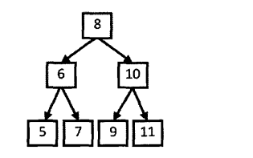 </div><br>

## problem-solving ideas

Use a queue for hierarchical traversal.

There is no need to use two queues to store the nodes of the current layer and the nodes of the next layer, respectively. Because at the beginning of traversing a layer of nodes, the number of nodes in the current queue is the number of nodes in the current layer, as long as the control traverses so many nodes. , we can guarantee that this traversal is the current layer of nodes.

```java
Public ArrayList<Integer> PrintFromTopToBottom(TreeNode root) {
    Queue<TreeNode> queue = new LinkedList<>();
    ArrayList<Integer> ret = new ArrayList<>();
    If (root == null) return ret;
    Queue.add(root);
    While (!queue.isEmpty()) {
        Int cnt = queue.size();
        For (int i = 0; i < cnt; i++) {
            TreeNode t = queue.poll();
            If (t.left != null) queue.add(t.left);
            If (t.right != null) queue.add(t.right);
            Ret.add(t.val);
        }
    }
    Return ret;
}
```

# 32.2 Print a binary tree in multiple lines

## Title Description

Almost the same as the above question.

## problem-solving ideas

```java
ArrayList<ArrayList<Integer>> Print(TreeNode pRoot) {
    ArrayList<ArrayList<Integer>> ret = new ArrayList<>();
    If (pRoot == null) return ret;
    Queue<TreeNode> queue = new LinkedList<>();
    Queue.add(pRoot);
    While (!queue.isEmpty()) {
        Int cnt = queue.size();
        ArrayList<Integer> list = new ArrayList<>();
        For (int i = 0; i < cnt; i++) {
            TreeNode node = queue.poll();
            List.add(node.val);
            If (node.left != null) queue.add(node.left);
            If (node.right != null) queue.add(node.right);
        }
        Ret.add(list);
    }
    Return ret;
}
```

# 32.3 Printing Binary Trees in Zigzag Order

## Title Description

Please implement a function to print the binary tree in zigzag, that is, the first line is printed from left to right, the second layer is printed from right to left, the third line is printed from left to right, and the other lines are And so on.

## problem-solving ideas

```java
Public ArrayList<ArrayList<Integer>> Print(TreeNode pRoot) {
    ArrayList<ArrayList<Integer>> ret = new ArrayList<>();
    If (pRoot == null) return ret;
    Queue<TreeNode> queue = new LinkedList<>();
    Queue.add(pRoot);
    Boolean reverse = false;
    While (!queue.isEmpty()) {
        Int cnt = queue.size();
        ArrayList<Integer> list = new ArrayList<>();
        For (int i = 0; i < cnt; i++) {
            TreeNode node = queue.poll();
            List.add(node.val);
            If (node.left != null) queue.add(node.left);
            If (node.right != null) queue.add(node.right);
        }
        If (reverse) {
            Collections.reverse(list);
            Reverse = false;
        } Else {
            Reverse = true;
        }
        Ret.add(list);
    }
    Return ret;
}
```

# 33. Post-order traversal sequence of binary search tree

## Title Description

Enter an array of integers to determine if the array is the result of a post-order traversal of a binary search tree.

For example, the following figure traverses the binary search tree corresponding to the sequence 5, 7, 6, 9, 11, 10, 8 in the following sequence.

<div align="center"> 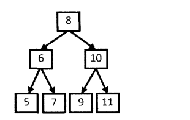 </div><br>

## problem-solving ideas

```java
Public boolean VerifySquenceOfBST(int[] sequence) {
    If (sequence.length == 0) return false;
    Return verify(sequence, 0, sequence.length - 1);
}

Private boolean verify(int[] sequence, int first, int last) {
    If (last - first <= 1) return true;
    Int rootVal = sequence[last];
    Int cutIndex = first;
    While (cutIndex < last && sequence[cutIndex] <= rootVal) cutIndex++;
    For (int i = cutIndex + 1; i < last; i++) {
        If (sequence[i] < rootVal) return false;
    }
    Return verify(sequence, first, cutIndex - 1) && verify(sequence, cutIndex, last - 1);
}
```

#34. The Binary Tree Neutralizes the Path to a Value

## Title Description

Enter a binary tree and an integer to print out all the paths where the sum of the node values ​​in the binary tree is the input integer. The path is defined as forming a path from the root node of the tree to the node passed by the leaf node.

The binary tree in the figure below has two and 22 paths: 10, 5, 7 and 10, 12

<div align="center"> 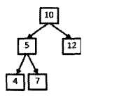 </div><br>

## problem-solving ideas

```java
Private ArrayList<ArrayList<Integer>> ret = new ArrayList<>();

Public ArrayList<ArrayList<Integer>> FindPath(TreeNode root, int target) {
    Dfs(root, target, 0, new ArrayList<>());
    Return ret;
}

Private void dfs(TreeNode node, int target, int curSum, ArrayList<Integer> path) {
    If (node ​​== null) return;
    curSum += node.val;
    Path.add(node.val);
    If (curSum == target && node.left == null && node.right == null) {
        Ret.add(new ArrayList(path));
    } Else {
        Dfs(node.left, target, curSum, path);
        Dfs(node.right, target, curSum, path);
    }
    Path.remove(path.size() - 1);
}
```

# 35. Replication of complex linked lists

## Title Description

Enter a complex list (each node has a node value, and two pointers, one to the next node, and another special pointer to any node), the result is the head of the complex linked list after replication. (Note that do not return the node reference in the parameter in the output, otherwise the issuer will return null directly)

<div align="center"> 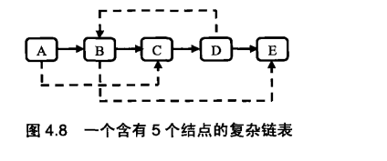 </div><br>

## problem-solving ideas

The first step is to insert the copied node after each node.

<div align="center"> 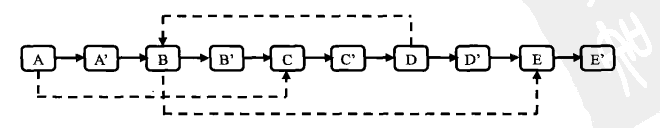 </div><br>

The second step is to assign a random link to the copy node.

<div align="center"> 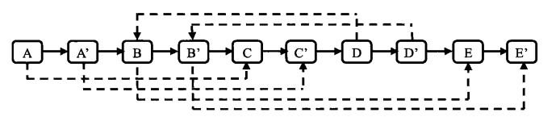 </div><br>

The third step, split.

<div align="center"> 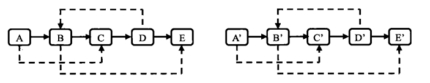 </div><br>

```java
Public RandomListNode Clone(RandomListNode pHead) {
    If (pHead == null) {
        Return null;
    }
    // Insert new node
    RandomListNode cur = pHead;
    While (cur != null) {
        RandomListNode clone = new RandomListNode(cur.label);
        Clone.next = cur.next;
        Cur.next = clone;
        Cur = clone.next;
    }
    // Create a random link
    Cur = pHead;
    While (cur != null) {
        RandomListNode cl
One = cur.next;
        If (cur.random != null) {
            Clone.random = cur.random.next;
        }
        Cur = clone.next;
    }
    // Split
    Cur = pHead;
    RandomListNode pCloneHead = pHead.next;
    While (cur.next != null) {
        RandomListNode next = cur.next;
        Cur.next = next.next;
        Cur = next;
    }
    Return pCloneHead;
}
```

# 36. Binary Search Tree and Doubly Linked List

## Title Description

Enter a binary search tree to convert the binary search tree into a sorted double-linked list. Requirements can not create any new nodes, can only adjust the point of the node pointer in the tree.

<div align="center"> 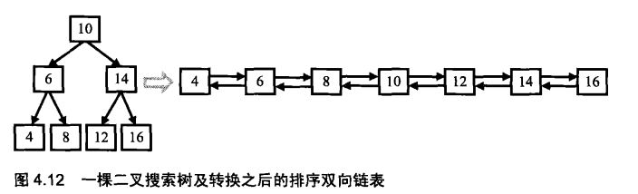 </div><br>

## problem-solving ideas

```java
Private TreeNode pre = null;
Public TreeNode Convert(TreeNode pRootOfTree) {
    If(pRootOfTree == null) return null;
    inOrder(pRootOfTree);
    While(pRootOfTree.left != null) pRootOfTree = pRootOfTree.left;
    Return pRootOfTree;
}

Private void inOrder(TreeNode node) {
    If(node ​​== null) return;
    inOrder(node.left);
    Node.left = pre;
    If(pre != null) pre.right = node;
    Pre = node;
    inOrder(node.right);
}
```

# 37. Serialized Binary Tree

## Title Description

Please implement two functions to serialize and deserialize the binary tree.

## problem-solving ideas

```java
Public class Solution {

    Private String deserializeStr;

    Public String Serialize(TreeNode root) {
        If (root == null) return "#";
        Return root.val + " " + Serialize(root.left) + " " + Serialize(root.right);
    }

    Public TreeNode Deserialize(String str) {
        deserializeStr = str;
        Return Deserialize();
    }

    Private TreeNode Deserialize() {
        If (deserializeStr.length() == 0) return null;
        Int index = deserializeStr.indexOf(" ");
        String node = index == -1 ? deserializeStr : deserializeStr.substring(0, index);
        deserializeStr = index == -1 ? "" : deserializeStr.substring(index + 1);
        If (node.equals("#")) return null;
        Int val = Integer.valueOf(node);
        TreeNode t = new TreeNode(val);
        T.left = Deserialize();
        T.right = Deserialize();
        Return t;
    }
}
```

# 38. Arrangement of strings

## Title Description

Enter a string that prints out all the permutations of characters in the string in lexicographical order. For example, if the string abc is input, all the strings abc, acb, bac, bca, cab and cba that can be arranged by the characters a, b, and c are printed out.

## problem-solving ideas

```java
Private ArrayList<String> ret = new ArrayList<>();

Public ArrayList<String> Permutation(String str) {
    If (str.length() == 0) return ret;
    Char[] chars = str.toCharArray();
    Arrays.sort(chars);
    Backtracking(chars, new boolean[chars.length], new StringBuffer());
    Return ret;
}

Private void backtracking(char[] chars, boolean[] hasUsed, StringBuffer s) {
    If (s.length() == chars.length) {
        Ret.add(s.toString());
        Return;
    }
    For (int i = 0; i < chars.length; i++) {
        If (hasUsed[i]) continue;
        If (i != 0 && chars[i] == chars[i - 1] && !hasUsed[i - 1]) continue; // guaranteed not to repeat
        hasUsed[i] = true;
        S.append(chars[i]);
        Backtracking(chars, hasUsed, s);
        s.deleteCharAt(s.length() - 1);
        hasUsed[i] = false;
    }
}
```

# 39. Numbers that appear in the array more than half times

## problem-solving ideas

For the majority vote problem, the Boyer-Moore Majority Vote Algorithm can be used to solve this problem, making the time complexity O(n).

Use cnt to count the number of occurrences of an element. When traversing elements and statistics do not want to wait, make cnt--. If you look for i elements earlier and cnt == 0, the first i elements have no majority or majority, but the number of occurrences is less than i/2, because if more than i/2, cnt will not be 0. At this time, the number of majorities in the remaining n - i elements is still greater than (n - i)/2, so if you continue searching, you can find the majority.

```java
Public int MoreThanHalfNum_Solution(int[] nums) {
    Int cnt = 1, num = nums[0];
    For (int i = 1; i < nums.length; i++) {
        If (nums[i] == num) cnt++;
        Else cnt--;
        If (cnt == 0) {
            Num = nums[i];
            Cnt = 1;
        }
    }
    Cnt = 0;
    For (int i = 0; i < nums.length; i++) {
        If (num == nums[i]) cnt++;
    }
    Return cnt > nums.length / 2 ? num : 0;
}
```

# 40. The minimum number of K

## problem-solving ideas

### quick selection

- Complexity: O(N) + O(1)
- Can only be used when the array element can be modified

The fast-ordering partition() method returns an integer j such that a[lo..j-1] is less than or equal to a[j], and a[j+1..hi] is greater than or equal to a[j]. [j] is the jth element of the array. This feature can be used to find the Kth element of the array. The algorithm for finding the Kth element is called the fast selection algorithm.

After finding the Kth element, you can iterate through the array again. All array elements that are less than or equal to the element are in the smallest K number.

```java
Public ArrayList<Integer> GetLeastNumbers_Solution(int[] nums, int k) {
    If (k > nums.length || k <= 0) return new ArrayList<>();
    Int kthSmallest = findKthSmallest(nums, k - 1);
    ArrayList<Integer> ret = new ArrayList<>();
    For (int num : nums) {
        If (num <= kthSmallest && ret.size() < k) ret.add(num);
    }
    Return ret;
}

Public int findKthSmallest(int[] nums, int k) {
    Int lo = 0;
    Int hi = nums.length - 1;
    While (lo < hi) {
        Int j = partition(nums, lo, hi);
        If (j < k) {
            Lo = j + 1;
        } Else if (j > k) {
            Hi = j - 1;
        } Else {
            Break;
        }
    }
    Return nums[k];
}

Private int partition(int[] nums, int lo, int hi) {
    Int i = lo;
    Int j = hi + 1;
    While (true) {
        While (i < hi && less(nums[++i], nums[lo])) ;
        While (j > lo && less(nums[lo], nums[--j])) ;
        If (i >= j) {
            Break;
        }
        Exch(nums, i, j);
    }
    Exch(nums, lo, j);
    Return j;
}

Private void exch(int[] nums, int i, int j) {
    Final int tmp = nums[i];
    Nums[i] = nums[j];
    Nums[j] = tmp;
}

Private boolean less(int v, int w) {
    Return v < w;
}
```

### The smallest heap of size K

- Complexity: O(NlogK) + O(K)
- Particularly suitable for processing large amounts of data

It should be noted that the big heap should be used to maintain the minimum heap. It is not possible to create a small top heap directly and set a size in an attempt to make the elements in the small top heap the smallest elements.

The process of maintaining a minimum heap size of K is as follows: Add an element first. After the addition, if the size of the large top heap is larger than K, then the top element of the large top heap needs to be removed.

```java
Public ArrayList<Integer> GetLeastNumbers_Solution(int[] input, int k) {
    If (k > input.length || k <= 0) return new ArrayList<>();
    PriorityQueue<Integer> maxHeap = new PriorityQueue<>((o1, o2) -> o2 - o1);
    For (int num : input) {
        maxHeap.add(num);
        If (maxHeap.size() > k) {
            maxHeap.poll();
        }
    }
    ArrayList<Integer> ret = new ArrayList<>(maxHeap);
    Return ret;
}
```

# 41.1 Median in the data stream

## Title Description

How to get the median in a data stream? If you read an odd number of values ​​from the data stream, then the median is the number that is in the middle after all values ​​are sorted. If you read an even number of values ​​from the data stream, the median is the average of the middle two numbers after all values ​​are sorted.

## problem-solving ideas

```java
Public class Solution {
    // Big top heap, storing the left half of the element
    Private PriorityQueue<Integer> left = new PriorityQueue<>((o1, o2) -> o2 - o1);
    // Small top heap, storing the right half of the element, and the right half of the element is greater than the left half
    Private PriorityQueue<Integer> right = new PriorityQueue<>();
    // The number of elements read by the current stream
    Private int N = 0;

    Public void Insert(Integer num) {
        // Insert to ensure that two heaps are in balance
        If (N % 2 == 0) {
            // Insert to the right half if N is even.
            // Because the right half of the element is larger than the left half, the newly inserted element is not necessarily larger than the left half of the element.
            // So you need to insert the element into the left half first, then use the left half as the characteristics of the big top heap, take out the top element is the largest element, then insert the right half
            Left.add(num);
            Right.add(left.poll());
        } Else {
            Right.add(num);
            Left.add(right.poll());
        }
        N++;
    }

    Public Double GetMedian() {
        If (N % 2 == 0) {
            Return (left.peek() + right.peek()) / 2.0;
        } Else {
            Return (double) right.peek();
        }
    }
}
```

# 41.2 The first non-repeating character in the character stream

## Title Description

Please implement a function to find the first occurrence of a character in the character stream. For example, when the first two characters "go" are read out from the stream of characters, the first character that appears only once is "g". When reading the first six characters "google" from this stream of characters, the first character that appears only once is "l".

## problem-solving ideas

```java
Public class Solution {
    Private int[] cnts = new int[256];
    Private Queue<Character> queue = new LinkedList<>();

    Public void Insert(char ch) {
        Cnts[ch]++;
        Queue.add(ch);
        While (!queue.isEmpty() && cnts[queue.peek()] > 1) {
            Queue.poll();
        }
    }

    Public char FirstAppearingOnce() {
        If (queue.isEmpty()) return '#';
        Return queue.peek();
    }
}
```

# 42. Maximum sum of consecutive subarrays

## Title Description

{6,-3,-2,7,-15,1,2,2}, The maximum sum of consecutive subvectors is 8 (starting at 0 and ending at 3).

## problem-solving ideas

```java
Public int FindGreatestSumOfSubArray(int[] nums) {
    If (nums.length == 0) return 0;
    Int ret = Integer.MIN_VALUE;
    Int sum = 0;
    For (int num : nums) {
        If (sum <= 0) sum = num;
        Else sum += num;
        Ret = Math.max(ret, sum);
    }
    Return ret;
}
```

# 43. The number of occurrences of 1 in an integer from 1 to n

Solution Reference: [Leetcode: 233. Number of Digit One](https://leetcode.com/problems/number-of-digit-one/discuss/64381/4+-lines-O(log-n)-C ++JavaPython)

```java
Public int NumberOf1Between1AndN_Solution(int n) {
    Int cnt = 0;
    For (int m = 1; m <= n; m *= 10) {
        Int a = n / m, b = n % m;
        Cnt += (a + 8) / 10 * m + (a % 10 == 1 ? b + 1 : 0);
    }
    Return cnt;
}
```

# 44. A digit in a digit sequence

## Title Description

The numbers are serialized into a string in the format 0123456789101112131415... and the index bit of this string is evaluated.

## problem-solving ideas

```java
Public int digitAtIndex(int ​​index) {
    If (index < 0) return -1;
    Int digit = 1;
    While (true) {
        Int amount = getAmountOfDigit(digit);
        Int totalAmount = amount * digit;
        If (index < totalAmount) {
            Return digitAtIndex(index, digit);
        }
        Index -= totalAmount;
        Digit++;
    }
}

/**
 The digit length of the digit digit
 * eg digit = 2, return 90
 */
Private int getAmountOfDigit(int digit) {
    If (digit == 1) return 10;
    Return (int) Math.pow(10, digit - 1) * 9;
}

/**
 * In the string of digit digits, the index is the number
 */
Private int digitAtIndex(int ​​index, int digit) {
    Int number = beginNumber(digit) + index / digit;
    Int remain = index % digit;
    Return (number + "").charAt(remain) - '0';
}

/**
 * digit starting digit
 * eg digit = 2 return 10
 */
Private int beginNumber(int digit) {
    If (digit == 1) return 0;
    Return (int) Math.pow(10, digit - 1);
}
```

# 45. Put the array into the smallest number

## Title Description

Enter an array of positive integers, arranging all the numbers in the array into a single number, and printing the smallest of all the numbers that can be stitched. For example, if you enter the array {3, 32, 321}, the smallest number that can be printed out is 321323.

## problem-solving ideas

It can be seen as a sorting problem. When comparing the sizes of the two strings S1 and S2, the size of S1+S2 and S2+S1 should be compared. If S1+S2 >= S2+S1, S1 should be ranked. In front, otherwise S2 should be ranked first.

```java
Public String PrintMinNumber(int[] numbers) {
    Int n = numbers.length;
    String[] nums = new String[n];
    For (int i = 0; i < n; i++) nums[i] = numbers[i] + "";
    Arrays.sort(nums, (s1, s2) -> (s1 + s2).compareTo(s2 + s1));
    String ret = "";
    For (String str : nums) ret += str;
    Return ret;
}
```

# 46. Translating numbers into strings

## Title Description

Given a number, it is translated into a string as follows: 0 translates to "a", 1 translates to "b"...25 translates to "z". There are multiple translation possibilities for a number, such as 12258 and 5 in total, namely bccfi, bwfi, bczi, mcfi, mzi. Implement a function that calculates how many different translation methods a number has.

## problem-solving ideas

```java
Public int getTranslationCount(String number) {
    Int n = number.length();
    Int[] counts = new int[n + 1];
    Counts[n - 1] = counts[n] = 1;
    For (int i = n - 2; i >= 0; i--) {
        Counts[i] = counts[i + 1];
        Int converted = Integer.valueOf(number.substring(i, i + 2));
        If (converted >= 10 && converted <= 25) {
            Counts[i] += counts[i + 2];
        }
    }
    Return counts[0];
}
```

# 47. The greatest value of gifts

## Title Description

Each box on a m\*n board has a gift and each gift has a certain value (greater than 0). Take the gift from the top left corner and move it one space at a time to the right or down until the bottom right corner. Given a board, get the maximum value of the gift. For example, for the following board

```
1 10 3 8
12 2 9 6
5 7 4 11
3 7 16 5
```

The greatest value of a gift is 1+12+5+7+7+16+5=53.

## problem-solving ideas

Instead of depth-first search, dynamic programming should be used. Depth-first search is too complex and not an optimal solution.

```java
Public int getMaxValue(int[][] values) {
    If (values ​​== null || values.length == 0 || values[0].length == 0) return 0;
    Int m = values.length;
    Int n = values[0].length;
    Int[] dp = new int[n];
    For (int i = 0; i < m; i++) {
        Dp[0] += values[i][0];
        For (int j = 1; j < n; j++) {
            Dp[j] = Math.max(dp[j], dp[j - 1]) + values[i][j];
        }
    }
    Return dp[n - 1];
}
```

# 48. Longest substring without repeating characters

## Title Description

Enter a string (containing only the characters a\~z) and find the length of the substring whose maximum length is without duplicate characters. For example, for arabcacfr, the longest subcharacter-free substring is acfr and its length is 4.

## problem-solving ideas

```java
Public int longestSubStringWithoutDuplication(String str) {
    Int curLen = 0;
    Int maxLen = 0;
    Int[] indexs = new int[26];
    For (int i = 0; i < str.length(); i++) {
        Int c = str.charAt(i) - 'a';
        Int preIndex = indexs[c];
        If (preIndex == -1 || i - preIndex > curLen) curLen++;
        Else {
            maxLen = Math.max(maxLen, curLen);
            curLen = i - preIndex;
        }
        Indexs[c] = i;
    }
    maxLen = Math.max(maxLen, curLen);
    Return maxLen;
}
```

# 49. Ugly

## Title Description

Put only contains ›
The number of children 2, 3, and 5 is called Ugly Number. For example, 6 and 8 are ugly numbers, but 14 is not because it contains a factor of 7. We habitually regard 1 as the first ugly number. Find the Nth ugly in ascending order.

## problem-solving ideas

```java
Public int GetUglyNumber_Solution(int N) {
    If (N <= 6) return N;
    Int i2 = 0, i3 = 0, i5 = 0;
    Int cnt = 1;
    Int[] dp = new int[N];
    Dp[0] = 1;
    While (cnt < N) {
        Int n2 = dp[i2] * 2, n3 = dp[i3] * 3, n5 = dp[i5] * 5;
        Int min = Math.min(n2, Math.min(n3, n5));
        Dp[cnt++] = min;
        If (min == n2) i2++;
        If (min == n3) i3++;
        If (min == n5) i5++;
    }
    Return dp[N - 1];
}
```

# 50. The first character position that appears only once

```java
Public int FirstNotRepeatingChar(String str) {
    Int[] cnts = new int[256];
    For (int i = 0; i < str.length(); i++) cnts[str.charAt(i)]++;
    For (int i = 0; i < str.length(); i++) if (cnts[str.charAt(i)] == 1) return i;
    Return -1;
}
```

## 51. Reverse Arrays in Arrays

## Title Description

Two numbers in an array, if the previous number is greater than the following number, the two numbers form a reverse pair. Enter an array and find the total number P of reversed pairs in this array.

## problem-solving ideas

```java
Private long cnt = 0;
Private int[] tmp; // Create an auxiliary array here instead of creating it in the merge() recursive function

Public int InversePairs(int[] nums) {
    Tmp = new int[nums.length];
    mergeSortUp2Down(nums, 0, nums.length - 1);
    Return (int) (cnt % 1000000007);
}

Private void mergeSortUp2Down(int[] nums, int start, int end) {
    If (end - start < 1) return;
    Int mid = start + (end - start) / 2;
    mergeSortUp2Down(nums, start, mid);
    mergeSortUp2Down(nums, mid + 1, end);
    Merge(nums, start, mid, end);
}

Private void merge(int[] nums, int start, int mid, int end) {
    Int i = start, j = mid + 1, k = start;
    While (i <= mid || j <= end) {
        If (i > mid) tmp[k] = nums[j++];
        Else if (j > end) tmp[k] = nums[i++];
        Else if (nums[i] < nums[j]) tmp[k] = nums[i++];
        Else {
            Tmp[k] = nums[j++];
            This.cnt += mid - i + 1; // a[i] > a[j], indicating that a[i...mid] is greater than a[j]
        }
        k++;
    }
    For (k = start; k <= end; k++) {
        Nums[k] = tmp[k];
    }
}
```

# 52. The first public node of the two linked lists

## Title Description

```html
A: a1 → a2
                  ↘
                    C1 → c2 → c3
                  ↗
B: b1 → b2 → b3
```

## problem-solving ideas

Let A be a + c, and B be b + c, where c is the length of the common part of the tail, and we know that a + c + b = b + c + a.

When the pointer to the A list accesses the end of the list, it accesses the list B from the head of the list B; Similarly, when the pointer to the B list accesses the end of the list, it is accessed from the head of the list A. List A. In this way, the pointers accessing the two linked lists of A and B can be controlled to access the intersection point at the same time.

```java
Public ListNode FindFirstCommonNode(ListNode pHead1, ListNode pHead2) {
    ListNode l1 = pHead1, l2 = pHead2;
    While (l1 != l2) {
        L1 = (l1 == null) ? pHead2 : l1.next;
        L2 = (l2 == null) ? pHead1 : l2.next;
    }
    Return l1;
}
```

# 53 number of times the number appears in the sorted array

## Title Description

```html
Input:
1, 2, 3, 3, 3, 3, 4, 6
3
Output:
4
````

## problem-solving ideas

You can use binary search to find the numbers at the left and right ends of the array.

```java
Public int GetNumberOfK(int[] nums, int K) {
    Int first = getFirstK(nums, K);
    Int last = getLastK(nums, K);
    Return first == -1 || last == -1 ? 0 : last - first + 1;
}

Private int getFirstK(int[] nums, int K) {
    Int l = 0, h = nums.length - 1;
    While (l <= h) {
        Int m = l + (h - l) / 2;
        If (nums[m] >= K) h = m - 1;
        Else l = m + 1;
    }
    If (l > nums.length - 1 || nums[l] != K) return -1;
    Return l;
}

Private int getLastK(int[] nums, int K) {
    Int l = 0, h = nums.length - 1;
    While (l <= h) {
        Int m = l + (h - l) / 2;
        If (nums[m] > K) h = m - 1;
        Else l = m + 1;
    }
    If (h < 0 || nums[h] != K) return -1;
    Return h;
}
```

# 54. The k-th node of the binary search tree

## problem-solving ideas

The use of binary search number in order to traverse the ordered features.

```java
TreeNode ret;
Int cnt = 0;

TreeNode KthNode(TreeNode pRoot, int k) {
    inOrder(pRoot, k);
    Return ret;
}

Private void inOrder(TreeNode root, int k) {
    If (root == null || cnt > k) return;
    inOrder(root.left, k);
    Cnt++;
    If (cnt == k) ret = root;
    inOrder(root.right, k);
}
```

#55 Binary Tree Depth

```java
Public int TreeDepth(TreeNode root) {
    If (root == null) return 0;
    Return 1 + Math.max(TreeDepth(root.left), TreeDepth(root.right));
}
```

# 56. Numbers that appear only once in the array

## Title Description

In addition to two digits in an integer array, the other digits appear twice to find the two numbers.

## problem-solving ideas

Two unequal elements must have a difference in bit-level representation.

The result of XORing all the elements of the array is the result of no exclusive OR of duplicated two elements.

Diff &= -diff Gets the bit on the far right of diff that is not 0, that is, there is no duplicated two element in the bit-level representation. The rightmost bit is different. Use this bit to place two elements. differentiate.

```java
Public void FindNumsAppearOnce(int[] array, int num1[], int num2[]) {
    Int diff = 0;
    For (int num : array) diff ^= num;
    // Get the rightmost one
    Diff &= -diff;
    For (int num : array) {
        If ((num & diff) == 0) num1[0] ^= num;
        Else num2[0] ^= num;
    }
}
```

# 57.1 and two digits for S

## Title Description

Enter an array of increasing ordering and a number S. Find two numbers in the array. Their sum is exactly S. If the sum of multiple pairs of numbers is equal to S, the product of the two outputs is the smallest.

## problem-solving ideas

With two pointers, one pointer points to the smaller value of the element and one pointer points to the larger value of the element. A pointer to a smaller element traverses from head to tail, and a pointer to a larger element traverses from tail to head.

If two pointers point to the element sum sum == target, then the desired result is obtained; if sum > target, move the larger element to make the sum smaller; if sum < target, move the smaller element so that the sum changes Bigger.

```java
Public ArrayList<Integer> FindNumbersWithSum(int[] array, int sum) {
    Int i = 0, j = array.length - 1;
    While (i < j) {
        Int cur = array[i] + array[j];
        If (cur == sum) return new ArrayList<Integer>(Arrays.asList(array[i], array[j]));
        Else if (cur < sum) i++;
        Else j--;
    }
    Return new ArrayList<Integer>();
}
```

# 57.2 Sum of consecutive positive numbers for S

## Title Description

There are 18, 19, 20, 21, 22 in the continuum of 100.

## problem-solving ideas

```java
Public ArrayList<ArrayList<Integer>> FindContinuousSequence(int sum) {
    ArrayList<ArrayList<Integer>> ret = new ArrayList<>();
    Int start = 1, end = 2;
    Int mid = sum / 2;
    Int curSum = 3;
    While (start <= mid && end < sum) {
        If (curSum > sum) {
            curSum -= start;
            Start++;
        } else if (curSum < sum) {
            End++;
            curSum += end;
        } Else {
            ArrayList<Integer> list = new ArrayList<>();
            For (int i = start; i <= end; i++) {
                List.add(i);
            }
            Ret.add(list);
            curSum -= start;
            Start++;
            End++;
            curSum += end;
        }
    }
    Return ret;
}
```

# 58.1 Flip word order column

## Title Description

Enter: "I am a student."

Output: "student. a am I"

## problem-solving ideas

The topic should have an implied condition that no extra space be used. Although Java's title input parameter is of type String, you need to first create an array of characters such that the space complexity is O(n), but the correct parameter type should be the same as the original book, an array of characters, and you can only use space for that character array. . Any solution that uses extra space will be compromised during interviews, including recursive solutions. The correct solution should be the same as in the book. First rotate each word and then rotate the entire string.

```java
Public String ReverseSentence(String str) {
    If (str.length() == 0) return str;
    Int n = str.length();
    Char[] chars = str.toCharArray();
    Int start = 0, end = 0;
    While (end <= n) {
        If (end == n || chars[end] == '') {
            Reverse(chars, start, end - 1);
            Start = end + 1;
        }
        End++;
    }
    Reverse(chars, 0, n - 1);
    Return new String(chars);
}

Private void reverse(char[] c, int start, int end) {
    While (start < end) {
        Char t = c[start];
        c[start] = c[end];
        c[end] = t;
        Start++;
        End--;
    }
}
```

# 58.2 Rotate the string left

## Title Description

For a given character sequence S, please rotate it to the left by K-bit sequence output. For example, the character sequence S = "abcXYZdef" requires that the output be left shifted by 3 bits, that is, "XYZdefabc".

## problem-solving ideas

```java
Public String LeftRotateString(String str, int k) {
    If (str.length() == 0) return "";
    Char[] c = str.toCharArray();
    Reverse(c, 0, k - 1);
    Reverse(c, k, c.length - 1);
    Reverse(c, 0, c.length - 1);
    Return new String(c);
}

Private void reverse(char[] c, int i, int j) {
    While (i < j) {
        Char t = c[i];
        c[i] = c[j];
        c[j] = t;
        i++;
        J--;
    }
}
```

# 59. Maximum sliding window

## Title Description

Given the size of an array and sliding window, find the maximum value of all sliding windows. For example, if you enter the arrays {2, 3, 4, 2, 6, 2, 5, 1} and the sliding window size 3, there are a total of six sliding windows, their maximum values ​​are {4, 4, 6, respectively. 6, 6, 5}.

## problem-solving ideas

```java
Public ArrayList<Integer> maxInWindows(int[] num, int size) {
    ArrayList<Integer> ret = new ArrayList<>();
    If (size > num.length || size < 1) return ret;
    // Build the maximum heap, that is, the heap top element is the maximum value of the heap.
    PriorityQueue<Integer> heap = new PriorityQueue<Integer>((o1, o2) -> o2 - o1);
    For (int i = 0; i < size; i++) heap.add(num[i]);
    Ret.add(heap.peek());
    For (int i = 1; i + size - 1 < num.length; i++) {
        Heap.remove(num[i - 1]);
        Heap.add(num[i + size - 1]);
        Ret.add(heap.peek());
    }
    Return ret;
}
```

# 60. Number of n dice

## Title Description

With n dice still on the ground, find the probability that the point sum is s.

## problem-solving ideas

### Dynamic Programming Solution

Spatial complexity: O(n<sup>2</sup>)

```java
Private static int face = 6;

Public double countProbability(int n, int s) {
    If (n < 1 || s < n) return 0.0;
    Int pointNum = face * n;
    Int[][] dp = new int[n][pointNum];
    For (int i = 0; i < face; i++) {
        Dp[0][i] = 1;
    }
    For (int i = 1; i < n; i++) {
        For (int j = i; j < pointNum; j++) { // use i die for the minimum number of points i
            For (int k = 1; k <= face; k++) {
                If (j - k >= 0) {
                    Dp[i][j] += dp[i - 1][j - k];
                }
            }
        }
    }
    Int totalNum = (int) Math.pow(6, n);
    Return (double) dp[n - 1][s - 1] / totalNum;
}
```

### Dynamic Programming Solutions + Rotating Arrays

Spatial complexity: O(n)

```java
Private static int face = 6;

Public double countProbability(int n, int s) {
    If (n < 1 || s < n) return 0.0;
    Int pointNum = face * n;
    Int[][] dp = new int[2][pointNum];
    For (int i = 0; i < face; i++) {
        Dp[0][i] = 1;
    }
    Int flag = 1;
    For (int i = 1; i < n; i++) {
        For (int j = i; j < pointNum; j++) { // use i die for the minimum number of points i
            For (int k = 1; k <= face; k++) {
                If (j - k >= 0) {
                    Dp[flag][j] += dp[1 - flag][j - k];
                }
            }
        }
        Flag = 1 - flag;
    }
    Int totalNum = (int) Math.pow(6, n);
    Return (double) dp[n - 1][s - 1] / totalNum;
}
```

# 61. Playing cards straight

## Title Description

Five cards, of which the size is ghosts, and the size of the card is 0. Determine if you can make a straight.

## problem-solving ideas

```java
Public boolean isContinuous(int [] numbers) {
    If(numbers.length < 5) return false;
    Arrays.sort(numbers);
    Int cnt = 0;
    For(int num : numbers) if(num == 0) cnt++;
    For(int i = cnt; i < numbers.length - 1; i++) {
        If(numbers[i + 1] == numbers[i]) return false;
        Int interval = numbers[i + 1] - numbers[i] - 1;
        If(interval > cnt) return false;
        Cnt -= interval;
    }
    Return true;
}
```

# 62. The last remaining number in the circle

## Title Description

Let the children form a big circle. Then, he randomly assigns a number m to let the number 0 begin to report. Every time the child shouting to m-1 wants to make a pop song, he can then randomly select gifts in the gift box and stop going back to the circle, starting from his next child, continuing 0...m -1 Counting .... This goes on.... Until the last child is left, you don't need to perform.

## problem-solving ideas

Joseph Ring

```java
Public int LastRemaining_Solution(int n, int m) {
    If (n == 0) return -1;
    If (n == 1) return 0;
    Return (LastRemaining_Solution(n - 1, m) + m) % n;
}
```

# 63. Maximum Profit of Stocks

## Title Description

There can be one buy and one sell, and the buy must be first. Seeking maximum benefit.

## problem-solving ideas

```java
Public int maxProfit(int[] prices) {
    Int n = prices.length;
    If(n == 0) return 0;
    Int soFarMin = prices[0];
    Int max = 0;
    For(int i = 1; i < n; i++) {
        If(soFarMin > prices[i]) soFarMin = prices[i];
        Else max = Math.max(max, prices[i] - soFarMin);
    }
    Return max;
}
```

# 64. Seeking 1+2+3+...+n

## Title Description

For 1+2+3+...+n, you must not use keywords such as multiplication, division, for, while, if, else, switch, case, and conditional statements (A?B:C).

## problem-solving ideas

```java
Public int Sum_Solution(int n) {
    Int sum = n;
    Boolean b = (n > 0) && ((sum += Sum_Solution(n - 1)) > 0);
    Return sum;
}
```

# 65. Addition, subtraction, multiplication and addition are not required

a ^ b represents the sum of two numbers without considering the carry. (a & b) << 1 is the carry. The reason why the recursion will end is (a & b) << 1 The rightmost one will have a 0, then continue to recursively, the rightmost 0 of the carry will slowly increase, the last carry will become 0, and the recursion will terminate.

```java
Public int Add(int num1, int num2) {
    If(num2 == 0) return num1;
    Return Add(num1 ^ num2, (num1 & num2) << 1);
}
```

# 66. Building an array of products

## Title Description

Given an array A[0, 1, ..., n-1], construct an array B[0, 1, ..., n-1], where the element B in B is = A[ 0]\*A[1]\*...\*A[i-1]\*A[i+1]\*...\*A[n-1]. Divide cannot be used.

## problem-solving ideas

```java
Public int[] multiply(int[] A) {
    Int n = A.length;
    Int[] B = new int[n];
    For (int i = 0, product = 1; i < n; product *= A[i], i++) {
        B[i] = product;
    }
    For (int i = n - 1, product = 1; i >= 0; product *= A[i], i--) {
        B[i] *= product;
    }
    Return B;
}
```

# 67. Convert a String to an Integer

```java
Public int StrToInt(String str) {
    If (str.length() == 0) retu
rn 0;
    Char[] chars = str.toCharArray();
    Boolean isNegative = chars[0] == '-';
    Int ret = 0;
    For (int i = 0; i < chars.length; i++) {
        If (i == 0 && (chars[i] == '+' || chars[i] == '-')) continue;
        If (chars[i] < '0' || chars[i] > '9') return 0;
        Ret = ret * 10 + (chars[i] - '0');
    }
    Return isNegative ? -ret : ret;
}
```

# 68. The lowest common ancestor of two nodes in the tree

The tree is the lowest common ancestor problem of the binary search tree:

```java
Public TreeNode lowestCommonAncestor(TreeNode root, TreeNode p, TreeNode q) {
    If(root.val > p.val && root.val > q.val) return lowestCommonAncestor(root.left, p, q);
    If(root.val < p.val && root.val < q.val) return lowestCommonAncestor(root.right, p, q);
    Return root;
}
```
