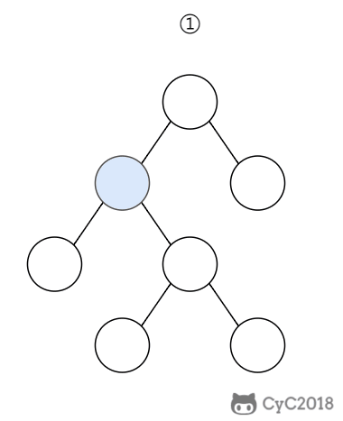
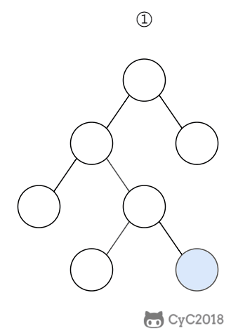

# 8. 二叉树的下一个结点

[NowCoder](https://www.nowcoder.com/practice/9023a0c988684a53960365b889ceaf5e?tpId=13&tqId=11210&tPage=1&rp=1&ru=/ta/coding-interviews&qru=/ta/coding-interviews/question-ranking&from=cyc_github)

## 题目描述

给定一个二叉树和其中的一个结点，请找出中序遍历顺序的下一个结点并且返回。注意，树中的结点不仅包含左右子结点，同时包含指向父结点的指针。

```java
public class TreeLinkNode {

    int val;
    TreeLinkNode left = null;
    TreeLinkNode right = null;
    TreeLinkNode next = null;

    TreeLinkNode(int val) {
        this.val = val;
    }
}
```

## 解题思路

① 如果一个节点的右子树不为空，那么该节点的下一个节点是右子树的最左节点；

<div align="center">  </div><br>

② 否则，向上找第一个左链接指向的树包含该节点的祖先节点。

<div align="center">  </div><br>

```java
public TreeLinkNode GetNext(TreeLinkNode pNode) {
    if (pNode.right != null) {
        TreeLinkNode node = pNode.right;
        while (node.left != null)
            node = node.left;
        return node;
    } else {
        while (pNode.next != null) {
            TreeLinkNode parent = pNode.next;
            if (parent.left == pNode)
                return parent;
            pNode = pNode.next;
        }
    }
    return null;
}
```


<div align="center"></img></div>
