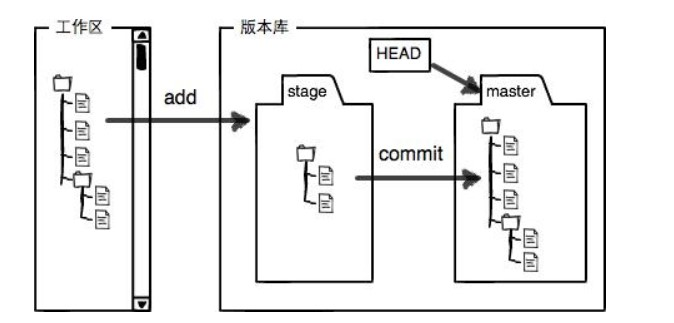
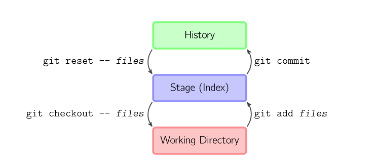
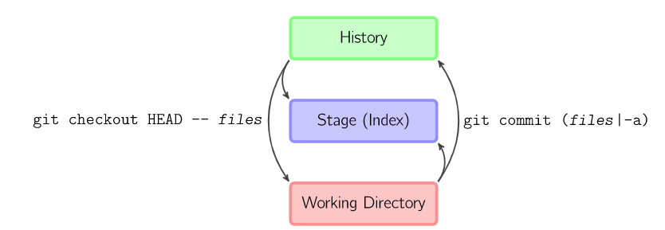
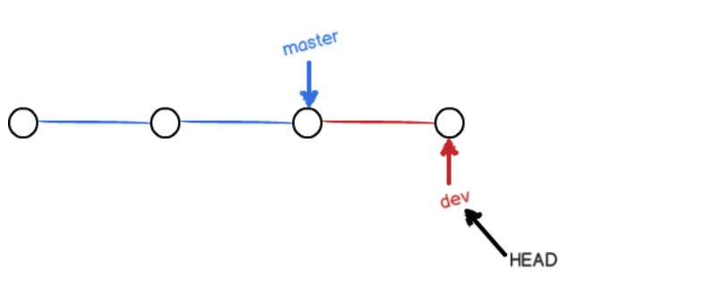
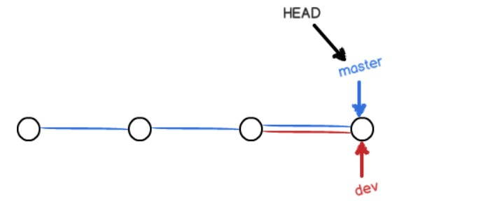
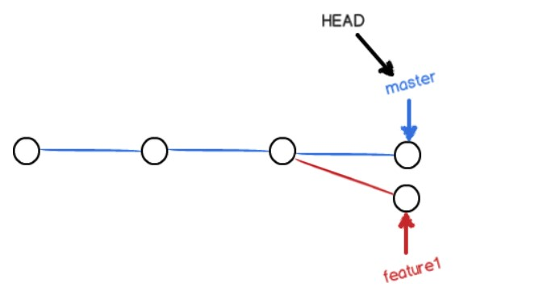
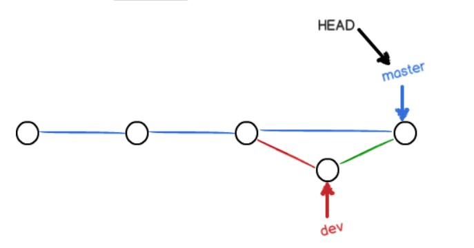
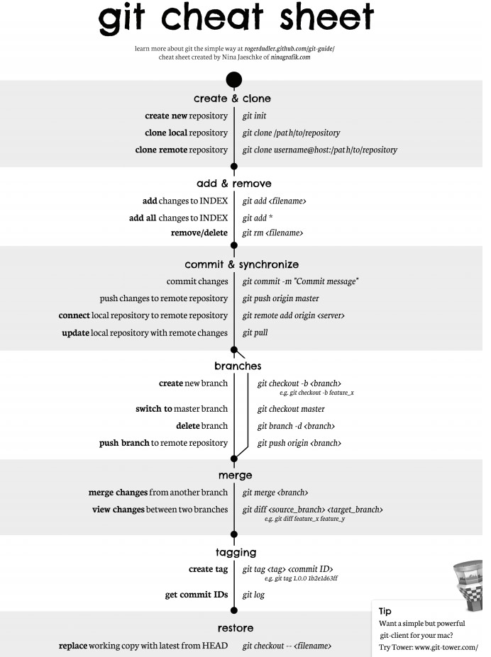

<!-- GFM-TOC -->
* [学习资料](#学习资料)
* [集中式与分布式](#集中式与分布式)
* [Git 的中心服务器](#git-的中心服务器)
* [Git 工作流](#git-工作流)
* [分支实现](#分支实现)
* [冲突](#冲突)
* [Fast forward](#fast-forward)
* [分支管理策略](#分支管理策略)
* [储藏（Stashing）](#储藏stashing)
* [SSH 传输设置](#ssh-传输设置)
* [.gitignore 文件](#gitignore-文件)
* [Git 命令一览](#git-命令一览)
<!-- GFM-TOC -->


# 学习资料

- [Git - 简明指南](http://rogerdudler.github.io/git-guide/index.zh.html)
- [图解 Git](http://marklodato.github.io/visual-git-guide/index-zh-cn.html)
- [廖雪峰 : Git 教程](https://www.liaoxuefeng.com/wiki/0013739516305929606dd18361248578c67b8067c8c017b000)
- [Learn Git Branching](https://learngitbranching.js.org/)

# 集中式与分布式

Git 属于分布式版本控制系统，而 SVN 属于集中式。

集中式版本控制只有中心服务器拥有一份代码，而分布式版本控制每个人的电脑上就有一份完整的代码。

集中式版本控制有安全性问题，当中心服务器挂了所有人都没办法工作了。

集中式版本控制需要连网才能工作，如果网速过慢，那么提交一个文件的会慢的无法让人忍受。而分布式版本控制不需要连网就能工作。

分布式版本控制新建分支、合并分支操作速度非常快，而集中式版本控制新建一个分支相当于复制一份完整代码。

# Git 的中心服务器

Git 的中心服务器用来交换每个用户的修改。没有中心服务器也能工作，但是中心服务器能够 24 小时保持开机状态，这样就能更方便的交换修改。Github 就是一种 Git 中心服务器。

# Git 工作流

<div align="center">  </div><br>

新建一个仓库之后，当前目录就成为了工作区，工作区下有一个隐藏目录 .git，它属于 Git 的版本库。

Git 版本库有一个称为 stage 的暂存区，还有自动创建的 master 分支以及指向分支的 HEAD 指针。

<div align="center">  </div><br>

- git add files 把文件的修改添加到暂存区
- git commit 把暂存区的修改提交到当前分支，提交之后暂存区就被清空了
- git reset -- files 使用当前分支上的修改覆盖暂缓区，用来撤销最后一次 git add files
- git checkout -- files 使用暂存区的修改覆盖工作目录，用来撤销本地修改

<div align="center">  </div><br>

可以跳过暂存区域直接从分支中取出修改或者直接提交修改到分支中

- git commit -a 直接把所有文件的修改添加到暂缓区然后执行提交
- git checkout HEAD -- files 取出最后一次修改，可以用来进行回滚操作

# 分支实现

Git 把每次提交都连成一条时间线。分支使用指针来实现，例如 master 分支指针指向时间线的最后一个节点，也就是最后一次提交。HEAD 指针指向的是当前分支。

<div align="center">  </div><br>

新建分支是新建一个指针指向时间线的最后一个节点，并让 HEAD 指针指向新分支表示新分支成为当前分支。

<div align="center">  </div><br>

每次提交只会让当前分支向前移动，而其它分支不会移动。

<div align="center">  </div><br>

合并分支也只需要改变指针即可。

<div align="center">  </div><br>

# 冲突

当两个分支都对同一个文件的同一行进行了修改，在分支合并时就会产生冲突。

<div align="center">  </div><br>

Git 会使用 <<<<<<< ，======= ，>>>>>>> 标记出不同分支的内容，只需要把不同分支中冲突部分修改成一样就能解决冲突。

```
<<<<<<< HEAD
Creating a new branch is quick & simple.
=======
Creating a new branch is quick AND simple.
>>>>>>> feature1
```

# Fast forward

"快进式合并"（fast-farward merge），会直接将 master 分支指向合并的分支，这种模式下进行分支合并会丢失分支信息，也就不能在分支历史上看出分支信息。

可以在合并时加上 --no-ff 参数来禁用 Fast forward 模式，并且加上 -m 参数让合并时产生一个新的 commit。

```
$ git merge --no-ff -m "merge with no-ff" dev
```

<div align="center">  </div><br>

# 分支管理策略

master 分支应该是非常稳定的，只用来发布新版本；

日常开发在开发分支 dev 上进行。

<div align="center">  </div><br>

# 储藏（Stashing）

在一个分支上操作之后，如果还没有将修改提交到分支上，此时进行切换分支，那么另一个分支上也能看到新的修改。这是因为所有分支都共用一个工作区的缘故。

可以使用 git stash 将当前分支的修改储藏起来，此时当前工作区的所有修改都会被存到栈上，也就是说当前工作区是干净的，没有任何未提交的修改。此时就可以安全的切换到其它分支上了。

```
$ git stash
Saved working directory and index state \ "WIP on master: 049d078 added the index file"
HEAD is now at 049d078 added the index file (To restore them type "git stash apply")
```

该功能可以用于 bug 分支的实现。如果当前正在 dev 分支上进行开发，但是此时 master 上有个 bug 需要修复，但是 dev 分支上的开发还未完成，不想立即提交。在新建 bug 分支并切换到 bug 分支之前就需要使用 git stash 将 dev 分支的未提交修改储藏起来。

# SSH 传输设置

Git 仓库和 Github 中心仓库之间是通过 SSH 加密。

如果工作区下没有 .ssh 目录，或者该目录下没有 id_rsa 和 id_rsa.pub 这两个文件，可以通过以下命令来创建 SSH Key：

```
$ ssh-keygen -t rsa -C "youremail@example.com"
```

然后把公钥 id_rsa.pub 的内容复制到 Github "Account settings" 的 SSH Keys 中。

# .gitignore 文件

忽略以下文件：

1. 操作系统自动生成的文件，比如缩略图；
2. 编译生成的中间文件，比如 Java 编译产生的 .class 文件；
3. 自己的敏感信息，比如存放口令的配置文件。

不需要全部自己编写，可以到 [https://github.com/github/gitignore](https://github.com/github/gitignore) 中进行查询。

# Git 命令一览

<div align="center">  </div><br>

比较详细的地址：http://www.cheat-sheets.org/saved-copy/git-cheat-sheet.pdf


