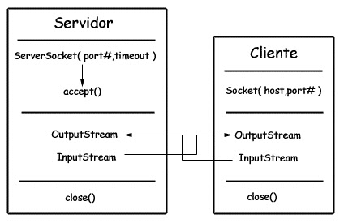

<!-- GFM-TOC -->
* [一、概览](#一概览)
* [二、磁盘操作](#二磁盘操作)
* [三、字节操作](#三字节操作)
* [四、字符操作](#四字符操作)
* [五、对象操作](#五对象操作)
* [六、网络操作](#六网络操作)
    * [InetAddress](#inetaddress)
    * [URL](#url)
    * [Sockets](#sockets)
    * [Datagram](#datagram)
* [七、NIO](#七nio)
    * [流与块](#流与块)
    * [通道与缓冲区](#通道与缓冲区)
    * [缓冲区状态变量](#缓冲区状态变量)
    * [文件 NIO 实例](#文件-nio-实例)
    * [套接字 NIO 实例](#套接字-nio-实例)
    * [内存映射文件](#内存映射文件)
    * [对比](#对比)
* [八、参考资料](#八参考资料)
<!-- GFM-TOC -->


# 一、概览

Java 的 I/O 大概可以分成以下几类：

1. 磁盘操作：File
2. 字节操作：InputStream 和 OutputStream
3. 字符操作：Reader 和 Writer
4. 对象操作：Serializable
5. 网络操作：Socket
6. 新的输入/输出：NIO

# 二、磁盘操作

File 类可以用于表示文件和目录，但是它只用于表示文件的信息，而不表示文件的内容。

# 三、字节操作

<div align="center">  </div><br>

Java I/O 使用了装饰者模式来实现。以 InputStream 为例，InputStream 是抽象组件，FileInputStream 是 InputStream 的子类，属于具体组件，提供了字节流的输入操作。FilterInputStream 属于抽象装饰者，装饰者用于装饰组件，为组件提供额外的功能，例如 BufferedInputStream 为 FileInputStream 提供缓存的功能。

实例化一个具有缓存功能的字节流对象时，只需要在 FileInputStream 对象上再套一层 BufferedInputStream 对象即可。

```java
BufferedInputStream bis = new BufferedInputStream(new FileInputStream(file));
```

DataInputStream 装饰者提供了对更多数据类型进行输入的操作，比如 int、double 等基本类型。

批量读入文件内容到字节数组：

```java
byte[] buf = new byte[20*1024];
int bytes = 0;
// 最多读取 buf.length 个字节，返回的是实际读取的个数，返回 -1 的时候表示读到 eof，即文件尾
while((bytes = in.read(buf, 0 , buf.length)) != -1) {
    // ...
}
```

# 四、字符操作

不管是磁盘还是网络传输，最小的存储单元都是字节，而不是字符，所以 I/O 操作的都是字节而不是字符。但是在程序中操作的通常是字符形式的数据，因此需要提供对字符进行操作的方法。

InputStreamReader 实现从文本文件的字节流解码成字符流；OutputStreamWriter 实现字符流编码成为文本文件的字节流。它们继承自 Reader 和 Writer。

编码就是把字符转换为字节，而解码是把字节重新组合成字符。

```java
byte[] bytes = str.getBytes(encoding);     // 编码
String str = new String(bytes, encoding)； // 解码
```

GBK 编码中，中文占 2 个字节，英文占 1 个字节；UTF-8 编码中，中文占 3 个字节，英文占 1 个字节；Java 使用双字节编码 UTF-16be，中文和英文都占 2 个字节。

如果编码和解码过程使用不同的编码方式那么就出现了乱码。

# 五、对象操作

序列化就是将一个对象转换成字节序列，方便存储和传输。

序列化：ObjectOutputStream.writeObject()

反序列化：ObjectInputStream.readObject()

序列化的类需要实现 Serializable 接口，它只是一个标准，没有任何方法需要实现。

transient 关键字可以使一些属性不会被序列化。

**ArrayList 序列化和反序列化的实现** ：ArrayList 中存储数据的数组是用 transient 修饰的，因为这个数组是动态扩展的，并不是所有的空间都被使用，因此就不需要所有的内容都被序列化。通过重写序列化和反序列化方法，使得可以只序列化数组中有内容的那部分数据。

```java
private transient Object[] elementData;
```

# 六、网络操作

Java 中的网络支持：

1. InetAddress：用于表示网络上的硬件资源，即 IP 地址；
2. URL：统一资源定位符，通过 URL 可以直接读取或者写入网络上的数据；
3. Sockets：使用 TCP 协议实现网络通信；
4. Datagram：使用 UDP 协议实现网络通信。

## InetAddress

没有公有构造函数，只能通过静态方法来创建实例。

```java
InetAddress.getByName(String host);
InetAddress.getByAddress(byte[] addr);
```

## URL

可以直接从 URL 中读取字节流数据

```java
URL url = new URL("http://www.baidu.com");
InputStream is = url.openStream();                           // 字节流
InputStreamReader isr = new InputStreamReader(is, "utf-8");  // 字符流
BufferedReader br = new BufferedReader(isr);
String line = br.readLine();
while (line != null) {
    System.out.println(line);
    line = br.readLine();
}
br.close();
isr.close();
is.close();
```

## Sockets

- ServerSocket：服务器端类
- Socket：客户端类
- 服务器和客户端通过 InputStream 和 OutputStream 进行输入输出。

<div align="center">  </div><br>

## Datagram

- DatagramPacket：数据包类
- DatagramSocket：通信类

# 七、NIO

新的输入/输出 (NIO) 库是在 JDK 1.4 中引入的。NIO 弥补了原来的 I/O 的不足，它在标准 Java 代码中提供了高速的、面向块的 I/O。

## 流与块

I/O 与 NIO 最重要的区别是数据打包和传输的方式，I/O 以流的方式处理数据，而 NIO 以块的方式处理数据。

面向流的 I/O 一次处理一个字节数据，一个输入流产生一个字节数据，一个输出流消费一个字节数据。为流式数据创建过滤器非常容易，链接几个过滤器，以便每个过滤器只负责单个复杂处理机制的一部分，这样也是相对简单的。不利的一面是，面向流的 I/O 通常相当慢。

一个面向块的 I/O 系统以块的形式处理数据，一次处理一个数据块。按块处理数据比按流处理数据要快得多。但是面向块的 I/O 缺少一些面向流的 I/O 所具有的优雅性和简单性。

I/O 包和 NIO 已经很好地集成了，java.io.\* 已经以 NIO 为基础重新实现了，所以现在它可以利用 NIO 的一些特性。例如，java.io.\* 包中的一些类包含以块的形式读写数据的方法，这使得即使在面向流的系统中，处理速度也会更快。

## 通道与缓冲区

### 1. 通道

通道 Channel 是对原 I/O 包中的流的模拟，可以通过它读取和写入数据。

通道与流的不同之处在于，流只能在一个方向上移动，(一个流必须是 InputStream 或者 OutputStream 的子类)，而通道是双向的，可以用于读、写或者同时用于读写。

通道包括以下类型：

- FileChannel：从文件中读写数据；
- DatagramChannel：通过 UDP 读写网络中数据；
- SocketChannel：通过 TCP 读写网络中数据；
- ServerSocketChannel：可以监听新进来的 TCP 连接，对每一个新进来的连接都会创建一个 SocketChannel。

### 2. 缓冲区

发送给一个通道的所有数据都必须首先放到缓冲区中，同样地，从通道中读取的任何数据都要读到缓冲区中。也就是说，不会直接对通道进行读写数据，而是要先经过缓冲区。

缓冲区实质上是一个数组，但它不仅仅是一个数组。缓冲区提供了对数据的结构化访问，而且还可以跟踪系统的读/写进程。

缓冲区包括以下类型：

- ByteBuffer
- CharBuffer
- ShortBuffer
- IntBuffer
- LongBuffer
- FloatBuffer
- DoubleBuffer

## 缓冲区状态变量

- capacity：最大容量；
- position：当前已经读写的字节数；
- limit：还可以读写的字节数。

状态变量的改变过程举例：

① 新建一个大小为 8 个字节的缓冲区，此时 position 为 0，而 limit = capacity = 8。capacity 变量不会改变，下面的讨论会忽略它。

<div align="center">  </div><br>

② 从输入通道中读取 3 个字节数据写入缓冲区中，此时 position 移动设为 3，limit 保持不变。

<div align="center">  </div><br>

③ 以下图例为已经从输入通道读取了 5 个字节数据写入缓冲区中。在将缓冲区的数据写到输出通道之前，需要先调用 flip() 方法，这个方法将 limit 设置为当前 position，并将 position 设置为 0。

<div align="center">  </div><br>

④ 从缓冲区中取 4 个字节到输出缓冲中，此时 position 设为 4。

<div align="center">  </div><br>

⑤ 最后需要调用 clear() 方法来清空缓冲区，此时 position 和 limit 都被设置为最初位置。

<div align="center">  </div><br>

## 文件 NIO 实例

① 为要读取的文件创建 FileInputStream，之后通过 FileInputStream 获取输入 FileChannel；

```java
FileInputStream fin = new FileInputStream("readandshow.txt");
FileChannel fic = fin.getChannel();
```

② 创建一个容量为 1024 的 Buffer；

```java
ByteBuffer buffer = ByteBuffer.allocate(1024);
```

③ 将数据从输入 FileChannel 写入到 Buffer 中，如果没有数据的话，read() 方法会返回 -1；

```java
int r = fcin.read(buffer);
if (r == -1) {
     break;
}
```

④ 为要写入的文件创建 FileOutputStream，之后通过 FileOutputStream 获取输出 FileChannel

```java
FileOutputStream fout = new FileOutputStream("writesomebytes.txt");
FileChannel foc = fout.getChannel();
```

⑤ 调用 flip() 切换读写

```java
buffer.flip();
```

⑥ 把 Buffer 中的数据读取到输出 FileChannel 中

```java
foc.write(buffer);
```

⑦ 最后调用 clear() 重置缓冲区

```java
buffer.clear();
```

## 套接字 NIO 实例

### 1. ServerSocketChannel

每一个监听端口都需要有一个 ServerSocketChannel 用来监听连接。

```java
ServerSocketChannel ssc = ServerSocketChannel.open();
ssc.configureBlocking(false); // 设置为非阻塞

ServerSocket ss = ssc.socket();
InetSocketAddress address = new InetSocketAddress(ports[i]);
ss.bind(address); // 绑定端口号
```

### 2. Selectors

异步 I/O 通过 Selector 注册对特定 I/O 事件的兴趣 ― 可读的数据的到达、新的套接字连接等等，在发生这样的事件时，系统将会发送通知。

创建 Selectors 之后，就可以对不同的通道对象调用 register() 方法。register() 的第一个参数总是这个 Selector。第二个参数是 OP_ACCEPT，这里它指定我们想要监听 ACCEPT 事件，也就是在新的连接建立时所发生的事件。

SelectionKey 代表这个通道在此 Selector 上的这个注册。当某个 Selector 通知您某个传入事件时，它是通过提供对应于该事件的 SelectionKey 来进行的。SelectionKey 还可以用于取消通道的注册。

```java
Selector selector = Selector.open();
SelectionKey key = ssc.register(selector, SelectionKey.OP_ACCEPT);
```

### 3. 主循环

首先，我们调用 Selector 的 select() 方法。这个方法会阻塞，直到至少有一个已注册的事件发生。当一个或者更多的事件发生时，select() 方法将返回所发生的事件的数量。

接下来，我们调用 Selector 的 selectedKeys() 方法，它返回发生了事件的 SelectionKey 对象的一个集合。

我们通过迭代 SelectionKeys 并依次处理每个 SelectionKey 来处理事件。对于每一个 SelectionKey，您必须确定发生的是什么 I/O 事件，以及这个事件影响哪些 I/O 对象。

```java
int num = selector.select();

Set selectedKeys = selector.selectedKeys();
Iterator it = selectedKeys.iterator();

while (it.hasNext()) {
     SelectionKey key = (SelectionKey)it.next();
     // ... deal with I/O event ...
}
```

### 4. 监听新连接

程序执行到这里，我们仅注册了 ServerSocketChannel，并且仅注册它们“接收”事件。为确认这一点，我们对 SelectionKey 调用 readyOps() 方法，并检查发生了什么类型的事件：

```java
if ((key.readyOps() & SelectionKey.OP_ACCEPT)
     == SelectionKey.OP_ACCEPT) {
     // Accept the new connection
     // ...
}
```

可以肯定地说，readOps() 方法告诉我们该事件是新的连接。

### 5. 接受新的连接

因为我们知道这个服务器套接字上有一个传入连接在等待，所以可以安全地接受它；也就是说，不用担心 accept() 操作会阻塞：

```java
ServerSocketChannel ssc = (ServerSocketChannel)key.channel();
SocketChannel sc = ssc.accept();
```

下一步是将新连接的 SocketChannel 配置为非阻塞的。而且由于接受这个连接的目的是为了读取来自套接字的数据，所以我们还必须将 SocketChannel 注册到 Selector 上，如下所示：

```java
sc.configureBlocking(false);
SelectionKey newKey = sc.register(selector, SelectionKey.OP_READ);
```

注意我们使用 register() 的 OP_READ 参数，将 SocketChannel 注册用于读取而不是接受新连接。

### 6. 删除处理过的 SelectionKey

在处理 SelectionKey 之后，我们几乎可以返回主循环了。但是我们必须首先将处理过的 SelectionKey 从选定的键集合中删除。如果我们没有删除处理过的键，那么它仍然会在主集合中以一个激活的键出现，这会导致我们尝试再次处理它。我们调用迭代器的 remove() 方法来删除处理过的 SelectionKey：

```java
it.remove();
```

现在我们可以返回主循环并接受从一个套接字中传入的数据 (或者一个传入的 I/O 事件) 了。

### 7. 传入的 I/O

当来自一个套接字的数据到达时，它会触发一个 I/O 事件。这会导致在主循环中调用 Selector.select()，并返回一个或者多个 I/O 事件。这一次， SelectionKey 将被标记为 OP_READ 事件，如下所示：

```java
} else if ((key.readyOps() & SelectionKey.OP_READ)
     == SelectionKey.OP_READ) {
     // Read the data
     SocketChannel sc = (SocketChannel)key.channel();
     // ...
}
```

## 内存映射文件

内存映射文件 I/O 是一种读和写文件数据的方法，它可以比常规的基于流或者基于通道的 I/O 快得多。

只有文件中实际读取或者写入的部分才会映射到内存中。

现代操作系统一般会根据需要将文件的部分映射为内存的部分，从而实现文件系统。Java 内存映射机制只不过是在底层操作系统中可以采用这种机制时，提供了对该机制的访问。

向内存映射文件写入可能是危险的，仅只是改变数组的单个元素这样的简单操作，就可能会直接修改磁盘上的文件。修改数据与将数据保存到磁盘是没有分开的。

下面代码行将文件的前 1024 个字节映射到内存中，map() 方法返回一个 MappedByteBuffer，它是 ByteBuffer 的子类。因此，您可以像使用其他任何 ByteBuffer 一样使用新映射的缓冲区，操作系统会在需要时负责执行映射。

```java
MappedByteBuffer mbb = fc.map(FileChannel.MapMode.READ_WRITE, 0, 1024);
```

## 对比

NIO 与普通 I/O 的区别主要有以下两点：

- NIO 是非阻塞的。应当注意，FileChannel 不能切换到非阻塞模式，套接字 Channel 可以。
- NIO 面向块，I/O 面向流。

# 八、参考资料

- Eckel B, 埃克尔, 昊鹏, 等. Java 编程思想 [M]. 机械工业出版社, 2002.
- [IBM: NIO 入门](https://www.ibm.com/developerworks/cn/education/java/j-nio/j-nio.html)
- [深入分析 Java I/O 的工作机制](https://www.ibm.com/developerworks/cn/java/j-lo-javaio/index.html)
- [NIO 与传统 IO 的区别](http://blog.csdn.net/shimiso/article/details/24990499)
- [Decorator Design Pattern](http://stg-tud.github.io/sedc/Lecture/ws13-14/5.3-Decorator.html#mode=document)
- [Socket Multicast](http://labojava.blogspot.com/2012/12/socket-multicast.html)
