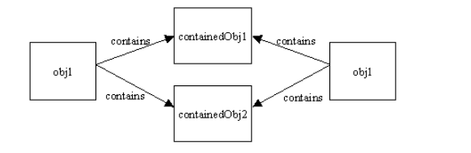
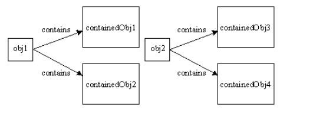

<!-- GFM-TOC -->
* [关键字](#关键字)
    * [1. final](#1-final)
    * [2. static](#2-static)
* [Object 通用方法](#object-通用方法)
    * [1. 概览](#1-概览)
    * [2. clone()](#2-clone)
    * [3. equals()](#3-equals)
* [继承](#继承)
    * [1. 访问权限](#1-访问权限)
    * [2. 抽象类与接口的区别](#2-抽象类与接口的区别)
    * [3. super()](#3-super)
* [String](#string)
    * [1. String, StringBuffer and StringBuilder](#1-string,-stringbuffer-and-stringbuilder)
    * [2. String 不可变的原因](#2-string-不可变的原因)
    * [3. String.intern()](#3-stringintern)
* [基本类型与运算](#基本类型与运算)
    * [1. 包装类型](#1-包装类型)
    * [2. switch](#2-switch)
* [反射](#反射)
* [异常](#异常)
* [泛型](#泛型)
* [特性](#特性)
    * [1. 三大特性](#1-三大特性)
    * [2. Java 各版本的新特性](#2-java-各版本的新特性)
    * [3. Java 与 C++ 的区别](#3-java-与-c++-的区别)
    * [4. JRE or JDK](#4-jre-or-jdk)
<!-- GFM-TOC -->


# 关键字

## 1. final

**数据** 

声明数据为常量，可以是编译时常量，也可以是在运行时被初始化后不能被改变的常量。

对于基本类型，final 使数值不变；对于引用对象，final 使引用不变，也就不能引用其它对象，但是被引用的对象本身是可以修改的。

**方法** 

声明方法不能被子类覆盖。

private 方法隐式地被指定为 final，如果在子类中定义的方法和基类中的一个 private 方法签名相同，此时子类的方法不是覆盖基类方法，而是重载了。

**类** 

声明类不允许被继承。

## 2. static

**变量** 

静态变量在内存中只存在一份，只在类第一次实例化时初始化一次，同时类所有的实例都共享静态变量，可以直接通过类名来访问它。

但是实例变量则不同，它是伴随着实例的，每创建一个实例就会产生一个实例变量，它与该实例同生共死。

**方法** 

静态方法在类加载的时候就存在了，它不依赖于任何实例，所以 static 方法必须实现，也就是说他不能是抽象方法 abstract。

**静态语句块** 

静态语句块和静态变量一样在类第一次实例化时运行一次。

**初始化顺序** 

静态数据优先于其它数据的初始化，静态变量和静态语句块哪个先运行取决于它们在代码中的顺序。

```java
public static String staticField = "静态变量";
```

```java
static {
    System.out.println("静态初始化块");
}
```

实例变量和普通语句块的初始化在静态变量和静态语句块初始化结束之后。

```java
public String field = "变量";
```

```java
{
    System.out.println("初始化块");
}
```

最后才是构造函数中的数据进行初始化

```java
public InitialOrderTest() {
    System.out.println("构造器");
}
```

存在继承的情况下，初始化顺序为：

1. 父类（静态变量、静态初始化块）
2. 子类（静态变量、静态初始化块）
3. 父类（变量、初始化块）
4. 父类（构造器）
5. 子类（变量、初始化块）
6. 子类（构造器）


# Object 通用方法

## 1. 概览

- public final native Class<?> getClass()
- public native int hashCode()
- public boolean equals(Object obj)
- protected native Object clone() throws CloneNotSupportedException
- public String toString()
- public final native void notify()
- public final native void notifyAll()
- public final native void wait(long timeout) throws InterruptedException
- public final void wait(long timeout, int nanos) throws InterruptedException
- public final void wait() throws InterruptedException
- protected void finalize() throws Throwable { }

## 2. clone()

**浅拷贝** 

引用类型引用的是同一个对象，clone() 方法默认就是浅拷贝实现。

<div align="center">  </div><br>

**深拷贝** 

可以使用序列化实现。

<div align="center">  </div><br>

> [How do I copy an object in Java?](https://stackoverflow.com/questions/869033/how-do-i-copy-an-object-in-java)

## 3. equals()

- 对于基本类型，== 就是判断两个值是否相等；
- 对于引用类型，== 是判断两个引用是否引用同一个对象，而 equals() 是判断引用的对象是否等价。

等价性：[ 散列 ](https://github.com/CyC2018/InterviewNotes/blob/master/notes/Java%20%E5%AE%B9%E5%99%A8.md#%E6%95%A3%E5%88%97)

# 继承

## 1. 访问权限

Java 中有三个访问权限修饰符：private、protected 以及 public，如果不加访问修饰符，表示包级可见。

可以对类或类中的成员（字段以及方法）加上访问修饰符。成员可见表示其它类可以用成员所在类的对象访问到该成员；类可见表示其它类可以用这个类创建对象，可以把类当做包中的一个成员，然后包表示一个类，这样就好理解了。

protected 用于修饰成员，表示在继承体系中成员对于子类可见。但是这个访问修饰符对于类没有意义，因为包没有继承体系。

更详细的内容：[ 浅析 Java 中的访问权限控制 ](http://www.importnew.com/18097.html)

## 2. 抽象类与接口的区别

抽象类至少包含一个抽象方法，该抽象方法必须在子类中实现。由于抽象类没有抽象方法的具体实现，因此不能对抽象类进行实例化。

```java
public abstract class GenericServlet implements Servlet, ServletConfig, Serializable {
    // abstract method
    abstract void service(ServletRequest req, ServletResponse res);
 
    void init() {
        // Its implementation
    }
    // other method related to Servlet
}
```

接口定义了一组方法，但是接口都没有方法的实现，也就是说这些方法都是抽象方法。

```java
public interface Externalizable extends Serializable {

    void writeExternal(ObjectOutput out) throws IOException;

    void readExternal(ObjectInput in) throws IOException, ClassNotFoundException;
}
```

更详细的内容：[Java 抽象类与接口的区别 ](http://www.importnew.com/12399.html)

## 3. super()

用来访问父类的构造函数父类的方法，第二种情况中，子类需要重载父类的方法。

```java
public class Subclass extends Superclass {
    // overrides printMethod in Superclass
    public void printMethod() {
        super.printMethod();
        System.out.println("Printed in Subclass");
    }
    public static void main(String[] args) {
        Subclass s = new Subclass();
        s.printMethod();
    }
}
```

> [Using the Keyword super](https://docs.oracle.com/javase/tutorial/java/IandI/super.html)

# String

## 1. String, StringBuffer and StringBuilder

**是否可变** 

String 不可变，StringBuffer 和 StringBuilder 可变。

**是否线程安全** 

String 不可变，因此是线程安全的。

StringBuilder 不是线程安全的；StringBuffer 是线程安全的，使用 synchronized 来同步。

> [String, StringBuffer, and StringBuilder](https://stackoverflow.com/questions/2971315/string-stringbuffer-and-stringbuilder)

## 2. String 不可变的原因

**可以缓存 hash 值** 

因为 String 的 hash 值经常被使用，例如 String 用做 HashMap 等。不可变的特性可以使得 hash 值也不可变，因此就只需要进行一次计算。

**String Pool 的需要** 

如果 String 已经被创建过了，那么就会从 String Pool 中取得引用。只有 String 是不可变的，才可能使用 String Pool。

<div align="center">  </div><br>

**安全性** 

String 经常作为参数，例如网络连接参数等，在作为网络连接参数的情况下，如果 String 是可变的，那么在网络连接过程中，String 被改变，改变 String 对象的那一方以为现在连接的是其它主机，而实际情况却不一定是。String 不可变性可以保证参数不可变。

**线程安全** 

String 不可变性天生具备线程安全，可以在多个线程中使用。

> [Why String is immutable in Java?](https://www.programcreek.com/2013/04/why-string-is-immutable-in-java/)

## 3. String.intern()

使用 String.intern() 可以保证所有相同内容的字符串变量引用相同的内存对象。

更详细的内容：[ 揭开 String.intern() 那神秘的面纱 ](https://www.jianshu.com/p/95f516cb75ef)

# 基本类型与运算

## 1. 包装类型

八个基本类型：boolean 1 byte 8 char 16 short 16 int 32 float 32 long 64 double 64

基本类型都有对应的包装类型，它们之间的赋值使用自动装箱与拆箱完成。

```java
Integer x = 2;     // 装箱
int y = x;         // 拆箱
```

new Integer(123) 与 Integer.valueOf(123) 的区别在于，Integer.valueOf(123) 可能会使用缓存对象，因此多次使用 Integer.valueOf(123) 会取得同一个对象的引用。

```java
public static void main(String[] args) {

     Integer a = new Integer(1);
     Integer b = new Integer(1);

     System.out.println("a==b? " + (a==b));

     Integer c = Integer.valueOf(1);
     Integer d = Integer.valueOf(1);

     System.out.println("c==d? " + (c==d));

 }
```

```html
a==b? false
c==d? true
```

valueOf() 方法的实现比较简单，就是先判断值是否在缓存池中，如果在的话就直接使用缓存池的内容。

```java
public static Integer valueOf(int i) {
    final int offset = 128;
    if (i >= -128 && i <= 127) { // must cache
        return IntegerCache.cache[i + offset];
    }
    return new Integer(i);
}
```

The following is the list of primitives stored as immutable objects:

- boolean values true and false
- all byte values
- short values between -128 and 127
- int values between -128 and 127
- char in the range \u0000 to \u007F

自动装箱过程编译器会调用 valueOf() 方法，因此多个 Integer 对象使用装箱来创建并且值相同，那么就会引用相同的对象，这样做很显然是为了节省内存开销。

```java
Integer x = 1;
Integer y = 1;
System.out.println(c==d); // true
```

> [Differences between new Integer(123), Integer.valueOf(123) and just 123
](https://stackoverflow.com/questions/9030817/differences-between-new-integer123-integer-valueof123-and-just-123)

## 2. switch

A switch works with the byte, short, char, and int primitive data types. It also works with enumerated types (discussed in Classes and Inheritance) and a few special classes that "wrap" certain primitive types: Character, Byte, Short, and Integer (discussed in Simple Data Objects).

In the JDK 7 release, you can use a String object in the expression of a switch statement.

switch 不支持 long，是因为 swicth 的设计初衷是为那些只需要对少数几个值进行等值判断，如果值过于复杂，那么还是用 if 比较合适。

> [Why can't your switch statement data type be long, Java?](https://stackoverflow.com/questions/2676210/why-cant-your-switch-statement-data-type-be-long-java)

switch 使用查找表的方式来实现，JVM 中使用的指令是 lookupswitch。

```java
public static void main(String... args) {
  switch (1) {
  case 1:
    break;
  case 2:
    break;
  }
}

public static void main(java.lang.String[]);
  Code:
   Stack=1, Locals=1, Args_size=1
   0:   iconst_1
   1:   lookupswitch{ //2
                1: 28;
                2: 31;
                default: 31 }
   28:  goto    31
   31:  return
```

> [How does Java's switch work under the hood?](https://stackoverflow.com/questions/12020048/how-does-javas-switch-work-under-the-hood)


# 反射

每个类都有一个  **Class**  对象，包含了与类有关的信息。当编译一个新类时，会产生一个同名的 .class 文件，该文件内容保存着 Class 对象。

类加载相当于 Class 对象的加载。类在第一次使用时才动态加载到 JVM 中，可以使用 Class.forName('com.mysql.jdbc.Driver.class') 这种方式来控制类的加载，该方法会返回一个 Class 对象。

反射可以提供运行时的类信息，并且这个类可以在运行时才加载进来，甚至在编译时期该类的 .class 不存在也可以加载进来。

Class 和 java.lang.reflect 一起对反射提供了支持，java.lang.reflect 类库包含了  **Field** 、**Method** 以及 **Constructor** 类。可以使用 get() 和 set() 方法读取和修改 Field 对象关联的字段，可以使用 invoke() 方法调用与 Method 对象关联的方法，可以用 Constructor 创建新的对象。

IDE 使用反射机制获取类的信息，在使用一个类的对象时，能够把类的字段、方法和构造函数等信息列出来供用户选择。

更详细的内容：[ 深入解析 Java 反射（1）- 基础 ](http://www.sczyh30.com/posts/Java/java-reflection-1/)

# 异常

Throwable 可以用来表示任何可以作为异常抛出的类，分为两种： **Error**  和 **Exception**，其中 Error 用来表示编译时系统错误。

Exception 分为两种： **受检异常**  和 **非受检异常**。受检异常需要用 try...catch... 语句捕获并进行处理，并且可以从异常中恢复；非受检异常是程序运行时错误，例如除 0 会引发 Arithmetic Exception，此时程序奔溃并且无法恢复。

<div align="center">  </div><br>

更详细的内容：
- [Java 入门之异常处理 ](https://www.tianmaying.com/tutorial/Java-Exception)
- [Java 异常的面试问题及答案 -Part 1](http://www.importnew.com/7383.html)

# 泛型

泛型提供了编译时的类型检测机制，该机制允许程序员在编译时检测到非法的类型。泛型是 Java 中一个非常重要的知识点，在 Java 集合类框架中泛型被广泛应用。

```java
public class Box<T> {
    // T stands for "Type"
    private T t;
    public void set(T t) { this.t = t; }
    public T get() { return t; }
}
```

更详细的内容：

- [Java 泛型详解 ](https://www.ziwenxie.site/2017/03/01/java-generic/)
- [10 道 Java 泛型面试题 ](https://cloud.tencent.com/developer/article/1033693)

# 特性

## 1. 三大特性

[ 封装、继承、多态 ](https://github.com/CyC2018/InterviewNotes/blob/master/notes/%E9%9D%A2%E5%90%91%E5%AF%B9%E8%B1%A1%E6%80%9D%E6%83%B3.md#%E5%B0%81%E8%A3%85%E7%BB%A7%E6%89%BF%E5%A4%9A%E6%80%81)

## 2. Java 各版本的新特性

New highlights in Java SE 8

1. Lambda Expressions
2. Pipelines and Streams
3. Date and Time API
4. Default Methods
5. Type Annotations
6. Nashhorn JavaScript Engine
7. Concurrent Accumulators
8. Parallel operations
9. PermGen Error Removed

New highlights in Java SE 7

1. Strings in Switch Statement
2. Type Inference for Generic Instance Creation
3. Multiple Exception Handling
4. Support for Dynamic Languages
5. Try with Resources
6. Java nio Package
7. Binary Literals, Underscore in literals
8. Diamond Syntax

> [Difference between Java 1.8 and Java 1.7?](http://www.selfgrowth.com/articles/difference-between-java-18-and-java-17)

更详细的内容：[Java 8 特性 ](http://www.importnew.com/19345.html)

## 3. Java 与 C++ 的区别

Java 是纯粹的面向对象语言，所有的对象都继承自 java.lang.Object，C++ 为了兼容 C 即支持面向对象也支持面向过程。

比较详细的内容：

| Java | C++ |
| -- | -- |
| Java does not support pointers, templates, unions, operator overloading, structures etc. The Java language promoters initially said "No pointers!", but when many programmers questioned how you can work without pointers, the promoters began saying "Restricted pointers." Java supports what it calls "references". References act a lot like pointers in C++ languages but you cannot perform arithmetic on pointers in Java. References have types, and they're type-safe. These references cannot be interpreted as raw address and unsafe conversion is not allowed. | C++ supports structures, unions, templates, operator overloading, pointers and pointer arithmetic.|
| Java support automatic garbage collection. It does not support destructors as C++ does. | C++ support destructors, which is automatically invoked when the object is destroyed. |
| Java does not support conditional compilation and inclusion. | Conditional inclusion (#ifdef #ifndef type) is one of the main features of C++. |
| Java has built in support for threads. In Java, there is a `Thread` class that you inherit to create a new thread and override the `run()` method. | C++ has no built in support for threads. C++ relies on non-standard third-party libraries for thread support. |
| Java does not support default arguments. There is no scope resolution operator (::) in Java. The method definitions must always occur within a class, so there is no need for scope resolution there either. | C++ supports default arguments. C++ has scope resolution operator (::) which is used to to define a method outside a class and to access a global variable within from the scope where a local variable also exists with the same name. |
| There is no _goto_ statement in Java. The keywords `const` and `goto` are reserved, even though they are not used. | C++ has _goto_ statement. However, it is not considered good practice to use of _goto_ statement. |
| Java doesn't provide multiple inheritance, at least not in the same sense that C++ does. | C++ does support multiple inheritance. The keyword `virtual` is used to resolve ambiguities during multiple inheritance if there is any. |
| Exception handling in Java is different because there are no destructors. Also, in Java, try/catch must be defined if the function declares that it may throw an exception. | While in C++, you may not include the try/catch even if the function throws an exception. |
| Java has method overloading, but no operator overloading. The `String` class does use the `+` and `+=` operators to concatenate strings and `String`expressions use automatic type conversion, but that's a special built-in case. | C++ supports both method overloading and operator overloading. |
| Java has built-in support for documentation comments (`/** ... */`); therefore, Java source files can contain their own documentation, which is read by a separate tool usually `javadoc` and reformatted into HTML. This helps keeping documentation maintained in easy way. | C++ does not support documentation comments. |
| Java is interpreted for the most part and hence platform independent. | C++ generates object code and the same code may not run on different platforms. |

> [What are the main differences between Java and C++?](http://cs-fundamentals.com/tech-interview/java/differences-between-java-and-cpp.php)

## 4. JRE or JDK

- JRE is the JVM program, Java application need to run on JRE.
- JDK is a superset of JRE, JRE + tools for developing java programs. e.g, it provides the compiler "javac"
