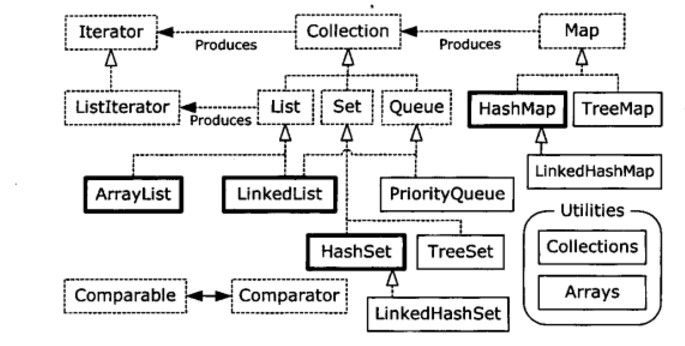
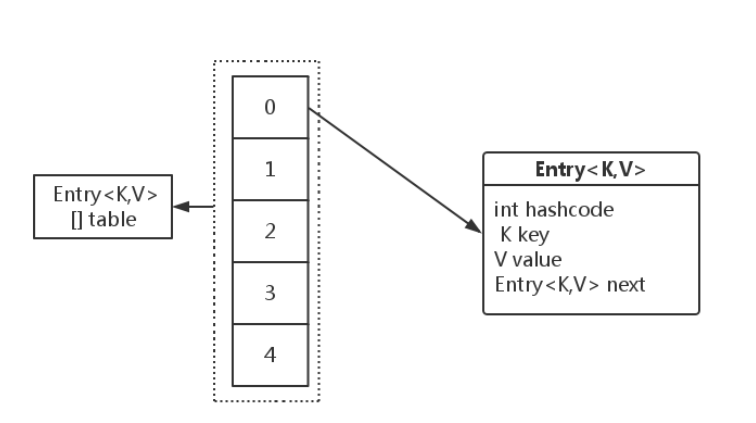
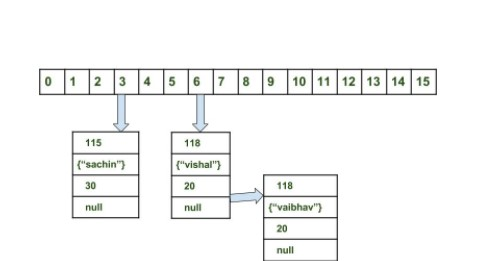

<!-- GFM-TOC -->
* [一、概览](#一概览)
    * [List](#list)
    * [Set](#set)
    * [Queue](#queue)
    * [Map](#map)
    * [Java 1.0/1.1 容器](#java-1011-容器)
* [二、容器中的设计模式](#二容器中的设计模式)
    * [迭代器模式](#迭代器模式)
    * [适配器模式](#适配器模式)
* [三、散列](#三散列)
* [四、源码分析](#四源码分析)
    * [ArrayList](#arraylist)
    * [Vector 与 Stack](#vector-与-stack)
    * [LinkedList](#linkedlist)
    * [TreeMap](#treemap)
    * [HashMap](#hashmap)
    * [LinkedHashMap](#linkedhashmap)
    * [ConcurrentHashMap](#concurrenthashmap)
* [五、参考资料](#五参考资料)
<!-- GFM-TOC -->


# 一、概览

<div align="center">  </div><br>

容器主要包括 Collection 和 Map 两种，Collection 又包含了 List、Set 以及 Queue。

## List

- ArrayList：基于动态数组实现，支持随机访问；

- LinkedList：基于双向循环链表实现，只能顺序访问，但是可以快速地在链表中间插入和删除元素。不仅如此，LinkedList 还可以用作栈、队列和双端队列。

## Set

- HashSet：基于 Hash 实现，支持快速查找，但是失去有序性；

- TreeSet：基于红黑树实现，保持有序，但是查找效率不如 HashSet；

- LinkedHashSet：具有 HashSet 的查找效率，且内部使用链表维护元素的插入顺序，因此具有有序性。

## Queue

只有两个实现：LinkedList 和 PriorityQueue，其中 LinkedList 支持双向队列，PriorityQueue 是基于堆结构实现。

## Map

- HashMap：基于 Hash 实现。

- LinkedHashMap：使用链表来维护元素的顺序，顺序为插入顺序或者最近最少使用（LRU）顺序。

- TreeMap：基于红黑树实现。

- ConcurrentHashMap：线程安全 Map，不涉及类似于 HashTable 的同步加锁。

## Java 1.0/1.1 容器

对于旧的容器，我们决不应该使用它们，只需要对它们进行了解。

- Vector：和 ArrayList 类似，但它是线程安全的。

- HashTable：和 HashMap 类似，但它是线程安全的。

# 二、容器中的设计模式

## 迭代器模式

从概览图可以看到，每个集合类都有一个 Iterator 对象，可以通过这个迭代器对象来遍历集合中的元素。

[Java 中的迭代器模式](https://github.com/CyC2018/Interview-Notebook/blob/master/notes/%E8%AE%BE%E8%AE%A1%E6%A8%A1%E5%BC%8F.md#1-%E8%BF%AD%E4%BB%A3%E5%99%A8%E6%A8%A1%E5%BC%8F)

## 适配器模式

java.util.Arrays#asList() 可以把数组类型转换为 List 类型。

```java
 List list = Arrays.asList(1, 2, 3);
 int[] arr = {1, 2, 3};
 list = Arrays.asList(arr);
```

# 三、散列

使用 hasCode() 来返回散列值，使用的是对象的地址。

而 equals() 是用来判断两个对象是否相等的，相等的两个对象散列值一定要相同，但是散列值相同的两个对象不一定相等。

相等必须满足以下五个性质：

1. 自反性
2. 对称性
3. 传递性
4. 一致性（多次调用 x.equals(y)，结果不变）
5. 对任何不是 null 的对象 x 调用 x.equals(null) 结果都为 false

# 四、源码分析

建议先阅读 [算法-查找](https://github.com/CyC2018/Interview-Notebook/blob/master/notes/%E7%AE%97%E6%B3%95.md#%E6%9F%A5%E6%89%BE) 部分，对集合类源码的理解有很大帮助。

源码下载：[OpenJDK 1.7](http://download.java.net/openjdk/jdk7)

## ArrayList

[ArraList.java](https://github.com/CyC2018/JDK-Source-Code/tree/master/src/ArrayList.java)

### 1. 概览

实现了 RandomAccess 接口，因此支持随机访问，这是理所当然的，因为 ArrayList 是基于数组实现的。

```java
public class ArrayList<E> extends AbstractList<E>
    implements List<E>, RandomAccess, Cloneable, java.io.Serializable
```

基于数组实现，保存元素的数组使用 transient 修饰，该关键字声明该数组默认不会被序列化。这是因为该数组不是所有位置都占满元素，因此也就没必要全部都进行序列化。ArrayList 重写了 writeObject() 和 readObject() 来控制只序列化数组中有元素填充那么部分内容。

```java
private transient Object[] elementData;
```

数组的默认大小为 10。

```java
public ArrayList(int initialCapacity) {
    super();
    if (initialCapacity < 0)
        throw new IllegalArgumentException("Illegal Capacity: "+ initialCapacity);
    this.elementData = new Object[initialCapacity];
}

public ArrayList() {
    this(10);
}
```

删除元素时调用 System.arraycopy() 对元素进行复制，因此删除操作成本很高。

```java
public E remove(int index) {
    rangeCheck(index);

    modCount++;
    E oldValue = elementData(index);

    int numMoved = size - index - 1;
    if (numMoved > 0)
        System.arraycopy(elementData, index+1, elementData, index, numMoved);
    elementData[--size] = null; // Let gc do its work

    return oldValue;
}
```

添加元素时使用 ensureCapacity() 方法来保证容量足够，如果不够时，需要使用 grow() 方法进行扩容，使得新容量为旧容量的 1.5 倍。扩容操作需要把原数组整个复制到新数组中，因此最好在创建 ArrayList 时就指定大概的容量大小，减少扩容操作的次数。

```java
private void ensureCapacityInternal(int minCapacity) {
    modCount++;
    // overflow-conscious code
    if (minCapacity - elementData.length > 0)
        grow(minCapacity);
}

private void grow(int minCapacity) {
    // overflow-conscious code
    int oldCapacity = elementData.length;
    int newCapacity = oldCapacity + (oldCapacity >> 1);
    if (newCapacity - minCapacity < 0)
        newCapacity = minCapacity;
    if (newCapacity - MAX_ARRAY_SIZE > 0)
        newCapacity = hugeCapacity(minCapacity);
    // minCapacity is usually close to size, so this is a win:
    elementData = Arrays.copyOf(elementData, newCapacity);
}

private static int hugeCapacity(int minCapacity) {
    if (minCapacity < 0) // overflow
        throw new OutOfMemoryError();
    return (minCapacity > MAX_ARRAY_SIZE) ?
        Integer.MAX_VALUE :
        MAX_ARRAY_SIZE;
}
```

### 2. Fail-Fast

modCount 用来记录 ArrayList 结构发生变化的次数，结构发生变化是指添加或者删除至少一个元素的所有操作，或者是调整内部数组的大小，仅仅只是设置元素的值不算结构发生变化。

在进行序列化或者迭代等操作时，需要比较操作前后 modCount 是否改变，如果改变了需要抛出 ConcurrentModificationException。

```java
private void writeObject(java.io.ObjectOutputStream s) throws java.io.IOException{
    // Write out element count, and any hidden stuff
    int expectedModCount = modCount;
    s.defaultWriteObject();

    // Write out array length
    s.writeInt(elementData.length);

    // Write out all elements in the proper order.
    for (int i = 0; i < size; i++)
        s.writeObject(elementData[i]);

    if (modCount != expectedModCount) {
        throw new ConcurrentModificationException();
    }
}
```

### 3. 和 Vector 的区别

1.  Vector 和 ArrayList 几乎是完全相同的，唯一的区别在于 Vector 是同步的，因此开销就比 ArrayList 要大，访问速度更慢。最好使用 ArrayList 而不是 Vector，因为同步操作完全可以由程序员自己来控制；
2.  Vector 每次扩容请求其大小的 2 倍空间，而 ArrayList 是 1.5 倍。

为了获得线程安全的 ArrayList，可以调用 Collections.synchronizedList(new ArrayList<>()); 返回一个线程安全的 ArrayList，也可以使用 concurrent 并发包下的 CopyOnWriteArrayList 类；

### 4. 和 LinkedList 的区别

1. ArrayList 基于动态数组实现，LinkedList 基于双向循环链表实现；
2. ArrayList 支持随机访问，LinkedList 不支持；
3. LinkedList 在任意位置添加删除元素更快。

## Vector 与 Stack

[Vector.java](https://github.com/CyC2018/JDK-Source-Code/tree/master/src/Vector.java)

## LinkedList

[LinkedList.java](https://github.com/CyC2018/JDK-Source-Code/tree/master/src/LinkedList.java)

## TreeMap

[TreeMap.java](https://github.com/CyC2018/JDK-Source-Code/tree/master/src/TreeMap.java)

## HashMap

[HashMap.java](https://github.com/CyC2018/JDK-Source-Code/tree/master/src/HashMap.java)

### 1. 基本数据结构

使用拉链法来解决冲突，内部包含了一个 Entry 类型的数组 table，数组中的每个位置被当成一个桶。

```java
transient Entry[] table;
```

其中，Entry 就是存储数据的键值对，它包含了四个字段。从 next 字段我们可以看出 Entry 是一个链表，即每个桶会存放一个链表。

<div align="center">  </div><br>

### 2. 拉链法的工作原理

使用默认构造函数新建一个 HashMap，默认大小为 16。Entry 的类型为 &lt;String, Integer>。先后插入三个元素：("sachin", 30), ("vishal", 20) 和 ("vaibhav", 20)。计算 "sachin" 的 hashcode 为 115，使用除留余数法得到 115 % 16 = 3，因此 ("sachin", 30) 键值对放到第 3 个桶上。同样得到 ("vishal", 20) 和 ("vaibhav", 20) 都应该放到第 6 个桶上，因此需要把  ("vaibhav", 20) 链接到 ("vishal", 20) 之后。

<div align="center">  </div><br>

当进行查找时，需要分成两步进行，第一步是先根据 hashcode 计算出所在的桶，第二步是在链表上顺序查找。由于 table 是数组形式的，具有随机读取的特性，因此这一步的时间复杂度为 O(1)，而第二步需要在链表上顺序查找，时间复杂度显然和链表的长度成正比。

### 3. 扩容

设 HashMap 的 table 长度为 M，需要存储的键值对数量为 N，如果哈希函数满足均匀性的要求，那么每条链表的长度大约为 N/M，因此平均查找次数的数量级为 O(N/M)。

为了让查找的成本降低，应该尽可能使得 N/M 尽可能小，因此需要保证 M 尽可能大，可就是说 table 要尽可能大。HashMap 采用动态扩容来根据当前的 N 值来调整 M 值，使得空间效率和时间效率都能得到保证。

和扩容相关的参数主要有：capacity、size、threshold 和 load_factor。

capacity 表示 table 的容量大小，默认为 16，需要注意的是容量必须保证为 2 的次方。容量就是 table 数组的长度，size 是数组的实际使用量。

threshold 规定了一个 size 的临界值，size 必须小于 threshold，如果大于等于，就必须进行扩容操作。

threshold = capacity * load_factor，其中 load_factor 为 table 数组能够使用的比例。

```java
static final int DEFAULT_INITIAL_CAPACITY = 16;

static final int MAXIMUM_CAPACITY = 1 << 30;

static final float DEFAULT_LOAD_FACTOR = 0.75f;

transient Entry[] table;

transient int size;

int threshold;

final float loadFactor;

transient int modCount;
```

从下面的添加元素代码中可以看出，当需要扩容时，令 capacity 为原来的两倍。

```java
void addEntry(int hash, K key, V value, int bucketIndex) {
    Entry<K,V> e = table[bucketIndex];
    table[bucketIndex] = new Entry<>(hash, key, value, e);
    if (size++ >= threshold)
        resize(2 * table.length);
}
```

扩容使用 resize() 实现，需要注意的是，扩容操作同样需要把旧 table 的所有键值对重新插入新的 table 中，因此这一步是很费时的。但是从均摊分析的角度来考虑，HashMap 的查找速度依然在常数级别。

```java
void resize(int newCapacity) {
    Entry[] oldTable = table;
    int oldCapacity = oldTable.length;
    if (oldCapacity == MAXIMUM_CAPACITY) {
        threshold = Integer.MAX_VALUE;
        return;
    }

    Entry[] newTable = new Entry[newCapacity];
    transfer(newTable);
    table = newTable;
    threshold = (int)(newCapacity * loadFactor);
}

void transfer(Entry[] newTable) {
    Entry[] src = table;
    int newCapacity = newTable.length;
    for (int j = 0; j < src.length; j++) {
        Entry<K,V> e = src[j];
        if (e != null) {
            src[j] = null;
            do {
                Entry<K,V> next = e.next;
                int i = indexFor(e.hash, newCapacity);
                e.next = newTable[i];
                newTable[i] = e;
                e = next;
            } while (e != null);
        }
    }
}
```

### 4. null 值

get() 操作需要分成两种情况，key 为 null 和不为 null，从中可以看出 HashMap 允许插入 null 作为键。

```java
public V get(Object key) {
    if (key == null)
        return getForNullKey();
    int hash = hash(key.hashCode());
    for (Entry<K,V> e = table[indexFor(hash, table.length)]; e != null; e = e.next) {
        Object k;
        if (e.hash == hash && ((k = e.key) == key || key.equals(k)))
            return e.value;
    }
    return null;
}
```

put() 操作也需要根据 key 是否为 null 做不同的处理，需要注意的是如果本来没有 key 为 null 的键值对，新插入一个 key 为 null 的键值对时默认是放在数组的 0 位置，这是因为 null 不能计算 hash 值，也就无法知道应该放在哪个链表上。

```java
public V put(K key, V value) {
    if (key == null)
        return putForNullKey(value);
    int hash = hash(key.hashCode());
    int i = indexFor(hash, table.length);
    for (Entry<K,V> e = table[i]; e != null; e = e.next) {
        Object k;
        if (e.hash == hash && ((k = e.key) == key || key.equals(k))) {
            V oldValue = e.value;
            e.value = value;
            e.recordAccess(this);
            return oldValue;
        }
    }

    modCount++;
    addEntry(hash, key, value, i);
    return null;
}
```

```java
private V putForNullKey(V value) {
    for (Entry<K,V> e = table[0]; e != null; e = e.next) {
        if (e.key == null) {
            V oldValue = e.value;
            e.value = value;
            e.recordAccess(this);
            return oldValue;
        }
    }
    modCount++;
    addEntry(0, null, value, 0);
    return null;
}
```

### 5. 与 HashTable 的区别

- HashMap 几乎可以等价于 Hashtable，除了 HashMap 是非 synchronized 的，并可以接受 null(HashMap 可以接受为 null 的键值 (key) 和值 (value)，而 Hashtable 则不行)。
- HashMap 是非 synchronized，而 Hashtable 是 synchronized，这意味着 Hashtable 是线程安全的，多个线程可以共享一个 Hashtable；而如果没有正确的同步的话，多个线程是不能共享 HashMap 的。Java 5 提供了 ConcurrentHashMap，它是 HashTable 的替代，比 HashTable 的扩展性更好。
- 另一个区别是 HashMap 的迭代器 (Iterator) 是 fail-fast 迭代器，而 Hashtable 的 enumerator 迭代器不是 fail-fast 的。所以当有其它线程改变了 HashMap 的结构（增加或者移除元素），将会抛出 ConcurrentModificationException，但迭代器本身的 remove() 方法移除元素则不会抛出 ConcurrentModificationException 异常。但这并不是一个一定发生的行为，要看 JVM。这条同样也是 Enumeration 和 Iterator 的区别。
- 由于 Hashtable 是线程安全的也是 synchronized，所以在单线程环境下它比 HashMap 要慢。如果你不需要同步，只需要单一线程，那么使用 HashMap 性能要好过 Hashtable。
- HashMap 不能保证随着时间的推移 Map 中的元素次序是不变的。

> [What is difference between HashMap and Hashtable in Java?](http://javarevisited.blogspot.hk/2010/10/difference-between-hashmap-and.html)

## LinkedHashMap

[LinkedHashMap.java](https://github.com/CyC2018/JDK-Source-Code/tree/master/src/HashMap.java)

## ConcurrentHashMap

[ConcurrentHashMap.java](https://github.com/CyC2018/JDK-Source-Code/tree/master/src/HashMap.java)

[探索 ConcurrentHashMap 高并发性的实现机制](https://www.ibm.com/developerworks/cn/java/java-lo-concurrenthashmap/)

# 五、参考资料

- Java 编程思想
