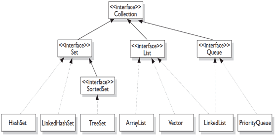
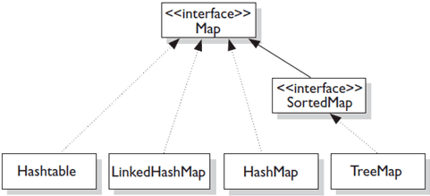
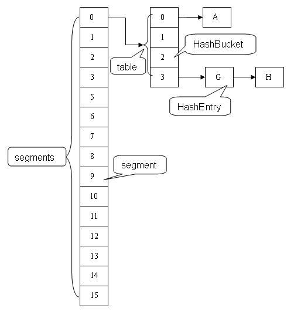
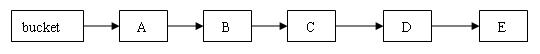
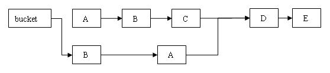
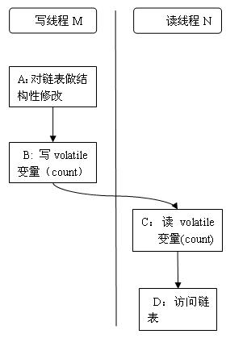

<!-- GFM-TOC -->
* [一、概览](#一概览)
    * [Collection](#collection)
    * [Map](#map)
* [二、容器中的设计模式](#二容器中的设计模式)
    * [迭代器模式](#迭代器模式)
    * [适配器模式](#适配器模式)
* [三、散列](#三散列)
* [四、源码分析](#四源码分析)
    * [ArrayList](#arraylist)
    * [Vector](#vector)
    * [LinkedList](#linkedlist)
    * [TreeMap](#treemap)
    * [HashMap](#hashmap)
    * [LinkedHashMap](#linkedhashmap)
    * [ConcurrentHashMap - JDK 1.7](#concurrenthashmap---jdk-17)
    * [ConcurrentHashMap - JDK 1.8](#concurrenthashmap---jdk-18)
* [五、参考资料](#五参考资料)
<!-- GFM-TOC -->


# 一、概览

容器主要包括 Collection 和 Map 两种，Collection 又包含了 List、Set 以及 Queue。

## Collection

<div align="center">  </div><br>

### 1. Set

- HashSet：基于哈希实现，支持快速查找，但不支持有序性操作，例如根据一个范围查找元素的操作。并且失去了元素的插入顺序信息，也就是说使用 Iterator 遍历 HashSet 得到的结果是不确定的。

- TreeSet：基于红黑树实现，支持有序性操作，但是查找效率不如 HashSet，HashSet 查找时间复杂度为 O(1)，TreeSet 则为 O(logN)；

- LinkedHashSet：具有 HashSet 的查找效率，且内部使用链表维护元素的插入顺序。

### 2. List

- ArrayList：基于动态数组实现，支持随机访问；

- Vector：和 ArrayList 类似，但它是线程安全的；

- LinkedList：基于双向循环链表实现，只能顺序访问，但是可以快速地在链表中间插入和删除元素。不仅如此，LinkedList 还可以用作栈、队列和双端队列。

### 3. Queue

- LinkedList：可以用它来支持双向队列；

- PriorityQueue：基于堆结构实现，可以用它来实现优先级队列。

## Map

<div align="center">  </div><br>

- HashMap：基于哈希实现；

- HashTable：和 HashMap 类似，但它是线程安全的，这意味着同一时刻多个线程可以同时写入 HashTable 并且不会导致数据不一致。它是遗留类，不应该去使用它。现在可以使用 ConcurrentHashMap 来支持线程安全，并且 ConcurrentHashMap 的效率会更高，因为 ConcurrentHashMap 引入了分段锁。

- LinkedHashMap：使用链表来维护元素的顺序，顺序为插入顺序或者最近最少使用（LRU）顺序。

- TreeMap：基于红黑树实现。

# 二、容器中的设计模式

## 迭代器模式

<div align="center">  </div><br>

Collection 实现了 Iterable 接口，其中的 iterator() 方法能够产生一个 Iterator 对象，通过这个对象就可以迭代遍历 Collection 中的元素。

从 JDK 1.5 之后可以使用 foreach 方法来遍历实现了 Iterable 接口的聚合对象。

```java
List<String> list = new ArrayList<>();
list.add("a");
list.add("b");
for (String item : list) {
    System.out.println(item);
}
```

## 适配器模式

java.util.Arrays#asList() 可以把数组类型转换为 List 类型。

```java
@SafeVarargs
public static <T> List<T> asList(T... a)
```

如果要将数组类型转换为 List 类型，应该注意的是 asList() 的参数为泛型的变长参数，因此不能使用基本类型数组作为参数，只能使用相应的包装类型数组。

```java
Integer[] arr = {1, 2, 3};
List list = Arrays.asList(arr);
```

也可以使用以下方式生成 List。

```java
List list = Arrays.asList(1,2,3);
```

# 三、散列

hasCode() 返回散列值，使用的是对象的地址。

而 equals() 是用来判断两个对象是否相等的，相等的两个对象散列值一定要相同，但是散列值相同的两个对象不一定相等。

相等必须满足以下五个性质：

**1. 自反性** 

```java
x.equals(x); // true
```

**2. 对称性** 

```java
x.equals(y) == y.equals(x) // true
```

**3. 传递性** 

```java
if(x.equals(y) && y.equals(z)) {
    x.equals(z); // true;
}
```

**4. 一致性** 

多次调用 equals() 方法结果不变

```java
x.equals(y) == x.equals(y); // true
```

**5. 与 null 的比较** 

对任何不是 null 的对象 x 调用 x.equals(null) 结果都为 false

```java
x.euqals(null); // false;
```

# 四、源码分析

建议先阅读 [算法-查找](https://github.com/CyC2018/Interview-Notebook/blob/master/notes/%E7%AE%97%E6%B3%95.md#%E6%9F%A5%E6%89%BE) 部分，对容器类源码的理解有很大帮助。

至于 ConcurrentHashMap 的理解，需要有并发方面的知识，建议先阅读：[Java 并发](https://github.com/CyC2018/Interview-Notebook/blob/master/notes/Java%20%E5%B9%B6%E5%8F%91.md)

以下源码从 JDK 1.8 提取而来，下载地址：[JDK-Source-Code](https://github.com/CyC2018/JDK-Source-Code)。

## ArrayList

[ArraList.java](https://github.com/CyC2018/JDK-Source-Code/tree/master/src/ArrayList.java)

### 1. 概览

实现了 RandomAccess 接口，因此支持随机访问，这是理所当然的，因为 ArrayList 是基于数组实现的。

```java
public class ArrayList<E> extends AbstractList<E>
        implements List<E>, RandomAccess, Cloneable, java.io.Serializable
```

基于数组实现，保存元素的数组使用 transient 修饰，该关键字声明数组默认不会被序列化。ArrayList 具有动态扩容特性，因此保存元素的数组不一定都会被使用，那么就没必要全部进行序列化。ArrayList 重写了 writeObject() 和 readObject() 来控制只序列化数组中有元素填充那部分内容。

```java
transient Object[] elementData; // non-private to simplify nested class access
```

数组的默认大小为 10。

```java
private static final int DEFAULT_CAPACITY = 10;
```

删除元素时需要调用 System.arraycopy() 对元素进行复制，因此删除操作成本很高。

```java
public E remove(int index) {
    rangeCheck(index);

    modCount++;
    E oldValue = elementData(index);

    int numMoved = size - index - 1;
    if (numMoved > 0)
        System.arraycopy(elementData, index+1, elementData, index, numMoved);
    elementData[--size] = null; // clear to let GC do its work

    return oldValue;
}
```

添加元素时使用 ensureCapacity() 方法来保证容量足够，如果不够时，需要使用 grow() 方法进行扩容，使得新容量为旧容量的 1.5 倍（oldCapacity + (oldCapacity >> 1))。扩容操作需要把原数组整个复制到新数组中，因此最好在创建 ArrayList 对象时就指定大概的容量大小，减少扩容操作的次数。

```java
private void ensureExplicitCapacity(int minCapacity) {
    modCount++;

    // overflow-conscious code
    if (minCapacity - elementData.length > 0)
        grow(minCapacity);
}

private void grow(int minCapacity) {
    // overflow-conscious code
    int oldCapacity = elementData.length;
    int newCapacity = oldCapacity + (oldCapacity >> 1);
    if (newCapacity - minCapacity < 0)
        newCapacity = minCapacity;
    if (newCapacity - MAX_ARRAY_SIZE > 0)
        newCapacity = hugeCapacity(minCapacity);
    // minCapacity is usually close to size, so this is a win:
    elementData = Arrays.copyOf(elementData, newCapacity);
}
```

### 2. Fail-Fast

modCount 用来记录 ArrayList 结构发生变化的次数。结构发生变化是指添加或者删除至少一个元素的所有操作，或者是调整内部数组的大小，仅仅只是设置元素的值不算结构发生变化。

在进行序列化或者迭代等操作时，需要比较操作前后 modCount 是否改变，如果改变了需要抛出 ConcurrentModificationException。

```java
private void writeObject(java.io.ObjectOutputStream s)
    throws java.io.IOException{
    // Write out element count, and any hidden stuff
    int expectedModCount = modCount;
    s.defaultWriteObject();

    // Write out size as capacity for behavioural compatibility with clone()
    s.writeInt(size);

    // Write out all elements in the proper order.
    for (int i=0; i<size; i++) {
        s.writeObject(elementData[i]);
    }

    if (modCount != expectedModCount) {
        throw new ConcurrentModificationException();
    }
}
```

### 3. 和 Vector 的区别

- Vector 和 ArrayList 几乎是完全相同的，唯一的区别在于 Vector 是同步的，因此开销就比 ArrayList 要大，访问速度更慢。最好使用 ArrayList 而不是 Vector，因为同步操作完全可以由程序员自己来控制；
- Vector 每次扩容请求其大小的 2 倍空间，而 ArrayList 是 1.5 倍。

为了获得线程安全的 ArrayList，可以调用 Collections.synchronizedList(new ArrayList<>()); 返回一个线程安全的 ArrayList，也可以使用 concurrent 并发包下的 CopyOnWriteArrayList 类；

### 4. 和 LinkedList 的区别

- ArrayList 基于动态数组实现，LinkedList 基于双向循环链表实现；
- ArrayList 支持随机访问，LinkedList 不支持；
- LinkedList 在任意位置添加删除元素更快。

## Vector

[Vector.java](https://github.com/CyC2018/JDK-Source-Code/tree/master/src/Vector.java)

## LinkedList

[LinkedList.java](https://github.com/CyC2018/JDK-Source-Code/tree/master/src/LinkedList.java)

## TreeMap

[TreeMap.java](https://github.com/CyC2018/JDK-Source-Code/tree/master/src/TreeMap.java)

## HashMap

[HashMap.java](https://github.com/CyC2018/JDK-Source-Code/tree/master/src/HashMap.java)

### 1. 存储结构

使用拉链法来解决冲突，内部包含了一个 Entry 类型的数组 table，数组中的每个位置被当成一个桶。

```java
transient Entry[] table;
```

其中，Entry 就是存储数据的键值对，它包含了四个字段。从 next 字段我们可以看出 Entry 是一个链表，即每个桶会存放一个链表。

<div align="center">  </div><br>

JDK 1.8 使用 Node 类型存储一个键值对，它依然继承自 Entry，因此可以按照上面的存储结构来理解。

```java
static class Node<K,V> implements Map.Entry<K,V> {
    final int hash;
    final K key;
    V value;
    Node<K,V> next;

    Node(int hash, K key, V value, Node<K,V> next) {
        this.hash = hash;
        this.key = key;
        this.value = value;
        this.next = next;
    }

    public final K getKey()        { return key; }
    public final V getValue()      { return value; }
    public final String toString() { return key + "=" + value; }

    public final int hashCode() {
        return Objects.hashCode(key) ^ Objects.hashCode(value);
    }

    public final V setValue(V newValue) {
        V oldValue = value;
        value = newValue;
        return oldValue;
    }

    public final boolean equals(Object o) {
        if (o == this)
            return true;
        if (o instanceof Map.Entry) {
            Map.Entry<?,?> e = (Map.Entry<?,?>)o;
            if (Objects.equals(key, e.getKey()) &&
                Objects.equals(value, e.getValue()))
                return true;
        }
        return false;
    }
}
```

### 2. 拉链法的工作原理

```java
HashMap<String, String> map = new HashMap<>();
map.put("K1", "V1");
map.put("K2", "V2");
map.put("K3", "V3");
```

- 新建一个 HashMap，默认大小为 16；
- 插入 &lt;K1,V1> 键值对，先计算 K1 的 hashCode 为 115，使用除留余数法得到所在的桶下标 115%16=3。
- 插入 &lt;K2,V2> 键值对，先计算 K2 的 hashCode 为 118，使用除留余数法得到所在的桶下标 118%16=6。
- 插入 &lt;K3,V3> 键值对，先计算 K3 的 hashCode 为 118，使用除留余数法得到所在的桶下标 118%16=6，插在 &lt;K2,V2> 后面。

<div align="center">  </div><br>

查找需要分成两步进行：

- 计算键值对所在的桶；
- 在链表上顺序查找，时间复杂度显然和链表的长度成正比。

### 3. 链表转红黑树

应该注意到，从 JDK 1.8 开始，一个桶存储的链表长度大于 8 时会将链表转换为红黑树。

### 4. 扩容

因为从 JDK 1.8 开始引入了红黑树，因此扩容操作较为复杂，为了便于理解，以下内容使用 JDK 1.7 的内容。

设 HashMap 的 table 长度为 M，需要存储的键值对数量为 N，如果哈希函数满足均匀性的要求，那么每条链表的长度大约为 N/M，因此平均查找次数的数量级为 O(N/M)。

为了让查找的成本降低，应该尽可能使得 N/M 尽可能小，因此需要保证 M 尽可能大，也就是说 table 要尽可能大。HashMap 采用动态扩容来根据当前的 N 值来调整 M 值，使得空间效率和时间效率都能得到保证。

和扩容相关的参数主要有：capacity、size、threshold 和 load_factor。

| 参数 | 含义 |
| :--: | :-- |
| capacity | table 的容量大小，默认为 16，需要注意的是 capacity 必须保证为 2 的次方。|
| size | table 的实际使用量。 |
| threshold | size 的临界值，size 必须小于 threshold，如果大于等于，就必须进行扩容操作。 |
| load_factor | table 能够使用的比例，threshold = capacity * load_factor。|

```java
static final int DEFAULT_INITIAL_CAPACITY = 16;

static final int MAXIMUM_CAPACITY = 1 << 30;

static final float DEFAULT_LOAD_FACTOR = 0.75f;

transient Entry[] table;

transient int size;

int threshold;

final float loadFactor;

transient int modCount;
```

从下面的添加元素代码中可以看出，当需要扩容时，令 capacity 为原来的两倍。

```java
void addEntry(int hash, K key, V value, int bucketIndex) {
    Entry<K,V> e = table[bucketIndex];
    table[bucketIndex] = new Entry<>(hash, key, value, e);
    if (size++ >= threshold)
        resize(2 * table.length);
}
```

扩容使用 resize() 实现，需要注意的是，扩容操作同样需要把旧 table 的所有键值对重新插入新的 table 中，因此这一步是很费时的。

```java
void resize(int newCapacity) {
    Entry[] oldTable = table;
    int oldCapacity = oldTable.length;
    if (oldCapacity == MAXIMUM_CAPACITY) {
        threshold = Integer.MAX_VALUE;
        return;
    }

    Entry[] newTable = new Entry[newCapacity];
    transfer(newTable);
    table = newTable;
    threshold = (int)(newCapacity * loadFactor);
}

void transfer(Entry[] newTable) {
    Entry[] src = table;
    int newCapacity = newTable.length;
    for (int j = 0; j < src.length; j++) {
        Entry<K,V> e = src[j];
        if (e != null) {
            src[j] = null;
            do {
                Entry<K,V> next = e.next;
                int i = indexFor(e.hash, newCapacity);
                e.next = newTable[i];
                newTable[i] = e;
                e = next;
            } while (e != null);
        }
    }
}
```

### 5. 确定桶下标

很多操作都需要先确定一个键值对所在的桶下标，需要分三步进行。

（一）hashCode()

调用 Key 的 hashCode() 方法得到 hashCode。

```java
public final int hashCode() {
    return Objects.hashCode(key) ^ Objects.hashCode(value);
}
```

（二）高位运算

将 hashCode 的高 16 位和低 16 位进行异或操作，使得在数组比较小时，也能保证高低位都参与到了哈希计算中。

```java
static final int hash(Object key) {
    int h;
    return (key == null) ? 0 : (h = key.hashCode()) ^ (h >>> 16);
}
```

（三）除留余数法

令 x = 1<<4，即 x 为 2 的 4 次方，它具有以下性质：

```
x   : 00010000
x-1 : 00001111
```

令一个数 y 与 x-1 做与运算，可以去除 y 位级表示的第 4 位及以上数：

```
y       : 10110010
x-1     : 00001111
y&(x-1) : 00000010
```

这个性质和 y 对 x 取模效果是一样的：

```
x   : 00010000
y   : 10110010
y%x : 00000010
```

我们知道，位运算的代价比求模运算小的多，因此在进行这种计算时能用位运算的话能带来更高的性能。

拉链法需要使用除留余数法来得到桶下标，也就是需要进行以下计算：hash%capacity，如果能保证 capacity 为 2 的幂次方，那么就可以将这个操作转换位位运算。

以下操作在 Java 8 中没有，但是原理上相同。

```java
static int indexFor(int h, int length) {
    return h & (length-1);
}
```

### 6. 扩容-重新计算桶下标

在进行扩容时，需要把 Node 重新放到对应的桶上。HashMap 使用了一个特殊的机制，可以降低重新计算桶下标的操作。

假设原数组长度 capacity 为 8，扩容之后 new capacity 为 16：

```html
capacity     : 00010000
new capacity : 00100000
```

对于一个 Key，它的 hashCode 如果在第 6 位上为 0，那么除留余数得到的结果和之前一样；如果为 1，那么得到的结果为原来的结果 + 8。

### 7. 扩容-计算数组容量

先考虑如何求一个数的补码，对于 10010000，它的掩码为 11111111，可以使用以下方法得到：

```
mask |= mask >> 1    11011000
mask |= mask >> 2    11111100
mask |= mask >> 4    11111111
```

如果最后令 mask+1，得到就是大于原始数字的最小的 2 次方。

以下是 HashMap 中计算一个大小所需要的数组容量的代码：

```java
static final int tableSizeFor(int cap) {
    int n = cap - 1;
    n |= n >>> 1;
    n |= n >>> 2;
    n |= n >>> 4;
    n |= n >>> 8;
    n |= n >>> 16;
    return (n < 0) ? 1 : (n >= MAXIMUM_CAPACITY) ? MAXIMUM_CAPACITY : n + 1;
}
```

### 7. null 值

HashMap 允许有一个 Node 的 Key 为 null，该 Node 一定会放在第 0 个桶的位置，因为这个 Key 无法计算 hashCode()，因此只能规定一个桶让它存放。

### 8. 与 HashTable 的区别

- HashTable 是同步的，它使用了 synchronized 来进行同步。它也是线程安全的，多个线程可以共享同一个 HashTable。HashMap 不是同步的，但是可以使用 ConcurrentHashMap，它是 HashTable 的替代，而且比 HashTable 可扩展性更好。
- HashMap 可以插入键为 null 的 Entry。
- HashMap 的迭代器是 fail-fast 迭代器，而 Hashtable 的 enumerator 迭代器不是 fail-fast 的。
- 由于 Hashtable 是线程安全的也是 synchronized，所以在单线程环境下它比 HashMap 要慢。
- HashMap 不能保证随着时间的推移 Map 中的元素次序是不变的。

## LinkedHashMap

[LinkedHashMap.java](https://github.com/CyC2018/JDK-Source-Code/tree/master/src/HashMap.java)

## ConcurrentHashMap - JDK 1.7

[ConcurrentHashMap.java](https://github.com/CyC2018/JDK-Source-Code/blob/master/src/1.7/ConcurrentHashMap.java)

ConcurrentHashMap 和 HashMap 实现上类似，最主要的差别是 ConcurrentHashMap 采用了了分段锁，每个分段锁维护着几个桶，多个线程可以同时访问不同分段锁上的桶。

相比于 HashTable 和用同步包装器包装的 HashMap（Collections.synchronizedMap(new HashMap())），ConcurrentHashMap 拥有更高的并发性。在 HashTable 和由同步包装器包装的 HashMap 中，使用一个全局的锁来同步不同线程间的并发访问。同一时间点，只能有一个线程持有锁，也就是说在同一时间点，只能有一个线程能访问容器。这虽然保证多线程间的安全并发访问，但同时也导致对容器的访问变成串行化的了。

### 1. 存储结构

和 HashMap 类似。

```java
static final class HashEntry<K,V> {
    final int hash;
    final K key;
    volatile V value;
    volatile HashEntry<K,V> next;
}
```

继承自 ReentrantLock，每个 Segment 维护着多个 HashEntry。

```java
static final class Segment<K,V> extends ReentrantLock implements Serializable {

    private static final long serialVersionUID = 2249069246763182397L;

    static final int MAX_SCAN_RETRIES =
        Runtime.getRuntime().availableProcessors() > 1 ? 64 : 1;

    transient volatile HashEntry<K,V>[] table;

    transient int count;

    transient int modCount;

    transient int threshold;

    final float loadFactor;
}
```

```java
final Segment<K,V>[] segments;
```

默认的并发级别为 16，也就是说默认创建 16 个 Segment。

```java
static final int DEFAULT_CONCURRENCY_LEVEL = 16;
```

<div align="center">  </div><br>

### 2. HashEntery 的不可变性

HashEntry 中的 key，hash，next 都声明为 final 型。这意味着，不能把节点添加到链接的中间和尾部，也不能在链接的中间和尾部删除节点。这个特性可以保证：在访问某个节点时，这个节点之后的链接不会被改变。这个特性可以大大降低处理链表时的复杂性。

同时，HashEntry 类的 value 域被声明为 Volatile 型，Java 的内存模型可以保证：某个写线程对 value 域的写入马上可以被后续的某个读线程 “看” 到。在 ConcurrentHashMap 中，不允许用 null 作为键和值，当读线程读到某个 HashEntry 的 value 域的值为 null 时，便知道产生了冲突——发生了重排序现象，需要加锁后重新读入这个 value 值。这些特性互相配合，使得读线程即使在不加锁状态下，也能正确访问 ConcurrentHashMap。

```java
final V remove(Object key, int hash, Object value) {
   if (!tryLock())
        scanAndLock(key, hash);
    V oldValue = null;
    try {
        HashEntry<K,V>[] tab = table;
        int index = (tab.length - 1) & hash;
        HashEntry<K,V> e = entryAt(tab, index);
        HashEntry<K,V> pred = null;
        while (e != null) {
            K k;
            HashEntry<K,V> next = e.next;
            if ((k = e.key) == key ||
                (e.hash == hash && key.equals(k))) {
                V v = e.value;
                if (value == null || value == v || value.equals(v)) {
                    if (pred == null)
                        setEntryAt(tab, index, next);
                    else
                        pred.setNext(next);
                    ++modCount;
                    --count;
                    oldValue = v;
                }
                break;
            }
            pred = e;
            e = next;
        }
    } finally {
        unlock();
    }
    return oldValue;
}
```

在以下链表中删除 C 节点，C 节点之后的所有节点都原样保留，C 节点之前的所有节点都被克隆到新的链表中，并且顺序被反转。可以注意到，在执行 remove 操作时，原始链表并没有被修改，也就是说，读线程不会受到执行 remove 操作的并发写线程的干扰。

<div align="center">  </div><br>

<div align="center">  </div><br>

除了 remove 操作，其它操作也类似。可以得出一个结论：写线程对某个链表的结构性修改不会影响其他的并发读线程对这个链表的遍历访问。

### 3. Volatile 变量

```java
static final class HashEntry<K,V> {
    final int hash;
    final K key;
    volatile V value;
    volatile HashEntry<K,V> next;
}
```

由于内存可见性问题，未正确同步的情况下，写线程写入的值可能并不为后续的读线程可见。

下面以写线程 M 和读线程 N 来说明 ConcurrentHashMap 如何协调读 / 写线程间的内存可见性问题。

<div align="center">  </div><br>

假设线程 M 在写入了 volatile 型变量 count 后，线程 N 读取了这个 volatile 型变量 count。

根据 happens-before 关系法则中的程序次序法则，A appens-before 于 B，C happens-before D。

根据 Volatile 变量法则，B happens-before C。

根据传递性，连接上面三个 happens-before 关系得到：A appens-before 于 B； B appens-before C；C happens-before D。也就是说：写线程 M 对链表做的结构性修改，在读线程 N 读取了同一个 volatile 变量后，对线程 N 也是可见的了。

虽然线程 N 是在未加锁的情况下访问链表。Java 的内存模型可以保证：只要之前对链表做结构性修改操作的写线程 M 在退出写方法前写 volatile 型变量 count，读线程 N 在读取这个 volatile 型变量 count 后，就一定能 “看到” 这些修改。

ConcurrentHashMap 中，每个 Segment 都有一个变量 count。它用来统计 Segment 中的 HashEntry 的个数。这个变量被声明为 volatile。

```java
transient volatile int count;
```

所有不加锁读方法，在进入读方法时，首先都会去读这个 count 变量。比如下面的 get 方法：

```java
V get(Object key, int hash) {
   if(count != 0) {       // 首先读 count 变量
       HashEntry<K,V> e = getFirst(hash);
       while(e != null) {
           if(e.hash == hash && key.equals(e.key)) {
               V v = e.value;
               if(v != null)
                   return v;
               // 如果读到 value 域为 null，说明发生了重排序，加锁后重新读取
               return readValueUnderLock(e);
           }
           e = e.next;
       }
   }
   return null;
}
```

在 ConcurrentHashMap 中，所有执行写操作的方法（put, remove, clear），在对链表做结构性修改之后，在退出写方法前都会去写这个 count 变量。所有未加锁的读操作（get, contains, containsKey）在读方法中，都会首先去读取这个 count 变量。

根据 Java 内存模型，对 同一个 volatile 变量的写 / 读操作可以确保：写线程写入的值，能够被之后未加锁的读线程 “看到”。

这个特性和前面介绍的 HashEntry 对象的不变性相结合，使得在 ConcurrentHashMap 中，读线程在读取散列表时，基本不需要加锁就能成功获得需要的值。这两个特性相配合，不仅减少了请求同一个锁的频率（读操作一般不需要加锁就能够成功获得值），也减少了持有同一个锁的时间（只有读到 value 域的值为 null 时 ，读线程才需要加锁后重读）。

### 4. 小结

ConcurrentHashMap 的高并发性主要来自于三个方面：

- 用分离锁实现多个线程间的更深层次的共享访问。
- 用 HashEntery 对象的不变性来降低执行读操作的线程在遍历链表期间对加锁的需求。
- 通过对同一个 Volatile 变量的写 / 读访问，协调不同线程间读 / 写操作的内存可见性。

## ConcurrentHashMap - JDK 1.8

[ConcurrentHashMap.java](https://github.com/CyC2018/JDK-Source-Code/blob/master/src/ConcurrentHashMap.java)

JDK 1.7 分段锁机制来实现并发更新操作，核心类为 Segment，它继承自重入锁 ReentrantLock。

JDK 1.8 的实现不是用了 Segment，Segment 属于重入锁 ReentrantLock。而是使用了内置锁 synchronized，主要是出于以下考虑：

1. synchronized 的锁粒度更低；
2. synchronized 优化空间更大；
3. 在大量数据操作的情况下，ReentrantLock 会开销更多的内存。

并且 JDK 1.8 的实现也在链表过长时会转换为红黑树。

# 五、参考资料

- Eckel B. Java 编程思想 [M]. 机械工业出版社, 2002.
- [Java Collection Framework](https://www.w3resource.com/java-tutorial/java-collections.php)
- [Iterator 模式](https://openhome.cc/Gossip/DesignPattern/IteratorPattern.htm)
- [Java 8 系列之重新认识 HashMap](https://tech.meituan.com/java-hashmap.html)
- [What is difference between HashMap and Hashtable in Java?](http://javarevisited.blogspot.hk/2010/10/difference-between-hashmap-and.html)
- [Java 集合之 HashMap](http://www.zhangchangle.com/2018/02/07/Java%E9%9B%86%E5%90%88%E4%B9%8BHashMap/)
- [The principle of ConcurrentHashMap analysis](http://www.programering.com/a/MDO3QDNwATM.html)
- [探索 ConcurrentHashMap 高并发性的实现机制](https://www.ibm.com/developerworks/cn/java/java-lo-concurrenthashmap/)
- [HashMap 相关面试题及其解答](https://www.jianshu.com/p/75adf47958a7)
- [Java 集合细节（二）：asList 的缺陷](http://wiki.jikexueyuan.com/project/java-enhancement/java-thirtysix.html)

