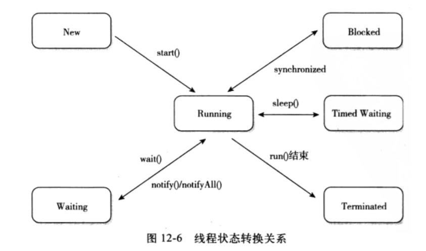
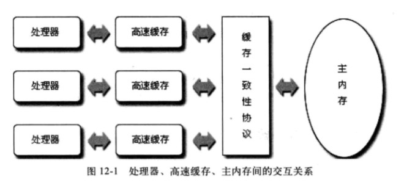
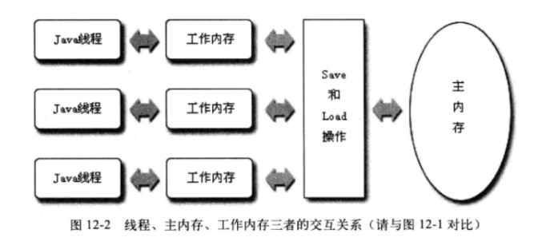
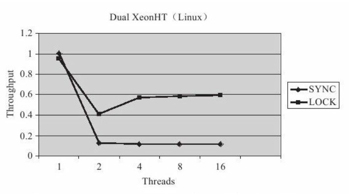
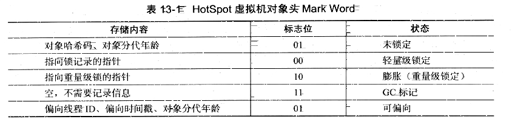
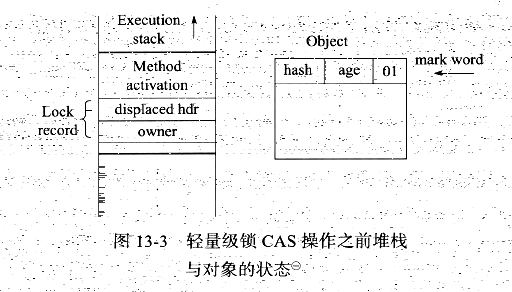
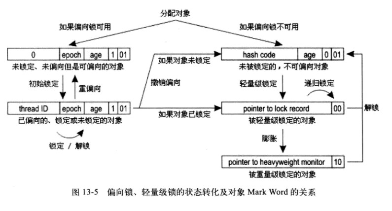

<!-- GFM-TOC -->
* [一、使用线程](#一使用线程)
    * [实现 Runnable 接口](#实现-runnable-接口)
    * [实现 Callable 接口](#实现-callable-接口)
    * [继承 Thread 类](#继承-thread-类)
    * [实现接口 VS 继承 Thread](#实现接口-vs-继承-thread)
* [二、Executor](#二executor)
* [三、基础线程机制](#三基础线程机制)
    * [sleep()](#sleep)
    * [yield()](#yield)
    * [join()](#join)
    * [deamon](#deamon)
* [四、线程之间的协作](#四线程之间的协作)
    * [线程通信](#线程通信)
    * [线程同步](#线程同步)
        * [1. synchronized](#1-synchronized)
        * [2. Lock](#2-lock)
        * [3. BlockingQueue](#3-blockingqueue)
* [五、结束线程](#五结束线程)
    * [阻塞](#阻塞)
    * [中断](#中断)
* [六、线程状态转换](#六线程状态转换)
* [七、volatile](#七volatile)
    * [保证内存可见性](#保证内存可见性)
    * [禁止指令重排](#禁止指令重排)
* [八、内存模型](#八内存模型)
    * [1. 硬件的效率与一致性](#1-硬件的效率与一致性)
    * [2. Java 内存模型](#2-java-内存模型)
    * [3. 主内存与工作内存](#3-主内存与工作内存)
    * [4. 内存间交互操作](#4-内存间交互操作)
    * [5. 内存模型三大特性](#5-内存模型三大特性)
        * [5.1 原子性](#51-原子性)
        * [5.2 可见性](#52-可见性)
        * [5.3 有序性](#53-有序性)
    * [6. 先行发生原则](#6-先行发生原则)
* [九、线程安全](#九线程安全)
    * [1. Java 语言中的线程安全](#1-java-语言中的线程安全)
        * [1.1 不可变](#11-不可变)
        * [1.2 绝对线程安全](#12-绝对线程安全)
        * [1.3 相对线程安全](#13-相对线程安全)
        * [1.4 线程兼容](#14-线程兼容)
        * [1.5 线程对立](#15-线程对立)
    * [2. 线程安全的实现方法](#2-线程安全的实现方法)
        * [2.1 互斥同步](#21-互斥同步)
        * [2.2 非阻塞同步](#22-非阻塞同步)
        * [2.3 无同步方案](#23-无同步方案)
* [十、锁优化](#十锁优化)
    * [1. 自旋锁与自适应自旋](#1-自旋锁与自适应自旋)
    * [2. 锁消除](#2-锁消除)
    * [3. 锁粗化](#3-锁粗化)
    * [4. 轻量级锁](#4-轻量级锁)
    * [5. 偏向锁](#5-偏向锁)
* [十一、多线程开发良好的实践](#十一多线程开发良好的实践)
* [参考资料](#参考资料)
<!-- GFM-TOC -->


# 一、使用线程

有三种使用线程的方法：

1. 实现 Runnable 接口；
2. 实现 Callable 接口；
3. 继承 Thread 类。

实现 Runnable 和 Callable 接口的类只能当做一个可以在线程中运行的任务，不是真正意义上的线程，因此最后还需要通过 Thread 来调用。可以说任务是通过线程驱动从而执行的。

## 实现 Runnable 接口

需要实现 run() 方法。

通过 Thread 调用 start() 方法来启动线程。

```java
public class MyRunnable implements Runnable {
    public void run() {
        // ...
    }
    public static void main(String[] args) {
        MyRunnable instance = new MyRunnable();
        Tread thread = new Thread(instance);
        thread.start();
    }
}
```

## 实现 Callable 接口

与 Runnable 相比，Callable 可以有返回值，返回值通过 FutureTask 进行封装。

```java
public class MyCallable implements Callable<Integer> {
    public Integer call() {
        // ...
    }
    public static void main(String[]  args) {
        MyCallable mc = new MyCallable();
        FutureTask<Integer> ft = new FutureTask<>(mc);
        Thread thread = new Thread(ft);
        thread.start();
        System.out.println(ft.get());
    }
}
```

## 继承 Thread 类

同样也是需要实现 run() 方法，并且最后也是调用 start() 方法来启动线程。

```java
public class MyThread extends Thread {
    public void run() {
        // ...
    }
    public static void main(String[] args) {
        MyThread mt = new MyThread();
        mt.start();
    }
}
```

## 实现接口 VS 继承 Thread

实现接口会更好一些，因为：

1. Java 不支持多重继承，因此继承了 Thread 类就无法继承其它类，但是可以实现多个接口；
2. 类可能只要求可执行即可，继承整个 Thread 类开销会过大。

# 二、Executor

Executor 管理多个异步任务的执行，而无需程序员显示地管理线程的生命周期。

主要有三种 Executor：


1. CachedTreadPool：一个任务创建一个线程；
2. FixedThreadPool：所有任务只能使用固定大小的线程；
3. SingleThreadExecutor：相当于大小为 1 的 FixedThreadPool。

```java
ExecutorService exec = Executors.newCachedThreadPool();
for(int i = 0; i < 5; i++) {
    exec.execute(new MyRunnable());
}
```

# 三、基础线程机制

## sleep()

**Thread.sleep(millisec)**  方法会休眠当前正在执行的线程，millisec 单位为毫秒。也可以使用 TimeUnit.TILLISECONDS.sleep(millisec)。

sleep() 可能会抛出 InterruptedException。因为异常不能跨线程传播回 main() 中，因此必须在本地进行处理。线程中抛出的其它异常也同样需要在本地进行处理。

```java
public void run() {
    try {
        // ...
        Thread.sleep(1000);
        // ...
    } catch (InterruptedException e) {
        System.err.println(e);
    }
}
```

## yield()

对静态方法  **Thread.yield()**  的调用声明了当前线程已经完成了生命周期中最重要的部分，可以切换给其它线程来执行。

```java
public void run() {
    // ...
    Thread.yield();
}
```

## join()

在线程中调用另一个线程的  **join()**  方法，会将当前线程挂起，直到目标线程结束。

可以加一个超时参数。

## deamon

后台线程（ **deamon** ）是程序运行时在后台提供服务的线程，并不属于程序中不可或缺的部分。

当所有非后台线程结束时，程序也就终止，同时会杀死所有后台线程。

main() 属于非后台线程。

使用 setDaemon() 方法将一个线程设置为后台线程。

# 四、线程之间的协作

-  **线程通信** ：保证线程以一定的顺序执行；
-  **线程同步** ：保证线程对临界资源的互斥访问。

线程通信往往是基于线程同步的基础上完成的，因此很多线程通信问题也是线程同步问题。

## 线程通信

**wait()、notify() 和 notifyAll()**  三者实现了线程之间的通信。

wait() 会在等待时将线程挂起，而不是忙等待，并且只有在 notify() 或者 notifyAll() 到达时才唤醒。

sleep() 和 yield() 并没有释放锁，但是 wait() 会释放锁。实际上，只有在同步控制方法或同步控制块里才能调用 wait() 、notify() 和 notifyAll()。

这几个方法属于基类的一部分，而不属于 Thread。

```java
private boolean flag = false;

public synchronized void after() {
    while(flag == false) {
        wait();
        // ...
    }
}

public synchronized void before() {
    flag = true;
    notifyAll();
}
```

**wait() 和 sleep() 的区别** 

1. wait() 是 Object 类的方法，而 sleep() 是 Thread 的静态方法；
2. wait() 会放弃锁，而 sleep() 不会。

## 线程同步

给定一个进程内的所有线程，都共享同一存储空间，这样有好处又有坏处。这些线程就可以共享数据，非常有用。不过，在两个线程同时修改某一资源时，这也会造成一些问题。Java 提供了同步机制，以控制对共享资源的互斥访问。

### 1. synchronized

**同步一个方法** 

使多个线程不能同时访问该方法。

```java
public synchronized void func(String name) {
    // ...
}
```

**同步一个代码块** 

```java
public void func(String name) {
    synchronized(this) {
        // ...
    }
}
```

### 2. Lock

若要实现更细粒度的控制，我们可以使用锁（lock）。

```java
private Lock lock;
public int func(int value) {
   try {
       lock.lock();
       // ...
   } finally {
      lock.unlock();
   }
}
```

### 3. BlockingQueue

java.util.concurrent.BlockingQueue 接口有以下阻塞队列的实现：

-  **FIFO 队列** ：LinkedBlockingQueue、ArrayListBlockingQueue（固定长度）
-  **优先级队列** ：PriorityBlockingQueue

提供了阻塞的 take() 和 put() 方法：如果队列为空 take() 将一直阻塞到队列中有内容，如果队列为满  put() 将阻塞到队列有空闲位置。它们响应中断，当收到中断请求的时候会抛出 InterruptedException，从而提前结束阻塞状态。

**使用 BlockingQueue 实现生产者消费者问题** 

```java
// 生产者
import java.util.concurrent.BlockingQueue;

public class Producer implements Runnable {
    private BlockingQueue<String> queue;

    public Producer(BlockingQueue<String> queue) {
        this.queue = queue;
    }

    @Override
    public void run() {
        System.out.println(Thread.currentThread().getName() + " is making product...");
        String product = "made by " + Thread.currentThread().getName();
        try {
            queue.put(product);
        } catch (InterruptedException e) {
            e.printStackTrace();
        }
    }
}
```

```java
// 消费者
import java.util.concurrent.BlockingQueue;

public class Consumer implements Runnable {
    private BlockingQueue<String> queue;

    public Consumer(BlockingQueue<String> queue) {
        this.queue = queue;
    }

    @Override
    public void run() {
        try {
            String  product = queue.take();
            System.out.println(Thread.currentThread().getName() + " is consuming product " + product + "...");
        } catch (InterruptedException e) {
            e.printStackTrace();
        }
    }
}
```

```java
// 客户端
import java.util.concurrent.BlockingQueue;
import java.util.concurrent.LinkedBlockingQueue;

public class Client {
    public static void main(String[] args) {
        BlockingQueue<String> queue = new LinkedBlockingQueue<>(5);
        for (int i = 0; i < 2; i++) {
            new Thread(new Consumer(queue), "Consumer" + i).start();
        }
        for (int i = 0; i < 5; i++) {
            // 只有两个 Product，因此只能消费两个，其它三个消费者被阻塞
            new Thread(new Producer(queue), "Producer" + i).start();
        }
        for (int i = 2; i < 5; i++) {
            new Thread(new Consumer(queue), "Consumer" + i).start();
        }
    }
}
```

```html
// 运行结果
Producer0 is making product...
Consumer0 is consuming product made by Consumer0...
Producer1 is making product...
Consumer1 is consuming product made by Consumer1...
Producer2 is making product...
Producer3 is making product...
Producer4 is making product...
Consumer2 is consuming product made by Consumer2...
Consumer3 is consuming product made by Consumer3...
Consumer4 is consuming product made by Consumer4...
```

# 五、结束线程

## 阻塞

一个线程进入阻塞状态可能有以下原因：

1. 调用 Thread.sleep() 方法进入休眠状态；
2. 通过 wait() 使线程挂起，直到线程得到 notify() 或 notifyAll() 消息（或者 java.util.concurrent 类库中等价的 signal() 或 signalAll() 消息；
3. 等待某个 I/O 的完成；
4. 试图在某个对象上调用其同步控制方法，但是对象锁不可用，因为另一个线程已经获得了这个锁。

## 中断

使用中断机制即可终止阻塞的线程。

使用  **interrupt()**  方法来中断某个线程，它会设置线程的中断状态。Object.wait(), Thread.join() 和 Thread.sleep() 三种方法在收到中断请求的时候会清除中断状态，并抛出 InterruptedException。

应当捕获这个 InterruptedException 异常，从而做一些清理资源的操作。

**不可中断的阻塞** 

不能中断 I/O 阻塞和 synchronized 锁阻塞。

**Executor 的中断操作** 

Executor 避免对 Thread 对象的直接操作，但是使用 interrupt() 方法必须持有 Thread 对象。Executor 使用 shutdownNow() 方法来中断它里面的所有线程，shutdownNow() 方法会发送 interrupt() 调用给所有线程。

如果只想中断一个线程，那么使用 Executor 的 submit() 而不是 executor() 来启动线程，就可以持有线程的上下文。submit() 将返回一个泛型 Futrue，可以在它之上调用 cancel()，如果将 true 传递给 cancel()，那么它将会发送 interrupt() 调用给特定的线程。

**检查中断** 

通过中断的方法来终止线程，需要线程进入阻塞状态才能终止。如果编写的 run() 方法循环条件为 true，但是该线程不发生阻塞，那么线程就永远无法终止。

interrupt() 方法会设置中断状态，可以通过 interrupted() 方法来检查中断状，从而判断一个线程是否已经被中断。

interrupted() 方法在检查完中断状态之后会清除中断状态，这样做是为了确保一次中断操作只会产生一次影响。

# 六、线程状态转换

<div align="center">  </div><br>

1. NEW（新建）：创建后尚未启动的线程。
2. RUNNABLE（运行）：处于此状态的线程有可能正在执行，也有可能正在等待着 CPU 为它分配执行时间。
3. BLOCKED（阻塞）：阻塞与等待的区别是，阻塞在等待着获取到一个排它锁，这个时间将在另一个线程放弃这个锁的时候发生；而等待则是在等待一段时间，或者唤醒动作的发生。在程序等待进入同步区域的时候，线程将进入这种状态。
4. Waiting（无限期等待）：处于这种状态的进行不会被分配 CPU 执行时间，它们要等待其它线程显示地唤醒。以下方法会让线程进入这种状态：
5. TIMED_WAITING（限期等待）：处于这种状态的线程也不会被分配 CPU 执行时间，不过无序等待其它线程显示地唤醒，在一定时间之后它们会由系统自动唤醒。
6. TERMINATED（死亡）

以下方法会让线程陷入无限期的等待状态：

- 没有设置 Timeout 参数的 Object.wait() 方法
- 没有设置 Timeout 参数的 Thread.join() 方法
- LockSupport.park() 方法

以下方法会让线程进入限期等待状体：

- Thread.sleep()
- 设置了 Timeout 参数的 Object.wait() 方法
- 设置了 Timeout 参数的 Thread.join() 方法
- LockSupport.parkNanos() 方法
- LockSupport.parkUntil() 方法

# 七、volatile

保证了内存可见性和禁止指令重排，没法保证原子性。

## 保证内存可见性

普通共享变量被修改之后，什么时候被写入主存是不确定的。

volatile 关键字会保证每次修改共享变量之后该值会立即更新到内存中，并且在读取时会从内存中读取值。

synchronized 和 Lock 也能够保证内存可见性。它们能保证同一时刻只有一个线程获取锁然后执行同步代码，并且在释放锁之前会将对变量的修改刷新到主存当中。不过只有对共享变量的 set() 和 get() 方法都加上 synchronized 才能保证可见性，如果只有 set() 方法加了 synchronized，那么 get() 方法并不能保证会从内存中读取最新的数据。

## 禁止指令重排

在 Java 内存模型中，允许编译器和处理器对指令进行重排序，重排序过程不会影响到单线程程序的执行，却会影响到多线程并发执行的正确性。

volatile 关键字通过添加内存屏障的方式来进制指令重排，即重排序时不能把后面的指令放到内存屏障之前。

可以通过 synchronized 和 Lock 来保证有序性，它们保证每个时刻只有一个线程执行同步代码，相当于是让线程顺序执行同步代码，自然就保证了有序性。

# 八、内存模型

## 1. 硬件的效率与一致性

对处理器上的寄存器进行读写的速度比内存快几个数量级，为了解决这种速度矛盾，在它们之间加入了高速缓存。

每个处理器都有一个高速缓存，但是所有处理器共用一个主内存，因此高速缓存引入了一个新问题：缓存一致性。当多个处理器的运算都涉及同一块主内存区域时，将可能导致各自的缓存数据不一致。缓存不一致问题通常需要使用一些协议来解决。

<div align="center">  </div><br>

除了增加高速缓存之外，为了使得处理器内部的运算单元能尽量被充分利用，处理器可能会对输入代码进行乱序执行（Out-Of-Order Execution）优化，处理器会在计算之后将乱序执行的结果重组，保证该结果与顺序执行的结果是一致的，但并不保证程序中各个语句计算的先后顺序与输入代码中的顺序一致，因此，如果存在一个计算任务依赖另外一个计算任务的中间结果，那么其顺序性并不能靠代码的先后顺序来保证。与处理器的乱序执行优化类似，Java 虚拟机的即时编译器中也有类似的指令重排序（Instruction Reorder）优化。

## 2. Java 内存模型

Java 虚拟机规范中试图定义一种 Java 内存模型来屏蔽掉各种硬件和操作系统的内存访问差异，以实现让 Java 程序在各种平台下都能达到一致的内存访问效果。在此之前，主流程序语言（如 C/C++等）直接使用物理硬件和操作系统的内存模型，但由于不同平台上内存模型的差异，有可能导致程序在一套平台上并发完全正常，而在另外一套平台上并发访问却经常出错，因此在某些场景就必须针对不同的平台来编写程序。

## 3. 主内存与工作内存

Java 内存模型的主要目标是定义程序中各个变量的访问规则，即在虚拟机中将变量存储到内存和从内存中取出变量这样的底层细节。此处的变量（Variables）与 Java 编程中所说的变量有所区别，它包括了实例字段、静态字段和构成数组对象的元素，但不包括局部变量与方法参数，因为后者是线程私有的，不会被共享，自然就不会存在竞争问题。

Java 内存模型规定了所有的变量都存储在主内存（Main Memory）中。每条线程还有自己的工作内存，线程的工作内存中保存了被该线程使用到的变量的主内存副本拷贝，线程对变量的所有操作（读取、赋值等）都必须在工作内存中进行，而不能直接读写主内存中的变量。不同的线程之间也无法直接访问对方工作内存中的变量，线程间变量值的传递均需要通过主内存来完成，线程、主内存、工作内存三者的交互关系如图所示。

<div align="center">  </div><br>

## 4. 内存间交互操作

Java 内存模型定义了 8 种操作来完成工作内存与主内存之间的交互：一个变量从主内存拷贝到工作内存、从工作内存同步回主内存。虚拟机实现时必须保证下面提及的每一种操作都是原子的、不可再分的。

- lock（锁定）：作用于主内存的变量，它把一个变量标识为一条线程独占的状态。
- unlock（解锁）：作用于主内存的变量，它把一个处于锁定状态的变量释放出来，释放后的变量才可以被其他线程锁定。
- read（读取）：作用于主内存的变量，它把一个变量的值从主内存传输到线程的工作内存中，以便随后的 load 动作使用。
- load（载入）：作用于工作内存的变量，它把 read 操作从主内存中得到的变量值放入工作内存的变量副本中。
- use（使用）：作用于工作内存的变量，它把工作内存中一个变量的值传递给执行引擎，每当虚拟机遇到一个需要使用到变量的值的字节码指令时将会执行这个操作。
- assign（赋值）：作用于工作内存的变量，它把一个从执行引擎接收到的值赋给工作内存的变量，每当虚拟机遇到一个给变量赋值的字节码指令时执行这个操作。
- store（存储）：作用于工作内存的变量，它把工作内存中一个变量的值传送到主内存中，以便随后的 write 操作使用。
- write（写入）：作用于主内存的变量，它把 store 操作从工作内存中得到的变量的值放入主内存的变量中。

## 5. 内存模型三大特性

### 5.1 原子性

除了 long 和 double 之外的基本数据类型的访问读写是具备原子性的。

Java 内存模型允许虚拟机将没有被 volatile 修饰的 64 位数据的读写操作划分为两次 32 位的操作来进行，即虚拟机可以不保证 64 位数据类型的 load、store、read 和 write 这 4 个操作的原子性。但是目前各种平台下的商用虚拟机几乎都选择把 64 位数据的读写操作作为原子操作来对待。

AtomicInteger、AtomicLong、AtomicReference 等特殊的原子性变量类提供了下面形式的原子性条件更新语句，使得比较和更新这两个操作能够不可分割地执行。

```java
boolean compareAndSet(expectedValue, updateValue);
```

AtomicInteger 使用举例：

```java
private AtomicInteger ai = new AtomicInteger(0);

public int next() {
    return ai.addAndGet(2)
}
```

如果应用场景需要一个更大范围的原子性保证，Java 内存模型还提供了 lock 和 unlock 操作来满足这种需求，尽管虚拟机未把 lock 和 unlock 操作直接开放给用户使用，但是却提供了更高层次的字节码指令 monitorenter 和 monitorexit 来隐式地使用这两个操作，这两个字节码指令反映到 Java 代码中就是同步块——synchronized 关键字，因此在 synchronized 块之间的操作也具备原子性。

### 5.2 可见性

可见性是指当一个线程修改了共享变量的值，其他线程能立即得知这个修改。

Java 内存模型是通过在变量修改后将新值同步回主内存，在变量读取前从主内存刷新变量值这种依赖主内存作为传递媒介的方式来实现可见性的，无论是普通变量还是 volatile 变量都是如此，普通变量与 volatile 变量的区别是，volatile 的特殊规则保证了新值能立即同步到主内存，以及每次使用前立即从主内存刷新。因此，可以说 volatile 保证了多线程操作时变量的可见性，而普通变量则不能保证这一点。

除了 volatile 之外，Java 还有两个关键字能实现可见性，即 synchronized 和 final。同步块的可见性是由“对一个变量执行 unlock 操作之前，必须先把此变量同步回主内存中（执行 store、write 操作）”这条规则获得的，而 final 关键字的可见性是指：被 final 修饰的字段在构造器中一旦初始化完成，并且构造器没有把“this”的引用传递出去（this 引用逃逸是一件很危险的事情，其他线程有可能通过这个引用访问到“初始化了一半”的对象），那在其他线程中就能看见 final 字段的值。

### 5.3 有序性

本线程内观察，所有的操作都是有序的；如果在一个线程中观察另一个线程，所有的操作都是无序的。前半句是指线程内表现为串行的语义，后半句是指指令重排和工作内存和主内存存在同步延迟的现象。

Java 语言提供了 volatile 和 synchronized 两个关键字来保证线程之间操作的有序性，volatile 关键字本身就包含了禁止指令重排序的语义，而 synchronized 则是由“一个变量在同一个时刻只允许一条线程对其进行 lock 操作”这条规则获得的，这条规则决定了持有同一个锁的两个同步块只能串行地进入。

synchronized 关键字在需要这 3 种特性的时候都可以作为其中一种的解决方案，看起来很“万能”。的确，大部分的并发控制操作都能使用 synchronized 来完成。synchronized 的“万能”也间接造就了它被程序员滥用的局面，越“万能”的并发控制，通常会伴随着越大的性能影响。

## 6. 先行发生原则

如果 Java 内存模型中所有的有序性都只靠 volatile 和 synchronized 来完成，那么有一些操作将会变得很繁琐，但是我们在编写 Java 并发代码的时候并没有感觉到这一点，这是因为 Java 语言中有一个“先行发生”(Happen-Before) 的原则。这个原则非常重要，它是判断数据是否存在竞争，线程是否安全的主要依据。依靠这个原则，我们可以通过几条规则一次性地解决并发环境下两个操作之间是否可能存在冲突的所有问题。

先行发生是 Java 内存模型中定义的两项操作之间的偏序关系，如果说操作 A 先行发生于操作 B，其实就是说在发生操作 B 之前，操作 A 产生的影响能被操作 B 观察到，“影响”包括修改了内存中共享变量的值、发送了消息、调用了方法等。

```java
// 以下操作在线程 A 中执行
k = 1;
// 以下操作在线程 B 中执行
j = k;
// 以下操作在线程 C 中执行
k = 2;
```

假设线程 A 中的操作“k=1”先行发生于线程 B 的操作“j=k”，那么可以确定在线程 B 的操作执行后，变量 j 的值一定等于 1，得出这个结论的依据有两个：一是根据先行发生原则，“k=1”的结果可以被观察到；二是线程 C 还没“登场”，线程 A 操作结束之后没有其他线程会修改变量 k 的值。现在再来考虑线程 C，我们依然保持线程 A 和线程 B 之间的先行发生关系，而线程 C 出现在线程 A 和线程 B 的操作之间，但是线程 C 与线程 B 没有先行发生关系，那 j 的值会是多少呢？答案是不确定！1 和 2 都有可能，因为线程 C 对变量 k 的影响可能会被线程 B 观察到，也可能不会，这时候线程 B 就存在读取到过期数据的风险，不具备多线程安全性。

下面是 Java 内存模型下一些“天然的”先行发生关系，这些先行发生关系无须任何同步器协助就已经存在，可以在编码中直接使用。如果两个操作之间的关系不在此列，并且无法从下列规则推导出来的话，它们就没有顺序性保障，虚拟机可以对它们随意地进行重排序。

- 程序次序规则（Program Order Rule）：在一个线程内，按照程序代码顺序，书写在前面的操作先行发生于书写在后面的操作。准确地说，应该是控制流顺序而不是程序代码顺序，因为要考虑分支、循环等结构。
- 管程锁定规则（Monitor Lock Rule）：一个 unlock 操作先行发生于后面对同一个锁的 lock 操作。这里必须强调的是同一个锁，而“后面”是指时间上的先后顺序。
- volatile 变量规则（Volatile Variable Rule）：对一个 volatile 变量的写操作先行发生于后面对这个变量的读操作，这里的“后面”同样是指时间上的先后顺序。
- 线程启动规则（Thread Start Rule）：Thread 对象的 start() 方法先行发生于此线程的每一个动作。
- 线程终止规则（Thread Termination Rule）：线程中的所有操作都先行发生于对此线程的终止检测，我们可以通过 Thread.join() 方法结束、Thread.isAlive() 的返回值等手段检测到线程已经终止执行。
- 线程中断规则（Thread Interruption Rule）：对线程 interrupt() 方法的调用先行发生于被中断线程的代码检测到中断事件的发生，可以通过 Thread.interrupted() 方法检测到是否有中断发生。
- 对象终结规则（Finalizer Rule）：一个对象的初始化完成（构造函数执行结束）先行发生于它的 finalize() 方法的开始。
- 传递性（Transitivity）：如果操作 A 先行发生于操作 B，操作 B 先行发生于操作 C，那就可以得出操作 A 先行发生于操作 C 的结论。

```java
private int value = 0;
pubilc void setValue(int value) {
    this.value = value;
}
public int getValue() {
    return value;
}
```
上述代码显示的是一组再普通不过的 getter/setter 方法，假设存在线程 A 和 B，线程 A 先（时间上的先后）调用了“setValue(1)”，然后线程 B 调用了同一个对象的“getValue()”，那么线程 B 收到的返回值是什么？

我们依次分析一下先行发生原则中的各项规则，由于两个方法分别由线程 A 和线程 B 调用，不在一个线程中，所以程序次序规则在这里不适用；由于没有同步块，自然就不会发生 lock 和 unlock 操作，所以管程锁定规则不适用；由于 value 变量没有被 volatile 关键字修饰，所以 volatile 变量规则不适用；后面的线程启动、终止、中断规则和对象终结规则也和这里完全没有关系。因为没有一个适用的先行发生规则，所以最后一条传递性也无从谈起，因此我们可以判定尽管线程 A 在操作时间上先于线程 B，但是无法确定线程 B 中“getValue()”方法的返回结果，换句话说，这里面的操作不是线程安全的。

那怎么修复这个问题呢？我们至少有两种比较简单的方案可以选择：要么把 getter/setter 方法都定义为 synchronized 方法，这样就可以套用管程锁定规则；要么把 value 定义为 volatile 变量，由于 setter 方法对 value 的修改不依赖 value 的原值，满足 volatile 关键字使用场景，这样就可以套用 volatile 变量规则来实现先行发生关系。

通过上面的例子，我们可以得出结论：一个操作“时间上的先发生”不代表这个操作会是“先行发生”，那如果一个操作“先行发生”是否就能推导出这个操作必定是“时间上的先发生”呢？很遗憾，这个推论也是不成立的，一个典型的例子就是多次提到的“指令重排序”。

```java
// 以下操作在同一个线程中执行
int i = 1;
int j = 2;
```

代码清单的两条赋值语句在同一个线程之中，根据程序次序规则，“int i=1”的操作先行发生于“int j=2”，但是“int j=2”的代码完全可能先被处理器执行，这并不影响先行发生原则的正确性，因为我们在这条线程之中没有办法感知到这点。

上面两个例子综合起来证明了一个结论：时间先后顺序与先行发生原则之间基本没有太大的关系，所以我们衡量并发安全问题的时候不要受到时间顺序的干扰，一切必须以先行发生原则为准。

# 九、线程安全

《Java Concurrency In Practice》的作者 Brian Goetz 对“线程安全”有一个比较恰当的定义：“当多个线程访问一个对象时，如果不用考虑这些线程在运行时环境下的调度和交替执行，也不需要进行额外的同步，或者在调用方进行任何其他的协调操作，调用这个对象的行为都可以获得正确的结果，那这个对象是线程安全的”。

这个定义比较严谨，它要求线程安全的代码都必须具备一个特征：代码本身封装了所有必要的正确性保障手段（如互斥同步等），令调用者无须关心多线程的问题，更无须自己采取任何措施来保证多线程的正确调用。这点听起来简单，但其实并不容易做到，在大多数场景中，我们都会将这个定义弱化一些，如果把“调用这个对象的行为”限定为“单次调用”，这个定义的其他描述也能够成立的话，我们就可以称它是线程安全了，为什么要弱化这个定义，现在暂且放下，稍后再详细探讨。

## 1. Java 语言中的线程安全

我们这里讨论的线程安全，就限定于多个线程之间存在共享数据访问这个前提，因为如果一段代码根本不会与其他线程共享数据，那么从线程安全的角度来看，程序是串行执行还是多线程执行对它来说是完全没有区别的。

为了更加深入地理解线程安全，在这里我们可以不把线程安全当做一个非真即假的二元排他选项来看待，按照线程安全的“安全程度”由强至弱来排序，我们可以将 Java 语言中各种操作共享的数据分为以下 5 类：不可变、绝对线程安全、相对线程安全、线程兼容和线程对立。

### 1.1 不可变

在 Java 语言中（特指 JDK 1.5 以后，即 Java 内存模型被修正之后的 Java 语言），不可变（Immutable）的对象一定是线程安全的，无论是对象的方法实现还是方法的调用者，都不需要再采取任何的线程安全保障措施，只要一个不可变的对象被正确地构建出来（没有发生 this 引用逃逸的情况），那其外部的可见状态永远也不会改变，永远也不会看到它在多个线程之中处于不一致的状态。“不可变”带来的安全性是最简单和最纯粹的。

Java 语言中，如果共享数据是一个基本数据类型，那么只要在定义时使用 final 关键字修饰它就可以保证它是不可变的。如果共享数据是一个对象，那就需要保证对象的行为不会对其状态产生任何影响才行，不妨想一想 java.lang.String 类的对象，它是一个典型的不可变对象，我们调用它的 substring()、replace() 和 concat() 这些方法都不会影响它原来的值，只会返回一个新构造的字符串对象。

保证对象行为不影响自己状态的途径有很多种，其中最简单的就是把对象中带有状态的变量都声明为 final，这样在构造函数结束之后，它就是不可变的。

在 Java API 中符合不可变要求的类型，除了上面提到的 String 之外，常用的还有枚举类型，以及 java.lang.Number 的部分子类，如 Long 和 Double 等数值包装类型，BigInteger 和 BigDecimal 等大数据类型；但同为 Number 的子类型的原子类 AtomicInteger 和 AtomicLong 则并非不可变的。

### 1.2 绝对线程安全

绝对的线程安全完全满足 Brian Goetz 给出的线程安全的定义，这个定义其实是很严格的，一个类要达到“不管运行时环境如何，调用者都不需要任何额外的同步措施”通常需要付出很大的，甚至有时候是不切实际的代价。在 Java API 中标注自己是线程安全的类，大多数都不是绝对的线程安全。我们可以通过 Java API 中一个不是“绝对线程安全”的线程安全类来看看这里的“绝对”是什么意思。

如果说 java.util.Vector 是一个线程安全的容器，相信所有的 Java 程序员对此都不会有异议，因为它的 add()、get() 和 size() 这类方法都是被 synchronized 修饰的，尽管这样效率很低，但确实是安全的。但是，即使它所有的方法都被修饰成同步，也不意味着调用它的时候永远都不再需要同步手段了。

```java
private static Vector<Integer> vector = new Vector<Integer>();

public static void main(String[] args) {
    while (true) {
        for (int i = 0; i < 10; i++) {
            vector.add(i);
        }

        Thread removeThread = new Thread(new Runnable() {
            @Override
            public void run() {
                for (int i = 0; i < vector.size(); i++) {
                    vector.remove(i);
                }
            }
        });

        Thread printThread = new Thread(new Runnable() {
            @Override
            public void run() {
                for (int i = 0; i < vector.size(); i++) {
                    System.out.println((vector.get(i)));
                }
            }
        });

        removeThread.start();
        printThread.start();

        // 不要同时产生过多的线程，否则会导致操作系统假死
        while (Thread.activeCount() > 20);
    }
}
```

```html
Exception in thread"Thread-132"java.lang.ArrayIndexOutOfBoundsException：
Array index out of range：17
at java.util.Vector.remove（Vector.java：777）
at org.fenixsoft.mulithread.VectorTest$1.run（VectorTest.java：21）
at java.lang.Thread.run（Thread.java：662）
```

很明显，尽管这里使用到的 Vector 的 get()、remove() 和 size() 方法都是同步的，但是在多线程的环境中，如果不在方法调用端做额外的同步措施的话，使用这段代码仍然是不安全的，因为如果另一个线程恰好在错误的时间里删除了一个元素，导致序号 i 已经不再可用的话，再用 i 访问数组就会抛出一个 ArrayIndexOutOfBoundsException。如果要保证这段代码能正确执行下去，我们不得不把 removeThread 和 printThread 的定义改成如下所示的样子：

```java
 Thread removeThread = new Thread(new Runnable() {
    @Override
    public void run() {
        synchronized (vector) {
            for (int i = 0; i < vector.size(); i++) {
                vector.remove(i);
            }
        }
    }
});

Thread printThread = new Thread(new Runnable() {
    @Override
    public void run() {
        synchronized (vector) {
            for (int i = 0; i < vector.size(); i++) {
                System.out.println((vector.get(i)));
            }
        }
    }
});
```

### 1.3 相对线程安全

相对的线程安全就是我们通常意义上所讲的线程安全，它需要保证对这个对象单独的操作是线程安全的，我们在调用的时候不需要做额外的保障措施，但是对于一些特定顺序的连续调用，就可能需要在调用端使用额外的同步手段来保证调用的正确性。

在 Java 语言中，大部分的线程安全类都属于这种类型，例如 Vector、HashTable、Collections 的 synchronizedCollection() 方法包装的集合等。

### 1.4 线程兼容

线程兼容是指对象本身并不是线程安全的，但是可以通过在调用端正确地使用同步手段来保证对象在并发环境中可以安全地使用，我们平常说一个类不是线程安全的，绝大多数时候指的是这一种情况。Java API 中大部分的类都是属于线程兼容的，如与前面的 Vector 和 HashTable 相对应的集合类 ArrayList 和 HashMap 等。

### 1.5 线程对立

线程对立是指无论调用端是否采取了同步措施，都无法在多线程环境中并发使用的代码。由于 Java 语言天生就具备多线程特性，线程对立这种排斥多线程的代码是很少出现的，而且通常都是有害的，应当尽量避免。

一个线程对立的例子是 Thread 类的 suspend() 和 resume() 方法，如果有两个线程同时持有一个线程对象，一个尝试去中断线程，另一个尝试去恢复线程，如果并发进行的话，无论调用时是否进行了同步，目标线程都是存在死锁风险的，如果 suspend() 中断的线程就是即将要执行 resume() 的那个线程，那就肯定要产生死锁了。也正是由于这个原因，suspend() 和 resume() 方法已经被 JDK 声明废弃（@Deprecated）了。常见的线程对立的操作还有 System.setIn()、Sytem.setOut() 和 System.runFinalizersOnExit() 等。

## 2. 线程安全的实现方法

如何实现线程安全与代码编写有很大的关系，但虚拟机提供的同步和锁机制也起到了非常重要的作用。本节中，代码编写如何实现线程安全和虚拟机如何实现同步与锁这两者都会有所涉及，相对而言更偏重后者一些，只要读者了解了虚拟机线程安全手段的运作过程，自己去思考代码如何编写并不是一件困难的事情。

### 2.1 互斥同步

互斥同步（Mutual Exclusion＆Synchronization）是常见的一种并发正确性保障手段。同步是指在多个线程并发访问共享数据时，保证共享数据在同一个时刻只被一个（或者是一些，使用信号量的时候）线程使用。而互斥是实现同步的一种手段，临界区（Critical Section）、互斥量（Mutex）和信号量（Semaphore）都是主要的互斥实现方式。因此，在这 4 个字里面，互斥是因，同步是果；互斥是方法，同步是目的。

在 Java 中，最基本的互斥同步手段就是 synchronized 关键字，synchronized 关键字经过编译之后，会在同步块的前后分别形成 monitorenter 和 monitorexit 这两个字节码指令，这两个字节码都需要一个 reference 类型的参数来指明要锁定和解锁的对象。如果 Java 程序中的 synchronized 明确指定了对象参数，那就是这个对象的 reference；如果没有明确指定，那就根据 synchronized 修饰的是实例方法还是类方法，去取对应的对象实例或 Class 对象来作为锁对象。

根据虚拟机规范的要求，在执行 monitorenter 指令时，首先要尝试获取对象的锁。如果这个对象没被锁定，或者当前线程已经拥有了那个对象的锁，把锁的计数器加 1，相应的，在执行 monitorexit 指令时会将锁计数器减 1，当计数器为 0 时，锁就被释放。如果获取对象锁失败，那当前线程就要阻塞等待，直到对象锁被另外一个线程释放为止。

在虚拟机规范对 monitorenter 和 monitorexit 的行为描述中，有两点是需要特别注意的。首先，synchronized 同步块对同一条线程来说是可重入的，不会出现自己把自己锁死的问题。其次，同步块在已进入的线程执行完之前，会阻塞后面其他线程的进入。Java 的线程是映射到操作系统的原生线程之上的，如果要阻塞或唤醒一个线程，都需要操作系统来帮忙完成，这就需要从用户态转换到核心态中，因此状态转换需要耗费很多的处理器时间。对于代码简单的同步块（如被 synchronized 修饰的 getter() 或 setter() 方法），状态转换消耗的时间有可能比用户代码执行的时间还要长。所以 synchronized 是 Java 语言中一个重量级（Heavyweight）的操作，有经验的程序员都会在确实必要的情况下才使用这种操作。而虚拟机本身也会进行一些优化，譬如在通知操作系统阻塞线程之前加入一段自旋等待过程，避免频繁地切入到核心态之中。

除了 synchronized 之外，我们还可以使用 java.util.concurrent（下文称 J.U.C）包中的重入锁（ReentrantLock）来实现同步，在基本用法上，ReentrantLock 与 synchronized 很相似，他们都具备一样的线程重入特性，只是代码写法上有点区别，一个表现为 API 层面的互斥锁（lock() 和 unlock() 方法配合 try/finally 语句块来完成），另一个表现为原生语法层面的互斥锁。不过，相比 synchronized,ReentrantLock 增加了一些高级功能，主要有以下 3 项：等待可中断、可实现公平锁，以及锁可以绑定多个条件。

- 等待可中断是指当持有锁的线程长期不释放锁的时候，正在等待的线程可以选择放弃等待，改为处理其他事情，可中断特性对处理执行时间非常长的同步块很有帮助。

- 公平锁是指多个线程在等待同一个锁时，必须按照申请锁的时间顺序来依次获得锁；而非公平锁则不保证这一点，在锁被释放时，任何一个等待锁的线程都有机会获得锁。synchronized 中的锁是非公平的，ReentrantLock 默认情况下也是非公平的，但可以通过带布尔值的构造函数要求使用公平锁。

- 锁绑定多个条件是指一个 ReentrantLock 对象可以同时绑定多个 Condition 对象，而在 synchronized 中，锁对象的 wait() 和 notify() 或 notifyAll() 方法可以实现一个隐含的条件，如果要和多于一个的条件关联的时候，就不得不额外地添加一个锁，而 ReentrantLock 则无须这样做，只需要多次调用 newCondition() 方法即可。

如果需要使用上述功能，选用 ReentrantLock 是一个很好的选择，那如果是基于性能考虑呢？关于 synchronized 和 ReentrantLock 的性能问题，Brian Goetz 对这两种锁在 JDK 1.5 与单核处理器，以及 JDK 1.5 与双 Xeon 处理器环境下做了一组吞吐量对比的实验，实验结果如图 13-1 和图 13-2 所示。

<div align="center">  </div><br>
<div align="center">   JDK 1.5、单核处理器下两种锁的吞吐量对比  </div><br>

<div align="center">  </div><br>
<div align="center"> JDK 1.5、双 Xeon 处理器下两种锁的吞吐量对比  </div><br>

多线程环境下 synchronized 的吞吐量下降得非常严重，而 ReentrantLock 则能基本保持在同一个比较稳定的水平上。与其说 ReentrantLock 性能好，还不如说 synchronized 还有非常大的优化余地。后续的技术发展也证明了这一点，JDK 1.6 中加入了很多针对锁的优化措施，JDK 1.6 发布之后，人们就发现 synchronized 与 ReentrantLock 的性能基本上是完全持平了。因此，如果读者的程序是使用 JDK 1.6 或以上部署的话，性能因素就不再是选择 ReentrantLock 的理由了，虚拟机在未来的性能改进中肯定也会更加偏向于原生的 synchronized，所以还是提倡在 synchronized 能实现需求的情况下，优先考虑使用 synchronized 来进行同步。

### 2.2 非阻塞同步

互斥同步最主要的问题就是进行线程阻塞和唤醒所带来的性能问题，因此这种同步也称为阻塞同步（Blocking Synchronization）。从处理问题的方式上说，互斥同步属于一种悲观的并发策略，总是认为只要不去做正确的同步措施（例如加锁），那就肯定会出现问题，无论共享数据是否真的会出现竞争，它都要进行加锁（这里讨论的是概念模型，实际上虚拟机会优化掉很大一部分不必要的加锁）、用户态核心态转换、维护锁计数器和检查是否有被阻塞的线程需要唤醒等操作。随着硬件指令集的发展，我们有了另外一个选择：基于冲突检测的乐观并发策略，通俗地说，就是先进行操作，如果没有其他线程争用共享数据，那操作就成功了；如果共享数据有争用，产生了冲突，那就再采取其他的补偿措施（最常见的补偿措施就是不断地重试，直到成功为止），这种乐观的并发策略的许多实现都不需要把线程挂起，因此这种同步操作称为非阻塞同步（Non-Blocking Synchronization）。

为什么笔者说使用乐观并发策略需要“硬件指令集的发展”才能进行呢？因为我们需要操作和冲突检测这两个步骤具备原子性，靠什么来保证呢？如果这里再使用互斥同步来保证就失去意义了，所以我们只能靠硬件来完成这件事情，硬件保证一个从语义上看起来需要多次操作的行为只通过一条处理器指令就能完成，这类指令常用的有：

- 测试并设置（Test-and-Set）
- 获取并增加（Fetch-and-Increment）
- 交换（Swap）
- 比较并交换（Compare-and-Swap，下文称 CAS）
- 加载链接/条件存储（Load-Linked/Store-Conditional，下文称 LL/SC）

其中，前面的 3 条是 20 世纪就已经存在于大多数指令集之中的处理器指令，后面的两条是现代处理器新增的，而且这两条指令的目的和功能是类似的。在 IA64、x86 指令集中有 cmpxchg 指令完成 CAS 功能，在 sparc-TSO 也有 casa 指令实现，而在 ARM 和 PowerPC 架构下，则需要使用一对 ldrex/strex 指令来完成 LL/SC 的功能。

**CAS**  指令需要有 3 个操作数，分别是内存位置（在 Java 中可以简单理解为变量的内存地址，用 V 表示）、旧的预期值（用 A 表示）和新值（用 B 表示）。CAS 指令执行时，当且仅当 V 符合旧预期值 A 时，处理器用新值 B 更新 V 的值，否则它就不执行更新，但是无论是否更新了 V 的值，都会返回 V 的旧值，上述的处理过程是一个原子操作。

在 JDK 1.5 之后，Java 程序中才可以使用 CAS 操作，该操作由 sun.misc.Unsafe 类里面的 compareAndSwapInt() 和 compareAndSwapLong() 等几个方法包装提供，虚拟机在内部对这些方法做了特殊处理，即时编译出来的结果就是一条平台相关的处理器 CAS 指令，没有方法调用的过程，或者可以认为是无条件内联进去了。

由于 Unsafe 类不是提供给用户程序调用的类（Unsafe.getUnsafe() 的代码中限制了只有启动类加载器（Bootstrap ClassLoader）加载的 Class 才能访问它），因此，如果不采用反射手段，我们只能通过其他的 Java API 来间接使用它，如 J.U.C 包里面的整数原子类，其中的 compareAndSet() 和 getAndIncrement() 等方法都使用了 Unsafe 类的 CAS 操作。

这段 20 个线程自增 10000 次的代码使用了 AtomicInteger 之后程序输出了正确结果，一切都要归功于 incrementAndGet() 方法的原子性。

代码清单 4：Atomic 的原子自增运算

```java
/**
 * Atomic 变量自增运算测试
 *
 * @author zzm
*/
public class AtomicTest {

    public static AtomicInteger race = new AtomicInteger(0);

    public static void increase() {
        race.incrementAndGet();
    }

    private static final int THREADS_COUNT = 20;

    public static void main(String[] args) throws Exception {
        Thread[] threads = new Thread[THREADS_COUNT];
        for (int i = 0; i < THREADS_COUNT; i++) {
            threads[i] = new Thread(new Runnable() {
                @Override
                public void run() {
                    for (int i = 0; i < 10000; i++) {
                        increase();
                    }
                }
            });
            threads[i].start();
        }

        while (Thread.activeCount() > 1)
            Thread.yield();

        System.out.println(race);
    }
}
```

```
200000
```

incrementAndGet() 的实现其实非常简单。

代码清单 5：incrementAndGet() 方法的 JDK 源码

```java
/**
 * Atomically increment by one the current value.
 * @return the updated value
 */
public final int incrementAndGet() {
    for (;;) {
        int current = get();
        int next = current + 1;
        if (compareAndSet(current, next))
            return next;
    }
}
```

incrementAndGet() 方法在一个无限循环中，不断尝试将一个比当前值大 1 的新值赋给自己。如果失败了，那说明在执行“获取-设置”操作的时候值已经有了修改，于是再次循环进行下一次操作，直到设置成功为止。

尽管 CAS 看起来很美，但显然这种操作无法涵盖互斥同步的所有使用场景，并且 CAS 从语义上来说并不是完美的，存在这样的一个逻辑漏洞：如果一个变量 V 初次读取的时候是 A 值，并且在准备赋值的时候检查到它仍然为 A 值，那我们就能说它的值没有被其他线程改变过了吗？如果在这段期间它的值曾经被改成了 B，后来又被改回为 A，那 CAS 操作就会误认为它从来没有被改变过。这个漏洞称为 CAS 操作的“ABA”问题。J.U.C 包为了解决这个问题，提供了一个带有标记的原子引用类“AtomicStampedReference”，它可以通过控制变量值的版本来保证 CAS 的正确性。不过目前来说这个类比较“鸡肋”，大部分情况下 ABA 问题不会影响程序并发的正确性，如果需要解决 ABA 问题，改用传统的互斥同步可能会比原子类更高效。

### 2.3 无同步方案

要保证线程安全，并不是一定就要进行同步，两者没有因果关系。同步只是保证共享数据争用时的正确性的手段，如果一个方法本来就不涉及共享数据，那它自然就无须任何同步措施去保证正确性，因此会有一些代码天生就是线程安全的，笔者简单地介绍其中的两类。

**可重入代码** （Reentrant Code）：这种代码也叫做纯代码（Pure Code），可以在代码执行的任何时刻中断它，转而去执行另外一段代码（包括递归调用它本身），而在控制权返回后，原来的程序不会出现任何错误。相对线程安全来说，可重入性是更基本的特性，它可以保证线程安全，即所有的可重入的代码都是线程安全的，但是并非所有的线程安全的代码都是可重入的。

可重入代码有一些共同的特征，例如不依赖存储在堆上的数据和公用的系统资源、用到的状态量都由参数中传入、不调用非可重入的方法等。我们可以通过一个简单的原则来判断代码是否具备可重入性：如果一个方法，它的返回结果是可以预测的，只要输入了相同的数据，就都能返回相同的结果，那它就满足可重入性的要求，当然也就是线程安全的。

**线程本地存储** （Thread Local Storage）：如果一段代码中所需要的数据必须与其他代码共享，那就看看这些共享数据的代码是否能保证在同一个线程中执行？如果能保证，我们就可以把共享数据的可见范围限制在同一个线程之内，这样，无须同步也能保证线程之间不出现数据争用的问题。

符合这种特点的应用并不少见，大部分使用消费队列的架构模式（如“生产者-消费者”模式）都会将产品的消费过程尽量在一个线程中消费完，其中最重要的一个应用实例就是经典 Web 交互模型中的“一个请求对应一个服务器线程”（Thread-per-Request）的处理方式，这种处理方式的广泛应用使得很多 Web 服务端应用都可以使用线程本地存储来解决线程安全问题。

Java 语言中，如果一个变量要被多线程访问，可以使用 volatile 关键字声明它为“易变的”；如果一个变量要被某个线程独享，Java 中就没有类似 C++中 \_\_declspec（thread）这样的关键字，不过还是可以通过 java.lang.ThreadLocal 类来实现线程本地存储的功能。每一个线程的 Thread 对象中都有一个 ThreadLocalMap 对象，这个对象存储了一组以 ThreadLocal.threadLocalHashCode 为键，以本地线程变量为值的 K-V 值对，ThreadLocal 对象就是当前线程的 ThreadLocalMap 的访问入口，每一个 ThreadLocal 对象都包含了一个独一无二的 threadLocalHashCode 值，使用这个值就可以在线程 K-V 值对中找回对应的本地线程变量。

# 十、锁优化

高效并发是从 JDK 1.5 到 JDK 1.6 的一个重要改进，HotSpot 虚拟机开发团队在这个版本上花费了大量的精力去实现各种锁优化技术，如适应性自旋（Adaptive Spinning）、锁消除（Lock Elimination）、锁粗化（Lock Coarsening）、轻量级锁（Lightweight Locking）和偏向锁（Biased Locking）等。这些技术都是为了在线程之间更高效地共享数据，以及解决竞争问题，从而提高程序的执行效率。

## 1. 自旋锁与自适应自旋

前面我们讨论互斥同步的时候，提到了互斥同步对性能最大的营销阻塞的实现，挂起线程和恢复线程的操作都需要转入内核态完成，这些操作给系统的并发性能带来了很大的压力。同时，虚拟机的开发团队也注意到在许多应用上，共享数据的锁定状态只会持续很短的一段时间，为了这段时间去挂起和恢复线程并不值得。如果物理机器有一个以上的处理器，能让两个或以上的线程同时并行执行，我们就可以让后面请求锁的那个线程 “稍等一下”，但不放弃处理器的执行时间，看看持有锁的线程是否很快就会释放锁。为了让线程等待，我们只需让线程执行一个忙循环（自旋），这项技术就是所谓的自旋锁。

自旋锁在 JDK 1.4.2 中就已经引入，只不过默认是关闭的，可以使用 -XX:+UseSpinning 参数来开启，在 JDK 1.6 就已经改为默认开启了。自旋等待不能代替阻塞，且先不说对处理器数量的要求，自旋等待本身虽然避免了线程切换的开销，但它是要占用处理器时间的，因此，如果锁被占用的时间很短，自旋等待的效果就会非常好，反之，如果锁被占用的时候很长，那么自旋的线程只会白白消耗处理器资源，而不会做任何有用的工作，反而会带来性能上的浪费。因此，自旋等待的时间必须要有一定的限度，如果自旋超过了限定的次数仍然没有成功获得锁，就应当使用传统的方式去挂起线程了。自旋次数的默认值是 10 次，用户可以使用参数 -XX:PreBlockSpin 来更改。

在 JDK 1.6 中引入了自适应的自旋锁。自适应意味着自旋的时间不再固定了，而是由前一次在同一个锁上的自旋时间及锁的拥有者的状态来决定。如果在同一个锁对象上，自旋等待刚刚成功获得过锁，并且持有锁的线程正在运行中，那么虚拟机就会认为这次自旋也很有可能再次成功，进而它将允许自旋等待持续相对更长的时间，比如 100 个循环。另外，如果对于某个锁，自旋很少成功获得过，那在以后要获取这个锁时将可能省略掉自旋过程，以避免浪费处理器资源。有了自适应自旋，随着程序运行和性能监控信息的不断完善，虚拟机对程序锁的状况预测就会越来越准确，虚拟机就会变得越来越 “聪明” 了。

## 2. 锁消除

锁消除是指虚拟机即时编译器在运行时，对一些代码上要求同步，但是被检测到不可能存在共享数据竞争的锁进行消除。锁消除的主要判定依据来源于逃逸分析的数据支持，如果判定在一段代码中，堆上的所有数据都不会逃逸出去从而被其他线程访问到，那就可以把他们当做栈上数据对待，认为它们是线程私有的，同步加锁自然就无须进行。

也许读者会有疑问，变量是否逃逸，对于虚拟机来说需要使用数据流分析来确定，但是程序自己应该是很清楚的，怎么会在明知道不存在数据争用的情况下要求同步呢？答案是有许多同步措施并不是程序员自己加入的。同步的代码在 Java 程序中的普遍程度也许超过了大部分读者的想象。下面段非常简单的代码仅仅是输出 3 个字符串相加的结果，无论是源码字面上还是程序语义上都没有同步。

代码清单 6：一段看起来没有同步的代码

```java
public static String concatString(String s1, String s2, String s3) {
    return s1 + s2 + s3;
}
```

我们也知道，由于 String 是一个不可变的类，对字符串的连接操作总是通过生成新的 String 对象来进行的，因此 Javac 编译器会对 String 连接做自动优化。在 JDK 1.5 之前，会转化为 StringBuffer 对象的连续 append() 操作，在 JDK 1.5 及以后的版本中，会转化为 StringBuilder 对象的连续 append() 操作，即上面的代码可能会变成下面的样子：

代码清单 7：Javac 转化后的字符串连接操作

```java
public static String concatString(String s1, String s2, String s3) {
    StringBuffer sb = new StringBuffer();
    sb.append(s1);
    sb.append(s2);
    sb.append(s3);
    return sb.toString();
}
```
每个 StringBuffer.append() 方法中都有一个同步块，锁就是 sb 对象。虚拟机观察变量 sb，很快就会发现它的动态作用域被限制在 concatString() 方法内部。也就是说，sb 的所有引用永远不会 “逃逸” 到 concatString() 方法之外，其他线程无法访问到它，因此，虽然这里有锁，但是可以被安全地消除掉，在即时编译之后，这段代码就会忽略掉所有的同步而直接执行了。

## 3. 锁粗化

原则上，我们在编写代码的时候，总是推荐将同步块的作用范围限制得尽量小——只在共享数据的实际作用域中才进行同步，这样是为了使得需要同步的操作数量尽可能变小，如果存在锁竞争，那等待锁的线程也能尽快拿到锁。

大部分情况下，上面的原则都是正确的，但是如果一系列的连续操作都对同一个对象反复加锁和解锁，甚至加锁操作是出现在循环体中，那即使没有线程竞争，频繁地进行互斥同步操作也会导致不必要的性能损耗。

代码清单 7 中连续的 append() 方法就属于这类情况。如果虚拟机探测到由这样的一串零碎的操作都对同一个对象加锁，将会把加锁同步的范围扩展（粗化）到整个操作序列的外部，以代码清单 7 为例，就是扩展到第一个 append() 操作之前直至最后一个 append() 操作之后，这样只需要加锁一次就可以了。

## 4. 轻量级锁

轻量级锁是 JDK 1.6 之中加入的新型锁机制，它名字中的 “轻量级” 是相对于使用操作系统互斥量来实现的传统锁而言的，因此传统的锁机制就称为 “重量级” 锁。首先需要强调一点的是，轻量级锁并不是用来代替重要级锁的，它的本意是在没有多线程竞争的前提下，减少传统的重量级锁使用操作系统互斥量产生的性能消耗。

要理解轻量级锁，以及后面会讲到的偏向锁的原理和运作过程，必须从 HotSpot 虚拟机的对象（对象头部分）的内存布局开始介绍。HotSpot 虚拟机的对象头（Object Header）分为两部分信息，第一部分用于存储对象自身的运行时数据，如哈希码（HashCode）、GC 分代年龄（Generational GC Age）等，这部分数据是长度在 32 位和 64 位的虚拟机中分别为 32 bit 和 64 bit，官方称它为 “Mark Word”，它是实现轻量级锁和偏向锁的关键。另外一部分用于存储指向方法区对象类型数据的指针，如果是数组对象的话，还会有一个额外的部分用于存储数组长度。

对象头信息是与对象自身定义的数据无关的额外存储成本，考虑到虚拟机的空间效率，Mark Work 被设计成一个非固定的数据结构以便在极小的空间内存储尽量多的信息，它会根据对象的状态复用自己的存储空间。例如，在 32 位的 HotSpot 虚拟机中对象未被锁定的状态下，Mark Word 的 32bit 空间中的 25bit 用于存储对象哈希码（HashCode），4bit 用于存储对象分代年龄，2bit 用于存储锁标志位，1bit 固定为 0，在其他状态（轻量级锁定、重量级锁定、GC 标记、可偏向）下对象的存储内容见表 13-1。

<div align="center">  </div><br>

简单地介绍了对象的内存布局后，我们把话题返回到轻量级锁的执行过程上。在代码进入同步块的时候，如果此同步对象没有被锁定（锁标志位为 “01” 状态）虚拟机首先将在当前线程的栈帧中建立一个名为锁记录（Lock Record）的空间，用于存储锁对象目前的 Mark Word 的拷贝（官方把这份拷贝加上了一个 Displaced 前缀，即 Displaced Mark Word），这时候线程堆栈与对象头的状态如图 13-3 所示。

<div align="center">  </div><br>

然后，虚拟机将使用 CAS 操作尝试将对象的 Mark Word 更新为指向 Lock Record 的指针。如果这个更新动作成功了，那么这个线程就拥有了该对象的锁，并且对象 Mark Word 的锁标志位 （Mark Word 的最后 2bit）将转变为 “00”，即表示此对象处于轻量级锁定状态，这时候线程堆栈与对象头的状态如图 12-4 所示。

<div align="center">  </div><br>

如果这个更新操作失败了，虚拟机首先会检查对象的 Mark Word 是否指向当前线程的栈帧，如果只说明当前线程已经拥有了这个对象的锁，那就可以直接进入同步块继续执行，否则说明这个锁对象以及被其他线程线程抢占了。如果有两条以上的线程争用同一个锁，那轻量级锁就不再有效，要膨胀为重量级锁，所标志的状态变为 “10”，Mark Word 中存储的就是指向重量级锁（互斥量）的指针，后面等待锁的线程也要进入阻塞状态。

上面描述的是轻量级锁的加锁过程，它的解锁过程也是通过 CAS 操作来进行的，如果对象的 Mark Word 仍然指向着线程的锁记录，那就用 CAS 操作把对象当前的 Mark Word 和线程中复制的 Displaced Mark Word 替换回来，如果替换成功，整个同步过程就完成了。如果替换失败，说明有其他线程尝试过获取该锁，那就要释放锁的同时，唤醒被挂起的线程。

轻量级锁能提升程序同步性能的依据是 “对于绝大部分的锁，在整个同步周期内都是不存在竞争的”，这是一个经验数据。如果没有竞争，轻量级锁使用 CAS 操作避免了使用互斥量的开销，但如果存在锁竞争，除了互斥量的开销外，还额外发生了 CAS 操作，因此在有竞争的情况下，轻量级锁会比传统的重量级锁更慢。

## 5. 偏向锁

偏向锁也是 JDK 1.6 中引入的一项锁优化，它的目的是消除数据在无竞争情况下的同步原语，进一步提高程序的运行性能。如果说轻量级锁是在无竞争的情况下使用 CAS 操作去消除同步使用的互斥量，那偏向锁就是在无竞争的情况下把整个同步都消除掉，连 CAS 操作都不做了。

偏向锁的 “偏”，就是偏心的 “偏”、偏袒的 “偏”，它的意思是这个锁会偏向于第一个获得它的线程，如果在接下来的执行过程中，该锁没有被其他的线程获取，则持有偏向锁的线程将永远不需要再进行同步。

如果读者读懂了前面轻量级锁中关于对象头 Mark Word 与线程之间的操作过程，那偏向锁的原理理解起来就会很简单。假设当前虚拟机启用了偏向锁（启用参数 -XX:+UseBiasedLocking，这是 JDK 1.6 的默认值），那么，当锁对象第一次被线程获取的时候，虚拟机将会把对象头中的标志位设为 “01”，即偏向模式。同时使用 CAS 操作把获取到这个锁的线程 ID 记录在对象的 Mark Word 之中，如果 CAS 操作成功，持有偏向锁的线程以后每次进入这个锁相关的同步块时，虚拟机都可以不再进行如何同步操作（例如 Locking、Unlocking 及对 Mark Word 的 Update 等）。

当有另外一个线程去尝试获取这个锁时，偏向模式就宣告结束。根据锁对象目前是否处于被锁定的状态，撤销偏向（Revoke Bias）后恢复到未锁定（标志位为 “01”）或轻量级锁定（标志位为 “00”）的状态，后续的同步操作就如上面介绍的轻量级锁那样执行。偏向锁、轻量级锁的状态转换及对象 Mark Word 的关系如图 13-5 所示。

<div align="center">  </div><br>

偏向锁可以提高带有同步但无竞争的程序性能。它同样是一个带有效益权衡（Trade Off）性质的优化，也就是说，它并不一定总是对程序运行有利，如果程序中大多数的锁总是被多个不同的线程访问，那偏向模式就是多余的。在具体问题具体分析的前提下，有时候使用参数 -XX:-UseBiasedLocking 来禁止偏向锁优化反而可以提升性能。

# 十一、多线程开发良好的实践

- 给线程命名。
- 最小化同步范围。
- 优先使用 volatile。
- 尽可能使用更高层次的并发工具而非 wait 和 notify() 来实现线程通信，如 BlockingQueue, Semeaphore。
- 多用并发容器，少用同步容器，并发容器比同步容器的可扩展性更好。
- 考虑使用线程池。
- 最低限度的使用同步和锁，缩小临界区。因此相对于同步方法，同步块会更好。

# 参考资料

- Java 编程思想
- 深入理解 Java 虚拟机
- [Java 线程面试题 Top 50](http://www.importnew.com/12773.html)
