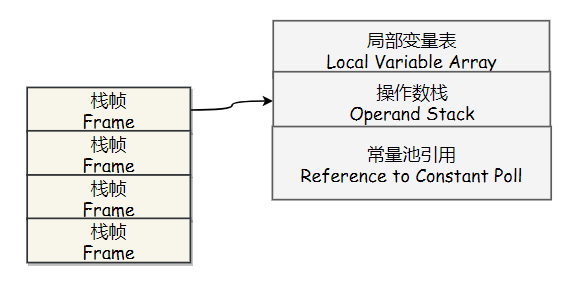
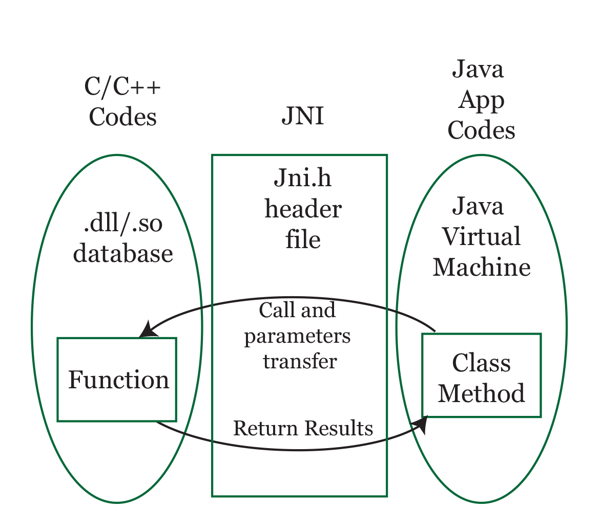
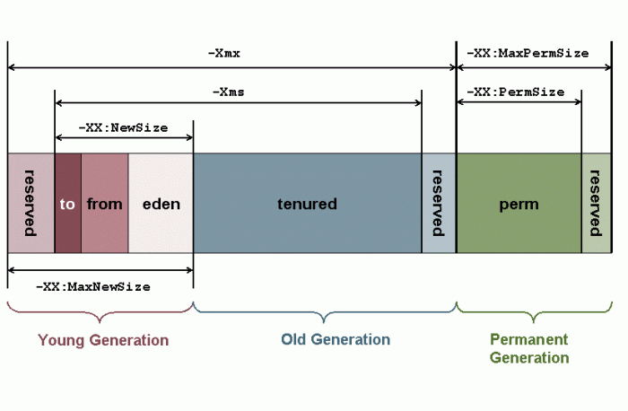

<!-- GFM-TOC -->
* [一、运行时数据区域](#一运行时数据区域)
    * [程序计数器](#程序计数器)
    * [虚拟机栈](#虚拟机栈)
    * [本地方法栈](#本地方法栈)
    * [堆](#堆)
    * [方法区](#方法区)
    * [运行时常量池](#运行时常量池)
    * [直接内存](#直接内存)
* [二、垃圾收集](#二垃圾收集)
    * [判断一个对象是否可回收](#判断一个对象是否可回收)
    * [垃圾收集算法](#垃圾收集算法)
    * [垃圾收集器](#垃圾收集器)
    * [内存分配与回收策略](#内存分配与回收策略)
    * [Full GC 的触发条件](#full-gc-的触发条件)
* [三、类加载机制](#三类加载机制)
    * [类的生命周期](#类的生命周期)
    * [类初始化时机](#类初始化时机)
    * [类加载过程](#类加载过程)
    * [类加载器](#类加载器)
* [四、JVM 参数](#四jvm-参数)
    * [GC 优化配置](#gc-优化配置)
    * [GC 类型设置](#gc-类型设置)
* [参考资料](#参考资料)
<!-- GFM-TOC -->


# 一、运行时数据区域

<div align="center">  </div><br>

## 程序计数器

记录正在执行的虚拟机字节码指令的地址（如果正在执行的是本地方法则为空）。

## 虚拟机栈

每个 Java 方法在执行的同时会创建一个栈帧用于存储局部变量表、操作数栈、常量池引用等信息。每一个方法从调用直至执行完成的过程，就对应着一个栈帧在 Java 虚拟机栈中入栈和出栈的过程。

<div align="center">  </div><br>

可以通过 -Xss 这个虚拟机参数来指定一个程序的 Java 虚拟机栈内存大小：

```java
java -Xss=512M HackTheJava
```

该区域可能抛出以下异常：

1. 当线程请求的栈深度超过最大值，会抛出 StackOverflowError 异常；
2. 栈进行动态扩展时如果无法申请到足够内存，会抛出 OutOfMemoryError 异常。

## 本地方法栈

本地方法不是用 Java 实现，对待这些方法需要特别处理。

与 Java 虚拟机栈类似，它们之间的区别只不过是本地方法栈为本地方法服务。

<div align="center">  </div><br>

## 堆

所有对象实例都在这里分配内存。

是垃圾收集的主要区域（"GC 堆"），现代的垃圾收集器基本都是采用分代收集算法，该算法的思想是针对不同的对象采取不同的垃圾回收算法，因此虚拟机把 Java 堆分成以下三块：

- 新生代（Young Generation）
- 老年代（Old Generation）
- 永久代（Permanent Generation）

当一个对象被创建时，它首先进入新生代，之后有可能被转移到老年代中。新生代存放着大量的生命很短的对象，因此新生代在三个区域中垃圾回收的频率最高。为了更高效地进行垃圾回收，把新生代继续划分成以下三个空间：

- Eden
- From Survivor
- To Survivor

<div align="center">  </div><br>

Java 堆不需要连续内存，并且可以动态增加其内存，增加失败会抛出 OutOfMemoryError 异常。

可以通过 -Xms 和 -Xmx 两个虚拟机参数来指定一个程序的 Java 堆内存大小，第一个参数设置初始值，第二个参数设置最大值。

```java
java -Xms=1M -Xmx=2M HackTheJava
```

## 方法区

用于存放已被加载的类信息、常量、静态变量、即时编译器编译后的代码等数据。

和 Java 堆一样不需要连续的内存，并且可以动态扩展，动态扩展失败一样会抛出 OutOfMemoryError 异常。

对这块区域进行垃圾回收的主要目标是对常量池的回收和对类的卸载，但是一般比较难实现，HotSpot 虚拟机把它当成永久代来进行垃圾回收。

## 运行时常量池

运行时常量池是方法区的一部分。

Class 文件中的常量池（编译器生成的各种字面量和符号引用）会在类加载后被放入这个区域。

除了在编译期生成的常量，还允许动态生成，例如 String 类的 intern()。这部分常量也会被放入运行时常量池。

## 直接内存

在 JDK 1.4 中新加入了 NIO 类，它可以使用 Native 函数库直接分配堆外内存，然后通过一个存储在 Java 堆里的 DirectByteBuffer 对象作为这块内存的引用进行操作。这样能在一些场景中显著提高性能，因为避免了在 Java 堆和 Native 堆中来回复制数据。

# 二、垃圾收集

程序计数器、虚拟机栈和本地方法栈这三个区域属于线程私有的，只存在于线程的生命周期内，线程结束之后也会消失，因此不需要对这三个区域进行垃圾回收。垃圾回收主要是针对 Java 堆和方法区进行。

## 判断一个对象是否可回收

### 1. 引用计数

给对象添加一个引用计数器，当对象增加一个引用时计数器加 1，引用失效时计数器减 1。引用计数为 0 的对象可被回收。

两个对象出现循环引用的情况下，此时引用计数器永远不为 0，导致无法对它们进行回收。

```java
objA.instance = objB;
objB.instance = objA;
```

### 2. 可达性

通过 GC Roots 作为起始点进行搜索，能够到达到的对象都是都是可用的，不可达的对象可被回收。

<div align="center">  </div><br>

GC Roots 一般包含以下内容：

1. 虚拟机栈中引用的对象
2. 方法区中类静态属性引用的对象
3. 方法区中的常量引用的对象
4. 本地方法栈中引用的对象

### 3. 引用类型

无论是通过引用计算算法判断对象的引用数量，还是通过可达性分析算法判断对象的引用链是否可达，判定对象是否存活都与引用有关。

Java 对引用的概念进行了扩充，引入四种强度不同的引用类型。

**（一）强引用** 

只要强引用存在，垃圾回收器永远不会回收调掉被引用的对象。

使用 new 一个新对象的方式来创建强引用。

```java
Object obj = new Object();
```

**（二）软引用** 

用来描述一些还有用但是并非必需的对象。

在系统将要发生内存溢出异常之前，将会对这些对象列进回收范围之中进行第二次回收。

软引用主要用来实现类似缓存的功能，在内存足够的情况下直接通过软引用取值，无需从繁忙的真实来源获取数据，提升速度；当内存不足时，自动删除这部分缓存数据，从真正的来源获取这些数据。

使用 SoftReference 类来实现软引用。

```java
Object obj = new Object();
SoftReference<Object> sf = new SoftReference<Object>(obj);
```

**（三）弱引用** 

只能生存到下一次垃圾收集发生之前，当垃圾收集器工作时，无论当前内存是否足够，都会被回收。

使用 WeakReference 类来实现弱引用。

```java
Object obj = new Object();
WeakReference<Object> wf = new WeakReference<Object>(obj);
```

**（四）虚引用** 

又称为幽灵引用或者幻影引用。一个对象是否有虚引用的存在，完全不会对其生存时间构成影响，也无法通过虚引用取得一个对象实例。

为一个对象设置虚引用关联的唯一目的就是能在这个对象被收集器回收时收到一个系统通知。

使用 PhantomReference 来实现虚引用。

```java
Object obj = new Object();
PhantomReference<Object> pf = new PhantomReference<Object>(obj);
```

### 4. 方法区的回收

因为方法区主要存放永久代对象，而永久代对象的回收率比新生代差很多，因此在方法区上进行回收性价比不高。

主要是对常量池的回收和对类的卸载。

类的卸载条件很多，需要满足以下三个条件，并且满足了也不一定会被卸载：

1. 该类所有的实例都已经被回收，也就是 Java 堆中不存在该类的任何实例。
2. 加载该类的 ClassLoader 已经被回收。
3. 该类对应的 java.lang.Class 对象没有在任何地方被引用，也就无法在任何地方通过反射访问该类方法。

可以通过 -Xnoclassgc 参数来控制是否对类进行卸载。

在大量使用反射、动态代理、CGLib 等 ByteCode 框架、动态生成 JSP 以及 OSGo 这类频繁自定义 ClassLoader 的场景都需要虚拟机具备类卸载功能，以保证不会出现内存溢出。

### 5. finalize()

finalize() 类似 C++ 的析构函数，用来做关闭外部资源等工作。但是 try-finally 等方式可以做的更好，并且该方法运行代价高昂，不确定性大，无法保证各个对象的调用顺序，因此最好不要使用。

当一个对象可被回收时，如果需要执行该对象的 finalize() 方法，那么就有可能通过在该方法中让对象重新被引用，从而实现自救。

## 垃圾收集算法

### 1. 标记 - 清除

<div align="center">  </div><br>

将需要回收的对象进行标记，然后清除。

不足：

1. 标记和清除过程效率都不高；
2. 会产生大量碎片，内存碎片过多可能导致无法给大对象分配内存。

### 2. 复制

<div align="center">  </div><br>

将内存划分为大小相等的两块，每次只使用其中一块，当这一块内存用完了就将还存活的对象复制到另一块上面，然后再把使用过的内存空间进行一次清理。

主要不足是只使用了内存的一半。

现在的商业虚拟机都采用这种收集算法来回收新生代，但是并不是将内存划分为大小相等的两块，而是分为一块较大的 Eden 空间和两块较小的 Survior 空间，每次使用 Eden 空间和其中一块 Survivor。在回收时，将 Eden 和 Survivor 中还存活着的对象一次性复制到另一块 Survivor 空间上，最后清理 Eden 和 使用过的那一块 Survivor。HotSpot 虚拟机的 Eden 和 Survivor 的大小比例默认为 8:1，保证了内存的利用率达到 90 %。如果每次回收有多于 10% 的对象存活，那么一块 Survivor 空间就不够用了，此时需要依赖于老年代进行分配担保，也就是借用老年代的空间。

### 3. 标记 - 整理

<div align="center">  </div><br>

让所有存活的对象都向一端移动，然后直接清理掉端边界以外的内存。

### 4. 分代收集

现在的商业虚拟机采用分代收集算法，它根据对象存活周期将内存划分为几块，不同块采用适当的收集算法。

一般将 Java 堆分为新生代和老年代。

1. 新生代使用：复制算法
2. 老年代使用：标记 - 清理 或者 标记 - 整理 算法

## 垃圾收集器

<div align="center">  </div><br>

以上是 HotSpot 虚拟机中的 7 个垃圾收集器，连线表示垃圾收集器可以配合使用。

### 1. Serial 收集器

<div align="center">  </div><br>

它是单线程的收集器，不仅意味着只会使用一个线程进行垃圾收集工作，更重要的是它在进行垃圾收集时，必须暂停所有其他工作线程，往往造成过长的等待时间。

它的优点是简单高效，对于单个 CPU 环境来说，由于没有线程交互的开销，因此拥有最高的单线程收集效率。

在 Client 应用场景中，分配给虚拟机管理的内存一般来说不会很大，该收集器收集几十兆甚至一两百兆的新生代停顿时间可以控制在一百多毫秒以内，只要不是太频繁，这点停顿是可以接受的。

### 2. ParNew 收集器

<div align="center">  </div><br>

它是 Serial 收集器的多线程版本。

是 Server 模式下的虚拟机首选新生代收集器，除了性能原因外，主要是因为除了 Serial 收集器，只有它能与 CMS 收集器配合工作。

默认开始的线程数量与 CPU 数量相同，可以使用 -XX:ParallelGCThreads 参数来设置线程数。

### 3. Parallel Scavenge 收集器

是并行的多线程收集器。

其它收集器关注点是尽可能缩短垃圾收集时用户线程的停顿时间，而它的目标是达到一个可控制的吞吐量，它被称为“吞吐量优先”收集器。这里的吞吐量指 CPU 用于运行用户代码的时间占总时间的比值。

停顿时间越短就越适合需要与用户交互的程序，良好的响应速度能提升用户体验。而高吞吐量则可以高效率地利用 CPU 时间，尽快完成程序的运算任务，主要适合在后台运算而不需要太多交互的任务。

提供了两个参数用于精确控制吞吐量，分别是控制最大垃圾收集停顿时间 -XX:MaxGCPauseMillis 参数以及直接设置吞吐量大小的 -XX:GCTimeRatio 参数（值为大于 0 且小于 100 的整数）。缩短停顿时间是以牺牲吞吐量和新生代空间来换取的：新生代空间变小，垃圾回收变得频繁，导致吞吐量下降。

还提供了一个参数 -XX:+UseAdaptiveSizePolicy，这是一个开关参数，打开参数后，就不需要手工指定新生代的大小（-Xmn）、Eden 和 Survivor 区的比例（-XX:SurvivorRatio）、晋升老年代对象年龄（-XX:PretenureSizeThreshold）等细节参数了，虚拟机会根据当前系统的运行情况收集性能监控信息，动态调整这些参数以提供最合适的停顿时间或者最大的吞吐量，这种方式称为 GC 自适应的调节策略（GC Ergonomics）。自适应调节策略也是它与 ParNew 收集器的一个重要区别。

### 4. Serial Old 收集器

<div align="center">  </div><br>

Serial Old 是 Serial 收集器的老年代版本，也是给 Client 模式下的虚拟机使用。如果用在 Server 模式下，它有两大用途：

1. 在 JDK 1.5 以及之前版本（Parallel Old 诞生以前）中与 Parallel Scavenge 收集器搭配使用。
2. 作为 CMS 收集器的后备预案，在并发收集发生 Concurrent Mode Failure 时使用。

### 5. Parallel Old 收集器

<div align="center">  </div><br>

是 Parallel Scavenge 收集器的老年代版本。

在注重吞吐量以及 CPU 资源敏感的场合，都可以优先考虑 Parallel Scavenge 加 Parallel Old 收集器。

### 6. CMS 收集器

<div align="center">  </div><br>

CMS（Concurrent Mark Sweep），从 Mark Sweep 可以知道它是基于标记 - 清除算法实现的。

特点：并发收集、低停顿。

分为以下四个流程：

1. 初始标记：仅仅只是标记一下 GC Roots 能直接关联到的对象，速度很快，需要停顿。
2. 并发标记：进行 GC Roots Tracing 的过程，它在整个回收过程中耗时最长，不需要停顿。
3. 重新标记：为了修正并发标记期间因用户程序继续运作而导致标记产生变动的那一部分对象的标记记录，需要停顿。
4. 并发清除：不需要停顿。

在整个过程中耗时最长的并发标记和并发清除过程中，收集器线程都可以与用户线程一起工作，不需要进行停顿。

具有以下缺点：

1. 对 CPU 资源敏感。CMS 默认启动的回收线程数是 (CPU 数量 + 3) / 4，当 CPU 不足 4 个时，CMS 对用户程序的影响就可能变得很大，如果本来 CPU 负载就比较大，还要分出一半的运算能力去执行收集器线程，就可能导致用户程序的执行速度忽然降低了 50%，其实也让人无法接受。并且低停顿时间是以牺牲吞吐量为代价的，导致 CPU 利用率变低。

2. 无法处理浮动垃圾。由于并发清理阶段用户线程还在运行着，伴随程序运行自然就还会有新的垃圾不断产生。这一部分垃圾出现在标记过程之后，CMS 无法在当次收集中处理掉它们，只好留到下一次 GC 时再清理掉，这一部分垃圾就被称为“浮动垃圾”。也是由于在垃圾收集阶段用户线程还需要运行，那也就还需要预留有足够的内存空间给用户线程使用，因此它不能像其他收集器那样等到老年代几乎完全被填满了再进行收集，需要预留一部分空间提供并发收集时的程序运作使用。可以使用 -XX:CMSInitiatingOccupancyFraction 的值来改变触发收集器工作的内存占用百分比，JDK 1.5 默认设置下该值为 68，也就是当老年代使用了 68% 的空间之后会触发收集器工作。如果该值设置的太高，导致浮动垃圾无法保存，那么就会出现 Concurrent Mode Failure，此时虚拟机将启动后备预案：临时启用 Serial Old 收集器来重新进行老年代的垃圾收集。

3. 标记 - 清除算法导致的空间碎片，给大对象分配带来很大麻烦，往往出现老年代空间剩余，但无法找到足够大连续空间来分配当前对象，不得不提前触发一次 Full GC。

### 7. G1 收集器

<div align="center">  </div><br>

G1（Garbage-First）收集器是当今收集器技术发展最前沿的成果之一，它是一款面向服务端应用的垃圾收集器，HotSpot 开发团队赋予它的使命是（在比较长期的）未来可以替换掉 JDK 1.5 中发布的 CMS 收集器。

具备如下特点：

- 并行与并发：能充分利用多 CPU 环境下的硬件优势，使用多个 CPU 来缩短停顿时间。
- 分代收集：分代概念依然得以保留，虽然它不需要其它收集器配合就能独立管理整个 GC 堆，但它能够采用不同方式去处理新创建的对象和已存活一段时间、熬过多次 GC 的旧对象来获取更好的收集效果。
- 空间整合：整体来看是基于“标记 - 整理”算法实现的收集器，从局部（两个 Region 之间）上来看是基于“复制”算法实现的，这意味着运行期间不会产生内存空间碎片。
- 可预测的停顿：这是它相对 CMS 的一大优势，降低停顿时间是 G1 和 CMS 共同的关注点，但 G1 除了降低停顿外，还能建立可预测的停顿时间模型，能让使用者明确指定在一个长度为 M 毫秒的时间片段内，消耗在 GC 上的时间不得超过 N 毫秒，这几乎已经是实时 Java（RTSJ）的垃圾收集器的特征了。

在 G1 之前的其他收集器进行收集的范围都是整个新生代或者老生代，而 G1 不再是这样，Java 堆的内存布局与其他收集器有很大区别，将整个 Java 堆划分为多个大小相等的独立区域（Region）。虽然还保留新生代和老年代的概念，但新生代和老年代不再是物理隔离的了，而都是一部分 Region（不需要连续）的集合。

之所以能建立可预测的停顿时间模型，是因为它可以有计划地避免在整个 Java 堆中进行全区域的垃圾收集。它跟踪各个 Region 里面的垃圾堆积的价值大小（回收所获得的空间大小以及回收所需时间的经验值），在后台维护一个优先列表，每次根据允许的收集时间，优先回收价值最大的 Region（这也就是 Garbage-First 名称的来由）。这种使用 Region 划分内存空间以及有优先级的区域回收方式，保证了它在有限的时间内可以获取尽可能高的收集效率。

Region 不可能是孤立的，一个对象分配在某个 Region 中，可以与整个 Java 堆任意的对象发生引用关系。在做可达性分析确定对象是否存活的时候，需要扫描整个 Java 堆才能保证准确性，这显然是对 GC 效率的极大伤害。为了避免全堆扫描的发生，每个 Region 都维护了一个与之对应的 Remembered Set。虚拟机发现程序在对 Reference 类型的数据进行写操作时，会产生一个 Write Barrier 暂时中断写操作，检查 Reference 引用的对象是否处于不同的 Region 之中，如果是，便通过 CardTable 把相关引用信息记录到被引用对象所属的 Region 的 Remembered Set 之中。当进行内存回收时，在 GC 根节点的枚举范围中加入 Remembered Set 即可保证不对全堆扫描也不会有遗漏。

如果不计算维护 Remembered Set 的操作，G1 收集器的运作大致可划分为以下几个步骤：

1. 初始标记
2. 并发标记
3. 最终标记：为了修正在并发标记期间因用户程序继续运作而导致标记产生变动的那一部分标记记录，虚拟机将这段时间对象变化记录在线程的 Remembered Set Logs 里面，最终标记阶段需要把 Remembered Set Logs 的数据合并到 Remembered Set 中。这阶段需要停顿线程，但是可并行执行。
4. 筛选回收：首先对各个 Region 中的回收价值和成本进行排序，根据用户所期望的 GC 停顿是时间来制定回收计划。此阶段其实也可以做到与用户程序一起并发执行，但是因为只回收一部分 Region，时间是用户可控制的，而且停顿用户线程将大幅度提高收集效率。

### 8. 七种垃圾收集器的比较

| 收集器 | 串行、并行 or 并发 | 新生代 / 老年代 | 算法 | 目标 | 适用场景 |
| :---: | :---: | :---: | :---: | :---: | :---: |
|  **Serial**  | 串行 | 新生代 | 复制算法 | 响应速度优先 | 单 CPU 环境下的 Client 模式 |
|  **Serial Old**  | 串行 | 老年代 | 标记-整理 | 响应速度优先 | 单 CPU 环境下的 Client 模式、CMS 的后备预案 |
|  **ParNew**  | 并行 | 新生代 | 复制算法 | 响应速度优先 | 多 CPU 环境时在 Server 模式下与 CMS 配合 |
|  **Parallel Scavenge**  | 并行 | 新生代 | 复制算法 | 吞吐量优先 | 在后台运算而不需要太多交互的任务 |
|  **Parallel Old**  | 并行 | 老年代 | 标记-整理 | 吞吐量优先 | 在后台运算而不需要太多交互的任务 |
|  **CMS**  | 并发 | 老年代 | 标记-清除 | 响应速度优先 | 集中在互联网站或 B/S 系统服务端上的 Java 应用 |
|  **G1**  | 并发 | both | 标记-整理 + 复制算法 | 响应速度优先 | 面向服务端应用，将来替换 CMS |

## 内存分配与回收策略

对象的内存分配，也就是在堆上分配。主要分配在新生代的 Eden 区上，少数情况下也可能直接分配在老年代中。

### 1. 优先在 Eden 分配

大多数情况下，对象在新生代 Eden 区分配，当 Eden 区空间不够时，发起 Minor GC。

关于 Minor GC 和 Full GC：

- Minor GC：发生在新生代上，因为新生代对象存活时间很短，因此 Minor GC 会频繁执行，执行的速度一般也会比较快。
- Full GC：发生在老年代上，老年代对象和新生代的相反，其存活时间长，因此 Full GC 很少执行，而且执行速度会比 Minor GC 慢很多。

### 2. 大对象直接进入老年代

大对象是指需要连续内存空间的对象，最典型的大对象是那种很长的字符串以及数组。经常出现大对象会提前触发垃圾收集以获取足够的连续空间分配给大对象。

提供 -XX:PretenureSizeThreshold 参数，大于此值的对象直接在老年代分配，避免在 Eden 区和 Survivor 区之间的大量内存复制。

### 3. 长期存活的对象进入老年代

JVM 为对象定义年龄计数器，经过 Minor GC 依然存活，并且能被 Survivor 区容纳的，移被移到 Survivor 区，年龄就增加 1 岁，增加到一定年龄则移动到老年代中（默认 15 岁，通过 -XX:MaxTenuringThreshold 设置）。

### 4. 动态对象年龄判定

JVM 并不是永远地要求对象的年龄必须达到 MaxTenuringThreshold 才能晋升老年代，如果在 Survivor 区中相同年龄所有对象大小的总和大于 Survivor 空间的一半，则年龄大于或等于该年龄的对象可以直接进入老年代，无需等待 MaxTenuringThreshold 中要求的年龄。

### 5. 空间分配担保

在发生 Minor GC 之前，JVM 先检查老年代最大可用的连续空间是否大于新生代所有对象总空间，如果条件成立的话，那么 Minor GC 可以确认是安全的；如果不成立的话 JVM 会查看 HandlePromotionFailure 设置值是否允许担保失败，如果允许那么就会继续检查老年代最大可用的连续空间是否大于历次晋升到老年代对象的平均大小，如果大于，将尝试着进行一次 Minor GC，尽管这次 Minor GC 是有风险的；如果小于，或者 HandlePromotionFailure 设置不允许冒险，那这时也要改为进行一次 Full GC。

## Full GC 的触发条件

对于 Minor GC，其触发条件非常简单，当 Eden 区空间满时，就将触发一次 Minor GC。而 Full GC 则相对复杂，有以下条件：

### 1. 调用 System.gc()

此方法的调用是建议 JVM 进行 Full GC，虽然只是建议而非一定，但很多情况下它会触发 Full GC，从而增加 Full GC 的频率，也即增加了间歇性停顿的次数。因此强烈建议能不使用此方法就不要使用，让虚拟机自己去管理它的内存。可通过 -XX:+ DisableExplicitGC 来禁止 RMI 调用 System.gc()。

### 2. 老年代空间不足

老年代空间不足的常见场景为前文所讲的大对象直接进入老年代、长期存活的对象进入老年代等，当执行 Full GC 后空间仍然不足，则抛出 Java.lang.OutOfMemoryError。为避免以上原因引起的 Full GC，调优时应尽量做到让对象在 Minor GC 阶段被回收、让对象在新生代多存活一段时间以及不要创建过大的对象及数组。

### 3. 空间分配担保失败

使用复制算法的 Minor GC 需要老年代的内存空间作担保，如果出现了 HandlePromotionFailure 担保失败，则会触发 Full GC。

### 4. JDK 1.7 及以前的永久代空间不足

在 JDK 1.7 及以前，HotSpot 虚拟机中的方法区是用永久代实现的，永久代中存放的为一些 Class 的信息、常量、静态变量等数据，当系统中要加载的类、反射的类和调用的方法较多时，永久代可能会被占满，在未配置为采用 CMS GC 的情况下也会执行 Full GC。如果经过 Full GC 仍然回收不了，那么 JVM 会抛出 java.lang.OutOfMemoryError，为避免以上原因引起的 Full GC，可采用的方法为增大永久代空间或转为使用 CMS GC。

### 5. Concurrent Mode Failure

执行 CMS GC 的过程中同时有对象要放入老年代，而此时老年代空间不足（有时候“空间不足”是 CMS GC 时当前的浮动垃圾过多导致暂时性的空间不足触发 Full GC），便会报 Concurrent Mode Failure 错误，并触发 Full GC。

# 三、类加载机制

类是在运行期间动态加载的。

## 类的生命周期

<div align="center">  </div><br>

包括以下 7 个阶段：

-  **加载（Loading）** 
-  **验证（Verification）** 
-  **准备（Preparation）** 
-  **解析（Resolution）** 
-  **初始化（Initialization）** 
- 使用（Using）
- 卸载（Unloading）

其中解析过程在某些情况下可以在初始化阶段之后再开始，这是为了支持 Java 的动态绑定。

## 类初始化时机

虚拟机规范中并没有强制约束何时进行加载，但是规范严格规定了有且只有下列五种情况必须对类进行初始化（加载、验证、准备都会随着发生）：

1. 遇到 new、getstatic、putstatic、invokestatic 这四条字节码指令时，如果类没有进行过初始化，则必须先触发其初始化。最常见的生成这 4 条指令的场景是：使用 new 关键字实例化对象的时候；读取或设置一个类的静态字段（被 final 修饰、已在编译期把结果放入常量池的静态字段除外）的时候；以及调用一个类的静态方法的时候。

2. 使用 java.lang.reflect 包的方法对类进行反射调用的时候，如果类没有进行初始化，则需要先触发其初始化。

3. 当初始化一个类的时候，如果发现其父类还没有进行过初始化，则需要先触发其父类的初始化。

4. 当虚拟机启动时，用户需要指定一个要执行的主类（包含 main() 方法的那个类），虚拟机会先初始化这个主类；

5. 当使用 JDK.7 的动态语言支持时，如果一个 java.lang.invoke.MethodHandle 实例最后的解析结果为 REF_getStatic, REF_putStatic, REF_invokeStatic 的方法句柄，并且这个方法句柄所对应的类没有进行过初始化，则需要先触发其初始化；

以上 5 种场景中的行为称为对一个类进行主动引用。除此之外，所有引用类的方式都不会触发初始化，称为被动引用。被动引用的常见例子包括：

- 通过子类引用父类的静态字段，不会导致子类初始化。

```java
System.out.println(SubClass.value); // value 字段在 SuperClass 中定义
```

- 通过数组定义来引用类，不会触发此类的初始化。该过程会对数组类进行初始化，数组类是一个由虚拟机自动生成的、直接继承自 Object 的子类，其中包含了数组的属性和方法。

```java
SuperClass[] sca = new SuperClass[10];
```

- 常量在编译阶段会存入调用类的常量池中，本质上并没有直接引用到定义常量的类，因此不会触发定义常量的类的初始化。

```java
System.out.println(ConstClass.HELLOWORLD);
```

## 类加载过程

包含了加载、验证、准备、解析和初始化这 5 个阶段。

### 1. 加载

加载是类加载的一个阶段，注意不要混淆。

加载过程完成以下三件事：

1. 通过一个类的全限定名来获取定义此类的二进制字节流。
2. 将这个字节流所代表的静态存储结构转化为方法区的运行时存储结构。
3. 在内存中生成一个代表这个类的 Class 对象，作为方法区这个类的各种数据的访问入口。

其中二进制字节流可以从以下方式中获取：

- 从 ZIP 包读取，这很常见，最终成为日后 JAR、EAR、WAR 格式的基础。
- 从网络中获取，这种场景最典型的应用是 Applet。
- 运行时计算生成，这种场景使用得最多得就是动态代理技术，在 java.lang.reflect.Proxy 中，就是用了 ProxyGenerator.generateProxyClass 的代理类的二进制字节流。
- 由其他文件生成，典型场景是 JSP 应用，即由 JSP 文件生成对应的 Class 类。
- 从数据库读取，这种场景相对少见，例如有些中间件服务器（如 SAP Netweaver）可以选择把程序安装到数据库中来完成程序代码在集群间的分发。
...

### 2. 验证

确保 Class 文件的字节流中包含的信息符合当前虚拟机的要求，并且不会危害虚拟机自身的安全。

主要有以下 4 个阶段：

（一）文件格式验证

验证字节流是否符合 Class 文件格式的规范，并且能被当前版本的虚拟机处理。

（二）元数据验证

对字节码描述的信息进行语义分析，以保证其描述的信息符合 Java 语言规范的要求。

（三）字节码验证

通过数据流和控制流分析，确保程序语义是合法、符合逻辑的。

（四）符号引用验证

发生在虚拟机将符号引用转换为直接引用的时候，对类自身以外（常量池中的各种符号引用）的信息进行匹配性校验。

### 3. 准备

类变量是被 static 修饰的变量，准备阶段为类变量分配内存并设置初始值，使用的是方法区的内存。

实例变量不会在这阶段分配内存，它将会在对象实例化时随着对象一起分配在 Java 堆中。

初始值一般为 0 值，例如下面的类变量 value 被初始化为 0 而不是 123。

```java
public static int value = 123;
```

如果类变量是常量，那么会按照表达式来进行初始化，而不是赋值为 0。

```java
public static final int value = 123;
```

### 4. 解析

将常量池的符号引用替换为直接引用的过程。

### 5. 初始化

初始化阶段才真正开始执行类中的定义的 Java 程序代码。初始化阶段即虚拟机执行类构造器 &lt;clinit>() 方法的过程。

在准备阶段，类变量已经赋过一次系统要求的初始值，而在初始化阶段，根据程序员通过程序制定的主观计划去初始化类变量和其它资源。

&lt;clinit>() 方法具有以下特点：

- 是由编译器自动收集类中所有类变量的赋值动作和静态语句块（static{} 块）中的语句合并产生的，编译器收集的顺序由语句在源文件中出现的顺序决定。特别注意的是，静态语句块只能访问到定义在它之前的类变量，定义在它之后的类变量只能赋值，不能访问。例如以下代码：

```java
public class Test {
    static {
        i = 0;                // 给变量赋值可以正常编译通过
        System.out.print(i);  // 这句编译器会提示“非法向前引用”
    }
    static int i = 1;
}
```

- 与类的构造函数（或者说实例构造器 &lt;init>()）不同，不需要显式的调用父类的构造器。虚拟机会自动保证在子类的 &lt;clinit>() 方法运行之前，父类的 &lt;clinit>() 方法已经执行结束。因此虚拟机中第一个执行 &lt;clinit>() 方法的类肯定为 java.lang.Object。

- 由于父类的 &lt;clinit>() 方法先执行，也就意味着父类中定义的静态语句块要优于子类的变量赋值操作。例如以下代码：

```java
static class Parent {
    public static int A = 1;
    static {
        A = 2;
    }
}

static class Sub extends Parent {
    public static int B = A;
}

public static void main(String[] args) {
     System.out.println(Sub.B);  // 输出结果是父类中的静态变量 A 的值 ，也就是 2。
}
```

- &lt;clinit>() 方法对于类或接口不是必须的，如果一个类中不包含静态语句块，也没有对类变量的赋值操作，编译器可以不为该类生成 &lt;clinit>() 方法。

- 接口中不可以使用静态语句块，但仍然有类变量初始化的赋值操作，因此接口与类一样都会生成 &lt;clinit>() 方法。但接口与类不同的是，执行接口的 &lt;clinit>() 方法不需要先执行父接口的 &lt;clinit>() 方法。只有当父接口中定义的变量使用时，父接口才会初始化。另外，接口的实现类在初始化时也一样不会执行接口的 &lt;clinit>() 方法。

- 虚拟机会保证一个类的 &lt;clinit>() 方法在多线程环境下被正确的加锁和同步，如果多个线程同时初始化一个类，只会有一个线程执行这个类的 &lt;clinit>() 方法，其它线程都会阻塞等待，直到活动线程执行 &lt;clinit>() 方法完毕。如果在一个类的 &lt;clinit>() 方法中有耗时的操作，就可能造成多个进程阻塞，在实际过程中此种阻塞很隐蔽。

## 类加载器

虚拟机设计团队把类加载阶段中的“通过一个类的全限定名来获取描述此类的二进制字节流 ( 即字节码 )”这个动作放到 Java 虚拟机外部去实现，以便让应用程序自己决定如何去获取所需要的类。实现这个动作的代码模块称为“类加载器”。

### 1. 类与类加载器

对于任意一个类，都需要由加载它的类加载器和这个类本身一同确立其在 Java 虚拟机中的唯一性，每一个类加载器，都拥有一个独立的类名称空间。通俗而言：比较两个类是否“相等”（这里所指的“相等”，包括类的 Class 对象的 equals() 方法、isAssignableFrom() 方法、isInstance() 方法的返回结果，也包括使用 instanceof() 关键字做对象所属关系判定等情况），只有在这两个类是由同一个类加载器加载的前提下才有意义，否则，即使这两个类来源于同一个 Class 文件，被同一个虚拟机加载，只要加载它们的类加载器不同，那这两个类就必定不相等。

### 2. 类加载器分类

从 Java 虚拟机的角度来讲，只存在以下两种不同的类加载器：

- 启动类加载器（Bootstrap ClassLoader），这个类加载器用 C++ 实现，是虚拟机自身的一部分；

- 所有其他类的加载器，这些类由 Java 实现，独立于虚拟机外部，并且全都继承自抽象类 java.lang.ClassLoader。

从 Java 开发人员的角度看，类加载器可以划分得更细致一些：

- 启动类加载器（Bootstrap ClassLoader）此类加载器负责将存放在 &lt;JAVA_HOME>\lib 目录中的，或者被 -Xbootclasspath 参数所指定的路径中的，并且是虚拟机识别的（仅按照文件名识别，如 rt.jar，名字不符合的类库即使放在 lib 目录中也不会被加载）类库加载到虚拟机内存中。 启动类加载器无法被 Java 程序直接引用，用户在编写自定义类加载器时，如果需要把加载请求委派给启动类加载器，直接使用 null 代替即可。

- 扩展类加载器（Extension ClassLoader）这个类加载器是由 ExtClassLoader（sun.misc.Launcher$ExtClassLoader）实现的。它负责将 &lt;JAVA_HOME>/lib/ext 或者被 java.ext.dir 系统变量所指定路径中的所有类库加载到内存中，开发者可以直接使用扩展类加载器。

- 应用程序类加载器（Application ClassLoader）这个类加载器是由 AppClassLoader（sun.misc.Launcher$AppClassLoader）实现的。由于这个类加载器是 ClassLoader 中的 getSystemClassLoader() 方法的返回值，因此一般称为系统类加载器。它负责加载用户类路径（ClassPath）上所指定的类库，开发者可以直接使用这个类加载器，如果应用程序中没有自定义过自己的类加载器，一般情况下这个就是程序中默认的类加载器。

### 3. 双亲委派模型

应用程序都是由三种类加载器相互配合进行加载的，如果有必要，还可以加入自己定义的类加载器。下图展示的类加载器之间的层次关系，称为类加载器的双亲委派模型（Parents Delegation Model）。该模型要求除了顶层的启动类加载器外，其余的类加载器都应有自己的父类加载器，这里类加载器之间的父子关系一般通过组合（Composition）关系来实现，而不是通过继承（Inheritance）的关系实现。

<div align="center">  </div><br>

**（一）工作过程** 

如果一个类加载器收到了类加载的请求，它首先不会自己去尝试加载，而是把这个请求委派给父类加载器，每一个层次的加载器都是如此，依次递归。因此所有的加载请求最终都应该传送到顶层的启动类加载器中，只有当父加载器反馈自己无法完成此加载请求（它搜索范围中没有找到所需类）时，子加载器才会尝试自己加载。

**（二）好处** 

使用双亲委派模型来组织类加载器之间的关系，使得 Java 类随着它的类加载器一起具备了一种带有优先级的层次关系。例如类 java.lang.Object，它存放在 rt.jar 中，无论哪个类加载器要加载这个类，最终都是委派给处于模型最顶端的启动类加载器进行加载，因此 Object 类在程序的各种类加载器环境中都是同一个类。相反，如果没有双亲委派模型，由各个类加载器自行加载的话，如果用户编写了一个称为java.lang.Object 的类，并放在程序的 ClassPath 中，那系统中将会出现多个不同的 Object 类，程序将变得一片混乱。如果开发者尝试编写一个与 rt.jar 类库中已有类重名的 Java 类，将会发现可以正常编译，但是永远无法被加载运行。

**（三）实现** 

```java
protected synchronized Class<?> loadClass(String name, boolean resolve) throws ClassNotFoundException{
    // 先检查请求的类是否已经被加载过了
    Class c = findLoadedClass(name);
    if(c == null) {
        try{
            if(parent != null) {
                c = parent.loadClass(name, false);
            } else{
                c = findBootstrapClassOrNull(name);
            }
        } catch(ClassNotFoundException e) {
            // 如果父类加载器抛出 ClassNotFoundException，说明父类加载器无法完成加载请求
        }
        if(c == null) {
            // 如果父类加载器无法完成加载请求，再调用自身的 findClass() 来进行加载
            c = findClass(name);
        }
    }
    if(resolve) {
        resolveClass(c);
    }
    return c;
}
```

# 四、JVM 参数

## GC 优化配置

| 配置 | 描述 |
| --- | --- |
| -Xms | 初始化堆内存大小 |
| -Xmx | 堆内存最大值 |
| -Xmn | 新生代大小 |
| -XX:PermSize | 初始化永久代大小 |
| -XX:MaxPermSize | 永久代最大容量 |

## GC 类型设置

| 配置 | 描述 |
| --- | --- |
| -XX:+UseSerialGC | 串行垃圾回收器 |
| -XX:+UseParallelGC | 并行垃圾回收器 |
| -XX:+UseConcMarkSweepGC | 并发标记扫描垃圾回收器 |
| -XX:ParallelCMSThreads= | 并发标记扫描垃圾回收器 = 为使用的线程数量 |
| -XX:+UseG1GC | G1 垃圾回收器 |

```java
java -Xmx12m -Xms3m -Xmn1m -XX:PermSize=20m -XX:MaxPermSize=20m -XX:+UseSerialGC -jar java-application.jar
```

# 参考资料

- 周志明. 深入理解 Java 虚拟机 [M]. 机械工业出版社, 2011.
- [Jvm memory](https://www.slideshare.net/benewu/jvm-memory)
- [Memory Architecture Of JVM(Runtime Data Areas)](https://hackthejava.wordpress.com/2015/01/09/memory-architecture-by-jvmruntime-data-areas/)
- [JVM Run-Time Data Areas](https://www.programcreek.com/2013/04/jvm-run-time-data-areas/)
- [Android on x86: Java Native Interface and the Android Native Development Kit](http://www.drdobbs.com/architecture-and-design/android-on-x86-java-native-interface-and/240166271)
- [深入理解 JVM(2)——GC 算法与内存分配策略](https://crowhawk.github.io/2017/08/10/jvm_2/)
- [深入理解 JVM(3)——7 种垃圾收集器](https://crowhawk.github.io/2017/08/15/jvm_3/)
- [JVM Internals](http://blog.jamesdbloom.com/JVMInternals.html)
