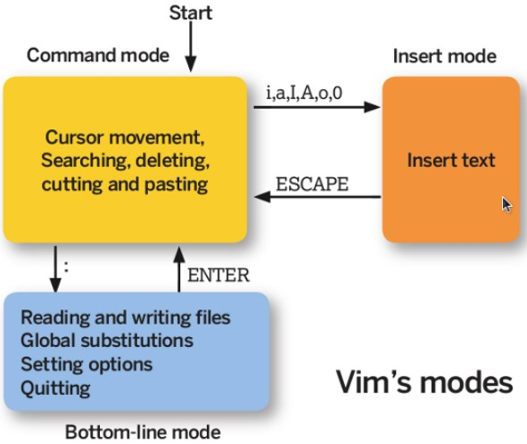

<!-- GFM-TOC -->
* [一、常用操作以及概念](#一常用操作以及概念)
    * [求助](#求助)
    * [关机](#关机)
    * [PATH](#path)
    * [运行等级](#运行等级)
    * [sudo](#sudo)
    * [GNU](#gnu)
    * [包管理工具](#包管理工具)
    * [发行版](#发行版)
    * [VIM 三个模式](#vim-三个模式)
* [二、分区](#二分区)
    * [磁盘的文件名](#磁盘的文件名)
    * [分区表](#分区表)
    * [开机检测程序](#开机检测程序)
    * [挂载](#挂载)
* [三、文件权限与目录配置](#三文件权限与目录配置)
    * [文件权限概念](#文件权限概念)
    * [文件属性以及权限的修改](#文件属性以及权限的修改)
    * [目录的权限](#目录的权限)
    * [文件默认权限](#文件默认权限)
    * [目录配置](#目录配置)
* [四、文件与目录](#四文件与目录)
    * [文件时间](#文件时间)
    * [文件与目录的基本操作](#文件与目录的基本操作)
    * [获取文件内容](#获取文件内容)
    * [指令与文件搜索](#指令与文件搜索)
* [五、磁盘与文件系统](#五磁盘与文件系统)
    * [文件系统的组成](#文件系统的组成)
    * [inode](#inode)
    * [目录的 inode 与 block](#目录的-inode-与-block)
    * [实体链接与符号链接](#实体链接与符号链接)
* [六、压缩与打包](#六压缩与打包)
    * [压缩](#压缩)
    * [打包](#打包)
* [七、Bash](#七bash)
    * [Bash 特性](#bash-特性)
    * [变量操作](#变量操作)
    * [指令搜索顺序](#指令搜索顺序)
    * [数据流重定向](#数据流重定向)
    * [管线指令](#管线指令)
* [八、正规表示法与文件格式化处理](#八正规表示法与文件格式化处理)
    * [grep](#grep)
    * [printf](#printf)
    * [awk](#awk)
* [九、进程管理](#九进程管理)
    * [查看进程](#查看进程)
    * [查看端口](#查看端口)
* [参考资料](#参考资料)
<!-- GFM-TOC -->


# 一、常用操作以及概念

## 求助

### 1. --help

指令的基本用法与选项介绍。

### 2. man

man 是 manual 的缩写，将指令的具体信息显示出来。

当执行 man date 时，有 DATE(1) 出现，其中的数字代表指令的类型，常用的数字及其类型如下：

| 代号 | 类型 |
| :--: | -- |
| 1 | 用户在 shell 环境中可以操作的指令或者可执行文件 |
| 5 | 配置文件 |
| 8 | 系统管理员可以使用的管理指令 |

### 3. info

info 与 man 类似，但是 info 将文档分成一个个页面，每个页面可以进行跳转。

## 关机

### 1. sync

为了加快对磁盘文件的读写速度，位于内存中的文件数据不会立即同步到磁盘上，因此关机之前需要先进行 sync 同步操作。

### 2. shutdown

```html
# /sbin/shutdown [-krhc] [时间] [警告讯息]
-k ： 不会关机，只是发送警告讯息，通知所有在线的用户
-r ： 将系统的服务停掉后就重新启动
-h ： 将系统的服务停掉后就立即关机
-c ： 取消已经在进行的 shutdown 指令内容
```

### 3. 其它关机指令

reboot、halt、poweroff。

## PATH

可以在环境变量 PATH 中声明可执行文件的路径，路径之间用 : 分隔。

```html
/usr/local/bin:/usr/bin:/usr/local/sbin:/usr/sbin:/home/dmtsai/.local/bin:/home/dmtsai/bin
```

## 运行等级

- 0：关机模式
- 1：单用户模式（可用于破解 root 密码）
- 2：无网络支持的多用户模式
- 3：有网络支持的多用户模式（文本模式，工作中最常用的模式）
- 4：保留，未使用
- 5：有网络支持的 X-windows 多用户模式（桌面）
- 6：重新引导系统，即重启

## sudo

使用 sudo 允许一般用户使用 root 可执行的命令，只有在 /etc/sudoers 配置文件中添加的用户才能使用该指令。

## GNU

GNU 计划，译为革奴计划，它的目标是创建一套完全自由的操作系统，称为 GNU，其内容软件完全以 GPL 方式发布。其中 GPL 全称为 GNU 通用公共许可协议，包含了以下内容：

- 以任何目的运行此程序的自由；
- 再复制的自由；
- 改进此程序，并公开发布改进的自由。

## 包管理工具

RPM 和 DPKG 为最常见的两类软件包管理工具。RPM 全称为 Redhat Package Manager，最早由 Red Hat 公司制定实施，随后被 GNU 开源操作系统接受并成为很多 Linux 系统 (RHEL) 的既定软件标准。与 RPM 进行竞争的是基于 Debian 操作系统 (UBUNTU) 的 DEB 软件包管理工具－ DPKG，全称为 Debian Package，功能方面与 RPM 相似。

YUM 基于 RPM 包管理工具，具有依赖管理功能，并具有软件升级的功能。

## 发行版

Linux 发行版是 Linux 内核及各种应用软件的集成版本。

| 基于的包管理工具 | 商业发行版 | 社区发行版 |
| --- | --- | --- |
| DPKG | Ubuntu | Debian |
| RPM | Red Hat | Fedora / CentOS |

## VIM 三个模式

<div align="center">  </div><br>

- 一般指令模式：进入 VIM 的默认模式，可以用于移动游标查看内容；
- 编辑模式：按下 "i" 等按键之后进入，可以对文本进行编辑；
- 指令列模式：按下 ":" 按键之后进入，用于保存退出等操作。

在指令列模式下，有以下命令用于离开或者保存文件。

| 命令 | 作用 |
| -- | -- |
| :w | 写入磁盘|
| :w! | 当文件为只读时，强制写入磁盘。到底能不能写入，与用户对该文件的权限有关 |
| :q | 离开 |
| :q! | 强制离开不保存 |
| :wq | 写入磁盘后离开 |
| :wq!| 强制写入磁盘后离开 |

# 二、分区

## 磁盘的文件名

Linux 中每个硬件都被当做一个文件，包括磁盘。常见磁盘的文件名如下：

- SCSI/SATA/USB 磁盘：/dev/sd[a-p]
- IDE 磁盘：/dev/hd[a-d]

其中文件名后面的序号的确定与磁盘插入的顺序有关，而与磁盘所插入的插槽位置无关。

## 分区表

磁盘分区表主要有两种格式，一种是限制较多的 MBR 分区表，一种是较新且限制较少的 GPT 分区表。

### 1. MBR

MBR 中，第一个扇区最重要，里面有主要开机记录（Master boot record, MBR）及分区表（partition table），其中 MBR 占 446 bytes，分区表占 64 bytes。

分区表只有 64 bytes，最多只能存储 4 个分区，这 4 个分区为主分区（Primary）和扩展分区（Extended）。其中扩展分区只有一个，它将其它空间用来记录分区表，因此通过扩展分区可以分出更多分区，这些分区称为逻辑分区。

Linux 也把分区当成文件，分区文件的命名方式为：磁盘文件名 + 编号，例如 /dev/sda1。注意，逻辑分区的编号从 5 开始。

### 2. GPT

不同的磁盘有不同的扇区大小，例如 512 bytes 和最新磁盘的 4 k。GPT 为了兼容所有磁盘，在定义扇区上使用逻辑区块地址（Logical Block Address, LBA）。

GPT 第 1 个区块记录了 MBR，紧接着是 33 个区块记录分区信息，并把最后的 33 个区块用于对分区信息进行备份。

GPT 没有扩展分区概念，都是主分区，最多可以分 128 个分区。

<div align="center">  </div><br>

## 开机检测程序

### 1. BIOS

BIOS 是开机的时候计算机执行的第一个程序，这个程序知道可以开机的磁盘，并读取磁盘第一个扇区的 MBR，由 MBR 执行其中的开机管理程序，这个开机管理程序会加载操作系统的核心文件。

MBR 中的开机管理程序提供以下功能：选单、载入核心文件以及转交其它开机管理程序。转交这个功能可以用来实现了多重引导，只需要将另一个操作系统的开机管理程序安装在其它分区的启动扇区上，在启动 MBR 中的开机管理程序时，就可以选择启动当前的操作系统或者转交给其它开机管理程序从而启动另一个操作系统。

安装多重引导，最好先安装 Windows 再安装 Linux。因为安装 Windows 时会覆盖掉 MBR，而 Linux 可以选择将开机管理程序安装在 MBR 或者其它分区的启动扇区，并且可以设置开机管理程序的选单。

<div align="center">  </div><br>

### 2. UEFI

UEFI 相比于 BIOS 来说功能更为全面，也更为安全。

## 挂载

挂载利用目录作为分区的进入点，也就是说，进入目录之后就可以读取分区的数据。

<div align="center">  </div><br>

# 三、文件权限与目录配置

## 文件权限概念

把用户分为三种：文件拥有者、群组以及其它人，对不同的用户有不同的文件权限。

使用 ls 查看一个文件时，会显示一个文件的信息，例如 `drwxr-xr-x. 3 root root 17 May 6 00:14 .config`，对这个信息的解释如下：

- drwxr-xr-x：文件类型以及权限，第 1 位为文件类型字段，后 9 位为文件权限字段。
- 3：链接数；
- root：文件拥有者；
- root：所属群组；
- 17：文件大小；
- May 6 00:14：文件最后被修改的时间；
- .config：文件名。

常见的文件类型及其含义有：

- d：目录；
- -：文件；
- l：链接文件；

9 位的文件权限字段中，每 3 个为一组，共 3 组，每一组分别代表对文件拥有者、所属群组以及其它人的文件权限。一组权限中的 3 位分别为 r、w、x 权限，表示可读、可写、可执行。

## 文件属性以及权限的修改

### 1. 修改文件所属群组

```html
# chgrp [-R] groupname dirname/filename
-R：递归修改
```

### 2. 修改文件拥有者

不仅可以修改文件拥有者，也可以修改文件所属群组。

```html
# chown [-R] 用户名:群组名 dirname/filename
```

### 3. 修改权限

可以将一组权限用数字来表示，此时一组权限的 3 个位当做二进制数字的位，从左到右每个位的权值为 4、2、1，即每个权限对应的数字权值为 r : 4、w : 2、x : 1。

```html
# chmod [-R] xyz dirname/filename
```

范例：将 .bashrc 文件的权限修改为 -rwxr-xr--。

```html
# chmod 754 .bashrc
```

也可以使用符号来设定权限。

```html
# chmod [ugoa]  [+-=] [rwx] dirname/filename
- u：拥有者
- g：所属群组
- o：其他人
- a：所有人
- +：添加权限
- -：移除权限
- =：设定权限
```

范例：为 .bashrc 文件的所有用户添加写权限。

```html
# chmod a+w .bashrc
```

## 目录的权限

文件名不是存储在一个文件的内容中，而是存储在一个文件所在的目录中。因此，拥有文件的 w 权限并不能对文件名进行修改。

目录存储文件列表，一个目录的权限也就是对其文件列表的权限。因此，目录的 r 权限表示可以读取文件列表；w 权限表示可以修改文件列表，具体来说，就是添加删除文件，对文件名进行修改；x 权限可以让该目录成为工作目录，x 权限是 r 和 w 权限的基础，如果不能使一个目录成为工作目录，也就没办法读取文件列表以及对文件列表进行修改了。

## 文件默认权限

- 文件默认权限：文件默认没有可执行权限，因此为 666，也就是 -rw-rw-rw- 。
- 目录默认权限：目录必须要能够进入，也就是必须拥有可执行权限，因此为 777 ，也就是 drwxrwxrwx。

可以通过 umask 设置或者查看文件的默认权限，通常以掩码的形式来表示，例如 002 表示其它用户的权限去除了一个 2 的权限，也就是写权限，因此建立新文件时默认的权限为 -rw-rw-r-- 。

## 目录配置

为了使不同 Linux 发行版本的目录结构保持一致性，Filesystem Hierarchy Standard (FHS) 规定了 Linux 的目录结构。最基础的三个目录如下：

- / (root, 根目录)
- /usr (unix software resource)：所有系统默认软件都会安装到这个目录；
- /var (variable)：存放系统或程序运行过程中的数据文件。

<div align="center">  </div><br>

# 四、文件与目录

## 文件时间

1. modification time (mtime)：文件的内容更新就会更新；
2. status time (ctime)：文件的状态（权限、属性）更新就会更新；
3. access time (atime)：读取文件时就会更新。

## 文件与目录的基本操作

### 1. ls

列出文件或者目录的信息，目录的信息就是其中包含的文件。

```html
# ls [-aAdfFhilnrRSt] file|dir
-a ：列出全部的文件
-d ：仅列出目录本身
-l ：以长数据串行列出，包含文件的属性与权限等等数据
```

### 2. cp

复制操作。

如果源文件有两个以上，则目的文件一定要是目录才行。

```html
cp [-adfilprsu] source destination
-a ：相当于 -dr --preserve=all 的意思，至于 dr 请参考下列说明
-d ：若来源文件为链接文件，则复制链接文件属性而非文件本身
-i ：若目标文件已经存在时，在覆盖前会先询问
-p ：连同文件的属性一起复制过去
-r ：递归持续复制
-u ：destination 比 source 旧才更新 destination，或 destination 不存在的情况下才复制
--preserve=all ：除了 -p 的权限相关参数外，还加入 SELinux 的属性, links, xattr 等也复制了
```

### 3. rm

移除操作。

```html
# rm [-fir] 文件或目录
-r ：递归删除
```

### 4. mv

移动操作。

```html
# mv [-fiu] source destination
# mv [options] source1 source2 source3 .... directory
-f ： force 强制的意思，如果目标文件已经存在，不会询问而直接覆盖
```

## 获取文件内容

### 1. cat

取得文件内容。

```html
# cat [-AbEnTv] filename
-n ：打印出行号，连同空白行也会有行号，-b 不会
```

### 2. tac

是 cat 的反向操作，从最后一行开始打印。

### 3. more

可以一页一页查看文件内容，和文本编辑器类似。

### 4. less

和 more 类似。

### 5. head

可以取得文件前几行。

```html
# head [-n number] filename
-n ：后面接数字，代表显示几行的意思
```

### 6. tail

是 head 的反向操作，只是取得是后几行。

### 7. od

可以以字符或者十六进制的形式显示二进制文件。

### 8. touch

修改文件时间或者建立新文件。

```html
# touch [-acdmt] filename
-a ： 更新 atime
-c ： 更新 ctime，若该文件不存在则不建立新文件
-m ： 更新 mtime
-d ： 后面可以接更新日期而不使用当前日期，也可以使用 --date="日期或时间"
-t ： 后面可以接更新时间而不使用当前时间，格式为[YYYYMMDDhhmm]
```

## 指令与文件搜索

### 1. which

指令搜索。

```html
# which [-a] command
-a ：将所有指令列出，而不是只列第一个
```

### 2. whereis

whereis 搜索文件的速度比较快，因为它只搜索几个特定的目录。

```html
# whereis [-bmsu] dirname/filename
```

### 3. locate

locate 可以用关键字或者正则表达式进行搜索。

locate 使用 /var/lib/mlocate/ 这个数据库来进行搜索，它存储在内存中，并且每天更新一次，所以无法用 locate 搜索新建的文件。可以使用 updatedb 来立即更新数据库。

```html
# locate [-ir] keyword
-r：接正则表达式
```

### 4. find

find 可以使用文件的属性和权限进行搜索。

```html
# find filename [option]
```

#### 4.1 与时间有关的选项

```html
-mtime  n ：列出在 n 天前的那一天修改过内容的文件
-mtime +n ：列出在 n 天之前 (不含 n 天本身) 修改过内容的文件
-mtime -n ：列出在 n 天之内 (含 n 天本身) 修改过内容的文件
-newer file ： 列出比 file 更新的文件
```

+4、4 和 -4 的指示的时间范围如下：

<div align="center">  </div><br>

#### 4.2 与文件拥有者和所属群组有关的选项

```html
-uid n
-gid n
-user name
-group name
-nouser ：搜索拥有者不存在 /etc/passwd 的文件
-nogroup：搜索所属群组不存在于 /etc/group 的文件
```

#### 4.3 与文件权限和名称有关的选项

```html
-name filename
-size [+-]SIZE：搜寻比 SIZE 还要大 (+) 或小 (-) 的文件。这个 SIZE 的规格有：c: 代表 byte，k: 代表 1024bytes。所以，要找比 50KB 还要大的文件，就是 -size +50k
-type TYPE
-perm mode  ：搜索权限等于 mode 的文件
-perm -mode ：搜索权限包含 mode 的文件
-perm /mode ：搜索权限包含任一 mode 的文件
```

# 五、磁盘与文件系统

## 文件系统的组成

对分区进行格式化是为了在分区上建立文件系统。一个分区通常只能格式化为一个文件系统，但是磁盘阵列等技术可以将一个分区格式化为多个文件系统，因此只有文件系统能被挂载，而分区不能被挂载。

文件系统有以下三个结构：

1. superblock：记录文件系统的整体信息，包括 inode 和 block 的总量、使用量、剩余量，以及文件系统的格式与相关信息等；
2. inode：一个文件占用一个 inode，记录文件的属性，同时记录此文件的内容所在的 block 号码；
3. block：记录文件的内容，文件太大时，会占用多个 block。

当要读取一个文件的内容时，先在 inode 中去查找文件内容所在的所有 block，然后把所有 block 的内容读出来。

磁盘碎片是指一个文件内容所在的 block 过于分散。

Ext2 文件系统使用了上述的文件结构，并在此之上加入了 block 群组的概念，也就是将一个文件系统划分为多个 block 群组，方便管理。

<div align="center">  </div><br>

## inode

Ext2 文件系统支持的 block 大小有 1k、2k 和 4k 三种，不同的 block 大小限制了单一文件的大小。而每个 inode 大小是固定为 128 bytes。

inode 中记录了文件内容所在的 block，但是每个 block 非常小，一个大文件随便都需要几十万的 block。而一个 inode 大小有限，无法直接引用这么多 block。因此引入了间接、双间接、三间接引用。间接引用是指，让 inode 记录的引用 block 块当成 inode 用来记录引用信息。

<div align="center">  </div><br>

inode 具体包含以下信息：

- 该文件的存取模式 (read/write/excute)；
- 该文件的拥有者与群组 (owner/group)；
- 该文件的容量；
- 该文件建立或状态改变的时间 (ctime)；
- 最近一次的读取时间 (atime)；
- 最近修改的时间 (mtime)；
- 定义文件特性的旗标 (flag)，如 SetUID...；
- 该文件真正内容的指向 (pointer)。

## 目录的 inode 与 block

建立一个目录时，会分配一个 inode 与至少一个 block。block 记录的内容是目录下所有文件的 inode 编号以及文件名。可以看出文件的 inode 本身不记录文件名，文件名记录在目录中，因此新增文件、删除文件、更改文件名这些操作与目录的 w 权限有关。

## 实体链接与符号链接

```html
# ln [-sf] source_filename dist_filename
-s ：默认是 hard link，加 -s 为 symbolic link
-f ：如果目标文件存在时，先删除目标文件
```

### 1. 实体链接

它和普通文件类似，实体链接文件的 inode 都指向源文件所在的 block 上，也就是说读取文件直接从源文件的 block 上读取。

删除任意一个条目，文件还是存在，只要引用数量不为 0。

有以下限制：不能跨越 File System；不能对目录进行链接。

```html
# ln /etc/crontab .
# ll -i /etc/crontab crontab
34474855 -rw-r--r--. 2 root root 451 Jun 10 2014 crontab
34474855 -rw-r--r--. 2 root root 451 Jun 10 2014 /etc/crontab
```

### 2. 符号链接

符号链接文件保存着源文件所在的绝对路径，在读取时会定位到源文件上，可以理解为 Windows 的快捷方式。

当源文件被删除了，链接文件就打不开了。

可以为目录建立链接。

```html
# ll -i /etc/crontab /root/crontab2
34474855 -rw-r--r--. 2 root root 451 Jun 10 2014 /etc/crontab
53745909 lrwxrwxrwx. 1 root root 12 Jun 23 22:31 /root/crontab2 -> /etc/crontab
```

# 六、压缩与打包

## 压缩

Linux 底下有很多压缩文件的扩展名，常见的如下：

| 扩展名 | 压缩程序 |
| -- | -- |
| \*.Z | compress |
|\*.zip |  zip |
|\*.gz  | gzip|
|\*.bz2 |  bzip2 |
|\*.xz  | xz |
|\*.tar |  tar 程序打包的数据，没有经过压缩 |
|\*.tar.gz | tar 程序打包的文件，经过 gzip 的压缩 |
|\*.tar.bz2 | tar 程序打包的文件，经过 bzip2 的压缩 |
|\*.tar.xz | tar 程序打包的文件，经过 xz 的压缩 |

### 1. gzip

gzip 是 Linux 使用最广的压缩指令，可以解开 compress、zip 与 gzip 所压缩的文件。

经过 gzip 压缩过，源文件就不存在了。

有 9 个不同的压缩等级可以使用。

可以使用 zcat、zmore、zless 来读取压缩文件的内容。

```html
$ gzip [-cdtv#] filename
-c ：将压缩的数据输出到屏幕上
-d ：解压缩
-t ：检验压缩文件是否出错
-v ：显示压缩比等信息
-# ： # 为数字的意思，代表压缩等级，数字越大压缩比越高，默认为 6
```

### 2. bzip2

提供比 gzip 更高的压缩比。

查看命令：bzcat、bzmore、bzless、bzgrep。

```html
$ bzip2 [-cdkzv#] filename
-k ：保留源文件
```

### 3. xz

提供比 bzip2 更佳的压缩比。

可以看到，gzip、bzip2、xz 的压缩比不断优化。不过要注意，压缩比越高，压缩的时间也越长。

查看命令：xzcat、xzmore、xzless、xzgrep。

```html
$ xz [-dtlkc#] filename
```

## 打包

压缩指令只能对一个文件进行压缩，而打包能够将多个文件打包成一个大文件。tar 不仅可以用于打包，也可以使用 gip、bzip2、xz 将打包文件进行压缩。

```html
$ tar [-z|-j|-J] [cv] [-f 新建的 tar 文件] filename...  ==打包压缩
$ tar [-z|-j|-J] [tv] [-f 已有的 tar 文件]              ==查看
$ tar [-z|-j|-J] [xv] [-f 已有的 tar 文件] [-C 目录]    ==解压缩
-z ：使用 zip；
-j ：使用 bzip2；
-J ：使用 xz；
-c ：新建打包文件；
-t ：查看打包文件里面有哪些文件；
-x ：解打包或解压缩的功能；
-v ：在压缩/解压缩的过程中，显示正在处理的文件名；
-f : filename：要处理的文件；
-C 目录 ： 在特定目录解压缩。
```

| 使用方式 | 命令 |
| --- | --- |
| 打包压缩 | tar -jcv -f filename.tar.bz2 要被压缩的文件或目录名称 |
| 查 看 | tar -jtv -f filename.tar.bz2 |
| 解压缩 | tar -jxv -f filename.tar.bz2 -C 要解压缩的目录 |

# 七、Bash

可以通过 Shell 请求内核提供服务，Bash 正是 Shell 的一种。

## Bash 特性

1. 命令历史：记录使用过的命令。本次登录所执行的命令都会暂时存放到内存中， \~/.bash_history 文件中记录的是前一次登录所执行过的命令。

2. 命令与文件补全：快捷键：tab。

3. 命名别名：例如 lm 是 ls -al 的别名。

4. shell scripts。

5. 通配符：例如 ls -l /usr/bin/X\* 列出 /usr/bin 下面所有以 X 开头的文件。

## 变量操作

- 对一个变量赋值直接使用 = ；
- 对变量取用需要在变量前加上 \$ ，也可以用 \${} 的形式；
- 输出变量使用 echo 命令。

```bash
$ var=abc
$ echo $var
$ echo ${var}
```

变量内容如果有空格，需要使用双引号或者单引号。双引号内的特殊字符可以保留原本特性，例如 var="lang is \$LANG"，则 var 的值为 lang is zh_TW.UTF-8；而单引号内的特殊字符就是特殊字符本身，例如 var='lang is \$LANG'，则 var 的值为 lang is \$LANG。

可以使用 \`指令\` 或者 \$(指令) 的方式将指令的执行结果赋值给变量。例如 version=\$(uname -r)，则 version 的值为 3.10.0-229.el7.x86_64。

可以使用 export 命令将自定义变量转成环境变量，环境变量可以在子程序中使用，所谓子程序就是由当前 Bash 而产生的子 Bash。

Bash 的变量可以声明为数组和整数数字。注意数字类型没有浮点数。如果不进行声明，默认是字符串类型。变量的声明使用 declare 命令：

```html
$ declare [-aixr] variable
-a ： 定义为数组类型
-i ： 定义为整数类型
-x ： 定义为环境变量
-r ： 定义为 readonly 类型
```

使用 [ ] 来对数组进行索引操作：

```bash
$ array[1]=a
$ array[2]=b
$ echo ${array[1]}
```

## 指令搜索顺序

1. 以绝对或相对路径来执行指令，例如 /bin/ls 或者 ./ls ；
2. 由别名找到该指令来执行；
3. 由 Bash 内建的指令来执行；
4. 按 \$PATH 变量指定的搜索路径的顺序找到第一个指令来执行。

## 数据流重定向

重定向就是使用文件代替标准输入、标准输出和标准错误输出。

1. 标准输入 (stdin) &nbsp;&nbsp;&nbsp;&nbsp;&nbsp;&nbsp;：代码为 0 ，使用 < 或 << ；
2. 标准输出 (stdout)&nbsp;&nbsp;&nbsp;&nbsp;&nbsp;：代码为 1 ，使用 > 或 >> ；
3. 标准错误输出 (stderr)：代码为 2 ，使用 2> 或 2>> ；

其中，有一个箭头的表示以覆盖的方式重定向，而有两个箭头的表示以追加的方式重定向。

可以将不需要的标准输出以及标准错误输出重定向到 /dev/null，相当于扔进垃圾箱。

如果需要将标准输出以及标准错误输出同时重定向到一个文件，需要将某个输出转换为另一个输出，例如 2>&1 表示将标准错误输出转换为标准输出。

```bash
$ find /home -name .bashrc > list 2>&1
```

## 管线指令

管线是将一个命令的标准输出作为另一个命令的标准输入，在数据需要经过多个步骤的处理之后才能得到我们想要的内容时就可以使用管线。在命令之间使用 | 分隔各个管线命令。

```bash
$ ls -al /etc | less
```

### 1. 提取指令：cut

cut 对数据进行切分，取出想要的部分。提取过程一行一行地进行。

```html
$ cut
-d ：分隔符
-f ：经过 -d 分隔后，使用 -f n 取出第 n 个区间
-c ：以字符为单位取出区间
```

范例 1：last 将显示的登入者的信息，要求仅显示用户名。

```html
$ last
root pts/1 192.168.201.101 Sat Feb 7 12:35 still logged in
root pts/1 192.168.201.101 Fri Feb 6 12:13 - 18:46 (06:33)
root pts/1 192.168.201.254 Thu Feb 5 22:37 - 23:53 (01:16)

$ last | cut -d ' ' -f 1
```

范例 2：将 export 输出的讯息，取得第 12 字符以后的所有字符串。

```html
$ export
declare -x HISTCONTROL="ignoredups"
declare -x HISTSIZE="1000"
declare -x HOME="/home/dmtsai"
declare -x HOSTNAME="study.centos.vbird"
.....(其他省略).....

$ export | cut -c 12
```

### 2. 排序命令：sort、uniq

**sort**  进行排序。

```html
$ sort [-fbMnrtuk] [file or stdin]
-f ：忽略大小写
-b ：忽略最前面的空格
-M ：以月份的名字来排序，例如 JAN，DEC
-n ：使用数字
-r ：反向排序
-u ：相当于 unique，重复的内容只出现一次
-t ：分隔符，默认为 tab
-k ：指定排序的区间
```

范例：/etc/passwd 内容是以 : 来分隔的，以第三栏来排序。

```html
$ cat /etc/passwd | sort -t ':' -k 3
root:x:0:0:root:/root:/bin/bash
dmtsai:x:1000:1000:dmtsai:/home/dmtsai:/bin/bash
alex:x:1001:1002::/home/alex:/bin/bash
arod:x:1002:1003::/home/arod:/bin/bash
```

**uniq**  可以将重复的数据只取一个。

```html
$ uniq [-ic]
-i ：忽略大小写
-c ：进行计数
```

范例：取得每个人的登录总次数

```html
$ last | cut -d ' ' -f 1 | sort | uniq -c
1
6 (unknown
47 dmtsai
4 reboot
7 root
1 wtmp
```

### 3. 双向输出重定向：tee

输出重定向会将输出内容重定向到文件中，而  **tee**  不仅能够完成这个功能，还能保留屏幕上的输出。也就是说，使用 tee 指令，一个输出会同时传送到文件和屏幕上。

```html
$ tee [-a] file
```

### 4. 字符转换指令：tr、col、expand、join、paste

**tr**  用来删除一行中的字符，或者对字符进行替换。

```html
$ tr [-ds] SET1 ...
-d ： 删除行中 SET1 这个字符串
```

范例，将 last 输出的信息所有小写转换为大写。

```html
$ last | tr '[a-z]' '[A-Z]'
```

  **col**  将 tab 字符转为空格字符。

```html
$ col [-xb]
-x ： 将 tab 键转换成对等的空格键
```

**expand**  将 tab 转换一定数量的空格，默认是 8 个。

```html
$ expand [-t] file
-t ：tab 转为空格的数量
```

**join**  将有相同数据的那一行合并在一起。

```html
$ join [-ti12] file1 file2
-t ：分隔符，默认为空格
-i ：忽略大小写的差异
-1 ：第一个文件所用的比较字段
-2 ：第二个文件所用的比较字段
```

**paste**  直接将两行粘贴在一起。

```html
$ paste [-d] file1 file2
-d ：分隔符，默认为 tab
```

### 5. 分区指令：split

**split**  将一个文件划分成多个文件。

```html
$ split [-bl] file PREFIX
-b ：以大小来进行分区，可加单位，例如 b, k, m 等
-l ：以行数来进行分区。
- PREFIX ：分区文件的前导名称
```

# 八、正规表示法与文件格式化处理

## grep

使用正则表示式把匹配的行提取出来。

```html
$ grep [-acinv] [--color=auto] 搜寻字符串 filename
-a ： 将 binary 文件以 text 文件的方式进行搜寻
-c ： 计算找到个数
-i ： 忽略大小写
-n ： 输出行号
-v ： 反向选择，亦即显示出没有 搜寻字符串 内容的那一行
--color=auto ：找到的关键字加颜色显示
```

范例：把含有 the 字符串的行提取出来（注意默认会有 --color=auto 选项，因此以下内容在 Linux 中有颜色显示 the 字符串）

```html
$ grep -n 'the' regular_express.txt
8:I can't finish the test.
12:the symbol '*' is represented as start.
15:You are the best is mean you are the no. 1.
16:The world Happy is the same with "glad".
18:google is the best tools for search keyword
```

因为 { 与 } 的符号在 shell 是有特殊意义的，因此必须要使用转义字符进行转义。

```html
$ grep -n 'go\{2,5\}g' regular_express.txt
```

## printf

用于格式化输出。

它不属于管道命令，在给 printf 传数据时需要使用 $( ) 形式。

```html
$ printf '%10s %5i %5i %5i %8.2f \n' $(cat printf.txt)
    DmTsai    80    60    92    77.33
     VBird    75    55    80    70.00
       Ken    60    90    70    73.33
```

## awk

可以根据字段的某些条件进行匹配，例如匹配字段小于某个值的那一行数据。

```html
$ awk '条件类型 1 {动作 1} 条件类型 2 {动作 2} ...' filename
```

awk 每次处理一行，处理的最小单位是字段，每个字段的命名方式为：\$n，n 为字段号，从 1 开始，\$0 表示一整行。

范例 1：取出登录用户的用户名和 ip

```html
$ last -n 5
dmtsai pts/0 192.168.1.100 Tue Jul 14 17:32 still logged in
dmtsai pts/0 192.168.1.100 Thu Jul 9 23:36 - 02:58 (03:22)
dmtsai pts/0 192.168.1.100 Thu Jul 9 17:23 - 23:36 (06:12)
dmtsai pts/0 192.168.1.100 Thu Jul 9 08:02 - 08:17 (00:14)
dmtsai tty1 Fri May 29 11:55 - 12:11 (00:15)

$ last -n 5 | awk '{print $1 "\t" $3}
```

awk 变量：

| 变量名称 | 代表意义 |
| -- | -- |
| NF | 每一行拥有的字段总数 |
| NR | 目前所处理的是第几行数据 |
| FS | 目前的分隔字符，默认是空格键 |

范例 2：输出正在处理的行号，并显示每一行有多少字段

```html
$ last -n 5 | awk '{print $1 "\t lines: " NR "\t columns: " NF}'
dmtsai lines: 1 columns: 10
dmtsai lines: 2 columns: 10
dmtsai lines: 3 columns: 10
dmtsai lines: 4 columns: 10
dmtsai lines: 5 columns: 9
```

可以使用条件，其中等于使用 ==。

范例 3：/etc/passwd 文件第三个字段为 UID，对 UID 小于 10 的数据进行处理。

```text
cat /etc/passwd | awk 'BEGIN {FS=":"} $3 < 10 {print $1 "\t " $3}'
root 0
bin 1
daemon 2
```

# 九、进程管理

## 查看进程

```html
ps aux | grep threadx
```

## 查看端口

```html
netstat -anp | grep 80
```

# 参考资料

- 鸟哥. 鸟 哥 的 Linux 私 房 菜 基 础 篇 第 三 版[J]. 2009.
- [Linux 平台上的软件包管理](https://www.ibm.com/developerworks/cn/linux/l-cn-rpmdpkg/index.html)
