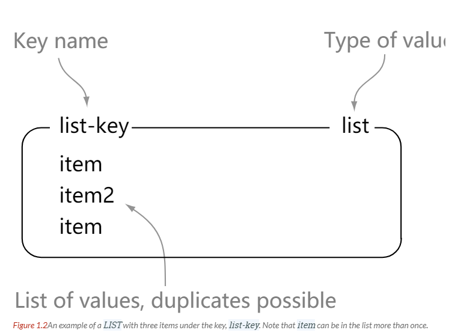

<!-- GFM-TOC -->
* [一、Redis 是什么](#一redis-是什么)
* [二、五种基本类型](#二五种基本类型)
    * [1. STRING](#1-string)
    * [2. LIST](#2-list)
    * [3. SET](#3-set)
    * [4. HASH](#4-hash)
    * [5. ZSET](#5-zset)
* [三、键的过期时间](#三键的过期时间)
* [四、发布与订阅](#四发布与订阅)
* [五、事务](#五事务)
* [六、持久化](#六持久化)
    * [1. 快照持久化](#1-快照持久化)
    * [2. AOF 持久化](#2-aof-持久化)
* [七、复制](#七复制)
    * [从服务器连接主服务器的过程](#从服务器连接主服务器的过程)
    * [主从链](#主从链)
* [八、处理故障](#八处理故障)
* [九、分片](#九分片)
    * [1. 客户端分片](#1-客户端分片)
    * [2. 代理分片](#2-代理分片)
    * [3. 服务器分片](#3-服务器分片)
* [十、事件](#十事件)
    * [事件类型](#事件类型)
    * [事件的调度与执行](#事件的调度与执行)
* [十一、Redis 与 Memcached 的区别](#十一redis-与-memcached-的区别)
    * [数据类型](#数据类型)
    * [数据持久化](#数据持久化)
    * [分布式](#分布式)
    * [内存管理机制](#内存管理机制)
* [十二、Redis 适用场景](#十二redis-适用场景)
    * [缓存](#缓存)
    * [消息队列](#消息队列)
    * [计数器](#计数器)
    * [好友关系](#好友关系)
* [十三、数据淘汰策略](#十三数据淘汰策略)
* [十四、一个简单的论坛系统分析](#十四一个简单的论坛系统分析)
    * [文章信息](#文章信息)
    * [点赞功能](#点赞功能)
    * [对文章进行排序](#对文章进行排序)
* [参考资料](#参考资料)
<!-- GFM-TOC -->


# 一、Redis 是什么

Redis 是速度非常快的非关系型（NoSQL）内存键值数据库，可以存储键和五种不同类型的值之间的映射。

五种类型数据类型为：字符串、列表、集合、有序集合、散列表。

Redis 支持很多特性，例如将内存中的数据持久化到硬盘中，使用复制来扩展读性能，使用分片来扩展写性能。

# 二、五种基本类型

| 数据类型 | 可以存储的值 | 操作 |
| :--: | :--: | :--: |
| STRING | 字符串、整数或者浮点数 | 对整个字符串或者字符串的其中一部分执行操作</br> 对整数和浮点数执行自增或者自减操作 |
| LIST | 列表 | 从两端压入或者弹出元素</br> 读取单个或者多个元素</br> 进行修剪，只保留一个范围内的元素 |
| SET | 无序集合 | 添加、获取、移除单个元素</br> 检查一个元素是否存在于集合中</br> 计算交集、并集、差集</br> 从集合里面随机获取元素 |
| HASH | 包含键值对的无序散列表 | 添加、获取、移除单个键值对</br> 获取所有键值对</br> 检查某个键是否存在|
| ZSET | 有序集合 | 添加、获取、删除元素</br> 根据分值范围或者成员来获取元素</br> 计算一个键的排名 |

> [What Redis data structures look like](https://redislabs.com/ebook/part-1-getting-started/chapter-1-getting-to-know-redis/1-2-what-redis-data-structures-look-like/)

## 1. STRING

<div align="center">  </div><br>

```html
> set hello world
OK
> get hello
"world"
> del hello
(integer) 1
> get hello
(nil)
```

## 2. LIST

<div align="center">  </div><br>

```html
> rpush list-key item
(integer) 1
> rpush list-key item2
(integer) 2
> rpush list-key item
(integer) 3

> lrange list-key 0 -1
1) "item"
2) "item2"
3) "item"

> lindex list-key 1
"item2"

> lpop list-key
"item"

> lrange list-key 0 -1
1) "item2"
2) "item"
```

## 3. SET

<div align="center">  </div><br>

```html
> sadd set-key item
(integer) 1
> sadd set-key item2
(integer) 1
> sadd set-key item3
(integer) 1
> sadd set-key item
(integer) 0

> smembers set-key
1) "item"
2) "item2"
3) "item3"

> sismember set-key item4
(integer) 0
> sismember set-key item
(integer) 1

> srem set-key item2
(integer) 1
> srem set-key item2
(integer) 0

> smembers set-key
1) "item"
2) "item3"
```

## 4. HASH

<div align="center">  </div><br>

```html
> hset hash-key sub-key1 value1
(integer) 1
> hset hash-key sub-key2 value2
(integer) 1
> hset hash-key sub-key1 value1
(integer) 0

> hgetall hash-key
1) "sub-key1"
2) "value1"
3) "sub-key2"
4) "value2"

> hdel hash-key sub-key2
(integer) 1
> hdel hash-key sub-key2
(integer) 0

> hget hash-key sub-key1
"value1"

> hgetall hash-key
1) "sub-key1"
2) "value1"
```

## 5. ZSET

<div align="center">  </div><br>

```html
> zadd zset-key 728 member1
(integer) 1
> zadd zset-key 982 member0
(integer) 1
> zadd zset-key 982 member0
(integer) 0

> zrange zset-key 0 -1 withscores
1) "member1"
2) "728"
3) "member0"
4) "982"

> zrangebyscore zset-key 0 800 withscores
1) "member1"
2) "728"

> zrem zset-key member1
(integer) 1
> zrem zset-key member1
(integer) 0

> zrange zset-key 0 -1 withscores
1) "member0"
2) "982"
```

# 三、键的过期时间

Redis 可以为每个键设置过期时间，当键过期时，会自动删除该键。

对于散列表这种容器，只能为整个键设置过期时间（整个散列表），而不能为键里面的单个元素设置过期时间。

过期时间对于清理缓存数据非常有用。

# 四、发布与订阅

订阅者订阅了频道之后，发布者向频道发送字符串消息会被所有订阅者接收到。

发布与订阅模式和观察者模式有以下不同：

- 观察者模式中，观察者和主题都知道对方的存在；而在发布与订阅模式中，发布者与订阅者不知道对方的存在，它们之间通过频道进行通信。
- 观察者模式是同步的，当事件触发时，主题会去调度观察者的方法；而发布与订阅模式是异步的；

<div align="center">  </div><br>

发布与订阅有一些问题，很少使用它，而是使用替代的解决方案。问题如下：

- 如果订阅者读取消息的速度很慢，会使得消息不断积压在发布者的输出缓存区中，造成内存占用过多；
- 如果订阅者在执行订阅的过程中网络出现问题，那么就会丢失断线期间发送的所有消息。

# 五、事务

Redis 最简单的事务实现方式是使用 MULTI 和 EXEC 命令将事务操作包围起来。

MULTI 和 EXEC 中的操作将会一次性发送给服务器，而不是一条一条发送，这种方式称为流水线，它可以减少客户端与服务器之间的网络通信次数从而提升性能。

# 六、持久化

Redis 是内存型数据库，为了保证数据在断电后不会丢失，需要将内存中的数据持久化到硬盘上。

## 1. 快照持久化

将某个时间点的所有数据都存放到硬盘上。

可以将快照复制到其它服务器从而创建具有相同数据的服务器副本。

如果系统发生故障，将会丢失最后一次创建快照之后的数据。

如果数据量很大，保存快照的时间会很长。

## 2. AOF 持久化

将写命令添加到 AOF 文件（Append Only File）的末尾。

对硬盘的文件进行写入时，写入的内容首先会被存储到缓冲区，然后由操作系统决定什么时候将该内容同步到硬盘，用户可以调用 file.flush() 方法请求操作系统尽快将缓冲区存储的数据同步到硬盘。

将写命令添加到 AOF 文件时，要根据需求来保证何时将添加的数据同步到硬盘上，有以下同步选项：

| 选项 | 同步频率 |
| :--: | :--: |
| always | 每个写命令都同步 |
| everysec | 每秒同步一次 |
| no | 让操作系统来决定何时同步 |

always 选项会严重减低服务器的性能；everysec 选项比较合适，可以保证系统奔溃时只会丢失一秒左右的数据，并且 Redis 每秒执行一次同步对服务器性能几乎没有任何影响；no 选项并不能给服务器性能带来多大的提升，而且也会增加系统奔溃时数据丢失的数量。

随着服务器写请求的增多，AOF 文件会越来越大；Redis 提供了一种将 AOF 重写的特性，能够去除 AOF 文件中的冗余写命令。

# 七、复制

通过使用 slaveof host port 命令来让一个服务器成为另一个服务器的从服务器。

一个从服务器只能有一个主服务器，并且不支持主主复制。

## 从服务器连接主服务器的过程

- 主服务器创建快照文件，发送给从服务器，并在发送期间使用缓冲区记录执行的写命令。快照文件发送完毕之后，开始向从服务器发送存储在缓冲区中的写命令；

- 从服务器丢弃所有旧数据，载入主服务器发来的快照文件，之后从服务器开始接受主服务器发来的写命令；

- 主服务器每执行一次写命令，就向从服务器发送相同的写命令。

## 主从链

随着负载不断上升，主服务器可能无法很快地更新所有从服务器，或者重新连接和重新同步从服务器将导致系统超载。为了解决这个问题，可以创建一个中间层来分担主服务器的复制工作。中间层的服务器是最上层服务器的从服务器，又是最下层服务器的主服务器。

<div align="center">  </div><br>

# 八、处理故障

要用到持久化文件来恢复服务器的数据。

持久化文件可能因为服务器出错也有错误，因此要先对持久化文件进行验证和修复。对 AOF 文件就行验证和修复很容易，修复操作将第一个出错命令和其后的所有命令都删除；但是只能验证快照文件，无法对快照文件进行修复，因为快照文件进行了压缩，出现在快照文件中间的错误可能会导致整个快照文件的剩余部分无法读取。

当主服务器出现故障时，Redis 常用的做法是新开一台服务器作为主服务器，具体步骤如下：假设 A 为主服务器，B 为从服务器，当 A 出现故障时，让 B 生成一个快照文件，将快照文件发送给 C，并让 C 恢复快照文件的数据。最后，让 B 成为 C 的从服务器。

# 九、分片

Redis 中的分片类似于 MySQL 的分表操作，分片是将数据划分为多个部分的方法，对数据的划分可以基于键包含的 ID、基于键的哈希值，或者基于以上两者的某种组合。通过对数据进行分片，用户可以将数据存储到多台机器里面，也可以从多台机器里面获取数据，这种方法在解决某些问题时可以获得线性级别的性能提升。

假设有 4 个 Reids 实例 R0，R1，R2，R3，还有很多表示用户的键 user:1，user:2，... 等等，有不同的方式来选择一个指定的键存储在哪个实例中。最简单的方式是范围分片，例如用户 id 从 0\~1000 的存储到实例 R0 中，用户 id 从 1001\~2000 的存储到实例 R1 中，等等。但是这样需要维护一张映射范围表，维护操作代价很高。还有一种方式是哈希分片，使用 CRC32 哈希函数将键转换为一个数字，再对实例数量求模就能知道应该存储的实例。

## 1. 客户端分片

客户端使用一致性哈希等算法决定键应当分布到哪个节点。

## 2. 代理分片

将客户端请求发送到代理上，由代理转发请求到正确的节点上。

## 3. 服务器分片

Redis Cluster。

# 十、事件

## 事件类型

### 1. 文件事件

服务器有许多套接字，事件产生时会对这些套接字进行操作，服务器通过监听套接字来处理事件。常见的文件事件有：客户端的连接事件；客户端的命令请求事件；服务器向客户端返回命令结果的事件；

### 2. 时间事件

又分为两类：定时事件是让一段程序在指定的时间之内执行一次；周期性事件是让一段程序每隔指定时间就执行一次。

## 事件的调度与执行

服务器需要不断监听文件事件的套接字才能得到待处理的文件事件，但是不能监听太久，否则时间事件无法在规定的时间内执行，因此监听时间应该根据距离现在最近的时间事件来决定。

事件调度与执行由 aeProcessEvents 函数负责，伪代码如下：

```python
def aeProcessEvents():

    # 获取到达时间离当前时间最接近的时间事件
    time_event = aeSearchNearestTimer()

    # 计算最接近的时间事件距离到达还有多少毫秒
    remaind_ms = time_event.when - unix_ts_now()

    # 如果事件已到达，那么 remaind_ms 的值可能为负数，将它设为 0
    if remaind_ms < 0:
        remaind_ms = 0

    # 根据 remaind_ms 的值，创建 timeval
    timeval = create_timeval_with_ms(remaind_ms)

    # 阻塞并等待文件事件产生，最大阻塞时间由传入的 timeval 决定
    aeApiPoll(timeval)

    # 处理所有已产生的文件事件
    procesFileEvents()

    # 处理所有已到达的时间事件
    processTimeEvents()
```

将 aeProcessEvents 函数置于一个循环里面，加上初始化和清理函数，就构成了 Redis 服务器的主函数，伪代码如下：

```python
def main():

    # 初始化服务器
    init_server()

    # 一直处理事件，直到服务器关闭为止
    while server_is_not_shutdown():
        aeProcessEvents()

    # 服务器关闭，执行清理操作
    clean_server()
```

从事件处理的角度来看，服务器运行流程如下：

<div align="center">  </div><br>

# 十一、Redis 与 Memcached 的区别

两者都是非关系型内存键值数据库。有以下主要不同：

## 数据类型

Memcached 仅支持字符串类型，而 Redis 支持五种不同种类的数据类型，使得它可以更灵活地解决问题。

## 数据持久化

Redis 支持两种持久化策略：RDB 快照和 AOF 日志，而 Memcached 不支持持久化。

## 分布式

Memcached 不支持分布式，只能通过在客户端使用像一致性哈希这样的分布式算法来实现分布式存储，这种方式在存储和查询时都需要先在客户端计算一次数据所在的节点。

Redis Cluster 实现了分布式的支持。

## 内存管理机制

在 Redis 中，并不是所有数据都一直存储在内存中，可以将一些很久没用的 value 交换到磁盘。而 Memcached 的数据则会一直在内存中。

Memcached 将内存分割成特定长度的块来存储数据，以完全解决内存碎片的问题，但是这种方式会使得内存的利用率不高，例如块的大小为 128 bytes，只存储 100 bytes 的数据，那么剩下的 28 bytes 就浪费掉了。

# 十二、Redis 适用场景

## 缓存

将热点数据放到内存中。

## 消息队列

List 类型是双向链表，很适合用于消息队列。

## 计数器

Redis 这种内存数据库能支持计数器频繁的读写操作。

## 好友关系

使用 Set 类型的交集操作很容易就可以知道两个用户的共同好友。

# 十三、数据淘汰策略

可以设置内存最大使用量，当内存使用量超过时施行淘汰策略，具体有 6 种淘汰策略。

| 策略 | 描述 |
| :--: | :--: |
| volatile-lru | 从已设置过期时间的数据集中挑选最近最少使用的数据淘汰 |
| volatile-ttl | 从已设置过期时间的数据集中挑选将要过期的数据淘汰 |
|volatile-random | 从已设置过期时间的数据集中任意选择数据淘汰 |
| allkeys-lru | 从所有数据集中挑选最近最少使用的数据淘汰 |
| allkeys-random | 从所有数据集中任意选择数据进行淘汰 |
| noeviction | 禁止驱逐数据 |

如果使用 Redis 来缓存数据时，要保证所有数据都是热点数据，可以将内存最大使用量设置为热点数据占用的内存量，然后启用 allkeys-lru 淘汰策略，将最近最少使用的数据淘汰。

作为内存数据库，出于对性能和内存消耗的考虑，Redis 的淘汰算法（LRU、TTL）实际实现上并非针对所有 key，而是抽样一小部分 key 从中选出被淘汰 key，抽样数量可通过 maxmemory-samples 配置。

# 十四、一个简单的论坛系统分析

该论坛系统功能如下：

- 可以发布文章；
- 可以对文章进行点赞；
- 在首页可以按文章的发布时间或者文章的点赞数进行排序显示；

## 文章信息

文章包括标题、作者、赞数等信息，在关系型数据库中很容易构建一张表来存储这些信息，在 Redis 中可以使用 HASH 来存储每种信息以及其对应的值的映射。

Redis 没有关系型数据库中的表这一概念来将同类型的数据存放在一起，而是使用命名空间的方式来实现这一功能。键名的前面部分存储命名空间，后面部分的内容存储 ID，通常使用 : 来进行分隔。例如下面的 HASH 的键名为 article:92617，其中 article 为命名空间，ID 为 92617。

<div align="center">  </div><br>

## 点赞功能

当有用户为一篇文章点赞时，除了要对该文章的 votes 字段进行加 1 操作，还必须记录该用户已经对该文章进行了点赞，防止用户点赞次数超过 1。可以建立文章的已投票用户集合来进行记录。

为了节约内存，规定一篇文章发布满一周之后，就不能再对它进行投票，而文章的已投票集合也会被删除，可以为文章的已投票集合设置一个一周的过期时间就能实现这个规定。

<div align="center">  </div><br>

## 对文章进行排序

为了按发布时间和点赞数进行排序，可以建立一个文章发布时间的有序集合和一个文章点赞数的有序集合。（下图中的 score 就是这里所说的点赞数；下面所示的有序集合分值并不直接是时间和点赞数，而是根据时间和点赞数间接计算出来的）

<div align="center">  </div><br>

# 参考资料

- Carlson J L. Redis in Action[J]. Media.johnwiley.com.au, 2013.
- [黄健宏. Redis 设计与实现 [M]. 机械工业出版社, 2014.](http://redisbook.com/index.html)
- [REDIS IN ACTION](https://redislabs.com/ebook/foreword/)
- [论述 Redis 和 Memcached 的差异](http://www.cnblogs.com/loveincode/p/7411911.html)
- [Redis 3.0 中文版- 分片](http://wiki.jikexueyuan.com/project/redis-guide)
- [Redis 应用场景](http://www.scienjus.com/redis-use-case/)
- [Observer vs Pub-Sub](http://developers-club.com/posts/270339/)
