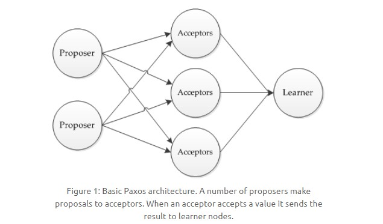
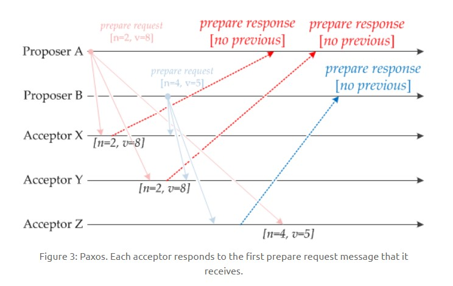
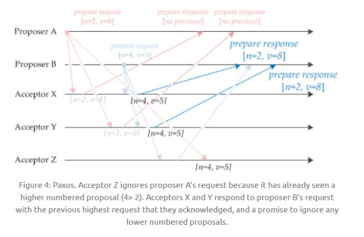
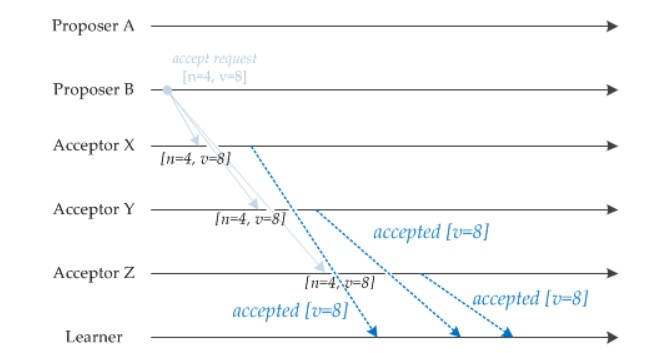
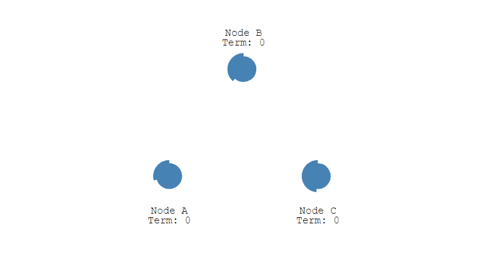
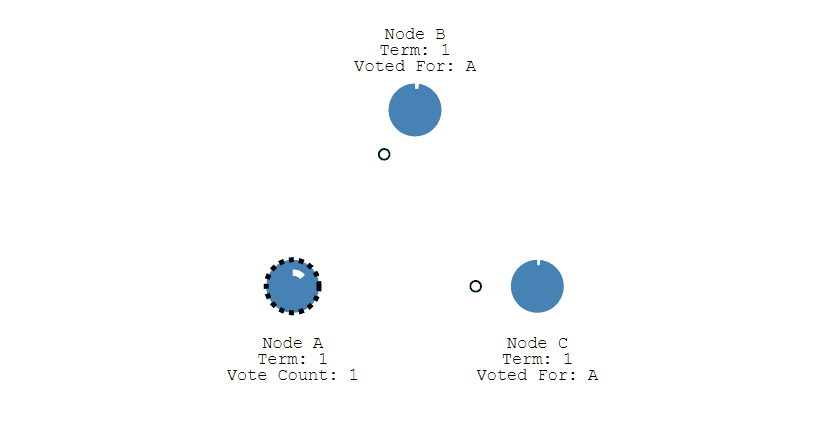
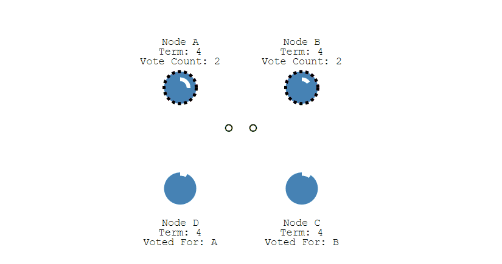
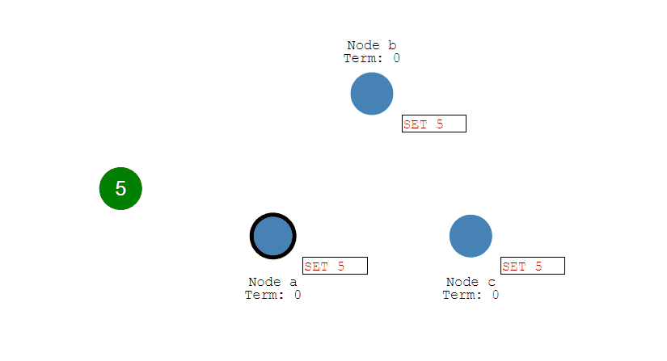
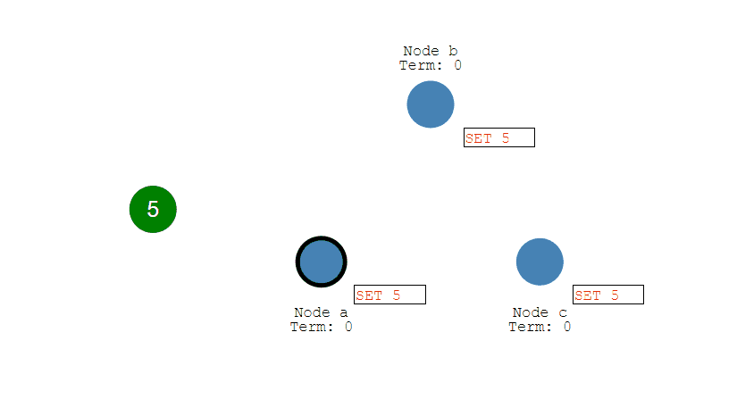

<!-- GFM-TOC -->
* [一、两阶段提交协议](#一两阶段提交协议)
* [二、Paxos 协议](#二paxos-协议)
* [三、Raft 协议](#三raft-协议)
* [四、拜占庭将军问题](#四拜占庭将军问题)
* [五、参考资料](#五参考资料)
<!-- GFM-TOC -->

# 一、两阶段提交协议

Two-phase Commit（2PC）。

可以保证一个事务跨越多个节点时保持 ACID 特性。

两类节点：协调者（Coordinator）和参与者（Participants），协调者只有一个，参与者可以有多个。

## 运行过程

- 准备阶段：协调者询问参与者事务是否执行成功；

- 提交阶段：如果事务在每个参与者上都执行成功，协调者发送通知让参与者提交事务；否则，协调者发送通知让参与者回滚事务。

  
 

需要注意的是，在准备阶段，参与者执行了事务，但是还未提交。只有在提交阶段接收到协调者发来的通知后，才进行提交或者回滚。

## 存在的问题

- 参与者发生故障。解决方案：可以给事务设置一个超时时间，如果某个参与者一直不响应，那么认为事务执行失败。

- 协调者发生故障。解决方案：将操作日志同步到备用协调者，让备用协调者接替后续工作。

# 二、Paxos 协议

用于达成共识性问题，即对多个节点产生的值，该算法能保证只选出唯一一个值。

主要有三类节点：

- 提议者（Proposer）：提议一个值；
- 接受者（Acceptor）：对每个提议进行投票；
- 告知者（Learner）：被告知投票的结果，不参与投票过程。

  
 

## 执行过程

规定一个提议包含两个字段：[n, v]，其中 n 为序号（具有唯一性），v 为提议值。

下图演示了两个 Proposer 和三个 Acceptor 的系统中运行该算法的初始过程，每个 Proposer 都会向所有 Acceptor 发送提议请求。

  
 

当 Acceptor 接收到一个提议请求，包含的提议为 [n1, v1]，并且之前还未接收过提议请求，那么发送一个提议响应，设置当前接收到的提议为 [n1, v1]，并且保证以后不会再接受序号小于 n1 的提议。

如下图，Acceptor X 在收到 [n=2, v=8] 的提议请求时，由于之前没有接收过提议，因此就发送一个 [no previous] 的提议响应，并且设置当前接收到的提议为 [n=2, v=8]，并且保证以后不会再接受序号小于 2 的提议。其它的 Acceptor 类似。

  
 

如果 Acceptor 接收到一个提议请求，包含的提议为 [n2, v2]，并且之前已经接收过提议 [n1, v1]。如果 n1 > n2，那么就丢弃该提议请求；否则，发送提议响应，该提议响应包含之前已经接收过的提议 [n1, v1]，设置当前接收到的提议为 [n2, v2]，并且保证以后不会再接受序号小于 n2 的提议。

如下图，Acceptor Z 收到 Proposer A 发来的 [n=2, v=8] 的提议请求，由于之前已经接收过 [n=4, v=5] 的提议，并且 n > 2，因此就抛弃该提议请求；Acceptor X 收到 Proposer B 发来的 [n=4, v=5] 的提议请求，因为之前接收到的提议为 [n=2, v=8]，并且 2 <= 4，因此就发送 [n=2, v=8] 的提议响应，设置当前接收到的提议为 [n=4, v=5]，并且保证以后不会再接受序号小于 4 的提议。Acceptor Y 类似。

  
 

当一个 Proposer 接收到超过一半 Acceptor 的提议响应时，就可以发送接受请求。

Proposer A 接收到两个提议响应之后，就发送 [n=2, v=8] 接受请求。该接受请求会被所有 Acceptor 丢弃，因为此时所有 Acceptor 都保证不接受序号小于 4 的提议。

Proposer B 过后也收到了两个提议响应，因此也开始发送接受请求。需要注意的是，接受请求的 v 需要取它收到的最大 v 值，也就是 8。因此它发送 [n=4, v=8] 的接受请求。

  
 

Acceptor 接收到接受请求时，如果序号大于等于该 Acceptor 承诺的最小序号，那么就发送通知给所有的 Learner。当 Learner 发现有大多数的 Acceptor 接收了某个提议，那么该提议的提议值就被 Paxos 选择出来。

  
 

## 约束条件

### 1. 正确性

指只有一个提议值会生效。

因为 Paxos 协议要求每个生效的提议被多数 Acceptor 接收，并且 Acceptor 不会接受两个不同的提议，因此可以保证正确性。

### 2. 可终止性

指最后总会有一个提议生效。

Paxos 协议能够让 Proposer 发送的提议朝着能被大多数 Acceptor 接受的那个提议靠拢，因此能够保证可终止性。

# 三、Raft 协议

Raft 和 Paxos 类似，但是更容易理解，也更容易实现。

Raft 主要是用来竞选主节点。

## 单个 Candidate 的竞选

有三种节点：Follower、Candidate 和 Leader。Leader 会周期性的发送心跳包给 Follower。每个 Follower 都设置了一个随机的竞选超时时间，一般为 150ms\~300ms，如果在这个时间内没有收到 Leader 的心跳包，就会变成 Candidate，进入竞选阶段。

- 下图表示一个分布式系统的最初阶段，此时只有 Follower，没有 Leader。Follower A 等待一个随机的竞选超时时间之后，没收到 Leader 发来的心跳包，因此进入竞选阶段。

  
 

- 此时 A 发送投票请求给其它所有节点。

  
 

- 其它节点会对请求进行回复，如果超过一半的节点回复了，那么该 Candidate 就会变成 Leader。

  
 

- 之后 Leader 会周期性地发送心跳包给 Follower，Follower 接收到心跳包，会重新开始计时。

  
 

## 多个 Candidate 竞选

- 如果有多个 Follower 成为 Candidate，并且所获得票数相同，那么就需要重新开始投票，例如下图中 Candidate B 和 Candidate D 都获得两票，因此需要重新开始投票。

  
 

- 当重新开始投票时，由于每个节点设置的随机竞选超时时间不同，因此能下一次再次出现多个 Candidate 并获得同样票数的概率很低。

  
 

## 日志复制

- 来自客户端的修改都会被传入 Leader。注意该修改还未被提交，只是写入日志中。

  
 

- Leader 会把修改复制到所有 Follower。

  
 

- Leader 会等待大多数的 Follower 也进行了修改，然后才将修改提交。

  
 

- 此时 Leader 会通知的所有 Follower 让它们也提交修改，此时所有节点的值达成一致。

  
 

# 四、拜占庭将军问题

> [拜占庭将军问题深入探讨](http://www.8btc.com/baizhantingjiangjun)

# 五、参考资料

- 杨传辉. 大规模分布式存储系统: 原理解析与架构实战[M]. 机械工业出版社, 2013.
- [区块链技术指南](https://www.gitbook.com/book/yeasy/blockchain_guide/details)
- [NEAT ALGORITHMS - PAXOS](http://harry.me/blog/2014/12/27/neat-algorithms-paxos/)
- [Raft: Understandable Distributed Consensus](http://thesecretlivesofdata.com/raft)
- [Paxos By Example](https://angus.nyc/2012/paxos-by-example/)
