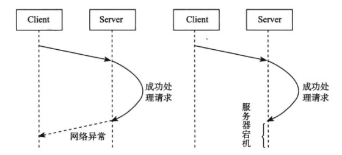
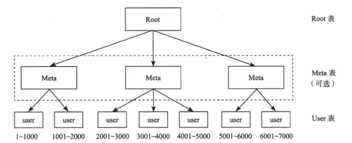
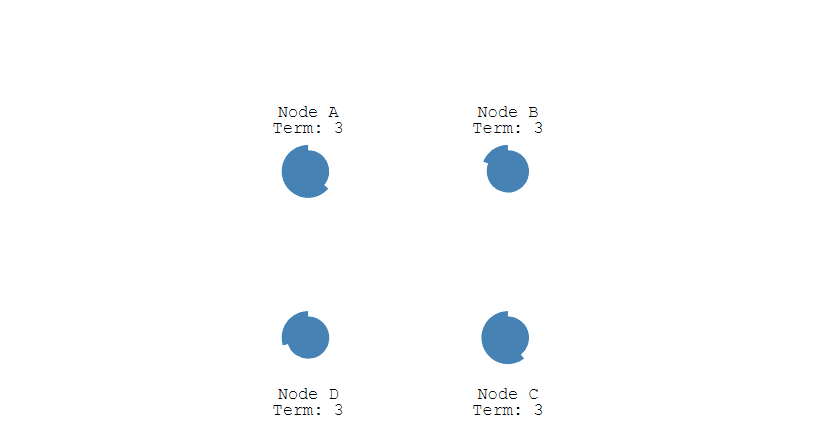

<!-- GFM-TOC -->
* [一、基本概念](#一基本概念)
    * [异常](#异常)
    * [超时](#超时)
    * [衡量指标](#衡量指标)
* [二、数据分布](#二数据分布)
    * [哈希分布](#哈希分布)
    * [顺序分布](#顺序分布)
    * [负载均衡](#负载均衡)
* [三、复制](#三复制)
    * [复制原理](#复制原理)
    * [复制协议](#复制协议)
    * [CAP](#cap)
    * [BASE](#base)
* [四、容错](#四容错)
    * [故障检测](#故障检测)
    * [故障恢复](#故障恢复)
* [五、一致性协议](#五一致性协议)
    * [两阶段提交协议](#两阶段提交协议)
    * [Paxos 协议](#paxos-协议)
    * [Raft 协议](#raft-协议)
    * [拜占庭将军问题](#拜占庭将军问题)
* [六、CDN 架构](#六cdn-架构)
* [参考资料](#参考资料)
<!-- GFM-TOC -->

# 一、基本概念

## 异常

### 1. 服务器宕机

内存错误、服务器停电等都会导致服务器宕机，此时节点无法正常工作，称为不可用。

服务器宕机会导致节点失去所有内存信息，因此需要将内存信息保存到持久化介质上。

### 2. 网络异常

有一种特殊的网络异常称为  **网络分区** ，即集群的所有节点被划分为多个区域，每个区域内部可以通信，但是区域之间无法通信。

### 3. 磁盘故障

磁盘故障是一种发生概率很高的异常。

使用冗余机制，将数据存储到多台服务器。

## 超时

在分布式系统中，一个请求除了成功和失败两种状态，还存在着超时状态。

  
 

可以将服务器的操作设计为具有  **幂等性** ，即执行多次的结果与执行一次的结果相同。如果使用这种方式，当出现超时的时候，可以不断地重新请求直到成功。

## 衡量指标

### 1. 性能

常见的性能指标有：吞吐量、响应时间。

其中，吞吐量指系统在某一段时间可以处理的请求总数，通常为每秒的读操作数或者写操作数；响应时间指从某个请求发出到接收到返回结果消耗的时间。

这两个指标往往是矛盾的，追求高吞吐的系统，往往很难做到低响应时间，解释如下：

- 在无并发的系统中，吞吐量为响应时间的倒数，例如响应时间为 10 ms，那么吞吐量为 100 req/s，因此高吞吐也就意味着低响应时间。

- 但是在并发的系统中，由于一个请求在调用 I/O 资源的时候，需要进行等待。服务器端一般使用的是异步等待方式，即等待的请求被阻塞之后不需要一直占用 CPU 资源。这种方式能大大提高 CPU 资源的利用率，例如上面的例子中，单个请求在无并发的系统中响应时间为 10 ms，如果在并发的系统中，那么吞吐量将大于 100 req/s。因此为了追求高吞吐量，通常会提高并发程度。但是并发程度的增加，会导致请求的平均响应时间也增加，因为请求不能马上被处理，需要和其它请求一起进行并发处理，响应时间自然就会增高。

### 2. 可用性

可用性指系统在面对各种异常时可以提供正常服务的能力。可以用系统可用时间占总时间的比值来衡量，4 个 9 的可用性表示系统 99.99% 的时间是可用的。

### 3. 一致性

可以从两个角度理解一致性：从客户端的角度，读写操作是否满足某种特性；从服务器的角度，多个数据副本之间是否一致。

### 4. 可扩展性

指系统通过扩展集群服务器规模来提高性能的能力。理想的分布式系统需要实现“线性可扩展”，即随着集群规模的增加，系统的整体性能也会线性增加。

# 二、数据分布

分布式存储系统的数据分布在多个节点中，常用的数据分布方式有哈希分布和顺序分布。

数据库的水平切分（Sharding）也是一种分布式存储方法，下面的数据分布方法同样适用于 Sharding。

## 哈希分布

哈希分布就是将数据计算哈希值之后，按照哈希值分配到不同的节点上。例如有 N 个节点，数据的主键为 key，则将该数据分配的节点序号为：hash(key)%N。

传统的哈希分布算法存在一个问题：当节点数量变化时，也就是 N 值变化，那么几乎所有的数据都需要重新分布，将导致大量的数据迁移。

**一致性哈希** 

Distributed Hash Table（DHT）：对于哈希空间  [0, 2n-1]，将该哈希空间看成一个哈希环，将每个节点都配置到哈希环上。每个数据对象通过哈希取模得到哈希值之后，存放到哈希环中顺时针方向第一个大于等于该哈希值的节点上。

  
 

一致性哈希的优点是在增加或者删除节点时只会影响到哈希环中相邻的节点，例如下图中新增节点 X，只需要将数据对象 C 重新存放到节点 X 上即可，对于节点 A、B、D 都没有影响。

  
 

## 顺序分布

哈希分布式破坏了数据的有序性，顺序分布则不会。

顺序分布的数据划分为多个连续的部分，按数据的 ID 或者时间分布到不同节点上。例如下图中，User 表的 ID 范围为 1 \~ 7000，使用顺序分布可以将其划分成多个子表，对应的主键范围为 1 \~ 1000，1001 \~ 2000，...，6001 \~ 7000。

顺序分布的优点是可以充分利用每个节点的空间，而哈希分布很难控制一个节点存储多少数据。

但是顺序分布需要使用一个映射表来存储数据到节点的映射，这个映射表通常使用单独的节点来存储。当数据量非常大时，映射表也随着变大，那么一个节点就可能无法存放下整个映射表。并且单个节点维护着整个映射表的开销很大，查找速度也会变慢。为了解决以上问题，引入了一个中间层，也就是 Meta 表，从而分担映射表的维护工作。

  
 

## 负载均衡

衡量负载的因素很多，如 CPU、内存、磁盘等资源使用情况、读写请求数等。

分布式系统存储应当能够自动负载均衡，当某个节点的负载较高，将它的部分数据迁移到其它节点。

每个集群都有一个总控节点，其它节点为工作节点，由总控节点根据全局负载信息进行整体调度，工作节点定时发送心跳包（Heartbeat）将节点负载相关的信息发送给总控节点。

一个新上线的工作节点，由于其负载较低，如果不加控制，总控节点会将大量数据同时迁移到该节点上，造成该节点一段时间内无法工作。因此负载均衡操作需要平滑进行，新加入的节点需要较长的一段时间来达到比较均衡的状态。

# 三、复制

## 复制原理

复制是保证分布式系统高可用的基础，让一个数据存储多个副本，当某个副本所在的节点出现故障时，能够自动切换到其它副本上，从而实现故障恢复。

多个副本通常有一个为主副本，其它为备副本。主副本用来处理写请求，备副本主要用来处理读请求，实现读写分离。

主副本将同步操作日志发送给备副本，备副本通过回放操作日志获取最新修改。

  
 

## 复制协议

主备副本之间有两种复制协议，一种是强同步复制协议，一种是异步复制协议。

### 1. 强同步复制协议

要求主副本将同步操作日志发给备副本之后进行等待，要求至少一个备副本返回成功后，才开始修改主副本，修改完成之后通知客户端操作成功。

优点：至少有一个备副本拥有完整的数据，出现故障时可以安全地切换到该备副本，因此一致性好。

缺点：可用性差，因为主副本需要等待，那么整个分布式系统的可用时间就会降低。

### 2. 异步复制协议

主副本将同步操作日志发给备副本之后不需要进行等待，直接修改主副本并通知客户端操作成功。

优点：可用性好。

缺点：一致性差。

## CAP

分布式存储系统不可能同时满足一致性（C：Consistency）、可用性（A：Availability）和分区容忍性（P：Partition tolerance），最多只能同时满足其中两项。

在设计分布式系统时，需要根据实际需求弱化某一要求。因此就有了下图中的三种设计：CA、CP 和 AP。

需要注意的是，分区容忍性必不可少，因为需要总是假设网络是不可靠的，并且系统需要能够自动容错，因此实际上设计分布式存储系统需要在一致性和可用性之间做权衡。上一节介绍的强同步协议和异步复制协议就是在一致性和可用性做权衡得到的结果。

  
 

## BASE

BASE 是 Basically Available（基本可用）、Soft State（软状态）和 Eventually Consistent（最终一致性）三个短语的缩写。BASE 理论是对 CAP 中一致性和可用性权衡的结果，是基于 CAP 定理逐步演化而来的。BASE 理论的核心思想是：即使无法做到强一致性，但每个应用都可以根据自身业务特点，采用适当的方式来使系统达到最终一致性。

  
 

### 1. 基本可用

指分布式系统在出现故障的时候，保证核心可用，允许损失部分可用性。

例如，电商在做促销时，服务层可能只提供降级服务，部分用户可能会被引导到降级页面上。

### 2. 软状态

指允许系统存在中间状态，而该中间状态不会影响系统整体可用性，即不同节点的数据副本之间进行同步的过程允许存在延时。

### 3. 最终一致性

一致性模型包含以下三种：

- 强一致性：新数据写入之后，在任何数据副本上都能读取到最新值；
- 弱一致性：新数据写入之后，不能保证在数据副本上能读取到最新值；
- 最终一致性：新数据写入之后，只能保证过了一个时间窗口后才能在数据副本上读取到最新值；

强一致性通常运用在需要满足 ACID 的传统数据库系统上，而最终一致性通常运用在大型分布式系统中。应该注意的是，上面介绍的强同步复制协议和异步复制协议都不能保证强一致性，因为它们是分布式系统的复制协议。这两种复制协议如果要满足最终一致性，还需要多加一些控制。

在实际的分布式场景中，不同业务单元和组件对一致性的要求是不同的，因此 ACID 和 BASE 往往会结合在一起使用。

# 四、容错

分布式系统故障发生的概率很大，为了实现高可用以及减少人工运维成本，需要实现自动化容错。

## 故障检测

通过  **租约机制**  来对故障进行检测。假设节点 A 为主控节点，节点 A 向节点 B 发送租约，节点 B 在租约规定的期限内才能提供服务。期限快到达时，节点 B 需要向 A 重新申请租约。

如果过期，那么 B 不再提供服务，并且 A 也能知道 B 此时可能发生故障并已经停止服务。可以看到，通过这种机制，A 和 B 都能对 B 发生故障这一事实达成一致。

## 故障恢复

当某个节点故障时，就将它上面的服务迁移到其它节点。

# 五、一致性协议

## 两阶段提交协议

Two-phase Commit（2PC）。

可以保证一个事务跨越多个节点时保持 ACID 特性，也就是说它可以用来实现分布式事务。

两类节点：协调者（Coordinator）和参与者（Participants），协调者只有一个，参与者可以有多个。

### 1. 运行过程

1. 准备阶段：协调者询问参与者事务是否执行成功；
2. 提交阶段：如果事务在每个参与者上都执行成功，协调者发送通知让参与者提交事务；否则，协调者发送通知让参与者回滚事务。

需要注意的是，在准备阶段，参与者执行了事务，但是还未提交。只有在提交阶段接收到协调者发来的通知后，才进行提交或者回滚。

  
 

### 2. 存在的问题

- 参与者发生故障。解决方案：可以给事务设置一个超时时间，如果某个参与者一直不响应，那么认为事务执行失败。
- 协调者发生故障。解决方案：将操作日志同步到备用协调者，让备用协调者接替后续工作。

## Paxos 协议

用于达成共识性问题，即对多个节点产生的值，该算法能保证只选出唯一一个值。

主要有三类节点：

- 提议者（Proposer）：提议一个值；
- 接受者（Acceptor）：对每个提议进行投票；
- 告知者（Learner）：被告知投票的结果，不参与投票过程。

  
 

### 1. 执行过程

规定一个提议包含两个字段：[n, v]，其中 n 为序号（具有唯一性），v 为提议值。

下图演示了两个 Proposer 和三个 Acceptor 的系统中运行该算法的初始过程，每个 Proposer 都会向所有 Acceptor 发送提议请求。

  
 

当 Acceptor 接收到一个提议请求，包含的提议为 [n1, v1]，并且之前还未接收过提议请求，那么发送一个提议响应，设置当前接收到的提议为 [n1, v1]，并且保证以后不会再接受序号小于 n1 的提议。

如下图，Acceptor X 在收到 [n=2, v=8] 的提议请求时，由于之前没有接收过提议，因此就发送一个 [no previous] 的提议响应，并且设置当前接收到的提议为 [n=2, v=8]，并且保证以后不会再接受序号小于 2 的提议。其它的 Acceptor 类似。

  
 

如果 Acceptor 接收到一个提议请求，包含的提议为 [n2, v2]，并且之前已经接收过提议 [n1, v1]。如果 n1 > n2，那么就丢弃该提议请求；否则，发送提议响应，该提议响应包含之前已经接收过的提议 [n1, v1]，设置当前接收到的提议为 [n2, v2]，并且保证以后不会再接受序号小于 n2 的提议。

如下图，Acceptor Z 收到 Proposer A 发来的 [n=2, v=8] 的提议请求，由于之前已经接收过 [n=4, v=5] 的提议，并且 n > 2，因此就抛弃该提议请求；Acceptor X 收到 Proposer B 发来的 [n=4, v=5] 的提议请求，因为之前接收到的提议为 [n=2, v=8]，并且 2 <= 4，因此就发送 [n=2, v=8] 的提议响应，设置当前接收到的提议为 [n=4, v=5]，并且保证以后不会再接受序号小于 4 的提议。Acceptor Y 类似。

  
 

当一个 Proposer 接收到超过一半 Acceptor 的提议响应时，就可以发送接受请求。

Proposer A 接收到两个提议响应之后，就发送 [n=2, v=8] 接受请求。该接受请求会被所有 Acceptor 丢弃，因为此时所有 Acceptor 都保证不接受序号小于 4 的提议。

Proposer B 过后也收到了两个提议响应，因此也开始发送接受请求。需要注意的是，接受请求的 v 需要取它收到的最大 v 值，也就是 8。因此它发送 [n=4, v=8] 的接受请求。

  
 

Acceptor 接收到接受请求时，如果序号大于等于该 Acceptor 承诺的最小序号，那么就发送通知给所有的 Learner。当 Learner 发现有大多数的 Acceptor 接收了某个提议，那么该提议的提议值就被 Paxos 选择出来。

  
 

### 2. 约束条件

**（一）正确性** 

指只有一个提议值会生效。

因为 Paxos 协议要求每个生效的提议被多数 Acceptor 接收，并且 Acceptor 不会接受两个不同的提议，因此可以保证正确性。

**（二）可终止性** 

指最后总会有一个提议生效。

Paxos 协议能够让 Proposer 发送的提议朝着能被大多数 Acceptor 接受的那个提议靠拢，因此能够保证可终止性。

## Raft 协议

Raft 和 Paxos 类似，但是更容易理解，也更容易实现。

Raft 主要是用来竞选主节点。

### 1. 单个 Candidate 的竞选

有三种节点：Follower、Candidate 和 Leader。Leader 会周期性的发送心跳包给 Follower。每个 Follower 都设置了一个随机的竞选超时时间，一般为 150ms\~300ms，如果在这个时间内没有收到 Leader 的心跳包，就会变成 Candidate，进入竞选阶段。

- 下图表示一个分布式系统的最初阶段，此时只有 Follower，没有 Leader。Follower A 等待一个随机的竞选超时时间之后，没收到 Leader 发来的心跳包，因此进入竞选阶段。

  
 

- 此时 A 发送投票请求给其它所有节点。

  
 

- 其它节点会对请求进行回复，如果超过一半的节点回复了，那么该 Candidate 就会变成 Leader。

  
 

- 之后 Leader 会周期性地发送心跳包给 Follower，Follower 接收到心跳包，会重新开始计时。

  
 

### 2. 多个 Candidate 竞选

*   如果有多个 Follower 成为 Candidate，并且所获得票数相同，那么就需要重新开始投票，例如下图中 Candidate B 和 Candidate D 都获得两票，因此需要重新开始投票。

  
 

*   当重新开始投票时，由于每个节点设置的随机竞选超时时间不同，因此能下一次再次出现多个 Candidate 并获得同样票数的概率很低。

  
 

### 3. 日志复制

- 来自客户端的修改都会被传入 Leader。注意该修改还未被提交，只是写入日志中。

  
 

- Leader 会把修改复制到所有 Follower。

  
 

- Leader 会等待大多数的 Follower 也进行了修改，然后才将修改提交。

  
 

- 此时 Leader 会通知的所有 Follower 让它们也提交修改，此时所有节点的值达成一致。

  
 

## 拜占庭将军问题

> [拜占庭将军问题深入探讨](http://www.8btc.com/baizhantingjiangjun)

# 六、CDN 架构

通过将内容发布到靠近用户的边缘节点，使不同地域的用户在访问相同网页时可以就近获取。不仅可以减轻服务器的负担，也可以提高用户的访问速度。

从下图可以看出，DNS 在对域名解析时不再向用户返回源服务器的 IP 地址，而是返回边缘节点的 IP 地址，所以用户最终访问的是边缘节点。边缘节点会先从源服务器中获取用户所需的数据，如果请求成功，边缘节点会将页面缓存下来，下次用户访问时可以直接读取。

  
 

# 参考资料

- 杨传辉. 大规模分布式存储系统: 原理解析与架构实战[M]. 机械工业出版社, 2013.
- 杨传辉. 大规模分布式存储系统: 原理解析与架构实战[M]. 机械工业出版社, 2013.
- [区块链技术指南](https://www.gitbook.com/book/yeasy/blockchain_guide/details)
- [NEAT ALGORITHMS - PAXOS](http://harry.me/blog/2014/12/27/neat-algorithms-paxos/)
- [Raft: Understandable Distributed Consensus](http://thesecretlivesofdata.com/raft)
- [Paxos By Example](https://angus.nyc/2012/paxos-by-example/)
