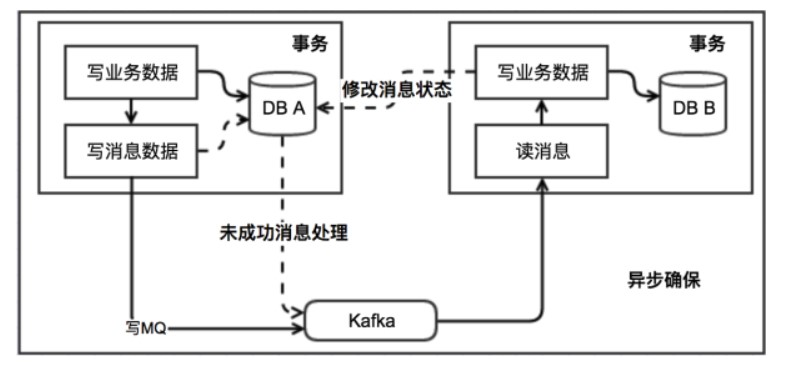
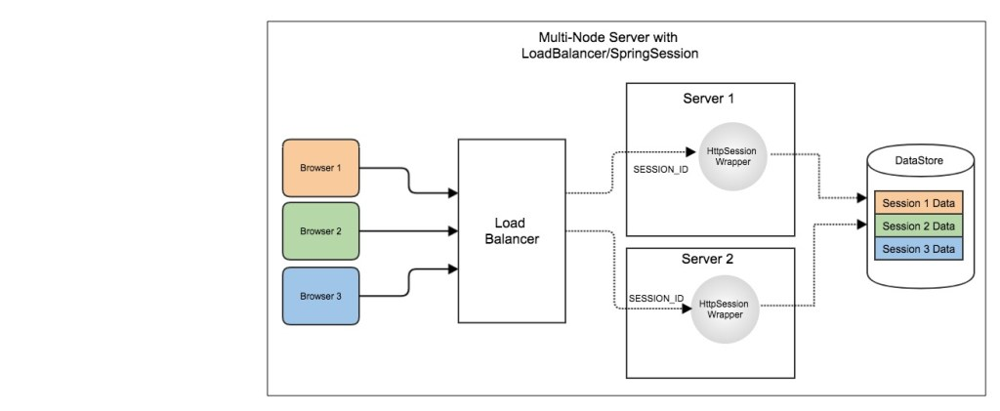
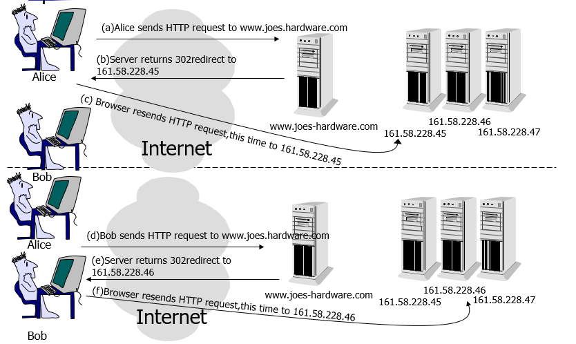
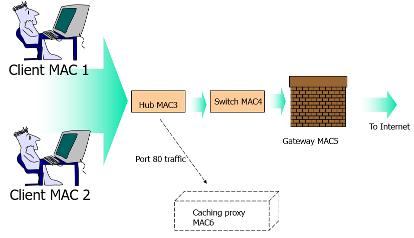
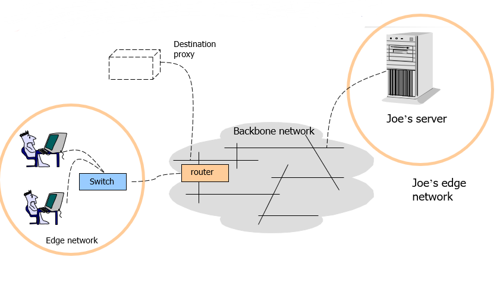

<!-- GFM-TOC -->
* [一、分布式锁](#一分布式锁)
    * [数据库的唯一索引](#数据库的唯一索引)
    * [Redis 的 SETNX 指令](#redis-的-setnx-指令)
    * [Redis 的 RedLock 算法](#redis-的-redlock-算法)
    * [Zookeeper 的有序节点](#zookeeper-的有序节点)
* [二、分布式事务](#二分布式事务)
    * [本地消息表](#本地消息表)
    * [两阶段提交协议](#两阶段提交协议)
* [三、分布式 Session](#三分布式-session)
    * [Sticky Sessions](#sticky-sessions)
    * [Session Replication](#session-replication)
    * [Session Server](#session-server)
* [四、负载均衡](#四负载均衡)
    * [算法](#算法)
    * [实现](#实现)
<!-- GFM-TOC -->

# 一、分布式锁

在单机场景下，可以使用 Java 提供的内置锁来实现进程同步。但是在分布式场景下，需要同步的进程可能位于不同的节点上，那么就需要使用分布式锁。

阻塞锁通常使用互斥量来实现，互斥量为 1 表示有其它进程在使用锁，此时处于锁定状态，互斥量为 0 表示未锁定状态。1 和 0 可以用一个整型值来存储，也可以用某个数据存在或者不存在来存储，某个数据存在表示互斥量为 1。

## 数据库的唯一索引

当想要获得锁时，就向表中插入一条记录，释放锁时就删除这条记录。唯一索引可以保证该记录只被插入一次，那么就可以用这个记录是否存在来判断是否存于锁定状态。

存在以下几个问题：

- 锁没有失效时间，解锁失败的话其他线程无法再获得锁。
- 只能是非阻塞锁，插入失败直接就报错了，无法重试。
- 不可重入，已经获得锁的进程也必须重新获取锁。

## Redis 的 SETNX 指令

使用 SETNX（set if not exist）指令插入一个键值对，如果 Key 已经存在，那么会返回 False，否则插入成功并返回 True。

SETNX 指令和数据库的唯一索引类似，可以保证只存在一个 Key 的键值对，可以用一个 Key 的键值对是否存在来判断是否存于锁定状态。

EXPIRE 指令可以为一个键值对设置一个过期时间，从而避免了数据库唯一索引实现方式中释放锁失败的问题。

## Redis 的 RedLock 算法

使用了多个 Redis 实例来实现分布式锁，这是为了保证在发生单点故障时仍然可用。

- 尝试从 N 个相互独立 Redis 实例获取锁，如果一个实例不可用，应该尽快尝试下一个。
- 计算获取锁消耗的时间，只有当这个时间小于锁的过期时间，并且从大多数（N/2+1）实例上获取了锁，那么就认为锁获取成功了。
- 如果锁获取失败，会到每个实例上释放锁。

## Zookeeper 的有序节点

### 1. Zookeeper 抽象模型

Zookeeper 提供了一种树形结构级的命名空间，/app1/p_1 节点表示它的父节点为 /app1。

  
 

### 2. 节点类型

- 永久节点：不会因为会话结束或者超时而消失；
- 临时节点：如果会话结束或者超时就会消失；
- 有序节点：会在节点名的后面加一个数字后缀，并且是有序的，例如生成的有序节点为 /lock/node-0000000000，它的下一个有序节点则为 /lock/node-0000000001，以此类推。

### 3. 监听器

为一个节点注册监听器，在节点状态发生改变时，会给客户端发送消息。

### 4. 分布式锁实现

- 创建一个锁目录 /lock；
- 当一个客户端需要获取锁时，在 /lock 下创建临时的且有序的子节点；
-  客户端获取 /lock 下的子节点列表，判断自己创建的子节点是否为当前子节点列表中序号最小的子节点，如果是则认为获得锁；否则监听自己的前一个子节点，获得子节点的变更通知后重复此步骤直至获得锁；
- 执行业务代码，完成后，删除对应的子节点。

### 5. 会话超时

如果一个已经获得锁的会话超时了，因为创建的是临时节点，所以该会话对应的临时节点会被删除，其它会话就可以获得锁了。可以看到，Zookeeper 分布式锁不会出现数据库的唯一索引实现分布式锁的释放锁失败问题。

### 6. 羊群效应

一个节点未获得锁，需要监听自己的前一个子节点，这是因为如果监听所有的子节点，那么任意一个子节点状态改变，其它所有子节点都会收到通知（羊群效应），而我们只希望它的后一个子节点收到通知。

参考：

- [浅谈分布式锁](http://www.linkedkeeper.com/detail/blog.action?bid=1023)
- [Distributed locks with Redis](https://redis.io/topics/distlock)
- [基于 Zookeeper 的分布式锁](http://www.dengshenyu.com/java/%E5%88%86%E5%B8%83%E5%BC%8F%E7%B3%BB%E7%BB%9F/2017/10/23/zookeeper-distributed-lock.html)

# 二、分布式事务

指事务的操作位于不同的节点上，需要保证事务的 AICD 特性。例如在下单场景下，库存和订单如果不在同一个节点上，就涉及分布式事务。

## 本地消息表

### 1. 原理

本地消息表与业务数据表处于同一个数据库中，这样就能利用本地事务来保证在对这两个表的操作满足事务特性。

1. 在分布式事务操作的一方完成写业务数据的操作之后向本地消息表发送一个消息，本地事务能保证这个消息一定会被写入本地消息表中。
2. 之后将本地消息表中的消息转发到 Kafka 等消息队列（MQ）中，如果转发成功则将消息从本地消息表中删除，否则继续重新转发。
3. 在分布式事务操作的另一方从消息队列中读取一个消息，并执行消息中的操作。

  
 

### 2. 分析

本地消息表利用了本地事务来实现分布式事务，并且使用了消息队列来保证最终一致性。

## 两阶段提交协议

[CyC2018/Interview-Notebook/一致性.md/2PC](https://github.com/CyC2018/Interview-Notebook/blob/master/notes/%E4%B8%80%E8%87%B4%E6%80%A7.md)

参考：

- [聊聊分布式事务，再说说解决方案](https://www.cnblogs.com/savorboard/p/distributed-system-transaction-consistency.html)
- [分布式系统的事务处理](https://coolshell.cn/articles/10910.html)
- [深入理解分布式事务](https://juejin.im/entry/577c6f220a2b5800573492be)

# 三、分布式 Session

在分布式场景下，一个用户的 Session 如果只存储在一个服务器上，那么当负载均衡器把用户的下一个请求转发到另一个服务器上，该服务器没有用户的 Session，就可能导致用户需要重新进行登录等操作。

## Sticky Sessions

需要配置负载均衡器，使得一个用户的所有请求都路由到一个服务器节点上，这样就可以把用户的 Session 存放在该服务器节点中。

缺点：当服务器节点宕机时，将丢失该服务器节点上的所有 Session。

  
 

## Session Replication

在服务器节点之间进行 Session 同步操作，这样的话用户可以访问任何一个服务器节点。

缺点：占用过多内存；同步过程占用网络带宽以及服务器处理器时间。

  
 

## Session Server

使用一个单独的服务器存储 Session 数据，可以存在 MySQL 数据库上，也可以存在 Redis 或者 Memcached 这种内存型数据库。

缺点：需要去实现存取 Session 的代码。

  
 

参考：

- [Session Management using Spring Session with JDBC DataStore](https://sivalabs.in/2018/02/session-management-using-spring-session-jdbc-datastore/)

# 四、负载均衡

## 算法

### 1. 轮询（Round Robin）

轮询算法把每个请求轮流发送到每个服务器上。下图中，一共有 6 个客户端产生了 6 个请求，这 6 个请求按 (1, 2, 3, 4, 5, 6) 的顺序发送。最后，(1, 3, 5) 的请求会被发送到服务器 1，(2, 4, 6) 的请求会被发送到服务器 2。

  
 

该算法比较适合每个服务器的性能差不多的场景，如果有性能存在差异的情况下，那么性能较差的服务器可能无法承担过大的负载（下图的 Server 2）。

  
 

### 2. 加权轮询（Weighted Round Robbin）

加权轮询是在轮询的基础上，根据服务器的性能差异，为服务器赋予一定的权值。例如下图中，服务器 1 被赋予的权值为 5，服务器 2 被赋予的权值为 1，那么 (1, 2, 3, 4, 5) 请求会被发送到服务器 1，(6) 请求会被发送到服务器 2。

  
 

### 3. 最少连接（least Connections）

由于每个请求的连接时间不一样，使用轮询或者加权轮询算法的话，可能会让一台服务器当前连接数过大，而另一台服务器的连接过小，造成负载不均衡。例如下图中，(1, 3, 5) 请求会被发送到服务器 1，但是 (1, 3) 很快就断开连接，此时只有 (5) 请求连接服务器 1；(2, 4, 6) 请求被发送到服务器 2，只有 (2) 的连接断开。该系统继续运行时，服务器 2 会承担过大的负载。

  
 

最少连接算法就是将请求发送给当前最少连接数的服务器上。例如下图中，服务器 1 当前连接数最小，那么新到来的请求 6 就会被发送到服务器 1 上。

  
 

### 4. 加权最少连接（Weighted Least Connection）

在最少连接的基础上，根据服务器的性能为每台服务器分配权重，再根据权重计算出每台服务器能处理的连接数。

  
 

### 5. 随机算法（Random）

把请求随机发送到服务器上。和轮询算法类似，该算法比较适合服务器性能差不多的场景。

  
 

### 6. 源地址哈希法 (IP Hash)

源地址哈希通过对客户端 IP 哈希计算得到的一个数值，用该数值对服务器数量进行取模运算，取模结果便是目标服务器的序号。

- 优点：保证同一 IP 的客户端都会被 hash 到同一台服务器上。
- 缺点：不利于集群扩展，后台服务器数量变更都会影响 hash 结果。可以采用一致性 Hash 改进。

  
 

## 实现

### 1. HTTP 重定向

HTTP 重定向负载均衡服务器收到 HTTP 请求之后会返回服务器的地址，并将该地址写入 HTTP 重定向响应中返回给浏览器，浏览器收到后需要再次发送请求。

缺点：

- 用户访问的延迟会增加；
- 如果负载均衡器宕机，就无法访问该站点。

  
 

### 2. DNS 重定向

使用 DNS 作为负载均衡器，根据负载情况返回不同服务器的 IP 地址。大型网站基本使用了这种方式做为第一级负载均衡手段，然后在内部使用其它方式做第二级负载均衡。

缺点：

- DNS 查找表可能会被客户端缓存起来，那么之后的所有请求都会被重定向到同一个服务器。

  
 

### 3. 修改 MAC 地址

使用 LVS（Linux Virtual Server）这种链路层负载均衡器，根据负载情况修改请求的 MAC 地址。

  
 

### 4. 修改 IP 地址

在网络层修改请求的目的 IP 地址。

  
 

### 5. 代理自动配置

正向代理与反向代理的区别：

- 正向代理：发生在客户端，是由用户主动发起的。比如翻墙，客户端通过主动访问代理服务器，让代理服务器获得需要的外网数据，然后转发回客户端。
- 反向代理：发生在服务器端，用户不知道代理的存在。

PAC 服务器是用来判断一个请求是否要经过代理。

  
 

参考：

- [Comparing Load Balancing Algorithms](http://www.jscape.com/blog/load-balancing-algorithms)
- [负载均衡算法及手段](https://segmentfault.com/a/1190000004492447)
- [Redirection and Load Balancing](http://slideplayer.com/slide/6599069/#)

