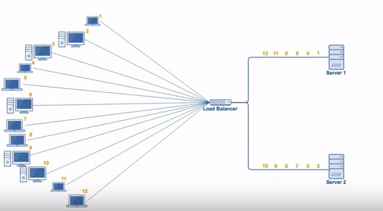
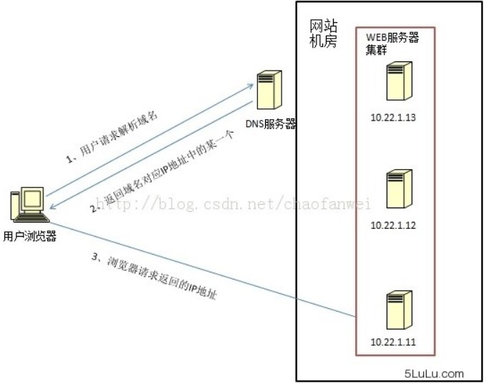
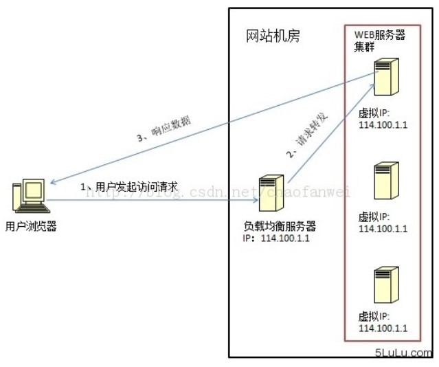
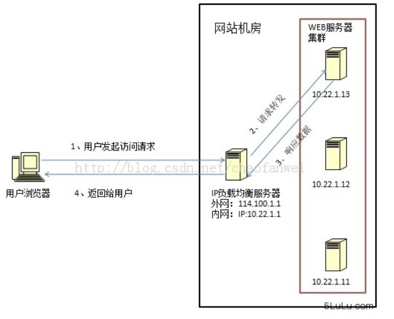
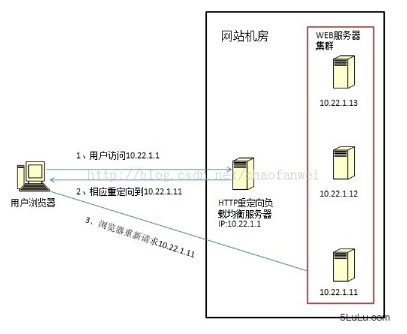
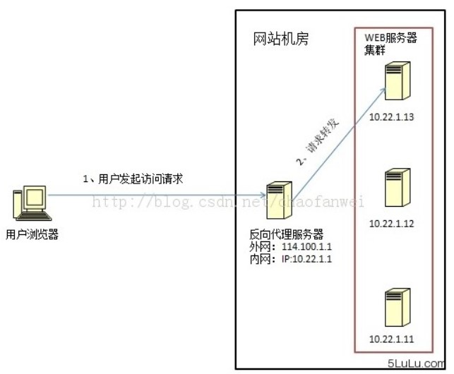
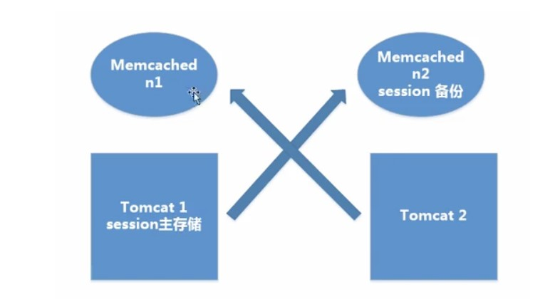
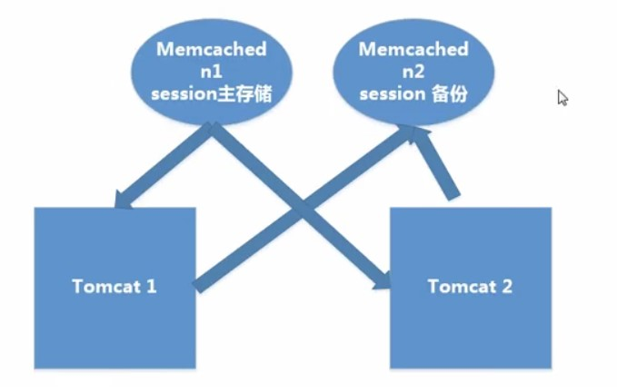
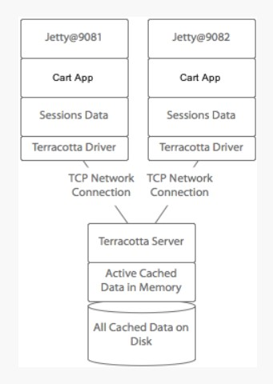
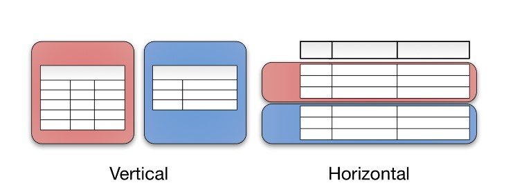

<!-- GFM-TOC -->
* [一、谈谈业务中使用分布式的场景](#一谈谈业务中使用分布式的场景)
* [二、分布式事务](#二分布式事务)
    * [产生原因](#产生原因)
    * [应用场景](#应用场景)
    * [解决方案](#解决方案)
* [三、负载均衡的算法与实现](#三负载均衡的算法与实现)
    * [算法](#算法)
    * [实现](#实现)
* [四、分布式锁](#四分布式锁)
    * [使用场景](#使用场景)
    * [实现方式](#实现方式)
* [五、分布式 Session](#五分布式-session)
    * [1. 粘性 Session](#1-粘性-session)
    * [2. 服务器 Session 复制](#2-服务器-session-复制)
    * [3. Session 共享机制](#3-session-共享机制)
    * [4. Session 持久化到数据库](#4-session-持久化到数据库)
    * [5. Terracotta 实现 Session 复制](#5-terracotta-实现-session-复制)
* [六、分库与分表带来的分布式困境与应对之策](#六分库与分表带来的分布式困境与应对之策)
    * [事务问题](#事务问题)
    * [查询问题](#查询问题)
    * [ID 唯一性](#id-唯一性)
* [参考资料](#参考资料)
<!-- GFM-TOC -->

# 一、谈谈业务中使用分布式的场景

分布式主要是为了提供可扩展性以及高可用性，业务中使用分布式的场景主要有分布式存储以及分布式计算。

分布式存储中可以将数据分片到多个节点上，不仅可以提高性能（可扩展性），同时也可以使用多个节点对同一份数据进行备份。

至于分布式计算，就是将一个大的计算任务分解成小任务分配到多台节点上去执行，再汇总每个小任务的执行结果得到最终结果。MapReduce 是分布式计算的最好例子。

# 二、分布式事务

指事务的操作位于不同的节点上，需要保证事务的 AICD 特性。

## 产生原因

- 数据库分库分表；
- SOA 架构，比如一个电商网站将订单业务和库存业务分离出来放到不同的节点上。

## 应用场景

- 下单：减少库存、更新订单状态。库存和订单不在不同一个数据库，因此涉及分布式事务。
- 支付：买家账户扣款、卖家账户入账。买家和卖家账户信息不在同一个数据库，因此涉及分布式事务。

## 解决方案

### 1. 两阶段提交协议

[两阶段提交](https://github.com/CyC2018/Interview-Notebook/blob/master/notes/%E4%B8%80%E8%87%B4%E6%80%A7%E5%8D%8F%E8%AE%AE.md#%E4%B8%A4%E9%98%B6%E6%AE%B5%E6%8F%90%E4%BA%A4%E5%8D%8F%E8%AE%AE)

两阶段提交协议可以很好得解决分布式事务问题，它可以使用 XA 来实现，XA 它包含两个部分：事务管理器和本地资源管理器。其中本地资源管理器往往由数据库实现，比如 Oracle、DB2 这些商业数据库都实现了 XA 接口；而事务管理器作为全局的协调者，负责各个本地资源的提交和回滚。

### 2. 消息中间件

消息中间件也可称作消息系统 (MQ)，它本质上是一个暂存转发消息的一个中间件。在分布式应用当中，我们可以把一个业务操作转换成一个消息，比如支付宝的余额转入余额宝操作，支付宝系统执行减少余额操作之后向消息系统发送一个消息，余额宝系统订阅这条消息然后进行增加余额宝操作。

**（一）消息处理模型** 

 **点对点**  

  
 

 **发布/订阅**  

  
 

**（二）消息的可靠性** 

消息的发送端的可靠性：发送端完成操作后一定能将消息成功发送到消息系统。

消息的接收端的可靠性：接收端仅且能够从消息中间件成功消费一次消息。

 **发送端的可靠性**  

在本地数据建一张消息表，将消息数据与业务数据保存在同一数据库实例里，这样就可以利用本地数据库的事务机制。事务提交成功后，将消息表中的消息转移到消息中间件，若转移消息成功则删除消息表中的数据，否则继续重传。

 **接收端的可靠性**  

保证接收端处理消息的业务逻辑具有幂等性：只要具有幂等性，那么消费多少次消息，最后处理的结果都是一样的。

保证消息具有唯一编号，并使用一张日志表来记录已经消费的消息编号。

# 三、负载均衡的算法与实现

## 算法

### 1. 轮询（Round Robin）

轮询算法把每个请求轮流发送到每个服务器上。下图中，一共有 6 个客户端产生了 6 个请求，这 6 个请求按 (1, 2, 3, 4, 5, 6) 的顺序发送。最后，(1, 3, 5) 的请求会被发送到服务器 1，(2, 4, 6) 的请求会被发送到服务器 2。

  
 

该算法比较适合每个服务器的性能差不多的场景，如果有性能存在差异的情况下，那么性能较差的服务器可能无法承担多大的负载。下图中，服务器 2 的性能比服务器 1 差，那么服务器 2 可能无法承担多大的负载。

  
 

### 2. 加权轮询（Weighted Round Robbin）

加权轮询是在轮询的基础上，根据服务器的性能差异，为服务器赋予一定的权值。例如下图中，服务器 1 被赋予的权值为 5，服务器 2 被赋予的权值为 1，那么 (1, 2, 3, 4, 5) 请求会被发送到服务器 1，(6) 请求会被发送到服务器 2。

  
 

### 3. 最少连接（least Connections）

由于每个请求的连接时间不一样，使用轮询或者加权轮询算法的话，可能会让一台服务器当前连接数多大，而另一台服务器的连接多小，造成负载不均衡。例如下图中，(1, 3, 5) 请求会被发送到服务器 1，但是 (1, 3) 很快就断开连接，此时只有 (5) 请求连接服务器 1；(2, 4, 6) 请求被发送到服务器 2，只有 (2) 的连接断开。该系统继续运行时，服务器 2 会承担多大的负载。

  
 

最少连接算法就是将请求发送给当前最少连接数的服务器上。例如下图中，服务器 1 当前连接数最小，那么新到来的请求 6 就会被发送到服务器 1 上。

  
 

### 4. 加权最小连接（Weighted Least Connection）

在最小连接的基础上，根据服务器的性能为每台服务器分配权重，根据权重计算出每台服务器能处理的连接数。

  
 

### 5. 随机算法（Random）

把请求随机发送到服务器上。和轮询算法类似，该算法比较适合服务器性能差不多的场景。

  
 

## 实现

### 1. DNS 解析

使用 DNS 作为负载均衡器，根据负载情况返回不同服务器的 IP 地址。大型网站基本使用了这种方式最为第一级负载均衡手段，然后在内部使用其它方式做第二级负载均衡。

  
 

### 2. 修改 MAC 地址

使用 LVS（Linux Virtual Server）这种链路层负载均衡器，根据负载情况修改请求的 MAC 地址。

  
 

### 3. 修改 IP 地址

在网络层修改请求的目的 IP 地址。

  
 

### 4. HTTP 重定向

HTTP 重定向负载均衡服务器收到 HTTP 请求之后会返回服务器的地址，并将该地址写入 HTTP 重定向响应中返回给浏览器，浏览器收到后需要再次发送请求。

  
 

### 5. 反向代理

正向代理：发生在客户端，是由用户主动发起的。比如翻墙，客户端通过主动访问代理服务器，让代理服务器获得需要的外网数据，然后转发回客户端。

反向代理：发生在服务器端，用户不知道代理的存在。

  
 

# 四、分布式锁

Java 提供了两种内置的锁的实现，一种是由 JVM 实现的 synchronized 和 JDK 提供的 Lock，当你的应用是单机或者说单进程应用时，可以使用 synchronized 或 Lock 来实现锁。当应用涉及到多机、多进程共同完成时，那么这时候就需要一个全局锁来实现多个进程之间的同步。

## 使用场景

在服务器端使用分布式部署的情况下，一个服务可能分布在不同的节点撒花姑娘，比如订单服务分布式在节点 A 和节点 B 上。如果多个客户端同时对一个服务进行请求时，就需要使用分布式锁。例如当 APP 端的请求路由到了节点 A，WEB 端被路由到了 B 服务，这时对共享资源进行使用时需要使用分布式锁。

## 实现方式

### 1. 数据库分布式锁

**（一）基于 MySQL 锁表** 

该实现方式完全依靠数据库唯一索引来实现。当想要获得锁时，就向数据库中插入一条记录，释放锁时就删除这条记录。如果记录具有唯一索引，就不会同时插入同一条记录。这种方式存在以下几个问题：

1. 锁没有失效时间，解锁失败会导致死锁，其他线程无法再获得锁。
2. 只能是非阻塞锁，插入失败直接就报错了，无法重试。
3. 不可重入，同一线程在没有释放锁之前无法再获得锁。

**（二）采用乐观锁增加版本号** 

根据版本号来判断更新之前有没有其他线程更新过，如果被更新过，则获取锁失败。

### 2. Redis 分布式锁

**（一）基于 SETNX、EXPIRE** 

使用 SETNX（set if not exist）命令插入一个键值对时，如果 Key 已经存在，那么会返回 False，否则插入成功并返回 True。因此客户端在尝试获得锁时，先使用 SETNX 向 Redis 中插入一个记录，如果返回 True 表示获得锁，返回 False 表示已经有客户端占用锁。

EXPIRE 可以为一个键值对设置一个过期时间，从而避免了死锁的发生。

**（二）RedLock 算法** 

ReadLock 算法使用了多个 Redis 实例来实现分布式锁，这是为了保证在发生单点故障时还可用。

1. 尝试从 N 个相互独立 Redis 实例获取锁，如果一个实例不可用，应该尽快尝试下一个。
2. 计算获取锁消耗的时间，只有当这个时间小于锁的过期时间，并且从大多数（N/2+1）实例上获取了锁，那么就认为锁获取成功了。
3. 如果锁获取失败，会到每个实例上释放锁。

### 3. Zookeeper 分布式锁

Zookeeper 是一个为分布式应用提供一致性服务的软件，例如配置管理、分布式协同以及命名的中心化等，这些都是分布式系统中非常底层而且是必不可少的基本功能，但是如果自己实现这些功能而且要达到高吞吐、低延迟同时还要保持一致性和可用性，实际上非常困难。

**（一）抽象模型** 

Zookeeper 提供了一种树形结构级的命名空间，/app1/p_1 节点表示它的父节点为 /app1。

  
 

**（二）节点类型** 

- 永久节点：不会因为会话结束或者超时而消失；
- 临时节点：如果会话结束或者超时就会消失；
- 有序节点：会在节点名的后面加一个数字后缀，并且是有序的，例如生成的有序节点为 /lock/node-0000000000，它的下一个有序节点则为 /lock/node-0000000001，依次类推。

**（三）监听器** 

为一个节点注册监听器，在节点状态发生改变时，会给客户端发送消息。

**（四）分布式锁实现** 

1. 创建一个锁目录 /lock。
1. 在 /lock 下创建临时的且有序的子节点，第一个客户端对应的子节点为 /lock/lock-0000000000，第二个为 /lock/lock-0000000001，以此类推。
2.  客户端获取 /lock 下的子节点列表，判断自己创建的子节点是否为当前子节点列表中序号最小的子节点，如果是则认为获得锁，否则监听自己的前一个子节点，获得子节点的变更通知后重复此步骤直至获得锁；
3. 执行业务代码，完成后，删除对应的子节点。

**（五）会话超时** 

如果一个已经获得锁的会话超时了，因为创建的是临时节点，因此该会话对应的临时节点会被删除，其它会话就可以获得锁了。可以看到，Zookeeper 分布式锁不会出现数据库分布式锁的死锁问题。

**（六）羊群效应** 

在步骤二，一个节点未获得锁，需要监听监听自己的前一个子节点，这是因为如果监听所有的子节点，那么任意一个子节点状态改变，其它所有子节点都会收到通知，而我们只希望它的下一个子节点收到通知。

# 五、分布式 Session

如果不做任何处理的话，用户将出现频繁登录的现象，比如集群中存在 A、B 两台服务器，用户在第一次访问网站时，Nginx 通过其负载均衡机制将用户请求转发到 A 服务器，这时 A 服务器就会给用户创建一个 Session。当用户第二次发送请求时，Nginx 将其负载均衡到 B 服务器，而这时候 B 服务器并不存在 Session，所以就会将用户踢到登录页面。这将大大降低用户体验度，导致用户的流失，这种情况是项目绝不应该出现的。

## 1. 粘性 Session

### 原理

粘性 Session 是指将用户锁定到某一个服务器上，比如上面说的例子，用户第一次请求时，负载均衡器将用户的请求转发到了 A 服务器上，如果负载均衡器设置了粘性 Session 的话，那么用户以后的每次请求都会转发到 A 服务器上，相当于把用户和 A 服务器粘到了一块，这就是粘性 Session 机制。

### 优点

简单，不需要对 Session 做任何处理。

### 缺点

缺乏容错性，如果当前访问的服务器发生故障，用户被转移到第二个服务器上时，他的 Session 信息都将失效。

### 适用场景

- 发生故障对客户产生的影响较小；
- 服务器发生故障是低概率事件。

## 2. 服务器 Session 复制

### 原理

任何一个服务器上的 Session 发生改变，该节点会把这个 Session 的所有内容序列化，然后广播给所有其它节点，不管其他服务器需不需要 Session，以此来保证 Session 同步。

### 优点

可容错，各个服务器间 Session 能够实时响应。

### 缺点

会对网络负荷造成一定压力，如果 Session 量大的话可能会造成网络堵塞，拖慢服务器性能。

### 实现方式

1. 设置 Tomcat 的 server.xml 开启 tomcat 集群功能。
2. 在应用里增加信息：通知应用当前处于集群环境中，支持分布式，即在 web.xml 中添加&lt;distributable/> 选项。

## 3. Session 共享机制

使用分布式缓存方案比如 Memcached、Redis，但是要求 Memcached 或 Redis 必须是集群。

使用 Session 共享也分两种机制，两种情况如下：

### 3.1 粘性 Session 共享机制

和粘性 Session 一样，一个用户的 Session 会绑定到一个 Tomcat 上。Memcached 只是起到备份作用。

  
 

### 3.2 非粘性 Session 共享机制

#### 原理

Tomcat 本身不存储 Session，而是存入 Memcached 中。Memcached 集群构建主从复制架构。

  
 

#### 优点

可容错，Session 实时响应。

#### 实现方式

用开源的 msm 插件解决 Tomcat 之间的 Session 共享：Memcached_Session_Manager（MSM）

## 4. Session 持久化到数据库

### 原理

拿出一个数据库，专门用来存储 Session 信息。保证 Session 的持久化。

### 优点

服务器出现问题，Session 不会丢失

### 缺点

如果网站的访问量很大，把 Session 存储到数据库中，会对数据库造成很大压力，还需要增加额外的开销维护数据库。

## 5. Terracotta 实现 Session 复制

### 原理

Terracotta 的基本原理是对于集群间共享的数据，当在一个节点发生变化的时候，Terracotta 只把变化的部分发送给 Terracotta 服务器，然后由服务器把它转发给真正需要这个数据的节点。它是服务器 Session 复制的优化。

  
 

### 优点

这样对网络的压力就非常小，各个节点也不必浪费 CPU 时间和内存进行大量的序列化操作。把这种集群间数据共享的机制应用在 Session 同步上，既避免了对数据库的依赖，又能达到负载均衡和灾难恢复的效果。

# 六、分库与分表带来的分布式困境与应对之策

  
 

## 事务问题

使用分布式事务。

## 查询问题

使用汇总表。

## ID 唯一性

- 使用全局唯一 ID：GUID。
- 为每个分片指定一个 ID 范围。
- 分布式 ID 生成器 (如 Twitter 的 [Snowflake](https://twitter.github.io/twitter-server/) 算法)。

# 参考资料

- [Comparing Load Balancing Algorithms](http://www.jscape.com/blog/load-balancing-algorithms)
- [负载均衡算法及手段](https://segmentfault.com/a/1190000004492447)
- [集群/分布式环境下 5 种 Session 处理策略](http://blog.csdn.net/u010028869/article/details/50773174?ref=myread)
- [浅谈分布式锁](http://www.linkedkeeper.com/detail/blog.action?bid=1023)
- [深入理解分布式事务](https://juejin.im/entry/577c6f220a2b5800573492be)
- [分布式系统的事务处理](https://coolshell.cn/articles/10910.html)
- [关于分布式事务](http://blog.csdn.net/suifeng3051/article/details/52691210)
- [基于 Zookeeper 的分布式锁](http://www.dengshenyu.com/java/%E5%88%86%E5%B8%83%E5%BC%8F%E7%B3%BB%E7%BB%9F/2017/10/23/zookeeper-distributed-lock.html)
- [How Sharding Works](https://medium.com/@jeeyoungk/how-sharding-works-b4dec46b3f6)
- [服务端指南 数据存储篇 | MySQL（09） 分库与分表带来的分布式困境与应对之策](http://blog.720ui.com/2017/mysql_core_09_multi_db_table2/ "服务端指南 数据存储篇 | MySQL（09） 分库与分表带来的分布式困境与应对之策")
- [How to create unique row ID in sharded databases?](https://stackoverflow.com/questions/788829/how-to-create-unique-row-id-in-sharded-databases)
