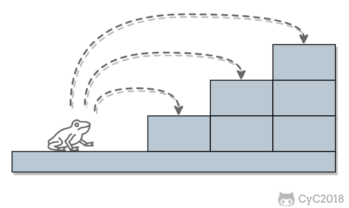
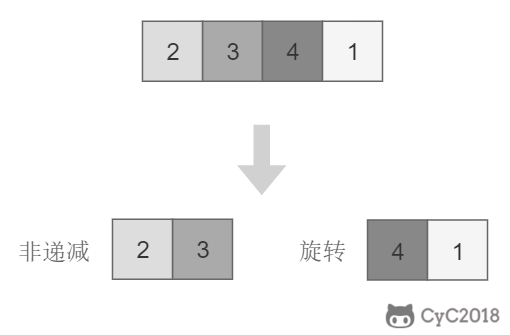

<!-- GFM-TOC -->
* [10.1 斐波那契数列](#101-斐波那契数列)
* [10.2 矩形覆盖](#102-矩形覆盖)
* [10.3 跳台阶](#103-跳台阶)
* [10.4 变态跳台阶](#104-变态跳台阶)
* [11. 旋转数组的最小数字](#11-旋转数组的最小数字)
* [12. 矩阵中的路径](#12-矩阵中的路径)
* [13. 机器人的运动范围](#13-机器人的运动范围)
* [14. 剪绳子](#14-剪绳子)
* [15. 二进制中 1 的个数](#15-二进制中-1-的个数)
* [16. 数值的整数次方](#16-数值的整数次方)
* [17. 打印从 1 到最大的 n 位数](#17-打印从-1-到最大的-n-位数)
* [18.1 在 O(1) 时间内删除链表节点](#181-在-o1-时间内删除链表节点)
* [18.2 删除链表中重复的结点](#182-删除链表中重复的结点)
* [19. 正则表达式匹配](#19-正则表达式匹配)
<!-- GFM-TOC -->


# 10.1 斐波那契数列

[NowCoder](https://www.nowcoder.com/practice/c6c7742f5ba7442aada113136ddea0c3?tpId=13&tqId=11160&tPage=1&rp=1&ru=/ta/coding-interviews&qru=/ta/coding-interviews/question-ranking)

## 题目描述

求斐波那契数列的第 n 项，n <= 39。

<!--<div align="center">1}\end{array}\right." class="mathjax-pic"/></div> <br> -->

<div align="center">  </div><br>

## 解题思路

如果使用递归求解，会重复计算一些子问题。例如，计算 f(4) 需要计算 f(3) 和 f(2)，计算 f(3) 需要计算 f(2) 和 f(1)，可以看到 f(2) 被重复计算了。

<div align="center">  </div><br>

递归是将一个问题划分成多个子问题求解，动态规划也是如此，但是动态规划会把子问题的解缓存起来，从而避免重复求解子问题。

```java
public int Fibonacci(int n) {
    if (n <= 1)
        return n;
    int[] fib = new int[n + 1];
    fib[1] = 1;
    for (int i = 2; i <= n; i++)
        fib[i] = fib[i - 1] + fib[i - 2];
    return fib[n];
}
```

考虑到第 i 项只与第 i-1 和第 i-2 项有关，因此只需要存储前两项的值就能求解第 i 项，从而将空间复杂度由 O(N) 降低为 O(1)。

```java
public int Fibonacci(int n) {
    if (n <= 1)
        return n;
    int pre2 = 0, pre1 = 1;
    int fib = 0;
    for (int i = 2; i <= n; i++) {
        fib = pre2 + pre1;
        pre2 = pre1;
        pre1 = fib;
    }
    return fib;
}
```

由于待求解的 n 小于 40，因此可以将前 40 项的结果先进行计算，之后就能以 O(1) 时间复杂度得到第 n 项的值。

```java
public class Solution {

    private int[] fib = new int[40];

    public Solution() {
        fib[1] = 1;
        for (int i = 2; i < fib.length; i++)
            fib[i] = fib[i - 1] + fib[i - 2];
    }

    public int Fibonacci(int n) {
        return fib[n];
    }
}
```

# 10.2 矩形覆盖

[NowCoder](https://www.nowcoder.com/practice/72a5a919508a4251859fb2cfb987a0e6?tpId=13&tqId=11163&tPage=1&rp=1&ru=/ta/coding-interviews&qru=/ta/coding-interviews/question-ranking)

## 题目描述

我们可以用 2\*1 的小矩形横着或者竖着去覆盖更大的矩形。请问用 n 个 2\*1 的小矩形无重叠地覆盖一个 2\*n 的大矩形，总共有多少种方法？

<div align="center">  </div><br>

## 解题思路

当 n 为 1 时，只有一种覆盖方法：

<div align="center">  </div><br>

当 n 为 2 时，有两种覆盖方法：

<div align="center">  </div><br>

要覆盖 2\*n 的大矩形，可以先覆盖 2\*1 的矩形，再覆盖 2\*(n-1) 的矩形；或者先覆盖 2\*2 的矩形，再覆盖 2\*(n-2) 的矩形。而覆盖 2\*(n-1) 和 2\*(n-2) 的矩形可以看成子问题。该问题的递推公式如下：

<!-- <div align="center">1}\end{array}\right." class="mathjax-pic"/></div> <br> -->

<div align="center">  </div><br>

```java
public int RectCover(int n) {
    if (n <= 2)
        return n;
    int pre2 = 1, pre1 = 2;
    int result = 0;
    for (int i = 3; i <= n; i++) {
        result = pre2 + pre1;
        pre2 = pre1;
        pre1 = result;
    }
    return result;
}
```

# 10.3 跳台阶

[NowCoder](https://www.nowcoder.com/practice/8c82a5b80378478f9484d87d1c5f12a4?tpId=13&tqId=11161&tPage=1&rp=1&ru=/ta/coding-interviews&qru=/ta/coding-interviews/question-ranking)

## 题目描述

一只青蛙一次可以跳上 1 级台阶，也可以跳上 2 级。求该青蛙跳上一个 n 级的台阶总共有多少种跳法。

<div align="center">  </div><br>

## 解题思路

当 n = 1 时，只有一种跳法：

<div align="center">  </div><br>

当 n = 2 时，有两种跳法：

<div align="center">  </div><br>

跳 n 阶台阶，可以先跳 1 阶台阶，再跳 n-1 阶台阶；或者先跳 2 阶台阶，再跳 n-2 阶台阶。而 n-1 和 n-2 阶台阶的跳法可以看成子问题，该问题的递推公式为：

<div align="center">  </div><br>

```java
public int JumpFloor(int n) {
    if (n <= 2)
        return n;
    int pre2 = 1, pre1 = 2;
    int result = 1;
    for (int i = 2; i < n; i++) {
        result = pre2 + pre1;
        pre2 = pre1;
        pre1 = result;
    }
    return result;
}
```

# 10.4 变态跳台阶

[NowCoder](https://www.nowcoder.com/practice/22243d016f6b47f2a6928b4313c85387?tpId=13&tqId=11162&tPage=1&rp=1&ru=/ta/coding-interviews&qru=/ta/coding-interviews/question-ranking)

## 题目描述

一只青蛙一次可以跳上 1 级台阶，也可以跳上 2 级... 它也可以跳上 n 级。求该青蛙跳上一个 n 级的台阶总共有多少种跳法。

<div align="center">  </div><br>

## 解题思路

### 动态规划

```java
public int JumpFloorII(int target) {
    int[] dp = new int[target];
    Arrays.fill(dp, 1);
    for (int i = 1; i < target; i++)
        for (int j = 0; j < i; j++)
            dp[i] += dp[j];
    return dp[target - 1];
}
```

### 数学推导

跳上 n-1 级台阶，可以从 n-2 级跳 1 级上去，也可以从 n-3 级跳 2 级上去...，那么

```
f(n-1) = f(n-2) + f(n-3) + ... + f(0)
```

同样，跳上 n 级台阶，可以从 n-1 级跳 1 级上去，也可以从 n-2 级跳 2 级上去... ，那么

```
f(n) = f(n-1) + f(n-2) + ... + f(0)
```

综上可得

```
f(n) - f(n-1) = f(n-1)
```

即

```
f(n) = 2*f(n-1)
```

所以 f(n) 是一个等比数列

```source-java
public int JumpFloorII(int target) {
    return (int) Math.pow(2, target - 1);
}
```


# 11. 旋转数组的最小数字

[NowCoder](https://www.nowcoder.com/practice/9f3231a991af4f55b95579b44b7a01ba?tpId=13&tqId=11159&tPage=1&rp=1&ru=/ta/coding-interviews&qru=/ta/coding-interviews/question-ranking)

## 题目描述

把一个数组最开始的若干个元素搬到数组的末尾，我们称之为数组的旋转。输入一个非递减排序的数组的一个旋转，输出旋转数组的最小元素。

<div align="center">  </div><br>

## 解题思路

将旋转数组对半分可以得到一个包含最小元素的新旋转数组，以及一个非递减排序的数组。新的旋转数组的数组元素是原数组的一半，从而将问题规模减少了一半，这种折半性质的算法的时间复杂度为 O(logN)（为了方便，这里将 log<sub>2</sub>N 写为 logN）。

<div align="center">  </div><br>

此时问题的关键在于确定对半分得到的两个数组哪一个是旋转数组，哪一个是非递减数组。我们很容易知道非递减数组的第一个元素一定小于等于最后一个元素。

通过修改二分查找算法进行求解（l 代表 low，m 代表 mid，h 代表 high）：

- 当 nums[m] <= nums[h] 时，表示 [m, h] 区间内的数组是非递减数组，[l, m] 区间内的数组是旋转数组，此时令 h = m；
- 否则 [m + 1, h] 区间内的数组是旋转数组，令 l = m + 1。

```java
public int minNumberInRotateArray(int[] nums) {
    if (nums.length == 0)
        return 0;
    int l = 0, h = nums.length - 1;
    while (l < h) {
        int m = l + (h - l) / 2;
        if (nums[m] <= nums[h])
            h = m;
        else
            l = m + 1;
    }
    return nums[l];
}
```

如果数组元素允许重复，会出现一个特殊的情况：nums[l] == nums[m] == nums[h]，此时无法确定解在哪个区间，需要切换到顺序查找。例如对于数组 {1,1,1,0,1}，l、m 和 h 指向的数都为 1，此时无法知道最小数字 0 在哪个区间。

```java
public int minNumberInRotateArray(int[] nums) {
    if (nums.length == 0)
        return 0;
    int l = 0, h = nums.length - 1;
    while (l < h) {
        int m = l + (h - l) / 2;
        if (nums[l] == nums[m] && nums[m] == nums[h])
            return minNumber(nums, l, h);
        else if (nums[m] <= nums[h])
            h = m;
        else
            l = m + 1;
    }
    return nums[l];
}

private int minNumber(int[] nums, int l, int h) {
    for (int i = l; i < h; i++)
        if (nums[i] > nums[i + 1])
            return nums[i + 1];
    return nums[l];
}
```

# 12. 矩阵中的路径

[NowCoder](https://www.nowcoder.com/practice/c61c6999eecb4b8f88a98f66b273a3cc?tpId=13&tqId=11218&tPage=1&rp=1&ru=/ta/coding-interviews&qru=/ta/coding-interviews/question-ranking)

## 题目描述

判断在一个矩阵中是否存在一条包含某字符串所有字符的路径。路径可以从矩阵中的任意一个格子开始，每一步可以在矩阵中向上下左右移动一个格子。如果一条路径经过了矩阵中的某一个格子，则该路径不能再进入该格子。

例如下面的矩阵包含了一条 bfce 路径。

<div align="center">  </div><br>

## 解题思路

使用回溯法（backtracking）进行求解，它是一种暴力搜索方法，通过搜索所有可能的结果来求解问题。回溯法在一次搜索结束时需要进行回溯（回退），将这一次搜索过程中设置的状态进行清除，从而开始一次新的搜索过程。例如下图示例中，从 f 开始，下一步有 4 种搜索可能，如果先搜索 b，需要将 b 标记为已经使用，防止重复使用。在这一次搜索结束之后，需要将 b 的已经使用状态清除，并搜索 c。

<div align="center">  </div><br>

本题的输入是数组而不是矩阵（二维数组），因此需要先将数组转换成矩阵。

```java
private final static int[][] next = {{0, -1}, {0, 1}, {-1, 0}, {1, 0}};
private int rows;
private int cols;

public boolean hasPath(char[] array, int rows, int cols, char[] str) {
    if (rows == 0 || cols == 0) return false;
    this.rows = rows;
    this.cols = cols;
    boolean[][] marked = new boolean[rows][cols];
    char[][] matrix = buildMatrix(array);
    for (int i = 0; i < rows; i++)
        for (int j = 0; j < cols; j++)
            if (backtracking(matrix, str, marked, 0, i, j))
                return true;

    return false;
}

private boolean backtracking(char[][] matrix, char[] str,
                             boolean[][] marked, int pathLen, int r, int c) {

    if (pathLen == str.length) return true;
    if (r < 0 || r >= rows || c < 0 || c >= cols
            || matrix[r][c] != str[pathLen] || marked[r][c]) {

        return false;
    }
    marked[r][c] = true;
    for (int[] n : next)
        if (backtracking(matrix, str, marked, pathLen + 1, r + n[0], c + n[1]))
            return true;
    marked[r][c] = false;
    return false;
}

private char[][] buildMatrix(char[] array) {
    char[][] matrix = new char[rows][cols];
    for (int r = 0, idx = 0; r < rows; r++)
        for (int c = 0; c < cols; c++)
            matrix[r][c] = array[idx++];
    return matrix;
}
```

# 13. 机器人的运动范围

[NowCoder](https://www.nowcoder.com/practice/6e5207314b5241fb83f2329e89fdecc8?tpId=13&tqId=11219&tPage=1&rp=1&ru=/ta/coding-interviews&qru=/ta/coding-interviews/question-ranking)

## 题目描述

地上有一个 m 行和 n 列的方格。一个机器人从坐标 (0, 0) 的格子开始移动，每一次只能向左右上下四个方向移动一格，但是不能进入行坐标和列坐标的数位之和大于 k 的格子。

例如，当 k 为 18 时，机器人能够进入方格 (35,37)，因为 3+5+3+7=18。但是，它不能进入方格 (35,38)，因为 3+5+3+8=19。请问该机器人能够达到多少个格子？

## 解题思路

使用深度优先搜索（Depth First Search，DFS）方法进行求解。回溯是深度优先搜索的一种特例，它在一次搜索过程中需要设置一些本次搜索过程的局部状态，并在本次搜索结束之后清除状态。而普通的深度优先搜索并不需要使用这些局部状态，虽然还是有可能设置一些全局状态。

```java
private static final int[][] next = {{0, -1}, {0, 1}, {-1, 0}, {1, 0}};
private int cnt = 0;
private int rows;
private int cols;
private int threshold;
private int[][] digitSum;

public int movingCount(int threshold, int rows, int cols) {
    this.rows = rows;
    this.cols = cols;
    this.threshold = threshold;
    initDigitSum();
    boolean[][] marked = new boolean[rows][cols];
    dfs(marked, 0, 0);
    return cnt;
}

private void dfs(boolean[][] marked, int r, int c) {
    if (r < 0 || r >= rows || c < 0 || c >= cols || marked[r][c])
        return;
    marked[r][c] = true;
    if (this.digitSum[r][c] > this.threshold)
        return;
    cnt++;
    for (int[] n : next)
        dfs(marked, r + n[0], c + n[1]);
}

private void initDigitSum() {
    int[] digitSumOne = new int[Math.max(rows, cols)];
    for (int i = 0; i < digitSumOne.length; i++) {
        int n = i;
        while (n > 0) {
            digitSumOne[i] += n % 10;
            n /= 10;
        }
    }
    this.digitSum = new int[rows][cols];
    for (int i = 0; i < this.rows; i++)
        for (int j = 0; j < this.cols; j++)
            this.digitSum[i][j] = digitSumOne[i] + digitSumOne[j];
}
```

# 14. 剪绳子

[Leetcode](https://leetcode.com/problems/integer-break/description/)

## 题目描述

把一根绳子剪成多段，并且使得每段的长度乘积最大。

```html
n = 2
return 1 (2 = 1 + 1)

n = 10
return 36 (10 = 3 + 3 + 4)
```

## 解题思路

### 贪心

尽可能多剪长度为 3 的绳子，并且不允许有长度为 1 的绳子出现。如果出现了，就从已经切好长度为 3 的绳子中拿出一段与长度为 1 的绳子重新组合，把它们切成两段长度为 2 的绳子。

证明：当 n >= 5 时，3(n - 3) - n = 2n - 9 > 0，且 2(n - 2) - n = n - 4 > 0。因此在 n >= 5 的情况下，将绳子剪成一段为 2 或者 3，得到的乘积会更大。又因为 3(n - 3) - 2(n - 2) = n - 5 >= 0，所以剪成一段长度为 3 比长度为 2 得到的乘积更大。

```java
public int integerBreak(int n) {
    if (n < 2)
        return 0;
    if (n == 2)
        return 1;
    if (n == 3)
        return 2;
    int timesOf3 = n / 3;
    if (n - timesOf3 * 3 == 1)
        timesOf3--;
    int timesOf2 = (n - timesOf3 * 3) / 2;
    return (int) (Math.pow(3, timesOf3)) * (int) (Math.pow(2, timesOf2));
}
```

### 动态规划

```java
public int integerBreak(int n) {
    int[] dp = new int[n + 1];
    dp[1] = 1;
    for (int i = 2; i <= n; i++)
        for (int j = 1; j < i; j++)
            dp[i] = Math.max(dp[i], Math.max(j * (i - j), dp[j] * (i - j)));
    return dp[n];
}
```

# 15. 二进制中 1 的个数

[NowCoder](https://www.nowcoder.com/practice/8ee967e43c2c4ec193b040ea7fbb10b8?tpId=13&tqId=11164&tPage=1&rp=1&ru=/ta/coding-interviews&qru=/ta/coding-interviews/question-ranking)

## 题目描述

输入一个整数，输出该数二进制表示中 1 的个数。

### n&(n-1)

该位运算去除 n 的位级表示中最低的那一位。

```
n       : 10110100
n-1     : 10110011
n&(n-1) : 10110000
```

时间复杂度：O(M)，其中 M 表示 1 的个数。


```java
public int NumberOf1(int n) {
    int cnt = 0;
    while (n != 0) {
        cnt++;
        n &= (n - 1);
    }
    return cnt;
}
```


### Integer.bitCount()

```java
public int NumberOf1(int n) {
    return Integer.bitCount(n);
}
```

# 16. 数值的整数次方

[NowCoder](https://www.nowcoder.com/practice/1a834e5e3e1a4b7ba251417554e07c00?tpId=13&tqId=11165&tPage=1&rp=1&ru=/ta/coding-interviews&qru=/ta/coding-interviews/question-ranking)

## 题目描述

给定一个 double 类型的浮点数 base 和 int 类型的整数 exponent，求 base 的 exponent 次方。

## 解题思路

下面的讨论中 x 代表 base，n 代表 exponent。

<!--<div align="center"></div> <br>-->

<div align="center">  </div><br>


因为 (x\*x)<sup>n/2</sup> 可以通过递归求解，并且每次递归 n 都减小一半，因此整个算法的时间复杂度为 O(logN)。

```java
public double Power(double base, int exponent) {
    if (exponent == 0)
        return 1;
    if (exponent == 1)
        return base;
    boolean isNegative = false;
    if (exponent < 0) {
        exponent = -exponent;
        isNegative = true;
    }
    double pow = Power(base * base, exponent / 2);
    if (exponent % 2 != 0)
        pow = pow * base;
    return isNegative ? 1 / pow : pow;
}
```

# 17. 打印从 1 到最大的 n 位数

## 题目描述

输入数字 n，按顺序打印出从 1 到最大的 n 位十进制数。比如输入 3，则打印出 1、2、3 一直到最大的 3 位数即 999。

## 解题思路

由于 n 可能会非常大，因此不能直接用 int 表示数字，而是用 char 数组进行存储。

使用回溯法得到所有的数。

```java
public void print1ToMaxOfNDigits(int n) {
    if (n <= 0)
        return;
    char[] number = new char[n];
    print1ToMaxOfNDigits(number, 0);
}

private void print1ToMaxOfNDigits(char[] number, int digit) {
    if (digit == number.length) {
        printNumber(number);
        return;
    }
    for (int i = 0; i < 10; i++) {
        number[digit] = (char) (i + '0');
        print1ToMaxOfNDigits(number, digit + 1);
    }
}

private void printNumber(char[] number) {
    int index = 0;
    while (index < number.length && number[index] == '0')
        index++;
    while (index < number.length)
        System.out.print(number[index++]);
    System.out.println();
}
```

# 18.1 在 O(1) 时间内删除链表节点

## 解题思路

① 如果该节点不是尾节点，那么可以直接将下一个节点的值赋给该节点，然后令该节点指向下下个节点，再删除下一个节点，时间复杂度为 O(1)。

<div align="center">  </div><br>

② 否则，就需要先遍历链表，找到节点的前一个节点，然后让前一个节点指向 null，时间复杂度为 O(N)。

<div align="center">  </div><br>

综上，如果进行 N 次操作，那么大约需要操作节点的次数为 N-1+N=2N-1，其中 N-1 表示 N-1 个不是尾节点的每个节点以 O(1) 的时间复杂度操作节点的总次数，N 表示 1 个尾节点以 O(N) 的时间复杂度操作节点的总次数。(2N-1)/N \~ 2，因此该算法的平均时间复杂度为 O(1)。

```java
public ListNode deleteNode(ListNode head, ListNode tobeDelete) {
    if (head == null || tobeDelete == null)
        return null;
    if (tobeDelete.next != null) {
        // 要删除的节点不是尾节点
        ListNode next = tobeDelete.next;
        tobeDelete.val = next.val;
        tobeDelete.next = next.next;
    } else {
        if (head == tobeDelete)
             // 只有一个节点
            head = null;
        else {
            ListNode cur = head;
            while (cur.next != tobeDelete)
                cur = cur.next;
            cur.next = null;
        }
    }
    return head;
}
```

# 18.2 删除链表中重复的结点

[NowCoder](https://www.nowcoder.com/practice/fc533c45b73a41b0b44ccba763f866ef?tpId=13&tqId=11209&tPage=1&rp=1&ru=/ta/coding-interviews&qru=/ta/coding-interviews/question-ranking)

## 题目描述

<div align="center">  </div><br>

## 解题描述

```java
public ListNode deleteDuplication(ListNode pHead) {
    if (pHead == null || pHead.next == null)
        return pHead;
    ListNode next = pHead.next;
    if (pHead.val == next.val) {
        while (next != null && pHead.val == next.val)
            next = next.next;
        return deleteDuplication(next);
    } else {
        pHead.next = deleteDuplication(pHead.next);
        return pHead;
    }
}
```

# 19. 正则表达式匹配

[NowCoder](https://www.nowcoder.com/practice/45327ae22b7b413ea21df13ee7d6429c?tpId=13&tqId=11205&tPage=1&rp=1&ru=/ta/coding-interviews&qru=/ta/coding-interviews/question-ranking)

## 题目描述

请实现一个函数用来匹配包括 '.' 和 '\*' 的正则表达式。模式中的字符 '.' 表示任意一个字符，而 '\*' 表示它前面的字符可以出现任意次（包含 0 次）。

在本题中，匹配是指字符串的所有字符匹配整个模式。例如，字符串 "aaa" 与模式 "a.a" 和 "ab\*ac\*a" 匹配，但是与 "aa.a" 和 "ab\*a" 均不匹配。

## 解题思路

应该注意到，'.' 是用来当做一个任意字符，而 '\*' 是用来重复前面的字符。这两个的作用不同，不能把 '.' 的作用和 '\*' 进行类比，从而把它当成重复前面字符一次。

```java
public boolean match(char[] str, char[] pattern) {

    int m = str.length, n = pattern.length;
    boolean[][] dp = new boolean[m + 1][n + 1];

    dp[0][0] = true;
    for (int i = 1; i <= n; i++)
        if (pattern[i - 1] == '*')
            dp[0][i] = dp[0][i - 2];

    for (int i = 1; i <= m; i++)
        for (int j = 1; j <= n; j++)
            if (str[i - 1] == pattern[j - 1] || pattern[j - 1] == '.')
                dp[i][j] = dp[i - 1][j - 1];
            else if (pattern[j - 1] == '*')
                if (pattern[j - 2] == str[i - 1] || pattern[j - 2] == '.') {
                    dp[i][j] |= dp[i][j - 1]; // a* counts as single a
                    dp[i][j] |= dp[i - 1][j]; // a* counts as multiple a
                    dp[i][j] |= dp[i][j - 2]; // a* counts as empty
                } else
                    dp[i][j] = dp[i][j - 2];   // a* only counts as empty

    return dp[m][n];
}
```


# 微信公众号


更多精彩内容将发布在微信公众号 CyC2018 上，你也可以在公众号后台和我交流学习和求职相关的问题。另外，公众号提供了该项目的 PDF 等离线阅读版本，后台回复 "下载" 即可领取。公众号也提供了一份技术面试复习大纲，不仅系统整理了面试知识点，而且标注了各个知识点的重要程度，从而帮你理清多而杂的面试知识点，后台回复 "大纲" 即可领取。我基本是按照这个大纲来进行复习的，对我拿到了 BAT 头条等 Offer 起到很大的帮助。你们完全可以和我一样根据大纲上列的知识点来进行复习，就不用看很多不重要的内容，也可以知道哪些内容很重要从而多安排一些复习时间。


<br><div align="center"></img></div>
