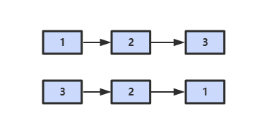
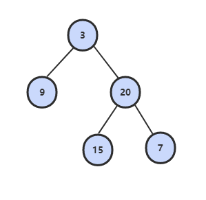
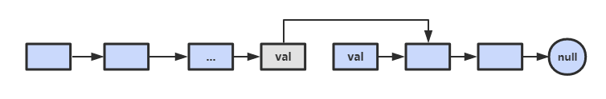
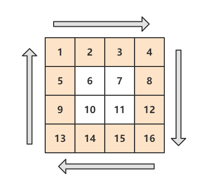
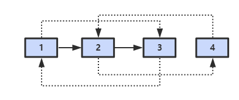

<!-- GFM-TOC -->
* [2. 实现 Singleton](#2-实现-singleton)
* [3. 数组中重复的数字](#3-数组中重复的数字)
* [4. 二维数组中的查找](#4-二维数组中的查找)
* [5. 替换空格](#5-替换空格)
* [6. 从尾到头打印链表](#6-从尾到头打印链表)
* [7. 重建二叉树](#7-重建二叉树)
* [8. 二叉树的下一个结点](#8-二叉树的下一个结点)
* [9. 用两个栈实现队列](#9-用两个栈实现队列)
* [10.1 斐波那契数列](#101-斐波那契数列)
* [10.2 跳台阶](#102-跳台阶)
* [10.3 变态跳台阶](#103-变态跳台阶)
* [10.4 矩形覆盖](#104-矩形覆盖)
* [11. 旋转数组的最小数字](#11-旋转数组的最小数字)
* [12. 矩阵中的路径](#12-矩阵中的路径)
* [13. 机器人的运动范围](#13-机器人的运动范围)
* [14. 剪绳子](#14-剪绳子)
* [15. 二进制中 1 的个数](#15-二进制中-1-的个数)
* [16. 数值的整数次方](#16-数值的整数次方)
* [17. 打印从 1 到最大的 n 位数](#17-打印从-1-到最大的-n-位数)
* [18.1 在 O(1) 时间内删除链表节点](#181-在-o1-时间内删除链表节点)
* [18.2 删除链表中重复的结点](#182-删除链表中重复的结点)
* [19. 正则表达式匹配](#19-正则表达式匹配)
* [20. 表示数值的字符串](#20-表示数值的字符串)
* [21. 调整数组顺序使奇数位于偶数前面](#21-调整数组顺序使奇数位于偶数前面)
* [22. 链表中倒数第 K 个结点](#22-链表中倒数第-k-个结点)
* [23. 链表中环的入口结点](#23-链表中环的入口结点)
* [24. 反转链表](#24-反转链表)
* [25. 合并两个排序的链表](#25-合并两个排序的链表)
* [26. 树的子结构](#26-树的子结构)
* [27. 二叉树的镜像](#27-二叉树的镜像)
* [28 对称的二叉树](#28-对称的二叉树)
* [29. 顺时针打印矩阵](#29-顺时针打印矩阵)
* [30. 包含 min 函数的栈](#30-包含-min-函数的栈)
* [31. 栈的压入、弹出序列](#31-栈的压入弹出序列)
* [32.1 从上往下打印二叉树](#321-从上往下打印二叉树)
* [32.2 把二叉树打印成多行](#322-把二叉树打印成多行)
* [32.3 按之字形顺序打印二叉树](#323-按之字形顺序打印二叉树)
* [33. 二叉搜索树的后序遍历序列](#33-二叉搜索树的后序遍历序列)
* [34. 二叉树中和为某一值的路径](#34-二叉树中和为某一值的路径)
* [35. 复杂链表的复制](#35-复杂链表的复制)
* [36. 二叉搜索树与双向链表](#36-二叉搜索树与双向链表)
* [37. 序列化二叉树](#37-序列化二叉树)
* [38. 字符串的排列](#38-字符串的排列)
* [39. 数组中出现次数超过一半的数字](#39-数组中出现次数超过一半的数字)
* [40. 最小的 K 个数](#40-最小的-k-个数)
* [41.1 数据流中的中位数](#411-数据流中的中位数)
* [41.2 字符流中第一个不重复的字符](#412-字符流中第一个不重复的字符)
* [42. 连续子数组的最大和](#42-连续子数组的最大和)
* [43. 从 1 到 n 整数中 1 出现的次数](#43-从-1-到-n-整数中-1-出现的次数)
* [44. 数字序列中的某一位数字](#44-数字序列中的某一位数字)
* [45. 把数组排成最小的数](#45-把数组排成最小的数)
* [46. 把数字翻译成字符串](#46-把数字翻译成字符串)
* [47. 礼物的最大价值](#47-礼物的最大价值)
* [48. 最长不含重复字符的子字符串](#48-最长不含重复字符的子字符串)
* [49. 丑数](#49-丑数)
* [50. 第一个只出现一次的字符位置](#50-第一个只出现一次的字符位置)
* [51. 数组中的逆序对](#51-数组中的逆序对)
* [52. 两个链表的第一个公共结点](#52-两个链表的第一个公共结点)
* [53 数字在排序数组中出现的次数](#53-数字在排序数组中出现的次数)
* [54. 二叉搜索树的第 K 个结点](#54-二叉搜索树的第-k-个结点)
* [55.1 二叉树的深度](#551-二叉树的深度)
* [55.2 平衡二叉树](#552-平衡二叉树)
* [56. 数组中只出现一次的数字](#56-数组中只出现一次的数字)
* [57.1 和为 S 的两个数字](#571-和为-s-的两个数字)
* [57.2 和为 S 的连续正数序列](#572-和为-s-的连续正数序列)
* [58.1 翻转单词顺序列](#581-翻转单词顺序列)
* [58.2 左旋转字符串](#582-左旋转字符串)
* [59. 滑动窗口的最大值](#59-滑动窗口的最大值)
* [60. n 个骰子的点数](#60-n-个骰子的点数)
* [61. 扑克牌顺子](#61-扑克牌顺子)
* [62. 圆圈中最后剩下的数](#62-圆圈中最后剩下的数)
* [63. 股票的最大利润](#63-股票的最大利润)
* [64. 求 1+2+3+...+n](#64-求-1+2+3++n)
* [65. 不用加减乘除做加法](#65-不用加减乘除做加法)
* [66. 构建乘积数组](#66-构建乘积数组)
* [67. 把字符串转换成整数](#67-把字符串转换成整数)
* [68. 树中两个节点的最低公共祖先](#68-树中两个节点的最低公共祖先)
* [参考文献](#参考文献)
<!-- GFM-TOC -->


# 2. 实现 Singleton

> [单例模式](https://github.com/CyC2018/Interview-Notebook/blob/master/notes/%E8%AE%BE%E8%AE%A1%E6%A8%A1%E5%BC%8F.md)

# 3. 数组中重复的数字

## 题目描述

在一个长度为 n 的数组里的所有数字都在 0 到 n-1 的范围内。数组中某些数字是重复的，但不知道有几个数字是重复的。也不知道每个数字重复几次。请找出数组中任意一个重复的数字。例如，如果输入长度为 7 的数组 {2, 3, 1, 0, 2, 5, 3}，那么对应的输出是第一个重复的数字 2。

要求复杂度为 O(N) + O(1)，时间复杂度 O(N)，空间复杂度 O(1)。因此不能使用排序的方法，也不能使用额外的标记数组。

## 解题思路

这种数组元素在 [0, n-1] 范围内的问题，可以将值为 i 的元素放到第 i 个位置上。

以 (2, 3, 1, 0, 2, 5) 为例：

```html
position-0 : (2,3,1,0,2,5) // 2 <-> 1
             (1,3,2,0,2,5) // 1 <-> 3
             (3,1,1,0,2,5) // 3 <-> 0
             (0,1,1,3,2,5) // already in position
position-1 : (0,1,1,3,2,5) // already in position
position-2 : (0,1,1,3,2,5) // nums[i] == nums[nums[i]], exit
```

遍历到位置 2 时，该位置上的数为 1，但是第 1 个位置上已经有一个 1 的值了，因此可以知道 1 重复。

复杂度：O(N) + O(1)

```java
public boolean duplicate(int[] nums, int length, int[] duplication) {
    if (nums == null || length <= 0) return false;
    for (int i = 0; i < length; i++) {
        while (nums[i] != i && nums[i] != nums[nums[i]]) {
            swap(nums, i, nums[i]);
        }
        if (nums[i] != i && nums[i] == nums[nums[i]]) {
            duplication[0] = nums[i];
            return true;
        }
    }
    return false;
}

private void swap(int[] nums, int i, int j) {
    int t = nums[i]; nums[i] = nums[j]; nums[j] = t;
}
```

# 4. 二维数组中的查找

## 题目描述

在一个二维数组中，每一行都按照从左到右递增的顺序排序，每一列都按照从上到下递增的顺序排序。请完成一个函数，输入这样的一个二维数组和一个整数，判断数组中是否含有该整数。

```html
Consider the following matrix:
[
  [1,   4,  7, 11, 15],
  [2,   5,  8, 12, 19],
  [3,   6,  9, 16, 22],
  [10, 13, 14, 17, 24],
  [18, 21, 23, 26, 30]
]

Given target = 5, return true.
Given target = 20, return false.
```

## 解题思路

从右上角开始查找。因为矩阵中的一个数，它左边的数都比它小，下边的数都比它大。因此，从右上角开始查找，就可以根据 target 和当前元素的大小关系来缩小查找区间。

复杂度：O(M+N) + O(1)

```java
public boolean Find(int target, int[][] matrix) {
    if (matrix == null || matrix.length == 0 || matrix[0].length == 0) return false;
    int m = matrix.length, n = matrix[0].length;
    int r = 0, c = n - 1; // 从右上角开始
    while (r <= m - 1 && c >= 0) {
        if (target == matrix[r][c]) return true;
        else if (target > matrix[r][c]) r++;
        else c--;
    }
    return false;
}
```

# 5. 替换空格

## 题目描述

请实现一个函数，将一个字符串中的空格替换成“%20”。例如，当字符串为 We Are Happy. 则经过替换之后的字符串为 We%20Are%20Happy。

## 解题思路

在字符串尾部填充任意字符，使得字符串的长度等于字符串替换之后的长度。因为一个空格要替换成三个字符（%20），因此当遍历到一个空格时，需要在尾部填充两个任意字符。

令 P1 指向字符串原来的末尾位置，P2 指向字符串现在的末尾位置。P1 和 P2 从后向前遍历，当 P1 遍历到一个空格时，就需要令 P2 指向的位置依次填充 02%（注意是逆序的），否则就填充上 P1 指向字符的值。

从后向前遍是为了在改变 P2 所指向的内容时，不会影响到 P1 遍历原来字符串的内容。

复杂度：O(N) + O(1)

```java
public String replaceSpace(StringBuffer str) {
    int oldLen = str.length();
    for (int i = 0; i < oldLen; i++) {
        if (str.charAt(i) == ' ') {
            str.append("  ");
        }
    }
    int idxOfOld = oldLen - 1;
    int idxOfNew = str.length() - 1;
    while (idxOfOld >= 0 && idxOfNew > idxOfOld) {
        char c = str.charAt(idxOfOld--);
        if (c == ' ') {
            str.setCharAt(idxOfNew--, '0');
            str.setCharAt(idxOfNew--, '2');
            str.setCharAt(idxOfNew--, '%');
        } else {
            str.setCharAt(idxOfNew--, c);
        }
    }
    return str.toString();
}
```

# 6. 从尾到头打印链表

## 题目描述

输入链表的第一个节点，从尾到头反过来打印出每个结点的值。

<div align="center">  </div><br>

## 解题思路

### 使用栈

```java
public ArrayList<Integer> printListFromTailToHead(ListNode listNode) {
    Stack<Integer> stack = new Stack<>();
    while (listNode != null) {
        stack.add(listNode.val);
        listNode = listNode.next;
    }
    ArrayList<Integer> ret = new ArrayList<>();
    while (!stack.isEmpty()) {
        ret.add(stack.pop());
    }
    return ret;
}
```

### 使用递归

```java
public ArrayList<Integer> printListFromTailToHead(ListNode listNode) {
    ArrayList<Integer> ret = new ArrayList<>();
    if(listNode != null) {
        ret.addAll(printListFromTailToHead(listNode.next));
        ret.add(listNode.val);
    }
    return ret;
}
```

### 使用 Collections.reverse()

```java
public ArrayList<Integer> printListFromTailToHead(ListNode listNode) {
    ArrayList<Integer> ret = new ArrayList<>();
    while (listNode != null) {
        ret.add(listNode.val);
        listNode = listNode.next;
    }
    Collections.reverse(ret);
    return ret;
}
```

### 使用头插法

利用链表头插法为逆序的特点。

头结点和第一个节点的区别：头结点是在头插法中使用的一个额外节点，这个节点不存储值；第一个节点就是链表的第一个真正存储值的节点。

```java
public ArrayList<Integer> printListFromTailToHead(ListNode listNode) {
    // 头插法构建逆序链表
    ListNode head = new ListNode(-1);
    while (listNode != null) {
        ListNode memo = listNode.next;
        listNode.next = head.next;
        head.next = listNode;
        listNode = memo;
    }
    // 构建 ArrayList
    ArrayList<Integer> ret = new ArrayList<>();
    head = head.next;
    while (head != null) {
        ret.add(head.val);
        head = head.next;
    }
    return ret;
}
```

# 7. 重建二叉树

## 题目描述

根据二叉树的前序遍历和中序遍历的结果，重建出该二叉树。

```html
preorder = [3,9,20,15,7]
inorder =  [9,3,15,20,7]
```

<div align="center">  </div><br>

## 解题思路

前序遍历的第一个值为根节点的值，使用这个值将中序遍历结果分成两部分，左部分为树的左子树中序遍历结果，右部分为树的右子树中序遍历的结果。

```java
private Map<Integer, Integer> inOrderNumsIdx = new HashMap<>(); // 缓存中序遍历数组的每个值对应的索引

public TreeNode reConstructBinaryTree(int[] pre, int[] in) {
    for (int i = 0; i < in.length; i++) {
        inOrderNumsIdx.put(in[i], i);
    }
    return reConstructBinaryTree(pre, 0, pre.length - 1, in, 0, in.length - 1);
}

private TreeNode reConstructBinaryTree(int[] pre, int preL, int preR, int[] in, int inL, int inR) {
    if (preL == preR) return new TreeNode(pre[preL]);
    if (preL > preR || inL > inR) return null;
    TreeNode root = new TreeNode(pre[preL]);
    int inIdx = inOrderNumsIdx.get(root.val);
    int leftTreeSize = inIdx - inL;
    root.left = reConstructBinaryTree(pre, preL + 1, preL + leftTreeSize, in, inL, inL + leftTreeSize - 1);
    root.right = reConstructBinaryTree(pre, preL + leftTreeSize + 1, preR, in, inL + leftTreeSize + 1, inR);
    return root;
}
```

# 8. 二叉树的下一个结点

## 题目描述

给定一个二叉树和其中的一个结点，请找出中序遍历顺序的下一个结点并且返回。注意，树中的结点不仅包含左右子结点，同时包含指向父结点的指针。

## 解题思路

① 如果一个节点有右子树不为空，那么该节点的下一个节点是右子树的最左节点；

<div align="center">  </div><br>

② 否则，向上找第一个左链接指向的树包含该节点的祖先节点。

<div align="center">  </div><br>

```java
public class TreeLinkNode {
    int val;
    TreeLinkNode left = null;
    TreeLinkNode right = null;
    TreeLinkNode next = null;

    TreeLinkNode(int val) {
        this.val = val;
    }
}
```

```java
public TreeLinkNode GetNext(TreeLinkNode pNode) {
    if (pNode.right != null) {
        TreeLinkNode node = pNode.right;
        while (node.left != null) node = node.left;
        return node;
    } else {
        while (pNode.next != null) {
            TreeLinkNode parent = pNode.next;
            if (parent.left == pNode) return parent;
            pNode = pNode.next;
        }
    }
    return null;
}
```

# 9. 用两个栈实现队列

## 解题思路

in 栈用来处理入栈（push）操作，out 栈用来处理出栈（pop）操作。一个元素进入 in 栈之后，出栈的顺序被反转。当元素要出栈时，需要先进入 out 栈，此时元素出栈顺序再一次被反转，因此出栈顺序就和最开始入栈顺序是相同的，此时先进入的元素先退出，这就是队列的顺序。

<div align="center">  </div><br>

```java
Stack<Integer> in = new Stack<Integer>();
Stack<Integer> out = new Stack<Integer>();

public void push(int node) {
    in.push(node);
}

public int pop() {
    if (out.isEmpty()) {
        while (!in.isEmpty()) {
            out.push(in.pop());
        }
    }
    return out.pop();
}
```

# 10.1 斐波那契数列

## 题目描述

以 O(1) 的时间复杂度求菲波那切数列。

<div align="center">1}\end{array}\right."/></div> <br>

## 解题思路

如果使用递归求解，那么会重复计算一些子问题。例如，求 f(10) 需要计算 f(9) 和 f(8)，计算 f(9) 需要计算 f(8) 和 f(7)，可以看到 f(8) 被重复计算了。

<div align="center">  </div><br>

递归方法是将一个问题划分成多个子问题求解，动态规划也是如此，但是动态规划会把子问题的解缓存起来，避免重复求解子问题。

```java
public class Solution {
    private int[] fib = new int[40];
    public Solution() {
        fib[1] = 1;
        fib[2] = 2;
        for(int i = 2; i < fib.length; i++) {
            fib[i] = fib[i - 1] + fib[i - 2];
        }
    }
    public int Fibonacci(int n) {
        return fib[n];
    }
}
```

# 10.2 跳台阶

## 题目描述

一只青蛙一次可以跳上 1 级台阶，也可以跳上 2 级。求该青蛙跳上一个 n 级的台阶总共有多少种跳法。

## 解题思路

```java
public int JumpFloor(int n) {
    if (n == 1) return 1;
    int[] dp = new int[n];
    dp[0] = 1;
    dp[1] = 2;
    for (int i = 2; i < n; i++) {
        dp[i] = dp[i - 1] + dp[i - 2];
    }
    return dp[n - 1];
}
```

# 10.3 变态跳台阶

## 题目描述

一只青蛙一次可以跳上 1 级台阶，也可以跳上 2 级……它也可以跳上 n 级。求该青蛙跳上一个 n 级的台阶总共有多少种跳法。

## 解题思路

```java
public int JumpFloorII(int n) {
    int[] dp = new int[n];
    Arrays.fill(dp, 1);
    for(int i = 1; i < n; i++) {
        for(int j = 0; j < i; j++) {
            dp[i] += dp[j];
        }
    }
    return dp[n - 1];
}
```

# 10.4 矩形覆盖

## 题目描述

我们可以用 2\*1 的小矩形横着或者竖着去覆盖更大的矩形。请问用 n 个 2\*1 的小矩形无重叠地覆盖一个 2\*n 的大矩形，总共有多少种方法？

## 解题思路

```java
public int RectCover(int n) {
    if (n < 2) return n;
    int[] dp = new int[n];
    dp[0] = 1;
    dp[1] = 2;
    for (int i = 2; i < n; i++) {
        dp[i] = dp[i - 1] + dp[i - 2];
    }
    return dp[n - 1];
}
```

# 11. 旋转数组的最小数字

## 题目描述

把一个数组最开始的若干个元素搬到数组的末尾，我们称之为数组的旋转。输入一个非递减排序的数组的一个旋转，输出旋转数组的最小元素。例如数组 {3, 4, 5, 1, 2} 为 {1, 2, 3, 4, 5} 的一个旋转，该数组的最小值为 1。NOTE：给出的所有元素都大于 0，若数组大小为 0，请返回 0。

## 解题思路

### 分治

复杂度：O(logN) + O(1)，其实空间复杂度不止 O(1)，因为分治使用了递归栈，用到了额外的空间，如果对空间有要求就不能用这种方法。

```java
public int minNumberInRotateArray(int[] nums) {
    return minNumberInRotateArray(nums, 0, nums.length - 1);
}

private int minNumberInRotateArray(int[] nums, int first, int last) {
    if (nums[first] < nums[last]) return nums[first];
    if (first == last) return nums[first];
    int mid = first + (last - first) / 2;
    return Math.min(minNumberInRotateArray(nums, first, mid), minNumberInRotateArray(nums, mid + 1, last));
}
```

### 二分查找

复杂度：O(logN) + O(1)

```java
public int minNumberInRotateArray(int[] nums) {
    if (nums.length == 0) return 0;
    int l = 0, h = nums.length - 1;
    while (nums[l] >= nums[h]) {
        if (h - l == 1) return nums[h];
        int mid = l + (h - l) / 2;
        if (nums[mid] >= nums[l]) l = mid;
        else h = mid;
    }
    return nums[l];
}
```

# 12. 矩阵中的路径

## 题目描述

请设计一个函数，用来判断在一个矩阵中是否存在一条包含某字符串所有字符的路径。路径可以从矩阵中的任意一个格子开始，每一步可以在矩阵中向左，向右，向上，向下移动一个格子。如果一条路径经过了矩阵中的某一个格子，则该路径不能再进入该格子。

例如下面的矩阵包含了一条 bfce 路径。

<div align="center">  </div><br>

## 解题思路

```java
private int[][] next = {{0, -1}, {0, 1}, {-1, 0}, {1, 0}};
private int rows;
private int cols;

public boolean hasPath(char[] array, int rows, int cols, char[] str) {
    if (rows == 0 || cols == 0) return false;
    this.rows = rows;
    this.cols = cols;
    boolean[][] hasUsed = new boolean[rows][cols];
    char[][] matrix = buildMatrix(array);
    for (int i = 0; i < rows; i++) {
        for (int j = 0; j < cols; j++) {
            if (backtracking(matrix, str, hasUsed, 0, i, j)) return true;
        }
    }
    return false;
}

private boolean backtracking(char[][] matrix, char[] str, boolean[][] hasUsed, int pathLen, int row, int col) {
    if (pathLen == str.length) return true;
    if (row < 0 || row >= rows || col < 0 || col >= cols) return false;
    if (matrix[row][col] != str[pathLen]) return false;
    if (hasUsed[row][col]) return false;
    hasUsed[row][col] = true;
    for (int i = 0; i < next.length; i++) {
        if (backtracking(matrix, str, hasUsed, pathLen + 1, row + next[i][0], col + next[i][1]))
            return true;
    }
    hasUsed[row][col] = false;
    return false;
}

private char[][] buildMatrix(char[] array) {
    char[][] matrix = new char[rows][cols];
    for (int i = 0, idx = 0; i < rows; i++) {
        for (int j = 0; j < cols; j++) {
            matrix[i][j] = array[idx++];
        }
    }
    return matrix;
}
```

# 13. 机器人的运动范围

## 题目描述

地上有一个 m 行和 n 列的方格。一个机器人从坐标 (0, 0) 的格子开始移动，每一次只能向左右上下四个方向移动一格，但是不能进入行坐标和列坐标的数位之和大于 k 的格子。例如，当 k 为 18 时，机器人能够进入方格（35, 37），因为 3+5+3+7=18。但是，它不能进入方格（35, 38），因为 3+5+3+8=19。请问该机器人能够达到多少个格子？

## 解题思路

```java
private int cnt = 0;
private int[][] next = {{0, -1}, {0, 1}, {-1, 0}, {1, 0}};
private int rows;
private int cols;
private int threshold;
private int[][] digitSum;

public int movingCount(int threshold, int rows, int cols) {
    this.rows = rows;
    this.cols = cols;
    this.threshold = threshold;
    initDigitSum();
    boolean[][] hasVisited = new boolean[rows][cols];
    dfs(hasVisited, 0, 0);
    return cnt;
}

private void dfs(boolean[][] hasVisited, int r, int c) {
    if (r < 0 || r >= this.rows || c < 0 || c >= this.cols) return;
    if (hasVisited[r][c]) return;
    hasVisited[r][c] = true;
    if (this.digitSum[r][c] > this.threshold) return;
    this.cnt++;
    for (int i = 0; i < this.next.length; i++) {
        dfs(hasVisited, r + next[i][0], c + next[i][1]);
    }
}

private void initDigitSum() {
    int[] digitSumOne = new int[Math.max(rows, cols)];
    for (int i = 0; i < digitSumOne.length; i++) {
        int n = i;
        while (n > 0) {
            digitSumOne[i] += n % 10;
            n /= 10;
        }
    }
    this.digitSum = new int[rows][cols];
    for (int i = 0; i < this.rows; i++) {
        for (int j = 0; j < this.cols; j++) {
            this.digitSum[i][j] = digitSumOne[i] + digitSumOne[j];
        }
    }
}
```

# 14. 剪绳子

## 题目描述

把一根绳子剪成多段，并且使得每段的长度乘积最大。

## 解题思路

### 动态规划解法

```java
public int maxProductAfterCutting(int n) {
    int[] dp = new int[n + 1];
    dp[1] = 1;
    for (int i = 2; i <= n; i++) {
        for (int j = 1; j < i; j++) {
            dp[i] = Math.max(dp[i], Math.max(j * (i - j), dp[j] * (i - j)));
        }
    }
    return dp[n];
}
```

### 贪心解法

尽可能多剪长度为 3 的绳子，并且不允许有长度为 1 的绳子出现，如果出现了，就从已经切好长度为 3 的绳子中拿出一段与长度为 1 的绳子重新组合，把它们切成两段长度为 2 的绳子。

证明：当 n >= 5 时，3(n - 3) - 2(n - 2) = n - 5 >= 0。因此把长度大于 5 的绳子切成两段，令其中一段长度为 3 可以使得两段的乘积最大。

```java
public int maxProductAfterCutting(int n) {
    if (n < 2) return 0;
    if (n == 2) return 1;
    if (n == 3) return 2;
    int timesOf3 = n / 3;
    if (n - timesOf3 * 3 == 1) timesOf3--;
    int timesOf2 = (n - timesOf3 * 3) / 2;
    return (int) (Math.pow(3, timesOf3)) * (int) (Math.pow(2, timesOf2));
}
```

# 15. 二进制中 1 的个数

## 题目描述

输入一个整数，输出该数二进制表示中 1 的个数。

### Integer.bitCount()

```java
public int NumberOf1(int n) {
    return Integer.bitCount(n);
}
```

### n&(n-1)

O(logM) 时间复杂度解法，其中 M 表示 1 的个数。

该位运算是去除 n 的位级表示中最低的那一位。

```
n       : 10110100
n-1     : 10110011
n&(n-1) : 10110000
```

```java
public int NumberOf1(int n) {
    int cnt = 0;
    while (n != 0) {
        cnt++;
        n &= (n - 1);
    }
    return cnt;
}
```

# 16. 数值的整数次方

## 题目描述

给定一个 double 类型的浮点数 base 和 int 类型的整数 exponent。求 base 的 exponent 次方。

## 解题思路

下面的讨论中 x 代表 base，n 代表 exponent。

<div align="center"></div> <br>

因为 (x\*x)<sup>n/2</sup> 可以通过递归求解，并且每递归一次，n 都减小一半，因此整个算法的时间复杂度为 O(logn)。

```java
public double Power(double base, int exponent) {
    if (exponent == 0) return 1;
    if (exponent == 1) return base;
    boolean isNegative = false;
    if (exponent < 0) {
        exponent = -exponent;
        isNegative = true;
    }
    double pow = Power(base * base, exponent / 2);
    if (exponent % 2 != 0) pow = pow * base;
    return isNegative ? (1 / pow) : pow;
}
```

# 17. 打印从 1 到最大的 n 位数

## 题目描述

输入数字 n，按顺序打印出从 1 最大的 n 位十进制数。比如输入 3，则打印出 1、2、3 一直到最大的 3 位数即 999。

## 解题思路

由于 n 可能会非常大，因此不能直接用 int 表示数字，而是用 char 数组进行存储。

使用回溯法得到所有的数。

```java
public void print1ToMaxOfNDigits(int n) {
    if (n < 0) return;
    char[] number = new char[n];
    print1ToMaxOfNDigits(number, -1);
}

private void print1ToMaxOfNDigits(char[] number, int digit) {
    if (digit == number.length - 1) {
        printNumber(number);
        return;
    }
    for (int i = 0; i < 10; i++) {
        number[digit + 1] = (char) (i + '0');
        print1ToMaxOfNDigits(number, digit + 1);
    }
}

private void printNumber(char[] number) {
    int index = 0;
    while (index < number.length && number[index] == '0') index++;
    while (index < number.length) System.out.print(number[index++]);
    System.out.println();
}
```

# 18.1 在 O(1) 时间内删除链表节点

## 解题思路

① 如果该节点不是尾节点，那么可以直接将下一个节点的值赋给该节点，令该节点指向下下个节点，然后删除下一个节点，时间复杂度为 O(1)。

<div align="center">  </div><br>

② 否则，就需要先遍历链表，找到节点的前一个节点，然后让前一个节点指向 null，时间复杂度为 O(N)。

<div align="center">  </div><br>

综上，如果进行 N 次操作，那么大约需要操作节点的次数为 N-1+N=2N-1，其中 N-1 表示 N-1 个不是尾节点的每个节点以 O(1) 的时间复杂度操作节点的总次数，N 表示 1 个尾节点以 O(N) 的时间复杂度操作节点的总次数。(2N-1)/N \~ 2，因此该算法的平均时间复杂度为 O(1)。

```java
public ListNode deleteNode(ListNode head, ListNode tobeDelete) {
    if (head == null || head.next == null || tobeDelete == null) return null;
    if (tobeDelete.next != null) {
        // 要删除的节点不是尾节点
        ListNode next = tobeDelete.next;
        tobeDelete.val = next.val;
        tobeDelete.next = next.next;
    } else {
        ListNode cur = head;
        while (cur.next != tobeDelete) cur = cur.next;
        cur.next = null;
    }
    return head;
}
```

# 18.2 删除链表中重复的结点

## 题目描述

<div align="center">  </div><br>

## 解题描述

```java
public ListNode deleteDuplication(ListNode pHead) {
    if (pHead == null) return null;
    ListNode next = pHead.next;
    if (next == null) return pHead;
    if (pHead.val == next.val) {
        while (next != null && pHead.val == next.val) next = next.next;
        return deleteDuplication(next);
    }
    pHead.next = deleteDuplication(pHead.next);
    return pHead;
}
```

# 19. 正则表达式匹配

## 题目描述

请实现一个函数用来匹配包括 '.' 和 '\*' 的正则表达式。模式中的字符 '.' 表示任意一个字符，而 '\*' 表示它前面的字符可以出现任意次（包含 0 次）。 在本题中，匹配是指字符串的所有字符匹配整个模式。例如，字符串 "aaa" 与模式 "a.a" 和 "ab\*ac\*a" 匹配，但是与 "aa.a" 和 "ab\*a" 均不匹配。

## 解题思路

应该注意到，'.' 是用来当做一个任意字符，而 '\*' 是用来重复前面的字符。这两个的作用不同，不能把 '.' 的作用和 '\*' 进行类比，从而把它当成重复前面字符一次。

```html
p.charAt(j) == s.charAt(i)  :  dp[i][j] = dp[i-1][j-1];
p.charAt(j) == '.'          :  dp[i][j] = dp[i-1][j-1];
p.charAt(j) == '*'          :
   p.charAt(j-1) != s.charAt(i) : dp[i][j] = dp[i][j-2]  //a* only counts as empty
   p.charAt(j-1) == s.charAt(i) or p.charAt(i-1) == '.':
            dp[i][j] = dp[i-1][j]   // a* counts as multiple a
         or dp[i][j] = dp[i][j-1]   // a* counts as single a
         or dp[i][j] = dp[i][j-2]   // a* counts as empty
```

```java
public boolean match(char[] str, char[] pattern) {
    int m = str.length, n = pattern.length;
    boolean[][] dp = new boolean[m + 1][n + 1];
    dp[0][0] = true;
    for (int i = 1; i <= n; i++) {
        if (pattern[i - 1] == '*') {
            dp[0][i] = dp[0][i - 2];
        }
    }
    for (int i = 1; i <= m; i++) {
        for (int j = 1; j <= n; j++) {
            if (str[i - 1] == pattern[j - 1] || pattern[j - 1] == '.') {
                dp[i][j] = dp[i - 1][j - 1];
            } else if (pattern[j - 1] == '*') {
                if (pattern[j - 2] == str[i - 1] || pattern[j - 2] == '.') {
                    dp[i][j] = dp[i][j - 1] || dp[i][j - 2] || dp[i - 1][j];
                } else {
                    dp[i][j] = dp[i][j - 2];
                }
            }
        }
    }
    return dp[m][n];
}
```

# 20. 表示数值的字符串

## 题目描述

请实现一个函数用来判断字符串是否表示数值（包括整数和小数）。例如，字符串 "+100","5e2","-123","3.1416" 和 "-1E-16" 都表示数值。 但是 "12e","1a3.14","1.2.3","+-5" 和 "12e+4.3" 都不是。

## 解题思路

```java
public boolean isNumeric(char[] str) {
    return new String(str).matches("[+-]?\\d*(\\.\\d+)?([eE][+-]?\\d+)?");
}
```

# 21. 调整数组顺序使奇数位于偶数前面

## 题目描述

保证奇数和奇数，偶数和偶数之间的相对位置不变，这和书本不太一样。

## 解题思路

复杂度：O(N<sup>2</sup>) + O(1)

```java
public void reOrderArray(int[] nums) {
    int n = nums.length;
    for (int i = 0; i < n; i++) {
        if (nums[i] % 2 == 0) {
            int nextOddIdx = i + 1;
            while (nextOddIdx < n && nums[nextOddIdx] % 2 == 0) nextOddIdx++;
            if (nextOddIdx == n) break;
            int nextOddVal = nums[nextOddIdx];
            for (int j = nextOddIdx; j > i; j--) {
                nums[j] = nums[j - 1];
            }
            nums[i] = nextOddVal;
        }
    }
}
```

复杂度：O(N) + O(N)

```java
public void reOrderArray(int[] nums) {
    int oddCnt = 0;
    for (int val : nums) if (val % 2 == 1) oddCnt++;
    int[] copy = nums.clone();
    int i = 0, j = oddCnt;
    for (int num : copy) {
        if (num % 2 == 1) nums[i++] = num;
        else nums[j++] = num;
    }
}
```

# 22. 链表中倒数第 K 个结点

## 解题思路

设链表的长度为 N。设两个指针 P1 和 P2，先让 P1 移动 K 个节点，则还有 N - K 个节点可以移动。此时让 P1 和 P2 同时移动，可以知道当 P1 移动到链表结尾时，P2 移动到 N - K 个节点处，该位置就是倒数第 K 个节点。

## 解题思路

<div align="center">  </div><br>

```java
public ListNode FindKthToTail(ListNode head, int k) {
    if (head == null) return null;
    ListNode P1, P2;
    P1 = P2 = head;
    while (P1 != null && k-- > 0) P1 = P1.next;
    if (k > 0) return null;
    while (P1 != null) {
        P1 = P1.next;
        P2 = P2.next;
    }
    return P2;
}
```

# 23. 链表中环的入口结点

## 解题思路

使用双指针，一个指针 fast 每次移动两个节点，一个指针 slow 每次移动一个节点。因为存在环，所以两个指针必定相遇在环中的某个节点上。此时 fast 移动的节点数为 x+2y+z，slow 为 x+y，由于 fast 速度比 slow 快一倍，因此 x+2y+z=2(x+y)，得到 x=z。

在相遇点，slow 要到环的入口点还需要移动 z 个节点，如果让 fast 重新从头开始移动，并且速度变为每次移动一个节点，那么它到环入口点还需要移动 x 个节点。在上面已经推导出 x=z，因此 fast 和 slow 将在环入口点相遇。

<div align="center">  </div><br>

```java
public ListNode EntryNodeOfLoop(ListNode pHead) {
    if (pHead == null) return null;
    ListNode slow = pHead, fast = pHead;
    while (fast != null && fast.next != null) {
        fast = fast.next.next;
        slow = slow.next;
        if (slow == fast) {
            fast = pHead;
            while (slow != fast) {
                slow = slow.next;
                fast = fast.next;
            }
            return slow;
        }
    }
    return null;
}
```

# 24. 反转链表

## 解题思路

### 递归

```java
public ListNode ReverseList(ListNode head) {
    if (head == null || head.next == null) return head;
    ListNode next = head.next;
    head.next = null;
    ListNode newHead = ReverseList(next);
    next.next = head;
    return newHead;
}
```

### 迭代

```java
public ListNode ReverseList(ListNode head) {
    ListNode newList = new ListNode(-1);
    while (head != null) {
        ListNode next = head.next;
        head.next = newList.next;
        newList.next = head;
        head = next;
    }
    return newList.next;
}
```

# 25. 合并两个排序的链表

## 题目描述

<div align="center">  </div><br>

## 解题思路

### 递归

```java
public ListNode Merge(ListNode list1, ListNode list2) {
    if (list1 == null) return list2;
    if (list2 == null) return list1;
    if (list1.val <= list2.val) {
        list1.next = Merge(list1.next, list2);
        return list1;
    } else {
        list2.next = Merge(list1, list2.next);
        return list2;
    }
}
```

### 迭代

```java
public ListNode Merge(ListNode list1, ListNode list2) {
    ListNode head = new ListNode(-1);
    ListNode cur = head;
    while (list1 != null && list2 != null) {
        if (list1.val < list2.val) {
            cur.next = list1;
            list1 = list1.next;
        } else {
            cur.next = list2;
            list2 = list2.next;
        }
        cur = cur.next;
    }
    if (list1 != null) cur.next = list1;
    if (list2 != null) cur.next = list2;
    return head.next;
}
```

# 26. 树的子结构

## 题目描述

<div align="center">  </div><br>

## 解题思路

```java
public boolean HasSubtree(TreeNode root1, TreeNode root2) {
    if (root1 == null || root2 == null) return false;
    return isSubtree(root1, root2) || HasSubtree(root1.left, root2) || HasSubtree(root1.right, root2);
}

private boolean isSubtree(TreeNode root1, TreeNode root2) {
    if (root1 == null && root2 == null) return true;
    if (root1 == null) return false;
    if (root2 == null) return true;
    if (root1.val != root2.val) return false;
    return isSubtree(root1.left, root2.left) && isSubtree(root1.right, root2.right);
}
```

# 27. 二叉树的镜像

## 题目描述

<div align="center">  </div><br>

## 解题思路

```java
public void Mirror(TreeNode root) {
    if (root == null) return;
    swap(root);
    Mirror(root.left);
    Mirror(root.right);
}

private void swap(TreeNode root) {
    TreeNode t = root.left;
    root.left = root.right;
    root.right = t;
}
```

# 28 对称的二叉树

## 题目描述

<div align="center">  </div><br>

## 解题思路

```java
boolean isSymmetrical(TreeNode pRoot) {
    if (pRoot == null) return true;
    return isSymmetrical(pRoot.left, pRoot.right);
}

boolean isSymmetrical(TreeNode t1, TreeNode t2) {
    if (t1 == null && t2 == null) return true;
    if (t1 == null || t2 == null) return false;
    if (t1.val != t2.val) return false;
    return isSymmetrical(t1.left, t2.right) && isSymmetrical(t1.right, t2.left);
}
```

# 29. 顺时针打印矩阵

## 题目描述

下图的矩阵顺时针打印结果为：1, 2, 3, 4, 8, 12, 16, 15, 14, 13, 9, 5, 6, 7, 11, 10

<div align="center">  </div><br>

## 解题思路

```java
public ArrayList<Integer> printMatrix(int[][] matrix) {
    ArrayList<Integer> ret = new ArrayList<>();
    int r1 = 0, r2 = matrix.length - 1, c1 = 0, c2 = matrix[0].length - 1;
    while (r1 <= r2 && c1 <= c2) {
        for (int i = c1; i <= c2; i++) ret.add(matrix[r1][i]);
        for (int i = r1 + 1; i <= r2; i++) ret.add(matrix[i][c2]);
        if (r1 != r2) for (int i = c2 - 1; i >= c1; i--) ret.add(matrix[r2][i]);
        if (c1 != c2) for (int i = r2 - 1; i > r1; i--) ret.add(matrix[i][c1]);
        r1++; r2--; c1++; c2--;
    }
    return ret;
}
```

# 30. 包含 min 函数的栈

## 题目描述

定义栈的数据结构，请在该类型中实现一个能够得到栈最小元素的 min 函数。

## 解题思路

```java
private Stack<Integer> stack = new Stack<>();
private Stack<Integer> minStack = new Stack<>();
private int min = Integer.MAX_VALUE;

public void push(int node) {
    stack.push(node);
    if (min > node) min = node;
    minStack.push(min);
}

public void pop() {
    stack.pop();
    minStack.pop();
    min = minStack.peek();
}

public int top() {
    return stack.peek();
}

public int min() {
    return minStack.peek();
}
```

# 31. 栈的压入、弹出序列

## 题目描述

输入两个整数序列，第一个序列表示栈的压入顺序，请判断第二个序列是否为该栈的弹出顺序。假设压入栈的所有数字均不相等。例如序列 1,2,3,4,5 是某栈的压入顺序，序列 4,5,3,2,1 是该压栈序列对应的一个弹出序列，但 4,3,5,1,2 就不可能是该压栈序列的弹出序列。

## 解题思路

使用一个栈来模拟压入弹出操作。

```java
public boolean IsPopOrder(int[] pushA, int[] popA) {
    int n = pushA.length;
    Stack<Integer> stack = new Stack<>();
    for (int pushIndex = 0, popIndex = 0; pushIndex < n; pushIndex++) {
        stack.push(pushA[pushIndex]);
        while (popIndex < n && stack.peek() == popA[popIndex]) {
            stack.pop();
            popIndex++;
        }
    }
    return stack.isEmpty();
}
```

# 32.1 从上往下打印二叉树

## 题目描述

从上往下打印出二叉树的每个节点，同层节点从左至右打印。

例如，以下二叉树层次遍历的结果为：1,2,3,4,5,6,7

<div align="center">  </div><br>

## 解题思路

使用队列来进行层次遍历。

不需要使用两个队列分别存储当前层的节点和下一层的节点，因为在开始遍历一层的节点时，当前队列中的节点数就是当前层的节点数，只要控制遍历这么多节点数，就能保证这次遍历的都是当前层的节点。

```java
public ArrayList<Integer> PrintFromTopToBottom(TreeNode root) {
    Queue<TreeNode> queue = new LinkedList<>();
    ArrayList<Integer> ret = new ArrayList<>();
    if (root == null) return ret;
    queue.add(root);
    while (!queue.isEmpty()) {
        int cnt = queue.size();
        for (int i = 0; i < cnt; i++) {
            TreeNode t = queue.poll();
            if (t.left != null) queue.add(t.left);
            if (t.right != null) queue.add(t.right);
            ret.add(t.val);
        }
    }
    return ret;
}
```

# 32.2 把二叉树打印成多行

## 题目描述

和上题几乎一样。

## 解题思路

```java
ArrayList<ArrayList<Integer>> Print(TreeNode pRoot) {
    ArrayList<ArrayList<Integer>> ret = new ArrayList<>();
    if (pRoot == null) return ret;
    Queue<TreeNode> queue = new LinkedList<>();
    queue.add(pRoot);
    while (!queue.isEmpty()) {
        int cnt = queue.size();
        ArrayList<Integer> list = new ArrayList<>();
        for (int i = 0; i < cnt; i++) {
            TreeNode node = queue.poll();
            list.add(node.val);
            if (node.left != null) queue.add(node.left);
            if (node.right != null) queue.add(node.right);
        }
        ret.add(list);
    }
    return ret;
}
```

# 32.3 按之字形顺序打印二叉树

## 题目描述

请实现一个函数按照之字形打印二叉树，即第一行按照从左到右的顺序打印，第二层按照从右至左的顺序打印，第三行按照从左到右的顺序打印，其他行以此类推。

## 解题思路

```java
public ArrayList<ArrayList<Integer>> Print(TreeNode pRoot) {
    ArrayList<ArrayList<Integer>> ret = new ArrayList<>();
    if (pRoot == null) return ret;
    Queue<TreeNode> queue = new LinkedList<>();
    queue.add(pRoot);
    boolean reverse = false;
    while (!queue.isEmpty()) {
        int cnt = queue.size();
        ArrayList<Integer> list = new ArrayList<>();
        for (int i = 0; i < cnt; i++) {
            TreeNode node = queue.poll();
            list.add(node.val);
            if (node.left != null) queue.add(node.left);
            if (node.right != null) queue.add(node.right);
        }
        if (reverse) Collections.reverse(list);
        reverse = !reverse;
        ret.add(list);
    }
    return ret;
}
```

# 33. 二叉搜索树的后序遍历序列

## 题目描述

输入一个整数数组，判断该数组是不是某二叉搜索树的后序遍历的结果。

例如，下图是后序遍历序列 3,1,2 所对应的二叉搜索树。

<div align="center">  </div><br>

## 解题思路

```java
public boolean VerifySquenceOfBST(int[] sequence) {
    if (sequence == null || sequence.length == 0) return false;
    return verify(sequence, 0, sequence.length - 1);
}

private boolean verify(int[] sequence, int first, int last) {
    if (last - first <= 1) return true;
    int rootVal = sequence[last];
    int cutIndex = first;
    while (cutIndex < last && sequence[cutIndex] <= rootVal) cutIndex++;
    for (int i = cutIndex + 1; i < last; i++) {
        if (sequence[i] < rootVal) return false;
    }
    return verify(sequence, first, cutIndex - 1) && verify(sequence, cutIndex, last - 1);
}
```

# 34. 二叉树中和为某一值的路径

## 题目描述

输入一颗二叉树和一个整数，打印出二叉树中结点值的和为输入整数的所有路径。路径定义为从树的根结点开始往下一直到叶结点所经过的结点形成一条路径。

下图的二叉树有两条和为 22 的路径：10, 5, 7 和 10, 12

<div align="center">  </div><br>

## 解题思路

```java
private ArrayList<ArrayList<Integer>> ret = new ArrayList<>();

public ArrayList<ArrayList<Integer>> FindPath(TreeNode root, int target) {
    dfs(root, target, new ArrayList<>());
    return ret;
}

private void dfs(TreeNode node, int target, ArrayList<Integer> path) {
    if (node == null) return;
    path.add(node.val);
    target -= node.val;
    if (target == 0 && node.left == null && node.right == null) {
        ret.add(new ArrayList(path));
    } else {
        dfs(node.left, target, path);
        dfs(node.right, target, path);
    }
    path.remove(path.size() - 1);
}
```

# 35. 复杂链表的复制

## 题目描述

输入一个复杂链表（每个节点中有节点值，以及两个指针，一个指向下一个节点，另一个特殊指针指向任意一个节点），返回结果为复制后复杂链表的 head。

<div align="center">  </div><br>

## 解题思路

第一步，在每个节点的后面插入复制的节点。

<div align="center">  </div><br>

第二步，对复制节点的 random 链接进行赋值。

<div align="center">  </div><br>

第三步，拆分。

<div align="center">  </div><br>

```java
public RandomListNode Clone(RandomListNode pHead) {
    if (pHead == null) {
        return null;
    }
    // 插入新节点
    RandomListNode cur = pHead;
    while (cur != null) {
        RandomListNode clone = new RandomListNode(cur.label);
        clone.next = cur.next;
        cur.next = clone;
        cur = clone.next;
    }
    // 建立 random 链接
    cur = pHead;
    while (cur != null) {
        RandomListNode clone = cur.next;
        if (cur.random != null) {
            clone.random = cur.random.next;
        }
        cur = clone.next;
    }
    // 拆分
    cur = pHead;
    RandomListNode pCloneHead = pHead.next;
    while (cur.next != null) {
        RandomListNode next = cur.next;
        cur.next = next.next;
        cur = next;
    }
    return pCloneHead;
}
```

# 36. 二叉搜索树与双向链表

## 题目描述

输入一棵二叉搜索树，将该二叉搜索树转换成一个排序的双向链表。要求不能创建任何新的结点，只能调整树中结点指针的指向。

<div align="center">  </div><br>

## 解题思路

```java
private TreeNode pre = null;
private TreeNode head = null;

public TreeNode Convert(TreeNode root) {
    if (root == null) return null;
    inOrder(root);
    return head;
}

private void inOrder(TreeNode node) {
    if (node == null) return;
    inOrder(node.left);
    node.left = pre;
    if (pre != null) pre.right = node;
    pre = node;
    if (head == null) head = node;
    inOrder(node.right);
}
```

# 37. 序列化二叉树

## 题目描述

请实现两个函数，分别用来序列化和反序列化二叉树。

## 解题思路

```java
public class Solution {

    private String deserializeStr;

    public String Serialize(TreeNode root) {
        if (root == null) return "#";
        return root.val + " " + Serialize(root.left) + " " + Serialize(root.right); 
    }

    public TreeNode Deserialize(String str) {
        deserializeStr = str;
        return Deserialize();
    }

    private TreeNode Deserialize() {
        if (deserializeStr.length() == 0) return null;
        int index = deserializeStr.indexOf(" ");
        String node = index == -1 ? deserializeStr : deserializeStr.substring(0, index);
        deserializeStr = index == -1 ? "" : deserializeStr.substring(index + 1);
        if (node.equals("#")) return null;
        int val = Integer.valueOf(node);
        TreeNode t = new TreeNode(val);
        t.left = Deserialize();
        t.right = Deserialize();
        return t;
    }
}
```

# 38. 字符串的排列

## 题目描述

输入一个字符串，按字典序打印出该字符串中字符的所有排列。例如输入字符串 abc，则打印出由字符 a, b, c 所能排列出来的所有字符串 abc, acb, bac, bca, cab 和 cba。

## 解题思路

```java
private ArrayList<String> ret = new ArrayList<>();

public ArrayList<String> Permutation(String str) {
    if (str.length() == 0) return ret;
    char[] chars = str.toCharArray();
    Arrays.sort(chars);
    backtracking(chars, new boolean[chars.length], new StringBuffer());
    return ret;
}

private void backtracking(char[] chars, boolean[] hasUsed, StringBuffer s) {
    if (s.length() == chars.length) {
        ret.add(s.toString());
        return;
    }
    for (int i = 0; i < chars.length; i++) {
        if (hasUsed[i]) continue;
        if (i != 0 && chars[i] == chars[i - 1] && !hasUsed[i - 1]) continue; // 保证不重复
        hasUsed[i] = true;
        s.append(chars[i]);
        backtracking(chars, hasUsed, s);
        s.deleteCharAt(s.length() - 1);
        hasUsed[i] = false;
    }
}
```

# 39. 数组中出现次数超过一半的数字

## 解题思路

多数投票问题，可以利用 Boyer-Moore Majority Vote Algorithm 来解决这个问题，使得时间复杂度为 O(N)。

使用 cnt 来统计一个元素出现的次数，当遍历到的元素和统计元素不相等时，令 cnt--。如果前面查找了 i 个元素，且 cnt == 0 ，说明前 i 个元素没有 majority，或者有 majority，但是出现的次数少于 i / 2 ，因为如果多于 i / 2 的话 cnt 就一定不会为 0 。此时剩下的 n - i 个元素中，majority 的数目依然多于 (n - i) / 2，因此继续查找就能找出 majority。

```java
public int MoreThanHalfNum_Solution(int[] nums) {
    int majority = nums[0];
    for (int i = 1, cnt = 1; i < nums.length; i++) {
        cnt = nums[i] == majority ? cnt + 1 : cnt - 1;
        if (cnt == 0) {
            majority = nums[i];
            cnt = 1;
        }
    }
    int cnt = 0;
    for (int val : nums) if (val == majority) cnt++;
    return cnt > nums.length / 2 ? majority : 0;
}
```

# 40. 最小的 K 个数

## 解题思路

### 快速选择

- 复杂度：O(N) + O(1)
- 只有当允许修改数组元素时才可以使用

快速排序的 partition() 方法，会返回一个整数 j 使得 a[l..j-1] 小于等于 a[j]，且 a[j+1..h] 大于等于 a[j]，此时 a[j] 就是数组的第 j 大元素。可以利用这个特性找出数组的第 K 个元素，这种找第 K 个元素的算法称为快速选择算法。

找到第 K 个元素之后，就可以再遍历一次数组，所有小于等于该元素的数组元素都是最小的 K 个数。

```java
public ArrayList<Integer> GetLeastNumbers_Solution(int[] nums, int k) {
    if (k > nums.length || k <= 0) return new ArrayList<>();
    int kthSmallest = findKthSmallest(nums, k - 1);
    ArrayList<Integer> ret = new ArrayList<>();
    for (int val : nums) {
        if (val <= kthSmallest && ret.size() < k) ret.add(val);
    }
    return ret;
}

public int findKthSmallest(int[] nums, int k) {
    int l = 0;
    int h = nums.length - 1;
    while (l < h) {
        int j = partition(nums, l, h);
        if (j < k) {
            l = j + 1;
        } else if (j > k) {
            h = j - 1;
        } else {
            break;
        }
    }
    return nums[k];
}

private int partition(int[] nums, int l, int h) {
    int i = l;
    int j = h + 1;
    while (true) {
        while (i < h && nums[++i] < nums[l]) ;
        while (j > l && nums[l] < nums[--j]) ;
        if (i >= j) {
            break;
        }
        swap(nums, i, j);
    }
    swap(nums, l, j);
    return j;
}

private void swap(int[] nums, int i, int j) {
    int t = nums[i];
    nums[i] = nums[j];
    nums[j] = t;
}
```

### 大小为 K 的最小堆

- 复杂度：O(NlogK) + O(K)
- 特别适合处理海量数据

应该使用大顶堆来维护最小堆，而不能直接创建一个小顶堆并设置一个大小，企图让小顶堆中的元素都是最小元素。

维护一个大小为 K 的最小堆过程如下：在添加一个元素之后，如果大顶堆的大小大于 K，那么需要将大顶堆的堆顶元素去除。

```java
public ArrayList<Integer> GetLeastNumbers_Solution(int[] nums, int k) {
    if (k > nums.length || k <= 0) return new ArrayList<>();
    PriorityQueue<Integer> maxHeap = new PriorityQueue<>((o1, o2) -> o2 - o1);
    for (int num : nums) {
        maxHeap.add(num);
        if (maxHeap.size() > k) {
            maxHeap.poll();
        }
    }
    ArrayList<Integer> ret = new ArrayList<>(maxHeap);
    return ret;
}
```

# 41.1 数据流中的中位数

## 题目描述

如何得到一个数据流中的中位数？如果从数据流中读出奇数个数值，那么中位数就是所有数值排序之后位于中间的数值。如果从数据流中读出偶数个数值，那么中位数就是所有数值排序之后中间两个数的平均值。

## 解题思路

```java
public class Solution {
    // 大顶堆，存储左半边元素
    private PriorityQueue<Integer> left = new PriorityQueue<>((o1, o2) -> o2 - o1);
    // 小顶堆，存储右半边元素，并且右半边元素都大于左半边
    private PriorityQueue<Integer> right = new PriorityQueue<>();
    // 当前数据流读入的元素个数
    private int N = 0;

    public void Insert(Integer val) {
        // 插入要保证两个堆存于平衡状态
        if (N % 2 == 0) {
            // N 为偶数的情况下插入到右半边。
            // 因为右半边元素都要大于左半边，但是新插入的元素不一定比左半边元素来的大，
            // 因此需要先将元素插入左半边，然后利用左半边为大顶堆的特点，取出堆顶元素即为最大元素，此时插入右半边
            left.add(val);
            right.add(left.poll());
        } else {
            right.add(val);
            left.add(right.poll());
        }
        N++;
    }

    public Double GetMedian() {
        if (N % 2 == 0) {
            return (left.peek() + right.peek()) / 2.0;
        } else {
            return (double) right.peek();
        }
    }
}
```

# 41.2 字符流中第一个不重复的字符

## 题目描述

请实现一个函数用来找出字符流中第一个只出现一次的字符。例如，当从字符流中只读出前两个字符 "go" 时，第一个只出现一次的字符是 "g"。当从该字符流中读出前六个字符“google" 时，第一个只出现一次的字符是 "l"。

## 解题思路

```java
public class Solution {
    private int[] cnts = new int[256];
    private Queue<Character> queue = new LinkedList<>();

    public void Insert(char ch) {
        cnts[ch]++;
        queue.add(ch);
        while (!queue.isEmpty() && cnts[queue.peek()] > 1) {
            queue.poll();
        }
    }

    public char FirstAppearingOnce() {
        if (queue.isEmpty()) return '#';
        return queue.peek();
    }
}
```

# 42. 连续子数组的最大和

## 题目描述

{6,-3,-2,7,-15,1,2,2}，连续子数组的最大和为 8（从第 0 个开始，到第 3 个为止）。

## 解题思路

```java
public int FindGreatestSumOfSubArray(int[] nums) {
    if (nums.length == 0) return 0;
    int ret = Integer.MIN_VALUE;
    int sum = 0;
    for (int val : nums) {
        if (sum <= 0) sum = val;
        else sum += val;
        ret = Math.max(ret, sum);
    }
    return ret;
}
```

# 43. 从 1 到 n 整数中 1 出现的次数

## 解题思路

> [Leetcode : 233. Number of Digit One](https://leetcode.com/problems/number-of-digit-one/discuss/64381/4+-lines-O(log-n)-C++JavaPython)

```java
public int NumberOf1Between1AndN_Solution(int n) {
    int cnt = 0;
    for (int m = 1; m <= n; m *= 10) {
        int a = n / m, b = n % m;
        cnt += (a + 8) / 10 * m + (a % 10 == 1 ? b + 1 : 0);
    }
    return cnt;
}
```

# 44. 数字序列中的某一位数字

## 题目描述

数字以 0123456789101112131415... 的格式序列化到一个字符串中，求这个字符串的第 index 位。

## 解题思路

```java
public int digitAtIndex(int index) {
    if (index < 0) return -1;
    int digit = 1;
    while (true) {
        int amount = getAmountOfDigit(digit);
        int totalAmount = amount * digit;
        if (index < totalAmount) {
            return digitAtIndex(index, digit);
        }
        index -= totalAmount;
        digit++;
    }
}

/**
 * digit 位数的数字组成的字符串长度
 * 例如 digit = 2，return 90
 */
private int getAmountOfDigit(int digit) {
    if (digit == 1) return 10;
    return (int) Math.pow(10, digit - 1) * 9;
}

/**
 * 在 digit 位数组成的字符串中，第 index 为的数
 */
private int digitAtIndex(int index, int digit) {
    int number = beginNumber(digit) + index / digit;
    int remain = index % digit;
    return (number + "").charAt(remain) - '0';
}

/**
 * digit 位数的起始数字
 * 例如 digit = 2 return 10
 */
private int beginNumber(int digit) {
    if (digit == 1) return 0;
    return (int) Math.pow(10, digit - 1);
}
```

# 45. 把数组排成最小的数

## 题目描述

输入一个正整数数组，把数组里所有数字拼接起来排成一个数，打印能拼接出的所有数字中最小的一个。例如输入数组 {3，32，321}，则打印出这三个数字能排成的最小数字为 321323。

## 解题思路

可以看成是一个排序问题，在比较两个字符串 S1 和 S2 的大小时，应该比较的是 S1+S2 和 S2+S1 的大小，如果 S1+S2 < S2+S1，那么应该把 S1 排在前面，否则应该把 S2 排在前面。

```java
public String PrintMinNumber(int[] numbers) {
    int n = numbers.length;
    String[] nums = new String[n];
    for (int i = 0; i < n; i++) nums[i] = numbers[i] + "";
    Arrays.sort(nums, (s1, s2) -> (s1 + s2).compareTo(s2 + s1));
    String ret = "";
    for (String str : nums) ret += str;
    return ret;
}
```

# 46. 把数字翻译成字符串

## 题目描述

给定一个数字，按照如下规则翻译成字符串：0 翻译成“a”，1 翻译成“b”... 25 翻译成“z”。一个数字有多种翻译可能，例如 12258 一共有 5 种，分别是 bccfi，bwfi，bczi，mcfi，mzi。实现一个函数，用来计算一个数字有多少种不同的翻译方法。

## 解题思路

```java
public int getTranslationCount(String number) {
    int n = number.length();
    int[] counts = new int[n + 1];
    counts[n - 1] = counts[n] = 1;
    for (int i = n - 2; i >= 0; i--) {
        counts[i] = counts[i + 1];
        int converted = Integer.valueOf(number.substring(i, i + 2));
        if (converted >= 10 && converted <= 25) {
            counts[i] += counts[i + 2];
        }
    }
    return counts[0];
}
```

# 47. 礼物的最大价值

## 题目描述

在一个 m\*n 的棋盘的每一个格都放有一个礼物，每个礼物都有一定价值（大于 0）。从左上角开始拿礼物，每次向右或向下移动一格，直到右下角结束。给定一个棋盘，求拿到礼物的最大价值。例如，对于如下棋盘

```
1    10   3    8
12   2    9    6
5    7    4    11
3    7    16   5
```

礼物的最大价值为 1+12+5+7+7+16+5=53。

## 解题思路

应该用动态规划求解，而不是深度优先搜索，深度优先搜索过于复杂，不是最优解。

```java
public int getMaxValue(int[][] values) {
    if (values == null || values.length == 0 || values[0].length == 0) return 0;
    int m = values.length;
    int n = values[0].length;
    int[] dp = new int[n];
    for (int i = 0; i < m; i++) {
        dp[0] += values[i][0];
        for (int j = 1; j < n; j++) {
            dp[j] = Math.max(dp[j], dp[j - 1]) + values[i][j];
        }
    }
    return dp[n - 1];
}
```

# 48. 最长不含重复字符的子字符串

## 题目描述

输入一个字符串（只包含 a\~z 的字符），求其最长不含重复字符的子字符串的长度。例如对于 arabcacfr，最长不含重复字符的子字符串为 acfr，长度为 4。

## 解题思路

```java
public int longestSubStringWithoutDuplication(String str) {
    int curLen = 0;
    int maxLen = 0;
    int[] indexs = new int[26];
    for (int i = 0; i < str.length(); i++) {
        int c = str.charAt(i) - 'a';
        int preIndex = indexs[c];
        if (preIndex == -1 || i - preIndex > curLen) curLen++;
        else {
            maxLen = Math.max(maxLen, curLen);
            curLen = i - preIndex;
        }
        indexs[c] = i;
    }
    maxLen = Math.max(maxLen, curLen);
    return maxLen;
}
```

# 49. 丑数

## 题目描述

把只包含因子 2、3 和 5 的数称作丑数（Ugly Number）。例如 6、8 都是丑数，但 14 不是，因为它包含因子 7。 习惯上我们把 1 当做是第一个丑数。求按从小到大的顺序的第 N 个丑数。

## 解题思路

```java
public int GetUglyNumber_Solution(int N) {
    if (N <= 6) return N;
    int i2 = 0, i3 = 0, i5 = 0;
    int cnt = 1;
    int[] dp = new int[N];
    dp[0] = 1;
    while (cnt < N) {
        int n2 = dp[i2] * 2, n3 = dp[i3] * 3, n5 = dp[i5] * 5;
        int min = Math.min(n2, Math.min(n3, n5));
        dp[cnt++] = min;
        if (min == n2) i2++;
        if (min == n3) i3++;
        if (min == n5) i5++;
    }
    return dp[N - 1];
}
```

# 50. 第一个只出现一次的字符位置

## 题目描述

在一个字符串 (1<=字符串长度 <=10000，全部由字母组成) 中找到第一个只出现一次的字符，并返回它的位置。

## 解题思路

最直观的解法是使用 HashMap 对出现次数进行统计，但是考虑到要统计的字符范围有限，因此可以使用整型数组代替 HashMap。

```java
public int FirstNotRepeatingChar(String str) {
    int[] cnts = new int[256];
    for (int i = 0; i < str.length(); i++) cnts[str.charAt(i)]++;
    for (int i = 0; i < str.length(); i++) if (cnts[str.charAt(i)] == 1) return i;
    return -1;
}
```

以上实现的空间复杂度还不是最优的。考虑到只需要找到只出现一次的字符，那么我们只需要统计的次数信息只有 0,1,更大，那么使用两个比特位就能存储这些信息。

```java
public int FirstNotRepeatingChar(String str) {
    BitSet bs1 = new BitSet(256);
    BitSet bs2 = new BitSet(256);
    for (char c : str.toCharArray()) {
        if (!bs1.get(c) && !bs2.get(c)) bs1.set(c);     // 0 0
        else if (bs1.get(c) && !bs2.get(c)) bs2.set(c); // 0 1
    }
    for (int i = 0; i < str.length(); i++) {
        char c = str.charAt(i);
        if (bs1.get(c) && !bs2.get(c)) return i;
    }
    return -1;
}
```

# 51. 数组中的逆序对

## 题目描述

在数组中的两个数字，如果前面一个数字大于后面的数字，则这两个数字组成一个逆序对。输入一个数组，求出这个数组中的逆序对的总数 P。

## 解题思路

```java
private long cnt = 0;
private int[] tmp; // 在这里创建辅助数组，而不是在 merge() 递归函数中创建

public int InversePairs(int[] nums) {
    tmp = new int[nums.length];
    mergeSortUp2Down(nums, 0, nums.length - 1);
    return (int) (cnt % 1000000007);
}

private void mergeSortUp2Down(int[] nums, int first, int last) {
    if (last - first < 1) return;
    int mid = first + (last - first) / 2;
    mergeSortUp2Down(nums, first, mid);
    mergeSortUp2Down(nums, mid + 1, last);
    merge(nums, first, mid, last);
}

private void merge(int[] nums, int first, int mid, int last) {
    int i = first, j = mid + 1, k = first;
    while (i <= mid || j <= last) {
        if (i > mid) tmp[k] = nums[j++];
        else if (j > last) tmp[k] = nums[i++];
        else if (nums[i] < nums[j]) tmp[k] = nums[i++];
        else {
            tmp[k] = nums[j++];
            this.cnt += mid - i + 1; // nums[i] > nums[j]，说明 nums[i...mid] 都大于 nums[j]
        }
        k++;
    }
    for (k = first; k <= last; k++) {
        nums[k] = tmp[k];
    }
}
```

# 52. 两个链表的第一个公共结点

## 题目描述

<div align="center">  </div><br>

## 解题思路

设 A 的长度为 a + c，B 的长度为 b + c，其中 c 为尾部公共部分长度，可知 a + c + b = b + c + a。

当访问 A 链表的指针访问到链表尾部时，令它从链表 B 的头部重新开始访问链表 B；同样地，当访问 B 链表的指针访问到链表尾部时，令它从链表 A 的头部重新开始访问链表 A。这样就能控制访问 A 和 B 两个链表的指针能同时访问到交点。

```java
public ListNode FindFirstCommonNode(ListNode pHead1, ListNode pHead2) {
    ListNode l1 = pHead1, l2 = pHead2;
    while (l1 != l2) {
        l1 = (l1 == null) ? pHead2 : l1.next;
        l2 = (l2 == null) ? pHead1 : l2.next;
    }
    return l1;
}
```

# 53 数字在排序数组中出现的次数

## 题目描述

```html
Input:
1, 2, 3, 3, 3, 3, 4, 6
3
Output:
4
```

## 解题思路

可以用二分查找找出数字在数组的最左端和最右端，找最左端和最右端在方法实现上的区别主要在于对 nums[m] == K 的处理：

- 找最左端令 h = m - 1
- 找最右端令 l = m + 1

```java
public int GetNumberOfK(int[] nums, int K) {
    int first = getFirstK(nums, K);
    int last = getLastK(nums, K);
    return first == -1 || last == -1 ? 0 : last - first + 1;
}

private int getFirstK(int[] nums, int K) {
    int l = 0, h = nums.length - 1;
    while (l <= h) {
        int m = l + (h - l) / 2;
        if (nums[m] >= K) h = m - 1;
        else l = m + 1;
    }
    if (l > nums.length - 1 || nums[l] != K) return -1;
    return l;
}

private int getLastK(int[] nums, int K) {
    int l = 0, h = nums.length - 1;
    while (l <= h) {
        int m = l + (h - l) / 2;
        if (nums[m] > K) h = m - 1;
        else l = m + 1;
    }
    if (h < 0 || nums[h] != K) return -1;
    return h;
}
```

# 54. 二叉搜索树的第 K 个结点

## 解题思路

利用二叉搜索数中序遍历有序的特点。

```java
private TreeNode ret;
private int cnt = 0;

public TreeNode KthNode(TreeNode pRoot, int k) {
    inOrder(pRoot, k);
    return ret;
}

private void inOrder(TreeNode root, int k) {
    if (root == null) return;
    if (cnt > k) return;
    inOrder(root.left, k);
    cnt++;
    if (cnt == k) ret = root;
    inOrder(root.right, k);
}
```

# 55.1 二叉树的深度

## 题目描述

从根结点到叶结点依次经过的结点（含根、叶结点）形成树的一条路径，最长路径的长度为树的深度。

<div align="center">  </div><br>

## 解题思路

```java
public int TreeDepth(TreeNode root) {
    if (root == null) return 0;
    return 1 + Math.max(TreeDepth(root.left), TreeDepth(root.right));
}
```

# 55.2 平衡二叉树

## 题目描述

平衡二叉树左右子树高度差不超过 1。

<div align="center">  </div><br>

## 解题思路

```java
private boolean isBalanced = true;

public boolean IsBalanced_Solution(TreeNode root) {
    height(root);
    return isBalanced;
}

private int height(TreeNode root) {
    if (root == null) return 0;
    int left = height(root.left);
    int right = height(root.right);
    if (Math.abs(left - right) > 1) isBalanced = false;
    return 1 + Math.max(left, right);
}
```


# 56. 数组中只出现一次的数字

## 题目描述

一个整型数组里除了两个数字之外，其他的数字都出现了两次，找出这两个数。

## 解题思路

两个不相等的元素在位级表示上必定会有一位存在不同。

将数组的所有元素异或得到的结果为不存在重复的两个元素异或的结果。

diff &= -diff 得到出 diff 最右侧不为 0 的位，也就是不存在重复的两个元素在位级表示上最右侧不同的那一位，利用这一位就可以将两个元素区分开来。

```java
public void FindNumsAppearOnce(int[] array, int num1[], int num2[]) {
    int diff = 0;
    for (int num : array) diff ^= num;
    // 得到最右一位
    diff &= -diff;
    for (int num : array) {
        if ((num & diff) == 0) num1[0] ^= num;
        else num2[0] ^= num;
    }
}
```

# 57.1 和为 S 的两个数字

## 题目描述

输入一个递增排序的数组和一个数字 S，在数组中查找两个数，使得他们的和正好是 S，如果有多对数字的和等于 S，输出两个数的乘积最小的。

## 解题思路

使用双指针，一个指针指向元素较小的值，一个指针指向元素较大的值。指向较小元素的指针从头向尾遍历，指向较大元素的指针从尾向头遍历。

如果两个指针指向元素的和 sum == target，那么得到要求的结果；如果 sum > target，移动较大的元素，使 sum 变小一些；如果 sum < target，移动较小的元素，使 sum 变大一些。

```java
public ArrayList<Integer> FindNumbersWithSum(int[] array, int sum) {
    int i = 0, j = array.length - 1;
    while (i < j) {
        int cur = array[i] + array[j];
        if (cur == sum) return new ArrayList<Integer>(Arrays.asList(array[i], array[j]));
        else if (cur < sum) i++;
        else j--;
    }
    return new ArrayList<Integer>();
}
```

# 57.2 和为 S 的连续正数序列

## 题目描述

和为 100 的连续序列有 18, 19, 20, 21, 22。

## 解题思路

```java
public ArrayList<ArrayList<Integer>> FindContinuousSequence(int sum) {
    ArrayList<ArrayList<Integer>> ret = new ArrayList<>();
    int first = 1, last = 2;
    int curSum = 3;
    while (first <= sum / 2 && last < sum) {
        if (curSum > sum) {
            curSum -= first;
            first++;
        } else if (curSum < sum) {
            last++;
            curSum += last;
        } else {
            ArrayList<Integer> list = new ArrayList<>();
            for (int i = first; i <= last; i++) {
                list.add(i);
            }
            ret.add(list);
            curSum -= first;
            first++;
            last++;
            curSum += last;
        }
    }
    return ret;
}
```

# 58.1 翻转单词顺序列

## 题目描述

输入："I am a student."

输出："student. a am I"

## 解题思路

题目应该有一个隐含条件，就是不能用额外的空间。虽然 Java 的题目输入参数为 String 类型，需要先创建一个字符数组使得空间复杂度为 O(n)，但是正确的参数类型应该和原书一样，为字符数组，并且只能使用该字符数组的空间。任何使用了额外空间的解法在面试时都会大打折扣，包括递归解法。正确的解法应该是和书上一样，先旋转每个单词，再旋转整个字符串。

```java
public String ReverseSentence(String str) {
    if (str.length() == 0) return str;
    int n = str.length();
    char[] chars = str.toCharArray();
    int i = 0, j = 0;
    while (j <= n) {
        if (j == n || chars[j] == ' ') {
            reverse(chars, i, j - 1);
            i = j + 1;
        }
        j++;
    }
    reverse(chars, 0, n - 1);
    return new String(chars);
}

private void reverse(char[] c, int i, int j) {
    while(i < j) {
        char t = c[i]; c[i] = c[j]; c[j] = t;
        i++; j--;
    }
}
```

# 58.2 左旋转字符串

## 题目描述

对于一个给定的字符序列 S，请你把其循环左移 K 位后的序列输出。例如，字符序列 S=”abcXYZdef”, 要求输出循环左移 3 位后的结果，即“XYZdefabc”。

## 解题思路

```java
public String LeftRotateString(String str, int n) {
    if(str.length() == 0) return "";
    char[] c = str.toCharArray();
    reverse(c, 0, n - 1);
    reverse(c, n, c.length - 1);
    reverse(c, 0, c.length - 1);
    return new String(c);
}

private void reverse(char[] c, int i, int j) {
    while(i < j) {
        char t = c[i]; c[i] = c[j]; c[j] = t;
        i++; j--;
    }
}
```

# 59. 滑动窗口的最大值

## 题目描述

给定一个数组和滑动窗口的大小，找出所有滑动窗口里数值的最大值。例如，如果输入数组 {2, 3, 4, 2, 6, 2, 5, 1} 及滑动窗口的大小 3，那么一共存在 6 个滑动窗口，他们的最大值分别为 {4, 4, 6, 6, 6, 5}。

## 解题思路

```java
public ArrayList<Integer> maxInWindows(int[] num, int size) {
    ArrayList<Integer> ret = new ArrayList<>();
    if (size > num.length || size < 1) return ret;
    // 构建最大堆，即堆顶元素是堆的最大值。
    PriorityQueue<Integer> heap = new PriorityQueue<Integer>((o1, o2) -> o2 - o1);
    for (int i = 0; i < size; i++) heap.add(num[i]);
    ret.add(heap.peek());
    for (int i = 1; i + size - 1 < num.length; i++) {
        heap.remove(num[i - 1]);
        heap.add(num[i + size - 1]);
        ret.add(heap.peek());
    }
    return ret;
}
```

# 60. n 个骰子的点数

## 题目描述

把 n 个骰子仍在地上，求点数和为 s 的概率。

## 解题思路

### 动态规划解法

空间复杂度：O(N<sup>2</sup>)

```java
private static int face = 6;

public double countProbability(int n, int s) {
    if (n < 1 || s < n) return 0.0;
    int pointNum = face * n;
    int[][] dp = new int[n][pointNum];
    for (int i = 0; i < face; i++) {
        dp[0][i] = 1;
    }
    for (int i = 1; i < n; i++) {
        for (int j = i; j < pointNum; j++) { // 使用 i 个骰子最小点数为 i
            for (int k = 1; k <= face; k++) {
                if (j - k >= 0) {
                    dp[i][j] += dp[i - 1][j - k];
                }
            }
        }
    }
    int totalNum = (int) Math.pow(6, n);
    return (double) dp[n - 1][s - 1] / totalNum;
}
```

### 动态规划解法 + 旋转数组

空间复杂度：O(N)

```java
private static int face = 6;

public double countProbability(int n, int s) {
    if (n < 1 || s < n) return 0.0;
    int pointNum = face * n;
    int[][] dp = new int[2][pointNum];
    for (int i = 0; i < face; i++) {
        dp[0][i] = 1;
    }
    int flag = 1;
    for (int i = 1; i < n; i++) {
        for (int j = i; j < pointNum; j++) { // 使用 i 个骰子最小点数为 i
            for (int k = 1; k <= face; k++) {
                if (j - k >= 0) {
                    dp[flag][j] += dp[1 - flag][j - k];
                }
            }
        }
        flag = 1 - flag;
    }
    int totalNum = (int) Math.pow(6, n);
    return (double) dp[flag][s - 1] / totalNum;
}
```

# 61. 扑克牌顺子

## 题目描述

五张牌，其中大小鬼为癞子，牌面大小为 0。判断是否能组成顺子。

## 解题思路

```java
public boolean isContinuous(int[] nums) {
    if (nums.length < 5) return false;
    Arrays.sort(nums);
    int cnt = 0;
    for (int num : nums) if (num == 0) cnt++;
    for (int i = cnt; i < nums.length - 1; i++) {
        if (nums[i + 1] == nums[i]) return false;
        int interval = nums[i + 1] - nums[i] - 1;
        if (interval > cnt) return false;
        cnt -= interval;
    }
    return true;
}
```

# 62. 圆圈中最后剩下的数

## 题目描述

让小朋友们围成一个大圈。然后，他随机指定一个数 m，让编号为 0 的小朋友开始报数。每次喊到 m-1 的那个小朋友要出列唱首歌，然后可以在礼品箱中任意的挑选礼物，并且不再回到圈中，从他的下一个小朋友开始，继续 0...m-1 报数 .... 这样下去 .... 直到剩下最后一个小朋友，可以不用表演。

## 解题思路

约瑟夫环，圆圈长度为 n 的解可以看成长度为 n-1 的解再加上报数的长度 m。因为是圆圈，所以最后需要对 n 取余。

```java
public int LastRemaining_Solution(int n, int m) {
    if (n == 0) return -1;
    if (n == 1) return 0;
    return (LastRemaining_Solution(n - 1, m) + m) % n;
}
```

# 63. 股票的最大利润

## 题目描述

可以有一次买入和一次卖出，买入必须在前。求最大收益。

## 解题思路

使用贪心策略，假设第 i 轮进行卖出操作，买入操作价格应该是 i 之前并且价格最低。

```java
public int maxProfit(int[] prices) {
    int n = prices.length;
    if(n == 0) return 0;
    int soFarMin = prices[0];
    int max = 0;
    for(int i = 1; i < n; i++) {
        if(soFarMin > prices[i]) soFarMin = prices[i];
        else max = Math.max(max, prices[i] - soFarMin);
    }
    return max;
}
```

# 64. 求 1+2+3+...+n

## 题目描述

求 1+2+3+...+n，要求不能使用乘除法、for、while、if、else、switch、case 等关键字及条件判断语句（A?B:C）。

## 解题思路

```java
public int Sum_Solution(int n) {
    int sum = n;
    boolean b = (n > 0) && ((sum += Sum_Solution(n - 1)) > 0);
    return sum;
}
```

# 65. 不用加减乘除做加法

## 解题思路

a ^ b 表示没有考虑进位的情况下两数的和，(a & b) << 1 就是进位。

递归会终止的原因是 (a & b) << 1 最右边会多一个 0，那么继续递归，进位最右边的 0 会慢慢增多，最后进位会变为 0，递归终止。

```java
public int Add(int num1, int num2) {
    if(num2 == 0) return num1;
    return Add(num1 ^ num2, (num1 & num2) << 1);
}
```

# 66. 构建乘积数组

## 题目描述

给定一个数组 A[0, 1,..., n-1], 请构建一个数组 B[0, 1,..., n-1], 其中 B 中的元素 B[i]=A[0]\*A[1]\*...\*A[i-1]\*A[i+1]\*...\*A[n-1]。不能使用除法。

## 解题思路

```java
public int[] multiply(int[] A) {
    int n = A.length;
    int[] B = new int[n];
    for (int i = 0, product = 1; i < n; product *= A[i], i++) {
        B[i] = product;
    }
    for (int i = n - 1, product = 1; i >= 0; product *= A[i], i--) {
        B[i] *= product;
    }
    return B;
}
```

# 67. 把字符串转换成整数

## 解题思路

```java
public int StrToInt(String str) {
    if (str.length() == 0) return 0;
    char[] chars = str.toCharArray();
    boolean isNegative = chars[0] == '-';
    int ret = 0;
    for (int i = 0; i < chars.length; i++) {
        if (i == 0 && (chars[i] == '+' || chars[i] == '-')) continue;
        if (chars[i] < '0' || chars[i] > '9') return 0; // 非法输入
        ret = ret * 10 + (chars[i] - '0');
    }
    return isNegative ? -ret : ret;
}
```

# 68. 树中两个节点的最低公共祖先

## 解题思路

### 二叉查找树

<div align="center">  </div><br>

二叉查找树中，两个节点 p, q 的公共祖先 root 满足 p.val <= root.val && root.val <= q.val，只要找到满足这个条件的最低层节点即可。换句话说，应该先考虑子树的解而不是根节点的解，二叉树的后序遍历操作满足这个特性。在本题中我们可以利用后序遍历的特性，先在左右子树中查找解，最后再考虑根节点的解。

```java
public TreeNode lowestCommonAncestor(TreeNode root, TreeNode p, TreeNode q) {
    if(root.val > p.val && root.val > q.val) return lowestCommonAncestor(root.left, p, q);
    if(root.val < p.val && root.val < q.val) return lowestCommonAncestor(root.right, p, q);
    return root;
}
```

### 普通二叉树

<div align="center">  </div><br>

在左右子树中查找两个节点的最低公共祖先，如果在其中一颗子树中查找到，那么就返回这个解，否则可以认为根节点就是最低公共祖先。

```java
public TreeNode lowestCommonAncestor(TreeNode root, TreeNode p, TreeNode q) {
    if (root == null || root == p || root == q) return root;
    TreeNode left = lowestCommonAncestor(root.left, p, q);
    TreeNode right = lowestCommonAncestor(root.right, p, q);
    return left == null ? right : right == null ? left : root;
}
```

# 参考文献

- 何海涛. 剑指 Offer[M]. 电子工业出版社, 2012.
