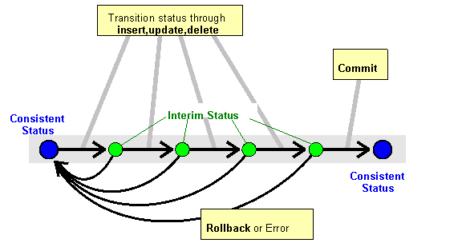
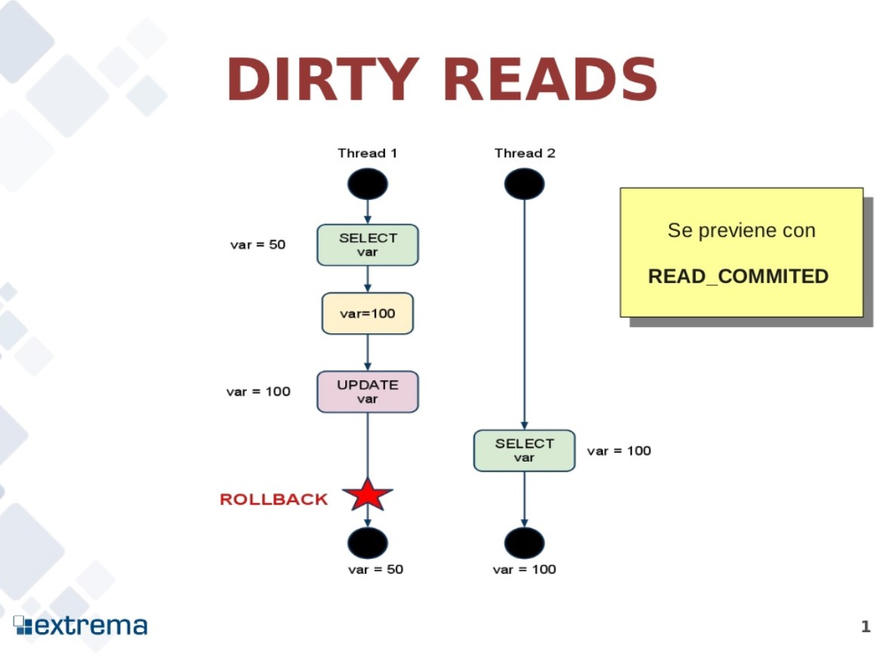
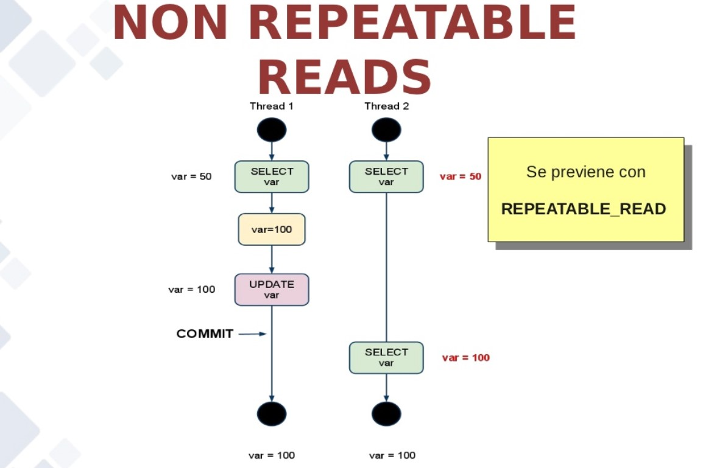
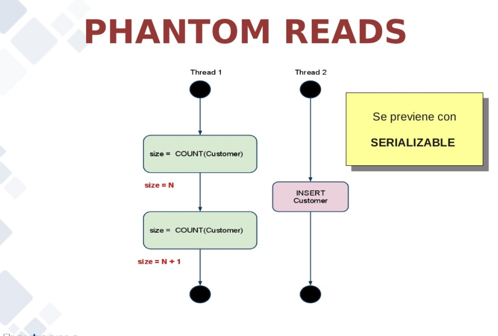
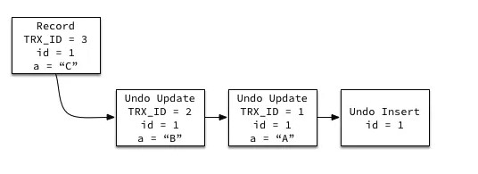
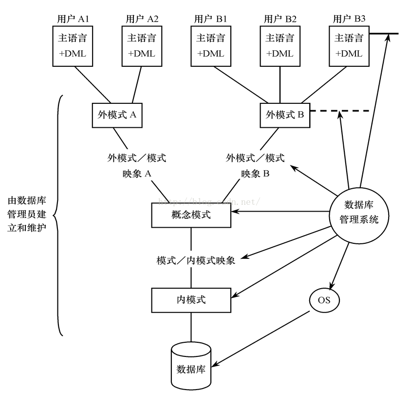
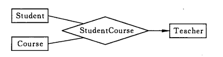

<!-- GFM-TOC -->
* [一、事务](#一事务)
    * [概念](#概念)
    * [四大特性](#四大特性)
* [二、并发一致性问题](#二并发一致性问题)
    * [问题](#问题)
    * [解决方法](#解决方法)
* [三、封锁](#三封锁)
    * [封锁粒度](#封锁粒度)
    * [封锁类型](#封锁类型)
    * [封锁协议](#封锁协议)
* [四、隔离级别](#四隔离级别)
* [五、多版本并发控制](#五多版本并发控制)
    * [版本号](#版本号)
    * [Undo 日志](#undo-日志)
    * [实现过程](#实现过程)
* [六、Next-Key Locks](#六next-key-locks)
    * [Record Locks](#record-locks)
    * [Grap Locks](#grap-locks)
    * [Next-Key Locks](#next-key-locks)
* [七、关系数据库设计理论](#七关系数据库设计理论)
    * [函数依赖](#函数依赖)
    * [异常](#异常)
    * [范式](#范式)
* [八、数据库系统概述](#八数据库系统概述)
    * [基本术语](#基本术语)
    * [数据库的三层模式和两层映像](#数据库的三层模式和两层映像)
* [九、关系数据库建模](#九关系数据库建模)
    * [ER 图](#er-图)
    * [十、约束](#十约束)
* [参考资料](#参考资料)
<!-- GFM-TOC -->


# 一、事务

## 概念

<div align="center">  </div><br>

事务指的是满足 ACID 特性的一系列操作。在数据库中，可以通过 Commit 提交一个事务，也可以使用 Rollback 进行回滚。

## 四大特性

<div align="center">  </div><br>

### 1. 原子性（Atomicity）

事务被视为不可分割的最小单元，要么全部提交成功，要么全部失败回滚。

### 2. 一致性（Consistency）

事务执行前后都保持一致性状态。在一致性状态下，所有事务对一个数据的读取结果都是相同的。

### 3. 隔离性（Isolation）

一个事务所做的修改在最终提交以前，对其它事务是不可见的。

### 4. 持久性（Durability）

一旦事务提交，则其所做的修改将会永远保存到数据库中。即使系统发生崩溃，事务执行的结果也不能丢失。可以通过数据库备份和恢复来保证持久性。

# 二、并发一致性问题

在并发环境下，一个事务如果受到另一个事务的影响，那么事务操作就无法满足一致性条件。

## 问题

### 1. 丢失修改

T<sub>1</sub> 和 T<sub>2</sub> 两个事务都对一个数据进行修改，T<sub>1</sub> 先修改，T<sub>2</sub> 随后修改，T<sub>2</sub> 的修改覆盖了 T<sub>1</sub> 的修改。

### 2. 读脏数据

T<sub>1</sub> 修改一个数据，T<sub>2</sub> 随后读取这个数据。如果 T<sub>1</sub> 撤销了这次修改，那么 T<sub>2</sub> 读取的数据是脏数据。

<div align="center">  </div><br>

### 3. 不可重复读

T<sub>2</sub> 读取一个数据，T<sub>1</sub> 对该数据做了修改。如果 T<sub>2</sub> 再次读取这个数据，此时读取的结果和和第一次读取的结果不同。

<div align="center">  </div><br>

### 4. 幻影读

T<sub>1</sub> 读取某个范围的数据，T<sub>2</sub> 在这个范围内插入新的数据，T<sub>1</sub> 再次读取这个范围的数据，此时读取的结果和和第一次读取的结果不同。

<div align="center">  </div><br>

## 解决方法

产生并发不一致性问题主要原因是破坏了事务的隔离性，解决方法是通过并发控制来保证隔离性。

在没有并发的情况下，事务以串行的方式执行，互不干扰，因此可以保证隔离性。在并发的情况下，如果能通过并发控制，让事务的执行结果和某一个串行执行的结果相同，就认为事务的执行结果满足隔离性要求，也就是说是正确的。把这种事务执行方式称为  **可串行化调度** 。

**并发控制可以通过封锁来实现，但是封锁操作都要用户自己控制，相当复杂。数据库管理系统提供了事务的隔离级别，让用户以一种更轻松的方式处理并发一致性问题。** 

# 三、封锁

## 封锁粒度

<div align="center">  </div><br>

应该尽量只锁定需要修改的那部分数据，而不是所有的资源。锁定的数据量越少，发生锁争用的可能就越小，系统的并发程度就越高。

但是加锁需要消耗资源，锁的各种操作，包括获取锁，检查锁是否已经解除、释放锁，都会增加系统开销。因此封锁粒度越小，系统开销就越大。需要在锁开销以及数据安全性之间做一个权衡。

MySQL 中提供了两种封锁粒度：行级锁以及表级锁。

## 封锁类型

### 1. 排它锁与共享锁

- 排它锁（Exclusive），简写为 X 锁，又称写锁。
- 共享锁（Shared），简写为 S 锁，又称读锁。

有以下两个规定：

1. 一个事务对数据对象 A 加了 X 锁，就可以对 A 进行读取和更新。加锁期间其它事务不能对 A 加任何锁。
2. 一个事务对数据对象 A 加了 S 锁，可以对 A 进行读取操作，但是不能进行更新操作。加锁期间其它事务能对 A 加 S 锁，但是不能加 X 锁。

锁的兼容关系如下：

| - | X | S |
| :--: | :--: | :--: |
|X|Yes|No|
|S|No|No|

### 2. 意向锁

意向锁（Intention Locks）可以支持多粒度封锁。它本身是一个表锁，通过在原来的 X/S 锁之上引入了 IX/IS，用来表示一个事务想要在某个数据行上加 X 锁或 S 锁。

有以下两个规定：

1. 一个事务在获得某个数据行对象的 S 锁之前，必须先获得 IS 锁或者更强的锁；
2. 一个事务在获得某个数据行对象的 X 锁之前，必须先获得 IX 锁。

各种锁的兼容关系如下：

| - | X | IX | S | IS |
| :--: | :--: | :--: | :--: | :--: |
|X    |No    |No |No | No|
|IX    |No    |YES|No | Yes|
|S    |No    |No    |Yes| Yes|
|IS    |No    |Yes|Yes| Yes|

## 封锁协议

### 1. 三级封锁协议

**一级封锁协议** 

事务 T 要修改数据 A 时必须加 X 锁，直到事务结束才释放锁。

可以解决丢失修改问题，因为不能同时有两个事务对同一个数据进行修改，那么一个事务的修改就不会被覆盖。

| T<sub>1</sub> | T<sub>1</sub> |
| :--: | :--: |
| lock-x(A) | |
| read A=20 | |
| | lock-x(A) |
|  | wait |
| write A=19 | |
| commit | |
| unlock-x(A) | |
| | obtain |
| | read A=19 |
| | write A=21 |
| | commit |
| | unlock-x(A)|

**二级封锁协议** 

在一级的基础上，要求读取数据 A 时必须加 S 锁，读取完马上释放 S 锁。

可以解决读脏数据问题，因为如果一个事务在对数据 A 进行修改，根据 1 级封锁协议，会加 X 锁，那么就不能再加 S 锁了，也就是不会读入数据。

| T<sub>1</sub> | T<sub>1</sub> |
| :--: | :--: |
| lock-x(A) | |
| read A=20 | |
| write A=19 | |
| | lock-s(A) |
|  | wait |
| rollback | |
| A=20 | |
| unlock-x(A) | |
| | obtain |
| | read A=20 |
| | commit |
| | unlock-s(A)|

**三级封锁协议** 

在二级的基础上，要求读取数据 A 时必须加 S 锁，直到事务结束了才能释放 S 锁。

可以解决不可重复读的问题，因为读 A 时，其它事务不能对 A 加 X 锁，从而避免了在读的期间数据发生改变。

| T<sub>1</sub> | T<sub>1</sub> |
| :--: | :--: |
| lock-s(A) | |
| read A=20 | |
|  |lock-x(A) |
| | wait |
|  read A=20|  |
| commit | |
| unlock-s(A) | |
| | obtain |
| | read A=20 |
| | write A=19|
| | commit |
| | unlock-X(A)|

### 2. 两段锁协议

加锁和解锁分为两个阶段进行，事务 T 对数据 A 进行读或者写操作之前，必须先获得对 A 的封锁，并且在释放一个封锁之前，T 不能再获得任何的其它锁。

事务遵循两段锁协议是保证并发操作可串行化调度的充分条件。例如以下操作满足两段锁协议，它是可串行化调度。

```html
lock-x(A)...lock-s(B)...lock-s(c)...unlock(A)...unlock(C)...unlock(B)
```

但不是必要条件，例如以下操作不满足两段锁协议，但是它还是可串行化调度。

```html
lock-x(A)...unlock(A)...lock-s(B)...unlock(B)...lock-s(c)...unlock(C)...
```

# 四、隔离级别

<font size=4>  **1. 未提交读（READ UNCOMMITTED）** </font> </br>

事务中的修改，即使没有提交，对其它事务也是可见的。

<font size=4>  **2. 提交读（READ COMMITTED）** </font> </br>

一个事务只能读取已经提交的事务所做的修改。换句话说，一个事务所做的修改在提交之前对其它事务是不可见的。

<font size=4>  **3. 可重复读（REPEATABLE READ）** </font> </br>

保证在同一个事务中多次读取同样数据的结果是一样的。

<font size=4>  **4. 可串行化（SERIALIXABLE）** </font> </br>

强制事务串行执行。

<font size=4>  **四个隔离级别的对比** </font> </br>

| 隔离级别 | 脏读 | 不可重复读 | 幻影读 |
| :---: | :---: | :---:| :---: |
| 未提交读 | YES | YES | YES |
| 提交读 | NO | YES | YES |
| 可重复读 | NO | NO | YES |
| 可串行化 | NO | NO | NO |

# 五、多版本并发控制

（Multi-Version Concurrency Control, MVCC）是 MySQL 的 InnoDB 存储引擎实现隔离级别的一种具体方式，它的基本思想是通过保存每个数据行的多个版本，一个事务对数据行做修改时，其它事务可以读取之前的一个版本，并且都是读取相同的版本，从而保证多个事务对同一个数据行读取的结果是一致的。

InnoDB 的 MVCC 在读取和修改数据行时无需加锁，这属于乐观锁的一种实现。正因为无需加锁，因此性能上也会更好。

InnoDB 的 MVCC 可以用于实现提交读和可重复读这两种隔离级别。而对于未提交读隔离级别，它总是读取最新的数据行，无需使用 MVCC；可串行化隔离级别需要对所有读取的行都加锁，单纯使用 MVCC 无法实现。

## 版本号

- 系统版本号：是一个递增的数字，每开始一个新的事务，系统版本号就会自动递增。
- 事务版本号：事务开始时的系统版本号。

InooDB 的 MVCC 在每行记录后面都保存着两个隐藏的列，用来存储两个版本号：

- 创建版本号：指示创建一个数据行的快照时的系统版本号；
- 删除版本号：如果该快照的删除版本号大于当前事务版本号表示该快照有效，否则表示该快照已经被删除了。

## Undo 日志

InnoDB 的 MVCC 使用到的快照存储在 Undo 日志中，该日志通过回滚指针把一个数据行（Record）的所有快照连接起来。

<div align="center">  </div><br>

## 实现过程

### 1. SELECT

该操作必须保证多个事务读取到同一个数据行的快照。但是也有例外，如果有一个事务正在修改该数据行，那么它可以读取事务本身所做的修改，而不用和其它事务的读取结果一致。

当开始新一个事务时，该事务的版本号肯定会大于所有数据行快照的创建版本号，理解这一点很关键。

把没对一个数据行做修改的事务称为 T<sub>1</sub>，T<sub>1</sub> 所要读取的数据行快照的创建版本号必须小于当前事务的版本号，因为如果大于或者等于当前事务的版本号，那么表示该数据行快照是其它事务的最新修改，因此不能去读取它。

除了上面的要求，T<sub>1</sub> 所要读取的数据行快照的删除版本号必须小于当前事务版本号，因为如果大于或者等于当前事务版本号，那么表示该数据行快照是已经被删除的，不应该去读取它。

### 2. INSERT

将系统版本号作为数据行快照的创建版本号。

### 3. DELETE

将系统版本号作为数据行快照的删除版本号。

### 4. UPDATE

将系统版本号作为更新后的数据行快照的创建版本号，同时将系统版本号作为作为更新前的数据行快照的删除版本号。可以理解为新执行 DELETE 后执行 INSERT。

# 六、Next-Key Locks

以下内容都是针对 MySQL 的 InnoDB 存储引擎来讨论的。

MVCC 不能解决幻读问题，Next-Key Locks 就是为了解决这个问题而存在的。在可重复读隔离级别下使用 Next-Key Locks，就可以防止幻读的出现。

## Record Locks

锁定的对象时索引，而不是数据。如果表没有设置索引，InnoDB 会自动在主键上创建隐藏的聚集索引，因此 Record Lock 依然可以使用。

## Grap Locks

锁定一个范围内的索引，例如当一个事务执行以下语句，其它事务就不能在 t.c1 中插入 15。

```sql
SELECT c1 FROM t WHERE c1 BETWEEN 10 and 20 FOR UPDATE;
```

## Next-Key Locks

它是 Record Locks 和 Gap Locks 的结合。在 user 中有以下记录：

```sql
|   id | last_name   | first_name   |   age |
|------|-------------|--------------|-------|
|    4 | stark       | tony         |    21 |
|    1 | tom         | hiddleston   |    30 |
|    3 | morgan      | freeman      |    40 |
|    5 | jeff        | dean         |    50 |
|    2 | donald      | trump        |    80 |
+------|-------------|--------------|-------+
```

那么就需要锁定以下范围：

```sql
(-∞, 21]
(21, 30]
(30, 40]
(40, 50]
(50, 80]
(80, ∞)
```

# 七、关系数据库设计理论

## 函数依赖

记 A->B 表示 A 函数决定 B，也可以说 B 函数依赖于 A。

如果 {A1，A2，... ，An} 是关系的一个或多个属性的集合，该集合决定了关系的其它所有属性并且是最小的，那么该集合就称为键码。

对于 W->A，如果能找到 W 的真子集 W'，使得 W'-> A，那么 W->A 就是部分函数依赖，否则就是完全函数依赖；

## 异常

以下的学生课程关系的函数依赖为 Sno, Cname -> Sname, Sdept, Mname, Grade，键码为 {Sno, Cname}。也就是说，确定学生和课程之后，就能确定其它信息。

| Sno | Sname | Sdept | Mname | Cname | Grade |
| :---: | :---: | :---: | :---: | :---: |:---:|
| 1 | 学生-1 | 学院-1 | 院长-1 | 课程-1 | 90 |
| 2 | 学生-2 | 学院-2 | 院长-2 | 课程-2 | 80 |
| 2 | 学生-2 | 学院-2 | 院长-2 | 课程-1 | 100 |

不符合范式的关系，会产生很多异常，主要有以下四种异常：

1. 冗余数据，例如学生-2 出现了两次。
2. 修改异常，修改了一个记录中的信息，但是另一个记录中相同的信息却没有被修改。
3. 删除异常，删除一个信息，那么也会丢失其它信息。例如如果删除了课程-1，需要删除第二行和第三行，那么学生-1 的信息就会丢失。
4. 插入异常，例如想要插入一个学生的信息，如果这个学生还没选课，那么就无法插入。

## 范式

范式理论是为了解决以上提到四种异常。高级别范式的依赖于低级别的范式。

<div align="center">  </div><br>

### 1. 第一范式 (1NF)

属性不可分；

### 2. 第二范式 (2NF)

每个非主属性完全函数依赖于键码。

可以通过分解来满足。

<font size=4> **分解前** </font><br>

| Sno | Sname | Sdept | Mname | Cname | Grade |
| :---: | :---: | :---: | :---: | :---: |:---:|
| 1 | 学生-1 | 学院-1 | 院长-1 | 课程-1 | 90 |
| 2 | 学生-2 | 学院-2 | 院长-2 | 课程-2 | 80 |
| 2 | 学生-2 | 学院-2 | 院长-2 | 课程-1 | 100 |

以上学生课程关系中，{Sno, Cname} 为键码，有如下函数依赖：

- Sno, Cname -> Sname, Sdept, Mname
- Son -> Sname, Sdept
- Sdept -> Mname
- Sno -> Manme
- Sno, Cname-> Grade

Grade 完全函数依赖于键码，它没有任何冗余数据，每个学生的每门课都有特定的成绩。

Sname, Sdept 和 Manme 都函数依赖于 Sno，而部分依赖于键码。当一个学生选修了多门课时，这些数据就会出现多次，造成大量冗余数据。

<font size=4> **分解后** </font><br>

关系-1

| Sno | Sname | Sdept | Mname |
| :---: | :---: | :---: | :---: |
| 1 | 学生-1 | 学院-1 | 院长-1 |
| 2 | 学生-2 | 学院-2 | 院长-2 |

有以下函数依赖：

- Sno -> Sname, Sdept, Mname
- Sdept -> Mname

关系-2

| Sno | Cname | Grade |
| :---: | :---: |:---:|
| 1 | 课程-1 | 90 |
| 2 | 课程-2 | 80 |
| 2 | 课程-1 | 100 |

有以下函数依赖：

- Sno, Cname ->  Grade

### 3. 第三范式 (3NF)

非主属性不传递依赖于键码。

上面的关系-1 中存在以下传递依赖：Sno -> Sdept -> Mname，可以进行以下分解：

关系-11

| Sno | Sname | Sdept |
| :---: | :---: | :---: |
| 1 | 学生-1 | 学院-1 |
| 2 | 学生-2 | 学院-2 |

关系-12

| Sdept | Mname |
| :---: | :---: |
| 学院-1 | 院长-1 |
| 学院-2 | 院长-2 |

### 4. BC 范式（BCNF）

所有属性不传递依赖于键码。

关系 STC(Sname, Tname, Cname, Grade) 的四个属性分别为学生姓名、教师姓名、课程名和成绩，它的键码为 (Sname, Cname, Tname)，有以下函数依赖：

- Sname, Cname -> Tname
- Sname, Cname -> Grade
- Sname, Tname -> Cname
- Sname, Tname -> Grade
- Tname -> Cname

存在着以下函数传递依赖：

- Sname -> Tname -> Cname

可以分解成 SC(Sname, Cname, Grade) 和 ST(Sname, Tname)，对于 ST，属性之间是多对多关系，无函数依赖。

# 八、数据库系统概述

## 基本术语

### 1. 数据模型

由数据结构、数据操作和完整性三个要素组成。

### 2. 数据库系统

数据库系统包含所有与数据库相关的内容，包括数据库、数据库管理系统、应用程序以及数据库管理员和用户，还包括相关的硬件和软件。

## 数据库的三层模式和两层映像

- 外模式：局部逻辑结构
- 模式：全局逻辑结构
- 内模式：物理结构

<div align="center">  </div><br>

### 1. 外模式

又称用户模式，是用户和数据库系统的接口，特定的用户只能访问数据库系统提供给他的外模式中的数据。例如不同的用户创建了不同数据库，那么一个用户只能访问他有权限访问的数据库。

一个数据库可以有多个外模式，一个用户只能有一个外模式，但是一个外模式可以给多个用户使用。

### 2. 模式

可以分为概念模式和逻辑模式，概念模式可以用概念-关系来描述；逻辑模式使用特定的数据模式（比如关系模型）来描述数据的逻辑结构，这种逻辑结构包括数据的组成、数据项的名称、类型、取值范围。不仅如此，逻辑模式还要描述数据之间的关系、数据的完整性与安全性要求。

### 3. 内模式

又称为存储模式，描述记录的存储方式，例如索引的组织方式、数据是否压缩以及是否加密等等。

### 4. 外模式/模式映像

把外模式的局部逻辑结构和模式的全局逻辑结构联系起来。该映像可以保证数据和应用程序的逻辑独立性。

### 5. 模式/内模式映像

把模式的全局逻辑结构和内模式的物理结构联系起来，该映像可以保证数据和应用程序的物理独立性。

# 九、关系数据库建模

## ER 图

Entity-Relationship，有三个组成部分：实体、属性、联系。

### 1. 实体的三种联系

联系包含一对一，一对多，多对多三种。

如果 A 到 B 是一对多关系，那么画个带箭头的线段指向 B；如果是一对一，画两个带箭头的线段；如果是多对多，画两个不带箭头的线段。下图的 Course 和 Student 是一对多的关系。

<div align="center">  </div><br>

### 2. 表示出现多次的关系

一个实体在联系出现几次，就要用几条线连接。下图表示一个课程的先修关系，先修关系出现两个 Course 实体，第一个是先修课程，后一个是后修课程，因此需要用两条线来表示这种关系。

<div align="center">  </div><br>

### 3. 联系的多向性

虽然老师可以开设多门课，并且可以教授多名学生，但是对于特定的学生和课程，只有一个老师教授，这就构成了一个三元联系。

<div align="center">  </div><br>

一般只使用二元联系，可以把多元关系转换为二元关系。

<div align="center">  </div><br>

### 4. 表示子类

用一个三角形和两条线来连接类和子类，与子类有关的属性和联系都连到子类上，而与父类和子类都有关的连到父类上。

<div align="center">  </div><br>

## 十、约束

### 1. 键码

用于唯一表示一个实体。

键码可以由多个属性构成，每个构成键码的属性称为码。

### 2. 单值约束

某个属性的值是唯一的。

### 3. 引用完整性约束

一个实体的属性引用的值在另一个实体的某个属性中存在。

### 4. 域约束

某个属性的值在特定范围之内。

### 5. 一般约束

比如大小约束，数量约束。

# 参考资料

- 史嘉权. 数据库系统概论[M]. 清华大学出版社有限公司, 2006.
- 施瓦茨. 高性能MYSQL(第3版)[M]. 电子工业出版社, 2013.
- [The InnoDB Storage Engine](https://dev.mysql.com/doc/refman/5.7/en/innodb-storage-engine.html)
- [Transaction isolation levels](https://www.slideshare.net/ErnestoHernandezRodriguez/transaction-isolation-levels)
- [Concurrency Control](http://scanftree.com/dbms/2-phase-locking-protocol)
- [The Nightmare of Locking, Blocking and Isolation Levels!](https://www.slideshare.net/brshristov/the-nightmare-of-locking-blocking-and-isolation-levels-46391666)
- [三级模式与两级映像](http://blog.csdn.net/d2457638978/article/details/48783923)
- [Database Normalization and Normal Forms with an Example](https://aksakalli.github.io/2012/03/12/database-normalization-and-normal-forms-with-an-example.html)
- [The basics of the InnoDB undo logging and history system](https://blog.jcole.us/2014/04/16/the-basics-of-the-innodb-undo-logging-and-history-system/)
- [MySQL locking for the busy web developer](https://www.brightbox.com/blog/2013/10/31/on-mysql-locks/)
- [浅入浅出 MySQL 和 InnoDB](https://draveness.me/mysql-innodb)
