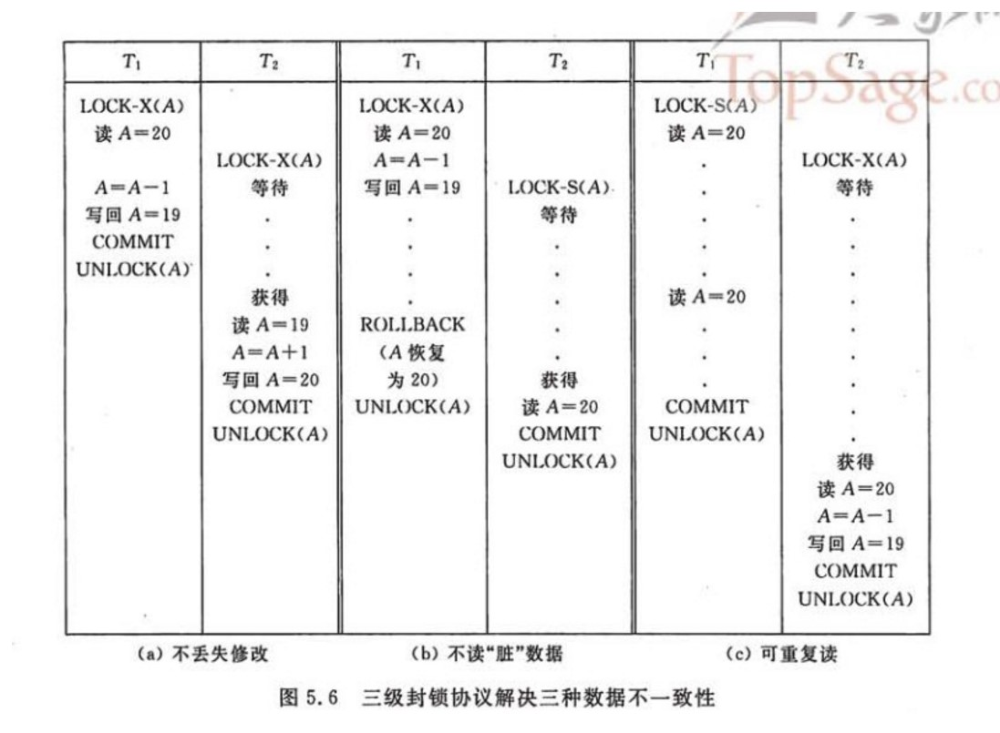
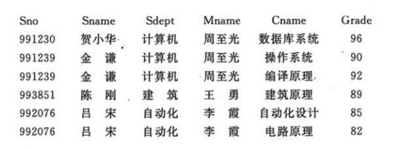
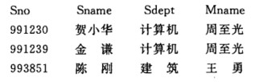
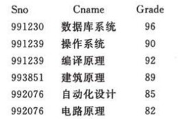
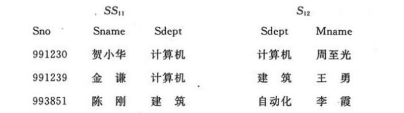

<!-- GFM-TOC -->
* [一、事务四大特性](#一事务四大特性)
    * [原子性（Atomicity）](#原子性atomicity)
    * [一致性（Consistency）](#一致性consistency)
    * [隔离性（Isolation）](#隔离性isolation)
    * [持久性（Durability）](#持久性durability)
* [二、数据不一致](#二数据不一致)
    * [丢失修改](#丢失修改)
    * [读脏数据](#读脏数据)
    * [不可重复读](#不可重复读)
* [三、隔离级别](#三隔离级别)
    * [未提交读（READ UNCOMMITTED）](#未提交读read-uncommitted)
    * [提交读（READ COMMITTED）](#提交读read-committed)
    * [可重复读（REPEATABLE READ）](#可重复读repeatable-read)
    * [可串行化（SERIALIXABLE）](#可串行化serialixable)
* [四、可串行化调度](#四可串行化调度)
* [五、封锁类型](#五封锁类型)
* [六、封锁粒度](#六封锁粒度)
* [七、封锁协议](#七封锁协议)
    * [三级封锁协议](#三级封锁协议)
    * [两段锁协议](#两段锁协议)
* [八、乐观锁和悲观锁](#八乐观锁和悲观锁)
    * [悲观锁](#悲观锁)
    * [乐观锁](#乐观锁)
    * [MySQL 隐式和显示锁定](#mysql-隐式和显示锁定)
* [九、范式](#九范式)
    * [第一范式 (1NF)](#第一范式-1nf)
    * [第二范式 (2NF)](#第二范式-2nf)
    * [第三范式 (3NF)](#第三范式-3nf)
    * [BC 范式（BCNF）](#bc-范式bcnf)
* [十、约束](#十约束)
    * [键码](#键码)
    * [单值约束](#单值约束)
    * [引用完整性约束](#引用完整性约束)
    * [域约束](#域约束)
    * [一般约束](#一般约束)
* [十一、数据库的三层模式和两层映像](#十一数据库的三层模式和两层映像)
    * [外模式](#外模式)
    * [模式](#模式)
    * [内模式](#内模式)
    * [外模式/模式映像](#外模式模式映像)
    * [模式/内模式映像](#模式内模式映像)
* [十二、ER 图](#十二er-图)
    * [实体的三种联系](#实体的三种联系)
    * [表示出现多次的关系](#表示出现多次的关系)
    * [联系的多向性](#联系的多向性)
    * [表示子类](#表示子类)
* [十三、一些概念](#十三一些概念)
    * [数据模型](#数据模型)
    * [数据库系统](#数据库系统)
* [十四、参考资料](#十四参考资料)
<!-- GFM-TOC -->


# 一、事务四大特性

<div align="center">  </div><br>

## 原子性（Atomicity）

事务被视为不可分割的最小单元，要么全部提交成功，要么全部失败回滚。

## 一致性（Consistency）

事务执行前后都保持一致性状态。在一致性状态下，所有事务对一个数据的读取结果都是相同的。

## 隔离性（Isolation）

一个事务所做的修改在最终提交以前，对其它事务是不可见的。也可以理解为多个事务单独执行，互不影响。

## 持久性（Durability）

一旦事务提交，则其所做的修改将会永远保存到数据库中。即使系统发生崩溃，事务执行的结果也不能丢失。持久性通过数据库备份和恢复来保证。

# 二、数据不一致

## 丢失修改

T<sub>1</sub> 和 T<sub>2</sub> 两个事务同时对一个数据进行修改，T<sub>1</sub> 先修改，T<sub>2</sub> 随后修改，T<sub>2</sub> 的修改覆盖了 T<sub>1</sub> 的修改。

## 读脏数据

T<sub>1</sub> 修改后写入数据库，T<sub>2</sub> 读取这个修改后的数据，但是如果 T<sub>1</sub> 撤销了这次修改，使得 T<sub>2</sub> 读取的数据是脏数据。

## 不可重复读

T<sub>1</sub> 读入某个数据，T<sub>2</sub> 对该数据做了修改，如果 T<sub>1</sub> 再读这个数据，该数据已经改变，和最开始读入的是不一样的。

# 三、隔离级别

数据库管理系统需要防止出现数据不一致问题，并且有多种级别可以实现，这些级别称为隔离级别。

## 未提交读（READ UNCOMMITTED）

事务中的修改，即使没有提交，对其它事务也都是可见的。事务可以读取未提交的数据，这也被称为脏读。

## 提交读（READ COMMITTED）

一个事务只能读取已经提交的事务所做的修改。换句话说，一个事务所在的修改在提交之前对其它事务是不可见的。这个级别有时候也叫做不可重复读，因为两次执行同样的查询，可能会得到不一样的结果。

## 可重复读（REPEATABLE READ）

解决了脏读的问题，保证在同一个事务中多次读取同样的记录结果是一致的。

但是会出现幻读的问题，所谓幻读，指的是某个事务在读取某个范围内的记录时，另一个事务会在范围内插入数据，当之前的事务再次读取该范围的记录时，会产生幻行。

## 可串行化（SERIALIXABLE）

强制事务串行执行，避免幻读。

# 四、可串行化调度

如果并行的事务的执行结果和某一个串行的方式执行的结果一样，那么可以认为结果是正确的。

# 五、封锁类型

排它锁 (X 锁）和共享锁 (S 锁），又称写锁和读锁。

- 一个事务对数据对象 A 加了 X 锁，就可以对 A 进行读取和更新。加锁期间其它事务不能对 A 加任何锁；

- 一个事务对数据对象 A 加了 S 锁，可以对 A 进行读取操作，但是不能进行更新操作。加锁期间其它事务能对 A 加 S 锁，但是不能加 X 锁。

# 六、封锁粒度

应该尽量只锁定需要修改的那部分数据，而不是所有的资源。锁定的数据量越少，发生锁争用的可能就越小，系统的并发程度就越高。

但是加锁需要消耗资源，锁的各种操作，包括获取锁，检查所是否已经解除、释放锁，都会增加系统开销。因此封锁粒度越小，系统开销就越大。需要在锁开销以及数据安全性之间做一个权衡。

MySQL 中主要提供了两种封锁粒度：行级锁以及表级锁。

# 七、封锁协议

## 三级封锁协议

<div align="center">  </div><br>

### 一级封锁协议

事务 T 要修改数据 A 时必须加 X 锁，直到事务结束才释放锁。

可以解决丢失修改问题；

### 二级封锁协议

在一级的基础上，要求读取数据 A 时必须加 S 锁，读取完马上释放 S 锁。

可以解决读脏数据问题，因为如果一个事务在对数据 A 进行修改，根据 1 级封锁协议，会加 X 锁，那么就不能再加 S 锁了，也就是不会读入数据。

### 三级封锁协议

在二级的基础上，要求读取数据 A 时必须加 S 锁，直到事务结束了才能释放 S 锁。

可以解决不可重复读的问题，因为读 A 时，其它事务不能对 A 加 X 锁，从而避免了在读的期间数据发生改变。

## 两段锁协议

加锁和解锁分为两个阶段进行。两段锁是并行事务可串行化的充分条件，但不是必要条件。

```html
lock-x(A)...lock-s(B)...lock-s(c)...unlock(A)...unlock(C)...unlock(B)
```

# 八、乐观锁和悲观锁

## 悲观锁

假定会发生并发冲突，屏蔽一切可能违反数据完整性的操作。

Java synchronized 就属于悲观锁的一种实现，每次线程要修改数据时都先获得锁，保证同一时刻只有一个线程能操作数据，其他线程则会被阻塞。

## 乐观锁

假设不会发生并发冲突，只在提交操作时检查是否违反数据完整性。

Java JUC 中的 Atomic 包就是乐观锁的一种实现，AtomicInteger 通过 CAS（Compare And Set）操作实现线程安全的自增操作。

乐观锁有两种实现方式，数据版本和时间戳。它们都需要在数据库表中增加一个字段，使用这个字段来判断数据是否过期。例如，数据版本实现方式中，需要在数据库表中增加一个数字类型的 version 字段，当读取数据时，将 version 字段的值一同读出。随后数据每更新一次，对此 version 值加 1。当提交更新的时候，判断读出的 version 和数据库表中的 version 是否一致，如果一致，则予以更新；否则认为是过期数据。

## MySQL 隐式和显示锁定

MySQL InnoDB 采用的是两阶段锁协议。在事务执行过程中，随时都可以执行锁定，锁只有在执行 COMMIT 或者 ROLLBACK 的时候才会释放，并且所有的锁是在同一时刻被释放。前面描述的锁定都是隐式锁定，InnoDB 会根据事务隔离级别在需要的时候自动加锁。

另外，InnoDB 也支持通过特定的语句进行显示锁定，这些语句不属于 SQL 规范：

- SELECT ... LOCK IN SHARE MODE
- SELECT ... FOR UPDATE

# 九、范式

记 A->B 表示 A 函数决定 B，也可以说 B 函数依赖于 A。

如果 {A1，A2，... ，An} 是关系的一个或多个属性的集合，该集合决定了关系的其它所有属性并且是最小的，那么该集合就称为键码。

对于 W->A，如果能找到 W 的真子集 W'，使得 W'-> A，那么 W->A 就是部分函数依赖，否则就是完全函数依赖；

以下关系中，Sno 表示学号，Sname 表示学生姓名，Sdept 表示学院，Cname 表示课程名，Mname 表示院长姓名。函数依赖为 {Sno, Cname} -> {Sname, Sdept, Mname}。

<div align="center">  </div><br>

不符合范式的关系，会产生很多异常。主要有以下四种异常：

1. 冗余数据
2. 修改异常
3. 删除异常
4. 插入异常，比如如果新插入一个学生的信息，而这个学生还没选课，那么就无法插入该学生。

关系数据库的范式理论就是是为了解决这四种异常。

高级别范式的依赖基于低级别的范式。

## 第一范式 (1NF)

属性不可分。

## 第二范式 (2NF)

每个非主属性完全函数依赖于键码。

可以通过分解来满足。

<font size=4> **分解前** </font><br>

<div align="center"></div> <br>

<div align="center">Sname,Sdept,Mname"/></div> <br>

<font size=4> **分解后** </font><br>

<div align="center"></div> <br>

<div align="center">Sname,Sdept,Mname"/></div> <br>

<div align="center">Mname"/></div> <br>

<div align="center">  </div><br>

<div align="center"></div> <br>

<div align="center">Grade"/></div> <br>

<div align="center">  </div><br>

## 第三范式 (3NF)

非主属性不传递依赖于键码。

上述 S1 存在传递依赖，Mname 依赖于 Sdept，而 Sdept 又依赖于 Sno，可以继续分解。

<div align="center">  </div><br>

## BC 范式（BCNF）

所有属性不传递依赖于键码。

关系模式 STC(Sname, Tname, Cname, Grade)，其中四个属性分别为学生姓名、教师姓名、课程名和成绩。有以下函数依赖：

<div align="center">Tname"/></div> <br>

<div align="center">Grade"/></div> <br>

<div align="center">Cname"/></div> <br>

<div align="center">Grade"/></div> <br>

<div align="center">Cname"/></div> <br>

分解成 SC(Sname, Cname, Grade) 和 ST(Sname, Tname)，对于 ST，属性之间是多对多关系，无函数依赖。

# 十、约束

## 键码

用于唯一表示一个实体。

键码可以由多个属性构成，每个构成键码的属性称为码。

## 单值约束

某个属性的值是唯一的。

## 引用完整性约束

一个实体的属性引用的值在另一个实体的某个属性中存在。

## 域约束

某个属性的值在特定范围之内。

## 一般约束

一般性约束，比如大小约束，数量约束。

# 十一、数据库的三层模式和两层映像

- 外模式：局部逻辑结构
- 模式：全局逻辑结构
- 内模式：物理结构

## 外模式

又称用户模式，是用户和数据库系统的接口，特定的用户只能访问数据库系统提供给他的外模式中的数据。例如不同的用户创建了不同数据库，那么一个用户只能访问他有权限访问的数据库。

一个数据库可以有多个外模式，一个用户只能有一个外模式，但是一个外模式可以给多个用户使用。

## 模式

可以分为概念模式和逻辑模式，概念模式可以用概念-关系来描述；逻辑模式使用特定的数据模式（比如关系模型）来描述数据的逻辑结构，这种逻辑结构包括数据的组成、数据项的名称、类型、取值范围。不仅如此，逻辑模式还要描述数据之间的关系，数据的完整性与安全性要求。

## 内模式

又称为存储模式，描述记录的存储方式，例如索引的组织方式、数据是否压缩以及是否加密等等。

## 外模式/模式映像

把外模式的局部逻辑结构和模式的全局逻辑结构联系起来。该映像可以保证数据和应用程序的逻辑独立性。

## 模式/内模式映像

把模式的全局逻辑结构和内模式的物理结构联系起来，该映像可以保证数据和应用程序的物理独立性。

# 十二、ER 图

Entity-Relationship，有三个组成部分：实体、属性、联系。

## 实体的三种联系

联系包含 1 对 1，1 对多，多对多三种。

如果 A 到 B 是 1 对多关系，那么画个带箭头的线段指向 B；如果是 1 对 1，画两个带箭头的线段；如果是多对多，画两个不带箭头的线段。下图的 Course 和 Student 是 1 对多的关系。

<div align="center">  </div><br>

## 表示出现多次的关系

一个实体在联系出现几次，就要用几条线连接。下图表示一个课程的先修关系，先修关系出现两个 Course 实体，第一个是先修课程，后一个是后修课程，因此需要用两条线来表示这种关系。

<div align="center">  </div><br>

## 联系的多向性

虽然老师可以开设多门课，并且可以教授多名学生，但是对于特定的学生和课程，只有一个老师教授，这就构成了一个三元联系。

<div align="center">  </div><br>

一般只使用二元联系，可以把多元关系转换为二元关系。

<div align="center">  </div><br>

## 表示子类

用 IS-A 联系来表示子类，具体做法是用一个三角形和两条线来连接类和子类。与子类有关的属性和联系都连到子类上，而与父类和子类都有关的连到父类上。

<div align="center">  </div><br>

# 十三、一些概念

## 数据模型

由数据结构、数据操作和完整性三个要素组成。

## 数据库系统

数据库系统包含所有与数据库相关的内容，包括数据库、数据库管理系统、应用程序以及数据库管理员和用户，还包括相关的硬件和软件。

# 十四、参考资料

- 史嘉权. 数据库系统概论[M]. 清华大学出版社有限公司, 2006.
- 施瓦茨. 高性能MYSQL(第3版)[M]. 电子工业出版社, 2013.
- [MySQL 乐观锁与悲观锁 ](https://www.jianshu.com/p/f5ff017db62a)
