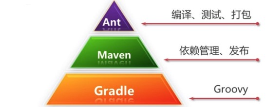

<!-- GFM-TOC -->
* [一、构建工具的作用](#一构建工具的作用)
* [二、Java 主流构建工具](#二java-主流构建工具)
* [三、Maven](#三maven)
* [参考资料](#参考资料)
<!-- GFM-TOC -->


# 一、构建工具的作用

构建工具是用于构建项目的自动化工具，主要包含以下工作：

## 依赖管理

不再需要手动导入 Jar 依赖包，并且可以自动处理依赖关系，也就是说某个依赖如果依赖于其它依赖，构建工具可以帮助我们自动处理这种依赖管理。

## 运行单元测试

不再需要在项目代码中添加测试代码，从而避免了污染项目代码。

## 将源代码转化为可执行文件

包含预处理、编译、汇编、链接等步骤。

## 将可执行文件进行打包

不再需要使用 IDE 将应用程序打包成 Jar 包。

## 发布到生产服务器上

不再需要通过 FTP 将 Jar 包上传到服务器上。

# 二、Java 主流构建工具

主要包括 Ant、Maven 和 Gradle。

<div align="center">  </div><br>

Gradle 和 Maven 的区别是，它使用 Groovy 这种特定领域语言（DSL）来管理构建脚本，而不再使用 XML 这种标记性语言。因为项目如果庞大的话，XML 很容易就变得臃肿。

例如要在项目中引入 Junit，Maven 的代码如下：

```xml
<?xml version="1.0" encoding="UTF-8"?>
<project xmlns="http://maven.apache.org/POM/4.0.0" xmlns:xsi="http://www.w3.org/2001/XMLSchema-instance"
  xsi:schemaLocation="http://maven.apache.org/POM/4.0.0 http://maven.apache.org/xsd/maven-4.0.0.xsd">
   <modelVersion>4.0.0</modelVersion>
 
   <groupId>jizg.study.maven.hello</groupId>
   <artifactId>hello-first</artifactId>
   <version>0.0.1-SNAPSHOT</version>

   <dependencies>
          <dependency>
               <groupId>junit</groupId>
               <artifactId>junit</artifactId>
               <version>4.10</version>
               <scope>test</scope>
          </dependency>
   </dependencies>
</project>
```

而 Gradle 只需要几行代码：

```java
dependencies {
    testCompile "junit:junit:4.10"
}
```

# 三、Maven

## 概述

提供了项目对象模型（POM）文件来管理项目的构建。

## 仓库

仓库的搜索顺序为：本地仓库、中央仓库、远程仓库。

- 本地仓库用来存储项目的依赖库；
- 中央仓库是下载依赖库的默认位置；
- 远程仓库，因为并非所有的库存储在中央仓库，或者中央仓库访问速度很慢，远程仓库是中央仓库的补充。

## POM

POM 代表项目对象模型，它是一个 XML 文件，保存在项目根目录的 pom.xml 文件中。

```xml
<dependency>
    <groupId>junit</groupId>
    <artifactId>junit</artifactId>
    <version>4.12</version>
    <scope>test</scope>
</dependency>
```

[groupId, artifactId, version, packaging, classfier] 称为一个项目的坐标，其中 groupId、artifactId、version 必须定义，packaging 可选（默认为 Jar），classfier 不能直接定义的，需要结合插件使用。

- groupId：项目组 Id，必须全球唯一；
- artifactId：项目 Id，即项目名；
- version：项目版本；
- packaging：项目打包方式。

## 依赖原则

### 1. 依赖路径最短优先原则

```html
A -> B -> C -> X(1.0)
A -> D -> X(2.0)
```
由于 X(2.0) 路径最短，所以使用 X(2.0)。

### 2. 声明顺序优先原则

```html
A -> B -> X(1.0)
A -> C -> X(2.0)
```

在 POM 中最先声明的优先，上面的两个依赖如果先声明 B，那么最后使用 X(1.0)。

### 3. 覆写优先原则

子 POM 内声明的依赖优先于父 POM 中声明的依赖。

## 解决依赖冲突

找到 Maven 加载的 Jar 包版本，使用 `mvn dependency:tree` 查看依赖树，根据依赖原则来调整依赖在 POM 文件的声明顺序。

# 参考资料

- [POM Reference](http://maven.apache.org/pom.html#Dependency_Version_Requirement_Specification)
- [What is a build tool?](https://stackoverflow.com/questions/7249871/what-is-a-build-tool)
- [Java Build Tools Comparisons: Ant vs Maven vs Gradle](https://programmingmitra.blogspot.com/2016/05/java-build-tools-comparisons-ant-vs.html)
- [maven 2 gradle](http://sagioto.github.io/maven2gradle/)
- [新一代构建工具 gradle](https://www.imooc.com/learn/833)

