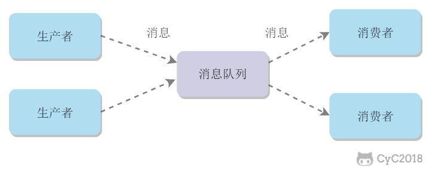
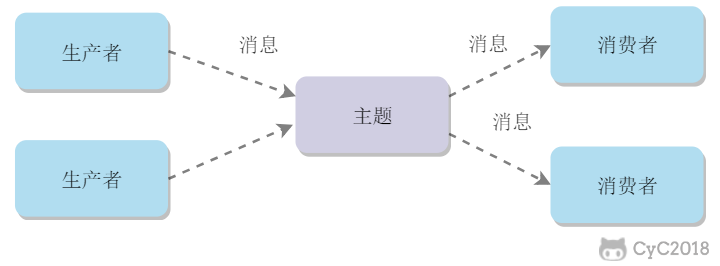
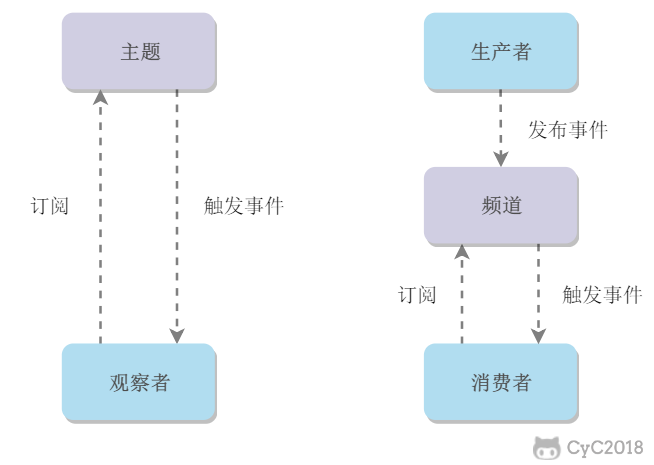

<!-- GFM-TOC -->
* [一、消息模型](#一消息模型)
    * [点对点](#点对点)
    * [发布/订阅](#发布订阅)
* [二、使用场景](#二使用场景)
    * [异步处理](#异步处理)
    * [流量削锋](#流量削锋)
    * [应用解耦](#应用解耦)
* [三、可靠性](#三可靠性)
    * [发送端的可靠性](#发送端的可靠性)
    * [接收端的可靠性](#接收端的可靠性)
* [参考资料](#参考资料)
<!-- GFM-TOC -->

# 一、消息模型

## 点对点

消息生产者向消息队列中发送了一个消息之后，只能被一个消费者消费一次。

  
 

## 发布/订阅

消息生产者向频道发送一个消息之后，多个消费者可以从该频道订阅到这条消息并消费。

  
 

发布与订阅模式和观察者模式有以下不同：

- 观察者模式中，观察者和主题都知道对方的存在；而在发布与订阅模式中，生产者与消费者不知道对方的存在，它们之间通过频道进行通信。
- 观察者模式是同步的，当事件触发时，主题会调用观察者的方法，然后等待方法返回；而发布与订阅模式是异步的，生产者向频道发送一个消息之后，就不需要关心消费者何时去订阅这个消息，可以立即返回。

  
 

# 二、使用场景

## 异步处理

发送者将消息发送给消息队列之后，不需要同步等待消息接收者处理完毕，而是立即返回进行其它操作。消息接收者从消息队列中订阅消息之后异步处理。

例如在注册流程中通常需要发送验证邮件来确保注册用户身份的合法性，可以使用消息队列使发送验证邮件的操作异步处理，用户在填写完注册信息之后就可以完成注册，而将发送验证邮件这一消息发送到消息队列中。

只有在业务流程允许异步处理的情况下才能这么做，例如上面的注册流程中，如果要求用户对验证邮件进行点击之后才能完成注册的话，就不能再使用消息队列。

## 流量削锋

在高并发的场景下，如果短时间有大量的请求到达会压垮服务器。

可以将请求发送到消息队列中，服务器按照其处理能力从消息队列中订阅消息进行处理。

## 应用解耦

如果模块之间不直接进行调用，模块之间耦合度就会很低，那么修改一个模块或者新增一个模块对其它模块的影响会很小，从而实现可扩展性。

通过使用消息队列，一个模块只需要向消息队列中发送消息，其它模块可以选择性地从消息队列中订阅消息从而完成调用。

# 三、可靠性

## 发送端的可靠性

发送端完成操作后一定能将消息成功发送到消息队列中。

实现方法：在本地数据库建一张消息表，将消息数据与业务数据保存在同一数据库实例里，这样就可以利用本地数据库的事务机制。事务提交成功后，将消息表中的消息转移到消息队列中，若转移消息成功则删除消息表中的数据，否则继续重传。

## 接收端的可靠性

接收端能够从消息队列成功消费一次消息。

两种实现方法：

- 保证接收端处理消息的业务逻辑具有幂等性：只要具有幂等性，那么消费多少次消息，最后处理的结果都是一样的。
- 保证消息具有唯一编号，并使用一张日志表来记录已经消费的消息编号。

# 参考资料

- [Observer vs Pub-Sub](http://developers-club.com/posts/270339/)
- [消息队列中点对点与发布订阅区别](https://blog.csdn.net/lizhitao/article/details/47723105)

# 微信公众号

更多精彩内容将发布在微信公众号 CyC2018 上，你也可以在公众号后台和我交流学习和求职相关的问题。另外，公众号提供了该项目的 PDF 等离线阅读版本，后台回复 "下载" 即可领取。公众号也提供了一份技术面试复习大纲，不仅系统整理了面试知识点，而且标注了各个知识点的重要程度，从而帮你理清多而杂的面试知识点，后台回复 "大纲" 即可领取。我基本是按照这个大纲来进行复习的，对我拿到了 BAT 头条等 Offer 起到很大的帮助。你们完全可以和我一样根据大纲上列的知识点来进行复习，就不用看很多不重要的内容，也可以知道哪些内容很重要从而多安排一些复习时间。

 
</img>

