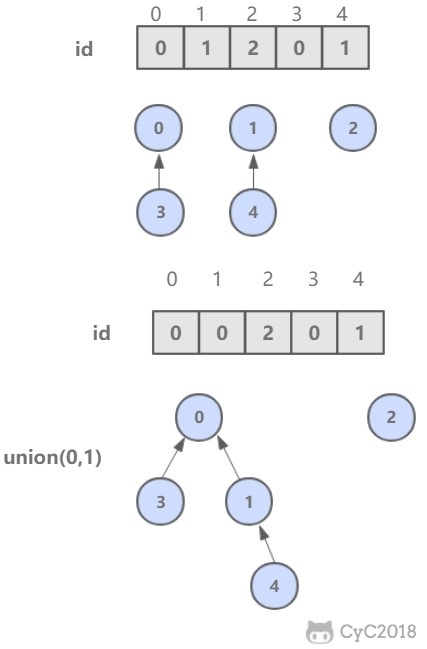
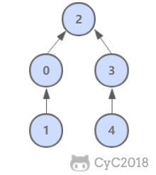

<!-- GFM-TOC -->
* [前言](#前言)
* [Quick Find](#quick-find)
* [Quick Union](#quick-union)
* [加权 Quick Union](#加权-quick-union)
* [路径压缩的加权 Quick Union](#路径压缩的加权-quick-union)
* [比较](#比较)
<!-- GFM-TOC -->


# 前言

用于解决动态连通性问题，能动态连接两个点，并且判断两个点是否连通。

<div align="center">  </div><br>

| 方法 | 描述 |
| :---: | :---: |
| UF(int N) | 构造一个大小为 N 的并查集 |
| void union(int p, int q) | 连接 p 和 q 节点 |
| int find(int p) | 查找 p 所在的连通分量编号 |
| boolean connected(int p, int q) | 判断 p 和 q 节点是否连通 |

```java
public abstract class UF {

    protected int[] id;

    public UF(int N) {
        id = new int[N];
        for (int i = 0; i < N; i++) {
            id[i] = i;
        }
    }

    public boolean connected(int p, int q) {
        return find(p) == find(q);
    }

    public abstract int find(int p);

    public abstract void union(int p, int q);
}
```

# Quick Find

可以快速进行 find 操作，也就是可以快速判断两个节点是否连通。

需要保证同一连通分量的所有节点的 id 值相等，就可以通过判断两个节点的 id 值是否相等从而判断其连通性。

但是 union 操作代价却很高，需要将其中一个连通分量中的所有节点 id 值都修改为另一个节点的 id 值。

<div align="center">  </div><br>

```java
public class QuickFindUF extends UF {

    public QuickFindUF(int N) {
        super(N);
    }


    @Override
    public int find(int p) {
        return id[p];
    }


    @Override
    public void union(int p, int q) {
        int pID = find(p);
        int qID = find(q);

        if (pID == qID) {
            return;
        }

        for (int i = 0; i < id.length; i++) {
            if (id[i] == pID) {
                id[i] = qID;
            }
        }
    }
}
```

# Quick Union

可以快速进行 union 操作，只需要修改一个节点的 id 值即可。

但是 find 操作开销很大，因为同一个连通分量的节点 id 值不同，id 值只是用来指向另一个节点。因此需要一直向上查找操作，直到找到最上层的节点。

<div align="center">  </div><br>

```java
public class QuickUnionUF extends UF {

    public QuickUnionUF(int N) {
        super(N);
    }


    @Override
    public int find(int p) {
        while (p != id[p]) {
            p = id[p];
        }
        return p;
    }


    @Override
    public void union(int p, int q) {
        int pRoot = find(p);
        int qRoot = find(q);

        if (pRoot != qRoot) {
            id[pRoot] = qRoot;
        }
    }
}
```

这种方法可以快速进行 union 操作，但是 find 操作和树高成正比，最坏的情况下树的高度为节点的数目。

<div align="center">  </div><br>

# 加权 Quick Union

为了解决 quick-union 的树通常会很高的问题，加权 quick-union 在 union 操作时会让较小的树连接较大的树上面。

理论研究证明，加权 quick-union 算法构造的树深度最多不超过 logN。

<div align="center">  </div><br>

```java
public class WeightedQuickUnionUF extends UF {

    // 保存节点的数量信息
    private int[] sz;


    public WeightedQuickUnionUF(int N) {
        super(N);
        this.sz = new int[N];
        for (int i = 0; i < N; i++) {
            this.sz[i] = 1;
        }
    }


    @Override
    public int find(int p) {
        while (p != id[p]) {
            p = id[p];
        }
        return p;
    }


    @Override
    public void union(int p, int q) {

        int i = find(p);
        int j = find(q);

        if (i == j) return;

        if (sz[i] < sz[j]) {
            id[i] = j;
            sz[j] += sz[i];
        } else {
            id[j] = i;
            sz[i] += sz[j];
        }
    }
}
```

# 路径压缩的加权 Quick Union

在检查节点的同时将它们直接链接到根节点，只需要在 find 中添加一个循环即可。

# 比较

| 算法 | union | find |
| :---: | :---: | :---: |
| Quick Find | N | 1 |
| Quick Union | 树高 | 树高 |
| 加权 Quick Union | logN | logN |
| 路径压缩的加权 Quick Union | 非常接近 1 | 非常接近 1 |


# 微信公众号


更多精彩内容将发布在微信公众号 CyC2018 上，你也可以在公众号后台和我交流学习和求职相关的问题。另外，公众号提供了该项目的 PDF 等离线阅读版本，后台回复 "下载" 即可领取。公众号也提供了一份技术面试复习大纲，不仅系统整理了面试知识点，而且标注了各个知识点的重要程度，从而帮你理清多而杂的面试知识点，后台回复 "大纲" 即可领取。我基本是按照这个大纲来进行复习的，对我拿到了 BAT 头条等 Offer 起到很大的帮助。你们完全可以和我一样根据大纲上列的知识点来进行复习，就不用看很多不重要的内容，也可以知道哪些内容很重要从而多安排一些复习时间。


<br><div align="center"></img></div>
