<!-- GFM-TOC -->
* [前言](#前言)
* [初级实现](#初级实现)
    * [1. 链表实现无序符号表](#1-链表实现无序符号表)
    * [2. 二分查找实现有序符号表](#2-二分查找实现有序符号表)
* [二叉查找树](#二叉查找树)
    * [1. get()](#1-get)
    * [2. put()](#2-put)
    * [3. 分析](#3-分析)
    * [4. floor()](#4-floor)
    * [5. rank()](#5-rank)
    * [6. min()](#6-min)
    * [7. deleteMin()](#7-deletemin)
    * [8. delete()](#8-delete)
    * [9. keys()](#9-keys)
    * [10. 分析](#10-分析)
* [2-3 查找树](#2-3-查找树)
    * [1. 插入操作](#1-插入操作)
    * [2. 性质](#2-性质)
* [红黑树](#红黑树)
    * [1. 左旋转](#1-左旋转)
    * [2. 右旋转](#2-右旋转)
    * [3. 颜色转换](#3-颜色转换)
    * [4. 插入](#4-插入)
    * [5. 分析](#5-分析)
* [散列表](#散列表)
    * [1. 散列函数](#1-散列函数)
    * [2. 拉链法](#2-拉链法)
    * [3. 线性探测法](#3-线性探测法)
* [小结](#小结)
    * [1. 符号表算法比较](#1-符号表算法比较)
    * [2. Java 的符号表实现](#2-java-的符号表实现)
    * [3. 稀疏向量乘法](#3-稀疏向量乘法)
<!-- GFM-TOC -->


# 前言

符号表（Symbol Table）是一种存储键值对的数据结构，可以支持快速查找操作。

符号表分为有序和无序两种，有序符号表主要指支持 min()、max() 等根据键的大小关系来实现的操作。

有序符号表的键需要实现 Comparable 接口。

```java
public interface UnorderedST<Key, Value> {

    int size();

    Value get(Key key);

    void put(Key key, Value value);

    void delete(Key key);
}
```

```java
public interface OrderedST<Key extends Comparable<Key>, Value> {

    int size();

    void put(Key key, Value value);

    Value get(Key key);

    Key min();

    Key max();

    int rank(Key key);

    List<Key> keys(Key l, Key h);
}
```

# 初级实现

## 1. 链表实现无序符号表

```java
public class ListUnorderedST<Key, Value> implements UnorderedST<Key, Value> {

    private Node first;

    private class Node {
        Key key;
        Value value;
        Node next;

        Node(Key key, Value value, Node next) {
            this.key = key;
            this.value = value;
            this.next = next;
        }
    }

    @Override
    public int size() {
        int cnt = 0;
        Node cur = first;
        while (cur != null) {
            cnt++;
            cur = cur.next;
        }
        return cnt;
    }

    @Override
    public void put(Key key, Value value) {
        Node cur = first;
        // 如果在链表中找到节点的键等于 key 就更新这个节点的值为 value
        while (cur != null) {
            if (cur.key.equals(key)) {
                cur.value = value;
                return;
            }
            cur = cur.next;
        }
        // 否则使用头插法插入一个新节点
        first = new Node(key, value, first);
    }

    @Override
    public void delete(Key key) {
        if (first == null)
            return;
        if (first.key.equals(key))
            first = first.next;
        Node pre = first, cur = first.next;
        while (cur != null) {
            if (cur.key.equals(key)) {
                pre.next = cur.next;
                return;
            }
            pre = pre.next;
            cur = cur.next;
        }
    }

    @Override
    public Value get(Key key) {
        Node cur = first;
        while (cur != null) {
            if (cur.key.equals(key))
                return cur.value;
            cur = cur.next;
        }
        return null;
    }
}
```

## 2. 二分查找实现有序符号表

使用一对平行数组，一个存储键一个存储值。

二分查找的 rank() 方法至关重要，当键在表中时，它能够知道该键的位置；当键不在表中时，它也能知道在何处插入新键。

二分查找最多需要 logN+1 次比较，使用二分查找实现的符号表的查找操作所需要的时间最多是对数级别的。但是插入操作需要移动数组元素，是线性级别的。

```java
public class BinarySearchOrderedST<Key extends Comparable<Key>, Value> implements OrderedST<Key, Value> {

    private Key[] keys;
    private Value[] values;
    private int N = 0;

    public BinarySearchOrderedST(int capacity) {
        keys = (Key[]) new Comparable[capacity];
        values = (Value[]) new Object[capacity];
    }

    @Override
    public int size() {
        return N;
    }

    @Override
    public int rank(Key key) {
        int l = 0, h = N - 1;
        while (l <= h) {
            int m = l + (h - l) / 2;
            int cmp = key.compareTo(keys[m]);
            if (cmp == 0)
                return m;
            else if (cmp < 0)
                h = m - 1;
            else
                l = m + 1;
        }
        return l;
    }

    @Override
    public List<Key> keys(Key l, Key h) {
        int index = rank(l);
        List<Key> list = new ArrayList<>();
        while (keys[index].compareTo(h) <= 0) {
            list.add(keys[index]);
            index++;
        }
        return list;
    }

    @Override
    public void put(Key key, Value value) {
        int index = rank(key);
        // 如果找到已经存在的节点键为 key，就更新这个节点的值为 value
        if (index < N && keys[index].compareTo(key) == 0) {
            values[index] = value;
            return;
        }
        // 否则在数组中插入新的节点，需要先将插入位置之后的元素都向后移动一个位置
        for (int j = N; j > index; j--) {
            keys[j] = keys[j - 1];
            values[j] = values[j - 1];
        }
        keys[index] = key;
        values[index] = value;
        N++;
    }

    @Override
    public Value get(Key key) {
        int index = rank(key);
        if (index < N && keys[index].compareTo(key) == 0)
            return values[index];
        return null;
    }

    @Override
    public Key min() {
        return keys[0];
    }

    @Override
    public Key max() {
        return keys[N - 1];
    }
}
```

# 二叉查找树

**二叉树**  是一个空链接，或者是一个有左右两个链接的节点，每个链接都指向一颗子二叉树。

<div align="center"> 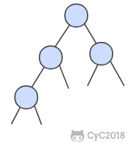 </div><br>

**二叉查找树** （BST）是一颗二叉树，并且每个节点的值都大于等于其左子树中的所有节点的值而小于等于右子树的所有节点的值。

BST 有一个重要性质，就是它的中序遍历结果递增排序。

<div align="center"> 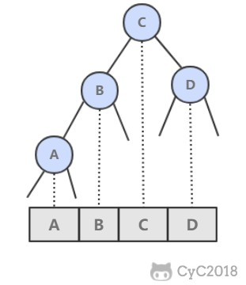 </div><br>

基本数据结构：

```java
public class BST<Key extends Comparable<Key>, Value> implements OrderedST<Key, Value> {

    protected Node root;

    protected class Node {
        Key key;
        Value val;
        Node left;
        Node right;
        // 以该节点为根的子树节点总数
        int N;
        // 红黑树中使用
        boolean color;

        Node(Key key, Value val, int N) {
            this.key = key;
            this.val = val;
            this.N = N;
        }
    }

    @Override
    public int size() {
        return size(root);
    }

    private int size(Node x) {
        if (x == null)
            return 0;
        return x.N;
    }

    protected void recalculateSize(Node x) {
        x.N = size(x.left) + size(x.right) + 1;
    }
}
```

为了方便绘图，下文中二叉树的空链接不画出来。

## 1. get()

- 如果树是空的，则查找未命中；
- 如果被查找的键和根节点的键相等，查找命中；
- 否则递归地在子树中查找：如果被查找的键较小就在左子树中查找，较大就在右子树中查找。

```java
@Override
public Value get(Key key) {
    return get(root, key);
}

private Value get(Node x, Key key) {
    if (x == null)
        return null;
    int cmp = key.compareTo(x.key);
    if (cmp == 0)
        return x.val;
    else if (cmp < 0)
        return get(x.left, key);
    else
        return get(x.right, key);
}
```

## 2. put()

当插入的键不存在于树中，需要创建一个新节点，并且更新上层节点的链接指向该节点，使得该节点正确地链接到树中。

<div align="center"> 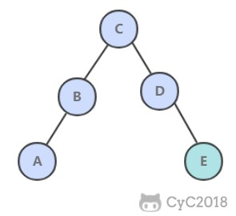 </div><br>

```java
 @Override
public void put(Key key, Value value) {
    root = put(root, key, value);
}

private Node put(Node x, Key key, Value value) {
    if (x == null)
        return new Node(key, value, 1);
    int cmp = key.compareTo(x.key);
    if (cmp == 0)
        x.val = value;
    else if (cmp < 0)
        x.left = put(x.left, key, value);
    else
        x.right = put(x.right, key, value);
    recalculateSize(x);
    return x;
}
```

## 3. 分析

二叉查找树的算法运行时间取决于树的形状，而树的形状又取决于键被插入的先后顺序。

最好的情况下树是完全平衡的，每条空链接和根节点的距离都为 logN。

<div align="center"> 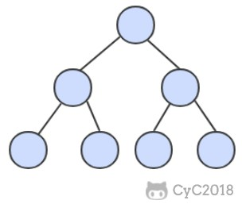 </div><br>

在最坏的情况下，树的高度为 N。

<div align="center"> 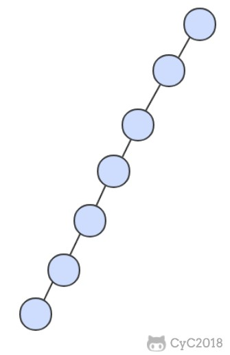 </div><br>

## 4. floor()

floor(key)：小于等于键的最大键

- 如果键小于根节点的键，那么 floor(key) 一定在左子树中；
- 如果键大于根节点的键，需要先判断右子树中是否存在 floor(key)，如果存在就返回，否则根节点就是 floor(key)。

```java
public Key floor(Key key) {
    Node x = floor(root, key);
    if (x == null)
        return null;
    return x.key;
}

private Node floor(Node x, Key key) {
    if (x == null)
        return null;
    int cmp = key.compareTo(x.key);
    if (cmp == 0)
        return x;
    if (cmp < 0)
        return floor(x.left, key);
    Node t = floor(x.right, key);
    return t != null ? t : x;
}
```

## 5. rank()

rank(key) 返回 key 的排名。

- 如果键和根节点的键相等，返回左子树的节点数；
- 如果小于，递归计算在左子树中的排名；
- 如果大于，递归计算在右子树中的排名，加上左子树的节点数，再加上 1（根节点）。

```java
@Override
public int rank(Key key) {
    return rank(key, root);
}

private int rank(Key key, Node x) {
    if (x == null)
        return 0;
    int cmp = key.compareTo(x.key);
    if (cmp == 0)
        return size(x.left);
    else if (cmp < 0)
        return rank(key, x.left);
    else
        return 1 + size(x.left) + rank(key, x.right);
}
```

## 6. min()

```java
@Override
public Key min() {
    return min(root).key;
}

private Node min(Node x) {
    if (x == null)
        return null;
    if (x.left == null)
        return x;
    return min(x.left);
}
```

## 7. deleteMin()

令指向最小节点的链接指向最小节点的右子树。

<div align="center"> 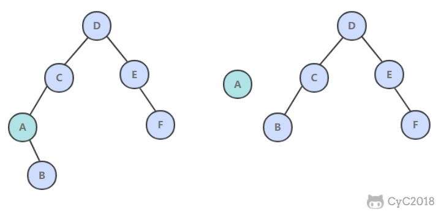 </div><br>

```java
public void deleteMin() {
    root = deleteMin(root);
}

public Node deleteMin(Node x) {
    if (x.left == null)
        return x.right;
    x.left = deleteMin(x.left);
    recalculateSize(x);
    return x;
}
```

## 8. delete()

- 如果待删除的节点只有一个子树，  那么只需要让指向待删除节点的链接指向唯一的子树即可；
- 否则，让右子树的最小节点替换该节点。

<div align="center"> 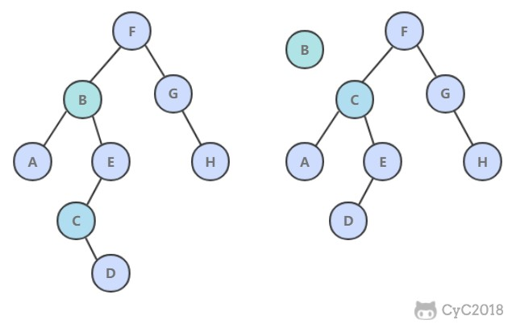 </div><br>

```java
public void delete(Key key) {
    root = delete(root, key);
}
private Node delete(Node x, Key key) {
    if (x == null)
        return null;
    int cmp = key.compareTo(x.key);
    if (cmp < 0)
        x.left = delete(x.left, key);
    else if (cmp > 0)
        x.right = delete(x.right, key);
    else {
        if (x.right == null)
            return x.left;
        if (x.left == null)
            return x.right;
        Node t = x;
        x = min(t.right);
        x.right = deleteMin(t.right);
        x.left = t.left;
    }
    recalculateSize(x);
    return x;
}
```

## 9. keys()

利用二叉查找树中序遍历的结果为递增的特点。

```java
@Override
public List<Key> keys(Key l, Key h) {
    return keys(root, l, h);
}

private List<Key> keys(Node x, Key l, Key h) {
    List<Key> list = new ArrayList<>();
    if (x == null)
        return list;
    int cmpL = l.compareTo(x.key);
    int cmpH = h.compareTo(x.key);
    if (cmpL < 0)
        list.addAll(keys(x.left, l, h));
    if (cmpL <= 0 && cmpH >= 0)
        list.add(x.key);
    if (cmpH > 0)
        list.addAll(keys(x.right, l, h));
    return list;
}
```

## 10. 分析

二叉查找树所有操作在最坏的情况下所需要的时间都和树的高度成正比。

# 2-3 查找树

2-3 查找树引入了 2- 节点和 3- 节点，目的是为了让树平衡。一颗完美平衡的 2-3 查找树的所有空链接到根节点的距离应该是相同的。

<div align="center"> 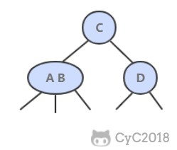 </div><br>

## 1. 插入操作

插入操作和 BST 的插入操作有很大区别，BST 的插入操作是先进行一次未命中的查找，然后再将节点插入到对应的空链接上。但是 2-3 查找树如果也这么做的话，那么就会破坏了平衡性。它是将新节点插入到叶子节点上。

根据叶子节点的类型不同，有不同的处理方式：

- 如果插入到 2- 节点上，那么直接将新节点和原来的节点组成 3- 节点即可。

<div align="center"> 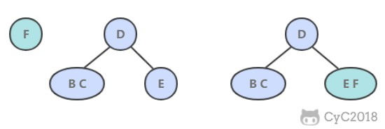 </div><br>

- 如果是插入到 3- 节点上，就会产生一个临时 4- 节点时，需要将 4- 节点分裂成 3 个 2- 节点，并将中间的 2- 节点移到上层节点中。如果上移操作继续产生临时 4- 节点则一直进行分裂上移，直到不存在临时 4- 节点。

<div align="center"> 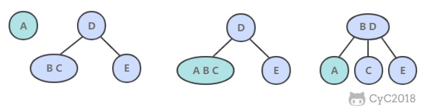 </div><br>

## 2. 性质

2-3 查找树插入操作的变换都是局部的，除了相关的节点和链接之外不必修改或者检查树的其它部分，而这些局部变换不会影响树的全局有序性和平衡性。

2-3 查找树的查找和插入操作复杂度和插入顺序无关，在最坏的情况下查找和插入操作访问的节点必然不超过 logN 个，含有 10 亿个节点的 2-3 查找树最多只需要访问 30 个节点就能进行任意的查找和插入操作。

# 红黑树

红黑树是 2-3 查找树，但它不需要分别定义 2- 节点和 3- 节点，而是在普通的二叉查找树之上，为节点添加颜色。指向一个节点的链接颜色如果为红色，那么这个节点和上层节点表示的是一个 3- 节点，而黑色则是普通链接。

<div align="center"> 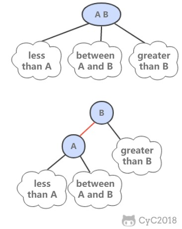 </div><br>

红黑树具有以下性质：

- 红链接都为左链接；
- 完美黑色平衡，即任意空链接到根节点的路径上的黑链接数量相同。

画红黑树时可以将红链接画平。

<div align="center"> 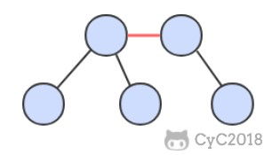 </div><br>

```java
public class RedBlackBST<Key extends Comparable<Key>, Value> extends BST<Key, Value> {

    private static final boolean RED = true;
    private static final boolean BLACK = false;

    private boolean isRed(Node x) {
        if (x == null)
            return false;
        return x.color == RED;
    }
}
```

## 1. 左旋转

因为合法的红链接都为左链接，如果出现右链接为红链接，那么就需要进行左旋转操作。

<div align="center"> 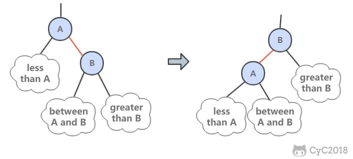 </div><br>

```java
public Node rotateLeft(Node h) {
    Node x = h.right;
    h.right = x.left;
    x.left = h;
    x.color = h.color;
    h.color = RED;
    x.N = h.N;
    recalculateSize(h);
    return x;
}
```

## 2. 右旋转

进行右旋转是为了转换两个连续的左红链接，这会在之后的插入过程中探讨。

<div align="center"> 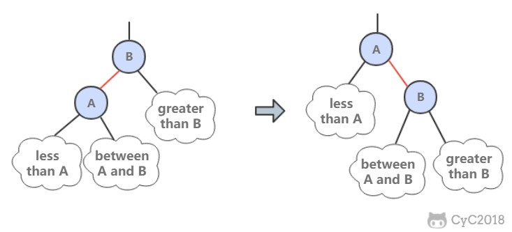 </div><br>

```java
public Node rotateRight(Node h) {
    Node x = h.left;
    h.left = x.right;
    x.right = h;
    x.color = h.color;
    h.color = RED;
    x.N = h.N;
    recalculateSize(h);
    return x;
}
```

## 3. 颜色转换

一个 4- 节点在红黑树中表现为一个节点的左右子节点都是红色的。分裂 4- 节点除了需要将子节点的颜色由红变黑之外，同时需要将父节点的颜色由黑变红，从 2-3 树的角度看就是将中间节点移到上层节点。

<div align="center"> 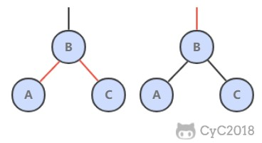 </div><br>

```java
void flipColors(Node h) {
    h.color = RED;
    h.left.color = BLACK;
    h.right.color = BLACK;
}
```

## 4. 插入

先将一个节点按二叉查找树的方法插入到正确位置，然后再进行如下颜色操作：

- 如果右子节点是红色的而左子节点是黑色的，进行左旋转；
- 如果左子节点是红色的，而且左子节点的左子节点也是红色的，进行右旋转；
- 如果左右子节点均为红色的，进行颜色转换。

<div align="center"> 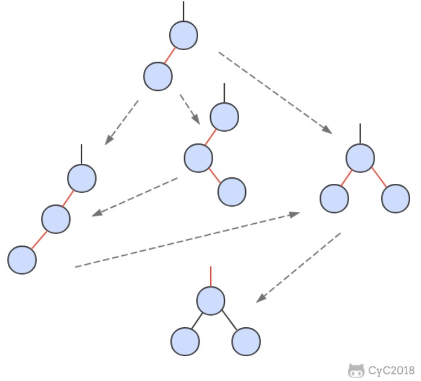 </div><br>

```java
@Override
public void put(Key key, Value value) {
    root = put(root, key, value);
    root.color = BLACK;
}

private Node put(Node x, Key key, Value value) {
    if (x == null) {
        Node node = new Node(key, value, 1);
        node.color = RED;
        return node;
    }
    int cmp = key.compareTo(x.key);
    if (cmp == 0)
        x.val = value;
    else if (cmp < 0)
        x.left = put(x.left, key, value);
    else
        x.right = put(x.right, key, value);

    if (isRed(x.right) && !isRed(x.left))
        x = rotateLeft(x);
    if (isRed(x.left) && isRed(x.left.left))
        x = rotateRight(x);
    if (isRed(x.left) && isRed(x.right))
        flipColors(x);

    recalculateSize(x);
    return x;
}
```

可以看到该插入操作和二叉查找树的插入操作类似，只是在最后加入了旋转和颜色变换操作即可。

根节点一定为黑色，因为根节点没有上层节点，也就没有上层节点的左链接指向根节点。flipColors() 有可能会使得根节点的颜色变为红色，每当根节点由红色变成黑色时树的黑链接高度加 1.

## 5. 分析

一颗大小为 N 的红黑树的高度不会超过 2logN。最坏的情况下是它所对应的 2-3 树，构成最左边的路径节点全部都是 3- 节点而其余都是 2- 节点。

红黑树大多数的操作所需要的时间都是对数级别的。

# 散列表

散列表类似于数组，可以把散列表的散列值看成数组的索引值。访问散列表和访问数组元素一样快速，它可以在常数时间内实现查找和插入操作。

由于无法通过散列值知道键的大小关系，因此散列表无法实现有序性操作。

## 1. 散列函数

对于一个大小为 M 的散列表，散列函数能够把任意键转换为 [0, M-1] 内的正整数，该正整数即为 hash 值。

散列表存在冲突，也就是两个不同的键可能有相同的 hash 值。

散列函数应该满足以下三个条件：

- 一致性：相等的键应当有相等的 hash 值，两个键相等表示调用 equals() 返回的值相等。
- 高效性：计算应当简便，有必要的话可以把 hash 值缓存起来，在调用 hash 函数时直接返回。
- 均匀性：所有键的 hash 值应当均匀地分布到 [0, M-1] 之间，如果不能满足这个条件，有可能产生很多冲突，从而导致散列表的性能下降。

除留余数法可以将整数散列到 [0, M-1] 之间，例如一个正整数 k，计算 k%M 既可得到一个 [0, M-1] 之间的 hash 值。注意 M 最好是一个素数，否则无法利用键包含的所有信息。例如 M 为 10<sup>k</sup>，那么只能利用键的后 k 位。

对于其它数，可以将其转换成整数的形式，然后利用除留余数法。例如对于浮点数，可以将其的二进制形式转换成整数。

对于多部分组合的类型，每个部分都需要计算 hash 值，这些 hash 值都具有同等重要的地位。为了达到这个目的，可以将该类型看成 R 进制的整数，每个部分都具有不同的权值。

例如，字符串的散列函数实现如下：

```java
int hash = 0;
for (int i = 0; i < s.length(); i++)
    hash = (R * hash + s.charAt(i)) % M;
```

再比如，拥有多个成员的自定义类的哈希函数如下：

```java
int hash = (((day * R + month) % M) * R + year) % M;
```

R 通常取 31。

Java 中的 hashCode() 实现了哈希函数，但是默认使用对象的内存地址值。在使用 hashCode() 时，应当结合除留余数法来使用。因为内存地址是 32 位整数，我们只需要 31 位的非负整数，因此应当屏蔽符号位之后再使用除留余数法。

```java
int hash = (x.hashCode() & 0x7fffffff) % M;
```

使用 Java 的 HashMap 等自带的哈希表实现时，只需要去实现 Key 类型的 hashCode() 函数即可。Java 规定 hashCode() 能够将键均匀分布于所有的 32 位整数，Java 中的 String、Integer 等对象的 hashCode() 都能实现这一点。以下展示了自定义类型如何实现 hashCode()：

```java
public class Transaction {

    private final String who;
    private final Date when;
    private final double amount;

    public Transaction(String who, Date when, double amount) {
        this.who = who;
        this.when = when;
        this.amount = amount;
    }

    public int hashCode() {
        int hash = 17;
        int R = 31;
        hash = R * hash + who.hashCode();
        hash = R * hash + when.hashCode();
        hash = R * hash + ((Double) amount).hashCode();
        return hash;
    }
}
```

## 2. 拉链法

拉链法使用链表来存储 hash 值相同的键，从而解决冲突。

查找需要分两步，首先查找 Key 所在的链表，然后在链表中顺序查找。

对于 N 个键，M 条链表 (N>M)，如果哈希函数能够满足均匀性的条件，每条链表的大小趋向于 N/M，因此未命中的查找和插入操作所需要的比较次数为 \~N/M。

<div align="center"> 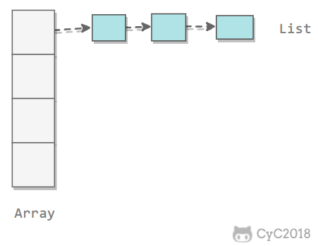 </div><br>

## 3. 线性探测法

线性探测法使用空位来解决冲突，当冲突发生时，向前探测一个空位来存储冲突的键。

使用线性探测法，数组的大小 M 应当大于键的个数 N（M>N)。


<div align="center"> 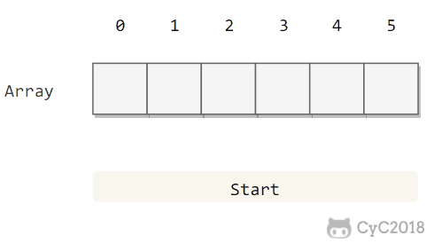 </div><br>

```java
public class LinearProbingHashST<Key, Value> implements UnorderedST<Key, Value> {

    private int N = 0;
    private int M = 16;
    private Key[] keys;
    private Value[] values;

    public LinearProbingHashST() {
        init();
    }

    public LinearProbingHashST(int M) {
        this.M = M;
        init();
    }

    private void init() {
        keys = (Key[]) new Object[M];
        values = (Value[]) new Object[M];
    }

    private int hash(Key key) {
        return (key.hashCode() & 0x7fffffff) % M;
    }
}
```

#### 3.1 查找

```java
public Value get(Key key) {
    for (int i = hash(key); keys[i] != null; i = (i + 1) % M)
        if (keys[i].equals(key))
            return values[i];

    return null;
}
```

#### 3.2 插入

```java
public void put(Key key, Value value) {
    resize();
    putInternal(key, value);
}

private void putInternal(Key key, Value value) {
    int i;
    for (i = hash(key); keys[i] != null; i = (i + 1) % M)
        if (keys[i].equals(key)) {
            values[i] = value;
            return;
        }

    keys[i] = key;
    values[i] = value;
    N++;
}
```

#### 3.3 删除

删除操作应当将右侧所有相邻的键值对重新插入散列表中。

```java
public void delete(Key key) {
    int i = hash(key);
    while (keys[i] != null && !key.equals(keys[i]))
        i = (i + 1) % M;

    // 不存在，直接返回
    if (keys[i] == null)
        return;

    keys[i] = null;
    values[i] = null;

    // 将之后相连的键值对重新插入
    i = (i + 1) % M;
    while (keys[i] != null) {
        Key keyToRedo = keys[i];
        Value valToRedo = values[i];
        keys[i] = null;
        values[i] = null;
        N--;
        putInternal(keyToRedo, valToRedo);
        i = (i + 1) % M;
    }
    N--;
    resize();
}
```

#### 3.5 调整数组大小

线性探测法的成本取决于连续条目的长度，连续条目也叫聚簇。当聚簇很长时，在查找和插入时也需要进行很多次探测。例如下图中 2\~4 位置就是一个聚簇。


<div align="center"> 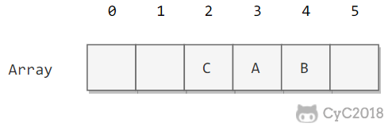 </div><br>

α = N/M，把 α 称为使用率。理论证明，当 α 小于 1/2 时探测的预计次数只在 1.5 到 2.5 之间。为了保证散列表的性能，应当调整数组的大小，使得 α 在 [1/4, 1/2] 之间。

```java
private void resize() {
    if (N >= M / 2)
        resize(2 * M);
    else if (N <= M / 8)
        resize(M / 2);
}

private void resize(int cap) {
    LinearProbingHashST<Key, Value> t = new LinearProbingHashST<Key, Value>(cap);
    for (int i = 0; i < M; i++)
        if (keys[i] != null)
            t.putInternal(keys[i], values[i]);

    keys = t.keys;
    values = t.values;
    M = t.M;
}
```

# 小结

## 1. 符号表算法比较

| 算法 | 插入 | 查找 | 是否有序 |
| :---: | :---: | :---: | :---: |
| 链表实现的无序符号表 | N | N | yes |
| 二分查找实现的有序符号表 | N | logN | yes |
| 二叉查找树 | logN | logN | yes |
| 2-3 查找树 | logN | logN | yes |
| 拉链法实现的散列表 | N/M | N/M | no |
| 线性探测法实现的散列表 | 1 | 1 | no |

应当优先考虑散列表，当需要有序性操作时使用红黑树。

## 2. Java 的符号表实现

- java.util.TreeMap：红黑树
- java.util.HashMap：拉链法的散列表

## 3. 稀疏向量乘法

当向量为稀疏向量时，可以使用符号表来存储向量中的非 0 索引和值，使得乘法运算只需要对那些非 0 元素进行即可。

```java
public class SparseVector {
    private HashMap<Integer, Double> hashMap;

    public SparseVector(double[] vector) {
        hashMap = new HashMap<>();
        for (int i = 0; i < vector.length; i++)
            if (vector[i] != 0)
                hashMap.put(i, vector[i]);
    }

    public double get(int i) {
        return hashMap.getOrDefault(i, 0.0);
    }

    public double dot(SparseVector other) {
        double sum = 0;
        for (int i : hashMap.keySet())
            sum += this.get(i) * other.get(i);
        return sum;
    }
}
```


# 微信公众号


更多精彩内容将发布在微信公众号 CyC2018 上，你也可以在公众号后台和我交流学习和求职相关的问题。另外，公众号提供了该项目的 PDF 等离线阅读版本，后台回复 "下载" 即可领取。公众号也提供了一份技术面试复习大纲，不仅系统整理了面试知识点，而且标注了各个知识点的重要程度，从而帮你理清多而杂的面试知识点，后台回复 "大纲" 即可领取。我基本是按照这个大纲来进行复习的，对我拿到了 BAT 头条等 Offer 起到很大的帮助。你们完全可以和我一样根据大纲上列的知识点来进行复习，就不用看很多不重要的内容，也可以知道哪些内容很重要从而多安排一些复习时间。


<br><div align="center"></img></div>
