<!-- GFM-TOC -->
* [一、算法分析](#一算法分析)
    * [函数转换](#函数转换)
    * [数学模型](#数学模型)
    * [ThreeSum](#threesum)
    * [倍率实验](#倍率实验)
    * [注意事项](#注意事项)
* [二、栈和队列](#二栈和队列)
    * [栈](#栈)
    * [队列](#队列)
* [三、union-find](#三union-find)
    * [quick-find](#quick-find)
    * [quick-union](#quick-union)
    * [加权 quick-union](#加权-quick-union)
    * [路径压缩的加权 quick-union](#路径压缩的加权-quick-union)
    * [各种 union-find 算法的比较](#各种-union-find-算法的比较)
* [四、排序](#四排序)
    * [选择排序](#选择排序)
    * [插入排序](#插入排序)
    * [希尔排序](#希尔排序)
    * [归并排序](#归并排序)
    * [快速排序](#快速排序)
    * [优先队列](#优先队列)
    * [应用](#应用)
* [五、查找](#五查找)
    * [符号表](#符号表)
    * [二叉查找树](#二叉查找树)
    * [2-3 查找树](#2-3-查找树)
    * [红黑二叉查找树](#红黑二叉查找树)
    * [散列表](#散列表)
    * [应用](#应用)
<!-- GFM-TOC -->


# 一、算法分析

## 函数转换

指数函数可以转换为线性函数，从而在函数图像上显示的更直观。例如

<div align="center"></div> <br>

可以在其两端同时取对数，得到：

<div align="center"></div> <br>

<div align="center"> 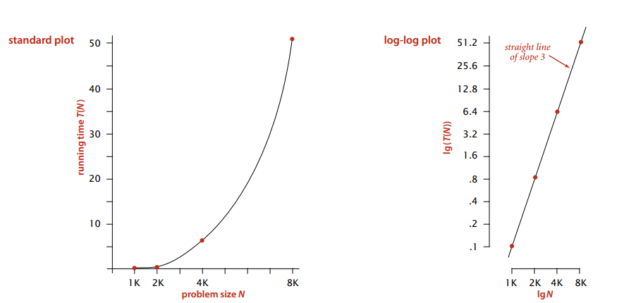 </div><br>

## 数学模型

### 1. 近似

使用 \~f(N) 来表示所有随着 N 的增大除以 f(N) 的结果趋近于 1 的函数 , 例如 N<sup>3</sup>/6-N<sup>2</sup>/2+N/3 \~ N<sup>3</sup>/6。

<div align="center"> 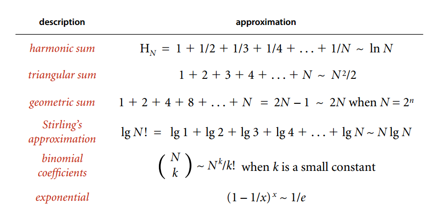 </div><br>

### 2. 增长数量级

增长数量级将算法与它的实现隔离开来，一个算法的增长数量级为 N<sup>3</sup> 与它是否用 Java 实现，是否运行于特定计算机上无关。

<div align="center"> 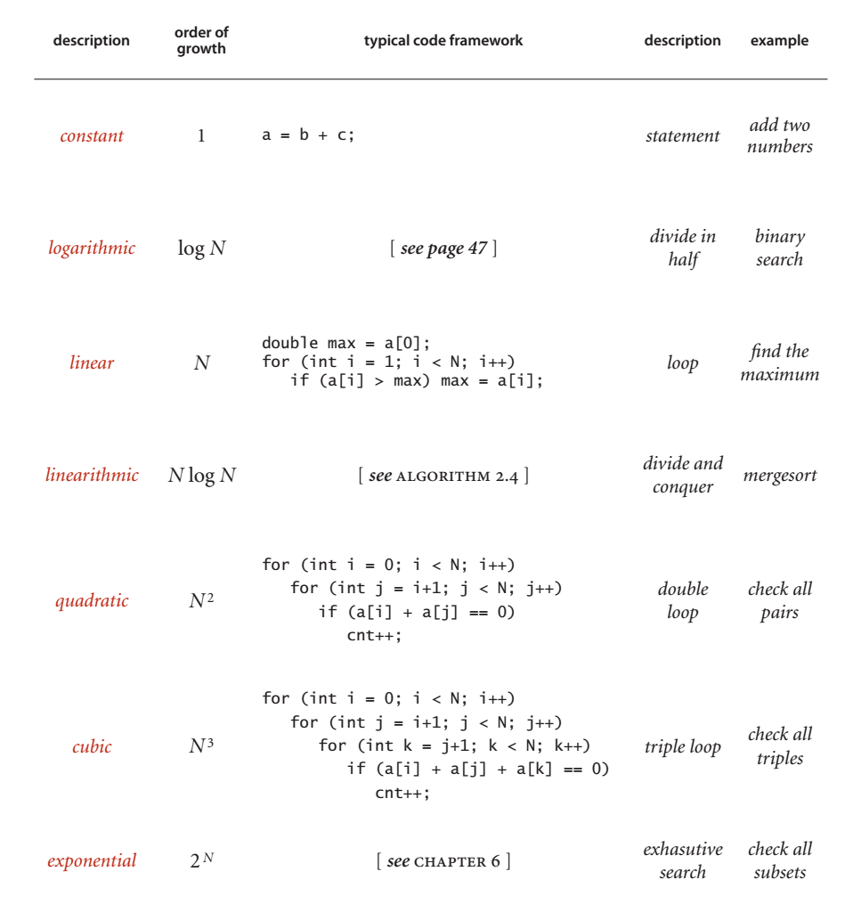 </div><br>

### 3. 内循环

执行最频繁的指令决定了程序执行的总时间，把这些指令称为程序的内循环。

### 4. 成本模型

使用成本模型来评估算法，例如数组的访问次数就是一种成本模型。

## ThreeSum

ThreeSum 用于统计一个数组中三元组的和为 0 的数量。

```java
public class ThreeSum {
    public static int count(int[] a) {
        int N = a.length;
        int cnt = 0;
        for (int i = 0; i < N; i++) {
            for (int j = i + 1; j < N; j++) {
                for (int k = j + 1; k < N; k++) {
                    if (a[i] + a[j] + a[k] == 0) {
                        cnt++;
                    }
                }
            }
        }
        return cnt;
    }
}
```

该算法的内循环为`if (a[i] + a[j] + a[k] == 0)`语句，总共执行的次数为 N(N-1)(N-2) =  N<sup>3</sup>/6 - N<sup>2</sup>/2 + N/3，因此它的近似执行次数为 \~N<sup>3</sup>/6，增长数量级为 N<sup>3</sup>。

<font size=4> **改进** </font></br>

通过将数组先排序，对两个元素求和，并用二分查找方法查找是否存在该和的相反数，如果存在，就说明存在三元组的和为 0。

该方法可以将 ThreeSum 算法增长数量级降低为 N<sup>2</sup>logN。

```java
public class ThreeSumFast {
    public static int count(int[] a) {
        Arrays.sort(a);
        int N = a.length;
        int cnt = 0;
        for (int i = 0; i < N; i++) {
            for (int j = i + 1; j < N; j++) {
                // rank() 方法返回元素在数组中的下标，如果元素不存在，这里会返回 -1。
                // 应该注意这里的下标必须大于 j，否则会重复统计。
                if (BinarySearch.rank(-a[i] - a[j], a) > j) {
                    cnt++;
            }
            }
        }
        return cnt;
    }
}
```

## 倍率实验

如果 T(N) \~ aN<sup>b</sup>logN，那么 T(2N)/T(N) \~ 2<sup>b</sup>。

例如对于暴力方法的 ThreeSum 算法，近似时间为 \~N<sup>3</sup>/6。进行如下实验：多次运行该算法，每次取的 N 值为前一次的两倍，统计每次执行的时间，并统计本次运行时间与前一次运行时间的比值，得到如下结果：

<div align="center"> 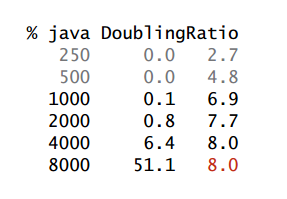 </div><br>

可以看到，T(2N)/T(N)\~2<sup>3</sup>，因此可以确定 T(N) \~ aN<sup>2</sup>logN。

## 注意事项

### 1. 大常数

在求近似时，如果低级项的常数系数很大，那么近似的结果就是错误的。

### 2. 缓存

计算机系统会使用缓存技术来组织内存，访问数组相邻的元素会比访问不相邻的元素快很多。

### 3. 对最坏情况下的性能的保证

在核反应堆、心脏起搏器或者刹车控制器中的软件，最坏情况下的性能是十分重要的。

### 4. 随机化算法

通过打乱输入，去除算法对输入的依赖。

### 5. 均摊分析

将所有操作的总成本除于操作总数来将成本均摊。例如对一个空栈进行 N 次连续的 push() 调用需要访问数组的元素为 N+4+8+16+...+2N=5N-4（N 是向数组写入元素，其余的都是调整数组大小时进行复制需要的访问数组操作），均摊后每次操作访问数组的平均次数为常数。

# 二、栈和队列

## 栈

first-in-last-out(FILO)

<div align="center"> 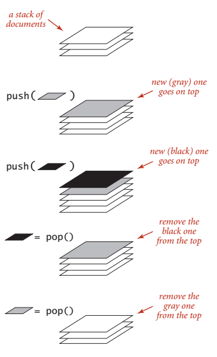 </div><br>

<font size=4> **1. 数组实现** </font></br>

```java
public class ResizeArrayStack<Item> implements Iterable<Item> {
    private Item[] a = (Item[]) new Object[1];
    private int N = 0;

    public void push(Item item) {
        if (N >= a.length) {
            resize(2 * a.length);
        }
        a[N++] = item;
    }

    public Item pop() {
        Item item = a[--N];
        if (N <= a.length / 4) {
            resize(a.length / 2);
        }
        return item;
    }

    // 调整数组大小，使得栈具有伸缩性
    private void resize(int size) {
        Item[] tmp = (Item[]) new Object[size];
        for (int i = 0; i < N; i++) {
            tmp[i] = a[i];
        }
        a = tmp;
    }

    public boolean isEmpty() {
        return N == 0;
    }

    public int size() {
        return N;
    }

    @Override
    public Iterator<Item> iterator() {
        // 需要返回逆序遍历的迭代器
        return new ReverseArrayIterator();
    }

    private class ReverseArrayIterator implements Iterator<Item> {
        private int i = N;

        @Override
        public boolean hasNext() {
            return i > 0;
        }

        @Override
        public Item next() {
            return a[--i];
        }
    }
}
```

上面实现使用了泛型，Java 不能直接创建泛型数组，只能使用转型来创建。

```java
Item[] arr = (Item[]) new Object[N];
```

<font size=4> **2. 链表实现** </font></br>

需要使用链表的头插法来实现，因为头插法中最后压入栈的元素在链表的开头，它的 next 指针指向前一个压入栈的元素，在弹出元素使就可以让前一个压入栈的元素称为栈顶元素。

```java
public class Stack<Item> {

    private Node top = null;
    private int N = 0;

    private class Node {
        Item item;
        Node next;
    }

    public boolean isEmpty() {
        return N == 0;
    }

    public int size() {
        return N;
    }

    public void push(Item item) {
        Node newTop = new Node();
        newTop.item = item;
        newTop.next = top;
        top = newTop;
        N++;
    }

    public Item pop() {
        Item item = top.item;
        top = top.next;
        N--;
        return item;
    }
}
```
## 队列

first-in-first-out(FIFO)

<div align="center"> 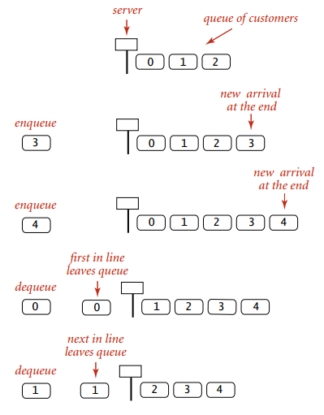 </div><br>

下面是队列的链表实现，需要维护 first 和 last 节点指针，分别指向队首和队尾。

这里需要考虑让哪个指针指针链表头部节点，哪个指针指向链表尾部节点。因为出队列操作需要让队首元素的下一个元素成为队首，就需要容易获取下一个元素，而链表的头部节点的 next 指针指向下一个元素，因此让队首指针 first 指针链表的开头。

```java
public class Queue<Item> {
    private Node first;
    private Node last;
    int N = 0;
    private class Node{
        Item item;
        Node next;
    }

    public boolean isEmpty(){
        return N == 0;
    }

    public int size(){
        return N;
    }

    // 入队列
    public void enqueue(Item item){
        Node newNode = new Node();
        newNode.item = item;
        newNode.next = null;
        if(isEmpty()){
            last = newNode;
            first = newNode;
        } else{
            last.next = newNode;
            last = newNode;
        }
        N++;
    }

    // 出队列
    public Item dequeue(){
        Node node = first;
        first = first.next;
        N--;
        return node.item;
    }
}
```

# 三、union-find

<font size=4>  **概览**  </font> <br>

用于解决动态连通性问题，能动态连接两个点，并且判断两个点是否连接。

<div align="center"> 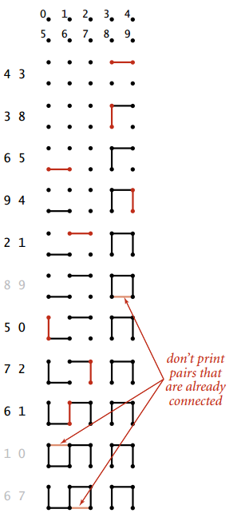 </div><br>

<font size=4>  **API**  </font> <br>

<div align="center"> 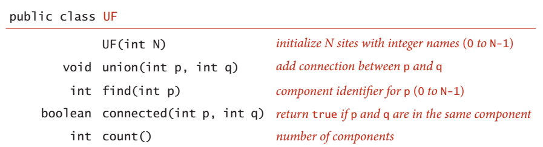 </div><br>

<font size=4>  **基本数据结构**  </font> <br>

```java
public class UF {
    // 使用 id 数组来保存点的连通信息
    private int[] id;

    public UF(int N) {
        id = new int[N];
        for (int i = 0; i < N; i++) {
            id[i] = i;
        }
    }

    public boolean connected(int p, int q) {
        return find(p) == find(q);
    }
}
```

## quick-find

保证在同一连通分量的所有触点的 id 值相等。

这种方法可以快速取得一个触点的 id 值，并且判断两个触点是否连通，但是 union 的操作代价却很高，需要将其中一个连通分量中的所有节点 id 值都修改为另一个节点的 id 值。

```java
    public int find(int p) {
        return id[p];
    }
    public void union(int p, int q) {
        int pID = find(p);
        int qID = find(q);

        if (pID == qID) return;
        for (int i = 0; i < id.length; i++) {
            if (id[i] == pID) id[i] = qID;
        }
    }
```

## quick-union

在 union 时只将触点的 id 值指向另一个触点 id 值，不直接用 id 来存储所属的连通分量。这样就构成一个倒置的树形结构，根节点需要指向自己。在进行查找一个节点所属的连通分量时，要一直向上查找直到根节点，并使用根节点的 id 值作为本连通分量的 id 值。

<div align="center"> 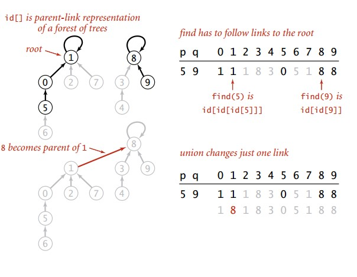 </div><br>

```java
    public int find(int p) {
        while (p != id[p]) p = id[p];
        return p;
    }

    public void union(int p, int q) {
        int pRoot = find(p);
        int qRoot = find(q);
        if (pRoot == qRoot) return;
        id[pRoot] = qRoot;
    }
```

这种方法可以快速进行 union 操作，但是 find 操作和树高成正比，最坏的情况下树的高度为触点的数目。

<div align="center"> 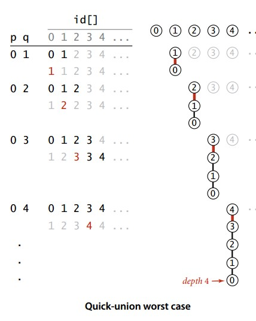 </div><br>

## 加权 quick-union

为了解决 quick-union 的树通常会很高的问题，加权 quick-union 在 union 操作时会让较小的树连接较大的树上面。

理论研究证明，加权 quick-union 算法构造的树深度最多不超过 logN。

<div align="center"> 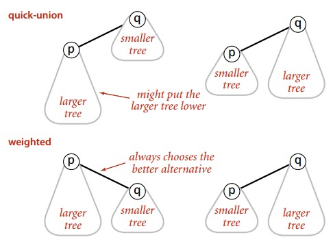 </div><br>

```java
public class WeightedQuickUnionUF {
    private int[] id;
    // 保存节点的数量信息
    private int[] sz;

    public WeightedQuickUnionUF(int N) {
        id = new int[N];
        sz = new int[N];
        for (int i = 0; i < N; i++) {
            id[i] = i;
            sz[i] = 1;
        }
    }

    public boolean connected(int p, int q) {
        return find(p) == find(q);
    }

    public int find(int p) {
        while (p != id[p]) p = id[p];
        return p;
    }

    public void union(int p, int q) {
        int i = find(p);
        int j = find(q);
        if (i == j) return;
        if (sz[i] < sz[j]) {
            id[i] = j;
            sz[j] += sz[i];
        } else {
            id[j] = i;
            sz[i] += sz[j];
        }
    }
}
```

## 路径压缩的加权 quick-union

在检查节点的同时将它们直接链接到根节点，只需要在 find 中添加一个循环即可。

## 各种 union-find 算法的比较

<div align="center"> 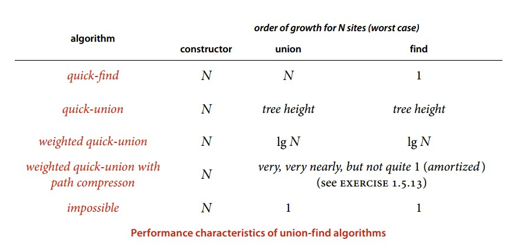 </div><br>

# 四、排序

<font size=4> **约定** </font><br>

待排序的元素需要实现 Java 的 Comparable 接口，该接口有 compareTo() 方法。

研究排序算法的成本模型时，计算的是比较和交换的次数。

使用辅助函数 less() 和 exch() 来进行比较和交换的操作，使得代码的可读性和可移植性更好。

```java
private boolean less(Comparable v, Comparable w){
    return v.compareTo(w) < 0;
}

private void exch(Comparable[] a, int i, int j){
    Comparable t = a[i];
    a[i] = a[j];
    a[j] = t;
}
```

## 选择排序

找到数组中的最小元素，将它与数组的第一个元素交换位置。再从剩下的元素中找到最小的元素，将它与数组的第二个元素交换位置。不断进行这样的操作，直到将整个数组排序。

<div align="center">  </div><br>

```java
public class Selection {
    public static void sort(Comparable[] a) {
        int N = a.length;
        for (int i = 0; i < N; i++) {
            int min = i;
            for (int j = i + 1; j < N; j++) {
                if (less(a[j], a[min])) min = j;
            }
            exch(a, i, min);
        }
    }
}
```

选择排序需要 \~N<sup>2</sup>/2 次比较和 \~N 次交换，它的运行时间与输入无关，这个特点使得它对一个已经排序的数组也需要这么多的比较和交换操作。

## 插入排序

入排序从左到右进行，每次都将当前元素插入到左部已经排序的数组中，使得插入之后左部数组依然有序。

<div align="center">  </div><br>

```java
public class Insertion {
    public static void sort(Comparable[] a) {
        int N = a.length;
        for (int i = 1; i < N; i++) {
            for (int j = i; j > 0 && less(a[j], a[j - 1]); j--) {
                exch(a, j, j - 1);
            }
        }
    }
}
```

插入排序的复杂度取决于数组的初始顺序，如果数组已经部分有序了，那么插入排序会很快。平均情况下插入排序需要 \~N<sup>2</sup>/4 比较以及 \~N<sup>2</sup>/4 次交换，最坏的情况下需要 \~N<sup>2</sup>/2 比较以及 \~N<sup>2</sup>/2 次交换，最坏的情况是数组是逆序的；而最好的情况下需要 N-1 次比较和 0 次交换，最好的情况就是数组已经有序了。

插入排序对于部分有序数组和小规模数组特别高效。

<font size=3>  **选择排序和插入排序的比较**  </font> </br>

对于随机排序的无重复主键的数组，插入排序和选择排序的运行时间是平方级别的，两者之比是一个较小的常数。

## 希尔排序

对于大规模的数组，插入排序很慢，因为它只能交换相邻的元素，如果要把元素从一端移到另一端，就需要很多次操作。

希尔排序的出现就是为了改进插入排序的这种局限性，它通过交换不相邻的元素，使得元素更快的移到正确的位置上。

希尔排序使用插入排序对间隔 h 的序列进行排序，如果 h 很大，那么元素就能很快的移到很远的地方。通过不断减小 h，最后令 h=1，就可以使得整个数组是有序的。

<div align="center">  </div><br>

```java
public class Shell {
    public static void sort(Comparable[] a) {
        int N = a.length;
        int h = 1;
        while (h < N / 3) {
            h = 3 * h + 1; // 1, 4, 13, 40, ...
        }
        while (h >= 1) {
            for (int i = h; i < N; i++) {
                for (int j = i; j >= h && less(a[j], a[j - h]); j -= h) {
                    exch(a, j, j - h);
                }
            }
            h = h / 3;
        }
    }
}
```

希尔排序的运行时间达不到平方级别，使用递增序列 1, 4, 13, 40, ...  的希尔排序所需要的比较次数不会超过 N 的若干倍乘于递增序列的长度。后面介绍的高级排序算法只会比希尔排序快两倍左右。

## 归并排序

归并排序的思想是将数组分成两部分，分别进行排序，然后归并起来。

<div align="center"> 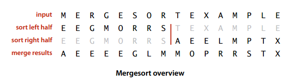 </div><br>

### 1. 归并方法

归并方法将数组中两个已经排序的部分归并成一个。

```java
public class MergeSort {
    private static Comparable[] aux;

    private static void merge(Comparable[] a, int lo, int mid, int hi) {
        int i = lo, j = mid + 1;

        for (int k = lo; k <= hi; k++) {
            aux[k] = a[k]; // 将数据复制到辅助数组
        }

        for (int k = lo; k <= hi; k++) {
            if (i > mid) a[k] = aux[j++];
            else if (j > hi) a[k] = aux[i++];
            else if (aux[i].compareTo(a[j]) < 0) a[k] = aux[i++]; // 先进行这一步，保证稳定性
            else a[k] = aux[j++];
        }
    }
}
```

### 2. 自顶向下归并排序

```java
public static void sort(Comparable[] a) {
    aux = new Comparable[a.length];
    sort(a, 0, a.length - 1);
}

private static void sort(Comparable[] a, int lo, int hi) {
    if (hi <= lo) return;
    int mid = lo + (hi - lo) / 2;
    sort(a, lo, mid);
    sort(a, mid + 1, hi);
    merge(a, lo, mid, hi);
}
```

<div align="center">  </div><br>

<div align="center">  </div><br>

因为每次都将问题对半分成两个子问题，而这种对半分的算法复杂度一般为 O(Nlog<sub>N</sub>)，因此该归并排序方法的时间复杂度也为 O(Nlog<sub>N</sub>)。

因为小数组的递归操作会过于频繁，因此使用插入排序来处理小数组将会获得更高的性能。

### 3. 自底向上归并排序

先归并那些微型数组，然后成对归并得到的子数组。

<div align="center"> 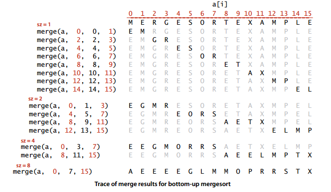 </div><br>

```java
public static void busort(Comparable[] a) {
    int N = a.length;
    aux = new Comparable[N];
    for (int sz = 1; sz < N; sz += sz) {
        for (int lo = 0; lo < N - sz; lo += sz + sz) {
            merge(a, lo, lo + sz - 1, Math.min(lo + sz + sz - 1, N - 1));
        }
    }
}
```

## 快速排序

### 1. 基本算法

归并排序将数组分为两个子数组分别排序，并将有序的子数组归并使得整个数组排序；快速排序通过一个切分元素将数组分为两个子数组，左子数组小于等于切分元素，右子数组大于等于切分元素，将这两个子数组排序也就将整个数组排序了。

<div align="center"> 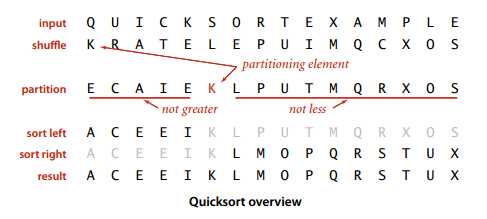 </div><br>

```java
public class QuickSort {
    public static void sort(Comparable[] a) {
        shuffle(a);
        sort(a, 0, a.length - 1);
    }

    private static void sort(Comparable[] a, int lo, int hi) {
        if (hi <= lo) return;
        int j = partition(a, lo, hi);
        sort(a, lo, j - 1);
        sort(a, j + 1, hi);
    }
}
```

### 2. 切分

取 a[lo] 作为切分元素，然后从数组的左端向右扫描直到找到第一个大于等于它的元素，再从数组的右端向左扫描找到第一个小于等于它的元素，交换这两个元素，并不断继续这个过程，就可以保证左指针的左侧元素都不大于切分元素，右指针 j 的右侧元素都不小于切分元素。当两个指针相遇时，将切分元素 a[lo] 和左子数组最右侧的元素 a[j] 交换然后返回 j 即可。

<div align="center">  </div><br>

```java
private static int partition(Comparable[] a, int lo, int hi) {
    int i = lo, j = hi + 1;
    Comparable v = a[lo];
    while (true) {
        while (less(a[++i], v)) if (i == hi) break;
        while (less(v, a[--j])) if (j == lo) break;
        if (i >= j) break;
        exch(a, i, j);
    }
    exch(a, lo, j);
    return j;
}
```

### 3. 性能分析

快速排序是原地排序，不需要辅助数组，但是递归调用需要辅助栈。

快速排序最好的情况下是每次都正好能将数组对半分，这样递归调用次数才是最少的。这种情况下比较次数为 C<sub>N</sub>=2C<sub>N/2</sub>+N，也就是复杂度为 O(Nlog<sub>N</sub>)。

最坏的情况下，第一次从最小的元素切分，第二次从第二小的元素切分，如此这般。因此最坏的情况下需要比较 N<sup>2</sup>/2。为了防止数组最开始就是有序的，在进行快速排序时需要随机打乱数组。

### 4. 算法改进

#### 4.1 切换到插入排序

因为快速排序在小数组中也会调用自己，对于小数组，插入排序比快速排序的性能更好，因此在小数组中可以切换到插入排序。

#### 4.2 三取样

最好的情况下是每次都能取数组的中位数作为切分元素，但是计算中位数的代价很高。人们发现取 3 个元素并将大小居中的元素作为切分元素的效果最好。

#### 4.3 三向切分

对于有大量重复元素的数组，可以将数组切分为三部分，分别对应小于、等于和大于切分元素。

三向切分快速排序对于只有若干不同主键的随机数组可以在线性时间内完成排序。

<div align="center">  </div><br>

```java
public class Quick3Way {
    public static void sort(Comparable[] a, int lo, int hi) {
        if (hi <= lo) return;
        int lt = lo, i = lo + 1, gt = hi;
        Comparable v = a[lo];
        while (i <= gt) {
            int cmp = a[i].compareTo(v);
            if (cmp < 0) exch(a, lt++, i++);
            else if (cmp > 0) exch(a, i, gt--);
            else i++;
        }
        sort(a, lo, lt - 1);
        sort(a, gt + 1, hi);
    }
}
```

## 优先队列

优先队列主要用于处理最大元素。

### 1. 堆

定义：一颗二叉树的每个节点都大于等于它的两个子节点。

堆可以用数组来表示，因为堆是一种完全二叉树，而完全二叉树很容易就存储在数组中。位置 k 的节点的父节点位置为 k/2，而它的两个子节点的位置分别为 2k 和 2k+1。这里我们不使用数组索引为 0 的位置，是为了更清晰地理解节点的关系。

<div align="center"> 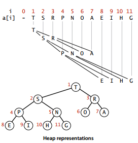 </div><br>

```java
public class MaxPQ<Key extends Comparable<Key> {
    private Key[] pq;
    private int N = 0;

    public MaxPQ(int maxN) {
        pq = (Key[]) new Comparable[maxN + 1];
    }

    public boolean isEmpty() {
        return N == 0;
    }

    public int size() {
        return N;
    }

    private boolean less(int i, int j) {
        return pq[i].compareTo(pq[j]) < 0;
    }

    private void exch(int i, int j) {
        Key t = pq[i];
        pq[i] = pq[j];
        pq[j] = t;
    }
}
```

### 2. 上浮和下沉

在堆中，当一个节点比父节点大，那么需要交换这个两个节点。交换后还可能比它新的父节点大，因此需要不断地进行比较和交换操作。把这种操作称为上浮。

```java
private void swim(int k) {
    while (k > 1 && less(k / 2, k)) {
        exch(k / 2, k);
        k = k / 2;
    }
}
```

类似地，当一个节点比子节点来得小，也需要不断的向下比较和交换操作，把这种操作称为下沉。一个节点有两个子节点，应当与两个子节点中最大那么节点进行交换。

```java
private void sink(int k) {
    while (2 * k <= N) {
        int j = 2 * k;
        if (j < N && less(j, j + 1)) j++;
        if (!less(k, j)) break;
        exch(k, j);
        k = j;
    }
}
```

### 3. 插入元素

将新元素放到数组末尾，然后上浮到合适的位置。

```java
public void insert(Key v) {
    pq[++N] = v;
    swim(N);
}
```

### 4. 删除最大元素

从数组顶端删除最大的元素，并将数组的最后一个元素放到顶端，并让这个元素下沉到合适的位置。

```java
public Key delMax() {
    Key max = pq[1];
    exch(1, N--);
    pq[N + 1] = null;
    sink(1);
    return max;
}
```

### 5. 堆排序

由于堆可以很容易得到最大的元素并删除它，不断地进行这种操作可以得到一个递减序列。如果把最大元素和当前堆中数组的最后一个元素交换位置，并且不删除它，那么就可以得到一个从尾到头的递减序列，从正向来看就是一个递增序列。因此很容易使用堆来进行排序，并且堆排序是原地排序，不占用额外空间。

堆排序要分两个阶段，第一个阶段是把无序数组建立一个堆；第二个阶段是交换最大元素和当前堆的数组最后一个元素，并且进行下沉操作维持堆的有序状态。

无序数组建立堆最直接的方法是从左到右遍历数组，然后进行上浮操作。一个更高效的方法是从右至左进行下沉操作，如果一个节点的两个节点都已经是堆有序，那么进行下沉操作可以使得这个节点为根节点的堆有序。叶子节点不需要进行下沉操作，因此可以忽略叶子节点的元素，因此只需要遍历一半的元素即可。

<div align="center">  </div><br>

```java
public static void sort(Comparable[] a){
    int N = a.length;
    for(int k = N/2; k >= 1; k--){
        sink(a, k, N);
    }
    while(N > 1){
        exch(a, 1, N--);
        sink(a, 1, N);
    }
}
```

### 6. 分析

一个堆的高度为 logN，因此在堆中插入元素和删除最大元素的复杂度都为 logN。

对于堆排序，由于要对 N 个节点进行下沉操作，因此复杂度为 NlogN。

堆排序时一种原地排序，没有利用额外的空间。

现代操作系统很少使用堆排序，因为它无法利用缓存，也就是数组元素很少和相邻的元素进行比较。

## 应用

### 1. 排序算法的比较

<div align="center"> 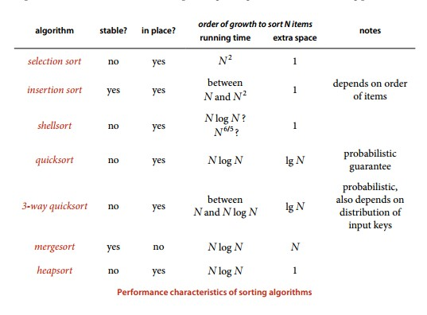 </div><br>

快速排序时最快的通用排序算法，它的内循环的指令很少，而且它还能利用缓存，因为它总是顺序地访问数据。它的运行时间增长数量级为 \~cNlogN，这里的 c 比其他线性对数级别的排序算法都要小。使用三向切分之后，实际应用中可能出现的某些分布的输入能够达到线性级别，而其它排序算法仍然需要线性对数时间。

### 2. Java 的排序算法实现

Java 系统库中的主要排序方法为 java.util.Arrays.sort()，对于原始数据类型使用三向切分的快速排序，对于引用类型使用归并排序。

### 3. 基于切分的快速选择算法

快速排序的 partition() 方法，会返回一个整数 j 使得 a[lo..j-1] 小于等于 a[j]，且 a[j+1..hi] 大于等于 a[j]，此时 a[j] 就是数组的第 j 大元素。

可以利用这个特性找出数组的第 k 个元素。

```java
public static Comparable select(Comparable[] a, int k) {
    int lo = 0, hi = a.length - 1;
    while (hi > lo) {
        int j = partion(a, lo, hi);
        if (j == k) return a[k];
        else if (j > k) hi = j - 1;
        else lo = j + 1;
    }
    return a[k];
}
```

该算法是线性级别的，因为每次正好将数组二分，那么比较的总次数为 (N+N/2+N/4+..)，直到找到第 k 个元素，这个和显然小于 2N。

# 五、查找

本章使用三种经典的数据结构来实现高效的符号表：二叉查找树、红黑树和散列表。

## 符号表

<font size=4> **1. 无序符号表** </font></br>

<div align="center"> 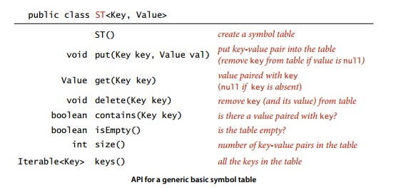 </div><br>

<font size=4> **2. 有序符号表** </font></br>

<div align="center">  </div><br>

有序符号表的键需要实现 Comparable 接口。

查找的成本模型：键的比较次数，在不进行比较时使用数组的访问次数。

<font size=4> **3. 二分查找实现有序符号表** </font></br>

使用一对平行数组，一个存储键一个存储值。

需要创建一个 Key 类型的 Comparable 对象数组和一个 Value 类型的 Object 对象数组。

rank() 方法至关重要，当键在表中时，它能够知道该键的位置；当键不在表中时，它也能知道在何处插入新键。

复杂度：二分查找最多需要 logN+1 次比较，使用二分查找实现的符号表的查找操作所需要的时间最多是对数级别的。但是插入操作需要移动数组元素，是线性级别的。

```java
public class BinarySearchST<Key extends Comparable<Key>, Value> {
    private Key[] keys;
    private Value[] values;
    private int N;

    public BinarySearchST(int capacity) {
        keys = (Key[]) new Comparable[capacity];
        values = (Value[]) new Object[capacity];
    }

    public int size() {
        return N;
    }

    public Value get(Key key) {
        int i = rank(key);
        if (i < N && keys[i].compareTo(key) == 0) {
            return values[i];
        }
        return null;
    }

    public int rank(Key key) {
        int lo = 0, hi = N - 1;
        while (lo <= hi) {
            int mid = lo + (hi - lo) / 2;
            int cmp = key.compareTo(keys[mid]);
            if (cmp == 0) return mid;
            else if (cmp < 0) hi = mid - 1;
            else lo = mid + 1;
        }
        return lo;
    }

    public void put(Key key, Value value) {
        int i = rank(key);
        if (i < N && keys[i].compareTo(key) == 0) {
            values[i] = value;
            return;
        }
        for (int j = N; j > i; j--) {
            keys[j] = keys[j - 1];
            values[j] = values[j - 1];
        }
        keys[i] = key;
        values[i] = value;
        N++;
    }

    public Key ceiling(Key key){
        int i = rank(key);
        return keys[i];
    }
}
```

## 二叉查找树

**二叉树**  定义为一个空链接，或者是一个有左右两个链接的节点，每个链接都指向一颗子二叉树。

**二叉查找树** （BST）是一颗二叉树，并且每个节点的键都大于其左子树中的任意节点的键而小于右子树的任意节点的键。

<div align="center">  </div><br>

二叉查找树的查找操作每次迭代都会让区间减少一半，和二分查找类似。

```java
public class BST<Key extends Comparable<Key>, Value> {
    private Node root;

    private class Node {
        private Key key;
        private Value val;
        private Node left, right;
        // 以该节点为根的子树中节点总数
        private int N;

        public Node(Key key, Value val, int N) {
            this.key = key;
            this.val = val;
            this.N = N;
        }
    }

    public int size() {
        return size(root);
    }

    private int size(Node x) {
        if (x == null) return 0;
        return x.N;
    }
}
```

### 1. get()

如果树是空的，则查找未命中；如果被查找的键和根节点的键相等，查找命中，否则递归地在子树中查找：如果被查找的键较小就在左子树中查找，较大就在右子树中查找。

```java
public Value get(Key key) {
    return get(root, key);
}
private Value get(Node x, Key key) {
    if (x == null) return null;
    int cmp = key.compareTo(x.key);
    if (cmp == 0) return x.val;
    else if (cmp < 0) return get(x.left, key);
    else return get(x.right, key);
}
```

### 2. put()

当插入的键不存在于树中，需要创建一个新节点，并且更新上层节点的链接使得该节点正确链接到树中。

```java
public void put(Key key, Value val) {
    root = put(root, key, val);
}
private Node put(Node x, Key key, Value val) {
    if (x == null) return new Node(key, val, 1);
    int cmp = key.compareTo(x.key);
    if (cmp == 0) x.val = val;
    else if (cmp < 0) x.left = put(x.left, key, val);
    else x.right = put(x.right, key, val);
    x.N = size(x.left) + size(x.right) + 1;
    return x;
}
```

### 3. 分析

二叉查找树的算法运行时间取决于树的形状，而树的形状又取决于键被插入的先后顺序。最好的情况下树是完全平衡的，每条空链接和根节点的距离都为 logN。在最坏的情况下，树的高度为 N。

<div align="center">  </div><br>

复杂度：查找和插入操作都为对数级别。

### 4. floor()

如果 key 小于根节点的 key，那么小于等于 key 的最大键节点一定在左子树中；如果 key 大于根节点的 key，只有当根节点右子树中存在小于等于 key 的节点，小于等于 key 的最大键节点才在右子树中，否则根节点就是小于等于 key 的最大键节点。

```java
public Key floor(Key key) {
    Node x = floor(root, key);
    if (x == null) return null;
    return x.key;
}
private Node floor(Node x, Key key) {
    if (x == null) return null;
    int cmp = key.compareTo(x.key);
    if (cmp == 0) return x;
    if (cmp < 0) return floor(x.left, key);
    Node t = floor(x.right, key);
    if (t != null) {
        return t;
    } else {
        return x;
    }
}
```

### 5. rank()

```java
public int rank(Key key) {
    return rank(key, root);
}
private int rank(Key key, Node x) {
    if (x == null) return 0;
    int cmp = key.compareTo(x.key);
    if (cmp == 0) return size(x.left);
    else if (cmp < 0) return rank(key, x.left);
    else return 1 + size(x.left) + rank(key, x.right);
}
```

### 6. min()

```java
private Node min(Node x) {
    if (x.left == null) return x;
    return min(x.left);
}
```

### 7. deleteMin()

令指向最小节点的链接指向最小节点的右子树。

<div align="center"> 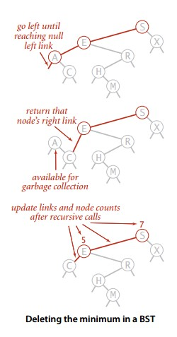 </div><br>

```java
public void deleteMin() {
    root = deleteMin(root);
}
public Node deleteMin(Node x) {
    if (x.left == null) return x.right;
    x.left = deleteMin(x.left);
    x.N = size(x.left) + size(x.right) + 1;
    return x;
}
```

### 8. delete()

如果待删除的节点只有一个子树，那么只需要让指向待删除节点的链接指向唯一的子树即可；否则，让右子树的最小节点替换该节点。

<div align="center"> 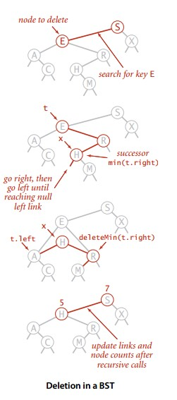 </div><br>

```java
public void delete(Key key) {
    root = delete(root, key);
}
private Node delete(Node x, Key key) {
    if (x == null) return null;
    int cmp = key.compareTo(x.key);
    if (cmp < 0) x.left = delete(x.left, key);
    else if (cmp > 0) x.right = delete(x.right, key);
    else {
        if (x.right == null) return x.left;
        if (x.left == null) return x.right;
        Node t = x;
        x = min(t.right);
        x.right = deleteMin(t.right);
        x.left = t.left;
    }
    x.N = size(x.left) + size(x.right) + 1;
    return x;
}
```

### 9. keys()

利用二叉查找树中序遍历的结果为有序序列的特点。

```java
public Iterable<Key> keys(Key lo, Key hi) {
    Queue<Key> queue = new LinkedList<>();
    keys(root, queue, lo, hi);
    return queue;
}
private void keys(Node x, Queue<Key> queue, Key lo, Key hi) {
    if (x == null) return;
    int cmpLo = lo.compareTo(x.key);
    int cmpHi = hi.compareTo(x.key);
    if (cmpLo < 0) keys(x.left, queue, lo, hi);
    if (cmpLo <= 0 && cmpHi >= 0) queue.add(x.key);
    if (cmpHi > 0) keys(x.right, queue, lo, hi);
}
```

### 10. 性能分析

复杂度：二叉查找树所有操作在最坏的情况下所需要的时间都和树的高度成正比。

## 2-3 查找树

<div align="center"> 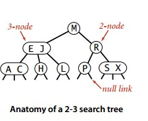 </div><br>

一颗完美平衡的 2-3 查找树的所有空链接到根节点的距离应该是相同的。

### 1. 插入操作

当插入之后产生一个临时 4- 节点时，需要将 4- 节点分裂成 3 个 2- 节点，并将中间的 2- 节点移到上层节点中。如果上移操作继续产生临时 4- 节点则一直进行分裂上移，直到不存在临时 4- 节点。

<div align="center">  </div><br>

### 2. 性质

2-3 查找树插入操作的变换都是局部的，除了相关的节点和链接之外不必修改或者检查树的其它部分，而这些局部变换不会影响树的全局有序性和平衡性。

2-3 查找树的查找和插入操作复杂度和插入顺序  **无关** ，在最坏的情况下查找和插入操作访问的节点必然不超过 logN 个，含有 10 亿个节点的 2-3 查找树最多只需要访问 30 个节点就能进行任意的查找和插入操作。

## 红黑二叉查找树

2-3 查找树需要用到 2- 节点和 3- 节点，红黑树使用红链接来实现 3- 节点。指向一个节点的链接颜色如果为红色，那么这个节点和上层节点表示的是一个 3- 节点，而黑色则是普通链接。

<div align="center">  </div><br>

红黑树具有以下性质：

1. 红链接都为左链接；
2. 完美黑色平衡，即任意空链接到根节点的路径上的黑链接数量相同。

画红黑树时可以将红链接画平。

<div align="center">  </div><br>

```java
public class RedBlackBST<Key extends Comparable<Key>, Value> {
    private Node root;
    private static final boolean RED = true;
    private static final boolean BLACK = false;

    private class Node {
        Key key;
        Value val;
        Node left, right;
        int N;
        boolean color;

        Node(Key key, Value val, int n, boolean color) {
            this.key = key;
            this.val = val;
            N = n;
            this.color = color;
        }
    }

    private boolean isRed(Node x) {
        if (x == null) return false;
        return x.color == RED;
    }
}
```

### 1. 左旋转

因为合法的红链接都为左链接，如果出现右链接为红链接，那么就需要进行左旋转操作。

<div align="center"> 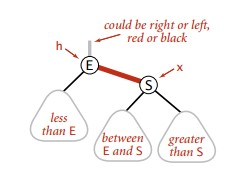 </div><br>

<div align="center">  </div><br>

```java
public Node rotateLeft(Node h) {
    Node x = h.right;
    h.right = x.left;
    x.left = h;
    x.color = h.color;
    h.color = RED;
    x.N = h.N;
    h.N = 1 + size(h.left) + size(h.right);
    return x;
}
```

### 2. 右旋转

进行右旋转是为了转换两个连续的左红链接，这会在之后的插入过程中探讨。

<div align="center"> 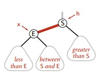 </div><br>

<div align="center">  </div><br>

```java
public Node rotateRight(Node h) {
    Node x = h.left;
    h.left = x.right;
    x.color = h.color;
    h.color = RED;
    x.N = h.N;
    h.N = 1 + size(h.left) + size(h.right);
    return x;
}
```

### 3. 颜色转换

一个 4- 节点在红黑树中表现为一个节点的左右子节点都是红色的。分裂 4- 节点除了需要将子节点的颜色由红变黑之外，同时需要将父节点的颜色由黑变红，从 2-3 树的角度看就是将中间节点移到上层节点。

<div align="center"> 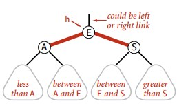 </div><br>

<div align="center"> 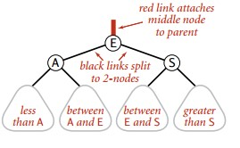 </div><br>

```java
void flipColors(Node h){
    h.color = RED;
    h.left.color = BLACK;
    h.right.color = BLACK;
}
```

### 4. 插入

先将一个节点按二叉查找树的方法插入到正确位置，然后再进行如下颜色操作：

- 如果右子节点是红色的而左子节点是黑色的，进行左旋转；
- 如果左子节点是红色的且它的左子节点也是红色的，进行右旋转；
- 如果左右子节点均为红色的，进行颜色转换。

<div align="center">  </div><br>

```java
public void put(Key key, Value val) {
    root = put(root, key, val);
    root.color = BLACK;
}

private Node put(Node x, Key key, Value val) {
    if (x == null) return new Node(key, val, 1, RED);
    int cmp = key.compareTo(x.key);
    if (cmp == 0) x.val = val;
    else if (cmp < 0) x.left = put(x.left, key, val);
    else x.right = put(x.right, key, val);

    if (isRed(x.right) && !isRed(x.left)) x = rotateLeft(x);
    if (isRed(x.left) && isRed(x.left.left)) x = rotateRight(x);
    if (isRed(x.left) && isRed(x.right)) flipColors(x);

    x.N = size(x.left) + size(x.right) + 1;
    return x;
}
```

可以看到该插入操作和二叉查找树的插入操作类似，只是在最后加入了旋转和颜色变换操作即可。

根节点一定为黑色，因为根节点没有上层节点，也就没有上层节点的左链接指向根节点。flipColors() 有可能会使得根节点的颜色变为红色，每当根节点由红色变成黑色时树的黑链接高度加 1.

### 5. 删除最小键

如果最小键在一个 2- 节点中，那么删除该键会留下一个空链接，就破坏了平衡性，因此要确保最小键不在 2- 节点中。将 2- 节点转换成 3- 节点或者 4- 节点有两种方法，一种是向上层节点拿一个 key，一种是向兄弟节点拿一个 key。如果上层节点是 2- 节点，那么就没办法从上层节点拿 key 了，因此要保证删除路径上的所有节点都不是 2- 节点。在向下删除的过程中，保证以下情况之一发生：

1. 如果当前节点的左子节点不是 2- 节点，完成；
2. 如果当前节点的左子节点是 2- 节点而它的兄弟节点不是 2- 节点，向兄弟节点拿一个 key 过来；
3. 如果当前节点的左子节点和它的兄弟节点都是 2- 节点，将左子节点、父节点中的最小键和最近的兄弟节点合并为一个 4- 节点。

<div align="center">  </div><br>

最后得到一个含有最小键的 3- 节点或者 4- 节点，直接从中删除。然后再从头分解所有临时的 4- 节点。

<div align="center">  </div><br>

### 6. 分析

一颗大小为 N 的红黑树的高度不会超过 2logN。最坏的情况下是它所对应的 2-3 树中构成最左边的路径节点全部都是 3- 节点而其余都是 2- 节点。

红黑树大多数的操作所需要的时间都是对数级别的。

## 散列表

散列表类似于数组，可以把散列表的散列值看成数组的索引值。访问散列表和访问数组元素一样快速，它可以在常数时间内实现查找和插入的符号表。

由于无法通过散列值知道键的大小关系，因此散列表无法实现有序性操作。

### 1. 散列函数

对于一个大小为 M 的散列表，散列函数能够把任意键转换为 [0, M-1] 内的正整数，该正整数即为 hash 值。

散列表有冲突的存在，也就是两个不同的键可能有相同的 hash 值。

散列函数应该满足以下三个条件：

1. 一致性：相等的键应当有相等的 hash 值，两个键相等表示调用 equals() 返回的值相等。
2. 高效性：计算应当简便，有必要的话可以把 hash 值缓存起来，在调用 hash 函数时直接返回。
3. 均匀性：所有键的 hash 值应当均匀地分布到 [0, M-1] 之间，这个条件至关重要，直接影响到散列表的性能。

除留余数法可以将整数散列到 [0, M-1] 之间，例如一个正整数 k，计算 k%M 既可得到一个 [0, M-1] 之间的 hash 值。注意 M 必须是一个素数，否则无法利用键包含的所有信息。例如 M 为 10<sup>k</sup>，那么只能利用键的后 k 位。

对于其它数，可以将其转换成整数的形式，然后利用除留余数法。例如对于浮点数，可以将其表示成二进制形式，然后使用二进制形式的整数值进行除留余数法。

对于有多部分组合的键，每部分都需要计算 hash 值，并且最后合并时需要让每部分 hash 值都具有同等重要的地位。可以将该键看成 R 进制的整数，键中每部分都具有不同的权值。

例如，字符串的散列函数实现如下

```java
int hash = 0;
for(int i = 0; i < s.length(); i++)
    hash = (R * hash + s.charAt(i)) % M;
```

再比如，拥有多个成员的自定义类的哈希函数如下

```java
int hash = (((day * R + month) % M) * R + year) % M;
```

R 的值不是很重要，通常取 31。

Java 中的 hashCode() 实现了 hash 函数，但是默认使用对象的内存地址值。在使用 hashCode() 函数时，应当结合除留余数法来使用。因为内存地址是 32 位整数，我们只需要 31 位的非负整数，因此应当屏蔽符号位之后再使用除留余数法。

```java
int hash = (x.hashCode() & 0x7fffffff) % M;
```

使用 Java 自带的 HashMap 等自带的哈希表实现时，只需要去实现 Key 类型的 hashCode() 函数即可。Java 规定 hashCode() 能够将键均匀分布于所有的 32 位整数，Java 中的 String、Integer 等对象的 hashCode() 都能实现这一点。以下展示了自定义类型如何实现 hashCode()。

```java
public class Transaction{
    private final String who;
    private final Date when;
    private final double amount;

    public int hashCode(){
        int hash = 17;
        hash = 31 * hash + who.hashCode();
        hash = 31 * hash + when.hashCode();
        hash = 31 * hash + ((Double) amount).hashCode();
        return hash;
    }
}
```

### 2. 基于拉链法的散列表

拉链法使用链表来存储 hash 值相同的键，从而解决冲突。此时查找需要分两步，首先查找 Key 所在的链表，然后在链表中顺序查找。

<div align="center">  </div><br>

对于 N 个键，M 条链表 (N>M)，如果哈希函数能够满足均匀性的条件，每条链表的大小趋向于 N/M，因此未命中的查找和插入操作所需要的比较次数为 \~N/M。

### 3. 基于线性探测法的散列表

线性探测法使用空位来解决冲突，当冲突发生时，向前探测一个空位来存储冲突的键。使用线程探测法，数组的大小 M 应当大于键的个数 N（M>N)。

<div align="center">  </div><br>

```java
public class LinearProbingHashST<Key, Value> {
    private int N;
    private int M = 16;
    private Key[] keys;
    private Value[] vals;

    public LinearProbingHashST() {
        init();
    }

    public LinearProbingHashST(int M) {
        this.M = M;
        init();
    }

    private void init() {
        keys = (Key[]) new Object[M];
        vals = (Value[]) new Object[M];
    }

    private int hash(Key key) {
        return (key.hashCode() & 0x7fffffff) % M;
    }
}
```

#### 3.1 查找

```java
public Value get(Key key) {
    for (int i = hash(key); keys[i] != null; i = (i + 1) % M) {
        if (keys[i].equals(key)) {
            return vals[i];
        }
    }
    return null;
}
```

#### 3.2 插入

```java
public void put(Key key, Value val) {
    int i;
    for (i = hash(key); keys[i] != null; i = (i + 1) % M) {
        if (keys[i].equals(key)) {
            vals[i] = val;
            return;
        }
    }
    keys[i] = key;
    vals[i] = val;
    N++;
    resize();
}
```

#### 3.3 删除

删除操作应当将右侧所有相邻的键值重新插入散列表中。

```java
public void delete(Key key) {
    if (!contains(key)) return;
    int i = hash(key);
    while (!key.equals(keys[i])) {
        i = (i + 1) % M;
    }
    keys[i] = null;
    vals[i] = null;
    i = (i + 1) % M;
    while (keys[i] != null) {
        Key keyToRedo = keys[i];
        Value valToRedo = vals[i];
        keys[i] = null;
        vals[i] = null;
        N--;
        put(keyToRedo, valToRedo);
        i = (i + 1) % M;
    }
    N--;
    resize();
}
```

#### 3.4 调整数组大小

线性探测法的成本取决于连续条目的长度，连续条目也叫聚簇。当聚簇很长时，在查找和插入时也需要进行很多次探测。

α = N/M，把 α 称为利用率。理论证明，当 α 小于 1/2 时探测的预计次数只在 1.5 到 2.5 之间。

<div align="center"> 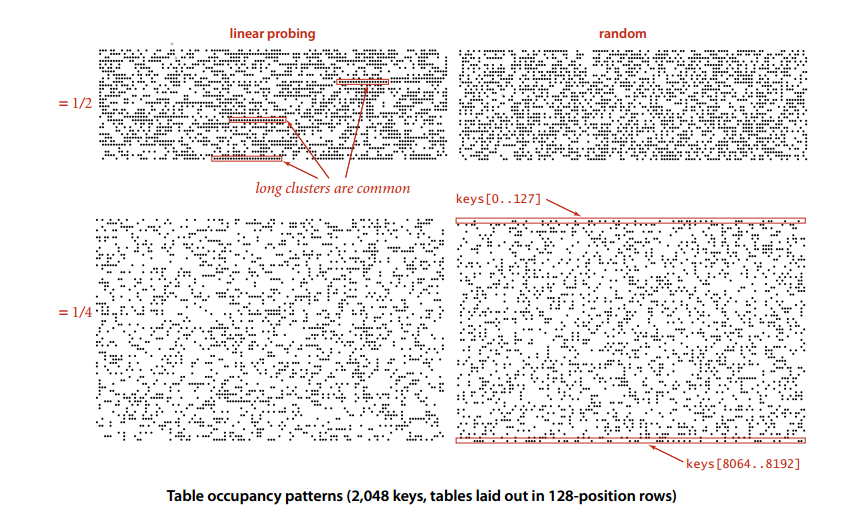 </div><br>

为了保证散列表的性能，应当调整数组的大小，使得 α 在 [1/4, 1/2] 之间。

```java
private void resize() {
    if (N >= M / 2) resize(2 * M);
    else if (N <= M / 8) resize(M / 2);
}

private void resize(int cap) {
    LinearProbingHashST<Key, Value> t = new LinearProbingHashST<>(cap);
    for (int i = 0; i < M; i++) {
        if (keys[i] != null) {
            t.put(keys[i], vals[i]);
        }
    }
    keys = t.keys;
    vals = t.vals;
    M = t.M;
}
```

虽然每次重新调整数组都需要重新把每个键值对插入到散列表，但是从摊还分析的角度来看，所需要的代价却是很小的。从下图可以看出，每次数组长度加倍后，累计平均值都会增加 1，因为表中每个键都需要重新计算散列值，但是随后平均值会下降。

<div align="center"> 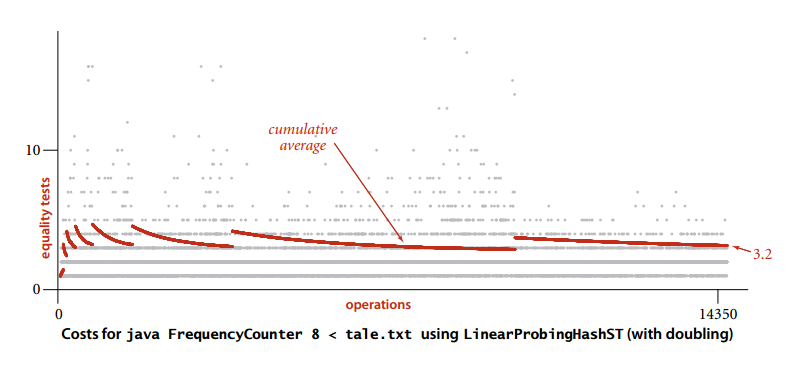 </div><br>

## 应用

### 1. 各种符号表实现的比较

<div align="center">  </div><br>

应当优先考虑散列表，当需要有序性操作时使用红黑树。

### 2. Java 的符号表实现

Java 的 java.util.TreeMap 和 java.util.HashMap 分别是基于红黑树和拉链法的散列表的符号表实现。

### 3. 集合类型

除了符号表，集合类型也经常使用，它只有键没有值，可以用集合类型来存储一系列的键然后判断一个键是否在集合中。

### 4. 稀疏向量乘法

当向量为稀疏向量时，可以使用符号表来存储向量中的非 0 索引和值，使得乘法运算只需要对那些非 0 元素进行即可。

```java
import java.util.HashMap;

public class SparseVector {
    private HashMap<Integer, Double> hashMap;

    public SparseVector(double[] vector) {
        hashMap = new HashMap<>();
        for (int i = 0; i < vector.length; i++) {
            if (vector[i] != 0) {
                hashMap.put(i, vector[i]);
            }
        }
    }

    public double get(int i) {
        return hashMap.getOrDefault(i, 0.0);
    }

    public double dot(SparseVector other) {
        double sum = 0;
        for (int i : hashMap.keySet()) {
            sum += this.get(i) * other.get(i);
        }
        return sum;
    }
}
```
