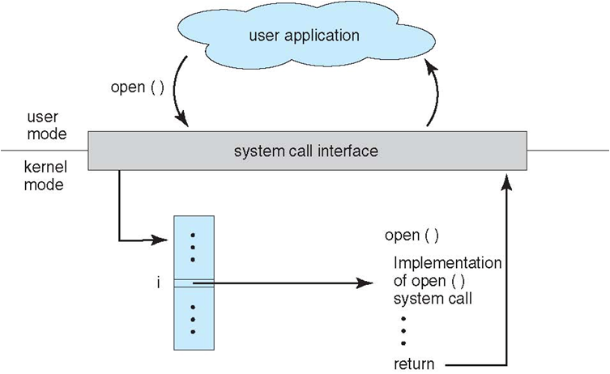
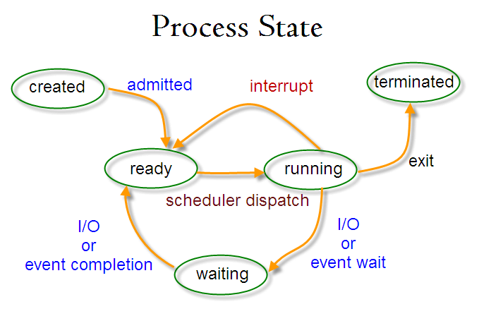
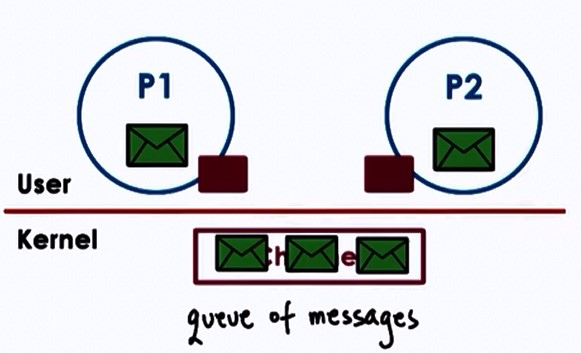
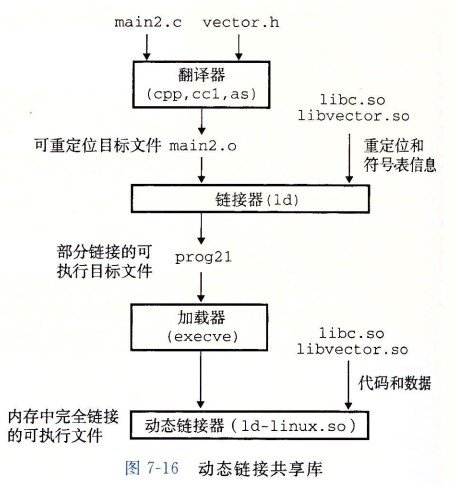

<!-- GFM-TOC -->
* [一、概述](#一概述)
    * [操作系统基本特征](#操作系统基本特征)
    * [操作系统基本功能](#操作系统基本功能)
    * [系统调用](#系统调用)
    * [大内核和微内核](#大内核和微内核)
    * [中断分类](#中断分类)
* [二、进程管理](#二进程管理)
    * [进程与线程](#进程与线程)
    * [进程状态的切换](#进程状态的切换)
    * [调度算法](#调度算法)
    * [进程同步](#进程同步)
    * [经典同步问题](#经典同步问题)
    * [进程通信](#进程通信)
* [三、死锁](#三死锁)
    * [死锁的必要条件](#死锁的必要条件)
    * [死锁的处理方法](#死锁的处理方法)
* [四、内存管理](#四内存管理)
    * [虚拟内存](#虚拟内存)
    * [分页系统地址映射](#分页系统地址映射)
    * [页面置换算法](#页面置换算法)
    * [分段](#分段)
    * [段页式](#段页式)
    * [分页与分段的比较](#分页与分段的比较)
* [五、设备管理](#五设备管理)
    * [磁盘调度算法](#磁盘调度算法)
* [六、链接](#六链接)
    * [编译系统](#编译系统)
    * [目标文件](#目标文件)
    * [静态链接](#静态链接)
    * [动态链接](#动态链接)
* [参考资料](#参考资料)
<!-- GFM-TOC -->


# 一、概述

## 操作系统基本特征

### 1. 并发

并发是指宏观上在一段时间内能同时运行多个程序，而并行则指同一时刻能运行多个指令。

并行需要硬件支持，如多流水线或者多处理器。

操作系统通过引入进程和线程，使得程序能够并发运行。

### 2. 共享

共享是指系统中的资源可以被多个并发进程共同使用。

有两种共享方式：互斥共享和同时共享。

互斥共享的资源称为临界资源，例如打印机等，在同一时间只允许一个进程访问，需要用同步机制来实现对临界资源的访问。

### 3. 虚拟

虚拟技术把一个物理实体转换为多个逻辑实体。

主要有两种虚拟技术：时分复用技术和空分复用技术。例如多个进程能在同一个处理器上并发执行使用了时分复用技术，让每个进程轮流占有处理器，每次只执行一小个时间片并快速切换。

### 4. 异步

异步指进程不是一次性执行完毕，而是走走停停，以不可知的速度向前推进。

## 操作系统基本功能

### 1. 进程管理

进程控制、进程同步、进程通信、死锁处理、处理机调度等。

### 2. 内存管理

内存分配、地址映射、内存保护与共享、虚拟内存等。

### 3. 文件管理

文件存储空间的管理、目录管理、文件读写管理和保护等。

### 4. 设备管理

完成用户的 I/O 请求，方便用户使用各种设备，并提高设备的利用率。

主要包括缓冲管理、设备分配、设备处理、虛拟设备等。

## 系统调用

如果一个进程在用户态需要使用内核态的功能，就进行系统调用从而陷入内核，由操作系统代为完成。

<div align="center">  </div><br>

Linux 的系统调用主要有以下这些：

| Task | Commands |
| :---: | --- |
| 进程控制 | fork(); exit(); wait(); |
| 进程通信 | pipe(); shmget(); mmap(); |
| 文件操作 | open(); read(); write(); |
| 设备操作 | ioctl(); read(); write(); |
| 信息维护 | getpid(); alarm(); sleep(); |
| 安全 | chmod(); umask(); chown(); |

## 大内核和微内核

### 1. 大内核

大内核是将操作系统功能作为一个紧密结合的整体放到内核。

由于各模块共享信息，因此有很高的性能。

### 2. 微内核

由于操作系统不断复杂，因此将一部分操作系统功能移出内核，从而降低内核的复杂性。移出的部分根据分层的原则划分成若干服务，相互独立。

在微内核结构下，操作系统被划分成小的、定义良好的模块，只有微内核这一个模块运行在内核态，其余模块运行在用户态。

因为需要频繁地在用户态和核心态之间进行切换，所以会有一定的性能损失。

<div align="center">  </div><br>

## 中断分类

### 1. 外中断

由 CPU 执行指令以外的事件引起，如 I/O 结束中断，表示设备输入/输出处理已经完成，处理器能够发送下一个输入/输出请求。此外还有时钟中断、控制台中断等。

### 2. 异常

由 CPU 执行指令的内部事件引起，如非法操作码、地址越界、算术溢出等。

### 3. 陷入

在用户程序中使用系统调用。

# 二、进程管理

## 进程与线程

### 1. 进程

进程是资源分配的基本单位。

进程控制块 (Process Control Block, PCB) 描述进程的基本信息和运行状态，所谓的创建进程和撤销进程，都是指对 PCB 的操作。

下图显示了 4 个程序创建了 4 个进程，这 4 个进程可以并发地执行。

<div align="center">  </div><br>

### 2. 线程

线程是独立调度的基本单位。

一个进程中可以有多个线程，它们共享进程资源。

<div align="center">  </div><br>

### 3. 区别

- 拥有资源：进程是资源分配的基本单位，但是线程不拥有资源，线程可以访问隶属进程的资源。

- 调度：线程是独立调度的基本单位，在同一进程中，线程的切换不会引起进程切换，从一个进程内的线程切换到另一个进程中的线程时，会引起进程切换。

- 系统开销：由于创建或撤销进程时，系统都要为之分配或回收资源，如内存空间、I/O 设备等，所付出的开销远大于创建或撤销线程时的开销。类似地，在进行进程切换时，涉及当前执行进程 CPU 环境的保存及新调度进程 CPU 环境的设置，而线程切换时只需保存和设置少量寄存器内容，开销很小。

- 通信方面：进程间通信 (IPC) 需要进程同步和互斥手段的辅助，以保证数据的一致性。而线程间可以通过直接读/写同一进程中的数据段（如全局变量）来进行通信。

举例：QQ 和浏览器是两个进程，浏览器进程里面有很多线程，例如 HTTP 请求线程、事件响应线程、渲染线程等等，线程的并发执行使得在浏览器中点击一个新链接从而发起 HTTP 请求时，浏览器还可以响应用户的其它事件。

## 进程状态的切换

<div align="center">  </div><br>

- 就绪状态（ready）：等待被调度
- 运行状态（running）
- 阻塞状态（waiting）：等待资源

应该注意以下内容：

- 只有就绪态和运行态可以相互转换，其它的都是单向转换。就绪状态的进程通过调度算法从而获得 CPU 时间，转为运行状态；而运行状态的进程，在分配给它的 CPU 时间片用完之后就会转为就绪状态，等待下一次调度。
- 阻塞状态是缺少需要的资源从而由运行状态转换而来，但是该资源不包括 CPU 时间，缺少 CPU 时间会从运行态转换为就绪态。

## 调度算法

需要针对不同环境来讨论调度算法。

### 1. 批处理系统中的调度

**（一）先来先服务 first-come first-serverd（FCFS）** 

调度最先进入就绪队列的作业。

有利于长作业，但不利于短作业，因为短作业必须一直等待前面的长作业执行完毕才能执行，而长作业又需要执行很长时间，造成了短作业等待时间过长。

**（二）短作业优先 shortest job first（SJF）** 

调度估计运行时间最短的作业。

长作业有可能会饿死，处于一直等待短作业执行完毕的状态。因为如果一直有短作业到来，那么长作业永远得不到调度。

**（三）最短剩余时间优先 shortest remaining time next（SRTN）** 

### 2. 交互式系统中的调度

**（一）优先级调度** 

除了可以手动赋予优先权之外，还可以把响应比作为优先权，这种调度方式叫做高响应比优先调度算法。

响应比 = (等待时间 + 要求服务时间) / 要求服务时间 = 响应时间 / 要求服务时间

这种调度算法主要是为了解决短作业优先调度算法长作业可能会饿死的问题，因为随着等待时间的增长，响应比也会越来越高。

**（二）时间片轮转** 

将所有就绪进程按 FCFS 的原则排成一个队列，每次调度时，把 CPU 时间分配给队首进程，该进程可以执行一个时间片。当时间片用完时，由计时器发出时钟中断，调度程序便停止该进程的执行，并将它送往就绪队列的末尾，同时继续把 CPU 时间分配给队首的进程。

时间片轮转算法的效率和时间片的大小有很大关系。因为进程切换都要保存进程的信息并且载入新进程的信息，如果时间片太小，会导致进程切换得太频繁，在进程切换上就会花过多时间。

**（三）多级反馈队列** 

<div align="center">  </div><br>

如果一个进程需要执行 100 个时间片，如果采用轮转调度算法，那么需要交换 100 次。多级队列是为这种需要连续执行多个时间片的进程考虑，它设置了多个队列，每个队列时间片大小都不同，例如 1,2,4,8,..。进程在第一个队列没执行完，就会被移到下一个队列。这种方式下，之前的进程只需要交换 7 次。

每个队列优先权也不同，最上面的优先权最高。因此只有上一个队列没有进程在排队，才能调度当前队列上的进程。

### 3. 实时系统中的调度

实时系统要求一个服务请求在一个确定时间内得到响应。

分为硬实时和软实时，前者必须满足绝对的截止时间，后者可以容忍一定的超时。

## 进程同步

### 1. 临界区

对临界资源进行访问的那段代码称为临界区。

为了互斥访问临界资源，每个进程在进入临界区之前，需要先进行检查。

```html
// entry section
// critical section;
// exit section
```

### 2. 同步与互斥

- 同步：多个进程按一定顺序执行；
- 互斥：多个进程在同一时刻只有一个进程能进入临界区。

### 3. 信号量

信号量（Semaphore）是一个整型变量，可以对其执行 down 和 up 操作，也就是常见的 P 和 V 操作。

-  **down**  : 如果信号量大于 0 ，执行 -1 操作；如果信号量等于 0，进程睡眠，等待信号量大于 0；
-  **up** ：对信号量执行 +1 操作，唤醒睡眠的进程让其完成 down 操作。

down 和 up 操作需要被设计成原语，不可分割，通常的做法是在执行这些操作的时候屏蔽中断。

如果信号量的取值只能为 0 或者 1，那么就成为了  **互斥量（Mutex）** ，0 表示临界区已经加锁，1 表示临界区解锁。

```c
typedef int semaphore;
semaphore mutex = 1;
void P1() {
    down(&mutex);
    // 临界区
    up(&mutex);
}

void P2() {
    down(&mutex);
    // 临界区
    up(&mutex);
}
```

<font size=3>  **使用信号量实现生产者-消费者问题**  </font> </br>

问题描述：使用一个缓冲区来保存物品，只有缓冲区没有满，生产者才可以放入物品；只有缓冲区不为空，消费者才可以拿走物品。

因为缓冲区属于临界资源，因此需要使用一个互斥量 mutex 来控制对缓冲区的互斥访问。

为了同步生产者和消费者的行为，需要记录缓冲区中物品的数量。数量可以使用信号量来进行统计，这里需要使用两个信号量：empty 记录空缓冲区的数量，full 记录满缓冲区的数量。其中，empty 信号量是在生产者进程中使用，当 empty 不为 0 时，生产者才可以放入物品；full 信号量是在消费者进程中使用，当 full 信号量不为 0 时，消费者才可以取走物品。

注意，不能先对缓冲区进行加锁，再测试信号量。也就是说，不能先执行 down(mutex) 再执行 down(empty)。如果这么做了，那么可能会出现这种情况：生产者对缓冲区加锁后，执行 down(empty) 操作，发现 empty = 0，此时生产者睡眠。消费者不能进入临界区，因为生产者对缓冲区加锁了，也就无法执行 up(empty) 操作，empty 永远都为 0，那么生产者和消费者就会一直等待下去，造成死锁。

```c
#define N 100
typedef int semaphore;
semaphore mutex = 1;
semaphore empty = N;
semaphore full = 0;

void producer() {
    while(TRUE){
        int item = produce_item();
        down(&empty);
        down(&mutex);
        insert_item(item);
        up(&mutex);
        up(&full);
    }
}

void consumer() {
    while(TRUE){
        down(&full);
        down(&mutex);
        int item = remove_item();
        up(&mutex);
        up(&empty);
        consume_item(item);
    }
}
```

### 4. 管程

使用信号量机制实现的生产者消费者问题需要客户端代码做很多控制，而管程把控制的代码独立出来，不仅不容易出错，也使得客户端代码调用更容易。

c 语言不支持管程，下面的示例代码使用了类 Pascal 语言来描述管程。示例代码的管程提供了 insert() 和 remove() 方法，客户端代码通过调用这两个方法来解决生产者-消费者问题。

```pascal
monitor ProducerConsumer
    integer i;
    condition c;

    procedure insert();
    begin
        // ...
    end;

    procedure remove();
    begin
        // ...
    end;
end monitor;
```

管程有一个重要特性：在一个时刻只能有一个进程使用管程。进程在无法继续执行的时候不能一直占用管程，否者其它进程永远不能使用管程。

管程引入了  **条件变量**  以及相关的操作：**wait()** 和 **signal()** 来实现同步操作。对条件变量执行 wait() 操作会导致调用进程阻塞，把管程让出来给另一个进程持有。signal() 操作用于唤醒被阻塞的进程。

<font size=3> **使用管程实现生成者-消费者问题** </font><br>

```pascal
// 管程
monitor ProducerConsumer
    condition full, empty;
    integer count := 0;
    condition c;

    procedure insert(item: integer);
    begin
        if count = N then wait(full);
        insert_item(item);
        count := count + 1;
        if count = 1 then signal(empty);
    end;

    function remove: integer;
    begin
        if count = 0 then wait(empty);
        remove = remove_item;
        count := count - 1;
        if count = N -1 then signal(full);
    end;
end monitor;

// 生产者客户端
procedure producer
begin
    while true do
    begin
        item = produce_item;
        ProducerConsumer.insert(item);
    end
end;

// 消费者客户端
procedure consumer
begin
    while true do
    begin
        item = ProducerConsumer.remove;
        consume_item(item);
    end
end;
```

## 经典同步问题

生产者和消费者问题前面已经讨论过了。

### 1. 读者-写者问题

允许多个进程同时对数据进行读操作，但是不允许读和写以及写和写操作同时发生。

一个整型变量 count 记录在对数据进行读操作的进程数量，一个互斥量 count_mutex 用于对 count 加锁，一个互斥量 data_mutex 用于对读写的数据加锁。

```c
typedef int semaphore;
semaphore count_mutex = 1;
semaphore data_mutex = 1;
int count = 0;

void reader() {
    while(TRUE) {
        down(&count_mutex);
        count++;
        if(count == 1) down(&data_mutex); // 第一个读者需要对数据进行加锁，防止写进程访问
        up(&count_mutex);
        read();
        down(&count_mutex);
        count--;
        if(count == 0) up(&data_mutex);
        up(&count_mutex);
    }
}

void writer() {
    while(TRUE) {
        down(&data_mutex);
        write();
        up(&data_mutex);
    }
}
```

### 2. 哲学家进餐问题

<div align="center">  </div><br>

五个哲学家围着一张圆桌，每个哲学家面前放着食物。哲学家的生活有两种交替活动：吃饭以及思考。当一个哲学家吃饭时，需要先拿起自己左右两边的两根筷子，并且一次只能拿起一根筷子。

下面是一种错误的解法，考虑到如果所有哲学家同时拿起左手边的筷子，那么就无法拿起右手边的筷子，造成死锁。

```c
#define N 5

void philosopher(int i) {
    while(TRUE) {
        think();
        take(i);       // 拿起左边的筷子
        take((i+1)%N); // 拿起右边的筷子
        eat();
        put(i);
        put((i+1)%N);
    }
}
```

为了防止死锁的发生，可以设置两个条件：

- 必须同时拿起左右两根筷子；
- 只有在两个邻居都没有进餐的情况下才允许进餐。

```c
#define N 5
#define LEFT (i + N - 1) % N // 左邻居
#define RIGHT (i + 1) % N    // 右邻居
#define THINKING 0
#define HUNGRY   1
#define EATING   2
typedef int semaphore;
int state[N];                // 跟踪每个哲学家的状态
semaphore mutex = 1;         // 临界区的互斥
semaphore s[N];              // 每个哲学家一个信号量

void philosopher(int i) {
    while(TRUE) {
        think();
        take_two(i);
        eat();
        put_tow(i);
    }
}

void take_two(int i) {
    down(&mutex);
    state[i] = HUNGRY;
    test(i);
    up(&mutex);
    down(&s[i]);
}

void put_tow(i) {
    down(&mutex);
    state[i] = THINKING;
    test(LEFT);
    test(RIGHT);
    up(&mutex);
}

void test(i) {         // 尝试拿起两把筷子
    if(state[i] == HUNGRY && state[LEFT] != EATING && state[RIGHT] !=EATING) {
        state[i] = EATING;
        up(&s[i]);
    }
}
```

## 进程通信

进程同步与进程通信很容易混淆，它们的区别在于：

- 进程同步：控制多个进程按一定顺序执行；
- 进程通信：进程间传输信息。

进程通信是一种手段，而进程同步是一种目的。也可以说，为了能够达到进程同步的目的，需要让进程进行通信，传输一些进程同步所需要的信息。

### 1. 信号量

在进程同步中介绍的信号量也属于进程通信的一种方式，但是属于低级别的进程通信，因为它传输的信息非常小。

### 2. 消息传递

操作系统提供了用于通信的通道（Channel），进程可以通过读写这个通道进行通信。

<div align="center">  </div><br>

**（一）管道** 

写进程在管道的尾端写入数据，读进程在管道的首端读出数据。管道提供了简单的流控制机制，进程试图读空管道时，在有数据写入管道前，进程将一直阻塞。同样地，管道已经满时，进程再试图写管道，在其它进程从管道中移走数据之前，写进程将一直阻塞。

Linux 中管道通过空文件实现。

管道有三种：

- 普通管道：有两个限制，一是只能单向传输；二是只能在父子进程之间使用；
- 流管道：去除第一个限制，支持双向传输；
- 命名管道：去除第二个限制，可以在不相关进程之间进行通信。

<div align="center">  </div><br>

**（二）消息队列** 

消息队列克服了信号量传递信息少、管道只能承载无格式字节流以及缓冲区大小受限等缺点。

<div align="center">  </div><br>

**（三）套接字** 

套接字也是一种进程间通信机制，与其它通信机制不同的是，它可用于不同机器间的进程通信。

<div align="center">  </div><br>

### 3. 共享内存

操作系统建立一块共享内存，并将其映射到每个进程的地址空间上，进程就可以直接对这块共享内存进行读写。

共享内存是最快的进程通信方式。

<div align="center">  </div><br>

# 三、死锁

## 死锁的必要条件

<div align="center">  </div><br>

- 互斥：每个资源要么已经分配给了一个进程，要么就是可用的。
- 占有和等待：已经得到了某个资源的进程可以再请求新的资源。
- 不可抢占：已经分配给一个进程的资源不能强制性地被抢占，它只能被占有它的进程显式地释放。
- 环路等待：有两个或者两个以上的进程组成一条环路，该环路中的每个进程都在等待下一个进程所占有的资源。

## 死锁的处理方法

### 1. 鸵鸟策略

把头埋在沙子里，假装根本没发生问题。

因为解决死锁问题的代价很高，因此鸵鸟策略这种不采取任务措施的方案会获得更高的性能。当发生死锁时不会对用户造成多大影响，或发生死锁的概率很低，可以采用鸵鸟策略。

大多数操作系统，包括 Unix，Linux 和 Windows，处理死锁问题的办法仅仅是忽略它。

### 2. 死锁检测与死锁恢复

不试图阻止死锁，而是当检测到死锁发生时，采取措施进行恢复。

**（一）每种类型一个资源的死锁检测** 

<div align="center">  </div><br>

上图为资源分配图，其中方框表示资源，圆圈表示进程。资源指向进程表示该资源已经分配给该进程，进程指向资源表示进程请求获取该资源。

图 a 可以抽取出环，如图 b，它满足了环路等待条件，因此会发生死锁。

每种类型一个资源的死锁检测算法是通过检测有向图是否存在环来实现，从一个节点出发进行深度优先搜索，对访问过的节点进行标记，如果访问了已经标记的节点，就表示有向图存在环，也就是检测到死锁的发生。

**（二）每种类型多个资源的死锁检测** 

<div align="center">  </div><br>

上图中，有三个进程四个资源，每个数据代表的含义如下：

- E 向量：资源总量
- A 向量：资源剩余量
- C 矩阵：每个进程所拥有的资源数量，每一行都代表一个进程拥有资源的数量
- R 矩阵：每个进程请求的资源数量

进程 P<sub>1</sub> 和 P<sub>2</sub> 所请求的资源都得不到满足，只有进程 P<sub>3</sub> 可以，让 P<sub>3</sub> 执行，之后释放 P<sub>3</sub> 拥有的资源，此时 A = (2 2 2 0)。P<sub>2</sub> 可以执行，执行后释放 P<sub>2</sub> 拥有的资源，A = (4 2 2 1) 。P<sub>1</sub> 也可以执行。所有进程都可以顺利执行，没有死锁。

算法总结如下：

每个进程最开始时都不被标记，执行过程有可能被标记。当算法结束时，任何没有被标记的进程都是死锁进程。

1. 寻找一个没有标记的进程 P<sub>i</sub>，它所请求的资源小于等于 A。
2. 如果找到了这样一个进程，那么将 C 矩阵的第 i 行向量加到 A 中，标记该进程，并转回 1。
3. 如果没有这样一个进程，算法终止。

**（三）死锁恢复** 

- 利用抢占恢复
- 利用回滚恢复
- 通过杀死进程恢复

### 3. 死锁预防

在程序运行之前预防发生死锁。

**（一）破坏互斥条件** 

例如假脱机打印机技术允许若干个进程同时输出，唯一真正请求物理打印机的进程是打印机守护进程。

**（二）破坏占有和等待条件** 

一种实现方式是规定所有进程在开始执行前请求所需要的全部资源。

**（三）破坏不可抢占条件** 

**（四）破坏环路等待** 

给资源统一编号，进程只能按编号顺序来请求资源。

### 4. 死锁避免

在程序运行时避免发生死锁。

**（一）安全状态** 

<div align="center">  </div><br>

图 a 的第二列 Has 表示已拥有的资源数，第三列 Max 表示总共需要的资源数，Free 表示还有可以使用的资源数。从图 a 开始出发，先让 B 拥有所需的所有资源（图 b），运行结束后释放 B，此时 Free 变为 5（图 c）；接着以同样的方式运行 C 和 A，使得所有进程都能成功运行，因此可以称图 a 所示的状态时安全的。

定义：如果没有死锁发生，并且即使所有进程突然请求对资源的最大需求，也仍然存在某种调度次序能够使得每一个进程运行完毕，则称该状态是安全的。

安全状态的检测与死锁的检测类似，因为安全状态必须要求不能发生死锁。下面的银行家算法与死锁检测算法非常类似，可以结合着做参考对比。

**（二）单个资源的银行家算法** 

一个小城镇的银行家，他向一群客户分别承诺了一定的贷款额度，算法要做的是判断对请求的满足是否会进入不安全状态，如果是，就拒绝请求；否则予以分配。

<div align="center">  </div><br>

上图 c 为不安全状态，因此算法会拒绝之前的请求，从而避免进入图 c 中的状态。

**（三）多个资源的银行家算法** 

<div align="center">  </div><br>

上图中有五个进程，四个资源。左边的图表示已经分配的资源，右边的图表示还需要分配的资源。最右边的 E、P 以及 A 分别表示：总资源、已分配资源以及可用资源，注意这三个为向量，而不是具体数值，例如 A=(1020)，表示 4 个资源分别还剩下 1/0/2/0。

检查一个状态是否安全的算法如下：

- 查找右边的矩阵是否存在一行小于等于向量 A。如果不存在这样的行，那么系统将会发生死锁，状态是不安全的。
- 假若找到这样一行，将该进程标记为终止，并将其已分配资源加到 A 中。
- 重复以上两步，直到所有进程都标记为终止，则状态时安全的。

如果一个状态不是安全的，需要拒绝进入这个状态。

# 四、内存管理

## 虚拟内存

虚拟内存的目的是为了让物理内存扩充成更大的逻辑内存，从而让程序获得更多的可用内存。

为了更好的管理内存，操作系统将内存抽象成地址空间。每个程序拥有自己的地址空间，这个地址空间被分割成多个块，每一块称为一页。这些页被映射到物理内存，但不需要映射到连续的物理内存，也不需要所有页都必须在物理内存中。当程序引用到一部分不在物理内存中的地址空间时，由硬件执行必要的映射，将缺失的部分装入物理内存并重新执行失败的指令。

从上面的描述中可以看出，虚拟内存允许程序地址空间中的每一页都映射到物理内存，也就是说一个程序不需要全部调入内存就可以运行，这使得有限的内存运行大程序称为可能。例如有一台计算机可以产生 16 位地址，那么一个程序的地址空间范围是 0\~64K。该计算机只有 32KB 的物理内存，虚拟内存技术允许该计算机运行一个 64K 大小的程序。

<div align="center">  </div><br>

## 分页系统地址映射

- 内存管理单元（MMU）：管理着地址空间和物理内存的转换。
- 页表（Page table）：页（地址空间）和页框（物理内存空间）的映射表。例如下图中，页表的第 0 个表项为 010，表示第 0 个页映射到第 2 个页框。页表项的最后一位用来标记页是否在内存中。

下图的页表存放着 16 个页，这 16 个页需要用 4 个比特位来进行索引定位。因此对于虚拟地址（0010 000000000100），前 4 位是用来存储页面号，而后 12 位存储在页中的偏移量。

（0010 000000000100）根据前 4 位得到页号为 2，读取表项内容为（110 1），它的前 3 为为页框号，最后 1 位表示该页在内存中。最后映射得到物理内存地址为（110 000000000100）。

<div align="center">  </div><br>

## 页面置换算法

在程序运行过程中，如果要访问的页面不在内存中，就发生缺页中断从而将该页调入内存中。此时如果内存已无空闲空间，系统必须从内存中调出一个页面到磁盘对换区中来腾出空间。

页面置换算法的主要目标是使页面置换频率最低（也可以说缺页率最低）。

### 1. 最佳

> Optimal

所选择的被换出的页面将是最长时间内不再被访问，通常可以保证获得最低的缺页率。

是一种理论上的算法，因为无法知道一个页面多长时间不再被访问。

举例：一个系统为某进程分配了三个物理块，并有如下页面引用序列：

<div align="center"></div> <br>

开始运行时，先将 7, 0, 1 三个页面装入内存。当进程要访问页面 2 时，产生缺页中断，会将页面 7 换出，因为页面 7 再次被访问的时间最长。

### 2. 先进先出

> FIFO, First In First Out

所选择换出的页面是最先进入的页面。

该算法会将那些经常被访问的页面也被换出，从而使缺页率升高。

### 3. 最近最久未使用

> LRU, Least Recently Used

虽然无法知道将来要使用的页面情况，但是可以知道过去使用页面的情况。LRU 将最近最久未使用的页面换出。

可以用栈来实现该算法，栈中存储页面的页面号。当进程访问一个页面时，将该页面的页面号从栈移除，并将它压入栈顶。这样，最近被访问的页面总是在栈顶，而最近最久未使用的页面总是在栈底。

<div align="center"></div> <br>

<div align="center">  </div><br>

### 4. 时钟

> Clock

需要用到一个访问位，当一个页面被访问时，将访问位置为 1。

首先，将内存中的所有页面链接成一个循环队列，当缺页中断发生时，检查当前指针所指向页面的访问位，如果访问位为 0，就将该页面换出；否则将该页的访问位设置为 0，给该页面第二次的机会，移动指针继续检查。

<div align="center">  </div><br>

## 分段

虚拟内存采用的是分页技术，也就是将地址空间划分成固定大小的页，每一页再与内存进行映射。

下图为一个编译器在编译过程中建立的多个表，有 4 个表是动态增长的，如果使用分页系统的一维地址空间，动态增长的特点会导致覆盖问题的出现。

<div align="center">  </div><br>

分段的做法是把每个表分成段，一个段构成一个独立的地址空间。每个段的长度可以不同，并且可以动态增长。

<div align="center">  </div><br>

## 段页式

程序的地址空间划分成多个拥有独立地址空间的段，每个段上的地址空间划分成大小相同的页。这样既拥有分段系统的共享和保护，又拥有分页系统的虚拟内存功能。

## 分页与分段的比较

- 对程序员的透明性：分页透明，但是分段需要程序员显示划分每个段。

- 地址空间的维度：分页是一维地址空间，分段是二维的。

- 大小是否可以改变：页的大小不可变，段的大小可以动态改变。

- 出现的原因：分页主要用于实现虚拟内存，从而获得更大的地址空间；分段主要是为了使程序和数据可以被划分为逻辑上独立的地址空间并且有助于共享和保护。

# 五、设备管理

## 磁盘调度算法

当多个进程同时请求访问磁盘时，需要进行磁盘调度来控制对磁盘的访问。

磁盘调度的主要目标是使磁盘的平均寻道时间最少。

### 1. 先来先服务

> FCFS, First Come First Served

根据进程请求访问磁盘的先后次序来进行调度。优点是公平和简单，缺点也很明显，因为未对寻道做任何优化，使平均寻道时间可能较长。

### 2. 最短寻道时间优先

> SSTF, Shortest Seek Time First

要求访问的磁道与当前磁头所在磁道距离最近的优先进行调度。这种算法并不能保证平均寻道时间最短，但是比 FCFS 好很多。

### 3. 扫描算法

> SCAN

SSTF 会出现饥饿现象。考虑以下情况，新进程请求访问的磁道与磁头所在磁道的距离总是比一个在等待的进程来的近，那么等待的进程会一直等待下去。

SCAN 算法在 SSTF 算法之上考虑了磁头的移动方向，要求所请求访问的磁道在磁头当前移动方向上才能够得到调度。因为考虑了移动方向，那么一个进程请求访问的磁道一定会得到调度。

当一个磁头自里向外移动时，移到最外侧会改变移动方向为自外向里，这种移动的规律类似于电梯的运行，因此又常称 SCAN 算法为电梯调度算法。

### 4. 循环扫描算法

> CSCAN

CSCAN 对 SCAN 进行了改动，要求磁头始终沿着一个方向移动。

# 六、链接

## 编译系统

以下是一个 hello.c 程序：

```c
#include <stdio.h>

int main()
{
    printf("hello, world\n");
    return 0;
}
```

在 Unix 系统上，由编译器把源文件转换为目标文件。

```bash
gcc -o hello hello.c
```

这个过程大致如下：

<div align="center">  </div><br>

- 预处理阶段：处理以 # 开头的预处理命令；
- 编译阶段：翻译成汇编文件；
- 汇编阶段：将汇编文件翻译成可重定向目标文件，它是二进制的；
- 链接阶段：将可重定向目标文件和 printf.o 等单独预编译好的目标文件进行合并，得到最终的可执行目标文件。

## 目标文件

- 可执行目标文件：可以直接在内存中执行；
- 可重定向目标文件：可与其它可重定向目标文件在链接阶段合并，创建一个可执行目标文件；
- 共享目标文件：可以在运行时被动态加载进内存并链接；

## 静态链接

静态连接器以一组可重定向目标文件为输入，生成一个完全链接的可执行目标文件作为输出。链接器主要完成以下两个任务：

- 符号解析：每个符号对应于一个函数、一个全局变量或一个静态变量，符号解析的目的是将每个符号引用与一个符号定义关联起来。
- 重定位：编译器和汇编器生成从地址 0 开始的代码和数据节，链接器通过把每个符号定义与一个内存位置关联起来，从而重定位这些节，然后修改所有对这些符号的引用，使得它们指向这个内存位置。

<div align="center">  </div><br>

## 动态链接

静态库有以下两个问题：

- 当静态库更新时那么整个程序都要重新进行链接；
- 对于 printf 这种标准函数库，如果每个程序都要有代码，这会极大浪费资源。

共享库是为了解决静态库的这两个问题而设计的，在 Linux 系统中通常用 .so 后缀来表示，Windows 系统上它们被称为 DLL。它具有以下特点：

- 在给定的文件系统中一个库只有一个 .so 文件，所有引用该库的可执行目标文件都共享这个文件，它不会被复制到引用它的可执行文件中；
- 在内存中，一个共享库的 .text 节的一个副本可以被不同的正在运行的进程共享。

<div align="center">  </div><br>

# 参考资料

- Tanenbaum A S, Bos H. Modern operating systems[M]. Prentice Hall Press, 2014.
- 汤子瀛, 哲凤屏, 汤小丹. 计算机操作系统[M]. 西安电子科技大学出版社, 2001.
- Bryant, R. E., & O’Hallaron, D. R. (2004). 深入理解计算机系统.
- [Operating System Notes](https://applied-programming.github.io/Operating-Systems-Notes/)
- [进程间的几种通信方式](http://blog.csdn.net/yufaw/article/details/7409596)
- [Operating-System Structures](https://www.cs.uic.edu/\~jbell/CourseNotes/OperatingSystems/2_Structures.html)
- [Processes](http://cse.csusb.edu/tongyu/courses/cs460/notes/process.php)
- [Inter Process Communication Presentation[1]](https://www.slideshare.net/rkolahalam/inter-process-communication-presentation1)
