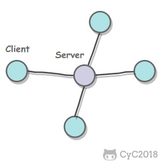
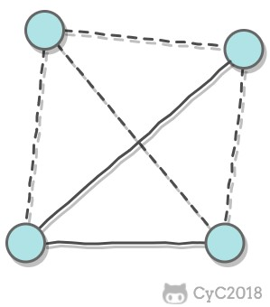

<!-- GFM-TOC -->
* [网络的网络](#网络的网络)
* [ISP](#isp)
* [主机之间的通信方式](#主机之间的通信方式)
* [电路交换与分组交换](#电路交换与分组交换)
    * [1. 电路交换](#1-电路交换)
    * [2. 分组交换](#2-分组交换)
* [时延](#时延)
    * [1. 排队时延](#1-排队时延)
    * [2. 处理时延](#2-处理时延)
    * [3. 传输时延](#3-传输时延)
    * [4. 传播时延](#4-传播时延)
* [计算机网络体系结构](#计算机网络体系结构)
    * [1. 五层协议](#1-五层协议)
    * [2. OSI](#2-osi)
    * [3. TCP/IP](#3-tcpip)
    * [4. 数据在各层之间的传递过程](#4-数据在各层之间的传递过程)
<!-- GFM-TOC -->

# 网络的网络

网络把主机连接起来，而互联网是把多种不同的网络连接起来，因此互联网是网络的网络。

  
 

# ISP

互联网服务提供商 ISP 可以从互联网管理机构获得许多 IP 地址，同时拥有通信线路以及路由器等联网设备，个人或机构向 ISP 缴纳一定的费用就可以接入互联网。

  
 

目前的互联网是一种多层次 ISP 结构，ISP 根据覆盖面积的大小分为第一层 ISP、区域 ISP 和接入 ISP。互联网交换点 IXP 允许两个 ISP 直接相连而不用经过第三个 ISP。

  
 

# 主机之间的通信方式

- 客户-服务器（C/S）：客户是服务的请求方，服务器是服务的提供方。

  
 

- 对等（P2P）：不区分客户和服务器。

  
 

# 电路交换与分组交换

## 1. 电路交换

电路交换用于电话通信系统，两个用户要通信之前需要建立一条专用的物理链路，并且在整个通信过程中始终占用该链路。由于通信的过程中不可能一直在使用传输线路，因此电路交换对线路的利用率很低，往往不到 10%。

## 2. 分组交换

每个分组都有首部和尾部，包含了源地址和目的地址等控制信息，在同一个传输线路上同时传输多个分组互相不会影响，因此在同一条传输线路上允许同时传输多个分组，也就是说分组交换不需要占用传输线路。

在一个邮局通信系统中，邮局收到一份邮件之后，先存储下来，然后把相同目的地的邮件一起转发到下一个目的地，这个过程就是存储转发过程，分组交换也使用了存储转发过程。

# 时延

总时延 = 排队时延 + 处理时延 + 传输时延 + 传播时延

  
 

## 1. 排队时延

分组在路由器的输入队列和输出队列中排队等待的时间，取决于网络当前的通信量。

## 2. 处理时延

主机或路由器收到分组时进行处理所需要的时间，例如分析首部、从分组中提取数据、进行差错检验或查找适当的路由等。

## 3. 传输时延

主机或路由器传输数据帧所需要的时间。

<!-- 

   -->

  
 

其中 l 表示数据帧的长度，v 表示传输速率。

## 4. 传播时延

电磁波在信道中传播所需要花费的时间，电磁波传播的速度接近光速。

<!-- 

   -->

  
 

其中 l 表示信道长度，v 表示电磁波在信道上的传播速度。

# 计算机网络体系结构

  
 

## 1. 五层协议

-  **应用层** ：为特定应用程序提供数据传输服务，例如 HTTP、DNS 等协议。数据单位为报文。

-  **传输层** ：为进程提供通用数据传输服务。由于应用层协议很多，定义通用的传输层协议就可以支持不断增多的应用层协议。运输层包括两种协议：传输控制协议 TCP，提供面向连接、可靠的数据传输服务，数据单位为报文段；用户数据报协议 UDP，提供无连接、尽最大努力的数据传输服务，数据单位为用户数据报。TCP 主要提供完整性服务，UDP 主要提供及时性服务。

-  **网络层** ：为主机提供数据传输服务。而传输层协议是为主机中的进程提供数据传输服务。网络层把传输层传递下来的报文段或者用户数据报封装成分组。

-  **数据链路层** ：网络层针对的还是主机之间的数据传输服务，而主机之间可以有很多链路，链路层协议就是为同一链路的主机提供数据传输服务。数据链路层把网络层传下来的分组封装成帧。

-  **物理层** ：考虑的是怎样在传输媒体上传输数据比特流，而不是指具体的传输媒体。物理层的作用是尽可能屏蔽传输媒体和通信手段的差异，使数据链路层感觉不到这些差异。

## 2. OSI

其中表示层和会话层用途如下：

-  **表示层** ：数据压缩、加密以及数据描述，这使得应用程序不必关心在各台主机中数据内部格式不同的问题。

-  **会话层** ：建立及管理会话。

五层协议没有表示层和会话层，而是将这些功能留给应用程序开发者处理。

## 3. TCP/IP

它只有四层，相当于五层协议中数据链路层和物理层合并为网络接口层。

TCP/IP 体系结构不严格遵循 OSI 分层概念，应用层可能会直接使用 IP 层或者网络接口层。

  
 

## 4. 数据在各层之间的传递过程

在向下的过程中，需要添加下层协议所需要的首部或者尾部，而在向上的过程中不断拆开首部和尾部。

路由器只有下面三层协议，因为路由器位于网络核心中，不需要为进程或者应用程序提供服务，因此也就不需要传输层和应用层。

# 微信公众号

更多精彩内容将发布在微信公众号 CyC2018 上，你也可以在公众号后台和我交流学习和求职相关的问题。另外，公众号提供了该项目的 PDF 等离线阅读版本，后台回复 "下载" 即可领取。公众号也提供了一份技术面试复习大纲，不仅系统整理了面试知识点，而且标注了各个知识点的重要程度，从而帮你理清多而杂的面试知识点，后台回复 "大纲" 即可领取。我基本是按照这个大纲来进行复习的，对我拿到了 BAT 头条等 Offer 起到很大的帮助。你们完全可以和我一样根据大纲上列的知识点来进行复习，就不用看很多不重要的内容，也可以知道哪些内容很重要从而多安排一些复习时间。

 
</img>

