<!-- GFM-TOC -->
* [一、前言](#一前言)
* [二、设计模式概念](#二设计模式概念)
* [三、策略模式](#三策略模式)
* [三、观察者模式](#三观察者模式)
* [四、装饰模式](#四装饰模式)
* [五、简单工厂](#五简单工厂)
* [六、工厂方法模式](#六工厂方法模式)
* [七、抽象工厂模式](#七抽象工厂模式)
* [八、单例模式](#八单例模式)
* [九、命令模式](#九命令模式)
* [十、适配器模式](#十适配器模式)
* [十、外观模式](#十外观模式)
* [十一、模板方法模式](#十一模板方法模式)
* [十二、迭代器模式](#十二迭代器模式)
* [十三、组合模式](#十三组合模式)
* [十四、状态模式](#十四状态模式)
* [十五、代理模式](#十五代理模式)
* [十六、MVC](#十六mvc)
* [十七、与设计模式相处](#十七与设计模式相处)
<!-- GFM-TOC -->


# 一、前言

文中涉及一些 UML 类图，为了更好地理解，可以先阅读 [UML 类图](https://github.com/CyC2018/Interview-Notebook/blob/master/notes/%E9%9D%A2%E5%90%91%E5%AF%B9%E8%B1%A1%E6%80%9D%E6%83%B3.md#%E7%AC%AC%E4%B8%89%E7%AB%A0-uml)。

需要说明的一点是，文中的 UML 类图和规范的 UML 类图不大相同，其中组合关系使用以下箭头表示：

<div align="center"> 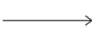 </div><br>

# 二、设计模式概念

设计模式不是代码，而是解决问题的方案，学习现有的设计模式可以做到经验复用。

拥有设计模式词汇，在沟通时就能用更少的词汇来讨论，并且不需要了解底层细节。

# 三、策略模式

## 模式定义

定义了算法族，分别封装起来，让它们之间可以互相替换，此模式让算法的变化独立于使用算法的客户。

## 问题描述

设计不同种类的鸭子拥有不同的叫声和飞行方式。

## 简单实现方案

使用继承的解决方案如下，这种方案代码无法复用，如果两个鸭子类拥有同样的飞行方式，就有两份重复的代码。

<div align="center"> 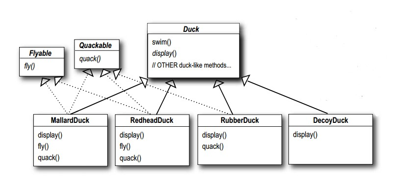 </div><br>

## 设计原则

**封装变化**  ：在这里变化的是鸭子叫和飞行的行为方式。

**针对接口编程，而不是针对实现编程**  ：变量声明的类型为父类，而不是具体的某个子类。父类中的方法实现不在父类，而是在各个子类。程序在运行时可以动态改变变量所指向的子类类型。

运用这一原则，将叫和飞行的行为抽象出来，实现多种不同的叫和飞行的子类，让子类去实现具体的叫和飞行方式。

<div align="center">  </div><br>

**多用组合，少用继承**  ：组合也就是 HAS-A 关系，通过组合，可以在运行时动态改变实现，只要通过改变父类对象具体指向哪个子类即可。而继承就不能做到这些，继承体系在创建类时就已经确定。

运用这一原则，在 Duck 类中组合 FlyBehavior 和 QuackBehavior 类，performQuack() 和 performFly() 方法委托给这两个类去处理。通过这种方式，一个 Duck 子类可以根据需要去初始化 FlyBehavior 和 QuackBehavior 的子类对象，并且也可以动态地进行改变。

<div align="center">  </div><br>

## 问题的解决方案类图

（可放大网页查看）

<div align="center"> 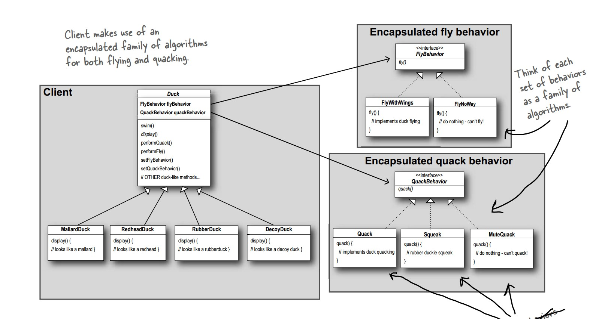 </div><br>

## 代码实现

```java
public abstract class Duck {
    FlyBehavior flyBehavior;
    QuackBehavior quackBehavior;

    public Duck(){
    }

    public void performFly(){
        flyBehavior.fly();
    }

    public void setFlyBehavior(FlyBehavior fb){
        flyBehavior = fb;
    }

    public void performQuack(){
        quackBehavior.quack();
    }

    public void setQuackBehavior(QuackBehavior qb){
        quackBehavior = qb;
    }
}
```
```java
public class MallardDuck extends Duck{
    public MallardDuck(){
        flyBehavior = new FlyWithWings();
        quackBehavior = new Quack();
    }
}
```
```java
public interface FlyBehavior {
    void fly();
}
```
```java
public class FlyNoWay implements FlyBehavior{
    @Override
    public void fly() {
        System.out.println("FlyBehavior.FlyNoWay");
    }
}
```
```java
public class FlyWithWings implements FlyBehavior{
    @Override
    public void fly() {
        System.out.println("FlyBehavior.FlyWithWings");
    }
}
```
```java
public interface QuackBehavior {
    void quack();
}
```
```java
public class Quack implements QuackBehavior{
    @Override
    public void quack() {
        System.out.println("QuackBehavior.Quack");
    }
}
```
```java
public class MuteQuack implements QuackBehavior{
    @Override
    public void quack() {
        System.out.println("QuackBehavior.MuteQuack");
    }
}
```
```java
public class Squeak implements QuackBehavior{
    @Override
    public void quack() {
        System.out.println("QuackBehavior.Squeak");
    }
}
```
```java
public class MiniDuckSimulator {
    public static void main(String[] args) {
        Duck mallardDuck = new MallardDuck();
        mallardDuck.performQuack();
        mallardDuck.performFly();
        mallardDuck.setFlyBehavior(new FlyNoWay());
        mallardDuck.performFly();
    }
}
```
执行结果
```html
QuackBehavior.Quack
FlyBehavior.FlyWithWings
FlyBehavior.FlyNoWay
```

# 三、观察者模式

## 模式定义

定义了对象之间的一对多依赖，当一个对象改变状态时，它的所有依赖者都会收到通知并自动更新。主题（Subject）是被观察的对象，而其所有依赖者（Observer）称为观察者。

<div align="center"> 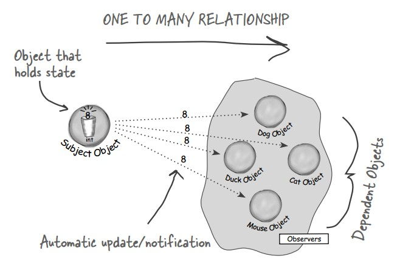 </div><br>

## 模式类图

主题具有注册和移除观察者、并通知所有注册者的功能，主题是通过维护一张观察者列表来实现这些操作的。

观察者拥有一个主题对象的引用，因为注册、移除观察者功能，还有数据都在主题当中，必须通过操作主题才能完成相应操作。

<div align="center">  </div><br>

## 问题描述

天气数据布告板会在天气信息发生改变时更新其内容，布告板有多个，并且在将来会继续增加。

## 问题的解决方案类图

<div align="center"> 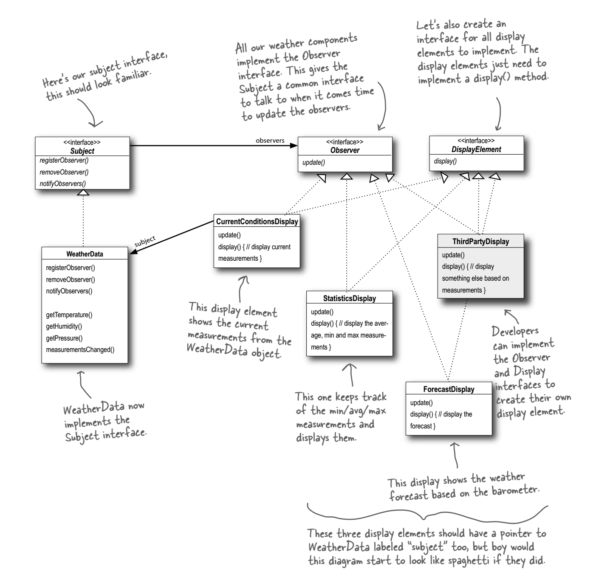 </div><br>

## 设计原则

为交互对象之间的松耦合设计而努力：当两个对象之间松耦合，它们依然可以交互，但是不清楚彼此的细节。由于松耦合的两个对象之间互相依赖程度很低，因此系统具有弹性，能够应对变化。

## 代码实现

```java
public interface Subject {
    public void resisterObserver(Observer o);
    public void removeObserver(Observer o);
    public void notifyObserver();
}
```
```java

public class WeatherData implements Subject {
    private List<Observer> observers;
    private float temperature;
    private float humidity;
    private float pressure;

    public WeatherData() {
        observers = new ArrayList<>();
    }

    @Override
    public void resisterObserver(Observer o) {
        observers.add(o);
    }

    @Override
    public void removeObserver(Observer o) {
        int i = observers.indexOf(o);
        if (i >= 0) {
            observers.remove(i);
        }
    }

    @Override
    public void notifyObserver() {
        for (Observer o : observers) {
            o.update(temperature, humidity, pressure);
        }
    }

    public void setMeasurements(float temperature, float humidity, float pressure) {
        this.temperature = temperature;
        this.humidity = humidity;
        this.pressure = pressure;
        notifyObserver();
    }
}
```
```java
public interface Observer {
    public void update(float temp, float humidity, float pressure);
}
```
```java
public class CurrentConditionsDisplay implements Observer {
    private Subject weatherData;

    public CurrentConditionsDisplay(Subject weatherData) {
        this.weatherData = weatherData;
        weatherData.resisterObserver(this);
    }

    @Override
    public void update(float temp, float humidity, float pressure) {
        System.out.println("CurrentConditionsDisplay.update:" + temp + " " + humidity + " " + pressure);
    }
}
```
```java
public class StatisticsDisplay implements Observer {
    private Subject weatherData;

    public StatisticsDisplay(Subject weatherData) {
        this.weatherData = weatherData;
        weatherData.resisterObserver(this);
    }

    @Override
    public void update(float temp, float humidity, float pressure) {
        System.out.println("StatisticsDisplay.update:" + temp + " " + humidity + " " + pressure);
    }
}
```
```java
public class WeatherStation {
    public static void main(String[] args) {
        WeatherData weatherData = new WeatherData();
        CurrentConditionsDisplay currentConditionsDisplay = new CurrentConditionsDisplay(weatherData);
        StatisticsDisplay statisticsDisplay = new StatisticsDisplay(weatherData);

        weatherData.setMeasurements(0, 0, 0);
        weatherData.setMeasurements(1, 1, 1);
    }
}
```
执行结果
```html
CurrentConditionsDisplay.update:0.0 0.0 0.0
StatisticsDisplay.update:0.0 0.0 0.0
CurrentConditionsDisplay.update:1.0 1.0 1.0
StatisticsDisplay.update:1.0 1.0 1.0
```

# 四、装饰模式

## 问题描述

设计不同种类的饮料，饮料可以添加配料，比如可以添加牛奶，并且支持动态添加新配料。每增加一种配料，该饮料的价格就会增加，要求计算一种饮料的价格。

## 模式定义

动态地将责任附加到对象上。在扩展功能上，装饰者提供了比继承更有弹性的替代方案。

下图表示在 DarkRoast 饮料上新增新添加 Mocha 配料，之后又添加了 Whip 配料。DarkRoast 被 Mocha 包裹，Mocha 又被 Whip 包裹。它们都继承自相同父类，都有 cost() 方法，外层类的 cost() 方法调用了内层类的 cost() 方法。

<div align="center">  </div><br>

## 模式类图

装饰者（Decorator）和具体组件（ConcreteComponent）都继承自组件（Component），具体组件的方法实现不需要依赖于其它对象，而装饰者组合了一个组件，这样它可以装饰其它装饰者或者具体组件。所谓装饰，就是把这个装饰者套在被装饰上，从而动态扩展被装饰者的功能。装饰者的方法有一部分是自己的，这属于它的功能，然后调用被装饰者的方法实现，从而也保留了被装饰者的功能。可以看到，具体组件应当是装饰层次的最低层，因为只有具体组件的方法实现不需要依赖于其它对象。

<div align="center">  </div><br>

## 问题的解决方案类图

<div align="center"> 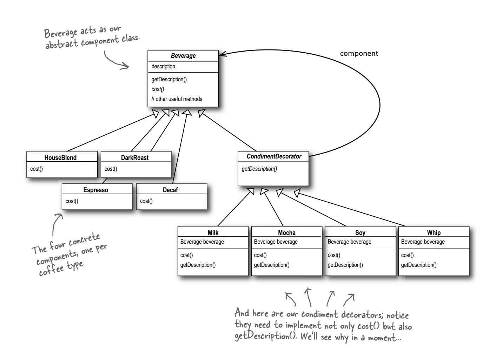 </div><br>

## 设计原则

类应该对扩展开放，对修改关闭：也就是添加新功能时不需要修改代码。在本章问题中该原则体现在，饮料可以动态添加新的配料，而不需要去修改饮料的代码。观察则模式也符合这个原则。不可能把所有的类设计成都满足这一原则，应当把该原则应用于最有可能发生改变的地方。

## Java I/O 中的装饰者模式

<div align="center"> 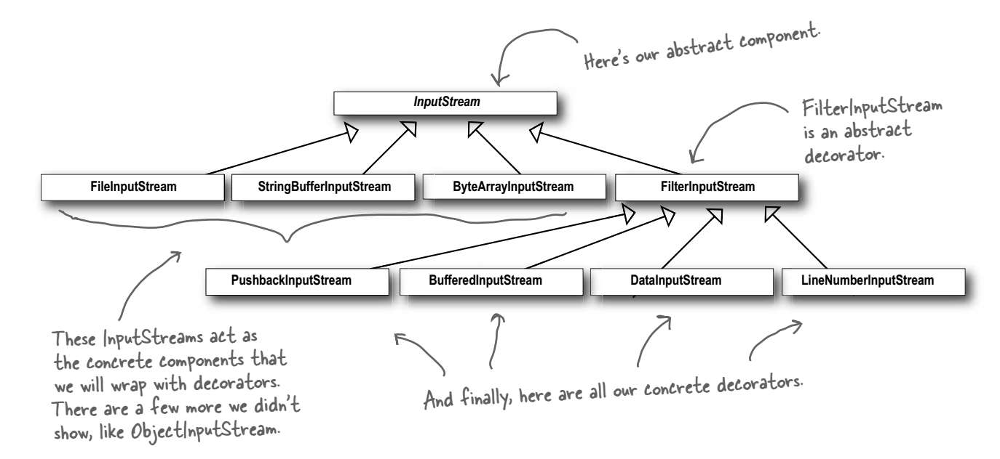 </div><br>

## 代码实现

```java
public interface Beverage {
    public double cost();
}
```
```java
public class HouseBlend implements Beverage{
    @Override
    public double cost() {
        return 1;
    }
}
```
```java
public class DarkRoast implements Beverage{
    @Override
    public double cost() {
        return 1;
    }
}
```
```java
public abstract class CondimentDecorator implements Beverage{
    protected Beverage beverage;
}
```
```java
public class Mocha extends CondimentDecorator {

    public Mocha(Beverage beverage) {
        this.beverage = beverage;
    }

    @Override
    public double cost() {
        return 1 + beverage.cost();
    }
}
```
```java
public class Milk extends CondimentDecorator {

    public Milk(Beverage beverage) {
        this.beverage = beverage;
    }

    @Override
    public double cost() {
        return 1 + beverage.cost();
    }
}
```
```java
public class StartbuzzCoffee {
    public static void main(String[] args) {
        Beverage beverage = new HouseBlend();
        beverage = new Mocha(beverage);
        beverage = new Milk(beverage);
        System.out.println(beverage.cost());
    }
}
```

输出

```html
3.0
```

# 五、简单工厂

## 问题描述

Pizza 类有很多子类，要求根据不同的情况用不同的子类实例化一个 Pizza 对象。

## 模式定义

简单工厂不是设计模式，更像是一种编程习惯。它把实例化的操作单独放到一个类中，这个类就成为简单工厂类，让简单工厂类来决定应该用哪个子类来实例化。

这样做能把客户类和具体子类的实现解耦，客户类不再需要知道有哪些子类以及应当实例化哪个子类。因为客户类往往有多个，如果不使用简单工厂，所有的客户类都要知道所有子类的细节。而且一旦子类发生改变，例如增加子类，那么所有的客户类都要进行修改。

<div align="center"> 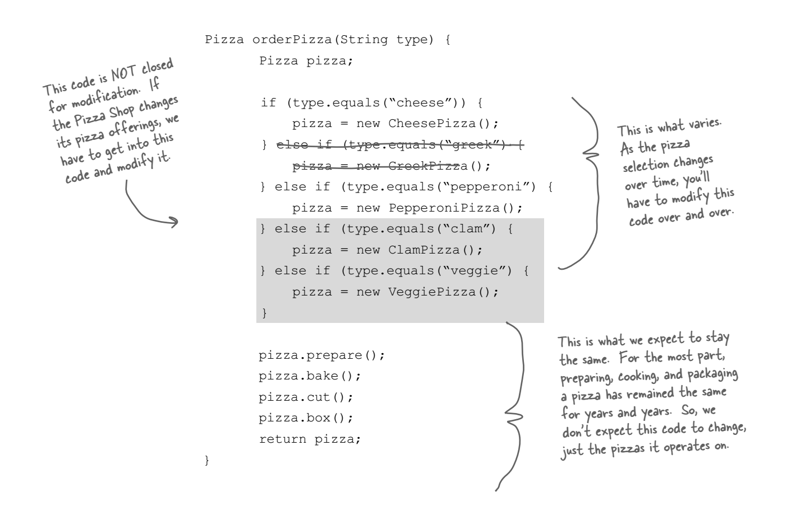 </div><br>

## 问题的解决方案类图

<div align="center">  </div><br>

## 代码实现

```java
public interface Pizza {
    public void make();
}
```

```java
public class CheesePizza implements Pizza{
    @Override
    public void make() {
        System.out.println("CheesePizza");
    }
}
```

```java
public class GreekPizza implements Pizza{
    @Override
    public void make() {
        System.out.println("GreekPizza");
    }
}
```

```java
public class SimplePizzaFactory {
    public Pizza createPizza(String type) {
        if (type.equals("cheese")) {
            return new CheesePizza();
        } else if (type.equals("greek")) {
            return new GreekPizza();
        } else {
            throw new UnsupportedOperationException();
        }
    }
}
```

```java
public class PizzaStore {
    public static void main(String[] args) {
        SimplePizzaFactory simplePizzaFactory = new SimplePizzaFactory();
        Pizza pizza = simplePizzaFactory.createPizza("cheese");
        pizza.make();
    }
}
```

运行结果

```java
CheesePizza
```

# 六、工厂方法模式

## 问题描述

每个地区的 PizzaStore 卖的 Pizza 虽然种类相同，但是都有自己的风味。一个客户点了纽约的 cheese 种类的 Pizza 和在芝加哥点的相同种类的 Pizza 是不同的。要求设计出满足条件的 PizzaStore。

## 模式定义

定义了一个创建对象的接口，但由子类决定要实例化哪个类。工厂方法把实例化推迟到子类。

## 模式类图

在简单工厂中，创建对象的是另一个类，而在工厂方法中，是由子类来创建对象。

下图中，Creator 有一个 anOperation() 方法，这个方法需要用到一组产品对象，这组产品对象由 factoryMethod() 方法创建。该方法是抽象的，需要由子类去实现。

<div align="center">  </div><br>

## 问题的解决方案类图

PizzaStore 有 orderPizza() 方法，顾客可以用它来下单。下单之后需要先使用 createPizza() 来制作 Pizza，这里的 createPizza() 就是 factoryMethod()，不同的 PizzaStore 子类实现了不同的 createPizza()。

<div align="center"> 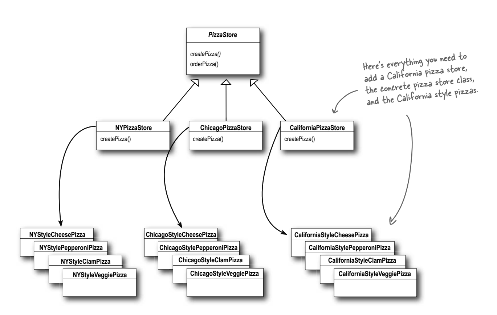 </div><br>

## 设计原则

依赖倒置原则：要依赖抽象，不要依赖具体类。听起来像是针对接口编程，不针对实现编程，但是这个原则说明了：不能让高层组件依赖底层组件，而且，不管高层或底层组件，两者都应该依赖于抽象。例如，下图中 Pizza 是抽象类，PizzaStore 和 Pizza 子类都依赖于 Pizza 这个抽象类。

<div align="center">  </div><br>

## 代码实现

```java
public interface Pizza {
    public void make();
}
```
```java
public interface PizzaStore {
    public Pizza orderPizza(String item);
}
```
```java
public class NYStyleCheesePizza implements Pizza{
    @Override
    public void make() {
        System.out.println("NYStyleCheesePizza is making..");
    }
}
```
```java
public class NYStyleVeggiePizza implements Pizza {
    @Override
    public void make() {
        System.out.println("NYStyleVeggiePizza is making..");
    }
}
```
```java
public class ChicagoStyleCheesePizza implements Pizza{
    @Override
    public void make() {
        System.out.println("ChicagoStyleCheesePizza is making..");
    }
}
```
```java
public class ChicagoStyleVeggiePizza implements Pizza{
    @Override
    public void make() {
        System.out.println("ChicagoStyleVeggiePizza is making..");
    }
}
```
```java
public class NYPizzaStore implements PizzaStore {
    @Override
    public Pizza orderPizza(String item) {
        Pizza pizza = null;
        if (item.equals("cheese")) {
            pizza = new NYStyleCheesePizza();
        } else if (item.equals("veggie")) {
            pizza = new NYStyleVeggiePizza();
        } else {
            throw new UnsupportedOperationException();
        }
        pizza.make();
        return pizza;
    }
}
```
```java
public class ChicagoPizzaStore implements PizzaStore {
    @Override
    public Pizza orderPizza(String item) {
        Pizza pizza = null;
        if (item.equals("cheese")) {
            pizza = new ChicagoStyleCheesePizza();
        } else if (item.equals("veggie")) {
            pizza = new ChicagoStyleVeggiePizza();
        } else {
            throw new UnsupportedOperationException();
        }
        pizza.make();
        return pizza;
    }
}
```
```java
public class PizzaTestDrive {
    public static void main(String[] args) {
        PizzaStore nyStore = new NYPizzaStore();
        nyStore.orderPizza("cheese");
        PizzaStore chicagoStore = new ChicagoPizzaStore();
        chicagoStore.orderPizza("cheese");
    }
}
```

运行结果

```html
NYStyleCheesePizza is making..
ChicagoStyleCheesePizza is making..
```

# 七、抽象工厂模式

## 模式定义

提供一个接口，用于创建  **相关的对象家族** 。

## 模式类图

抽象工厂模式创建的是对象家族，也就是很多对象而不是一个对象，并且这些对象是相关的，也就是说必须一起创建出来。而工厂模式只是用于创建一个对象，这和抽象工厂模式有很大不同。

抽象工厂模式用到了工厂模式来创建单一对象，在类图左部，AbstractFactory 中的 CreateProductA 和 CreateProductB 方法都是让子类来实现，这两个方法单独来看就是在创建一个对象，这符合工厂模式的定义。

至于创建对象的家族这一概念是在 Client 体现，Client 要通过 AbstractFactory 同时调用两个方法来创建出两个对象，在这里这两个对象就有很大的相关性，Client 需要同时创建出这两个对象。

从高层次来看，抽象工厂使用了组合，即 Cilent 组合了 AbstractFactory，而工厂模式使用了继承。

<div align="center"> 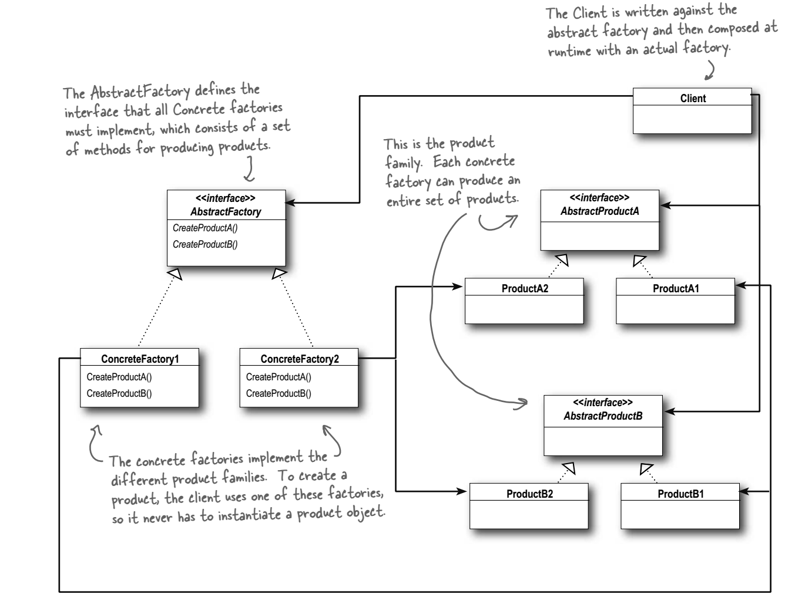 </div><br>

## 解决方案类图

<div align="center"> 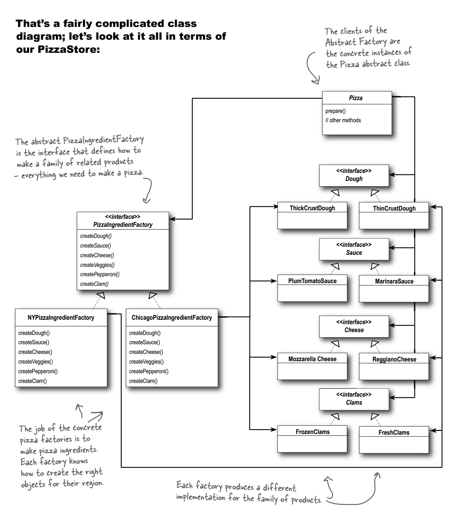 </div><br>

## 代码实现

```java
public interface Dough {
    public String doughType();
}
```
```java
public class ThickCrustDough implements Dough{

    @Override
    public String doughType() {
        return "ThickCrustDough";
    }
}
```
```java
public class ThinCrustDough implements Dough {
    @Override
    public String doughType() {
        return "ThinCrustDough";
    }
}
```
```java
public interface Sauce {
    public String sauceType();
}
```
```java
public class MarinaraSauce implements Sauce {
    @Override
    public String sauceType() {
        return "MarinaraSauce";
    }
}
```
```java
public class PlumTomatoSauce implements Sauce {
    @Override
    public String sauceType() {
        return "PlumTomatoSauce";
    }
}
```
```java
public interface PizzaIngredientFactory {
    public Dough createDough();
    public Sauce createSauce();
}
```
```java
public class NYPizzaIngredientFactory implements PizzaIngredientFactory{
    @Override
    public Dough createDough() {
        return new ThickCrustDough();
    }

    @Override
    public Sauce createSauce() {
        return new MarinaraSauce();
    }
}
```
```java
public class ChicagoPizzaIngredientFactory implements PizzaIngredientFactory{
    @Override
    public Dough createDough() {
        return new ThinCrustDough();
    }

    @Override
    public Sauce createSauce() {
        return new PlumTomatoSauce();
    }
}
```
```java
public class NYPizzaStore {
    private PizzaIngredientFactory ingredientFactory;

    public NYPizzaStore() {
        ingredientFactory = new NYPizzaIngredientFactory();
    }

    public void makePizza() {
        Dough dough = ingredientFactory.createDough();
        Sauce sauce = ingredientFactory.createSauce();
        System.out.println(dough.doughType());
        System.out.println(sauce.sauceType());
    }
}
```
```java
public class NYPizzaStoreTestDrive {
    public static void main(String[] args) {
        NYPizzaStore nyPizzaStore = new NYPizzaStore();
        nyPizzaStore.makePizza();
    }
}
```

运行结果

```html
ThickCrustDough
MarinaraSauce
```

# 八、单例模式

## 模式定义

确保一个类只有一个实例，并提供了一个全局访问点。

## 模式类图

使用一个私有构造器、一个私有静态变量以及一个公有静态函数来实现。

私有构造函数保证了不能通过构造函数来创建对象实例，只能通过公有静态函数返回唯一的私有静态变量。

<div align="center"> 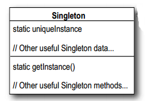 </div><br>

## 懒汉式-线程不安全

以下实现中，私有静态变量 uniqueInstance 被延迟化实例化，这样做的好处是，如果没有用到该类，那么就不会实例化 uniqueInstance，从而节约资源。

这个实现在多线程环境下是不安全的，如果多个线程能够同时进入`if(uniqueInstance == null)` ，那么就会多次实例化 uniqueInstance。

```java
public class Singleton {

    private static Singleton uniqueInstance;

    private Singleton() {
    }

    public static Singleton getUniqueInstance() {
        if (uniqueInstance == null) {
            uniqueInstance = new Singleton();
        }
        return uniqueInstance;
    }
}
```

## 懒汉式-线程安全

只需要对 `getUniqueInstance()` 方法加锁，那么在一个时间点只能有一个线程能够进入该方法，从而避免了对 uniqueInstance 进行多次实例化的问题。

但是这样有一个问题，就是当一个线程进入该方法之后，其它线程试图进入该方法都必须等待，因此性能上有一定的损耗。

```java
public static synchronized Singleton getUniqueInstance() {
    if (uniqueInstance == null) {
        uniqueInstance = new Singleton();
    }
    return uniqueInstance;
}
```

## 饿汉式-线程安全

线程不安全问题主要是由于 uniqueInstance 被实例化了多次，如果 uniqueInstance 采用直接实例化的话，就不会被实例化多次，也就不会产生线程不安全问题。但是直接实例化的方式也丢失了延迟实例化带来的节约资源的优势。

```java
private static Singleton uniqueInstance = new Singleton();
```

## 双重校验锁-线程安全

uniqueInstance 只需要被实例化一次，之后就可以直接使用了。加锁操作只需要对实例化那部分的代码进行。也就是说，只有当 uniqueInstance 没有被实例化时，才需要进行加锁。

双重校验锁先判断 uniqueInstance 是否已经被初始化了，如果没有被实例化，那么才对实例化语句进行加锁。

```java
public class Singleton {

    private volatile static Singleton uniqueInstance;

    private Singleton() {
    }

    public static Singleton getUniqueInstance() {
        if (uniqueInstance == null) {
            synchronized (Singleton.class) {
                if (uniqueInstance == null) {
                    uniqueInstance = new Singleton();
                }
            }
        }
        return uniqueInstance;
    }
}
```

考虑下面的实现，也就是只使用了一个 if 语句。在 uniqueInstance == null 的情况下，如果两个线程同时执行 if 语句，那么两个线程就会同时进入 if 语句块内。虽然在 if 语句块内有加锁操作，但是两个线程都会执行`uniqueInstance = new Singleton();`这条语句，只是早晚的问题，也就是说会进行两次实例化，从而产生了两个实例。因此必须使用双重校验锁，也就是需要使用两个 if 判断。

```java
if (uniqueInstance == null) {
    synchronized (Singleton.class) {
        uniqueInstance = new Singleton();
    }
}
```

# 九、命令模式

## 问题描述

设计一个遥控器，它有很多按钮，每个按钮可以发起一个命令，命令会让一个家电完成相应操作。有非常多的家电，并且之后会增加家电。

<div align="center"> 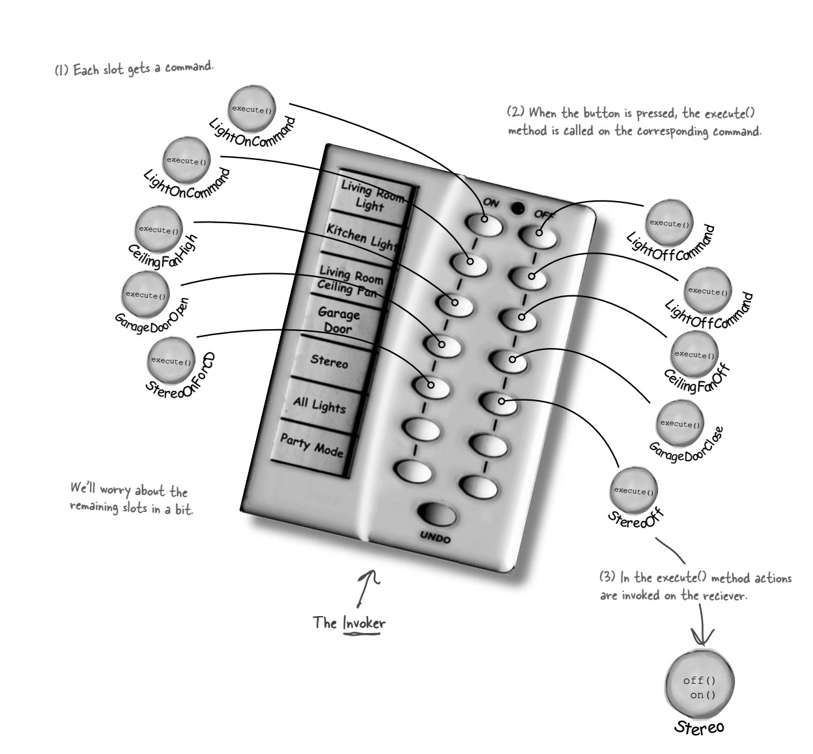 </div><br>

有非常多的家电，并且之后会增加家电。

<div align="center"> 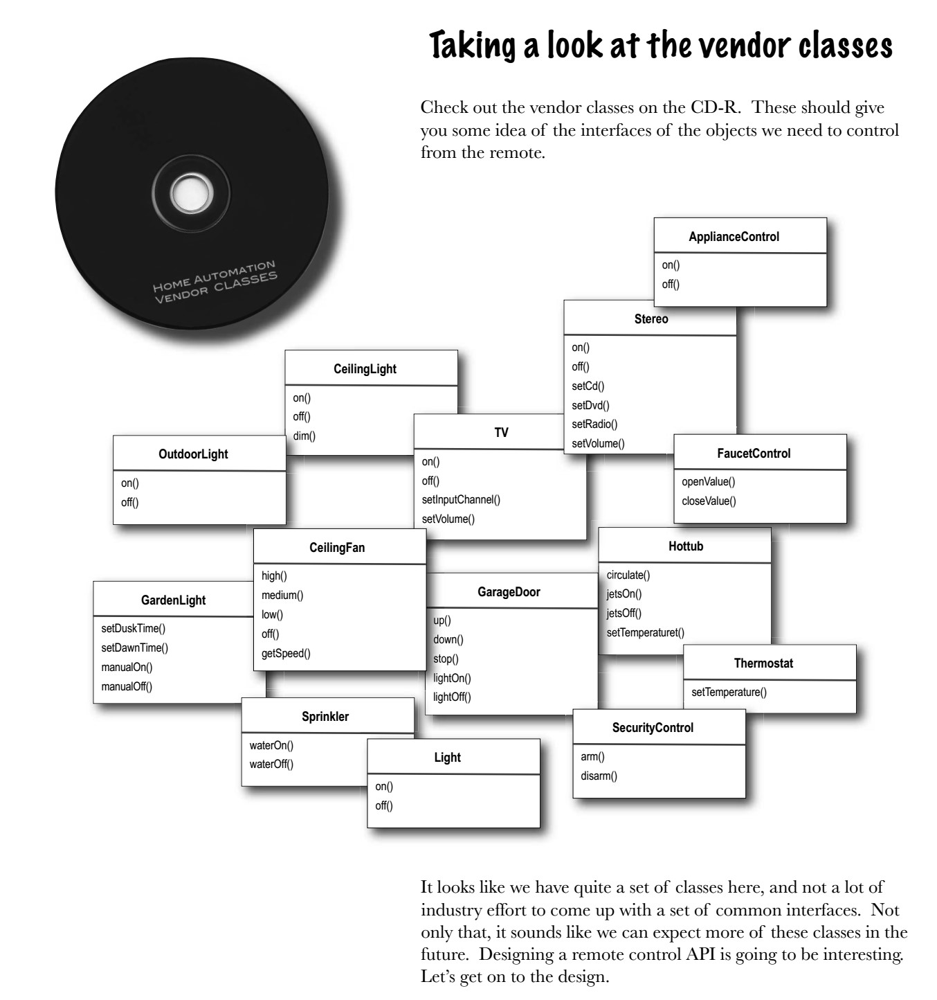 </div><br>

## 模式定义

将命令封装成对象，以便使用不同的命令来参数化其它对象。

## 问题的解决方案类图

- RemoteControl 是遥控器，它可以为每个按钮设置命令对象，并且执行命令。

- Command 是命令对象。

- Light（电灯）是命令真正的执行者。

- RemoteLoader 是客户端，应该注意它与 RemoteControl 的区别。因为 RemoteControl 不能主动地调用自身的方法，因此也就不能当成是客户端。客户端好比人，只有人才能去真正去使用遥控器。

<div align="center"> 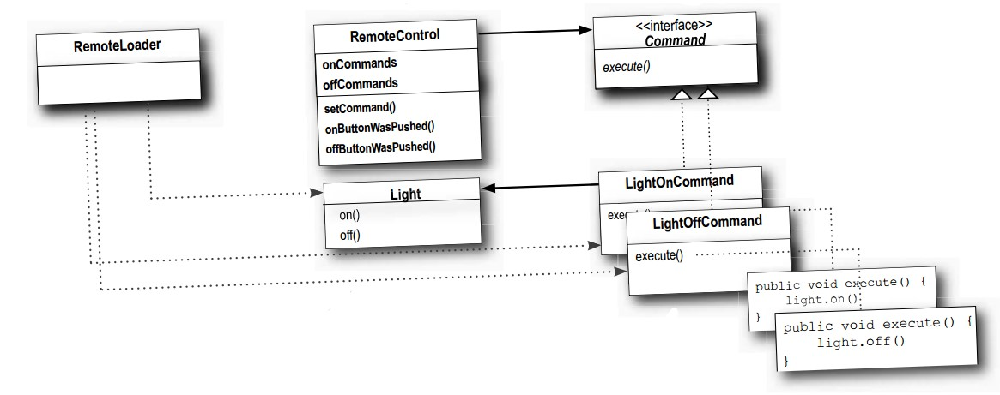 </div><br>

## 模式类图

<div align="center"> 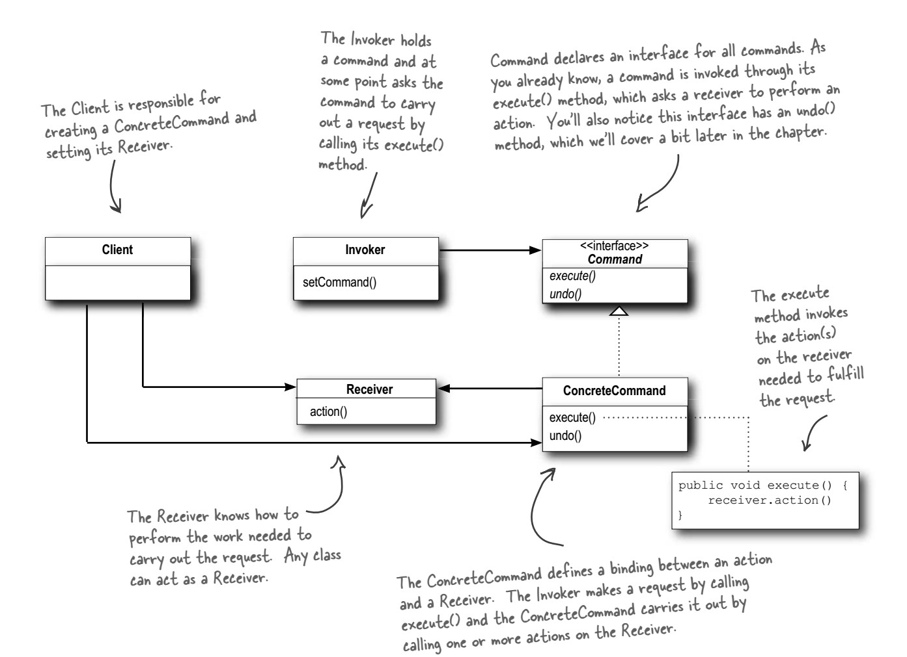 </div><br>

## 代码实现

```java
public interface Command {
    public void execute();
}
```

```java
public class Light {

    public void on() {
        System.out.println("Light is on!");
    }

    public void off() {
        System.out.println("Light is off!");
    }
}
```

```java
public class LightOnCommand implements Command{
    Light light;

    public LightOnCommand(Light light) {
        this.light = light;
    }

    @Override
    public void execute() {
        light.on();
    }
}
```

```java
/**
 * 遥控器类
 */
public class SimpleRemoteControl {
    Command slot;

    public SimpleRemoteControl() {

    }

    public void setCommand(Command command) {
        this.slot = command;
    }

    public void buttonWasPressed() {
        slot.execute();
    }

}
```

```java
/**
 * 客户端
 */
public class RemoteLoader {
    public static void main(String[] args) {
        SimpleRemoteControl remote = new SimpleRemoteControl();
        Light light = new Light();
        LightOnCommand lightOnCommand = new LightOnCommand(light);
        remote.setCommand(lightOnCommand);
        remote.buttonWasPressed();
    }
}
```

输出

```html
Light is on!
```

# 十、适配器模式

## 模式定义

将一个类的接口，转换为客户期望的另一个接口。适配器让原本不兼容的类可以合作无间。

<div align="center"> 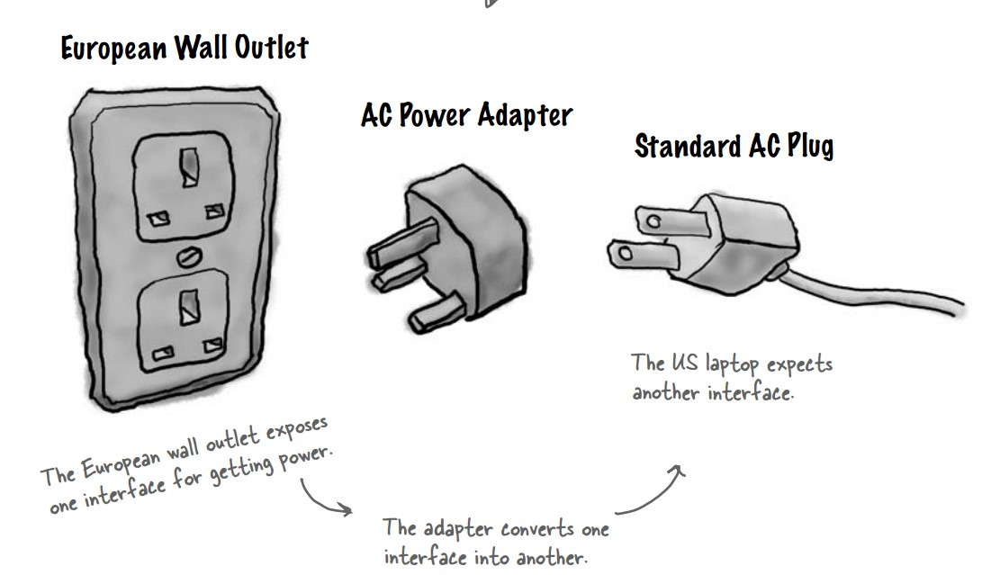 </div><br>

## 模式类图

适配器（Adapter）组合一个适配者（Adaptee），Adapter 把操作委托给 Adaptee。

<div align="center">  </div><br>

## 问题描述

鸭子（Duck）和火鸡（Turkey）拥有不同的叫声，Duck 的叫声调用 quack() 方法，而 Turkey 调用 gobble() 方法。

要求将 Turkey 的 gobble() 方法适配成 Duck 的 quack() 方法，从而让火鸡冒充鸭子！

## 问题的解决方案类图

<div align="center"> 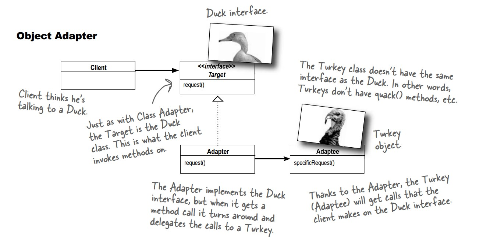 </div><br>

## 代码实现

```java
public interface Duck {
    public void quack();
}
```

```java
public interface Turkey {
    public void gobble();
}
```

```java
public class WildTurkey implements Turkey{
    @Override
    public void gobble() {
        System.out.println("gobble!");
    }
}
```

```java
public class TurkeyAdapter implements Duck{
    Turkey turkey;

    public TurkeyAdapter(Turkey turkey) {
        this.turkey = turkey;
    }

    @Override
    public void quack() {
        turkey.gobble();
    }
}
```

```java
public class DuckTestDrive {
    public static void main(String[] args) {
        Turkey turkey = new WildTurkey();
        Duck duck = new TurkeyAdapter(turkey);
        duck.quack();
    }
}
```

运行结果

```html
gobble!
```

# 十、外观模式

## 模式定义

提供了一个统一的接口，用来访问子系统中的一群接口，从而让子系统更容易使用。

## 模式类图

<div align="center"> 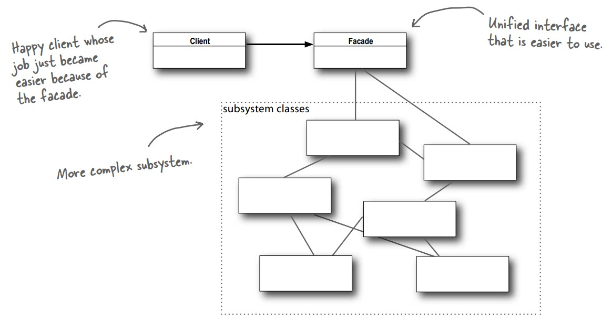 </div><br>

## 问题描述

家庭影院中有众多电器，当要进行观看电影时需要对很多电器进行操作。要求简化这些操作，使得家庭影院类只提供一个简化的接口，例如提供一个看电影相关的接口。

<div align="center">  </div><br>

## 解决方案类图

<div align="center"> 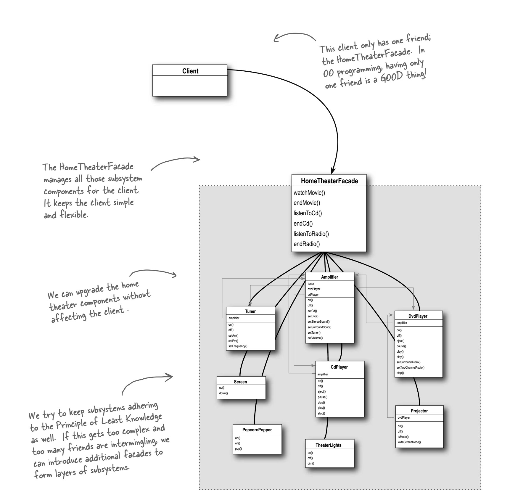 </div><br>

## 设计原则

**最少知识原则**  ：只和你的密友谈话。也就是客户对象所需要交互的对象应当尽可能少。

## 代码实现

过于简单，无实现。

# 十一、模板方法模式

## 模式定义

在一个方法中定义一个算法的骨架，而将一些步骤延迟到子类中。

模板方法使得子类可以在不改变算法结构的情况下，重新定义算法中的某些步骤。

## 模式类图

模板方法 templateMethod() 定义了算法的骨架，确定了 primitiveOperation1() 和 primitiveOperation2() 方法执行的顺序，而 primitiveOperation1() 和 primitiveOperation2() 让子类去实现。

<div align="center"> 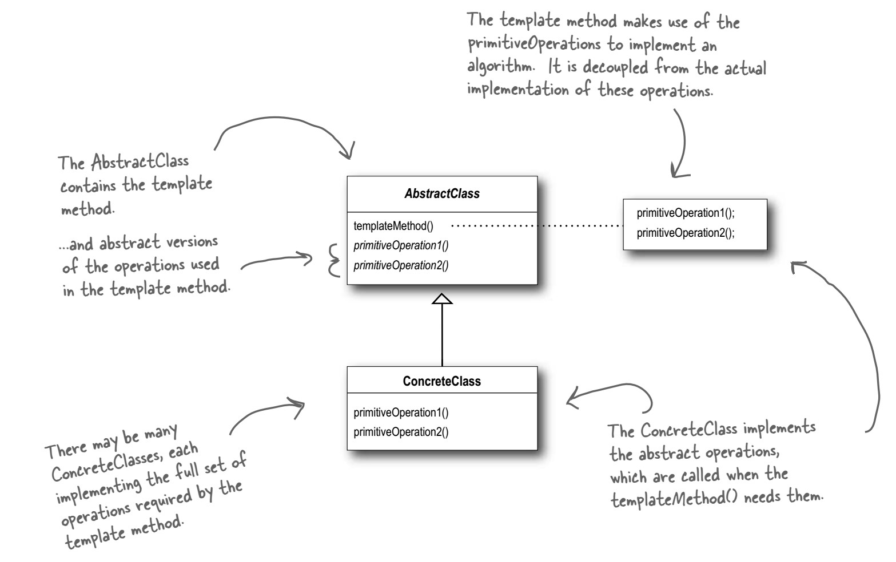 </div><br>

## 问题描述

冲咖啡和冲茶都有类似的流程，但是某些步骤会有点不一样，要求复用那些相同步骤的代码。

<div align="center">  </div><br>

## 问题的解决方案类图

prepareRecipe() 方法就是模板方法，它确定了其它四个方法的具体执行步骤。其中 brew() 和 addCondiments() 方法在子类中实现。

<div align="center">  </div><br>

## 设计原则

**好莱坞原则** ：别调用（打电话给）我们，我们会调用（打电话给）你。这一原则可以防止依赖腐败，即防止高层组件依赖低层组件，低层组件又依赖高层组件。该原则在模板方法的体现为，只有父类会调用子类，子类不会调用父类。

## 钩子

某些步骤在不同实现中可有可无，可以先定义一个什么都不做的方法，把它加到模板方法中，如果子类需要它就覆盖默认实现并加上自己的实现。

## 代码实现

```java
public abstract class CaffeineBeverage {

    final void prepareRecipe(){
        boilWater();
        brew();
        pourInCup();
        addCondiments();
    }

    abstract void brew();

    abstract void addCondiments();

    void boilWater(){
        System.out.println("boilWater");
    }

    void pourInCup(){
        System.out.println("pourInCup");
    }
}
```

```java
public class Coffee extends CaffeineBeverage{
    @Override
    void brew() {
        System.out.println("Coffee.brew");
    }

    @Override
    void addCondiments() {
        System.out.println("Coffee.addCondiments");
    }
}
```

```java
public class Tea extends CaffeineBeverage{
    @Override
    void brew() {
        System.out.println("Tea.brew");
    }

    @Override
    void addCondiments() {
        System.out.println("Tea.addCondiments");
    }
}
```

```java
public class CaffeineBeverageTestDrive {
    public static void main(String[] args) {
        CaffeineBeverage caffeineBeverage = new Coffee();
        caffeineBeverage.prepareRecipe();
        System.out.println("-----------");
        caffeineBeverage = new Tea();
        caffeineBeverage.prepareRecipe();
    }
}
```

运行结果

```html
boilWater
Coffee.brew
pourInCup
Coffee.addCondiments
-----------
boilWater
Tea.brew
pourInCup
Tea.addCondiments
```

# 十二、迭代器模式

## 模式定义

提供顺序访问一个聚合对象中的各个元素的方法，而又不暴露聚合对象内部的表示。

## 模式类图

- Aggregate 是聚合类，其中 createIterator() 方法可以产生一个 Iterator；

- Iterator 主要定义了 hasNext() 和 next() 方法。

- Client 组合了 Aggregate，为了迭代遍历 Aggregate，也需要组合 Iterator。

<div align="center">  </div><br>

## 代码实现

```java
public class Aggregate {

    private int[] items;

    public Aggregate() {
        items = new int[10];
        for (int i = 0; i < items.length; i++) {
            items[i] = i;
        }
    }

    public Iterator createIterator() {
        return new ConcreteIterator(items);
    }

}
```

```java
public interface Iterator {
    boolean hasNext();
    int next();
}
```

```java
public class ConcreteIterator implements Iterator {

    private int[] items;
    private int position = 0;

    public ConcreteIterator(int[] items) {
        this.items = items;
    }

    @Override
    public boolean hasNext() {
        return position < items.length;
    }

    @Override
    public int next() {
        return items[position++];
    }
}
```
```java
public class Client {
    public static void main(String[] args) {
        Aggregate aggregate = new Aggregate();
        Iterator iterator = aggregate.createIterator();
        while(iterator.hasNext()){
            System.out.println(iterator.next());
        }
    }
}
```
运行结果
```html
0
1
2
3
4
5
6
7
8
9
```

## Java 内置的迭代器

需要让聚合类实现 Iterable 接口，该接口有一个 iterator() 方法会返回一个 Iterator 对象。

可以使用 foreach 循环来顺序访问聚合对象中的每个元素。

Java 中的集合类基本都实现了 Iterable 接口。

```java
import java.util.Iterator;

public class Aggregate implements Iterable<Integer>{

    private int[] items;

    public Aggregate() {
        items = new int[10];
        for (int i = 0; i < items.length; i++) {
            items[i] = i;
        }
    }

    @Override
    public Iterator<Integer> iterator() {
        return new ConcreteIterator(items);
    }
}
```
```java
import java.util.Iterator;

public class ConcreteIterator implements Iterator<Integer> {

    private int[] items;
    private int position = 0;

    public ConcreteIterator(int[] items) {
        this.items = items;
    }

    @Override
    public boolean hasNext() {
        return position < items.length;
    }

    @Override
    public Integer next() {
        return items[position++];
    }
}
```
```java
public class Client {
    public static void main(String[] args) {
        Aggregate aggregate = new Aggregate();
        for (int item : aggregate) {
            System.out.println(item);
        }
    }
}
```

# 十三、组合模式

## 设计原则

一个类应该只有一个引起它改变的原因。

## 模式定义

允许将对象组合成树形结构来表现“整体/部分”关系。

组合能让客户以一致的方式处理个别对象以及组合对象。

## 模式类图

组件（Component）类是组合类（Composite）和叶子类（Leaf）的父类，可以把组合类看成是树的中间节点。

组合对象拥有一个组件对象，因此组合对象的操作可以委托给组件对象去处理，而组件对象可以是另一个组合对象或者叶子对象。

<div align="center"> 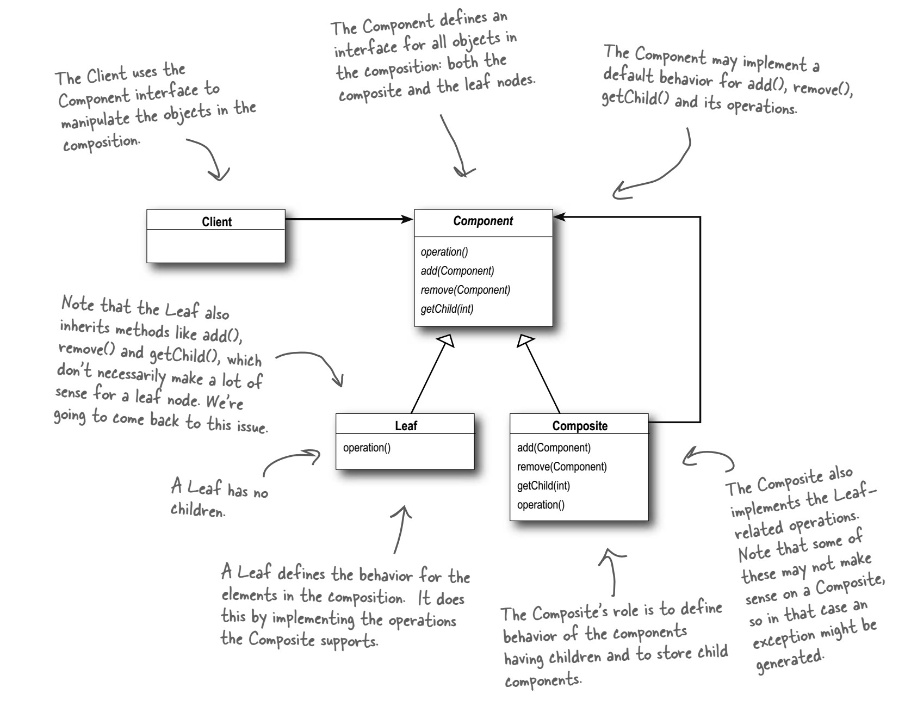 </div><br>

## 代码实现

```java
public abstract class Component {
    protected String name;

    public Component(String name) {
        this.name = name;
    }

    abstract public void addChild(Component component);

    public void print() {
        print(0);
    }

    abstract protected void print(int level);
}
```

```java
public class Leaf extends Component {
    public Leaf(String name) {
        super(name);
    }

    @Override
    public void addChild(Component component) {
        throw new UnsupportedOperationException(); // 牺牲透明性换取单一职责原则，这样就不用考虑是叶子节点还是组合节点
    }

    @Override
    protected void print(int level) {
        for (int i = 0; i < level; i++) {
            System.out.print("--");
        }
        System.out.println("left:" + name);
    }
}
```

```java
public class Composite extends Component {

    private List<Component> childs;

    public Composite(String name) {
        super(name);
        childs = new ArrayList<>();
    }

    @Override
    public void addChild(Component component) {
        childs.add(component);
    }

    @Override
    protected void print(int level) {
        for (int i = 0; i < level; i++) {
            System.out.print("--");
        }
        System.out.println("Composite:" + name);
        for (Component component : childs) {
            component.print(level + 1);
        }
    }
}
```

```java
public class Client {
    public static void main(String[] args) {
        Composite root = new Composite("root");
        Component node1 = new Leaf("1");
        Component node2 = new Composite("2");
        Component node3 = new Leaf("3");
        root.addChild(node1);
        root.addChild(node2);
        root.addChild(node3);
        Component node21 = new Leaf("21");
        Component node22 = new Composite("22");
        node2.addChild(node21);
        node2.addChild(node22);
        Component node221 = new Leaf("221");
        node22.addChild(node221);
        root.print();
    }
}
```
运行结果

```html
Composite:root
--left:1
--Composite:2
----left:21
----Composite:22
------left:221
--left:3
```

# 十四、状态模式

## 模式定义

允许对象在内部状态改变时改变它的行为，对象看起来好像修改了它所属的类。

## 模式类图

Context 的 request() 方法委托给 State 对象去处理。当 Context 组合的 State 对象发生改变时，它的行为也就发生了改变。

<div align="center"> 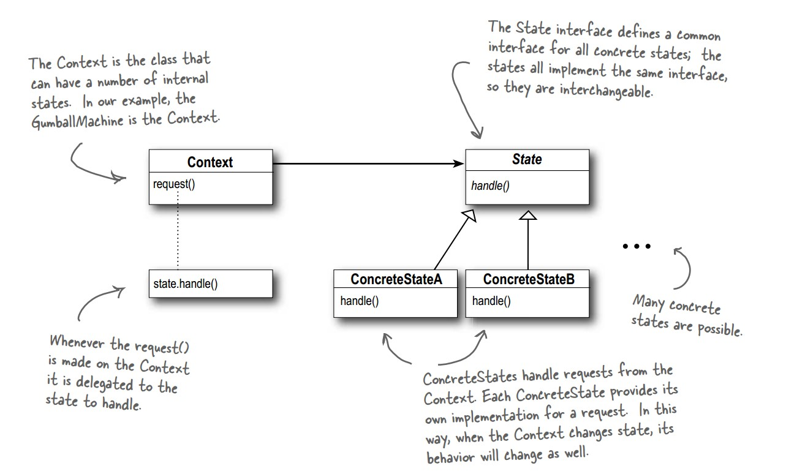 </div><br>

## 与策略模式的比较

状态模式的类图和策略模式一样，并且都是能够动态改变对象的行为。

但是状态模式是通过状态转移来改变 Context 所组合的 State 对象，而策略模式是通过 Context 本身的决策来改变组合的 Strategy 对象。

所谓的状态转移，是指 Context 在运行过程中由于一些条件发生改变而使得 State 对象发生改变，注意必须要是在运行过程中。

状态模式主要是用来解决状态转移的问题，当状态发生转移了，那么 Context 对象就会改变它的行为；而策略模式主要是用来封装一组可以互相替代的算法族，并且可以根据需要动态地去替换 Context 需要使用哪个算法。

## 问题描述

糖果销售机有多种状态，每种状态下销售机有不同的行为，状态可以发生转移，使得销售机的行为也发生改变。

<div align="center"> 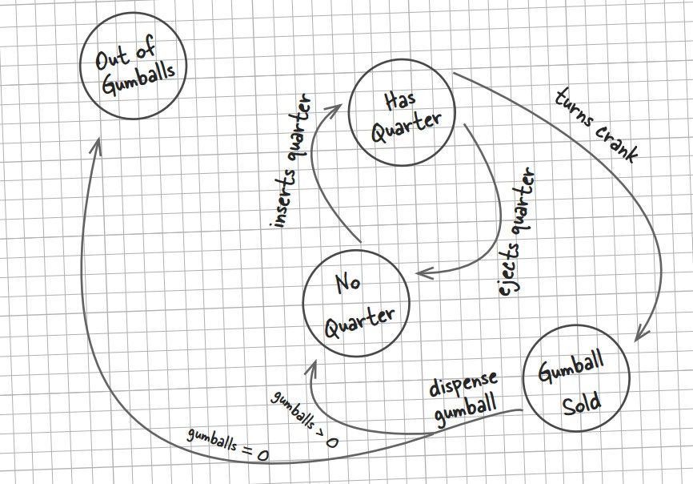 </div><br>

## 直接解决方案

在糖果机的每个操作函数里面，判断当前的状态，根据不同的状态进行不同的处理，并且发生不同的状态转移。

这种解决方案在需要增加状态的时候，必须对每个操作的代码都进行修改。

<div align="center">  </div><br>

## 代码实现

糖果销售机即 Context。

下面的实现中每个 State 都组合了 Context 对象，这是因为状态转移的操作在 State 对象中，而状态转移过程又必须改变 Context 对象的 state 对象，因此 State 必须组合 Context 对象。

```java
public interface State {
    /**
     * 投入 25 分钱
     */
    void insertQuarter();

    /**
     * 退回 25 分钱
     */
    void ejectQuarter();

    /**
     * 转动曲柄
     */
    void turnCrank();

    /**
     * 发放糖果
     */
    void dispense();
}
```
```java
public class HasQuarterState implements State{

    private GumballMachine gumballMachine;

    public HasQuarterState(GumballMachine gumballMachine){
        this.gumballMachine = gumballMachine;
    }

    @Override
    public void insertQuarter() {
        System.out.println("You can't insert another quarter");
    }

    @Override
    public void ejectQuarter() {
        System.out.println("Quarter returned");
        gumballMachine.setState(gumballMachine.getNoQuarterState());
    }

    @Override
    public void turnCrank() {
        System.out.println("You turned...");
        gumballMachine.setState(gumballMachine.getSoldState());
    }

    @Override
    public void dispense() {
        System.out.println("No gumball dispensed");
    }
}
```
```java
public class NoQuarterState implements State {

    GumballMachine gumballMachine;

    public NoQuarterState(GumballMachine gumballMachine) {
        this.gumballMachine = gumballMachine;
    }

    @Override
    public void insertQuarter() {
        System.out.println("You insert a quarter");
        gumballMachine.setState(gumballMachine.getHasQuarterState());
    }

    @Override
    public void ejectQuarter() {
        System.out.println("You haven't insert a quarter");
    }

    @Override
    public void turnCrank() {
        System.out.println("You turned, but there's no quarter");
    }

    @Override
    public void dispense() {
        System.out.println("You need to pay first");
    }
}
```
```java
public class SoldOutState implements State {

    GumballMachine gumballMachine;

    public SoldOutState(GumballMachine gumballMachine) {
        this.gumballMachine = gumballMachine;
    }

    @Override
    public void insertQuarter() {
        System.out.println("You can't insert a quarter, the machine is sold out");
    }

    @Override
    public void ejectQuarter() {
        System.out.println("You can't eject, you haven't inserted a quarter yet");
    }

    @Override
    public void turnCrank() {
        System.out.println("You turned, but there are no gumballs");
    }

    @Override
    public void dispense() {
        System.out.println("No gumball dispensed");
    }
}
```
```java
public class SoldState implements State {

    GumballMachine gumballMachine;

    public SoldState(GumballMachine gumballMachine) {
        this.gumballMachine = gumballMachine;
    }

    @Override
    public void insertQuarter() {
        System.out.println("Please wait, we're already giving you a gumball");
    }

    @Override
    public void ejectQuarter() {
        System.out.println("Sorry, you already turned the crank");
    }

    @Override
    public void turnCrank() {
        System.out.println("Turning twice doesn't get you another gumball!");
    }

    @Override
    public void dispense() {
        gumballMachine.releaseBall();
        if(gumballMachine.getCount()>0){
            gumballMachine.setState(gumballMachine.getNoQuarterState());
        } else{
            System.out.println("Oops, out of gumballs");
            gumballMachine.setState(gumballMachine.getSoldOutState());
        }
    }
}
```
```java
public class GumballMachine {

    private State soldOutState;
    private State noQuarterState;
    private State hasQuarterState;
    private State soldState;

    private State state;
    private int count = 0;

    public GumballMachine(int numberGumballs) {
        count = numberGumballs;
        soldOutState = new SoldOutState(this);
        noQuarterState = new NoQuarterState(this);
        hasQuarterState = new HasQuarterState(this);
        soldState = new SoldState(this);

        if (numberGumballs > 0) {
            state = noQuarterState;
        } else {
            state = soldOutState;
        }
    }

    public void insertQuarter() {
        state.insertQuarter();
    }

    public void ejectQuarter() {
        state.ejectQuarter();
    }

    public void turnCrank() {
        state.turnCrank();
        state.dispense();
    }

    public void setState(State state) {
        this.state = state;
    }

    public void releaseBall() {
        System.out.println("A gumball comes rolling out the slot...");
        if (count != 0) {
            count -= 1;
        }
    }

    public State getSoldOutState() {
        return soldOutState;
    }

    public State getNoQuarterState() {
        return noQuarterState;
    }

    public State getHasQuarterState() {
        return hasQuarterState;
    }

    public State getSoldState() {
        return soldState;
    }

    public int getCount() {
        return count;
    }
}
```
```java
public class GumballMachineTestDrive {

    public static void main(String[] args) {
        GumballMachine gumballMachine = new GumballMachine(5);

        gumballMachine.insertQuarter();
        gumballMachine.turnCrank();

        gumballMachine.insertQuarter();
        gumballMachine.ejectQuarter();
        gumballMachine.turnCrank();

        gumballMachine.insertQuarter();
        gumballMachine.turnCrank();
        gumballMachine.insertQuarter();
        gumballMachine.turnCrank();
        gumballMachine.ejectQuarter();

        gumballMachine.insertQuarter();
        gumballMachine.insertQuarter();
        gumballMachine.turnCrank();
        gumballMachine.insertQuarter();
        gumballMachine.turnCrank();
        gumballMachine.insertQuarter();
        gumballMachine.turnCrank();
    }
}
```
运行结果
```html
You insert a quarter
You turned...
A gumball comes rolling out the slot...
You insert a quarter
Quarter returned
You turned, but there's no quarter
You need to pay first
You insert a quarter
You turned...
A gumball comes rolling out the slot...
You insert a quarter
You turned...
A gumball comes rolling out the slot...
You haven't insert a quarter
You insert a quarter
You can't insert another quarter
You turned...
A gumball comes rolling out the slot...
You insert a quarter
You turned...
A gumball comes rolling out the slot...
Oops, out of gumballs
You can't insert a quarter, the machine is sold out
You turned, but there are no gumballs
No gumball dispensed
```

# 十五、代理模式

# 十六、MVC

## 传统 MVC

视图使用组合模式，模型使用了观察者模式，控制器使用了策略模式。

<div align="center">  </div><br>

## Web 中的 MVC

模式不再使用观察者模式。

<div align="center"> 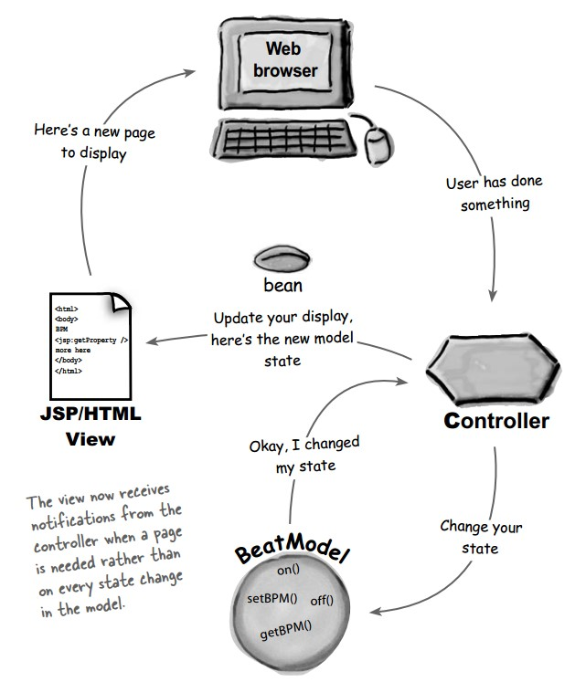 </div><br>

# 十七、与设计模式相处

## 定义

在某情境下，针对某问题的某种解决方案。

## 何时使用

过度使用设计模式可能导致代码被过度工程化，应该总是用最简单的解决方案完成工作，并在真正需要模式的地方才使用它。

## 反模式

不好的解决方案来解决一个问题。主要作用是为了警告人们不要使用这些解决方案。

## 模式分类

<div align="center">  </div><br>
