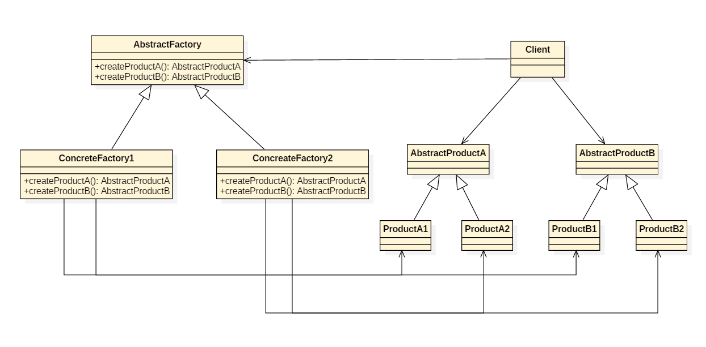

<!-- GFM-TOC -->
* [一、概述](#一概述)
* [二、单例模式](#二单例模式)
* [三、简单工厂](#三简单工厂)
* [四、工厂方法模式](#四工厂方法模式)
* [五、抽象工厂模式](#五抽象工厂模式)
* [参考资料](#参考资料)
<!-- GFM-TOC -->


# 一、概述

设计模式不是代码，而是解决问题的方案，学习现有的设计模式可以做到经验复用。

拥有设计模式词汇，在沟通时就能用更少的词汇来讨论，并且不需要了解底层细节。

# 二、单例模式

## 意图

确保一个类只有一个实例，并提供了一个全局访问点。

## 类图

使用一个私有构造函数、一个私有静态变量以及一个公有静态函数来实现。

私有构造函数保证了不能通过构造函数来创建对象实例，只能通过公有静态函数返回唯一的私有静态变量。

<div align="center">  </div><br>

## 使用场景

- Logger Classes
- Configuration Classes
- Accesing resources in shared mode
- Factories implemented as Singletons

## JDK 的使用

- [java.lang.Runtime#getRuntime()](http://docs.oracle.com/javase/8/docs/api/java/lang/Runtime.html#getRuntime%28%29)
- [java.awt.Desktop#getDesktop()](http://docs.oracle.com/javase/8/docs/api/java/awt/Desktop.html#getDesktop--)
- [java.lang.System#getSecurityManager()](http://docs.oracle.com/javase/8/docs/api/java/lang/System.html#getSecurityManager--)

## 实现

### 懒汉式-线程不安全

以下实现中，私有静态变量 uniqueInstance 被延迟化实例化，这样做的好处是，如果没有用到该类，那么就不会实例化 uniqueInstance，从而节约资源。

这个实现在多线程环境下是不安全的，如果多个线程能够同时进入 if (uniqueInstance == null) ，并且此时 uniqueInstance 为 null，那么多个线程会执行 uniqueInstance = new Singleton(); 语句，这将导致实例化多次 uniqueInstance。

```java
public class Singleton {

    private static Singleton uniqueInstance;

    private Singleton() {
    }

    public static Singleton getUniqueInstance() {
        if (uniqueInstance == null) {
            uniqueInstance = new Singleton();
        }
        return uniqueInstance;
    }
}
```

### 懒汉式-线程安全

只需要对 getUniqueInstance() 方法加锁，那么在一个时间点只能有一个线程能够进入该方法，从而避免了对 uniqueInstance 进行多次实例化的问题。

但是这样有一个问题，就是当一个线程进入该方法之后，其它线程试图进入该方法都必须等待，因此性能上有一定的损耗。

```java
public static synchronized Singleton getUniqueInstance() {
    if (uniqueInstance == null) {
        uniqueInstance = new Singleton();
    }
    return uniqueInstance;
}
```

### 饿汉式-线程安全

线程不安全问题主要是由于 uniqueInstance 被实例化了多次，如果 uniqueInstance 采用直接实例化的话，就不会被实例化多次，也就不会产生线程不安全问题。但是直接实例化的方式也丢失了延迟实例化带来的节约资源的优势。

```java
private static Singleton uniqueInstance = new Singleton();
```

### 双重校验锁-线程安全

uniqueInstance 只需要被实例化一次，之后就可以直接使用了。加锁操作只需要对实例化那部分的代码进行。也就是说，只有当 uniqueInstance 没有被实例化时，才需要进行加锁。

双重校验锁先判断 uniqueInstance 是否已经被初始化了，如果没有被实例化，那么才对实例化语句进行加锁。

```java
public class Singleton {

    private volatile static Singleton uniqueInstance;

    private Singleton() {
    }

    public static Singleton getUniqueInstance() {
        if (uniqueInstance == null) {
            synchronized (Singleton.class) {
                if (uniqueInstance == null) {
                    uniqueInstance = new Singleton();
                }
            }
        }
        return uniqueInstance;
    }
}
```

考虑下面的实现，也就是只使用了一个 if 语句。在 uniqueInstance == null 的情况下，如果两个线程同时执行 if 语句，那么两个线程就会同时进入 if 语句块内。虽然在 if 语句块内有加锁操作，但是两个线程都会执行 uniqueInstance = new Singleton(); 这条语句，只是早晚的问题，也就是说会进行两次实例化，从而产生了两个实例。因此必须使用双重校验锁，也就是需要使用两个 if 判断。

```java
if (uniqueInstance == null) {
    synchronized (Singleton.class) {
        uniqueInstance = new Singleton();
    }
}
```

uniqueInstance 采用 volatile 关键字修饰也是很有必要的。

uniqueInstance = new Singleton(); 这段代码其实是分为三步执行。

1.  分配内存空间。
2.  初始化对象。
3.  将 uniqueInstance 指向分配的内存地址。

但是由于 JVM 具有指令重排的特性，有可能执行顺序变为了 1>3>2，这在单线程情况下自然是没有问题。但如果是多线程就有可能 B 线程获得是一个还没有被初始化的对象以致于程序出错。

所以使用 volatile 修饰的目的是禁止 JVM 的指令重排，保证在多线程环境下也能正常运行。

# 三、简单工厂

## 意图

在创建一个对象时不向客户暴露内部细节；

## 类图

简单工厂不是设计模式，更像是一种编程习惯。它把实例化的操作单独放到一个类中，这个类就成为简单工厂类，让简单工厂类来决定应该用哪个子类来实例化。

<div align="center">  </div><br>

这样做能把客户类和具体子类的实现解耦，客户类不再需要知道有哪些子类以及应当实例化哪个子类。因为客户类往往有多个，如果不使用简单工厂，所有的客户类都要知道所有子类的细节。而且一旦子类发生改变，例如增加子类，那么所有的客户类都要进行修改。

如果存在下面这种代码，就需要使用简单工厂将对象实例化的部分放到简单工厂中。

```java
public class Client {
    public static void main(String[] args) {
        int type = 1;
        Product product;
        if (type == 1) {
            product = new ConcreteProduct1();
        } else if (type == 2) {
            product = new ConcreteProduct2();
        } else {
            product = new ConcreteProduct();
        }
    }
}
```

## 实现

```java
public interface Product {
}
```

```java
public class ConcreteProduct implements Product {
}
```

```java
public class ConcreteProduct1 implements Product {
}
```

```java
public class ConcreteProduct2 implements Product {
}
```

```java
public class SimpleFactory {
    public Product createProduct(int type) {
        if (type == 1) {
            return new ConcreteProduct1();
        } else if (type == 2) {
            return new ConcreteProduct2();
        }
        return new ConcreteProduct();
    }
}
```

```java
public class Client {
    public static void main(String[] args) {
        SimpleFactory simpleFactory = new SimpleFactory();
        Product product = simpleFactory.createProduct(1);
    }
}
```

# 四、工厂方法模式

## 意图

定义了一个创建对象的接口，但由子类决定要实例化哪个类。工厂方法把实例化推迟到子类。

## 类图

在简单工厂中，创建对象的是另一个类，而在工厂方法中，是由子类来创建对象。

下图中，Factory 有一个 doSomethind() 方法，这个方法需要用到一组产品对象，这组产品对象由 factoryMethod() 方法创建。该方法是抽象的，需要由子类去实现。

<div align="center">  </div><br>

## 实现

```java
public abstract class Factory {
    abstract public Product factoryMethod();
    public void doSomething() {
        Product product = factoryMethod();
        // do something with the product
    }
}
```

```java
public class ConcreteFactory extends Factory {
    public Product factoryMethod() {
        return new ConcreteProduct();
    }
}
```

```java
public class ConcreteFactory1 extends Factory {
    public Product factoryMethod() {
        return new ConcreteProduct1();
    }
}
```

```java
public class ConcreteFactory2 extends Factory {
    public Product factoryMethod() {
        return new ConcreteProduct2();
    }
}
```

# 五、抽象工厂模式

## 意图

提供一个接口，用于创建  **相关的对象家族** 。

## 类图

<div align="center">  </div><br>

抽象工厂模式创建的是对象家族，也就是很多对象而不是一个对象，并且这些对象是相关的，也就是说必须一起创建出来。而工厂模式只是用于创建一个对象，这和抽象工厂模式有很大不同。

抽象工厂模式用到了工厂模式来创建单一对象，AbstractFactory 中的 createProductA 和 createProductB 方法都是让子类来实现，这两个方法单独来看就是在创建一个对象，这符合工厂模式的定义。

至于创建对象的家族这一概念是在 Client 体现，Client 要通过 AbstractFactory 同时调用两个方法来创建出两个对象，在这里这两个对象就有很大的相关性，Client 需要同时创建出这两个对象。

从高层次来看，抽象工厂使用了组合，即 Cilent 组合了 AbstractFactory，而工厂模式使用了继承。

## 代码实现

```java
public class AbstractProductA {
}
```

```java
public class AbstractProductB {
}
```

```java
public class ProductA1 extends AbstractProductA {
}
```

```java
public class ProductA2 extends AbstractProductA {
}
```

```java
public class ProductB1 extends AbstractProductB {
}
```

```java
public class ProductB2 extends AbstractProductB {
}
```

```java
public abstract class AbstractFactory {
    abstract AbstractProductA createProductA();
    abstract AbstractProductB createProductB();
}
```

```java
public class ConcreteFactory1 extends AbstractFactory {
    AbstractProductA createProductA() {
        return new ProductA1();
    }

    AbstractProductB createProductB() {
        return new ProductB1();
    }
}
```

```java
public class ConcreteFactory2 extends AbstractFactory {
    AbstractProductA createProductA() {
        return new ProductA2();
    }

    AbstractProductB createProductB() {
        return new ProductB2();
    }
}
```

```java
public class Client {
    public static void main(String[] args) {
        AbstractFactory abstractFactory = new ConcreteFactory1();
        AbstractProductA productA = abstractFactory.createProductA();
        AbstractProductB productB = abstractFactory.createProductB();
        // do something with productA and productB
    }
}
```

# 参考资料

- 弗里曼. Head First 设计模式 [M]. 中国电力出版社, 2007.
- [Design Patterns](http://www.oodesign.com/)
- [Design patterns implemented in Java](http://java-design-patterns.com/)
